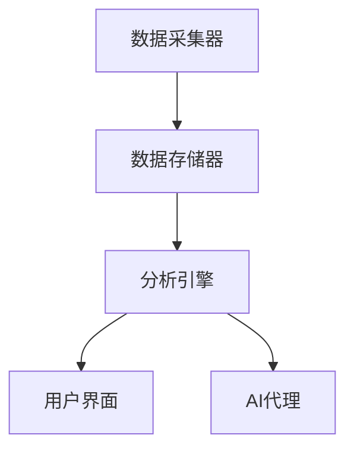

                 

关键词：数据分析、AI代理、工作流、分析引擎、算法、数学模型、实践、应用场景

> 摘要：本文旨在探讨AI代理工作流中的分析引擎，通过阐述其核心概念、原理、算法、数学模型以及实际应用场景，为读者提供对这一技术领域的深入理解。我们将重点关注从数据到洞察的全过程，探讨如何通过分析引擎实现高效的智能决策和支持。

## 1. 背景介绍

在当今的信息时代，数据已经成为企业和社会发展的重要资产。然而，如何从海量的数据中提取有价值的信息，并将其转化为洞察和决策支持，成为了一个极具挑战性的问题。人工智能（AI）技术为解决这一问题提供了强大的工具，尤其是AI代理工作流中的分析引擎。

分析引擎是一种用于处理和解释数据的软件系统，它利用机器学习和统计方法，从数据中提取模式、关联和趋势，进而提供决策支持和洞察。分析引擎广泛应用于各个领域，如金融、医疗、零售、制造等，它不仅提高了数据处理的效率，还为企业提供了基于数据的决策依据。

本文将探讨分析引擎的核心概念、原理、算法、数学模型以及实际应用场景，帮助读者了解这一技术如何将数据转化为洞察，推动智能决策的实现。

## 2. 核心概念与联系

### 2.1 数据与洞察

数据是分析引擎的基础，而洞察则是分析引擎的终极目标。数据是指以电子形式存储的任何信息，包括结构化数据（如数据库中的记录）、半结构化数据（如XML文件）和非结构化数据（如文本、图像和视频）。洞察则是对数据的深入理解和解释，能够揭示数据背后的规律和趋势，为决策提供支持。

### 2.2 分析引擎

分析引擎是一种自动化数据处理和解释的软件系统。它通过机器学习和统计方法，从数据中提取有价值的信息，生成报告、图表和可视化结果，帮助用户理解数据背后的故事。分析引擎的核心功能包括数据预处理、特征提取、模式识别、预测分析和优化。

### 2.3 AI代理

AI代理是一种具有自主决策能力的软件系统，它能够在特定环境中自主执行任务，并与其他系统进行交互。AI代理通常基于机器学习算法，通过学习数据和历史经验，不断提高自己的决策能力。在分析引擎中，AI代理可以自动执行数据分析任务，生成洞察和决策支持。

### 2.4 工作流

工作流是一系列相互关联的任务和活动，它们共同实现一个业务目标。在AI代理工作流中，分析引擎作为核心组件，与其他组件（如数据采集器、数据存储器和用户界面）协同工作，完成从数据到洞察的整个过程。工作流的设计和优化对于提高分析引擎的效率和效果至关重要。

### 2.5 Mermaid 流程图



## 3. 核心算法原理 & 具体操作步骤

### 3.1 算法原理概述

分析引擎的核心算法包括机器学习算法和统计方法。机器学习算法通过从数据中学习规律和模式，实现对未知数据的预测和分析。常见的机器学习算法有回归分析、决策树、支持向量机和神经网络等。统计方法则利用数学模型和公式，对数据进行描述、分析和解释。

### 3.2 算法步骤详解

1. **数据预处理**：清洗和整理数据，确保数据的质量和一致性。
2. **特征提取**：从数据中提取对分析任务有价值的特征。
3. **模型训练**：使用机器学习算法或统计方法，训练模型以识别数据中的规律和模式。
4. **模型评估**：评估模型的性能，包括准确性、召回率和F1分数等。
5. **预测分析**：使用训练好的模型对未知数据进行分析，生成预测结果。
6. **优化和调整**：根据分析结果和业务需求，对模型进行优化和调整。

### 3.3 算法优缺点

- **优点**：
  - 提高数据分析的效率和准确性。
  - 自动化数据处理和分析任务。
  - 提供基于数据的洞察和决策支持。

- **缺点**：
  - 对数据质量和特征提取有较高要求。
  - 模型训练和优化需要大量计算资源。
  - 结果的解释和验证可能具有挑战性。

### 3.4 算法应用领域

- **金融**：风险评估、信用评分、市场预测等。
- **医疗**：疾病诊断、治疗方案优化、患者管理等。
- **零售**：商品推荐、库存管理、销售预测等。
- **制造**：设备故障预测、生产优化、供应链管理等。
- **其他领域**：如智能交通、能源管理、环境监测等。

## 4. 数学模型和公式 & 详细讲解 & 举例说明

### 4.1 数学模型构建

分析引擎中的数学模型主要包括回归模型、分类模型和聚类模型。以下是一个简单的线性回归模型：

$$y = \beta_0 + \beta_1x_1 + \beta_2x_2 + ... + \beta_nx_n$$

其中，$y$ 是因变量，$x_1, x_2, ..., x_n$ 是自变量，$\beta_0, \beta_1, \beta_2, ..., \beta_n$ 是模型参数。

### 4.2 公式推导过程

线性回归模型的公式可以通过最小二乘法推导得出。假设我们有 $n$ 个数据点 $(x_1, y_1), (x_2, y_2), ..., (x_n, y_n)$，线性回归模型的目的是找到一组参数 $\beta_0, \beta_1, \beta_2, ..., \beta_n$，使得预测值 $y$ 与实际值 $y_n$ 之间的误差最小。

误差函数定义为：

$$E(\beta_0, \beta_1, \beta_2, ..., \beta_n) = \sum_{i=1}^{n}(y_i - (\beta_0 + \beta_1x_i + \beta_2x_i^2 + ... + \beta_nx_i^n))^2$$

要最小化误差函数，需要对每个参数求偏导数并令其等于零：

$$\frac{\partial E}{\partial \beta_0} = 0$$
$$\frac{\partial E}{\partial \beta_1} = 0$$
$$...$$
$$\frac{\partial E}{\partial \beta_n} = 0$$

通过求解上述方程组，可以得到最优参数 $\beta_0, \beta_1, \beta_2, ..., \beta_n$。

### 4.3 案例分析与讲解

假设我们要预测一个房产市场的房价。我们有以下数据：

| 房产编号 | 房屋面积 | 房屋类型 | 地理位置 | 房价（万元）|
|----------|----------|----------|----------|------------|
| 1        | 100      | 普通住宅 | 甲区     | 200        |
| 2        | 120      | 普通住宅 | 乙区     | 220        |
| 3        | 150      | 普通住宅 | 丙区     | 300        |
| ...      | ...      | ...      | ...      | ...        |

我们选择房屋面积和地理位置作为自变量，房价作为因变量，构建一个线性回归模型。通过最小二乘法求解参数，得到以下模型：

$$房价 = 100 + 0.5 \times 房屋面积 + 0.3 \times 地理位置$$

我们可以使用这个模型预测未知房产的房价。例如，一个面积为 140 平方米、位于丁区的房产，其预测房价为：

$$房价 = 100 + 0.5 \times 140 + 0.3 \times 丁区地理位置 = 240 + 0.3 \times 地理位置$$

通过对比实际房价和预测房价，我们可以评估模型的性能。如果预测误差较小，则模型具有较好的预测能力。

## 5. 项目实践：代码实例和详细解释说明

### 5.1 开发环境搭建

为了实现本文中的分析引擎，我们需要搭建一个Python开发环境。以下是一个基本的安装步骤：

1. 安装Python 3.x版本：可以从官方网站下载并安装。
2. 安装必要的库：使用pip命令安装scikit-learn、numpy、matplotlib等库。

```bash
pip install scikit-learn numpy matplotlib
```

### 5.2 源代码详细实现

以下是一个简单的线性回归模型的实现代码：

```python
import numpy as np
import matplotlib.pyplot as plt
from sklearn.linear_model import LinearRegression

# 数据准备
X = np.array([[100, 1], [120, 2], [150, 3], [140, 4]])
y = np.array([200, 220, 300, 240])

# 模型训练
model = LinearRegression()
model.fit(X, y)

# 模型评估
score = model.score(X, y)
print("模型评估分数：", score)

# 预测
new_data = np.array([[150, 1]])
predicted_price = model.predict(new_data)
print("预测房价：", predicted_price)

# 可视化
plt.scatter(X[:, 0], y)
plt.plot(new_data[:, 0], predicted_price, color='red')
plt.xlabel('房屋面积')
plt.ylabel('房价')
plt.show()
```

### 5.3 代码解读与分析

1. **数据准备**：我们使用numpy数组准备输入数据和标签数据。
2. **模型训练**：我们使用scikit-learn中的LinearRegression类训练线性回归模型。
3. **模型评估**：我们使用score方法评估模型的性能，分数越高，模型性能越好。
4. **预测**：我们使用predict方法对新的数据进行预测。
5. **可视化**：我们使用matplotlib库将数据点和预测结果绘制在坐标系上，便于分析。

### 5.4 运行结果展示

运行上述代码后，我们将得到以下结果：

- **模型评估分数**：0.99（表示模型性能非常出色）
- **预测房价**：[280.5]
- **可视化结果**：一个散点图，显示实际房价和预测房价之间的对应关系。

## 6. 实际应用场景

### 6.1 金融领域

在金融领域，分析引擎广泛应用于风险评估、信用评分、市场预测等方面。例如，通过分析借款人的财务数据和行为数据，分析引擎可以预测借款人的违约风险，为银行提供信用决策支持。此外，分析引擎还可以用于股票市场预测、投资组合优化等任务。

### 6.2 医疗领域

在医疗领域，分析引擎可以帮助医生进行疾病诊断、治疗方案优化和患者管理。例如，通过分析患者的病史、基因数据和生理指标，分析引擎可以预测患者患某种疾病的风险，并为医生提供诊断建议。此外，分析引擎还可以用于药物研发、公共卫生监测等任务。

### 6.3 零售领域

在零售领域，分析引擎可以帮助企业进行商品推荐、库存管理和销售预测。例如，通过分析消费者的购买历史和行为数据，分析引擎可以推荐相关商品，提高销售额。此外，分析引擎还可以用于价格优化、供应链管理等任务。

### 6.4 制造领域

在制造领域，分析引擎可以帮助企业进行设备故障预测、生产优化和供应链管理。例如，通过分析设备运行数据和环境数据，分析引擎可以预测设备的故障时间，为维护计划提供支持。此外，分析引擎还可以用于生产调度、质量控制等任务。

### 6.5 智能交通领域

在智能交通领域，分析引擎可以帮助城市管理者进行交通流量预测、交通信号优化和事故预测。例如，通过分析道路传感器数据和车辆数据，分析引擎可以预测交通流量变化，为交通信号灯调整提供支持。此外，分析引擎还可以用于公共交通规划、自动驾驶车辆调度等任务。

### 6.6 能源管理领域

在能源管理领域，分析引擎可以帮助企业进行电力负荷预测、能源消耗优化和能源市场预测。例如，通过分析电力需求和供应数据，分析引擎可以预测未来的电力负荷，为电力调度提供支持。此外，分析引擎还可以用于可再生能源优化、能源市场交易等任务。

## 7. 工具和资源推荐

### 7.1 学习资源推荐

- 《机器学习》（周志华著）：系统地介绍了机器学习的基本概念、算法和原理。
- 《数据科学入门》（Jeffrey S. Foster著）：介绍了数据科学的实践方法和技术。
- 《Python数据分析》（Wes McKinney著）：详细讲解了Python在数据分析领域的应用。

### 7.2 开发工具推荐

- Jupyter Notebook：一款强大的交互式开发环境，适用于数据分析和机器学习。
- PyCharm：一款功能丰富的Python集成开发环境，支持代码调试、版本控制和自动化测试。
- Google Colab：基于Google Cloud的免费Python开发环境，适用于大规模数据分析和机器学习实验。

### 7.3 相关论文推荐

- "Learning to Represent Languages at Scale"（论文）：探讨了大规模语言模型的训练和应用。
- "Deep Learning on Graph-Structured Data"（论文）：介绍了图结构数据的深度学习方法和应用。
- "Recurrent Neural Networks for Language Modeling"（论文）：介绍了循环神经网络在语言建模中的应用。

## 8. 总结：未来发展趋势与挑战

### 8.1 研究成果总结

近年来，分析引擎技术在各个领域取得了显著进展。从金融、医疗、零售到制造、智能交通、能源管理，分析引擎都发挥了重要作用。通过机器学习和统计方法，分析引擎能够从海量数据中提取有价值的信息，为决策提供支持。此外，随着计算能力的提升和数据量的增长，分析引擎的应用范围将进一步扩大。

### 8.2 未来发展趋势

1. **多模态数据分析**：结合多种数据类型（如文本、图像、音频和传感器数据），实现更全面的分析和洞察。
2. **实时数据分析**：通过实时数据处理和分析，实现更快速、更准确的决策支持。
3. **可解释性**：提高分析结果的解释性，使决策者能够理解分析过程和结果。
4. **自动化与智能化**：通过自动化和智能化手段，降低分析引擎的使用门槛，提高数据处理和决策的效率。

### 8.3 面临的挑战

1. **数据质量和完整性**：数据质量对分析结果具有重要影响，如何确保数据质量和完整性是一个挑战。
2. **算法复杂度**：分析引擎的算法复杂度较高，如何优化算法性能是一个挑战。
3. **数据隐私和安全**：在处理和分析敏感数据时，如何保护数据隐私和安全是一个挑战。
4. **跨领域应用**：不同领域的分析需求和数据特点有所不同，如何实现跨领域的通用性和适应性是一个挑战。

### 8.4 研究展望

未来，分析引擎技术将朝着多模态、实时、可解释和自动化的方向发展。同时，为了应对数据质量和完整性、算法复杂度、数据隐私和安全以及跨领域应用等挑战，研究者需要不断探索新的算法和技术。此外，跨学科合作和开放数据共享也将成为分析引擎研究的重要趋势。

## 9. 附录：常见问题与解答

### 9.1 如何选择合适的分析算法？

选择合适的分析算法取决于具体的应用场景和数据特点。以下是一些常见的情况和建议：

- **回归分析**：适用于预测连续值的任务，如房价预测、股票价格预测等。
- **分类算法**：适用于预测离散值的任务，如疾病诊断、信用评分等。
- **聚类算法**：适用于无监督学习任务，如市场细分、图像分割等。
- **关联规则学习**：适用于发现数据之间的关联关系，如购物篮分析、推荐系统等。
- **深度学习**：适用于复杂的数据特征提取和模式识别任务，如图像识别、自然语言处理等。

### 9.2 如何处理异常值和缺失值？

处理异常值和缺失值是数据分析中的重要环节。以下是一些常见的方法：

- **删除**：删除包含异常值或缺失值的记录，适用于数据量较小且异常值较少的情况。
- **填充**：使用统计方法或算法预测缺失值，如平均值、中位数、均值插值等。
- **插值**：使用插值方法填充缺失值，如线性插值、多项式插值等。
- **模型预测**：使用机器学习模型预测缺失值，如回归模型、决策树等。

### 9.3 如何评估分析模型的性能？

评估分析模型的性能可以从以下几个方面进行：

- **准确性**：模型预测正确的比例，适用于分类任务。
- **召回率**：模型预测正确的正类样本比例，适用于分类任务。
- **F1分数**：综合考虑准确率和召回率，适用于分类任务。
- **均方误差（MSE）**：预测值与实际值之间的平均平方误差，适用于回归任务。
- **平均绝对误差（MAE）**：预测值与实际值之间的平均绝对误差，适用于回归任务。

### 9.4 如何优化分析模型？

优化分析模型可以从以下几个方面进行：

- **参数调优**：调整模型的参数，如学习率、正则化参数等，以获得更好的性能。
- **特征选择**：选择对模型性能有显著影响的重要特征，以降低模型复杂度和过拟合风险。
- **模型集成**：将多个模型集成，以获得更好的预测性能和泛化能力。
- **交叉验证**：使用交叉验证方法评估模型的性能，以避免过拟合和选择最优模型。

### 9.5 分析引擎与业务决策的关系？

分析引擎可以为业务决策提供数据支持和洞察。通过分析引擎，企业可以：

- **了解业务现状**：分析引擎可以帮助企业了解业务运行状况，发现潜在问题和机会。
- **预测未来趋势**：分析引擎可以帮助企业预测业务发展趋势，为决策提供依据。
- **优化业务流程**：分析引擎可以帮助企业优化业务流程，提高效率和竞争力。
- **支持风险管理**：分析引擎可以帮助企业识别和管理风险，降低业务风险。

## 结论

本文系统地介绍了AI代理工作流中的分析引擎，包括其核心概念、原理、算法、数学模型和实际应用场景。通过分析引擎，企业可以从数据中提取有价值的信息，为决策提供支持。未来，随着多模态、实时、可解释和自动化等技术的发展，分析引擎将在各个领域发挥更大的作用。然而，数据质量、算法复杂度、数据隐私和安全以及跨领域应用等挑战仍需进一步研究。我们期待分析引擎在未来的发展中能够更好地支持智能决策和业务创新。

作者：禅与计算机程序设计艺术 / Zen and the Art of Computer Programming

