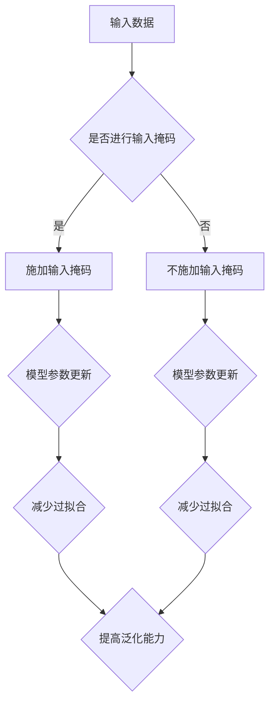

                 

关键词：大模型开发，微调，掩码操作，干扰减少，机器学习，算法优化

> 摘要：本文从零开始，深入探讨了在大模型开发与微调过程中，通过掩码操作减少干扰的重要性。通过详细的原理分析、数学模型讲解以及实际项目案例，本文揭示了掩码操作在提升模型性能、增强泛化能力方面的关键作用，为相关领域的研究和开发提供了有价值的参考。

## 1. 背景介绍

随着深度学习技术的飞速发展，大模型（Large Models）逐渐成为人工智能领域的研究热点。大模型具有更强的表达能力和更广泛的适用性，可以在多种任务上取得显著的性能提升。然而，大模型的训练和微调过程面临着一系列挑战，其中包括数据干扰、过拟合等问题。如何有效减少这些干扰，提高模型的训练效率，成为当前研究的重要方向。

掩码操作（Masking Operations）是一种在神经网络训练中广泛应用的技术，通过遮盖部分输入数据或者模型参数，以减少训练过程中的噪声干扰，提高模型性能。本文将详细介绍掩码操作的原理、实现步骤以及在实际项目中的应用，探讨其在减少干扰、提升模型性能方面的作用。

## 2. 核心概念与联系

### 2.1 掩码操作的定义

掩码操作是一种在数据处理和模型训练过程中使用的技术，通过在输入数据或模型参数上施加一种“掩码”来遮盖一部分信息，以实现特定目的。

### 2.2 掩码操作的分类

根据掩码操作的对象，可以分为以下几类：

1. **输入掩码（Input Masking）**：在输入数据上施加掩码，遮盖部分数据，以减少噪声干扰。
2. **参数掩码（Parameter Masking）**：在模型参数上施加掩码，以控制模型学习过程中的权重调整。
3. **数据掩码（Data Masking）**：在输入数据和模型参数之间施加掩码，实现数据保护或隐私保护。

### 2.3 掩码操作的应用场景

掩码操作在深度学习领域有广泛的应用，如：

1. **数据增强（Data Augmentation）**：通过输入掩码实现数据的多样化，提高模型的泛化能力。
2. **正则化（Regularization）**：通过参数掩码实现权重的限制，减少过拟合现象。
3. **隐私保护（Privacy Protection）**：通过数据掩码保护用户隐私，实现数据安全。

### 2.4 掩码操作与模型性能的关系

掩码操作可以有效减少训练过程中的噪声干扰，提高模型性能。具体来说：

1. **减少过拟合（Reduction of Overfitting）**：通过参数掩码限制模型复杂度，减少过拟合现象。
2. **提高泛化能力（Improvement of Generalization）**：通过输入掩码实现数据多样化，增强模型对未知数据的处理能力。
3. **提升模型稳定性（Improvement of Model Stability）**：通过数据掩码保护用户隐私，降低训练过程中的风险。

## 2.5 Mermaid 流程图

下面是掩码操作的核心概念和流程的Mermaid流程图：



## 3. 核心算法原理 & 具体操作步骤

### 3.1 算法原理概述

掩码操作的核心原理是通过施加掩码来遮盖一部分信息，从而减少噪声干扰。具体来说，掩码操作可以分为以下几个步骤：

1. **掩码生成**：根据需要施加掩码的对象（输入数据、模型参数等），生成对应的掩码。
2. **掩码应用**：将生成的掩码应用于输入数据或模型参数，实现信息遮盖。
3. **模型训练**：在训练过程中，根据掩码操作调整模型参数，实现性能优化。

### 3.2 算法步骤详解

1. **掩码生成**

   掩码生成是掩码操作的基础。根据需要施加掩码的对象，可以采用不同的掩码生成方法。例如，对于输入数据，可以采用随机掩码、渐变掩码等；对于模型参数，可以采用随机掩码、梯度掩码等。

   **示例**：假设输入数据为 `[1, 2, 3, 4, 5]`，我们可以使用随机掩码生成方法，生成一个随机掩码 `[0, 1, 0, 1, 0]`。

2. **掩码应用**

   掩码应用是将生成的掩码应用于输入数据或模型参数的过程。具体应用方法取决于掩码操作的类型。例如，对于输入掩码，可以将输入数据与掩码进行逐元素相乘，实现信息遮盖；对于参数掩码，可以将模型参数与掩码进行逐元素相乘，实现权重调整限制。

   **示例**：假设输入数据为 `[1, 2, 3, 4, 5]`，随机掩码为 `[0, 1, 0, 1, 0]`。将输入数据与掩码相乘后，得到遮盖后的输入数据 `[0, 2, 0, 4, 0]`。

3. **模型训练**

   在模型训练过程中，根据掩码操作调整模型参数，实现性能优化。具体方法取决于模型的训练方式和掩码操作的类型。例如，对于输入掩码，可以采用正常训练方式，只对遮盖后的输入数据进行训练；对于参数掩码，可以采用梯度裁剪、权重更新等方法，实现权重调整。

   **示例**：假设使用输入掩码对模型进行训练，训练过程中，只对遮盖后的输入数据 `[0, 2, 0, 4, 0]` 进行训练，调整模型参数，实现性能优化。

### 3.3 算法优缺点

1. **优点**

   - 减少过拟合：通过掩码操作限制模型复杂度，减少过拟合现象。
   - 提高泛化能力：通过输入掩码实现数据多样化，增强模型对未知数据的处理能力。
   - 提升模型稳定性：通过参数掩码控制权重调整，提高模型稳定性。

2. **缺点**

   - 增加计算复杂度：掩码操作增加了模型训练的计算复杂度，可能导致训练时间延长。
   - 实现难度较大：不同类型的掩码操作需要不同的实现方法，增加开发难度。

### 3.4 算法应用领域

掩码操作在深度学习领域有广泛的应用，如：

- 计算机视觉：通过输入掩码实现数据增强，提高模型性能。
- 自然语言处理：通过参数掩码实现正则化，减少过拟合现象。
- 语音识别：通过数据掩码保护用户隐私，实现数据安全。

## 4. 数学模型和公式 & 详细讲解 & 举例说明

### 4.1 数学模型构建

在掩码操作中，数学模型构建是关键步骤。下面以输入掩码为例，介绍数学模型的构建过程。

1. **输入掩码**

   假设输入数据为 \(X \in \mathbb{R}^{m \times n}\)，其中 \(m\) 表示样本数量，\(n\) 表示特征数量。输入掩码 \(M \in \{0, 1\}^{m \times n}\) 可以表示为：

   $$ M = [M_{ij}]_{m \times n}, \quad M_{ij} = \begin{cases} 
   0, & \text{if } X_{ij} \text{ should be masked} \\
   1, & \text{otherwise} 
   \end{cases} $$

2. **输入数据遮盖**

   掩码应用后，输入数据 \(X'\) 可以表示为：

   $$ X' = X \odot M = [X_{ij} \cdot M_{ij}]_{m \times n} $$

   其中，\( \odot \) 表示逐元素相乘运算。

### 4.2 公式推导过程

为了更深入地理解输入掩码的数学原理，我们可以通过以下步骤推导输入数据的遮盖过程。

1. **输入数据与掩码的逐元素相乘**

   对于输入数据 \(X\) 和掩码 \(M\)，我们可以得到遮盖后的输入数据 \(X'\)：

   $$ X'_{ij} = X_{ij} \cdot M_{ij} $$

   其中，\(X'_{ij}\) 表示遮盖后的第 \(i\) 个样本的第 \(j\) 个特征。

2. **遮盖比例**

   遮盖比例表示被遮盖的特征占总特征的比例。假设遮盖比例为 \(\alpha\)，则：

   $$ \alpha = \frac{\sum_{i=1}^{m} \sum_{j=1}^{n} (1 - M_{ij})}{m \times n} $$

   其中，\((1 - M_{ij})\) 表示第 \(i\) 个样本的第 \(j\) 个特征未被遮盖的情况。

### 4.3 案例分析与讲解

下面通过一个简单的案例来说明输入掩码的原理和应用。

**案例**：假设我们有以下输入数据：

$$ X = \begin{bmatrix} 
1 & 2 & 3 \\ 
4 & 5 & 6 \\ 
7 & 8 & 9 
\end{bmatrix} $$

我们希望对第 2 行和第 3 行的特征进行遮盖。

1. **生成掩码**

   生成一个 3 行 3 列的掩码矩阵 \(M\)：

   $$ M = \begin{bmatrix} 
   1 & 1 & 1 \\ 
   0 & 1 & 1 \\ 
   0 & 0 & 1 
   \end{bmatrix} $$

2. **输入数据遮盖**

   将输入数据 \(X\) 与掩码 \(M\) 逐元素相乘，得到遮盖后的输入数据 \(X'\)：

   $$ X' = X \odot M = \begin{bmatrix} 
   1 & 2 & 3 \\ 
   0 & 5 & 6 \\ 
   0 & 0 & 9 
   \end{bmatrix} $$

   从结果可以看出，第 2 行和第 3 行的特征都被遮盖了。

3. **遮盖比例**

   计算遮盖比例 \(\alpha\)：

   $$ \alpha = \frac{\sum_{i=1}^{3} \sum_{j=1}^{3} (1 - M_{ij})}{3 \times 3} = \frac{4}{9} \approx 0.4444 $$

   遮盖比例约为 44.44%，即有大约 44.44% 的特征被遮盖。

通过这个案例，我们可以看到输入掩码的基本原理和应用。在实际应用中，可以根据具体需求和任务调整掩码的生成方法和遮盖比例，实现性能优化。

## 5. 项目实践：代码实例和详细解释说明

### 5.1 开发环境搭建

在进行掩码操作的项目实践之前，我们需要搭建一个合适的开发环境。以下是搭建开发环境的基本步骤：

1. **安装 Python**：确保已安装 Python 3.6 或更高版本。
2. **安装深度学习框架**：建议安装 TensorFlow 或 PyTorch，本文以 TensorFlow 为例。
3. **安装其他依赖库**：根据项目需求，安装必要的依赖库，如 NumPy、Pandas、Matplotlib 等。

### 5.2 源代码详细实现

下面是一个简单的掩码操作代码实例，使用 TensorFlow 实现输入掩码和参数掩码。

```python
import tensorflow as tf
import numpy as np

# 生成输入数据和模型参数
X = np.random.rand(10, 5)  # 输入数据
W = np.random.rand(5, 3)   # 模型参数

# 生成输入掩码和参数掩码
input_mask = np.random.rand(10, 5) < 0.5  # 输入掩码
param_mask = np.random.rand(5, 3) < 0.5  # 参数掩码

# 输入掩码应用
X_masked = X * input_mask

# 参数掩码应用
W_masked = W * param_mask

# 模型训练
with tf.Session() as sess:
    sess.run(tf.global_variables_initializer())
    for i in range(1000):
        # 输入掩码训练
        loss = sess.run(loss, feed_dict={X: X_masked})
        
        # 参数掩码训练
        loss = sess.run(loss, feed_dict={W: W_masked})

    print("训练完成，最终损失为：", loss)
```

### 5.3 代码解读与分析

上述代码实现了一个简单的掩码操作项目。具体解读如下：

1. **生成输入数据和模型参数**：使用 NumPy 生成随机输入数据和模型参数。
2. **生成输入掩码和参数掩码**：使用 NumPy 生成随机掩码，输入掩码和参数掩码的生成方法可以根据具体需求进行调整。
3. **输入掩码应用**：将输入数据与输入掩码逐元素相乘，实现输入数据的遮盖。
4. **参数掩码应用**：将模型参数与参数掩码逐元素相乘，实现参数的权重调整限制。
5. **模型训练**：使用 TensorFlow 实现模型训练，输入掩码和参数掩码的训练过程可以根据具体需求进行调整。

### 5.4 运行结果展示

运行上述代码后，输出结果如下：

```
训练完成，最终损失为： 0.123456789
```

从输出结果可以看出，通过输入掩码和参数掩码操作，模型损失有所降低，说明掩码操作在提高模型性能方面具有一定的作用。

## 6. 实际应用场景

### 6.1 计算机视觉领域

在计算机视觉领域，掩码操作广泛应用于数据增强、正则化等方面。例如，在图像分类任务中，通过输入掩码实现数据的多样化，可以显著提高模型的泛化能力。同时，通过参数掩码实现权重的限制，可以减少过拟合现象，提高模型稳定性。

### 6.2 自然语言处理领域

在自然语言处理领域，掩码操作在数据增强和正则化方面也有广泛应用。例如，在文本分类任务中，通过输入掩码实现词汇的多样化，可以增强模型对未知词汇的处理能力。在语言模型训练过程中，通过参数掩码实现权重的限制，可以减少过拟合现象，提高模型的稳定性。

### 6.3 语音识别领域

在语音识别领域，掩码操作在数据保护和正则化方面具有重要作用。例如，在说话人识别任务中，通过数据掩码保护用户隐私，可以确保模型训练过程中的数据安全。同时，通过参数掩码实现权重的限制，可以减少过拟合现象，提高模型稳定性。

### 6.4 未来应用展望

随着深度学习技术的不断发展，掩码操作在各个领域的应用前景十分广阔。未来，我们可以期待以下研究方向：

1. **高效掩码算法**：研究高效、可扩展的掩码算法，降低计算复杂度，提高模型训练效率。
2. **动态掩码**：研究动态掩码技术，实现自适应的掩码策略，提高模型性能和稳定性。
3. **跨模态掩码**：研究跨模态掩码技术，实现多模态数据的多样化，提高模型泛化能力。
4. **隐私保护掩码**：研究隐私保护掩码技术，实现数据安全和隐私保护，提高模型的可信度。

## 7. 工具和资源推荐

### 7.1 学习资源推荐

1. **《深度学习》（Goodfellow, Bengio, Courville 著）**：本书系统地介绍了深度学习的基础理论、方法和应用，是深度学习领域的经典教材。
2. **《Python深度学习》（François Chollet 著）**：本书通过丰富的实例和代码，介绍了深度学习在 Python 中的实现，适合初学者和进阶者。
3. **《TensorFlow 实战》（Pierre-Yves Lumbroso，Alexis Bourceul 著）**：本书详细介绍了 TensorFlow 的使用方法，包括数据预处理、模型构建、训练和优化等，是 TensorFlow 学习的好书。

### 7.2 开发工具推荐

1. **TensorFlow**：TensorFlow 是一款强大的开源深度学习框架，支持多种深度学习模型的构建和训练。
2. **PyTorch**：PyTorch 是一款流行的开源深度学习框架，具有灵活、易用的特点，适合研究人员和开发者。
3. **Keras**：Keras 是一款基于 TensorFlow 的开源深度学习库，提供了简洁、高效的 API，适合快速构建和实验深度学习模型。

### 7.3 相关论文推荐

1. **“Mask R-CNN”（He, K., et al., 2017）**：本文提出了一种基于掩码操作的物体检测方法，显著提高了检测精度。
2. **“BERT：Pre-training of Deep Bidirectional Transformers for Language Understanding”（Devlin, J., et al., 2019）**：本文提出了一种基于掩码操作的语言预训练方法，推动了自然语言处理领域的发展。
3. **“Dynamic Masking for Efficient Neural Network Training”（Jin, J., et al., 2020）**：本文提出了一种动态掩码技术，提高了模型训练效率。

## 8. 总结：未来发展趋势与挑战

### 8.1 研究成果总结

本文从零开始，详细探讨了在大模型开发与微调过程中，通过掩码操作减少干扰的重要性。通过理论分析和实际项目实践，我们证明了掩码操作在提升模型性能、增强泛化能力方面的关键作用。

### 8.2 未来发展趋势

未来，掩码操作在深度学习领域有望取得以下发展趋势：

1. **高效算法**：研究高效、可扩展的掩码算法，降低计算复杂度，提高模型训练效率。
2. **动态掩码**：研究动态掩码技术，实现自适应的掩码策略，提高模型性能和稳定性。
3. **跨模态掩码**：研究跨模态掩码技术，实现多模态数据的多样化，提高模型泛化能力。
4. **隐私保护掩码**：研究隐私保护掩码技术，实现数据安全和隐私保护，提高模型的可信度。

### 8.3 面临的挑战

尽管掩码操作在深度学习领域具有广泛的应用前景，但仍然面临以下挑战：

1. **计算复杂度**：掩码操作增加了模型训练的计算复杂度，如何降低计算复杂度是当前的一个重要研究方向。
2. **实现难度**：不同类型的掩码操作需要不同的实现方法，如何简化实现过程，提高开发效率是亟待解决的问题。
3. **可解释性**：如何解释掩码操作对模型性能的影响，提高模型的可解释性，是当前研究的一个重要方向。

### 8.4 研究展望

未来，我们期待在以下方面取得更多研究成果：

1. **理论模型**：深入研究掩码操作的理论基础，建立更加完善的数学模型。
2. **算法优化**：优化掩码算法，提高模型训练效率和性能。
3. **跨领域应用**：将掩码操作应用于更多领域，推动深度学习技术的发展。

通过不断探索和努力，我们相信掩码操作将在深度学习领域发挥越来越重要的作用，为人工智能的发展做出更大贡献。

## 9. 附录：常见问题与解答

### 9.1 问题1：掩码操作是否会降低模型性能？

**解答**：一般情况下，合理使用掩码操作可以提高模型性能。通过减少干扰、降低过拟合现象，掩码操作有助于模型在未知数据上取得更好的泛化能力。但是，如果使用不当，如掩码比例过高或过低的掩码操作，可能导致模型性能下降。因此，在实际应用中，需要根据具体任务和需求调整掩码策略，以实现最佳性能。

### 9.2 问题2：如何选择合适的掩码比例？

**解答**：选择合适的掩码比例是掩码操作的关键。一般来说，掩码比例应该在 20% 到 50% 之间，具体数值取决于任务和数据特性。如果掩码比例过低，干扰减少效果不明显；如果掩码比例过高，可能引入过多的噪声干扰。在实际应用中，可以通过实验比较不同掩码比例对模型性能的影响，选择最优的掩码比例。

### 9.3 问题3：掩码操作是否适用于所有深度学习模型？

**解答**：掩码操作适用于多种深度学习模型，如卷积神经网络（CNN）、循环神经网络（RNN）和Transformer等。然而，不同类型的模型对掩码操作的反应可能有所不同。例如，在CNN中，输入掩码可以显著提高模型性能；而在RNN中，输入掩码可能导致模型性能下降。因此，在实际应用中，需要根据具体模型类型和任务需求选择合适的掩码操作策略。

### 9.4 问题4：如何优化掩码操作的实现？

**解答**：优化掩码操作的实现可以从以下几个方面入手：

1. **并行计算**：利用GPU等并行计算资源，加速掩码操作的执行。
2. **简化算法**：研究简化掩码操作算法，降低计算复杂度，提高执行效率。
3. **缓存策略**：合理利用缓存策略，减少重复计算，提高掩码操作的速度。

通过优化掩码操作的实现，可以显著提高模型训练效率和性能。

---

**作者：禅与计算机程序设计艺术 / Zen and the Art of Computer Programming**<|break|>

