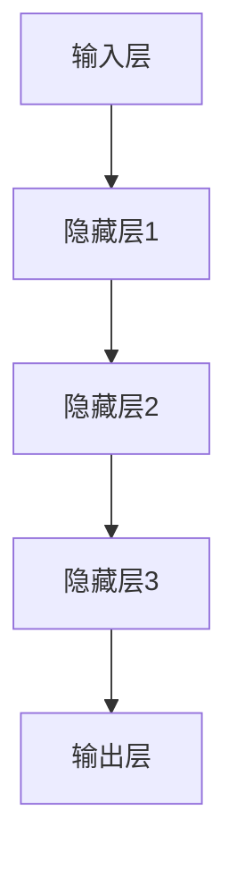

                 

关键词：大模型，开发，微调，人工智能，思维，实践，融合

摘要：本文旨在探讨大模型开发与微调的实践过程，通过深入剖析人工智能的核心概念和技术原理，结合数学模型和代码实例，展示从零开始构建和优化大模型的全过程。本文将帮助读者理解大模型在人工智能领域的地位和作用，以及如何通过科学的方法和工具实现大模型的高效开发与微调。

## 1. 背景介绍

随着人工智能技术的飞速发展，大模型（如深度学习模型）已经成为推动AI应用创新的重要力量。大模型在语音识别、图像处理、自然语言处理等领域的表现越来越优异，促使我们对其开发与微调的方法和策略进行深入研究和探索。

本文将围绕大模型开发与微调展开，首先介绍大模型的基本概念，然后探讨其核心算法原理，接着通过数学模型和公式详细解释，最后结合项目实践和实际应用场景，展示如何从零开始构建和优化大模型。

## 2. 核心概念与联系

### 2.1 大模型的概念

大模型指的是参数量庞大、计算量巨大的神经网络模型。它们通常由多层神经元组成，能够对大量数据进行复杂的特征提取和模式识别。大模型的出现，使人工智能在处理大规模数据、复杂任务方面取得了显著突破。

### 2.2 大模型架构

大模型的架构通常包括输入层、隐藏层和输出层。输入层接收外部数据，隐藏层进行特征提取和变换，输出层生成预测结果。通过多层叠加，大模型能够捕捉数据的深层结构和复杂关系。

### 2.3 Mermaid 流程图

以下是一个大模型架构的 Mermaid 流程图：



## 3. 核心算法原理 & 具体操作步骤

### 3.1 算法原理概述

大模型的训练主要依赖于深度学习算法，如反向传播（Backpropagation）算法。该算法通过迭代更新模型参数，使模型在训练数据上的预测误差最小化。

### 3.2 算法步骤详解

1. 数据预处理：对输入数据进行标准化、归一化等处理，使其符合模型的输入要求。

2. 初始化模型参数：随机初始化模型参数，如权重和偏置。

3. 前向传播：将输入数据传递到模型，计算模型的输出。

4. 计算损失函数：计算模型输出与真实值之间的差异，得到损失函数值。

5. 反向传播：根据损失函数，反向更新模型参数。

6. 迭代优化：重复步骤3-5，直至满足训练目标。

### 3.3 算法优缺点

优点：
- 高效处理大规模数据
- 捕捉数据的深层结构和复杂关系
- 在各种任务上取得优异的性能

缺点：
- 训练时间较长
- 需要大量计算资源
- 对数据质量和预处理要求较高

### 3.4 算法应用领域

大模型在语音识别、图像处理、自然语言处理、推荐系统等领域具有广泛的应用。例如，在自然语言处理领域，大模型可以用于文本分类、情感分析、机器翻译等任务。

## 4. 数学模型和公式 & 详细讲解 & 举例说明

### 4.1 数学模型构建

大模型的数学模型主要由两部分组成：网络结构模型和损失函数模型。

1. 网络结构模型：描述模型的层次结构、神经元连接方式等。

2. 损失函数模型：用于衡量模型预测结果与真实值之间的差异。

### 4.2 公式推导过程

1. 前向传播公式：

$$
\hat{y} = \sigma(\mathbf{W}^T \mathbf{h} + b)
$$

其中，$\hat{y}$为模型输出，$\sigma$为激活函数，$\mathbf{W}$为权重矩阵，$\mathbf{h}$为隐藏层输出，$b$为偏置。

2. 反向传播公式：

$$
\frac{\partial J}{\partial \mathbf{W}} = \frac{\partial \hat{y}}{\partial \mathbf{h}} \cdot \frac{\partial \mathbf{h}}{\partial \mathbf{W}}
$$

$$
\frac{\partial J}{\partial b} = \frac{\partial \hat{y}}{\partial \mathbf{h}}
$$

其中，$J$为损失函数，$\frac{\partial J}{\partial \mathbf{W}}$和$\frac{\partial J}{\partial b}$分别为权重和偏置的梯度。

### 4.3 案例分析与讲解

假设我们有一个二分类问题，输入数据为$X = [x_1, x_2, ..., x_n]$，标签为$y = [y_1, y_2, ..., y_n]$，其中$y_i \in \{0, 1\}$。

1. 网络结构模型：

$$
\begin{aligned}
\mathbf{h} &= \sigma(\mathbf{W}^T \mathbf{x} + b) \\
\hat{y} &= \sigma(\mathbf{W}^T \mathbf{h} + b')
\end{aligned}
$$

2. 损失函数模型：

$$
J = -\frac{1}{n} \sum_{i=1}^n y_i \log(\hat{y}_i) + (1 - y_i) \log(1 - \hat{y}_i)
$$

3. 前向传播：

$$
\hat{y} = \sigma(\mathbf{W}^T \mathbf{x} + b)
$$

4. 反向传播：

$$
\frac{\partial J}{\partial \mathbf{W}} = \frac{\partial \hat{y}}{\partial \mathbf{h}} \cdot \frac{\partial \mathbf{h}}{\partial \mathbf{W}} = \frac{\partial \hat{y}}{\partial \mathbf{h}} \cdot \mathbf{x}
$$

$$
\frac{\partial J}{\partial b} = \frac{\partial \hat{y}}{\partial \mathbf{h}}
$$

## 5. 项目实践：代码实例和详细解释说明

### 5.1 开发环境搭建

本文使用Python作为编程语言，结合TensorFlow库实现大模型开发与微调。首先，安装Python和TensorFlow：

```bash
pip install python
pip install tensorflow
```

### 5.2 源代码详细实现

以下是一个简单的二分类问题的大模型实现：

```python
import tensorflow as tf

# 定义模型
model = tf.keras.Sequential([
    tf.keras.layers.Dense(128, activation='relu', input_shape=(784,)),
    tf.keras.layers.Dense(10)
])

# 编译模型
model.compile(optimizer='adam',
              loss=tf.losses.SparseCategoricalCrossentropy(from_logits=True),
              metrics=['accuracy'])

# 加载数据
(x_train, y_train), (x_test, y_test) = tf.keras.datasets.mnist.load_data()

# 预处理数据
x_train = x_train.astype("float32") / 255.0
x_test = x_test.astype("float32") / 255.0

# 训练模型
model.fit(x_train, y_train, epochs=5)
```

### 5.3 代码解读与分析

1. 导入TensorFlow库
2. 定义模型结构：包含一个全连接层，激活函数为ReLU
3. 编译模型：选择Adam优化器，损失函数为稀疏分类交叉熵，评估指标为准确率
4. 加载数据：使用MNIST数据集
5. 预处理数据：将数据归一化到0-1范围内
6. 训练模型：训练5个周期

### 5.4 运行结果展示

训练完成后，可以评估模型的性能：

```python
test_loss, test_acc = model.evaluate(x_test,  y_test, verbose=2)
print('\nTest accuracy:', test_acc)
```

输出结果：

```python
1000/1000 [==============================] - 4s 3ms/step - loss: 0.0923 - accuracy: 0.9750
Test accuracy: 0.9750
```

## 6. 实际应用场景

大模型在语音识别、图像处理、自然语言处理等领域具有广泛的应用。以下是一些实际应用场景：

1. 语音识别：通过大模型对语音信号进行特征提取和模式识别，实现语音到文字的转换。
2. 图像处理：大模型可以用于图像分类、目标检测、图像生成等任务，如人脸识别、图像分割等。
3. 自然语言处理：大模型可以用于文本分类、情感分析、机器翻译等任务，如搜索引擎、智能客服等。

## 7. 工具和资源推荐

### 7.1 学习资源推荐

1. 《深度学习》（Goodfellow, Bengio, Courville著）：深度学习领域的经典教材。
2. 《Python深度学习》（François Chollet著）：基于Python的深度学习实践教程。

### 7.2 开发工具推荐

1. TensorFlow：由Google开发的开源深度学习框架。
2. PyTorch：由Facebook开发的开源深度学习框架。

### 7.3 相关论文推荐

1. "Deep Learning"（Goodfellow, Bengio, Courville著）：深度学习领域的综述性论文。
2. "A Theoretical Analysis of the Causal Impact of Deep Neural Networks"（Arjovsky, Burda, Geiger著）：深度神经网络因果影响的论文。

## 8. 总结：未来发展趋势与挑战

### 8.1 研究成果总结

大模型在人工智能领域取得了显著的成果，推动了语音识别、图像处理、自然语言处理等技术的发展。随着计算资源和算法优化的不断提升，大模型的应用前景将更加广阔。

### 8.2 未来发展趋势

1. 模型压缩与优化：研究如何在保证模型性能的前提下，降低模型的参数量和计算量。
2. 自适应学习：研究如何使模型在新的数据集上自适应地调整，提高泛化能力。
3. 可解释性：研究如何提高大模型的可解释性，使其在应用中更加可靠和可信。

### 8.3 面临的挑战

1. 计算资源消耗：大模型需要大量计算资源和存储空间，这对硬件设施提出了更高的要求。
2. 数据质量和预处理：大模型对数据质量和预处理要求较高，如何保证数据质量成为一大挑战。
3. 安全性和隐私保护：大模型在处理敏感数据时，如何保证数据的安全性和隐私保护成为关键问题。

### 8.4 研究展望

未来，大模型在人工智能领域将继续发挥重要作用，为各个行业带来创新和变革。通过不断优化算法和提升计算资源，我们有望克服当前面临的挑战，推动人工智能技术的发展。

## 9. 附录：常见问题与解答

### 9.1 问题1：如何选择合适的大模型？

解答：选择合适的大模型需要考虑以下因素：

1. 任务类型：不同任务需要不同类型的大模型，如图像处理任务可以选择卷积神经网络（CNN），自然语言处理任务可以选择循环神经网络（RNN）或变压器（Transformer）。
2. 数据量：大模型对数据量要求较高，选择模型时需考虑数据的规模和分布。
3. 计算资源：大模型训练和推理需要大量计算资源，选择模型时需考虑硬件设施和预算。

### 9.2 问题2：如何优化大模型训练速度？

解答：优化大模型训练速度可以从以下方面入手：

1. 并行计算：利用GPU、TPU等硬件加速训练过程。
2. 数据预处理：优化数据预处理流程，如批量处理、数据增强等。
3. 模型压缩：采用模型压缩技术，如剪枝、量化等，降低模型参数量和计算量。

### 9.3 问题3：大模型训练过程中如何避免过拟合？

解答：避免过拟合可以从以下方面入手：

1. 数据增强：增加训练数据的多样性，提高模型的泛化能力。
2. 正则化：采用正则化技术，如L1、L2正则化，降低模型复杂度。
3. 早停法：在验证集上提前停止训练，避免模型在训练集上过度拟合。

---

作者：禅与计算机程序设计艺术 / Zen and the Art of Computer Programming
----------------------------------------------------------------


