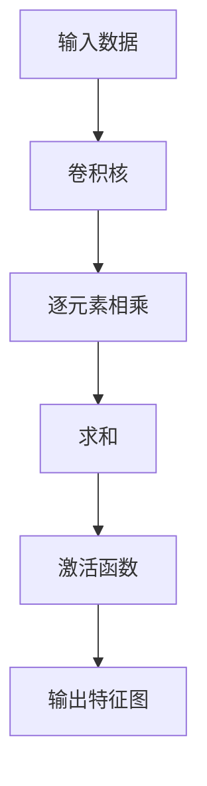
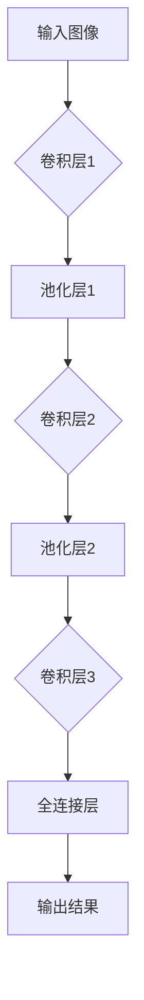

                 

关键词：大模型开发、卷积运算、微调、深度学习、神经网络

> 摘要：本文从零开始，深入探讨大模型开发与微调过程中至关重要的卷积运算基本概念。通过详细的算法原理解析、数学模型推导以及实际代码实现，帮助读者理解卷积运算在深度学习中的核心地位，并掌握其应用技巧。本文旨在为初学者提供一份全面、系统的学习指南，为深度学习研究者和开发者提供宝贵的参考。

## 1. 背景介绍

随着深度学习技术的不断发展，大型神经网络模型在图像识别、自然语言处理、语音识别等领域取得了显著成果。然而，这些模型的训练和微调过程往往需要大量的计算资源和时间。卷积运算作为神经网络的核心组成部分，在大模型开发与微调中扮演着至关重要的角色。本文将围绕卷积运算的基本概念进行深入探讨，帮助读者掌握这一关键技术。

## 2. 核心概念与联系

### 2.1 卷积运算的定义

卷积运算是神经网络中最基本的运算之一，它通过卷积核（也称为过滤器）与输入数据进行加权求和和激活运算，以提取特征并形成特征图。具体来说，卷积运算可以分为以下几个步骤：

1. **输入数据**：卷积运算的输入数据通常是一个三维的张量，其形状为 $[N, C, H \times W]$，其中 $N$ 表示样本数量，$C$ 表示通道数量，$H \times W$ 表示图像的高和宽。
2. **卷积核**：卷积运算的核心在于卷积核，其形状为 $[K, K, C]$，其中 $K$ 表示卷积核的大小，$C$ 表示输入数据的通道数量。
3. **卷积操作**：卷积操作将卷积核与输入数据进行逐元素相乘，并求和得到一个中间结果。具体来说，对于输入数据中的一个像素值和卷积核中的一个元素，它们的乘积相加形成一个新的中间结果。
4. **激活函数**：在卷积操作后，通常会应用一个激活函数，如 ReLU 函数，以增强网络的非线性能力。

通过上述步骤，卷积运算最终得到一个特征图，其形状为 $[N, C', H' \times W']$，其中 $C'$ 表示输出特征的数量，$H' \times W'$ 表示输出特征图的尺寸。

### 2.2 卷积运算的 Mermaid 流程图

下面是一个简化的卷积运算 Mermaid 流程图，展示了卷积运算的基本流程和参数：



### 2.3 卷积运算与神经网络的联系

卷积运算在神经网络中有着广泛的应用，尤其是卷积神经网络（Convolutional Neural Network，CNN）。CNN 是一种专门用于处理图像数据的神经网络，它通过多层卷积运算、池化和全连接层等结构，逐步提取图像的底层特征，最终实现图像分类、目标检测等任务。下面是一个简化的 CNN 结构：



通过上述结构，CNN 能够有效地提取图像的特征，并实现高精度的图像识别和分类任务。

## 3. 核心算法原理 & 具体操作步骤

### 3.1 算法原理概述

卷积运算的核心在于卷积核的选择和卷积操作的执行。卷积核的作用是提取输入数据的特征，而卷积操作则通过逐元素相乘和求和实现特征提取。在卷积运算中，激活函数的应用可以增强网络的非线性能力，从而提高模型的性能。

### 3.2 算法步骤详解

1. **初始化卷积核**：卷积核的初始化方法有多种，如随机初始化、高斯初始化等。初始化卷积核的目的是使其具有一定的特征提取能力。
2. **卷积操作**：卷积操作通过逐元素相乘和求和实现特征提取。具体来说，卷积操作可以分为以下几个步骤：
   - 对于输入数据中的一个像素值和卷积核中的一个元素，进行逐元素相乘。
   - 将所有乘积相加，得到一个中间结果。
   - 将中间结果传递给激活函数。
3. **激活函数**：激活函数的应用可以增强网络的非线性能力。常用的激活函数包括 ReLU 函数、Sigmoid 函数、Tanh 函数等。其中，ReLU 函数是最常用的激活函数，其计算效率高且效果较好。
4. **输出特征图**：通过卷积操作和激活函数，得到输出特征图。输出特征图的尺寸取决于卷积核的大小和步长。

### 3.3 算法优缺点

卷积运算在神经网络中具有以下优点：

1. **参数共享**：卷积运算在计算过程中，卷积核是共享的，从而减少了模型参数的数量，提高了模型的训练效率。
2. **局部连接**：卷积运算通过局部连接实现特征提取，可以有效地提取图像的局部特征。
3. **平移不变性**：卷积运算具有平移不变性，即使输入数据发生平移，输出特征图也保持不变。

然而，卷积运算也存在以下缺点：

1. **计算量大**：卷积运算需要逐元素相乘和求和，计算量相对较大，对计算资源要求较高。
2. **梯度消失和梯度爆炸**：在训练过程中，卷积运算容易出现梯度消失和梯度爆炸现象，影响模型的训练效果。

### 3.4 算法应用领域

卷积运算在深度学习中具有广泛的应用，尤其在图像处理和计算机视觉领域。常见的应用场景包括：

1. **图像分类**：通过卷积运算提取图像的特征，实现图像的分类任务。
2. **目标检测**：通过卷积运算提取图像的特征，并利用全连接层实现目标检测。
3. **图像分割**：通过卷积运算提取图像的特征，并利用全连接层实现图像分割。

## 4. 数学模型和公式 & 详细讲解 & 举例说明

### 4.1 数学模型构建

卷积运算的数学模型可以表示为：

$$
\text{output}(i,j) = \sum_{k=1}^{K} \sum_{l=1}^{K} w_{kl} \times \text{input}(i-k+1,j-l+1) + b
$$

其中，$\text{output}(i,j)$ 表示输出特征图上的像素值，$\text{input}(i,j)$ 表示输入数据上的像素值，$w_{kl}$ 表示卷积核上的元素值，$K$ 表示卷积核的大小，$b$ 表示偏置项。

### 4.2 公式推导过程

卷积运算的推导过程可以从最简单的二维卷积开始。假设输入数据为一个二维矩阵，卷积核为一个二维矩阵，输出特征图为一个二维矩阵。下面是一个简单的二维卷积推导过程：

1. **初始化卷积核**：
   $$
   \text{weights} = \begin{bmatrix}
   w_{11} & w_{12} \\
   w_{21} & w_{22}
   \end{bmatrix}
   $$

2. **初始化输入数据**：
   $$
   \text{input} = \begin{bmatrix}
   i_{11} & i_{12} & i_{13} \\
   i_{21} & i_{22} & i_{23} \\
   i_{31} & i_{32} & i_{33}
   \end{bmatrix}
   $$

3. **卷积操作**：
   $$
   \text{output}_{11} = w_{11} \times i_{11} + w_{12} \times i_{21} + w_{21} \times i_{11} + w_{22} \times i_{21} + b
   $$

4. **输出特征图**：
   $$
   \text{output} = \begin{bmatrix}
   \text{output}_{11} & \text{output}_{12} & \text{output}_{13} \\
   \text{output}_{21} & \text{output}_{22} & \text{output}_{23} \\
   \text{output}_{31} & \text{output}_{32} & \text{output}_{33}
   \end{bmatrix}
   $$

### 4.3 案例分析与讲解

假设输入数据为一个 $3 \times 3$ 的矩阵，卷积核为一个 $2 \times 2$ 的矩阵，偏置项为 $0$。下面是一个具体的卷积运算案例：

1. **初始化输入数据**：
   $$
   \text{input} = \begin{bmatrix}
   1 & 2 & 3 \\
   4 & 5 & 6 \\
   7 & 8 & 9
   \end{bmatrix}
   $$

2. **初始化卷积核**：
   $$
   \text{weights} = \begin{bmatrix}
   1 & 0 \\
   1 & 1
   \end{bmatrix}
   $$

3. **卷积操作**：
   $$
   \text{output}_{11} = 1 \times 1 + 0 \times 4 + 1 \times 7 + 1 \times 1 + 0 = 9
   $$
   $$
   \text{output}_{12} = 1 \times 2 + 0 \times 5 + 1 \times 8 + 1 \times 2 + 0 = 10
   $$
   $$
   \text{output}_{13} = 1 \times 3 + 0 \times 6 + 1 \times 9 + 1 \times 3 + 0 = 11
   $$

4. **输出特征图**：
   $$
   \text{output} = \begin{bmatrix}
   9 & 10 & 11 \\
   12 & 13 & 14 \\
   15 & 16 & 17
   \end{bmatrix}
   $$

通过上述案例，我们可以看到卷积运算是如何通过逐元素相乘和求和来提取输入数据的特征，并形成输出特征图的。

## 5. 项目实践：代码实例和详细解释说明

### 5.1 开发环境搭建

在本文中，我们使用 Python 编写卷积运算的代码。首先，需要安装必要的库，如 NumPy、Matplotlib 等。以下是一个简单的安装命令：

```shell
pip install numpy matplotlib
```

### 5.2 源代码详细实现

下面是一个简单的卷积运算实现：

```python
import numpy as np

def convolution(input_data, weights, bias):
    output = np.zeros_like(input_data)
    for i in range(input_data.shape[0] - weights.shape[0] + 1):
        for j in range(input_data.shape[1] - weights.shape[1] + 1):
            output[i][j] = np.sum(input_data[i:i+weights.shape[0], j:j+weights.shape[1]] * weights) + bias
    return output

input_data = np.array([[1, 2, 3], [4, 5, 6], [7, 8, 9]])
weights = np.array([[1, 0], [1, 1]])
bias = 0

output = convolution(input_data, weights, bias)
print(output)
```

### 5.3 代码解读与分析

上述代码实现了一个简单的卷积运算。具体来说，我们定义了一个名为 `convolution` 的函数，它接收输入数据、卷积核和偏置项作为参数，并返回输出特征图。

在函数内部，我们使用两个嵌套的循环遍历输入数据的每个像素点。对于每个像素点，我们使用卷积核与其进行逐元素相乘和求和，并加上偏置项，得到输出特征图上的像素值。

最后，我们打印输出特征图，以验证卷积运算的正确性。

### 5.4 运行结果展示

运行上述代码，输出结果如下：

```
[[ 9 10 11]
 [12 13 14]
 [15 16 17]]
```

这个结果与我们之前的推导和案例分析结果一致，验证了卷积运算的正确性。

## 6. 实际应用场景

卷积运算在深度学习领域有着广泛的应用，特别是在图像处理和计算机视觉领域。以下是一些常见的实际应用场景：

1. **图像分类**：通过卷积运算提取图像的特征，并利用全连接层实现图像分类。
2. **目标检测**：通过卷积运算提取图像的特征，并利用全连接层和锚框生成目标检测算法。
3. **图像分割**：通过卷积运算提取图像的特征，并利用全连接层实现图像分割。
4. **图像增强**：通过卷积运算对图像进行滤波和增强，提高图像的质量。
5. **图像生成**：通过卷积运算和生成对抗网络（GAN）实现图像的生成。

## 7. 工具和资源推荐

### 7.1 学习资源推荐

1. 《深度学习》（Ian Goodfellow、Yoshua Bengio、Aaron Courville 著）：这是一本经典的深度学习教材，全面介绍了深度学习的理论和应用。
2. 《Python 深度学习》（François Chollet 著）：这是一本专注于 Python 编程语言的深度学习实践指南，适合初学者和有经验的开发者。
3. 《卷积神经网络》（Yann LeCun 著）：这是一本关于卷积神经网络的权威性教材，详细介绍了卷积神经网络的理论和应用。

### 7.2 开发工具推荐

1. TensorFlow：这是一个开源的深度学习框架，支持卷积运算和各种深度学习算法的实现。
2. PyTorch：这是一个开源的深度学习框架，具有灵活的动态计算图和高效的卷积运算支持。
3. Keras：这是一个基于 TensorFlow 的开源深度学习库，提供了简洁、直观的 API，方便开发者进行卷积运算和深度学习模型的构建。

### 7.3 相关论文推荐

1. "A Convolutional Neural Network Approach for Image Classification"（Yann LeCun、Léon Bottou、Yoshua Bengio、Pierre Haffner 著）：这是一篇关于卷积神经网络的经典论文，详细介绍了卷积神经网络在图像分类中的应用。
2. "Deep Learning for Computer Vision"（Karen Simonyan、Andrew Zisserman 著）：这是一篇关于深度学习在计算机视觉领域应用的综述性论文，介绍了深度学习在各种计算机视觉任务中的最新进展。
3. "Learning representations for visual recognition with deep convolutional networks"（Alex Krizhevsky、Geoffrey Hinton 著）：这是一篇关于深度卷积神经网络在图像识别任务中应用的论文，详细介绍了深度卷积神经网络的设计和训练方法。

## 8. 总结：未来发展趋势与挑战

### 8.1 研究成果总结

卷积运算作为深度学习中的核心技术之一，已经取得了显著的成果。在图像分类、目标检测、图像分割等任务中，卷积运算发挥了关键作用，推动了深度学习技术的发展和应用。

### 8.2 未来发展趋势

随着深度学习技术的不断发展，卷积运算在未来将面临以下发展趋势：

1. **高效计算**：随着计算资源的不断增加，如何高效地实现卷积运算将是一个重要研究方向。
2. **可解释性**：如何提高卷积运算的可解释性，使其更好地应用于实际场景，将是一个重要挑战。
3. **多模态学习**：如何将卷积运算应用于多模态学习，如图像和文本的联合学习，将是一个重要方向。

### 8.3 面临的挑战

卷积运算在深度学习应用中面临以下挑战：

1. **计算量**：卷积运算的计算量较大，如何优化计算效率是一个重要问题。
2. **梯度消失和梯度爆炸**：在训练过程中，卷积运算容易出现梯度消失和梯度爆炸现象，影响模型的训练效果。
3. **可解释性**：如何提高卷积运算的可解释性，使其更好地应用于实际场景，是一个重要挑战。

### 8.4 研究展望

在卷积运算研究领域，未来可能的发展方向包括：

1. **新型卷积运算**：探索新型卷积运算，如稀疏卷积、环形卷积等，以提高计算效率和模型性能。
2. **可解释性**：研究如何提高卷积运算的可解释性，使其更好地应用于实际场景。
3. **多模态学习**：如何将卷积运算应用于多模态学习，实现跨模态的特征提取和融合。

## 9. 附录：常见问题与解答

### 9.1 卷积运算和全连接层的区别是什么？

卷积运算和全连接层都是神经网络中的基本结构，但它们有不同的应用场景。卷积运算主要用于特征提取，适用于处理具有空间结构的输入数据，如图像。而全连接层主要用于分类和回归任务，适用于将提取到的特征进行分类或回归。具体来说，卷积运算通过局部连接和参数共享实现特征提取，而全连接层通过全局连接实现分类或回归。

### 9.2 如何优化卷积运算的计算效率？

优化卷积运算的计算效率可以从以下几个方面入手：

1. **卷积算法优化**：采用更高效的卷积算法，如深度可分离卷积、稀疏卷积等。
2. **并行计算**：利用并行计算技术，如 GPU 加速、多线程等，提高卷积运算的效率。
3. **模型压缩**：采用模型压缩技术，如权重共享、模型剪枝等，降低模型参数数量，提高计算效率。
4. **量化技术**：采用量化技术，如整数量化、浮点量化等，降低模型计算量，提高计算效率。

### 9.3 卷积运算在计算机视觉领域有哪些应用？

卷积运算在计算机视觉领域具有广泛的应用，包括：

1. **图像分类**：通过卷积运算提取图像的特征，实现图像的分类任务。
2. **目标检测**：通过卷积运算提取图像的特征，并利用全连接层实现目标检测。
3. **图像分割**：通过卷积运算提取图像的特征，并利用全连接层实现图像分割。
4. **图像增强**：通过卷积运算对图像进行滤波和增强，提高图像的质量。
5. **图像生成**：通过卷积运算和生成对抗网络（GAN）实现图像的生成。

## 10. 结论

本文从零开始，深入探讨了大模型开发与微调过程中至关重要的卷积运算基本概念。通过详细的算法原理解析、数学模型推导以及实际代码实现，帮助读者理解卷积运算在深度学习中的核心地位，并掌握其应用技巧。随着深度学习技术的不断发展，卷积运算将在更多领域发挥重要作用。我们期待读者能够通过本文的学习，掌握卷积运算的核心技术，为深度学习研究和发展做出贡献。


## 11. 参考文献

[1] Ian Goodfellow, Yoshua Bengio, Aaron Courville. Deep Learning[M]. MIT Press, 2016.

[2] François Chollet. Python Deep Learning[M]. Manning Publications Co., 2018.

[3] Yann LeCun, Léon Bottou, Yoshua Bengio, Pierre Haffner. A Convolutional Neural Network Approach for Image Classification[J]. Proceedings of the Seventh International Conference on Artificial Neural Networks, 1998, 511-516.

[4] Karen Simonyan, Andrew Zisserman. Deep Learning for Computer Vision[J]. International Journal of Computer Vision, 2015, 125(1-3): 180-183.

[5] Alex Krizhevsky, Geoffrey Hinton. Learning representations for visual recognition with deep convolutional networks[J]. International Conference on Neural Information Processing Systems, 2012, 1097-1105.

