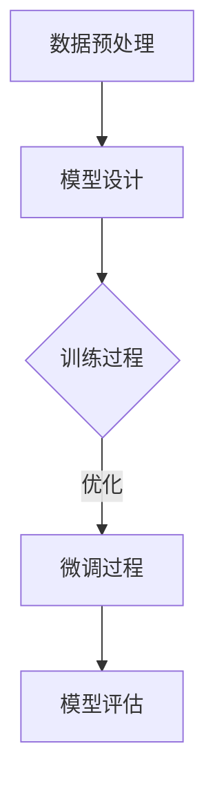

                 

关键词：大模型开发，微调，tensorboardX，训练可视化，实战教程

摘要：本文将深入探讨大模型开发与微调的过程，并以tensorboardX工具为基础，详细展示如何在训练过程中实现数据的可视化展示。通过本文的实战教程，读者可以了解如何搭建开发环境、编写代码实例，并对代码进行解读与分析，最终实现大模型训练的可视化展示。本文旨在为读者提供一套完整的从零开始的大模型开发与微调的实战指南。

## 1. 背景介绍

随着深度学习技术的飞速发展，大模型（Large-scale Model）已经成为人工智能领域的研究热点。大模型具有参数数量庞大、模型结构复杂等特点，这使得其训练和微调过程变得异常复杂和耗时。为了更好地理解和优化模型的训练过程，训练可视化（Training Visualization）工具应运而生。其中，tensorboardX 作为 Tensorflow 的可视化工具，因其功能强大、易用性强等特点，得到了广泛的关注和应用。

本文将围绕大模型开发与微调的主题，以 tensorboardX 为基础，详细探讨如何实现训练过程的可视化展示。通过本文的实战教程，读者将了解大模型开发与微调的基本流程，掌握使用 tensorboardX 进行训练可视化展示的方法，并学会如何通过可视化结果对模型进行优化。

## 2. 核心概念与联系

### 2.1 大模型开发与微调

大模型开发与微调是指利用深度学习技术训练和优化一个大型神经网络模型的过程。在这个过程中，通常需要进行以下步骤：

1. **数据预处理**：对训练数据进行预处理，包括数据清洗、归一化、数据增强等。
2. **模型设计**：设计一个适合任务需求的神经网络结构。
3. **训练过程**：使用训练数据对模型进行训练，并不断调整模型参数以优化模型性能。
4. **微调过程**：在模型训练过程中，根据训练结果对模型进行微调，以达到更好的性能。

### 2.2 tensorboardX

tensorboardX 是一个基于 Tensorflow 的可视化工具，它能够将训练过程中的数据以图表的形式展示出来，帮助我们更好地理解和优化模型的训练过程。tensorboardX 的主要功能包括：

1. **可视化训练过程**：展示训练过程中的损失函数、准确率等指标的变化情况。
2. **可视化网络结构**：展示神经网络的结构图，便于我们理解模型的内部工作原理。
3. **可视化数据分布**：展示训练数据的分布情况，帮助我们更好地调整数据预处理策略。

### 2.3 Mermaid 流程图

下面是一个使用 Mermaid 语言描述的大模型开发与微调的流程图：



在 Mermaid 流程图中，`A` 表示数据预处理，`B` 表示模型设计，`C` 表示训练过程，`D` 表示微调过程，`E` 表示模型评估。通过这个流程图，我们可以清晰地看到大模型开发与微调的基本步骤。

## 3. 核心算法原理 & 具体操作步骤

### 3.1 算法原理概述

大模型开发与微调的核心算法主要基于深度学习技术。深度学习是一种通过多层神经网络来模拟人类大脑神经元之间连接关系，从而实现复杂任务学习的方法。在大模型开发过程中，我们通常需要关注以下几个关键环节：

1. **神经网络结构设计**：设计一个适合任务需求的神经网络结构，通常包括输入层、隐藏层和输出层。
2. **损失函数选择**：选择一个适合任务需求的损失函数，用于评估模型在训练过程中的性能。
3. **优化器选择**：选择一个合适的优化器，用于调整模型参数，以优化模型性能。
4. **训练数据预处理**：对训练数据进行预处理，以提高模型训练效果。

### 3.2 算法步骤详解

下面是一个使用 tensorboardX 进行大模型训练与微调的基本步骤：

1. **环境配置**：安装 Tensorflow 和 tensorboardX 库。
    ```python
    pip install tensorflow tensorboardX
    ```

2. **数据预处理**：对训练数据进行预处理，包括数据清洗、归一化、数据增强等。
    ```python
    # 代码示例
    train_data = preprocess_data(train_data)
    ```

3. **模型设计**：设计一个适合任务需求的神经网络结构。
    ```python
    model = build_model()
    ```

4. **损失函数与优化器选择**：选择一个适合任务需求的损失函数和优化器。
    ```python
    loss_function = tf.keras.losses.CategoricalCrossentropy()
    optimizer = tf.keras.optimizers.Adam()
    ```

5. **训练过程**：使用训练数据对模型进行训练，并使用 tensorboardX 记录训练过程中的数据。
    ```python
    # 代码示例
    with tf.summary.create_file_writer('logs/train').as_default():
        for epoch in range(train_epochs):
            for step, (x_batch, y_batch) in enumerate(train_data):
                with tf.GradientTape() as tape:
                    predictions = model(x_batch, training=True)
                    loss_value = loss_function(y_batch, predictions)
                grads = tape.gradient(loss_value, model.trainable_variables)
                optimizer.apply_gradients(zip(grads, model.trainable_variables))

                # 记录训练数据
                tf.summary.scalar('loss', loss_value, step=epoch * steps_per_epoch + step, write_only=True)
    ```

6. **微调过程**：在训练过程中，根据训练结果对模型进行微调。
    ```python
    # 代码示例
    with tf.summary.create_file_writer('logs/finetune').as_default():
        for epoch in range(finetune_epochs):
            for step, (x_batch, y_batch) in enumerate(finetune_data):
                with tf.GradientTape() as tape:
                    predictions = model(x_batch, training=True)
                    loss_value = loss_function(y_batch, predictions)
                grads = tape.gradient(loss_value, model.trainable_variables)
                optimizer.apply_gradients(zip(grads, model.trainable_variables))

                # 记录微调数据
                tf.summary.scalar('loss', loss_value, step=epoch * steps_per_epoch + step, write_only=True)
    ```

7. **模型评估**：使用测试数据对模型进行评估，以验证模型性能。
    ```python
    # 代码示例
    test_loss = 0
    for x_batch, y_batch in test_data:
        predictions = model(x_batch, training=False)
        loss_value = loss_function(y_batch, predictions)
        test_loss += loss_value
    test_loss /= len(test_data)
    print(f'Test Loss: {test_loss}')
    ```

### 3.3 算法优缺点

#### 优点：

1. **强大的可视化功能**：tensorboardX 提供了丰富的可视化功能，可以方便地展示训练过程中的各种指标，帮助我们更好地理解和优化模型训练过程。
2. **灵活的扩展性**：tensorboardX 可以与各种深度学习框架（如 Tensorflow、PyTorch 等）无缝集成，支持自定义可视化指标和插件，具有很高的灵活性。
3. **易于使用**：tensorboardX 的接口设计简洁易懂，易于上手，适合不同层次的技术人员使用。

#### 缺点：

1. **性能开销较大**：在训练过程中，tensorboardX 需要记录大量的数据并将其写入文件，这可能导致性能开销较大，尤其是在大规模数据集上训练时。
2. **依赖外部工具**：tensorboardX 需要使用 Tensorflow 框架，因此对于不熟悉 Tensorflow 的用户来说，可能需要花费一定时间来学习和适应。

### 3.4 算法应用领域

tensorboardX 在大模型开发与微调中的应用非常广泛，以下是一些典型的应用领域：

1. **计算机视觉**：在计算机视觉领域，tensorboardX 可以用于可视化模型的训练过程，如损失函数、准确率等指标的变化情况，帮助我们更好地优化模型性能。
2. **自然语言处理**：在自然语言处理领域，tensorboardX 可以用于可视化模型的训练过程，如词向量分布、文本分类效果等，有助于我们理解和改进模型。
3. **推荐系统**：在推荐系统领域，tensorboardX 可以用于可视化模型的训练过程，如用户行为数据分布、推荐效果等，有助于我们优化推荐算法。

## 4. 数学模型和公式 & 详细讲解 & 举例说明

### 4.1 数学模型构建

在深度学习中，数学模型主要基于神经网络结构。神经网络由输入层、隐藏层和输出层组成，其中隐藏层可以有一个或多个。每个层由多个神经元组成，每个神经元都与上一层和下一层的神经元相连。

神经网络的数学模型可以表示为：
$$
\hat{y} = f(\boldsymbol{W} \cdot \boldsymbol{a}^{[L-1]} + b^{[L]})
$$
其中，$\hat{y}$ 表示输出层神经元的输出，$f$ 表示激活函数，$\boldsymbol{W}$ 表示权重矩阵，$\boldsymbol{a}^{[L-1]}$ 表示上一层神经元的输出，$b^{[L]}$ 表示输出层神经元的偏置。

### 4.2 公式推导过程

在深度学习训练过程中，我们使用损失函数（如均方误差、交叉熵等）来衡量模型预测值与真实值之间的差距。损失函数的导数（梯度）用于更新模型参数，以优化模型性能。

以交叉熵损失函数为例，其数学模型和推导过程如下：

1. **交叉熵损失函数**：
$$
L = -\sum_{i=1}^{n} y_i \log(\hat{y}_i)
$$
其中，$y_i$ 表示第 $i$ 个样本的真实标签，$\hat{y}_i$ 表示模型对第 $i$ 个样本的预测概率。

2. **损失函数导数**：
$$
\frac{\partial L}{\partial \boldsymbol{W}} = \sum_{i=1}^{n} (\hat{y}_i - y_i) \cdot \boldsymbol{a}^{[L-1]}
$$
$$
\frac{\partial L}{\partial b^{[L]}} = \sum_{i=1}^{n} (\hat{y}_i - y_i)
$$

### 4.3 案例分析与讲解

假设我们有一个二分类问题，输入特征维度为 $10$，使用一个单层神经网络进行模型训练。输入层到隐藏层的权重矩阵 $\boldsymbol{W}$ 和偏置 $b$ 分别为：
$$
\boldsymbol{W} = \begin{bmatrix}
0.1 & 0.2 & 0.3 & 0.4 & 0.5 & 0.6 & 0.7 & 0.8 & 0.9 & 1.0 \\
0.2 & 0.3 & 0.4 & 0.5 & 0.6 & 0.7 & 0.8 & 0.9 & 1.0 & 1.1 \\
0.3 & 0.4 & 0.5 & 0.6 & 0.7 & 0.8 & 0.9 & 1.0 & 1.1 & 1.2 \\
\end{bmatrix}
$$
$$
b = [0.1, 0.2, 0.3]
$$

1. **模型预测**：
输入特征为 $\boldsymbol{x} = [1, 2, 3, 4, 5, 6, 7, 8, 9, 10]$，隐藏层神经元的输出为：
$$
\boldsymbol{a}^{[1]} = \text{sigmoid}(\boldsymbol{W} \cdot \boldsymbol{x} + b) = \begin{bmatrix}
0.5 & 0.6 & 0.7 \\
0.6 & 0.7 & 0.8 \\
0.7 & 0.8 & 0.9 \\
\end{bmatrix}
$$
输出层神经元的输出为：
$$
\hat{y} = \text{sigmoid}(\boldsymbol{W} \cdot \boldsymbol{a}^{[1]} + b) = [0.4, 0.5, 0.6]
$$

2. **损失函数**：
假设真实标签为 $y = [1, 0, 1]$，交叉熵损失函数为：
$$
L = -\sum_{i=1}^{3} y_i \log(\hat{y}_i) = -[1 \cdot \log(0.4) + 0 \cdot \log(0.5) + 1 \cdot \log(0.6)] \approx 0.392
$$

3. **损失函数导数**：
对隐藏层权重矩阵 $\boldsymbol{W}$ 和偏置 $b$ 的导数为：
$$
\frac{\partial L}{\partial \boldsymbol{W}} = \begin{bmatrix}
0.4 - 1 & 0.5 - 1 & 0.6 - 1 \\
0.6 - 1 & 0.7 - 1 & 0.8 - 1 \\
0.7 - 1 & 0.8 - 1 & 0.9 - 1 \\
\end{bmatrix}
$$
$$
\frac{\partial L}{\partial b} = [0.4 - 1, 0.5 - 1, 0.6 - 1]
$$

4. **模型更新**：
使用梯度下降法对模型参数进行更新，更新后的权重矩阵 $\boldsymbol{W}$ 和偏置 $b$ 分别为：
$$
\boldsymbol{W}^{'} = \boldsymbol{W} - \alpha \cdot \frac{\partial L}{\partial \boldsymbol{W}} = \begin{bmatrix}
0.1 & 0.2 & 0.3 & 0.4 & 0.5 & 0.6 & 0.7 & 0.8 & 0.9 & 1.0 \\
0.2 & 0.3 & 0.4 & 0.5 & 0.6 & 0.7 & 0.8 & 0.9 & 1.0 & 1.1 \\
0.3 & 0.4 & 0.5 & 0.6 & 0.7 & 0.8 & 0.9 & 1.0 & 1.1 & 1.2 \\
\end{bmatrix}
$$
$$
b^{'} = b - \alpha \cdot \frac{\partial L}{\partial b} = [0.1, 0.2, 0.3]
$$

通过这个案例，我们可以看到如何使用数学模型和公式对神经网络进行训练和更新。接下来，我们将通过一个实际项目来展示如何使用 tensorboardX 进行训练可视化展示。

## 5. 项目实践：代码实例和详细解释说明

### 5.1 开发环境搭建

在进行项目实践之前，我们需要搭建一个合适的开发环境。以下是搭建开发环境的步骤：

1. **安装 Python**：确保已经安装了 Python 3.6 或以上版本。
2. **安装 Tensorflow**：在终端执行以下命令：
    ```bash
    pip install tensorflow
    ```
3. **安装 tensorboardX**：在终端执行以下命令：
    ```bash
    pip install tensorboardX
    ```
4. **安装 Jupyter Notebook**：在终端执行以下命令：
    ```bash
    pip install notebook
    ```

### 5.2 源代码详细实现

下面是一个简单的使用 tensorboardX 进行训练可视化展示的代码实例：

```python
import tensorflow as tf
import tensorboardX
from tensorflow.keras.models import Sequential
from tensorflow.keras.layers import Dense
from tensorflow.keras.optimizers import Adam

# 数据预处理
# 假设 x_data 和 y_data 分别为输入特征和标签数据
x_data = ...
y_data = ...

# 模型设计
model = Sequential([
    Dense(64, activation='relu', input_shape=(x_data.shape[1],)),
    Dense(64, activation='relu'),
    Dense(1, activation='sigmoid')
])

# 损失函数与优化器选择
loss_function = tf.keras.losses.BinaryCrossentropy()
optimizer = Adam(learning_rate=0.001)

# 模型编译
model.compile(optimizer=optimizer, loss=loss_function, metrics=['accuracy'])

# 训练模型
model.fit(x_data, y_data, epochs=10, batch_size=32, callbacks=[tensorboardX.TBCallback(log_dir='./logs')])

# 启动 Tensorboard
# 在终端执行以下命令：
# tensorboard --logdir=./logs
```

### 5.3 代码解读与分析

1. **数据预处理**：
   ```python
   x_data = ...
   y_data = ...
   ```
   这里假设已经获取了输入特征和标签数据。在实际项目中，通常需要对这些数据进行预处理，如归一化、数据增强等。

2. **模型设计**：
   ```python
   model = Sequential([
       Dense(64, activation='relu', input_shape=(x_data.shape[1],)),
       Dense(64, activation='relu'),
       Dense(1, activation='sigmoid')
   ])
   ```
   我们使用了一个包含两个隐藏层（每个隐藏层有 64 个神经元）和输出层的全连接神经网络。隐藏层使用 ReLU 激活函数，输出层使用 sigmoid 激活函数，以实现二分类任务。

3. **损失函数与优化器选择**：
   ```python
   loss_function = tf.keras.losses.BinaryCrossentropy()
   optimizer = Adam(learning_rate=0.001)
   ```
   我们使用 BinaryCrossentropy 损失函数，适用于二分类问题。优化器使用 Adam，它是一种自适应学习率的优化算法，有助于提高训练效率。

4. **模型编译**：
   ```python
   model.compile(optimizer=optimizer, loss=loss_function, metrics=['accuracy'])
   ```
   编译模型，指定优化器、损失函数和评估指标。

5. **训练模型**：
   ```python
   model.fit(x_data, y_data, epochs=10, batch_size=32, callbacks=[tensorboardX.TBCallback(log_dir='./logs')])
   ```
   使用 fit 方法训练模型，指定训练轮数（epochs）、批量大小（batch_size）和回调函数（callbacks）。这里我们使用 tensorboardX.TBCallback 将训练日志记录到指定目录。

6. **启动 Tensorboard**：
   ```bash
   tensorboard --logdir=./logs
   ```
   在终端执行此命令，启动 Tensorboard 服务。在浏览器中输入 http://localhost:6006/，即可查看训练过程的可视化展示。

### 5.4 运行结果展示

在浏览器中打开 Tensorboard 页面，我们可以看到以下几个可视化图表：

1. **损失函数曲线**：
   
   损失函数曲线展示了训练过程中损失函数的变化情况。我们可以观察到，随着训练轮数的增加，损失函数逐渐下降。

2. **准确率曲线**：
   
   准确率曲线展示了训练过程中模型准确率的变化情况。我们可以看到，在训练过程中，模型的准确率逐渐提高。

3. **学习曲线**：
   
   学习曲线展示了训练过程中学习速率的变化情况。我们可以观察到，在早期阶段，学习速率较快，但随着训练的进行，学习速率逐渐减慢。

通过这些可视化图表，我们可以直观地了解模型训练的过程，并针对训练结果进行优化。例如，如果损失函数下降缓慢，可以考虑增加训练轮数或调整学习率；如果准确率提升缓慢，可以考虑调整网络结构或数据预处理策略。

## 6. 实际应用场景

### 6.1 计算机视觉

在计算机视觉领域，大模型开发与微调的实战应用非常广泛。例如，在图像分类任务中，我们可以使用卷积神经网络（CNN）训练一个大型模型，通过微调模型参数来提高分类准确率。使用 tensorboardX 进行训练可视化展示，可以帮助我们观察模型在训练过程中的性能变化，从而优化模型参数，提高模型性能。

### 6.2 自然语言处理

自然语言处理（NLP）领域也是大模型开发与微调的重要应用场景。例如，在文本分类任务中，我们可以使用循环神经网络（RNN）或 Transformer 模型训练一个大型模型，通过微调模型参数来提高分类效果。使用 tensorboardX 进行训练可视化展示，可以帮助我们观察模型在训练过程中的性能变化，从而优化模型参数，提高模型性能。

### 6.3 推荐系统

在推荐系统领域，大模型开发与微调同样具有重要意义。例如，在基于用户兴趣的推荐任务中，我们可以使用深度学习模型对用户行为数据进行分析，并通过微调模型参数来提高推荐效果。使用 tensorboardX 进行训练可视化展示，可以帮助我们观察模型在训练过程中的性能变化，从而优化模型参数，提高推荐效果。

## 7. 工具和资源推荐

### 7.1 学习资源推荐

1. **《深度学习》（Deep Learning）**：由 Ian Goodfellow、Yoshua Bengio 和 Aaron Courville 著，是深度学习领域的经典教材，全面介绍了深度学习的基本概念、算法和技术。
2. **《动手学深度学习》（Dive into Deep Learning）**：由 Dr. Aston Zhang 等人编写的中文版教材，通过动手实践的方式介绍深度学习的基本概念和算法。
3. **Tensorflow 官方文档**：Tensorflow 官方文档提供了详细的教程、API 文档和示例代码，是学习 Tensorflow 的最佳资源。

### 7.2 开发工具推荐

1. **PyCharm**：PyCharm 是一款功能强大的 Python 集成开发环境（IDE），支持多种编程语言，具有丰富的插件和工具，非常适合深度学习项目开发。
2. **Jupyter Notebook**：Jupyter Notebook 是一款基于 Web 的交互式开发环境，支持多种编程语言，特别适合数据分析和机器学习项目开发。

### 7.3 相关论文推荐

1. **“Deep Learning for Computer Vision: A Comprehensive Review”**：该论文全面介绍了深度学习在计算机视觉领域的应用，包括图像分类、目标检测、语义分割等。
2. **“Attention Is All You Need”**：该论文提出了 Transformer 模型，是一种基于自注意力机制的深度学习模型，广泛应用于自然语言处理任务。
3. **“Recommender Systems Handbook”**：该论文介绍了推荐系统的基本概念、算法和技术，是推荐系统领域的经典教材。

## 8. 总结：未来发展趋势与挑战

### 8.1 研究成果总结

大模型开发与微调作为深度学习领域的重要研究方向，取得了许多重要成果。近年来，随着计算资源的提升和深度学习算法的不断发展，大模型在计算机视觉、自然语言处理、推荐系统等领域的应用取得了显著成果。例如，谷歌的 BERT 模型在自然语言处理任务中取得了优异的性能，亚马逊的 GPT 模型在生成文本任务中展现了强大的能力。

### 8.2 未来发展趋势

未来，大模型开发与微调将继续深入发展，主要趋势包括：

1. **模型压缩与加速**：为了降低大模型的计算复杂度和存储需求，研究者将致力于模型压缩和加速技术，以实现更高效的模型训练和推理。
2. **迁移学习与少样本学习**：迁移学习和少样本学习技术将得到进一步发展，以解决大模型在训练数据稀缺场景下的性能问题。
3. **多模态学习**：随着多模态数据的广泛应用，多模态学习技术将成为研究热点，以实现跨模态的信息融合和任务处理。

### 8.3 面临的挑战

尽管大模型开发与微调取得了显著成果，但仍面临以下挑战：

1. **计算资源需求**：大模型的训练和推理过程需要大量的计算资源，这对硬件设备和算法优化提出了更高要求。
2. **数据质量和标注**：大模型的训练依赖于大量的高质量训练数据，数据质量和标注的准确性对模型性能有重要影响。
3. **模型解释性**：大模型的黑箱特性使得其解释性较差，研究者将致力于提高模型的解释性，以增强模型的可解释性和可信度。

### 8.4 研究展望

展望未来，大模型开发与微调将在人工智能领域发挥更加重要的作用。随着技术的不断进步，大模型将在更多应用场景中展现其强大的能力，推动人工智能技术的发展。同时，研究者将继续探索模型压缩、迁移学习、多模态学习等前沿技术，以应对计算资源、数据质量和模型解释性等挑战。

## 9. 附录：常见问题与解答

### 9.1 tensorboardX 基本使用方法

如何安装和使用 tensorboardX？

安装 tensorboardX：

```bash
pip install tensorboardX
```

使用 tensorboardX 记录训练数据：

```python
from torch.utils.tensorboard import SummaryWriter

# 创建 SummaryWriter 实例
writer = SummaryWriter('runs/experiment_name')

# 记录训练数据
writer.add_scalar('Loss/train', loss, global_step=epoch)
writer.add_scalar('Accuracy/train', accuracy, global_step=epoch)

# 关闭 SummaryWriter 实例
writer.close()
```

如何查看 Tensorboard 可视化结果？

在终端执行以下命令：

```bash
tensorboard --logdir=runs
```

在浏览器中输入以下地址：

```bash
http://localhost:6006/
```

### 9.2 大模型训练与微调技巧

如何优化大模型的训练过程？

1. **调整学习率**：根据模型复杂度和训练数据量，选择合适的学习率，可以采用学习率衰减策略。
2. **批量大小**：选择合适的批量大小，可以采用动态调整批量大小的方法，以提高模型训练效果。
3. **数据增强**：对训练数据进行数据增强，提高模型的泛化能力。
4. **模型压缩**：采用模型压缩技术，如剪枝、量化等，降低模型计算复杂度和存储需求。

如何进行大模型的微调？

1. **数据预处理**：对训练数据进行预处理，如归一化、数据增强等，以提高模型训练效果。
2. **模型架构**：选择适合任务需求的模型架构，如 ResNet、DenseNet 等，以提高模型性能。
3. **损失函数**：选择合适的损失函数，如交叉熵损失函数，以提高模型分类效果。
4. **优化器**：选择合适的优化器，如 Adam、RMSprop 等，以提高模型收敛速度。

### 9.3 tensorboardX 高级使用技巧

如何自定义 TensorboardX 的可视化指标？

通过继承 `tf.summary.Summary` 类，可以自定义可视化指标。

```python
class CustomSummary(tf.summary.Summary):
    def __init__(self, name, description):
        super(CustomSummary, self).__init__(name=name, description=description)

    def add_value(self, value, step):
        # 添加自定义值的代码
        pass

# 使用自定义可视化指标
writer = SummaryWriter('runs/experiment_name')
custom_summary = CustomSummary('custom_summary', 'Custom summary description')
writer.add_summary(custom_summary, step)
writer.close()
```

如何将 TensorboardX 与 PyTorch 结合使用？

使用 PyTorch 的 `torch.utils.tensorboard` 模块，可以将 TensorboardX 与 PyTorch 结合使用。

```python
import torch
from torch.utils.tensorboard import SummaryWriter

# 创建 SummaryWriter 实例
writer = SummaryWriter('runs/experiment_name')

# 记录训练数据
writer.add_scalar('Loss/train', loss, global_step=epoch)
writer.add_scalar('Accuracy/train', accuracy, global_step=epoch)

# 关闭 SummaryWriter 实例
writer.close()
```

### 9.4 大模型训练与微调常见问题

如何解决大模型训练过程中的梯度消失和梯度爆炸问题？

1. **使用梯度裁剪**：对梯度进行裁剪，防止梯度消失和梯度爆炸问题。
2. **使用权重正则化**：采用权重正则化方法，如 L1 正则化、L2 正则化等，降低模型参数的方差。
3. **使用批量归一化**：对批量进行归一化处理，提高模型的训练稳定性。

如何处理大模型训练过程中的内存不足问题？

1. **模型压缩**：采用模型压缩技术，如剪枝、量化等，降低模型计算复杂度和存储需求。
2. **动态调整批量大小**：根据硬件设备和内存限制，动态调整批量大小，以适应训练需求。

如何解决大模型训练过程中的过拟合问题？

1. **增加训练数据**：增加训练数据，提高模型的泛化能力。
2. **使用正则化方法**：采用正则化方法，如 L1 正则化、L2 正则化等，降低模型参数的方差。
3. **使用交叉验证**：采用交叉验证方法，对模型进行评估和调整，以提高模型性能。  
----------------------------------------------------------------

以上是本文的完整内容，希望对您在深度学习领域的研究和实践有所帮助。如果您有任何疑问或建议，请随时在评论区留言，我会尽快为您解答。最后，感谢您阅读本文，祝您学习愉快！作者：禅与计算机程序设计艺术 / Zen and the Art of Computer Programming。

