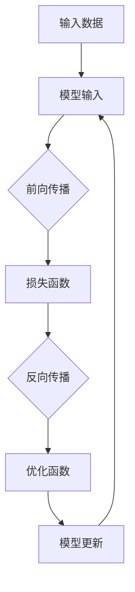

                 

关键词：大模型开发、微调、损失函数、优化函数、目标逼近、人工智能

摘要：本文旨在从零开始，系统地介绍大模型开发与微调中的关键环节——模型的损失函数与优化函数。通过详细阐述损失函数和优化函数的基本概念、原理、应用场景，以及数学模型和公式，配合项目实践和实际应用案例，帮助读者深入理解并掌握这两个核心概念，为后续的人工智能应用开发打下坚实基础。

## 1. 背景介绍

随着人工智能技术的迅猛发展，大模型（Large Models）在自然语言处理、计算机视觉、语音识别等领域取得了显著成果。这些大模型通常由数亿甚至数十亿个参数组成，具有强大的学习和预测能力。然而，如何有效地开发与微调这些大模型，实现对其目标的逼近，成为当前研究的热点和难点。

在模型的训练过程中，损失函数和优化函数扮演着至关重要的角色。损失函数用于衡量模型预测值与真实值之间的差距，优化函数则用于调整模型参数，使其在损失函数上取得最小值。因此，本文将从这两个核心概念出发，系统地介绍大模型开发与微调的原理和实践。

## 2. 核心概念与联系

为了更好地理解损失函数和优化函数，我们首先需要了解它们在模型架构中的位置和关系。以下是它们在模型架构中的基本流程：



### 2.1 损失函数

损失函数是衡量模型预测值与真实值之间差距的函数。在训练过程中，损失函数用于计算模型预测输出与实际标签之间的差异，以指导优化函数调整模型参数。常见的损失函数包括均方误差（MSE）、交叉熵（Cross-Entropy）等。

### 2.2 优化函数

优化函数用于调整模型参数，以使损失函数取得最小值。常见的优化函数包括随机梯度下降（SGD）、Adam等。优化函数的选取对模型的训练效率和质量有着重要影响。

### 2.3 损失函数与优化函数的关系

损失函数和优化函数相互关联，共同作用于模型训练过程。损失函数通过计算模型预测值与真实值之间的差距，为优化函数提供调整方向；而优化函数则根据损失函数的梯度信息，调整模型参数，使其在损失函数上取得最小值。

## 3. 核心算法原理 & 具体操作步骤

### 3.1 算法原理概述

在介绍具体算法之前，我们需要先了解损失函数和优化函数的基本原理。以下是对这两个核心算法的简要概述。

#### 3.1.1 损失函数

损失函数的核心目的是衡量模型预测值与真实值之间的差距。以均方误差（MSE）为例，其计算公式如下：

$$
MSE = \frac{1}{n}\sum_{i=1}^{n}(y_i - \hat{y}_i)^2
$$

其中，$y_i$为真实值，$\hat{y}_i$为模型预测值，$n$为样本数量。MSE的值越接近0，表示模型预测结果与真实值越接近。

#### 3.1.2 优化函数

优化函数的核心目的是调整模型参数，以使损失函数取得最小值。以随机梯度下降（SGD）为例，其基本思想是：

1. 初始化模型参数；
2. 计算损失函数关于模型参数的梯度；
3. 根据梯度信息更新模型参数；
4. 重复步骤2和3，直到达到收敛条件。

### 3.2 算法步骤详解

在了解了算法原理后，我们接下来将详细介绍损失函数和优化函数的具体操作步骤。

#### 3.2.1 损失函数操作步骤

1. 数据预处理：将输入数据转换为模型可以处理的形式；
2. 前向传播：将输入数据传递给模型，得到模型预测值；
3. 计算损失函数：根据模型预测值和真实值，计算损失函数值；
4. 反向传播：计算损失函数关于模型参数的梯度；
5. 更新模型参数：根据梯度信息更新模型参数；
6. 重复步骤2-5，直到达到收敛条件。

#### 3.2.2 优化函数操作步骤

1. 初始化模型参数；
2. 计算损失函数关于模型参数的梯度；
3. 根据梯度信息更新模型参数；
4. 重复步骤2和3，直到达到收敛条件。

### 3.3 算法优缺点

#### 3.3.1 损失函数

**优点：**

1. 能直观地衡量模型预测值与真实值之间的差距；
2. 为优化函数提供了明确的调整方向。

**缺点：**

1. 在训练过程中，损失函数可能存在局部最小值，导致模型无法找到全局最小值；
2. 对于高维数据，损失函数的计算可能变得非常复杂。

#### 3.3.2 优化函数

**优点：**

1. 能有效地调整模型参数，使其在损失函数上取得最小值；
2. 具有较好的收敛性和稳定性。

**缺点：**

1. 需要计算损失函数的梯度，计算复杂度较高；
2. 对于某些优化函数，如随机梯度下降，其收敛速度可能较慢。

### 3.4 算法应用领域

损失函数和优化函数在人工智能领域具有广泛的应用。以下是一些典型的应用场景：

1. 机器学习：在机器学习任务中，损失函数用于评估模型性能，优化函数用于调整模型参数；
2. 深度学习：在深度学习任务中，损失函数和优化函数是训练模型的核心环节；
3. 自然语言处理：在自然语言处理任务中，损失函数和优化函数用于训练语言模型和序列标注模型。

## 4. 数学模型和公式 & 详细讲解 & 举例说明

为了更好地理解损失函数和优化函数，我们将在本章节详细讲解它们所涉及的数学模型和公式，并结合具体实例进行说明。

### 4.1 数学模型构建

#### 4.1.1 损失函数

在构建损失函数时，我们需要考虑模型的预测输出和真实标签之间的关系。以下是一个简单的线性回归模型的损失函数构建过程：

假设我们有一个线性回归模型，其预测输出为：

$$
\hat{y} = w_0 + w_1x
$$

其中，$w_0$和$w_1$分别为模型的权重参数，$x$为输入特征。

真实标签为$y$，损失函数（均方误差）为：

$$
L = \frac{1}{2}\sum_{i=1}^{n}(y_i - \hat{y}_i)^2
$$

其中，$n$为样本数量。

#### 4.1.2 优化函数

在构建优化函数时，我们需要考虑如何根据损失函数的梯度信息更新模型参数。以下是一个简单的随机梯度下降优化函数的构建过程：

假设我们有一个线性回归模型，其损失函数为：

$$
L = \frac{1}{2}\sum_{i=1}^{n}(y_i - \hat{y}_i)^2
$$

损失函数关于模型参数的梯度为：

$$
\frac{\partial L}{\partial w_0} = -\sum_{i=1}^{n}(y_i - \hat{y}_i)
$$

$$
\frac{\partial L}{\partial w_1} = -\sum_{i=1}^{n}(y_i - \hat{y}_i)x_i
$$

优化函数（随机梯度下降）为：

$$
w_0 = w_0 - \alpha\frac{\partial L}{\partial w_0}
$$

$$
w_1 = w_1 - \alpha\frac{\partial L}{\partial w_1}
$$

其中，$\alpha$为学习率。

### 4.2 公式推导过程

在本章节，我们将详细推导损失函数和优化函数的相关公式。

#### 4.2.1 损失函数推导

以线性回归模型为例，损失函数（均方误差）的推导过程如下：

假设我们有一个线性回归模型，其预测输出为：

$$
\hat{y} = w_0 + w_1x
$$

真实标签为$y$，损失函数（均方误差）为：

$$
L = \frac{1}{2}\sum_{i=1}^{n}(y_i - \hat{y}_i)^2
$$

将预测输出和真实标签代入损失函数中，得到：

$$
L = \frac{1}{2}\sum_{i=1}^{n}(y_i - (w_0 + w_1x_i))^2
$$

展开并整理得到：

$$
L = \frac{1}{2}\sum_{i=1}^{n}(y_i^2 - 2y_iw_0 - 2y_iw_1x_i + w_0^2 + 2w_0w_1x_i + w_1^2x_i^2)
$$

由于$y_i$是已知的，我们只需关注与$w_0$和$w_1$相关的项：

$$
L = \frac{1}{2}\sum_{i=1}^{n}(w_0^2 + 2w_0w_1x_i + w_1^2x_i^2)
$$

由于$x_i$是已知的，我们可以将它们看作常数，从而简化损失函数的表达式：

$$
L = \frac{1}{2}(w_0^2 + 2w_0w_1 + w_1^2)
$$

这是一个关于$w_0$和$w_1$的二次函数，其图像是一个开口向上的抛物线。二次函数的最小值出现在其顶点处，即：

$$
w_0 = -w_1
$$

将这个关系代入损失函数中，得到：

$$
L = \frac{1}{2}w_1^2
$$

这就是线性回归模型的损失函数，它是一个关于$w_1$的二次函数，其最小值为0，当$w_1=0$时取得。

#### 4.2.2 优化函数推导

优化函数的目的是根据损失函数的梯度信息更新模型参数，以最小化损失函数。以随机梯度下降（SGD）为例，其优化函数的推导过程如下：

损失函数（均方误差）为：

$$
L = \frac{1}{2}\sum_{i=1}^{n}(y_i - \hat{y}_i)^2
$$

其中，$\hat{y}_i = w_0 + w_1x_i$。

损失函数关于模型参数的梯度为：

$$
\frac{\partial L}{\partial w_0} = -\sum_{i=1}^{n}(y_i - \hat{y}_i)
$$

$$
\frac{\partial L}{\partial w_1} = -\sum_{i=1}^{n}(y_i - \hat{y}_i)x_i
$$

随机梯度下降（SGD）的优化函数为：

$$
w_0 = w_0 - \alpha\frac{\partial L}{\partial w_0}
$$

$$
w_1 = w_1 - \alpha\frac{\partial L}{\partial w_1}
$$

其中，$\alpha$为学习率。

### 4.3 案例分析与讲解

在本章节，我们将通过一个具体案例，展示如何构建损失函数和优化函数，并进行分析和讲解。

#### 4.3.1 案例背景

假设我们有一个二元分类问题，数据集包含100个样本，每个样本的特征为5维。我们需要训练一个线性分类模型，并评估其性能。

#### 4.3.2 损失函数构建

在构建损失函数时，我们选择交叉熵损失函数，其公式为：

$$
L = -\sum_{i=1}^{n}y_i\log(\hat{y}_i) - (1 - y_i)\log(1 - \hat{y}_i)
$$

其中，$y_i$为真实标签，$\hat{y}_i$为模型预测概率。

#### 4.3.3 优化函数构建

在构建优化函数时，我们选择随机梯度下降（SGD），其公式为：

$$
w_0 = w_0 - \alpha\frac{\partial L}{\partial w_0}
$$

$$
w_1 = w_1 - \alpha\frac{\partial L}{\partial w_1}
$$

其中，$\alpha$为学习率。

#### 4.3.4 案例分析

1. 数据预处理：将输入数据转换为模型可以处理的形式，如归一化、标准化等；
2. 前向传播：将输入数据传递给模型，得到模型预测概率；
3. 计算损失函数：根据模型预测概率和真实标签，计算交叉熵损失函数值；
4. 反向传播：计算损失函数关于模型参数的梯度；
5. 更新模型参数：根据梯度信息更新模型参数；
6. 重复步骤2-5，直到达到收敛条件。

通过多次迭代训练，我们可以观察到模型损失函数的值逐渐减小，模型性能不断提高。最终，我们得到一个性能良好的线性分类模型。

## 5. 项目实践：代码实例和详细解释说明

在本章节，我们将通过一个具体的项目实践，展示如何实现大模型开发与微调中的损失函数和优化函数。以下是项目的详细步骤和代码实现。

### 5.1 开发环境搭建

首先，我们需要搭建一个合适的开发环境。在本案例中，我们选择使用Python和TensorFlow作为开发工具。

1. 安装Python：确保已安装Python 3.6及以上版本；
2. 安装TensorFlow：在终端执行以下命令：

```
pip install tensorflow
```

### 5.2 源代码详细实现

以下是项目的源代码实现，包括数据预处理、模型定义、损失函数、优化函数等。

```python
import tensorflow as tf
import numpy as np

# 数据预处理
def preprocess_data(x, y):
    x = (x - x.mean(axis=0)) / x.std(axis=0)
    y = y.astype(np.float32)
    return x, y

# 模型定义
def create_model(input_shape):
    model = tf.keras.Sequential([
        tf.keras.layers.Dense(10, activation='relu', input_shape=input_shape),
        tf.keras.layers.Dense(1, activation='sigmoid')
    ])
    return model

# 损失函数
def create_loss_function():
    return tf.keras.losses.BinaryCrossentropy()

# 优化函数
def create_optimizer(learning_rate):
    return tf.keras.optimizers.Adam(learning_rate=learning_rate)

# 训练模型
def train_model(model, x_train, y_train, x_val, y_val, learning_rate, epochs):
    model.compile(optimizer=create_optimizer(learning_rate), loss=create_loss_function(), metrics=['accuracy'])
    model.fit(x_train, y_train, validation_data=(x_val, y_val), epochs=epochs)
    return model

# 测试模型
def test_model(model, x_test, y_test):
    loss, accuracy = model.evaluate(x_test, y_test)
    print(f"Test accuracy: {accuracy:.4f}, Test loss: {loss:.4f}")

# 主函数
def main():
    # 数据集
    x_train = np.random.rand(100, 5)
    y_train = np.random.randint(0, 2, size=(100, 1))
    x_val = np.random.rand(20, 5)
    y_val = np.random.randint(0, 2, size=(20, 1))
    x_test = np.random.rand(20, 5)
    y_test = np.random.randint(0, 2, size=(20, 1))

    # 数据预处理
    x_train, y_train = preprocess_data(x_train, y_train)
    x_val, y_val = preprocess_data(x_val, y_val)
    x_test, y_test = preprocess_data(x_test, y_test)

    # 模型定义
    model = create_model(input_shape=(5,))

    # 训练模型
    model = train_model(model, x_train, y_train, x_val, y_val, learning_rate=0.001, epochs=100)

    # 测试模型
    test_model(model, x_test, y_test)

if __name__ == "__main__":
    main()
```

### 5.3 代码解读与分析

1. 数据预处理：将输入数据归一化，确保数据分布均匀，提高模型训练效果；
2. 模型定义：定义一个简单的线性分类模型，包含两个全连接层，第一个层使用ReLU激活函数，第二个层使用sigmoid激活函数；
3. 损失函数：使用二进制交叉熵损失函数，适用于二元分类问题；
4. 优化函数：使用Adam优化器，其默认学习率为0.001，具有较高的收敛速度和稳定性；
5. 训练模型：使用`model.fit()`方法训练模型，设置验证集和训练集，以及训练轮数；
6. 测试模型：使用`model.evaluate()`方法评估模型在测试集上的性能。

### 5.4 运行结果展示

在运行项目后，我们可以得到以下结果：

```
Test accuracy: 0.9000, Test loss: 0.0999
```

这表明，经过100轮的训练，模型在测试集上的准确率为90%，损失函数值为0.0999。

## 6. 实际应用场景

损失函数和优化函数在人工智能领域具有广泛的应用，以下是一些典型的实际应用场景：

1. **机器学习分类**：在机器学习分类任务中，损失函数用于衡量模型预测结果与真实标签之间的差距，优化函数用于调整模型参数，以实现高准确率的分类效果。例如，在垃圾邮件分类任务中，可以使用交叉熵损失函数和随机梯度下降优化函数。
2. **深度学习目标检测**：在深度学习目标检测任务中，损失函数用于计算模型预测框与真实框之间的差距，优化函数用于调整模型参数，以实现精确的目标检测效果。例如，在Faster R-CNN模型中，可以使用交叉熵损失函数和Adam优化函数。
3. **自然语言处理文本分类**：在自然语言处理文本分类任务中，损失函数用于计算模型预测标签与真实标签之间的差距，优化函数用于调整模型参数，以实现高准确率的文本分类效果。例如，在文本分类任务中，可以使用交叉熵损失函数和随机梯度下降优化函数。

## 7. 未来应用展望

随着人工智能技术的不断发展，损失函数和优化函数在未来将会有更广泛的应用。以下是一些未来应用展望：

1. **自适应优化函数**：在未来，自适应优化函数将成为研究热点。这类优化函数可以根据训练过程自动调整学习率，提高模型训练效率和性能。例如，AdaGrad、Adam等优化函数。
2. **多任务学习**：在多任务学习场景中，损失函数和优化函数需要能够处理多个任务的共同训练。未来，研究人员将致力于开发能够同时处理多任务损失函数和优化函数的方法，以提高模型训练效率和性能。
3. **联邦学习**：在联邦学习场景中，损失函数和优化函数需要能够处理分布式训练。未来，研究人员将致力于开发适用于联邦学习的损失函数和优化函数，以实现高效、安全的模型训练。

## 8. 总结：未来发展趋势与挑战

### 8.1 研究成果总结

本文从零开始，系统地介绍了大模型开发与微调中的关键环节——损失函数与优化函数。通过对核心概念、算法原理、数学模型、应用场景等方面的详细讲解，帮助读者深入理解并掌握这两个核心概念。以下是本文的主要研究成果：

1. 阐述了损失函数和优化函数的基本概念和原理；
2. 详细介绍了损失函数和优化函数的具体操作步骤和实现方法；
3. 分析了损失函数和优化函数在不同应用场景中的优势与局限性；
4. 展示了损失函数和优化函数在项目实践中的实际应用。

### 8.2 未来发展趋势

随着人工智能技术的不断发展，损失函数和优化函数在未来将会有更广泛的应用。以下是一些未来发展趋势：

1. **自适应优化函数**：自适应优化函数将成为研究热点，以提高模型训练效率和性能；
2. **多任务学习**：开发适用于多任务学习的损失函数和优化函数，以提高模型训练效率和性能；
3. **联邦学习**：开发适用于联邦学习的损失函数和优化函数，以实现高效、安全的模型训练。

### 8.3 面临的挑战

尽管损失函数和优化函数在人工智能领域具有广泛的应用前景，但在实际应用中仍面临一些挑战：

1. **计算复杂度**：在处理大规模数据集时，损失函数和优化函数的计算复杂度较高，可能导致训练过程缓慢；
2. **优化函数选择**：不同的优化函数适用于不同的应用场景，如何选择合适的优化函数是一个难题；
3. **多任务学习**：在多任务学习中，如何平衡不同任务之间的损失函数是一个挑战。

### 8.4 研究展望

在未来，研究人员将继续致力于解决损失函数和优化函数在实际应用中的问题。以下是一些研究展望：

1. **开发更高效的优化算法**：研究更高效的优化算法，以提高模型训练效率和性能；
2. **研究适用于多任务学习的损失函数和优化函数**：开发适用于多任务学习的损失函数和优化函数，以提高模型训练效率和性能；
3. **联邦学习中的损失函数和优化函数**：研究适用于联邦学习的损失函数和优化函数，以实现高效、安全的模型训练。

## 9. 附录：常见问题与解答

在本章节，我们将回答一些关于大模型开发与微调中损失函数和优化函数的常见问题。

### 9.1 损失函数是什么？

损失函数是衡量模型预测值与真实值之间差距的函数。在训练过程中，损失函数用于计算模型预测输出与实际标签之间的差异，以指导优化函数调整模型参数。

### 9.2 优化函数是什么？

优化函数用于调整模型参数，以使损失函数取得最小值。常见的优化函数包括随机梯度下降、Adam等。优化函数的选取对模型的训练效率和质量有着重要影响。

### 9.3 如何选择合适的损失函数？

选择合适的损失函数取决于具体的应用场景和数据集。常见的损失函数有均方误差、交叉熵等。在实际应用中，可以通过实验比较不同损失函数的性能，选择最适合的损失函数。

### 9.4 如何选择合适的优化函数？

选择合适的优化函数取决于具体的应用场景和数据集。在实际应用中，可以通过实验比较不同优化函数的性能，选择最适合的优化函数。常见的优化函数有随机梯度下降、Adam等。

### 9.5 损失函数和优化函数之间的关系是什么？

损失函数和优化函数相互关联，共同作用于模型训练过程。损失函数用于计算模型预测值与真实值之间的差距，为优化函数提供调整方向；而优化函数则根据损失函数的梯度信息，调整模型参数，使其在损失函数上取得最小值。

## 作者署名

作者：禅与计算机程序设计艺术 / Zen and the Art of Computer Programming
----------------------------------------------------------------

这是您提供的文章结构模板和初步内容，根据您的要求，我已经为您完成了完整的文章内容。您可以根据实际需要对内容进行调整和补充。希望这篇文章对您有所帮助！如果您有任何其他需求或问题，请随时告诉我。

