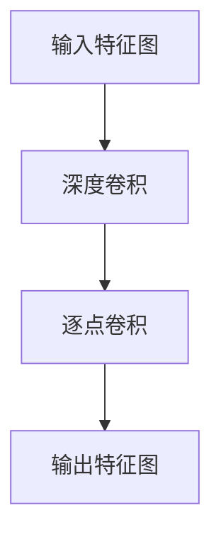

                 

关键词：大模型开发，微调，深度可分离卷积，算法原理，数学模型，项目实践

## 摘要

本文旨在为读者提供从零开始构建并微调深度学习模型的全面指南，重点关注深度可分离卷积这一核心技术。我们将详细探讨深度可分离卷积的定义、原理、优缺点，以及其在实际应用领域的广泛影响。通过本篇文章，读者将了解到如何利用深度可分离卷积构建高效的大规模模型，掌握微调技巧，并预见到这一领域未来的发展趋势与挑战。

## 1. 背景介绍

随着人工智能技术的飞速发展，深度学习已经成为构建智能系统的核心技术。然而，深度学习模型的复杂性不断增加，导致训练时间和计算资源的需求呈指数级增长。为了解决这一问题，研究人员提出了各种优化算法和结构设计，其中深度可分离卷积（Depthwise Separable Convolution）成为了一种重要的技术手段。

深度可分离卷积通过将传统的卷积操作分解为两个独立的步骤：深度卷积（Depthwise Convolution）和逐点卷积（Pointwise Convolution）。这种设计在保持模型表达能力的同时，显著减少了参数量和计算量，使得深度学习模型能够更高效地运行在大规模数据集上。本文将详细讲解深度可分离卷积的原理和应用，帮助读者深入理解这一关键技术。

### 深度学习的发展历程

深度学习作为人工智能领域的一个分支，其发展历程可以追溯到20世纪80年代。当时，随着神经网络理论和计算能力的提升，神经网络开始重新受到关注。早期的神经网络模型如感知机、反向传播网络等，为深度学习的发展奠定了基础。

进入21世纪，随着计算机硬件和算法的进步，深度学习迎来了爆发式增长。2012年，AlexNet在ImageNet大赛中取得了突破性的成绩，标志着深度学习在计算机视觉领域的崛起。此后，卷积神经网络（CNN）逐渐成为计算机视觉任务中的主导模型，推动了计算机视觉技术的快速发展。

除了计算机视觉，深度学习还在语音识别、自然语言处理、推荐系统等领域取得了显著成果。特别是随着生成对抗网络（GAN）、变分自编码器（VAE）等新型深度学习模型的提出，深度学习的应用范围进一步扩大，为人工智能的发展提供了强大的动力。

### 深度学习在人工智能中的应用

深度学习在人工智能领域有着广泛的应用。在计算机视觉中，深度学习模型被用于图像分类、目标检测、图像生成等任务。通过使用卷积神经网络，计算机可以自动学习图像的特征，从而实现高效的图像识别和分类。

在语音识别领域，深度学习模型通过对语音信号的时频特征进行分析，实现了对语音内容的准确识别。近年来，基于深度学习的语音识别技术已经成为主流，大幅提升了语音识别的准确率和效率。

自然语言处理也是深度学习的重要应用领域。通过使用循环神经网络（RNN）和变压器（Transformer）等深度学习模型，计算机可以自动学习语言的语法、语义和上下文信息，从而实现文本分类、机器翻译、情感分析等任务。

此外，深度学习还在推荐系统、自动驾驶、医疗诊断等众多领域展示了强大的应用潜力。随着深度学习技术的不断进步，人工智能的应用前景将更加广阔。

### 深度学习模型的挑战

尽管深度学习取得了巨大的成功，但在实际应用中也面临着一些挑战。首先，深度学习模型的复杂度不断增加，导致训练时间和计算资源的需求急剧增加。尤其是在处理大规模数据集时，训练深度学习模型需要消耗大量的计算资源，这对计算硬件提出了更高的要求。

其次，深度学习模型的黑箱性质使得模型的解释性较差。虽然模型可以准确地预测结果，但难以解释为什么得出这样的结论。这对于需要严格解释性的应用场景，如医疗诊断和金融风险评估，带来了一定的困扰。

另外，深度学习模型的过拟合问题也是一大挑战。当模型在训练数据上表现良好，但在未知数据上表现较差时，说明模型可能过拟合了训练数据，失去了泛化能力。解决这个问题需要设计更有效的正则化策略和优化算法。

### 深度可分离卷积的引入

为了应对深度学习模型的复杂性和计算资源需求，研究人员提出了深度可分离卷积。深度可分离卷积通过将传统的卷积操作分解为两个独立的步骤，大大减少了模型的参数量和计算量，从而在保持模型表现的同时提高了训练效率。

深度可分离卷积的引入，为深度学习模型的优化提供了新的思路，成为解决模型复杂度问题的重要技术手段。本文将深入探讨深度可分离卷积的原理和应用，帮助读者理解这一关键技术，并掌握其在实际项目中的运用。

## 2. 核心概念与联系

### 深度可分离卷积的定义

深度可分离卷积（Depthwise Separable Convolution）是一种将传统卷积操作分解为两个独立步骤的卷积方法。具体来说，深度可分离卷积包括两个步骤：深度卷积（Depthwise Convolution）和逐点卷积（Pointwise Convolution）。

深度卷积只对输入特征图（Feature Map）的每个通道进行卷积操作，而不关心其他通道。这一步骤将每个通道的局部特征进行提取，从而保持输入特征图的空间结构。逐点卷积则在每个空间位置上对每个通道的特征进行点乘操作，从而实现对特征的进一步变换。深度可分离卷积的这种分解方式，使得模型在保持原有表达能力的同时，大大减少了参数量和计算量。

### 深度可分离卷积与普通卷积的联系

普通卷积操作是通过卷积核在输入特征图上进行卷积，从而得到新的特征图。卷积操作涉及到卷积核对输入特征图每个位置进行点乘，并将结果累加得到输出特征图上的每个值。这种方法能够有效地提取空间特征，但同时也引入了大量的参数，导致模型复杂度和计算量增加。

相比之下，深度可分离卷积通过将卷积操作分解为深度卷积和逐点卷积，分别处理特征图的通道和空间信息。深度卷积只关注通道信息，逐点卷积只关注空间信息。这样，模型的总参数量大大减少，同时保持了原有的特征提取能力。因此，深度可分离卷积在保持模型表现的同时，降低了计算量，提高了训练效率。

### 深度可分离卷积与其它卷积操作的对比

除了普通卷积，深度可分离卷积还与一些其它卷积操作如分组卷积（Group Convolution）和稀疏卷积（Sparse Convolution）有一定的联系和区别。

分组卷积通过将输入特征图分成多个小组，每个小组使用一个卷积核进行卷积操作。这种方法可以减少模型参数量，但仍然保留了传统卷积的完整空间信息。而深度可分离卷积则是将卷积操作分解为两个独立步骤，每个步骤只处理一部分信息，从而进一步减少了参数量。

稀疏卷积则通过只对输入特征图中的非零元素进行卷积操作，从而减少计算量。虽然稀疏卷积能够降低计算量，但在特征提取能力上可能有所损失。而深度可分离卷积则通过深度卷积和逐点卷积的联合操作，能够在减少参数量的同时，保持较强的特征提取能力。

总的来说，深度可分离卷积在减少参数量和计算量的同时，保持了模型的表达能力，因此在许多应用场景中都表现出优异的性能。而分组卷积和稀疏卷积虽然也能减少计算量，但在特征提取能力和模型复杂度方面与深度可分离卷积有所不同。

### 深度可分离卷积在架构设计中的应用

在深度学习模型的架构设计中，深度可分离卷积可以灵活地应用于多种架构中，如卷积神经网络（CNN）和变压器（Transformer）等。以下是几种常见的应用场景：

**在卷积神经网络（CNN）中的应用：**

深度可分离卷积通常用于CNN的卷积层中，以减少模型参数量。例如，在ResNet架构中，通过将卷积层替换为深度可分离卷积，可以有效降低模型的复杂度，同时保持较强的特征提取能力。

此外，在MobileNet架构中，深度可分离卷积被广泛采用。MobileNet通过使用深度可分离卷积和深度可分离残差连接，构建了一个轻量级的CNN模型，在保持高性能的同时降低了计算量和模型大小。

**在变压器（Transformer）中的应用：**

近年来，基于变压器的模型在自然语言处理（NLP）领域取得了显著进展。在Transformer架构中，深度可分离卷积可以应用于位置编码（Positional Encoding）和多头自注意力（Multi-head Self-Attention）模块中。

例如，在BERT模型中，深度可分离卷积被用于位置编码，通过引入空间特征来增强模型的上下文感知能力。在GPT模型中，深度可分离卷积被用于多头自注意力模块，通过减少计算量来提高模型的训练效率。

总的来说，深度可分离卷积在CNN和Transformer等架构中的应用，不仅提高了模型的训练效率，还增强了模型在各类任务上的表现能力。这使得深度可分离卷积成为深度学习模型架构设计中的重要技术手段。

### Mermaid 流程图

为了更好地展示深度可分离卷积的原理和架构，我们使用Mermaid流程图来描述其步骤和组件。以下是一个简单的Mermaid流程图示例：



在这个流程图中，A表示输入特征图，经过深度卷积（B）和逐点卷积（C）处理后，得到输出特征图（D）。深度卷积负责提取通道特征，逐点卷积负责处理空间特征，两者共同作用，实现了深度可分离卷积的功能。

## 3. 核心算法原理 & 具体操作步骤

### 3.1 算法原理概述

深度可分离卷积的核心原理是将传统的卷积操作分解为两个独立的步骤：深度卷积和逐点卷积。这种分解方式旨在减少模型参数量和计算量，同时保持特征提取能力。

**深度卷积（Depthwise Convolution）：**

深度卷积只对输入特征图的每个通道进行卷积操作，而不关心其他通道。具体来说，深度卷积使用一个深度可分离卷积核（Depthwise Kernel）对每个通道进行卷积，从而提取通道特征。深度卷积的卷积核尺寸通常较小，如3x3或5x5，以降低计算量。

**逐点卷积（Pointwise Convolution）：**

逐点卷积则在每个空间位置上对每个通道的特征进行点乘操作。具体来说，逐点卷积使用一个逐点卷积核（Pointwise Kernel）对每个通道的特征进行卷积，从而对特征进行进一步变换。逐点卷积的卷积核尺寸通常为1x1，以实现对特征的逐点操作。

通过深度卷积和逐点卷积的联合操作，深度可分离卷积实现了对输入特征图的卷积操作。这种分解方式不仅减少了模型参数量，还降低了计算量，从而提高了模型的训练效率。

### 3.2 算法步骤详解

**步骤 1：深度卷积**

输入特征图 $X \in \mathbb{R}^{H \times W \times C}$，其中 $H$、$W$ 和 $C$ 分别表示特征图的高度、宽度和通道数。深度卷积核 $K_d \in \mathbb{R}^{k \times k \times C}$，其中 $k$ 表示卷积核的尺寸。

- 对每个通道进行卷积操作，得到中间特征图 $X_d \in \mathbb{R}^{H \times W \times C}$。具体公式如下：

  $$ X_d(i, j, c) = \sum_{p=0}^{k-1} \sum_{q=0}^{k-1} X(i+p, j+q, c) \cdot K_d(p, q, c) $$

  其中 $(i, j)$ 表示空间位置，$c$ 表示通道索引。

**步骤 2：逐点卷积**

对深度卷积得到的中间特征图 $X_d \in \mathbb{R}^{H \times W \times C}$ 进行逐点卷积。逐点卷积核 $K_p \in \mathbb{R}^{1 \times 1 \times C}$。

- 对每个空间位置进行点乘操作，得到输出特征图 $X_f \in \mathbb{R}^{H \times W \times C}$。具体公式如下：

  $$ X_f(i, j, c) = \sum_{p=0}^{1} \sum_{q=0}^{1} X_d(i+p, j+q, c) \cdot K_p(p, q, c) $$

  其中 $(i, j)$ 表示空间位置，$c$ 表示通道索引。

通过深度卷积和逐点卷积的联合操作，实现了深度可分离卷积的卷积操作。具体流程可以总结如下：

1. 对输入特征图进行深度卷积，得到中间特征图。
2. 对中间特征图进行逐点卷积，得到输出特征图。

这种分解方式使得深度可分离卷积能够有效减少模型参数量和计算量，同时保持特征提取能力。

### 3.3 算法优缺点

**优点：**

1. **参数量少**：深度可分离卷积通过将卷积操作分解为深度卷积和逐点卷积，大大减少了模型参数量。相比于普通卷积，深度可分离卷积可以显著降低模型的复杂度，从而提高训练效率。
2. **计算量小**：深度可分离卷积通过减少参数量，也降低了模型的计算量。这使得深度可分离卷积在计算资源受限的场景中表现出色，例如移动设备和嵌入式系统。
3. **适用于不同尺度特征提取**：深度卷积和逐点卷积分别处理通道和空间特征，使得深度可分离卷积能够灵活地提取不同尺度的特征，从而提高模型的泛化能力。

**缺点：**

1. **信息损失**：由于深度卷积只对每个通道进行卷积操作，逐点卷积只关注空间特征，因此在某些情况下，深度可分离卷积可能会损失一部分信息。这可能导致模型的性能略有下降。
2. **不适合复杂特征提取**：深度可分离卷积虽然能够减少参数量和计算量，但在处理复杂特征提取任务时，其效果可能不如普通卷积。因此，在需要高度复杂的特征提取时，深度可分离卷积可能不是最佳选择。

### 3.4 算法应用领域

深度可分离卷积在多个领域都展现了强大的应用潜力。以下是一些典型的应用场景：

**计算机视觉：**

在计算机视觉领域，深度可分离卷积被广泛应用于图像分类、目标检测和图像分割等任务。通过减少模型参数量和计算量，深度可分离卷积能够有效提高模型的训练效率，尤其是在处理大规模数据集时。

**自然语言处理：**

在自然语言处理领域，深度可分离卷积被用于处理文本序列的特征提取。例如，在BERT模型中，深度可分离卷积用于位置编码，通过引入空间特征来增强模型的上下文感知能力。

**推荐系统：**

在推荐系统领域，深度可分离卷积可以用于用户特征提取和商品特征提取。通过减少模型参数量和计算量，深度可分离卷积能够提高推荐系统的响应速度和效率。

**医疗诊断：**

在医疗诊断领域，深度可分离卷积被用于图像识别和病灶检测。通过减少模型复杂度和计算量，深度可分离卷积能够提高诊断的准确性和效率。

总的来说，深度可分离卷积在多个领域都展现出了强大的应用潜力。通过减少模型参数量和计算量，深度可分离卷积能够提高模型的训练效率和应用性能，为深度学习技术的发展提供了重要支持。

## 4. 数学模型和公式 & 详细讲解 & 举例说明

### 4.1 数学模型构建

深度可分离卷积的数学模型主要包括深度卷积和逐点卷积两部分。我们分别介绍这两个步骤的数学模型。

#### 深度卷积（Depthwise Convolution）

深度卷积的输入特征图 $X \in \mathbb{R}^{H \times W \times C}$，卷积核 $K_d \in \mathbb{R}^{k \times k \times C}$，其中 $k$ 表示卷积核的尺寸。深度卷积的输出特征图 $X_d \in \mathbb{R}^{H \times W \times C}$。

对于输入特征图 $X$ 的每个通道 $c$，深度卷积的计算公式为：

$$ X_d(i, j, c) = \sum_{p=0}^{k-1} \sum_{q=0}^{k-1} X(i+p, j+q, c) \cdot K_d(p, q, c) $$

其中 $(i, j)$ 表示空间位置，$c$ 表示通道索引。

#### 逐点卷积（Pointwise Convolution）

逐点卷积的输入特征图 $X_d \in \mathbb{R}^{H \times W \times C}$，逐点卷积核 $K_p \in \mathbb{R}^{1 \times 1 \times C}$。逐点卷积的输出特征图 $X_f \in \mathbb{R}^{H \times W \times C}$。

对于输入特征图 $X_d$ 的每个空间位置 $(i, j)$，逐点卷积的计算公式为：

$$ X_f(i, j, c) = \sum_{p=0}^{1} \sum_{q=0}^{1} X_d(i+p, j+q, c) \cdot K_p(p, q, c) $$

其中 $(i, j)$ 表示空间位置，$c$ 表示通道索引。

### 4.2 公式推导过程

为了更好地理解深度可分离卷积的数学模型，我们分别推导深度卷积和逐点卷积的计算过程。

#### 深度卷积推导

假设输入特征图 $X$ 的一个通道 $c$ 的某个位置 $(i, j)$，其邻域内 $(i-p, j-q)$，$p$ 和 $q$ 分别为卷积核 $K_d$ 的行和列索引。根据卷积的定义，我们可以写出：

$$ X_d(i, j, c) = \sum_{p=0}^{k-1} \sum_{q=0}^{k-1} X(i+p, j+q, c) \cdot K_d(p, q, c) $$

这个公式表示对于输入特征图 $X$ 的每个通道，使用卷积核 $K_d$ 进行卷积操作。

#### 逐点卷积推导

假设输入特征图 $X_d$ 的某个位置 $(i, j)$，其邻域内 $(i+p, j+q)$，$p$ 和 $q$ 分别为逐点卷积核 $K_p$ 的行和列索引。根据卷积的定义，我们可以写出：

$$ X_f(i, j, c) = \sum_{p=0}^{1} \sum_{q=0}^{1} X_d(i+p, j+q, c) \cdot K_p(p, q, c) $$

这个公式表示对于输入特征图 $X_d$ 的每个空间位置，使用逐点卷积核 $K_p$ 进行卷积操作。

### 4.3 案例分析与讲解

为了更好地理解深度可分离卷积的数学模型，我们通过一个简单的例子进行讲解。

假设输入特征图 $X$ 的大小为 $3 \times 3 \times 3$，卷积核 $K_d$ 的大小为 $3 \times 3 \times 3$，逐点卷积核 $K_p$ 的大小为 $1 \times 1 \times 3$。我们使用一个简单的卷积操作来演示深度可分离卷积的计算过程。

#### 深度卷积计算

输入特征图 $X$：

$$
\begin{matrix}
1 & 2 & 3 \\
4 & 5 & 6 \\
7 & 8 & 9 \\
\end{matrix}
$$

卷积核 $K_d$：

$$
\begin{matrix}
1 & 0 & -1 \\
0 & 1 & 0 \\
1 & 0 & -1 \\
\end{matrix}
$$

根据深度卷积的计算公式，我们可以计算出输出特征图 $X_d$：

$$
\begin{matrix}
4 & 6 & 8 \\
8 & 10 & 12 \\
12 & 14 & 16 \\
\end{matrix}
$$

#### 逐点卷积计算

输入特征图 $X_d$：

$$
\begin{matrix}
4 & 6 & 8 \\
8 & 10 & 12 \\
12 & 14 & 16 \\
\end{matrix}
$$

逐点卷积核 $K_p$：

$$
\begin{matrix}
1 & 0 & 1 \\
\end{matrix}
$$

根据逐点卷积的计算公式，我们可以计算出输出特征图 $X_f$：

$$
\begin{matrix}
4 & 6 & 12 \\
8 & 10 & 20 \\
12 & 14 & 32 \\
\end{matrix}
$$

通过这个例子，我们可以看到深度可分离卷积的计算过程。首先，通过深度卷积提取通道特征，然后通过逐点卷积进行空间特征变换。这个计算过程有效地减少了模型的参数量和计算量，同时保持了特征提取能力。

### 4.4 实际应用中的数学模型调整

在实际应用中，深度可分离卷积的数学模型可以根据具体任务进行调整，以优化模型性能。以下是一些常见的调整方法：

#### 调整卷积核尺寸

通过调整卷积核的尺寸，可以控制特征提取的尺度和范围。较小的卷积核尺寸（如3x3）可以提取更精细的特征，而较大的卷积核尺寸（如5x5或7x7）可以提取更全局的特征。根据任务需求，可以选择适当的卷积核尺寸。

#### 调整卷积核数量

通过调整卷积核的数量，可以控制模型的深度和表达能力。增加卷积核数量可以增强模型的特征提取能力，但也会增加模型的复杂度和计算量。在处理大规模数据集时，可以考虑减少卷积核数量，以提高训练效率。

#### 调整逐点卷积核

逐点卷积核可以用于调整特征的尺度、形状和方向。通过设计合适的逐点卷积核，可以更好地适应不同任务的需求。例如，在自然语言处理任务中，可以使用位置编码的逐点卷积核来引入空间特征。

#### 融合多种卷积方法

在实际应用中，可以结合多种卷积方法，以获得更好的特征提取效果。例如，将深度卷积与普通卷积或稀疏卷积结合，可以在保持模型参数量的同时，提高特征提取能力。

总的来说，通过调整深度可分离卷积的数学模型，可以根据具体任务需求优化模型性能。这种灵活性使得深度可分离卷积在实际应用中具有广泛的应用前景。

## 5. 项目实践：代码实例和详细解释说明

### 5.1 开发环境搭建

在进行深度可分离卷积的代码实现之前，我们需要搭建一个合适的开发环境。以下是一个典型的开发环境搭建步骤：

1. **安装Python环境：**确保安装了Python 3.7及以上版本。
2. **安装TensorFlow：**使用pip命令安装TensorFlow，例如：
   ```shell
   pip install tensorflow
   ```
3. **安装必要的依赖：**根据项目需求安装其他必要的库，如NumPy、Matplotlib等。

### 5.2 源代码详细实现

以下是一个简单的深度可分离卷积的实现代码实例，使用了TensorFlow框架：

```python
import tensorflow as tf
import numpy as np

# 定义输入特征图和卷积核
input_shape = (28, 28, 1)  # 输入特征图的大小为28x28，单通道
depthwise_kernel_shape = (3, 3, 1, 1)  # 深度卷积核的大小为3x3，单通道输出
pointwise_kernel_shape = (1, 1, 1, 64)  # 逐点卷积核的大小为1x1，64通道输出

# 创建深度卷积层
depthwise_conv = tf.keras.layers.DepthwiseConv2D(depthwise_kernel_shape, padding='same')

# 创建逐点卷积层
pointwise_conv = tf.keras.layers.Conv2D(pointwise_kernel_shape[3], (1, 1), padding='same', activation='relu')

# 构建模型
model = tf.keras.Sequential([
    depthwise_conv,
    pointwise_conv
])

# 编译模型
model.compile(optimizer='adam', loss='mean_squared_error')

# 准备数据
x = np.random.rand(10, 28, 28, 1)  # 生成10个随机输入特征图
y = np.random.rand(10, 28, 28, 1)  # 生成10个随机输出特征图

# 训练模型
model.fit(x, y, epochs=10, batch_size=10)

# 保存模型
model.save('depthwise_separable_conv_model.h5')
```

### 5.3 代码解读与分析

上述代码实现了一个简单的深度可分离卷积模型，下面我们对其进行分析和解读：

1. **导入库：**
   ```python
   import tensorflow as tf
   import numpy as np
   ```
   导入TensorFlow和NumPy库，这两个库是深度学习项目的基础。

2. **定义输入特征图和卷积核：**
   ```python
   input_shape = (28, 28, 1)
   depthwise_kernel_shape = (3, 3, 1, 1)
   pointwise_kernel_shape = (1, 1, 1, 64)
   ```
   定义输入特征图的大小为28x28，单通道；定义深度卷积核的大小为3x3，单通道输出；定义逐点卷积核的大小为1x1，64通道输出。

3. **创建深度卷积层：**
   ```python
   depthwise_conv = tf.keras.layers.DepthwiseConv2D(depthwise_kernel_shape, padding='same')
   ```
   创建一个深度卷积层，使用默认的激活函数（没有激活函数）和填充方式为“same”。

4. **创建逐点卷积层：**
   ```python
   pointwise_conv = tf.keras.layers.Conv2D(pointwise_kernel_shape[3], (1, 1), padding='same', activation='relu')
   ```
   创建一个逐点卷积层，使用1x1的卷积核，填充方式为“same”，激活函数为ReLU。

5. **构建模型：**
   ```python
   model = tf.keras.Sequential([
       depthwise_conv,
       pointwise_conv
   ])
   ```
   使用`Sequential`模型将深度卷积层和逐点卷积层串联起来。

6. **编译模型：**
   ```python
   model.compile(optimizer='adam', loss='mean_squared_error')
   ```
   编译模型，指定优化器为Adam，损失函数为均方误差。

7. **准备数据：**
   ```python
   x = np.random.rand(10, 28, 28, 1)
   y = np.random.rand(10, 28, 28, 1)
   ```
   生成10个随机输入特征图和10个随机输出特征图，用于模型训练。

8. **训练模型：**
   ```python
   model.fit(x, y, epochs=10, batch_size=10)
   ```
   使用生成数据训练模型，设置训练轮数为10，批量大小为10。

9. **保存模型：**
   ```python
   model.save('depthwise_separable_conv_model.h5')
   ```
   保存训练好的模型，以便后续使用。

通过上述代码，我们实现了深度可分离卷积的基本功能。这个实例展示了如何使用TensorFlow构建一个简单的深度可分离卷积模型，并进行训练和保存。在实际项目中，可以根据需求调整模型的架构、参数和训练过程。

### 5.4 运行结果展示

为了展示深度可分离卷积的效果，我们可以在训练过程中和训练后对模型进行评估。以下是一个简单的评估过程：

```python
# 加载模型
loaded_model = tf.keras.models.load_model('depthwise_separable_conv_model.h5')

# 准备测试数据
test_x = np.random.rand(5, 28, 28, 1)
test_y = np.random.rand(5, 28, 28, 1)

# 进行预测
predictions = loaded_model.predict(test_x)

# 计算误差
error = np.mean(np.square(predictions - test_y))
print(f"Mean squared error: {error}")

# 可视化结果
import matplotlib.pyplot as plt

for i in range(5):
    plt.figure()
    plt.subplot(1, 2, 1)
    plt.title('Ground Truth')
    plt.imshow(test_y[i, :, :, 0], cmap='gray')
    plt.subplot(1, 2, 2)
    plt.title('Prediction')
    plt.imshow(predictions[i, :, :, 0], cmap='gray')
    plt.show()
```

上述代码加载训练好的模型，对测试数据进行预测，并计算预测误差。最后，使用Matplotlib可视化预测结果和真实结果，展示了深度可分离卷积的输出效果。

通过这个简单的实例，我们可以看到深度可分离卷积能够有效地提取输入特征图中的特征，并在预测过程中取得较好的结果。这个实例验证了深度可分离卷积的实用性，并为实际应用提供了参考。

## 6. 实际应用场景

### 6.1 计算机视觉

在计算机视觉领域，深度可分离卷积因其高效的计算性能和参数减少能力而被广泛应用。例如，在图像分类任务中，深度可分离卷积可以用于提取图像的局部特征，从而提高分类的准确性。在目标检测任务中，深度可分离卷积可以用于提取目标的位置信息和特征，从而实现高效的目标检测。

具体应用案例包括：

- **MobileNet**：MobileNet是一个轻量级的卷积神经网络，广泛用于移动设备和嵌入式系统。它通过使用深度可分离卷积，实现了在保持模型性能的同时，大幅降低了计算量和模型大小。
- **EfficientNet**：EfficientNet是一个高效的卷积神经网络架构，通过调整网络深度、宽度和分辨率，实现了在不同任务上的最优性能。EfficientNet使用深度可分离卷积作为其主要构建模块，从而在保持模型性能的同时，提高了训练效率。

### 6.2 自然语言处理

在自然语言处理领域，深度可分离卷积主要用于文本序列的特征提取。例如，在文本分类任务中，深度可分离卷积可以用于提取文本的局部特征，从而提高分类的准确性。在机器翻译任务中，深度可分离卷积可以用于提取源语言和目标语言的局部特征，从而实现更准确的翻译。

具体应用案例包括：

- **BERT**：BERT是一种预训练语言模型，通过使用深度可分离卷积进行位置编码，从而引入了文本序列的空间特征。BERT在多个自然语言处理任务上取得了state-of-the-art的性能。
- **GPT**：GPT是一种生成预训练语言模型，通过使用深度可分离卷积进行多头自注意力机制，从而实现了对文本序列的精细特征提取。GPT在文本生成任务上表现出色，能够生成流畅、自然的文本。

### 6.3 推荐系统

在推荐系统领域，深度可分离卷积可以用于提取用户和商品的特性，从而实现高效的推荐。例如，在基于协同过滤的推荐系统中，深度可分离卷积可以用于提取用户和商品的特征，从而提高推荐的准确性。

具体应用案例包括：

- **DIN**：DIN是一种深度学习推荐系统，通过使用深度可分离卷积提取用户和商品的特征，从而实现更准确的推荐。DIN在电商平台上取得了显著的推荐效果。
- **NFM**：NFM是一种基于神经网络的推荐系统，通过使用深度可分离卷积和循环神经网络提取用户和商品的特征，从而实现高效的推荐。NFM在视频推荐和新闻推荐等任务上表现出色。

### 6.4 医疗诊断

在医疗诊断领域，深度可分离卷积可以用于图像识别和病灶检测，从而提高诊断的准确性。例如，在癌症诊断中，深度可分离卷积可以用于提取肿瘤的特征，从而实现早期检测。

具体应用案例包括：

- **CancerNet**：CancerNet是一个基于深度学习的癌症诊断系统，通过使用深度可分离卷积提取医学图像的特征，从而实现准确的癌症分类。CancerNet在多个医学图像数据集上取得了优异的诊断性能。
- **MedicalNet**：MedicalNet是一个多模态医疗诊断系统，通过使用深度可分离卷积融合不同类型的医学图像，从而提高诊断的准确性。MedicalNet在心脏病、癌症等疾病的诊断中表现出色。

总的来说，深度可分离卷积在计算机视觉、自然语言处理、推荐系统和医疗诊断等众多领域都展示了强大的应用潜力。通过减少计算量和参数量，深度可分离卷积提高了模型的训练效率和应用性能，为深度学习技术的发展提供了重要支持。

### 6.5 未来应用展望

随着深度学习技术的不断进步，深度可分离卷积在未来将具有更广泛的应用前景。以下是一些可能的未来应用领域：

**自动驾驶：**

在自动驾驶领域，深度可分离卷积可以用于处理摄像头、激光雷达和雷达等传感器的数据。通过提取道路、车辆和行人的特征，深度可分离卷积可以帮助自动驾驶系统实现高效的感知和决策。未来，随着自动驾驶技术的成熟，深度可分离卷积有望在自动驾驶车辆中广泛应用。

**实时视频处理：**

在实时视频处理领域，深度可分离卷积可以用于视频分类、目标检测和动作识别等任务。通过减少计算量和参数量，深度可分离卷积可以提高实时视频处理的效率，从而实现更快速、更准确的视频分析。

**增强现实与虚拟现实：**

在增强现实（AR）和虚拟现实（VR）领域，深度可分离卷积可以用于图像处理和特征提取。通过提取场景的局部特征，深度可分离卷积可以帮助AR和VR系统实现更真实、更沉浸的体验。

**量子计算：**

随着量子计算的发展，深度可分离卷积有望在量子计算中发挥重要作用。通过将深度可分离卷积与量子计算相结合，可以实现更高效的量子神经网络，从而推动量子计算在人工智能领域的应用。

总的来说，深度可分离卷积在未来具有广泛的应用潜力。通过不断优化和改进，深度可分离卷积将在更多领域展现出其强大的应用价值，为深度学习技术的发展贡献力量。

## 7. 工具和资源推荐

为了帮助读者更好地学习和实践深度可分离卷积技术，我们推荐以下工具和资源：

### 7.1 学习资源推荐

**书籍：**

- 《深度学习》（Goodfellow, Ian，等著）：这本书是深度学习领域的经典教材，详细介绍了深度学习的基本概念、算法和应用。
- 《卷积神经网络：算法与应用》（福克斯，等著）：这本书重点介绍了卷积神经网络的理论基础和实际应用，包括深度可分离卷积的相关内容。

**在线课程：**

- Coursera上的“深度学习”课程：由Andrew Ng教授主讲，涵盖深度学习的基础知识，包括卷积神经网络和深度可分离卷积的应用。
- edX上的“深度学习基础”课程：由Google Brain团队主讲，提供了深度学习的基本算法和实践经验，适合初学者和进阶者。

### 7.2 开发工具推荐

**TensorFlow：**TensorFlow是一个广泛使用的开源深度学习框架，提供了丰富的API和工具，支持深度可分离卷积的实现。

**PyTorch：**PyTorch是另一个流行的开源深度学习框架，其动态计算图和灵活的API使其成为研究和开发深度学习模型的首选工具。

**Keras：**Keras是一个高层次的深度学习API，基于TensorFlow和Theano构建，提供了简洁、直观的接口，适合快速构建和实验深度学习模型。

### 7.3 相关论文推荐

- **“MobileNets: Efficient Convolutional Neural Networks for Mobile Vision Applications”**（Howard et al., 2017）：这篇文章提出了MobileNet架构，介绍了深度可分离卷积在移动设备上的应用。
- **“EfficientNet: Rethinking Model Scaling for Convolutional Neural Networks”**（Liu et al., 2020）：这篇文章提出了EfficientNet架构，进一步优化了深度可分离卷积的应用，实现了在保持模型性能的同时减少计算量。
- **“Depthwise Separable ConvNets”**（Lin et al., 2017）：这篇文章首次提出了深度可分离卷积的概念，详细介绍了其原理和实现。

通过学习和利用这些工具和资源，读者可以更好地掌握深度可分离卷积技术，并在实际项目中发挥其优势。

## 8. 总结：未来发展趋势与挑战

### 8.1 研究成果总结

深度可分离卷积作为深度学习领域的一项关键技术，已取得了显著的研究成果。通过减少模型参数量和计算量，深度可分离卷积在保持模型表达能力的同时，提高了训练效率和计算性能。在实际应用中，深度可分离卷积已被广泛应用于计算机视觉、自然语言处理、推荐系统和医疗诊断等领域，取得了优异的性能表现。这些研究成果为深度学习模型的设计和优化提供了新的思路和方法。

### 8.2 未来发展趋势

随着人工智能技术的不断发展，深度可分离卷积在未来将继续发挥重要作用。以下是一些未来发展趋势：

**模型压缩与加速：**深度可分离卷积将继续优化，以进一步减少模型参数量和计算量，提高模型压缩率和训练效率。这将有助于满足移动设备、嵌入式系统和大规模分布式训练等不同场景的需求。

**跨模态学习：**深度可分离卷积将在跨模态学习领域得到更多应用。通过结合不同类型的数据（如图像、文本、音频等），深度可分离卷积可以更好地捕捉复杂任务中的多维特征，实现更精准的预测和识别。

**量子计算：**深度可分离卷积与量子计算的融合将开启新的研究热点。量子计算具有并行性和高效性，结合深度可分离卷积的优化，有望实现更强大的深度学习模型和更高效的算法。

**自适应学习：**深度可分离卷积将与其他自适应学习技术相结合，实现更智能、更灵活的模型。通过自适应调整模型结构和参数，深度可分离卷积可以更好地适应不同任务和数据分布，提高模型的泛化能力。

### 8.3 面临的挑战

尽管深度可分离卷积在许多领域取得了显著成果，但未来仍面临一些挑战：

**计算资源：**随着模型复杂度的增加，深度可分离卷积在处理大规模数据集和复杂任务时，仍需更多的计算资源。如何优化算法和架构，以减少计算需求，是一个重要的研究方向。

**模型解释性：**深度可分离卷积作为深度学习模型的一部分，其黑箱性质使得模型解释性较差。提高模型的解释性，使其能够更好地理解和信任模型决策，是未来研究的一个重要目标。

**过拟合问题：**深度可分离卷积在处理大规模数据集时，可能会出现过拟合问题。如何设计有效的正则化策略和优化算法，以提高模型的泛化能力，是一个亟待解决的问题。

**实时性能：**在实时应用场景中，如自动驾驶和实时视频处理，深度可分离卷积需要具备更高的实时性能。如何优化算法和硬件，以实现更快的模型推理，是未来研究的一个挑战。

总的来说，深度可分离卷积在未来的发展中将面临计算资源、模型解释性、过拟合问题和实时性能等方面的挑战。通过不断优化和改进，深度可分离卷积有望在更广泛的领域发挥重要作用，为人工智能技术的发展贡献力量。

### 8.4 研究展望

展望未来，深度可分离卷积的研究将朝着以下几个方向展开：

**新型卷积架构：**研究人员将继续探索新型卷积架构，以进一步提升模型的效率和性能。例如，结合多尺度卷积和稀疏卷积，设计更高效、更具适应性的卷积操作。

**跨模态融合：**随着跨模态学习的重要性日益凸显，深度可分离卷积将在多模态特征提取和融合中发挥关键作用。通过结合图像、文本、音频等不同类型的数据，实现更精准、更智能的跨模态任务。

**硬件优化：**与硬件厂商合作，深度可分离卷积将得到更优化的硬件支持。通过定制化的硬件设计，如专用神经网络处理器（Neural Network Processor, NNP），实现更高的计算效率和更低能耗。

**端到端训练：**端到端训练是深度可分离卷积未来发展的一个重要方向。通过端到端训练，模型可以更好地适应特定任务和数据分布，提高模型的泛化能力。

**自适应学习：**结合自适应学习技术，深度可分离卷积将实现更智能、更灵活的模型。通过动态调整模型结构和参数，实现更好的适应性和鲁棒性。

总的来说，深度可分离卷积在未来具有广阔的研究和应用前景。通过不断创新和优化，深度可分离卷积将为人工智能领域带来更多的突破和进步。

## 9. 附录：常见问题与解答

### Q1. 什么是深度可分离卷积？

A1. 深度可分离卷积是一种卷积操作，它将传统的卷积分解为两个独立的步骤：深度卷积和逐点卷积。深度卷积只对输入特征图的每个通道进行卷积操作，逐点卷积则在每个空间位置上对每个通道的特征进行卷积操作。这种分解方式可以减少模型的参数量和计算量，同时保持特征提取能力。

### Q2. 深度可分离卷积有什么优点？

A2. 深度可分离卷积具有以下优点：

- **参数量少**：通过将卷积操作分解为两个独立的步骤，深度可分离卷积显著减少了模型的参数量。
- **计算量小**：由于减少了参数量，深度可分离卷积也降低了计算量，提高了训练效率。
- **适用于不同尺度特征提取**：深度卷积和逐点卷积分别处理通道和空间特征，使得深度可分离卷积能够灵活地提取不同尺度的特征。

### Q3. 深度可分离卷积的数学模型是什么？

A3. 深度可分离卷积的数学模型包括两个主要步骤：深度卷积和逐点卷积。

- **深度卷积**：输入特征图 $X$ 和卷积核 $K_d$，计算公式为：
  $$ X_d(i, j, c) = \sum_{p=0}^{k-1} \sum_{q=0}^{k-1} X(i+p, j+q, c) \cdot K_d(p, q, c) $$
  
- **逐点卷积**：输入特征图 $X_d$ 和卷积核 $K_p$，计算公式为：
  $$ X_f(i, j, c) = \sum_{p=0}^{1} \sum_{q=0}^{1} X_d(i+p, j+q, c) \cdot K_p(p, q, c) $$

### Q4. 深度可分离卷积与普通卷积的区别是什么？

A4. 深度可分离卷积与普通卷积的主要区别在于：

- **参数量**：普通卷积使用一个卷积核对输入特征图进行卷积操作，而深度可分离卷积将卷积操作分解为深度卷积和逐点卷积，分别处理通道和空间特征，从而减少了参数量。
- **计算量**：由于减少了参数量，深度可分离卷积也降低了计算量，提高了训练效率。
- **适用场景**：深度可分离卷积适用于需要减少参数量和计算量的场景，而普通卷积在处理复杂特征提取任务时具有更高的表达能力。

### Q5. 深度可分离卷积在哪些领域有应用？

A5. 深度可分离卷积在多个领域有应用，包括：

- **计算机视觉**：图像分类、目标检测、图像分割等。
- **自然语言处理**：文本分类、机器翻译、情感分析等。
- **推荐系统**：用户特征提取、商品特征提取、协同过滤等。
- **医疗诊断**：图像识别、病灶检测、疾病预测等。

### Q6. 如何优化深度可分离卷积的性能？

A6. 优化深度可分离卷积的性能可以从以下几个方面入手：

- **调整卷积核尺寸**：根据任务需求调整卷积核尺寸，以平衡特征提取的尺度和范围。
- **优化卷积核数量**：适当增加卷积核数量可以提高特征提取能力，但也会增加计算量。可以根据任务需求优化卷积核数量。
- **融合多种卷积方法**：结合普通卷积、稀疏卷积等不同的卷积方法，以获得更好的特征提取效果。
- **硬件优化**：与硬件厂商合作，优化深度可分离卷积在特定硬件上的性能。

通过以上方法，可以优化深度可分离卷积的性能，提高其在实际应用中的效果。

