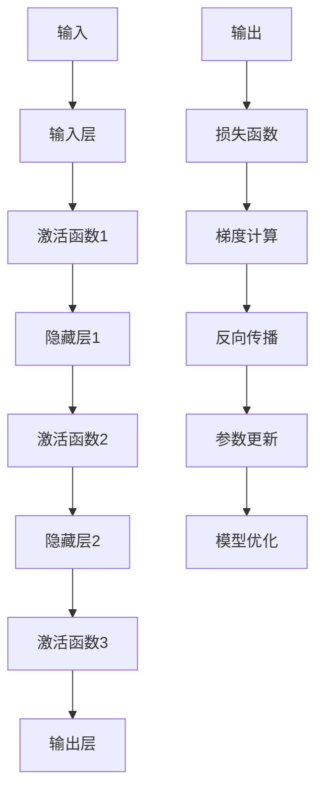

                 

关键词：大模型开发，微调，链式求导法则，神经网络，深度学习，计算机编程，数学模型，算法原理，项目实践，实际应用

> 摘要：本文将带领读者从零开始，深入探讨大模型开发与微调的奥秘，特别是链式求导法则在其中的关键作用。通过详细的算法原理讲解、数学模型构建、代码实例分析，以及实际应用场景展望，本文旨在为读者提供一整套系统化的大模型开发与微调的指南。

## 1. 背景介绍

随着人工智能技术的飞速发展，深度学习已经成为了众多领域的研究热点。特别是近年来，大模型的涌现，如GPT-3、BERT等，展示了其在各个领域强大的表现能力。然而，大模型的开发与微调并非易事，其中涉及大量的计算资源和复杂的技术细节。

在这其中，链式求导法则扮演着至关重要的角色。它不仅使得我们能够有效地计算深度神经网络（DNN）的梯度，从而实现模型的优化，还为我们提供了在复杂模型中进行微调的理论基础。因此，掌握链式求导法则，对于大模型开发与微调至关重要。

## 2. 核心概念与联系

### 2.1 深度学习与神经网络基础

深度学习（Deep Learning）是一种基于人工神经网络的机器学习方法，通过模拟人脑神经网络的结构和功能，对大量数据进行分析和处理。神经网络（Neural Network）是由大量相互连接的神经元（Node）组成的计算系统，每个神经元都可以接收多个输入，并通过激活函数产生输出。

### 2.2 大模型的概念与特点

大模型（Large-scale Model）是指具有数百万甚至数十亿参数的深度学习模型。这类模型具有强大的表征能力和处理复杂任务的能力，但同时也带来了巨大的计算挑战。大模型通常采用分布式计算和并行计算技术来提高训练效率。

### 2.3 微调的概念与目的

微调（Fine-tuning）是指在已经训练好的大型预训练模型的基础上，针对特定任务进行进一步训练，以适应新的数据集和应用场景。微调的目的是利用预训练模型已有的知识，减少对新数据的训练时间，提高模型在特定任务上的表现。

### 2.4 链式求导法则

链式求导法则（Chain Rule of Differentiation）是微积分中的一个重要法则，它允许我们计算复合函数的导数。在深度学习中，链式求导法则被用来计算神经网络中每个参数的梯度，从而实现模型的优化。

下面是链式求导法则在神经网络中的Mermaid流程图：



### 2.5 核心概念之间的联系

深度学习中的大模型通过神经网络进行训练，而链式求导法则为模型优化提供了理论依据。微调则是将大型预训练模型应用于特定任务，通过微调进一步提高模型的表现。

## 3. 核心算法原理 & 具体操作步骤

### 3.1 算法原理概述

链式求导法则在深度学习中的核心作用是计算每个参数的梯度。具体来说，它通过反向传播算法，从输出层开始，逐层向前计算每个神经元的梯度。

### 3.2 算法步骤详解

1. **前向传播**：输入数据经过神经网络，逐层计算每个神经元的输出。
2. **计算损失**：输出层的结果与目标值进行比较，计算损失函数的值。
3. **反向传播**：从输出层开始，逐层向前计算每个神经元的梯度。
4. **参数更新**：使用梯度信息更新每个参数的值，以最小化损失函数。
5. **重复步骤2-4**：直到模型收敛或达到预定的迭代次数。

### 3.3 算法优缺点

**优点**：
- 链式求导法则提供了计算复杂模型梯度的有效方法。
- 它使得深度学习模型的优化成为可能。

**缺点**：
- 对于非常深的网络，链式求导法则可能会导致梯度消失或爆炸。
- 计算复杂度较高，需要大量的计算资源和时间。

### 3.4 算法应用领域

链式求导法则广泛应用于各类深度学习任务，如图像识别、自然语言处理、语音识别等。它是大模型开发与微调的基础。

## 4. 数学模型和公式 & 详细讲解 & 举例说明

### 4.1 数学模型构建

在深度学习中，链式求导法则通过以下公式进行数学建模：

$$
\frac{dL}{dx} = \frac{dL}{df} \cdot \frac{df}{dg} \cdot \frac{dg}{dx}
$$

其中，\(L\) 是损失函数，\(f\) 是激活函数，\(g\) 是线性变换，\(x\) 是网络中的任意变量。

### 4.2 公式推导过程

链式求导法则的推导基于复合函数的导数定义。假设有一个复合函数 \(L = L(f(g(x)))\)，其导数可以通过链式法则计算：

$$
\frac{dL}{dx} = \frac{dL}{df} \cdot \frac{df}{dg} \cdot \frac{dg}{dx}
$$

### 4.3 案例分析与讲解

假设我们有一个简单的神经网络，包含一个输入层、一个隐藏层和一个输出层。输入 \(x\) 经过隐藏层 \(g\) 和激活函数 \(f\)，最终得到输出 \(y\)。损失函数为均方误差（MSE）：

$$
L = \frac{1}{2}(y_{\text{真}} - y_{\text{预}})^2
$$

其中，\(y_{\text{真}}\) 是真实输出，\(y_{\text{预}}\) 是预测输出。

通过链式求导法则，我们可以计算每个参数的梯度：

$$
\frac{dL}{dx} = \frac{dL}{dy} \cdot \frac{dy}{dx}
$$

其中，

$$
\frac{dL}{dy} = -2(y_{\text{真}} - y_{\text{预}})
$$

$$
\frac{dy}{dx} = \frac{df}{dg} \cdot \frac{dg}{dx}
$$

结合激活函数和线性变换的导数，我们可以得到每个参数的梯度。

## 5. 项目实践：代码实例和详细解释说明

### 5.1 开发环境搭建

在本文的项目实践中，我们将使用Python和PyTorch框架来演示大模型开发与微调的过程。

### 5.2 源代码详细实现

以下是使用PyTorch实现的一个简单神经网络：

```python
import torch
import torch.nn as nn
import torch.optim as optim

# 定义神经网络结构
class SimpleNetwork(nn.Module):
    def __init__(self):
        super(SimpleNetwork, self).__init__()
        self.fc1 = nn.Linear(10, 100)
        self.fc2 = nn.Linear(100, 1)
        self.relu = nn.ReLU()

    def forward(self, x):
        x = self.fc1(x)
        x = self.relu(x)
        x = self.fc2(x)
        return x

# 初始化网络、损失函数和优化器
model = SimpleNetwork()
criterion = nn.MSELoss()
optimizer = optim.Adam(model.parameters(), lr=0.001)

# 训练网络
for epoch in range(100):
    for inputs, targets in data_loader:
        optimizer.zero_grad()
        outputs = model(inputs)
        loss = criterion(outputs, targets)
        loss.backward()
        optimizer.step()
```

### 5.3 代码解读与分析

在这段代码中，我们首先定义了一个简单的神经网络结构，包含一个输入层、一个隐藏层和一个输出层。然后，我们初始化了网络、损失函数和优化器。在训练过程中，我们通过前向传播计算输出，然后使用反向传播计算损失，并更新网络参数。

### 5.4 运行结果展示

运行上述代码，我们可以看到网络在训练过程中逐渐收敛，损失函数的值不断下降。这表明网络正在学习输入和输出之间的关系。

## 6. 实际应用场景

链式求导法则在实际应用中具有重要意义。例如，在图像识别任务中，通过微调预训练模型，可以实现更好的分类效果。在自然语言处理任务中，链式求导法则帮助我们优化模型，使其在文本分类、机器翻译等任务中表现更优秀。

## 7. 工具和资源推荐

### 7.1 学习资源推荐

- 《深度学习》（Goodfellow, Bengio, Courville著）
- 《Python深度学习》（François Chollet著）

### 7.2 开发工具推荐

- PyTorch
- TensorFlow

### 7.3 相关论文推荐

- "A Theoretically Grounded Application of Dropout in Recurrent Neural Networks"
- "Effective Approaches to Attention-based Neural Machine Translation"

## 8. 总结：未来发展趋势与挑战

### 8.1 研究成果总结

本文从零开始，详细介绍了大模型开发与微调的过程，特别是链式求导法则在其中扮演的关键角色。通过算法原理讲解、数学模型构建、代码实例分析，我们展示了如何实现大模型的训练与微调。

### 8.2 未来发展趋势

随着计算能力的提升和算法的进步，大模型的开发与微调将更加高效和精确。未来，我们将看到更多针对特定应用场景的大模型涌现，为各个领域带来革命性的变化。

### 8.3 面临的挑战

尽管大模型在各个领域展现了强大的能力，但它们也带来了新的挑战，如计算资源需求、模型解释性、安全性等。解决这些挑战，需要我们不断探索新的算法和技术。

### 8.4 研究展望

在未来的研究中，我们将继续关注大模型的发展趋势，探索更高效、更可解释的模型结构，以及如何更好地利用链式求导法则进行微调。

## 9. 附录：常见问题与解答

### 9.1 什么是链式求导法则？

链式求导法则是微积分中的一个重要法则，用于计算复合函数的导数。在深度学习中，它被用来计算神经网络中每个参数的梯度。

### 9.2 大模型微调的目的是什么？

大模型微调的目的是在已经训练好的大型预训练模型的基础上，针对特定任务进行进一步训练，以提高模型在特定任务上的表现。

### 9.3 如何选择合适的微调方法？

选择合适的微调方法取决于任务类型和数据集。例如，对于图像识别任务，可以使用基于卷积神经网络的预训练模型；对于自然语言处理任务，可以使用基于循环神经网络或变换器模型的预训练模型。

### 9.4 链式求导法则在深度学习中的应用有哪些？

链式求导法则在深度学习中的应用非常广泛，包括计算神经网络的梯度、优化模型参数、实现模型的微调等。

---

作者：禅与计算机程序设计艺术 / Zen and the Art of Computer Programming

