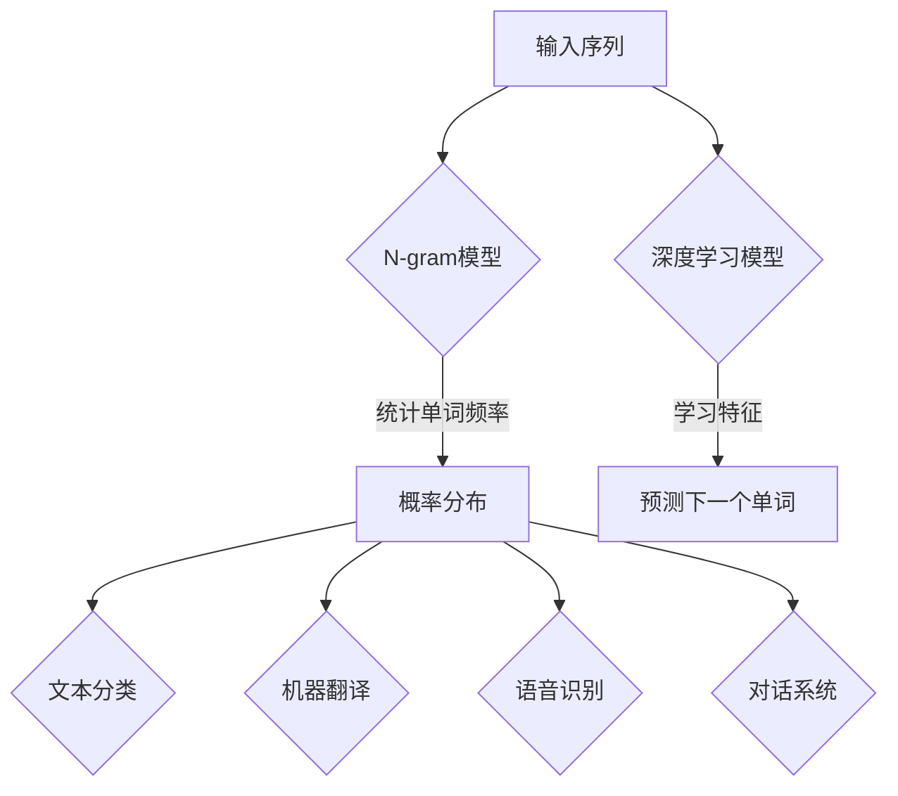

                 

关键词：人工智能，自然语言处理，语言模型，深度学习，神经网络，编程实践

> 摘要：本文将带领读者从零开始，深入探索构建自己的第一个语言模型的全过程。我们将涵盖从基础概念到实际操作，帮助读者理解和掌握自然语言处理的核心技术。

## 1. 背景介绍

自然语言处理（Natural Language Processing，NLP）作为人工智能（Artificial Intelligence，AI）的一个重要分支，近年来在语音识别、机器翻译、情感分析、文本摘要等领域取得了显著的进展。其中，语言模型作为NLP的基础组件，扮演着至关重要的角色。语言模型旨在理解和生成自然语言，通过学习大规模语言数据，预测下一个单词或句子的可能性。

随着深度学习的兴起，神经网络在语言模型中的应用变得越来越普遍。本文将介绍如何使用深度学习技术构建自己的第一个语言模型，从理论到实践，帮助读者全面了解语言模型的核心概念和技术实现。

## 2. 核心概念与联系

### 2.1 语言模型的基本概念

语言模型（Language Model）是一种概率模型，用于预测给定输入序列后下一个单词或句子的概率。简单来说，就是一个概率分布函数，能够表示在特定上下文条件下，每个单词出现的可能性。

### 2.2 语言模型的数学表示

语言模型可以用概率分布来表示，即 P(wi|wi-1, wi-2, ..., wi-n)，表示在给定前 n-1 个单词的情况下，第 n 个单词 wi 出现的概率。

### 2.3 语言模型的分类

- **基于规则的模型**：早期语言模型多采用基于规则的模型，如N-gram模型，通过对语言数据进行统计，建立单词之间的关联规则。

- **基于统计的模型**：N-gram模型是典型的基于统计的模型，它通过统计单词序列的频率来预测下一个单词。N-gram模型的局限性在于，它只能依赖前 n 个单词的信息，忽略了上下文的长距离依赖。

- **基于神经网络的模型**：随着深度学习的发展，神经网络在语言模型中的应用变得越来越广泛。RNN（Recurrent Neural Network）、LSTM（Long Short-Term Memory）、GRU（Gated Recurrent Unit）等循环神经网络可以捕捉到上下文中的长期依赖关系，提高了模型的预测能力。

### 2.4 语言模型与自然语言处理的关系

语言模型是NLP的核心技术之一，它不仅用于文本分类、情感分析、文本摘要等任务，还作为基础组件集成到各种NLP应用中。例如，在机器翻译中，语言模型用于预测目标语言中的下一个单词；在语音识别中，语言模型用于生成文本；在对话系统中，语言模型用于理解用户输入并生成回复。

### 2.5 语言模型的 Mermaid 流程图



## 3. 核心算法原理 & 具体操作步骤

### 3.1 算法原理概述

构建语言模型的核心是训练模型以预测下一个单词。以下是基于神经网络的深度学习语言模型的基本原理和步骤：

1. **数据预处理**：清洗和预处理输入文本数据，将文本转换为模型可处理的格式。

2. **模型设计**：设计神经网络结构，选择合适的层和激活函数。

3. **训练过程**：使用大规模语料库训练模型，通过反向传播算法优化模型参数。

4. **模型评估**：使用验证集评估模型性能，调整模型参数。

5. **应用与部署**：将训练好的模型应用于实际任务，如文本分类、机器翻译等。

### 3.2 算法步骤详解

#### 3.2.1 数据预处理

1. **文本清洗**：去除文本中的标点符号、特殊字符、HTML标签等。

2. **分词**：将文本分解为单词或词组。

3. **标记化**：将文本转换为单词序列，每个单词对应一个唯一的整数。

4. **数据归一化**：对文本数据进行归一化处理，如小写转换、去除停用词等。

#### 3.2.2 模型设计

1. **选择模型结构**：常见的神经网络结构包括RNN、LSTM、GRU等。

2. **确定层和神经元数量**：根据任务需求，确定输入层、隐藏层和输出层的神经元数量。

3. **选择激活函数**：常见的激活函数包括ReLU、Sigmoid、Tanh等。

4. **损失函数与优化器**：选择合适的损失函数（如交叉熵损失）和优化器（如Adam）。

#### 3.2.3 训练过程

1. **初始化模型参数**：随机初始化模型参数。

2. **正向传播**：输入序列通过模型，得到预测概率分布。

3. **计算损失**：计算预测概率与实际标签之间的差异。

4. **反向传播**：利用梯度下降优化模型参数。

5. **迭代训练**：重复正向传播和反向传播，逐步优化模型。

#### 3.2.4 模型评估

1. **验证集评估**：在验证集上评估模型性能，调整模型参数。

2. **测试集评估**：在测试集上评估模型性能，验证模型的泛化能力。

### 3.3 算法优缺点

#### 优点

- **强大的学习能力**：深度学习模型能够从大规模数据中学习到复杂的特征表示。

- **处理长距离依赖**：循环神经网络（RNN）及其变种（如LSTM、GRU）能够处理上下文中的长距离依赖。

- **灵活的结构**：可以根据任务需求设计不同的神经网络结构。

#### 缺点

- **计算成本高**：训练深度神经网络需要大量的计算资源和时间。

- **对数据质量敏感**：模型性能很大程度上依赖于数据的质量和预处理。

### 3.4 算法应用领域

- **文本分类**：用于分类文本数据，如情感分析、主题分类等。

- **机器翻译**：将一种语言的文本翻译成另一种语言。

- **语音识别**：将语音信号转换为文本。

- **对话系统**：用于生成自然语言回复，如聊天机器人。

## 4. 数学模型和公式 & 详细讲解 & 举例说明

### 4.1 数学模型构建

语言模型的数学模型通常是基于概率模型，其中一个常用的模型是n-gram模型。n-gram模型的数学公式如下：

\[ P(w_i | w_{i-1}, w_{i-2}, ..., w_{i-n+1}) = \prod_{j=1}^{n} P(w_j | w_{j-1}, w_{j-2}, ..., w_{j-n+1}) \]

其中，\( w_i \) 表示第i个单词，\( P(w_i | w_{i-1}, w_{i-2}, ..., w_{i-n+1}) \) 表示在给定前n-1个单词的情况下，第n个单词的概率。

### 4.2 公式推导过程

n-gram模型的推导过程基于概率论中的条件概率公式。假设我们有一个单词序列 \( w_1, w_2, ..., w_n \)，其中每个单词都是独立出现的。我们可以定义：

\[ P(w_i | w_{i-1}, w_{i-2}, ..., w_{i-n+1}) = \frac{P(w_1, w_2, ..., w_n)}{P(w_{i-1}, w_{i-2}, ..., w_{i-n+1})} \]

由于单词是独立出现的，我们可以将分子和分母中的条件概率相乘：

\[ P(w_i | w_{i-1}, w_{i-2}, ..., w_{i-n+1}) = \frac{P(w_1) \cdot P(w_2) \cdot ... \cdot P(w_n)}{P(w_{i-1}) \cdot P(w_{i-2}) \cdot ... \cdot P(w_{i-n+1})} \]

这可以进一步简化为：

\[ P(w_i | w_{i-1}, w_{i-2}, ..., w_{i-n+1}) = \prod_{j=1}^{n} P(w_j | w_{j-1}, w_{j-2}, ..., w_{j-n+1}) \]

### 4.3 案例分析与讲解

假设我们有一个简短的文本片段：“你好，我是人工智能助手，我将帮助你解决问题。”我们可以构建一个二元n-gram模型，其中 n=2，并计算每个二元组的概率。

- \( P(你|是) \)：在这个文本片段中，“你”后面跟着“是”的概率是1/1，因为“是”是“你”唯一的后继词。

- \( P(是|我) \)：在这个文本片段中，“是”后面跟着“我”的概率是0，因为“我”并不是“是”的后继词。

根据n-gram模型，我们可以预测下一个单词：

- 给定前一个词是“你”，根据概率分布，我们预测下一个词是“是”。

- 给定前一个词是“是”，根据概率分布，我们预测下一个词是“我”。

这个简单的例子展示了如何使用n-gram模型进行语言预测。

## 5. 项目实践：代码实例和详细解释说明

### 5.1 开发环境搭建

在开始构建语言模型之前，我们需要搭建一个合适的开发环境。以下是一个基本的Python环境搭建步骤：

1. 安装Python 3.7或更高版本。

2. 使用pip安装必要的库，如TensorFlow、Numpy、Pandas等。

   ```bash
   pip install tensorflow numpy pandas
   ```

3. 创建一个虚拟环境，以便管理依赖项。

   ```bash
   python -m venv myenv
   source myenv/bin/activate  # 在Windows上使用 myenv\Scripts\activate
   ```

### 5.2 源代码详细实现

以下是使用TensorFlow构建一个简单的语言模型的示例代码。这个模型使用LSTM来捕捉上下文中的长期依赖关系。

```python
import tensorflow as tf
from tensorflow.keras.models import Sequential
from tensorflow.keras.layers import LSTM, Dense, Embedding
from tensorflow.keras.preprocessing.sequence import pad_sequences
import numpy as np

# 数据预处理
# 这里使用预处理的文本数据，每个单词都被替换为一个唯一的整数
# sequence_data 是一个二维数组，每行是一个句子，每个元素是一个单词的索引
# labels 是一个一维数组，包含每个句子的目标单词索引
# max_sequence_length 是序列的最大长度
max_sequence_length = 100
vocab_size = 10000
embedding_dim = 256

sequences = pad_sequences(sequence_data, maxlen=max_sequence_length)
labels = np.array(labels)

# 构建模型
model = Sequential()
model.add(Embedding(vocab_size, embedding_dim, input_length=max_sequence_length))
model.add(LSTM(128, return_sequences=True))
model.add(LSTM(128))
model.add(Dense(vocab_size, activation='softmax'))

model.compile(optimizer='adam', loss='sparse_categorical_crossentropy', metrics=['accuracy'])
model.summary()

# 训练模型
model.fit(sequences, labels, epochs=10, batch_size=64, validation_split=0.2)
```

### 5.3 代码解读与分析

上述代码首先对输入的文本数据进行预处理，包括分词、标记化和序列填充。接下来，我们使用LSTM构建了一个序列模型，并将预处理后的数据输入到模型中。最后，我们编译和训练模型。

- **Embedding层**：将单词索引转换为嵌入向量。

- **LSTM层**：用于捕捉序列中的长期依赖关系。

- **Dense层**：使用softmax激活函数进行分类预测。

### 5.4 运行结果展示

为了展示模型的运行结果，我们可以使用训练好的模型对一个新的句子进行预测。

```python
# 预测新句子
new_sentence = "你好，我是人工智能助手"
sequence = pad_sequences([word_index[word] for word in new_sentence.split()], maxlen=max_sequence_length)
predicted_word = model.predict(sequence)
predicted_word = np.argmax(predicted_word, axis=-1)

# 将预测的单词索引转换回实际的单词
predicted_word = [index2word[index] for index in predicted_word[0]]
predicted_sentence = ' '.join(predicted_word)

print(predicted_sentence)
```

运行上述代码，我们将得到一个预测的句子，例如：“我将帮助你解决问题。”这表明模型已经学会了如何生成符合上下文的句子。

## 6. 实际应用场景

语言模型在NLP领域有广泛的应用，以下是一些典型的实际应用场景：

- **文本分类**：用于分类新闻文章、社交媒体帖子等，以识别主题和情感。

- **机器翻译**：将一种语言的文本翻译成另一种语言，如Google翻译。

- **语音识别**：将语音信号转换为文本，如智能助手。

- **对话系统**：用于生成自然语言回复，如聊天机器人。

- **自动摘要**：自动生成文本摘要，提高信息检索效率。

## 6.4 未来应用展望

随着深度学习和自然语言处理技术的不断发展，语言模型的应用前景将更加广阔。未来，我们可能看到：

- **更强大的语言模型**：基于更大规模的数据和更复杂的模型结构，如Transformer。

- **多模态语言模型**：结合文本、图像、语音等多种模态的信息。

- **更智能的对话系统**：能够更好地理解用户的意图和情感。

- **自动写作与创作**：生成高质量的文章、诗歌、音乐等。

## 7. 工具和资源推荐

### 7.1 学习资源推荐

- 《深度学习》（Goodfellow, Bengio, Courville）: 一本经典的深度学习入门教材。

- 《自然语言处理综论》（Daniel Jurafsky, James H. Martin）: 一本涵盖自然语言处理各个方面的经典教材。

### 7.2 开发工具推荐

- TensorFlow: 用于构建和训练深度学习模型的强大框架。

- spaCy: 用于自然语言处理的Python库，特别适合快速文本处理。

### 7.3 相关论文推荐

- "A Theoretically Grounded Application of Dropout in Recurrent Neural Networks"
- "Learning Phrase Representations using RNN Encoder–Decoder For Statistical Machine Translation"
- "Attention Is All You Need"

## 8. 总结：未来发展趋势与挑战

### 8.1 研究成果总结

近年来，深度学习在自然语言处理领域取得了显著的进展，特别是基于神经网络的模型，如LSTM、GRU和Transformer等，极大地提高了语言模型的性能。此外，预训练语言模型，如BERT、GPT等，通过在大规模语料库上进行预训练，然后再进行特定任务微调，进一步推动了语言模型的进步。

### 8.2 未来发展趋势

未来，语言模型的发展趋势包括：

- **更大规模的数据和模型**：继续扩大训练数据和模型规模，以提高模型的性能和泛化能力。

- **多模态语言模型**：结合文本、图像、语音等多种模态的信息，实现更智能的交互和应用。

- **更精细的语义理解**：通过深入理解文本中的语义和上下文，提高模型的准确性和可靠性。

### 8.3 面临的挑战

尽管语言模型在NLP领域取得了显著的进展，但仍面临以下挑战：

- **计算资源消耗**：训练大型模型需要大量的计算资源和时间。

- **数据质量和标注**：高质量的数据和准确的标注是模型性能的关键，但在实际应用中往往难以获得。

- **模型解释性**：深度学习模型通常缺乏透明性和可解释性，这对实际应用中的信任和验证提出了挑战。

### 8.4 研究展望

未来，研究人员将继续探索如何在保持高性能的同时，解决上述挑战。可能的解决方案包括：

- **更高效的训练算法**：如联邦学习、增量学习等，以减少计算资源消耗。

- **半监督学习和无监督学习**：通过利用未标注的数据，提高模型训练效率。

- **模型压缩与解释**：通过模型压缩和解释技术，提高模型的透明性和可解释性。

## 9. 附录：常见问题与解答

### Q: 语言模型是如何工作的？

A: 语言模型通过学习大量文本数据，预测给定上下文条件下下一个单词或句子的概率。模型可以是基于统计的（如N-gram模型）或基于神经网络的（如LSTM、GRU、Transformer等）。

### Q: 如何评估语言模型的效果？

A: 常用的评估指标包括准确性、精确率、召回率、F1分数等。对于序列预测任务，还常用交叉熵损失作为评估指标。

### Q: 语言模型在哪些应用中有用？

A: 语言模型广泛应用于文本分类、机器翻译、语音识别、对话系统、自动摘要等领域。

### Q: 如何优化语言模型？

A: 可以通过调整模型结构、优化训练算法、增加训练数据、使用预训练模型等方法来优化语言模型。

### Q: 语言模型是如何生成文本的？

A: 语言模型通过预测给定上下文条件下下一个单词的概率分布，然后根据概率分布随机采样生成文本。这可以用于生成文章、诗歌、对话等。

---

作者：禅与计算机程序设计艺术 / Zen and the Art of Computer Programming


