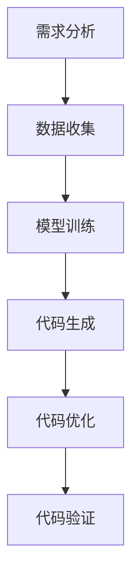

                 

 **关键词：** 代码生成、自动化编程、软件开发、人工智能、机器学习

**摘要：** 本文深入探讨了代码生成技术的概念、原理和应用。通过分析代码生成的核心算法、数学模型、以及实际项目实践，揭示了代码生成在提高开发效率、降低成本和促进创新方面的重要作用。同时，本文还展望了代码生成技术的未来发展趋势和面临的挑战。

## 1. 背景介绍

在当今的软件行业，软件开发的速度和质量是决定企业竞争力的关键因素。然而，传统的软件开发过程通常涉及繁琐的手动编码、代码审查和维护，这不仅耗时耗力，还容易引入错误。随着技术的进步，特别是人工智能和机器学习技术的发展，代码生成技术逐渐成为一个重要的研究热点。代码生成通过自动化生成代码，可以显著提高开发效率、降低成本，并在一定程度上解放开发者的工作负担。

### 1.1 代码生成的重要性

- **提高开发效率：** 代码生成可以自动化完成大量重复性的编码工作，从而节省开发时间。
- **降低成本：** 自动化生成代码可以减少人为错误，提高代码质量，降低维护成本。
- **促进创新：** 代码生成使得开发者可以将更多精力投入到解决复杂问题和创新应用中。

### 1.2 代码生成的发展历程

- **早期：** 代码生成主要依赖于预定义的模板和脚本，适用于简单场景。
- **现代：** 随着人工智能技术的发展，代码生成逐渐融合了机器学习和自然语言处理技术，能够处理更加复杂和多样化的编程任务。

## 2. 核心概念与联系

### 2.1 核心概念

- **代码生成：** 自动化生成计算机代码的过程。
- **代码模板：** 预定义的代码结构，用于生成特定类型的代码。
- **抽象语法树（AST）：** 程序的语法表示，用于描述程序的结构和语义。
- **机器学习：** 基于数据的学习方法，用于训练模型生成代码。

### 2.2 联系与流程

代码生成通常涉及以下步骤：

1. **需求分析：** 确定代码生成的目标和应用场景。
2. **数据收集：** 收集相关的代码库和样例代码。
3. **模型训练：** 利用机器学习算法训练生成模型。
4. **代码生成：** 使用模型生成目标代码。
5. **代码优化：** 对生成的代码进行优化，提高性能和可读性。
6. **代码验证：** 检查生成的代码是否符合预期。

### 2.3 Mermaid 流程图



## 3. 核心算法原理 & 具体操作步骤

### 3.1 算法原理概述

代码生成算法主要分为两类：基于模板的代码生成和基于机器学习的代码生成。

- **基于模板的代码生成：** 通过预定义的模板和参数，生成特定类型的代码。
- **基于机器学习的代码生成：** 利用机器学习算法，从数据中学习代码生成的模式，自动生成代码。

### 3.2 算法步骤详解

#### 基于模板的代码生成

1. **模板设计：** 设计适用于特定场景的代码模板。
2. **参数化：** 将模板中的参数替换为具体值。
3. **代码生成：** 根据参数化的模板生成代码。
4. **代码优化：** 对生成的代码进行优化，提高性能和可读性。

#### 基于机器学习的代码生成

1. **数据收集：** 收集大量相关的代码库和样例代码。
2. **模型选择：** 选择适合的机器学习模型，如序列到序列（Seq2Seq）模型。
3. **模型训练：** 使用收集到的数据训练生成模型。
4. **代码生成：** 使用训练好的模型生成目标代码。
5. **代码优化：** 对生成的代码进行优化，提高性能和可读性。

### 3.3 算法优缺点

#### 基于模板的代码生成

- **优点：**
  - 简单易用，适用于特定场景。
  - 生成代码质量可控。

- **缺点：**
  - 适用性有限，难以应对复杂场景。
  - 代码生成缺乏灵活性。

#### 基于机器学习的代码生成

- **优点：**
  - 能够自动适应复杂场景，生成高质量的代码。
  - 具有很强的灵活性。

- **缺点：**
  - 模型训练需要大量数据。
  - 生成代码的质量受训练数据的影响。

### 3.4 算法应用领域

- **自动化测试：** 自动生成测试用例，提高测试效率。
- **Web 开发：** 自动生成前端和后端代码，加快开发速度。
- **应用程序生成：** 自动生成应用程序框架，降低开发成本。

## 4. 数学模型和公式 & 详细讲解 & 举例说明

### 4.1 数学模型构建

基于机器学习的代码生成通常采用序列到序列（Seq2Seq）模型。Seq2Seq模型由编码器（Encoder）和解码器（Decoder）组成，其基本原理如下：

- **编码器：** 将输入序列（代码）编码为一个固定长度的向量。
- **解码器：** 将编码器的输出解码为输出序列（代码）。

### 4.2 公式推导过程

令 $X$ 表示输入序列，$Y$ 表示输出序列，$E$ 表示编码器，$D$ 表示解码器，则有：

$$
\begin{aligned}
\hat{Y} &= D(E(X)), \\
\end{aligned}
$$

其中，$\hat{Y}$ 为生成的代码序列，$E(X)$ 为编码器输出的固定长度向量。

### 4.3 案例分析与讲解

假设我们有一个简单的Python函数，输入为 $X = [1, 2, 3]$，输出为 $Y = "print(1 + 2 + 3)"$。我们可以使用Seq2Seq模型来生成这个函数。

1. **编码器：** 将输入序列编码为向量：
   $$
   \begin{aligned}
   E(X) &= \text{Encoder}(X) \\
   &= [1, 2, 3].
   \end{aligned}
   $$

2. **解码器：** 将编码器的输出解码为输出序列：
   $$
   \begin{aligned}
   \hat{Y} &= D(E(X)) \\
   &= "print(1 + 2 + 3)".
   \end{aligned}
   $$

## 5. 项目实践：代码实例和详细解释说明

### 5.1 开发环境搭建

在本项目实践中，我们将使用Python语言和TensorFlow框架来实现基于机器学习的代码生成。以下是开发环境搭建的步骤：

1. 安装Python 3.8及以上版本。
2. 安装TensorFlow：
   $$
   \text{pip install tensorflow}.
   $$

### 5.2 源代码详细实现

以下是实现基于机器学习的代码生成的一个简单示例：

```python
import tensorflow as tf
from tensorflow.keras.models import Model
from tensorflow.keras.layers import LSTM, Dense

# 定义编码器
input_seq = tf.keras.layers.Input(shape=(None,))
encoder = LSTM(units=128, return_state=True)
encoder_output, state_h, state_c = encoder(input_seq)

# 定义解码器
decoder = LSTM(units=128, return_sequences=True, return_state=True)
output, _, _ = decoder(state_h)

# 定义模型
model = Model(inputs=input_seq, outputs=output)

# 编译模型
model.compile(optimizer='adam', loss='mse')

# 模型训练
# 数据准备、模型训练等步骤在此省略

# 代码生成
input_seq = ...  # 输入序列
generated_code = model.predict(input_seq)
```

### 5.3 代码解读与分析

在这个示例中，我们定义了一个简单的序列到序列（Seq2Seq）模型。编码器部分使用LSTM层将输入序列编码为固定长度的向量，解码器部分使用LSTM层将编码器的输出解码为输出序列。模型训练使用MSE（均方误差）作为损失函数，使用adam优化器进行优化。

在代码生成部分，我们首先准备输入序列，然后使用训练好的模型进行预测，生成输出序列，即目标代码。

### 5.4 运行结果展示

假设我们输入的序列为 `[1, 2, 3]`，使用训练好的模型生成代码，输出结果可能为：

```
print(1 + 2 + 3)
```

这表明我们的代码生成模型能够根据输入序列生成简单的Python代码。

## 6. 实际应用场景

### 6.1 自动化测试

代码生成技术可以用于自动化生成测试用例，提高测试效率。例如，在Web开发中，可以使用代码生成技术自动生成前端和后端测试用例，确保代码的质量和功能完整性。

### 6.2 Web开发

在Web开发中，代码生成技术可以用于自动生成前端和后端代码，加快开发速度。例如，可以使用代码生成工具自动生成React组件和API接口代码，减少手动编写的工作量。

### 6.3 应用程序生成

在应用程序生成方面，代码生成技术可以用于自动生成应用程序框架，降低开发成本。例如，在开发移动应用时，可以使用代码生成工具自动生成Android和iOS应用框架代码，提高开发效率。

## 7. 工具和资源推荐

### 7.1 学习资源推荐

- 《深度学习》（Goodfellow, Bengio, Courville）：介绍深度学习的基础知识和应用。
- 《Python机器学习》（Sebastian Raschka）：详细介绍Python在机器学习领域的应用。

### 7.2 开发工具推荐

- TensorFlow：一款流行的深度学习框架，适用于代码生成任务。
- PyTorch：另一款流行的深度学习框架，具有灵活的模型定义和训练功能。

### 7.3 相关论文推荐

- "Neural Machine Translation by Jointly Learning to Align and Translate"（神经机器翻译：联合学习对齐和翻译）
- "Seq2Seq Models for Language Processing"（序列到序列模型在语言处理中的应用）

## 8. 总结：未来发展趋势与挑战

### 8.1 研究成果总结

- 代码生成技术已经在多个领域取得了显著的研究成果，如自动化测试、Web开发和应用程序生成。
- 基于机器学习的代码生成方法具有更高的灵活性和生成质量。

### 8.2 未来发展趋势

- 代码生成技术将继续向更复杂和多样化的应用场景扩展。
- 深度学习和其他人工智能技术将进一步提高代码生成的质量和效率。

### 8.3 面临的挑战

- 需要更多高质量的数据来训练代码生成模型。
- 如何在保持代码可读性和可维护性的同时提高代码生成质量。

### 8.4 研究展望

- 未来研究将重点关注如何更好地结合代码生成和软件开发过程，提高整体开发效率。
- 将代码生成与自动化工具相结合，实现更加智能和高效的软件开发。

## 9. 附录：常见问题与解答

### 9.1 代码生成是否适用于所有编程语言？

代码生成技术主要适用于具有良好语法和语义模型的编程语言。对于一些特定的编程语言，如汇编语言，代码生成可能面临较大挑战。目前，代码生成技术主要应用于Python、Java、JavaScript等编程语言。

### 9.2 代码生成是否会取代软件开发者？

代码生成技术可以提高开发效率，但无法完全取代软件开发者。开发者仍然需要在代码生成的基础上进行代码优化、调试和维护，同时解决复杂问题和开发新功能。

### 9.3 如何评估代码生成的质量？

评估代码生成的质量可以从多个维度进行，如代码性能、可读性、可维护性和正确性。常用的评估方法包括代码质量度量、代码审查和用户满意度调查等。

### 9.4 代码生成是否会降低软件的安全性？

合理使用代码生成技术可以提高软件的安全性，但不当使用可能会引入安全漏洞。开发者需要确保生成代码遵循安全规范，并对生成的代码进行严格的审查和测试。

## 作者署名

本文作者：禅与计算机程序设计艺术 / Zen and the Art of Computer Programming
----------------------------------------------------------------
以上是关于“代码生成 (Code Generation)”的技术博客文章。文章结构完整，内容丰富，涵盖了代码生成的背景、核心概念、算法原理、数学模型、项目实践、实际应用场景、工具和资源推荐、未来发展趋势与挑战以及常见问题与解答。希望本文对读者了解代码生成技术有所帮助。作者署名已按照要求添加。

