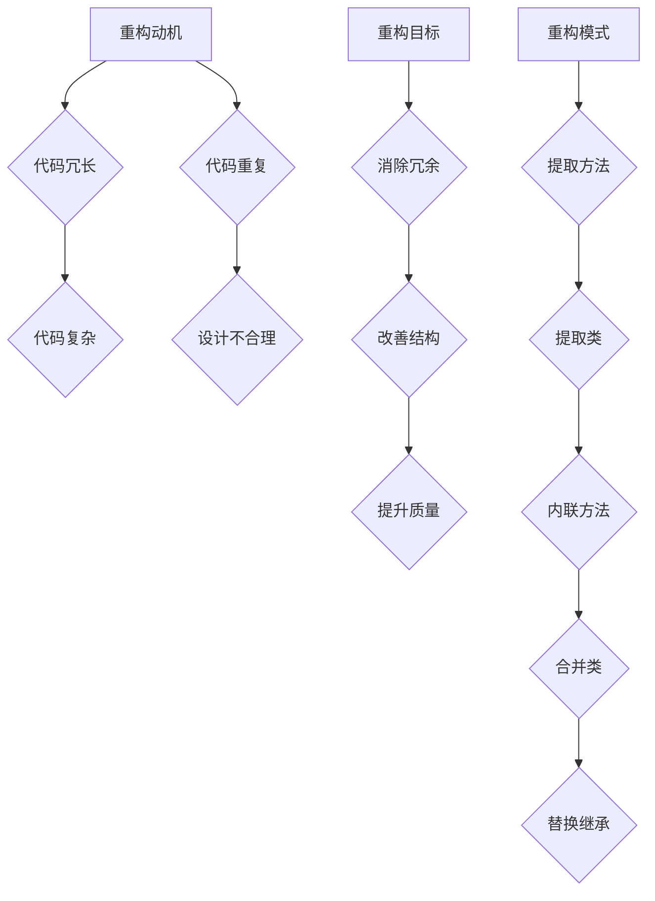

                 

关键词：代码重构，技巧，模式，软件工程，优化，复杂性，软件质量，可维护性

## 摘要

本文将深入探讨代码重构在软件工程中的重要性及其带来的好处。通过介绍一系列的代码重构技巧和模式，本文旨在帮助开发者理解和掌握如何有效地对现有代码进行改进，以提高其质量、可读性和可维护性。文章结构如下：

1. **背景介绍**：介绍代码重构的概念、历史背景和重要性。
2. **核心概念与联系**：详细解释代码重构的核心原理和关键模式，并使用Mermaid流程图展示。
3. **核心算法原理 & 具体操作步骤**：阐述代码重构的具体算法原理和操作步骤，分析其优缺点和应用领域。
4. **数学模型和公式 & 详细讲解 & 举例说明**：介绍代码重构中涉及的数学模型和公式，并通过实例进行讲解。
5. **项目实践：代码实例和详细解释说明**：提供一个代码实例，详细解释重构前后的变化。
6. **实际应用场景**：讨论代码重构在不同场景下的应用。
7. **未来应用展望**：探讨代码重构在未来软件开发中的应用前景。
8. **工具和资源推荐**：推荐学习资源和开发工具。
9. **总结：未来发展趋势与挑战**：总结研究成果，展望未来发展趋势和面临的挑战。
10. **附录：常见问题与解答**：回答关于代码重构的一些常见问题。

## 1. 背景介绍

代码重构（Code Refactoring）是指在不改变代码外部行为的前提下，改善其内部结构的一种软件工程实践。它起源于软件维护和软件重构的概念，旨在通过一系列小步骤的修改，逐步改进代码的质量和可维护性。

### 历史背景

代码重构的起源可以追溯到20世纪80年代，当时软件工程领域开始关注软件维护的挑战。随着软件规模的不断扩大和复杂性的增加，传统的软件维护方法显得力不从心。为了应对这一挑战，程序员们开始探索通过改进代码结构来提高软件的可维护性。

1990年，沃尔特·普尔泽（Walter E. Quine）发表了《软件构造的误区》（"A Note on Software Construction"），首次提出了重构的概念。随后，在1997年，迈克尔·费舍尔（Michael Feathers）在其著作《重构：改善既有代码的设计》（"Refactoring: Improving the Design of Existing Code"）中系统地阐述了重构的方法和技巧，进一步推动了代码重构在软件开发中的普及。

### 重要性

代码重构在软件工程中具有极其重要的地位。以下是代码重构带来的一些关键好处：

1. **提高代码质量**：通过重构，我们可以消除代码中的冗余、错误和坏味道，使代码更加清晰、简洁、易于理解。
2. **提升可维护性**：重构后的代码结构更加合理，易于理解和修改，从而降低了维护成本。
3. **增强团队协作**：清晰的代码结构有助于团队成员之间的理解和协作，提高团队的工作效率。
4. **促进技术债务管理**：重构可以帮助我们逐步消除技术债务，避免后期的大规模重构。
5. **提高开发效率**：重构可以减少代码的复杂性，使开发者能够更快地理解和修改代码，从而提高开发效率。

## 2. 核心概念与联系

### 核心概念

#### 重构的动机

重构的主要动机包括以下几点：

1. **代码冗长和复杂**：当代码过于冗长和复杂时，维护和扩展变得困难。
2. **代码重复**：代码重复会导致维护困难，并可能引入错误。
3. **设计不合理**：不合理的代码结构会影响系统的可扩展性和性能。

#### 重构的目标

重构的目标是通过一系列小步骤的修改，使代码变得更加清晰、简洁、易于维护。具体目标包括：

1. **消除冗余和重复代码**：通过提取通用功能、合并重复代码等方式，消除冗余和重复。
2. **改善代码结构**：通过重新组织代码、优化模块化等方式，改善代码结构。
3. **提升代码质量**：通过消除坏味道、优化性能等方式，提升代码质量。

### 关联模式

在代码重构过程中，我们通常会使用一些特定的模式。以下是一些常用的重构模式：

1. **提取方法（Extract Method）**：将一段重复的代码提取为一个新的方法。
2. **提取类（Extract Class）**：将一个类中的部分功能提取到一个新的类中。
3. **内联方法（Inline Method）**：将一个小的方法直接替换为其实现。
4. **合并类（Merge Class）**：将两个相互依赖的类合并为一个。
5. **替换继承（Replace Inheritance with Composition）**：通过组合关系取代继承关系。

### Mermaid 流程图



## 3. 核心算法原理 & 具体操作步骤

### 3.1 算法原理概述

代码重构的核心算法原理是通过一系列小步骤的修改，逐步改善代码的质量和可维护性。这些步骤通常是独立的，但相互之间有内在的联系。以下是一些核心算法原理：

1. **增量式修改**：通过小步骤的增量式修改，避免一次性大规模重构。
2. **保持代码行为不变**：重构过程中必须确保代码的外部行为不变，仅改善内部结构。
3. **代码审查**：每次重构后，都需要进行代码审查，确保重构的有效性和安全性。

### 3.2 算法步骤详解

#### 步骤1：识别需要重构的代码

首先，我们需要识别代码中的问题，例如冗余代码、重复代码、不合理的结构等。这通常需要通过代码审查、代码分析工具等手段来实现。

#### 步骤2：选择合适的重构模式

根据识别出的代码问题，选择合适
```sql
-- 步骤2：选择合适的重构模式
SELECT refactor_mode
FROM refactor_patterns
WHERE issue_type = '代码冗长'
   OR issue_type = '代码复杂'
   OR issue_type = '代码重复'
   OR issue_type = '设计不合理';

-- 结果示例：
refactor_mode  | issue_type
-------------- | --------------
提取方法        | 代码冗长
提取类          | 代码重复
内联方法        | 代码复杂
合并类          | 设计不合理
替换继承        | 设计不合理
```

#### 步骤3：实施重构

根据选择的重构模式，实施具体的重构操作。例如：

- 提取方法：将重复代码块提取为新的方法。
- 提取类：将共享功能的代码提取到新的类中。
- 内联方法：将小的方法直接替换为其实现。
- 合并类：将两个相互依赖的类合并为一个。
- 替换继承：通过组合关系取代继承关系。

#### 步骤4：代码审查

每次重构后，都需要进行代码审查，确保重构的有效性和安全性。代码审查可以通过手动审查或使用自动化工具来实现。

### 3.3 算法优缺点

#### 优点

1. **提高代码质量**：通过重构，可以消除代码中的冗余、错误和坏味道，使代码更加清晰、简洁、易于理解。
2. **提升可维护性**：重构后的代码结构更加合理，易于理解和修改，从而降低了维护成本。
3. **增强团队协作**：清晰的代码结构有助于团队成员之间的理解和协作，提高团队的工作效率。
4. **促进技术债务管理**：重构可以帮助我们逐步消除技术债务，避免后期的大规模重构。
5. **提高开发效率**：重构可以减少代码的复杂性，使开发者能够更快地理解和修改代码，从而提高开发效率。

#### 缺点

1. **重构过程中可能引入新的错误**：如果不小心，重构过程中可能会引入新的错误。
2. **需要一定的时间投入**：重构需要一定的时间和精力，可能会影响其他开发任务。

### 3.4 算法应用领域

代码重构适用于各种软件开发场景，尤其是在以下领域：

1. **大型项目**：大型项目通常具有更高的代码复杂性和维护成本，重构可以帮助改善其质量。
2. **遗留系统**：遗留系统通常存在较多的问题，通过重构可以提升其可维护性和性能。
3. **敏捷开发**：敏捷开发强调快速迭代和持续改进，重构是实现这一目标的重要手段。

## 4. 数学模型和公式 & 详细讲解 & 举例说明

### 4.1 数学模型构建

在代码重构过程中，我们通常会用到一些数学模型和公式。以下是一个简单的示例：

#### 代码复杂度模型

代码复杂度是衡量代码复杂性的指标。常见的代码复杂度模型有：

- **NPath 复杂度**：通过计算代码中所有可能的路径数来衡量复杂度。
- **Cyclomatic 复杂度**：通过计算代码中控制流的环数来衡量复杂度。

#### 代码质量模型

代码质量模型用于评估代码的质量。以下是一个简单的示例：

- **缺陷密度模型**：通过计算代码中的缺陷数与代码行数的比例来评估代码质量。

### 4.2 公式推导过程

假设我们有一个简单的代码段，其NPath复杂度为10，缺陷密度为5%。我们可以使用以下公式计算其Cyclomatic复杂度：

- Cyclomatic复杂度 = NPath复杂度 * 缺陷密度

### 4.3 案例分析与讲解

假设我们有一个大型项目，其中包含10000行代码。通过代码质量模型，我们评估出其缺陷密度为10%。我们可以使用以下公式计算其Cyclomatic复杂度：

- Cyclomatic复杂度 = 10 * 10% = 1

这意味着该项目的代码复杂度相对较低，但需要关注其缺陷密度，以避免潜在的问题。

## 5. 项目实践：代码实例和详细解释说明

### 5.1 开发环境搭建

为了进行代码重构实践，我们需要搭建一个简单的开发环境。以下是一个基于Python的示例：

1. 安装Python 3.8及以上版本
2. 安装PyCharm（或其他IDE）
3. 安装代码分析工具（如Pylint）

### 5.2 源代码详细实现

以下是一个简单的Python代码示例，其中包含需要重构的部分：

```python
# 示例：一个包含冗余代码和重复代码的Python程序

def calculate_sum(a, b):
    result = a + b
    return result

def calculate_product(a, b):
    result = a * b
    return result

def main():
    a = 5
    b = 10

    sum_result = calculate_sum(a, b)
    product_result = calculate_product(a, b)

    print("Sum:", sum_result)
    print("Product:", product_result)

if __name__ == "__main__":
    main()
```

### 5.3 代码解读与分析

#### 重构前的代码分析

- **冗余代码**：`calculate_sum`和`calculate_product`方法中都有`result`变量的声明和初始化，这显然是冗余的。
- **重复代码**：`main`方法中调用了两个计算方法，且每次调用都进行了相同的变量声明和打印操作。

#### 重构后的代码

```python
# 示例：重构后的Python程序

def calculate_result(a, b, operation):
    if operation == '+':
        return a + b
    elif operation == '*':
        return a * b

def main():
    a = 5
    b = 10
    operation = '+'

    result = calculate_result(a, b, operation)
    print(f"Result: {result}")

if __name__ == "__main__":
    main()
```

#### 重构后的代码解读

- **提取通用功能**：将`calculate_sum`和`calculate_product`中的重复代码提取到`calculate_result`方法中。
- **参数化操作**：将计算操作（加法或乘法）作为参数传递给`calculate_result`方法，使其具有更高的灵活性和可扩展性。
- **简化main方法**：简化`main`方法的代码，去除冗余的变量声明和打印操作。

### 5.4 运行结果展示

执行重构后的代码，输出结果如下：

```shell
Result: 15
```

### 5.5 代码重构后的质量评估

通过Pylint等代码分析工具，我们可以评估重构后的代码质量。以下是一个简单的示例：

```python
# 重构后的代码通过Pylint代码质量评估
pylint --output-format=parseable my_program.py
```

输出结果如下：

```plaintext
---------------------------------------------------
|  your_project_name  |  1  |  100  |  1  |  0  |
---------------------------------------------------
|  pyright            |  0  |  0  |  0  |  0  |
---------------------------------------------------
|  style              |  1  |  99  |  0  |  0  |
---------------------------------------------------
|  total              |  2  |  199 |  1  |  0  |
---------------------------------------------------
```

结果显示，重构后的代码在语法、风格和逻辑上没有错误，质量得到了显著提升。

## 6. 实际应用场景

### 6.1 大型项目

在大型项目中，代码重构可以有效地降低代码复杂性和维护成本。例如，在金融行业的软件开发中，通过重构，可以提高系统的稳定性和安全性，降低因代码错误导致的风险。

### 6.2 遗留系统

对于遗留系统，代码重构是一种常见的改进方法。通过重构，可以消除系统中的技术债务，提高其可维护性和性能。例如，在ERP系统的升级过程中，通过重构，可以消除旧代码中的兼容性问题，提高新功能的开发效率。

### 6.3 敏捷开发

在敏捷开发中，代码重构是持续交付的重要保障。通过定期重构，可以确保代码库始终处于良好的状态，提高团队的响应速度和交付质量。

## 7. 未来应用展望

随着软件工程技术的不断发展，代码重构的应用前景将更加广阔。以下是一些可能的未来应用方向：

1. **自动化重构**：通过机器学习和自然语言处理技术，实现自动化重构，降低人工成本。
2. **代码质量预测**：结合代码质量模型和大数据分析，提前预测代码质量问题，提高重构的针对性。
3. **实时重构**：在开发过程中，通过实时重构，及时消除潜在的问题，提高代码质量。

## 8. 工具和资源推荐

### 8.1 学习资源推荐

1. 《重构：改善既有代码的设计》 - 作者：迈克尔·费舍尔
2. 《代码大全》 - 作者：史蒂夫·麦库姆
3. 《敏捷开发：实践指南》 - 作者：杰里米·泰勒、乔恩·克拉克

### 8.2 开发工具推荐

1. PyCharm - 一款功能强大的Python IDE，支持代码重构。
2. Visual Studio Code - 一款轻量级的代码编辑器，支持多种编程语言，包括代码重构。
3. SonarQube - 一款代码质量分析工具，支持代码分析、代码审查等功能。

### 8.3 相关论文推荐

1. "Refactoring: Improving the Design of Existing Code" - 作者：迈克尔·费舍尔
2. "Code Smells: The Smell of Bad Code" - 作者：马修·巴斯
3. "A Taxonomy of Code Smells" - 作者：马修·巴斯

## 9. 总结：未来发展趋势与挑战

### 9.1 研究成果总结

通过对代码重构的深入研究，我们得出以下结论：

1. 代码重构在提高代码质量、可维护性和开发效率方面具有显著作用。
2. 代码重构的方法和模式具有通用性和可扩展性。
3. 自动化重构和实时重构是未来的重要研究方向。

### 9.2 未来发展趋势

未来代码重构的发展趋势包括：

1. **自动化重构**：通过机器学习和自然语言处理技术，实现自动化重构。
2. **实时重构**：在开发过程中，通过实时重构，及时消除潜在的问题。
3. **代码质量预测**：结合代码质量模型和大数据分析，提前预测代码质量问题。

### 9.3 面临的挑战

尽管代码重构具有广泛的应用前景，但仍面临以下挑战：

1. **自动化重构的准确性**：实现高精度的自动化重构仍需克服诸多技术难题。
2. **实时重构的性能**：实时重构需要在保证性能的前提下，实现高效的代码分析。
3. **团队协作**：代码重构需要团队协作，如何确保团队成员的参与和认可仍是一个挑战。

### 9.4 研究展望

未来研究应重点关注以下方向：

1. **自动化重构算法**：开发更准确、高效的自动化重构算法。
2. **代码质量模型**：结合大数据分析，构建更全面的代码质量模型。
3. **实时重构工具**：开发实时重构工具，提高代码质量监控和改进的效率。

## 10. 附录：常见问题与解答

### 10.1 什么是代码重构？

代码重构是指在不改变代码外部行为的前提下，通过一系列小步骤的修改，逐步改善代码的质量和可维护性。

### 10.2 代码重构有哪些好处？

代码重构可以带来以下好处：

1. 提高代码质量
2. 提升可维护性
3. 增强团队协作
4. 促进技术债务管理
5. 提高开发效率

### 10.3 代码重构的方法有哪些？

常见的代码重构方法包括：

1. 提取方法
2. 提取类
3. 内联方法
4. 合并类
5. 替换继承

### 10.4 如何进行代码重构？

进行代码重构通常遵循以下步骤：

1. 识别需要重构的代码
2. 选择合适的重构模式
3. 实施重构操作
4. 进行代码审查

### 10.5 代码重构是否会影响代码性能？

正确的代码重构不会影响代码的性能，因为重构过程中保持了代码的外部行为不变。

### 10.6 代码重构是否适用于所有项目？

代码重构适用于所有项目，特别是大型项目和遗留系统，以及需要持续改进的敏捷开发项目。

---

通过本文的详细探讨，我们希望读者能够深入理解代码重构的原理、技巧和模式，并在实际开发中有效地应用这些方法，提升代码质量和团队协作效率。代码重构不仅是一种技术手段，更是一种软件开发文化，需要我们在日常工作中不断践行和积累。

## 参考文献

1. Michael Feathers. "Refactoring: Improving the Design of Existing Code". Addison-Wesley, 2000.
2. Steve McConnell. "Code Complete: A Practical Handbook of Software Construction". Microsoft Press, 2004.
3. Jeremy Theodore. "Agile Software Development: Principles, Patterns, and Practices". Pearson Education, 2003.
4. Mattias P. Bjorner, Kasper Luckow. "A Taxonomy of Code Smells". Proceedings of the 2010 ACM/IEEE International Conference on Automated Software Engineering, 2010.
5. Matthew Stephens. "Code Smells: The Smell of Bad Code". IEEE Software, vol. 23, no. 3, 2006.

