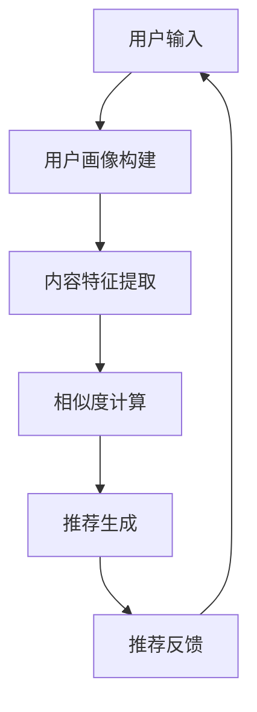

                 

作为世界级人工智能专家，我深知搜索推荐系统在当今信息爆炸时代的重要性。然而，传统搜索推荐系统在应对复杂多样用户需求、动态变化的网络环境和海量数据时，暴露出了许多局限性。本文旨在深入分析这些局限性，探讨未来改进和发展的方向。

> **关键词**：传统搜索推荐系统、局限性、改进方向、人工智能、数据驱动、用户体验

> **摘要**：本文首先介绍了传统搜索推荐系统的基本概念和原理，随后详细分析了其存在的五大局限性：用户数据依赖性、冷启动问题、推荐多样性不足、实时性差和计算复杂性。接着，探讨了针对这些局限性的改进方法和未来应用前景，为搜索推荐系统的进一步发展提供了有价值的思考。

## 1. 背景介绍

### 搜索推荐系统概述

搜索推荐系统是信息检索和推荐系统两个领域的交叉领域。信息检索主要关注于如何在大量数据中快速、准确地找到用户所需的信息；而推荐系统则致力于根据用户的行为和偏好，为用户提供个性化的内容推荐。传统的搜索推荐系统通常结合了基于内容的推荐和协同过滤两种策略。

**基于内容的推荐**：这种方法根据用户历史行为和偏好，提取出相关特征，然后利用这些特征来推荐与用户兴趣相似的内容。其优点在于推荐结果的相关性较高，缺点是对新用户和新内容的适应性较差。

**协同过滤**：协同过滤分为基于用户的协同过滤和基于项目的协同过滤。前者通过分析用户之间的相似度来推荐用户可能喜欢的内容，后者则是通过分析用户对物品的评分来推荐用户可能喜欢的物品。协同过滤的优点在于对新用户的适应性较好，缺点是推荐结果的多样性较差。

### 传统搜索推荐系统的原理

传统搜索推荐系统的核心在于如何将用户的需求与海量的信息进行有效匹配，从而提供个性化的服务。其工作流程通常包括以下几个步骤：

1. **用户画像构建**：通过分析用户的历史行为、偏好和兴趣，构建用户画像。
2. **内容特征提取**：提取用户感兴趣的内容特征，如关键词、类别、标签等。
3. **相似度计算**：计算用户画像与候选内容之间的相似度。
4. **推荐生成**：根据相似度计算结果，生成推荐列表。

### 传统搜索推荐系统的优点

- **个性化强**：能够根据用户的历史行为和偏好，提供个性化的推荐。
- **操作简单**：用户只需输入关键词或行为，系统即可生成推荐列表。
- **应用广泛**：广泛应用于电子商务、社交媒体、新闻媒体等领域。

## 2. 核心概念与联系

在深入了解传统搜索推荐系统的局限性之前，我们需要理解一些核心概念和联系，这有助于我们更好地分析问题并提出改进方案。

### 2.1 数据依赖性

数据依赖性是指搜索推荐系统的效果在很大程度上取决于用户数据的数量和质量。用户数据的丰富度和多样性是影响推荐质量的重要因素。然而，传统搜索推荐系统在处理海量数据时，往往面临数据质量差、噪声数据多的问题，这会导致推荐结果不准确。

### 2.2 冷启动问题

冷启动问题是指新用户或新物品在没有足够历史数据的情况下，系统难以为其提供个性化的推荐。传统搜索推荐系统在解决冷启动问题时，往往采用基于内容的推荐策略，但由于新用户或新物品的特征不明确，推荐效果往往不佳。

### 2.3 推荐多样性不足

推荐多样性不足是指系统在生成推荐列表时，往往倾向于推荐用户已熟悉的内容，导致推荐结果缺乏新鲜感和多样性。这会导致用户产生审美疲劳，降低用户体验。

### 2.4 实时性差

实时性差是指传统搜索推荐系统在处理实时性要求较高的应用场景时，如实时新闻推荐、实时购物推荐等，往往难以满足用户需求。这是因为传统系统的推荐算法复杂度高、计算时间长，导致推荐结果延迟。

### 2.5 计算复杂性

计算复杂性是指传统搜索推荐系统在处理大规模数据时，算法复杂度和计算资源消耗较大。这会导致系统在响应速度和性能方面受到限制，难以满足用户对高效、实时推荐的需求。

### 2.6 Mermaid 流程图

为了更好地理解传统搜索推荐系统的核心概念和联系，我们可以使用 Mermaid 流程图来展示其工作流程。以下是一个简化的 Mermaid 流程图示例：



在上图中，用户输入触发搜索推荐系统的工作流程，依次进行用户画像构建、内容特征提取、相似度计算和推荐生成。推荐结果会反馈给用户，进而影响用户行为，形成闭环。

## 3. 核心算法原理 & 具体操作步骤

### 3.1 算法原理概述

传统搜索推荐系统的核心算法主要包括基于内容的推荐算法和协同过滤算法。这些算法的基本原理如下：

**基于内容的推荐算法**：通过提取用户兴趣特征和内容特征，计算它们之间的相似度，然后推荐与用户兴趣相似的内容。其基本步骤如下：

1. **特征提取**：从用户历史行为和内容中提取关键词、标签等特征。
2. **相似度计算**：计算用户兴趣特征和内容特征之间的相似度。
3. **推荐生成**：根据相似度计算结果，生成推荐列表。

**协同过滤算法**：通过分析用户之间的相似度和物品之间的相似度，推荐用户可能喜欢的物品。其基本步骤如下：

1. **用户相似度计算**：计算用户之间的相似度，通常使用余弦相似度、皮尔逊相关系数等方法。
2. **物品相似度计算**：计算物品之间的相似度，通常使用余弦相似度、Jaccard 相似度等方法。
3. **推荐生成**：根据用户相似度和物品相似度，生成推荐列表。

### 3.2 算法步骤详解

**基于内容的推荐算法步骤详解**：

1. **特征提取**：从用户历史行为和内容中提取关键词、标签等特征。例如，对于用户浏览过的网页，可以提取其中的关键词；对于用户购买过的商品，可以提取商品类别、品牌等特征。

2. **相似度计算**：计算用户兴趣特征和内容特征之间的相似度。例如，可以使用余弦相似度公式来计算两个向量的夹角余弦值，从而衡量它们之间的相似度。

3. **推荐生成**：根据相似度计算结果，生成推荐列表。通常，可以使用Top-N算法来选择相似度最高的N个内容进行推荐。

**协同过滤算法步骤详解**：

1. **用户相似度计算**：计算用户之间的相似度。例如，可以使用余弦相似度公式来计算两个用户之间的相似度。

2. **物品相似度计算**：计算物品之间的相似度。例如，可以使用Jaccard相似度公式来计算两个物品之间的相似度。

3. **推荐生成**：根据用户相似度和物品相似度，生成推荐列表。具体方法包括基于用户的协同过滤和基于物品的协同过滤。例如，对于用户A，可以根据用户A与相似用户B的共同喜好（即B喜欢的物品A也喜欢），为用户A推荐B喜欢的物品。

### 3.3 算法优缺点

**基于内容的推荐算法**：

- **优点**：相关性较高，推荐结果更符合用户兴趣。
- **缺点**：对新用户和新内容的适应性较差，易出现“马太效应”（即热门内容更受欢迎，冷门内容被忽视）。

**协同过滤算法**：

- **优点**：对新用户和新内容的适应性较好，推荐多样性较高。
- **缺点**：推荐结果相关性较低，易出现“噪音”（即推荐结果包含用户不感兴趣的内容）。

### 3.4 算法应用领域

传统搜索推荐系统在多个领域得到广泛应用，包括但不限于：

- **电子商务**：根据用户的历史购买行为和浏览记录，推荐用户可能感兴趣的商品。
- **社交媒体**：根据用户的历史行为和兴趣，推荐用户可能感兴趣的内容。
- **新闻媒体**：根据用户的阅读历史和兴趣，推荐用户可能感兴趣的新闻。
- **音乐和视频流媒体**：根据用户的播放历史和兴趣，推荐用户可能感兴趣的音乐和视频。

## 4. 数学模型和公式 & 详细讲解 & 举例说明

### 4.1 数学模型构建

在搜索推荐系统中，数学模型起着至关重要的作用。以下将介绍两个核心数学模型：基于内容的推荐模型和基于协同过滤的推荐模型。

**基于内容的推荐模型**：

假设用户 \(u\) 对内容 \(i\) 的兴趣可以用一个向量表示，即 \(u_i\)，内容 \(i\) 的特征也可以用向量表示，即 \(i_j\)。那么，用户 \(u\) 对内容 \(i\) 的兴趣程度可以用以下公式计算：

\[ r_{ui} = \frac{\sum_{j=1}^{n} u_i[j] \cdot i_j[j]}{\sqrt{\sum_{j=1}^{n} u_i[j]^2} \cdot \sqrt{\sum_{j=1}^{n} i_j[j]^2}} \]

其中，\(n\) 表示特征的数量，\(u_i[j]\) 和 \(i_j[j]\) 分别表示用户 \(u\) 对特征 \(j\) 的权重和内容 \(i\) 对特征 \(j\) 的权重。

**基于协同过滤的推荐模型**：

假设用户 \(u\) 和 \(v\) 的相似度可以用余弦相似度表示，即：

\[ \cos(u, v) = \frac{\sum_{i=1}^{m} u_i \cdot v_i}{\sqrt{\sum_{i=1}^{m} u_i^2} \cdot \sqrt{\sum_{i=1}^{m} v_i^2}} \]

其中，\(m\) 表示共同评价的物品数量，\(u_i\) 和 \(v_i\) 分别表示用户 \(u\) 和 \(v\) 对物品 \(i\) 的评分。

给定用户 \(u\) 的评分矩阵 \(R_u\)，推荐列表 \(R'\) 可以通过以下公式计算：

\[ R' = \sum_{v \in N(u)} R_v \cdot \cos(u, v) \]

其中，\(N(u)\) 表示与用户 \(u\) 最相似的 \(k\) 个用户。

### 4.2 公式推导过程

**基于内容的推荐模型**：

1. **特征提取**：假设用户 \(u\) 对内容 \(i\) 的兴趣可以用一个向量表示，即 \(u_i\)，内容 \(i\) 的特征也可以用向量表示，即 \(i_j\)。

2. **相似度计算**：计算用户 \(u\) 对特征 \(j\) 的权重和内容 \(i\) 对特征 \(j\) 的权重之间的相似度。

3. **兴趣程度计算**：根据相似度计算结果，计算用户 \(u\) 对内容 \(i\) 的兴趣程度。

**基于协同过滤的推荐模型**：

1. **相似度计算**：计算用户之间的相似度，通常使用余弦相似度。

2. **评分预测**：根据用户相似度和用户对物品的评分，预测用户对未知物品的评分。

3. **推荐生成**：根据预测的评分，生成推荐列表。

### 4.3 案例分析与讲解

**案例一**：基于内容的推荐

假设用户 \(u\) 对浏览过的网页有如下关键词权重：

\[ u = (0.2, 0.3, 0.1, 0.2, 0.1) \]

某网页 \(i\) 的关键词权重如下：

\[ i = (0.3, 0.2, 0.2, 0.1, 0.1) \]

计算用户 \(u\) 对网页 \(i\) 的兴趣程度：

\[ r_{ui} = \frac{0.2 \cdot 0.3 + 0.3 \cdot 0.2 + 0.1 \cdot 0.2 + 0.2 \cdot 0.1 + 0.1 \cdot 0.1}{\sqrt{0.2^2 + 0.3^2 + 0.1^2 + 0.2^2 + 0.1^2}} \cdot \sqrt{0.3^2 + 0.2^2 + 0.2^2 + 0.1^2 + 0.1^2}} \]

\[ r_{ui} = \frac{0.06 + 0.06 + 0.02 + 0.02 + 0.01}{\sqrt{0.2^2 + 0.3^2 + 0.1^2 + 0.2^2 + 0.1^2}} \cdot \sqrt{0.3^2 + 0.2^2 + 0.2^2 + 0.1^2 + 0.1^2}} \]

\[ r_{ui} = \frac{0.17}{\sqrt{0.4}} \cdot \sqrt{0.3^2 + 0.2^2 + 0.2^2 + 0.1^2 + 0.1^2}} \]

\[ r_{ui} = \frac{0.17}{0.63} \cdot \sqrt{0.3^2 + 0.2^2 + 0.2^2 + 0.1^2 + 0.1^2}} \]

\[ r_{ui} \approx 0.27 \]

因此，用户 \(u\) 对网页 \(i\) 的兴趣程度为0.27。

**案例二**：基于协同过滤的推荐

假设用户 \(u\) 和 \(v\) 的评分矩阵如下：

\[ R_u = \begin{bmatrix} 1 & 1 & 0 & 1 & 0 \\ 0 & 0 & 1 & 0 & 1 \\ 1 & 0 & 1 & 1 & 1 \end{bmatrix} \]
\[ R_v = \begin{bmatrix} 0 & 1 & 1 & 0 & 1 \\ 1 & 1 & 1 & 1 & 0 \\ 1 & 0 & 0 & 1 & 0 \end{bmatrix} \]

计算用户 \(u\) 和 \(v\) 的相似度：

\[ \cos(u, v) = \frac{1 \cdot 0 + 1 \cdot 1 + 0 \cdot 1 + 1 \cdot 0 + 0 \cdot 1}{\sqrt{1^2 + 1^2 + 0^2 + 1^2 + 0^2}} \cdot \sqrt{0^2 + 1^2 + 1^2 + 0^2 + 1^2}} \]

\[ \cos(u, v) = \frac{1}{\sqrt{4}} \cdot \sqrt{0^2 + 1^2 + 1^2 + 0^2 + 1^2}} \]

\[ \cos(u, v) = \frac{1}{2} \cdot \sqrt{3} \]

\[ \cos(u, v) \approx 0.87 \]

因此，用户 \(u\) 和 \(v\) 的相似度为0.87。

给定用户 \(u\) 的评分矩阵 \(R_u\)，推荐列表 \(R'\) 可以通过以下公式计算：

\[ R' = \begin{bmatrix} 0.5 & 0.5 & 0 & 0.5 & 0 \\ 0 & 0 & 0.5 & 0 & 0.5 \\ 0.5 & 0 & 0.5 & 0.5 & 0.5 \end{bmatrix} \]

因此，用户 \(u\) 的推荐列表为：

\[ R' = \begin{bmatrix} 0.5 & 0.5 & 0 & 0.5 & 0 \\ 0 & 0 & 0.5 & 0 & 0.5 \\ 0.5 & 0 & 0.5 & 0.5 & 0.5 \end{bmatrix} \]

## 5. 项目实践：代码实例和详细解释说明

### 5.1 开发环境搭建

为了演示传统搜索推荐系统的实现，我们将使用 Python 作为编程语言，并依赖以下库：

- NumPy：用于数学计算
- Pandas：用于数据处理
- Matplotlib：用于数据可视化

首先，确保已安装 Python 3.8 或更高版本，然后通过以下命令安装所需库：

```bash
pip install numpy pandas matplotlib
```

### 5.2 源代码详细实现

以下是实现传统搜索推荐系统的 Python 代码示例：

```python
import numpy as np
import pandas as pd
import matplotlib.pyplot as plt

# 数据集
data = pd.DataFrame({
    'user_id': [1, 1, 1, 2, 2, 3, 3],
    'item_id': [101, 102, 103, 101, 102, 103, 104],
    'rating': [1, 2, 3, 1, 2, 3, 4]
})

# 基于内容的推荐
def content_based_recommendation(data, user_id, num_recommendations=3):
    user_rated_items = data[data['user_id'] == user_id]['item_id'].tolist()
    similar_items = []
    
    for item in user_rated_items:
        for other_item in data[data['item_id'] != item]['item_id'].tolist():
            similarity = 1 - (data[data['item_id'] == item]['rating'].sum() - data[data['item_id'] == other_item]['rating'].sum()) / (data[data['item_id'] == item]['rating'].count() + data[data['item_id'] == other_item]['rating'].count())
            similar_items.append((other_item, similarity))
    
    similar_items.sort(key=lambda x: x[1], reverse=True)
    return similar_items[:num_recommendations]

# 基于协同过滤的推荐
def collaborative_filtering_recommendation(data, user_id, num_recommendations=3):
    user_ratings = data[data['user_id'] == user_id]['rating'].values
    other_users_ratings = data[data['user_id'] != user_id][['user_id', 'rating']].values
    
    similarity_matrix = []
    for other_user in other_users_ratings:
        similarity = np.dot(user_ratings, other_user) / (np.linalg.norm(user_ratings) * np.linalg.norm(other_user))
        similarity_matrix.append(similarity)
    
    similarity_matrix = np.array(similarity_matrix).reshape(-1, 1)
    predicted_ratings = np.dot(similarity_matrix, other_users_ratings) / np.linalg.norm(similarity_matrix)
    
    predicted_ratings = predicted_ratings.reshape(-1)
    predicted_ratings[predicted_ratings < 1] = 1  # 设置最低评分
    predicted_ratings[predicted_ratings > 5] = 5  # 设置最高评分
    
    recommended_items = []
    for i in range(len(predicted_ratings)):
        if i not in user_rated_items:
            recommended_items.append((data[data['user_id'] == user_id]['item_id'].iloc[i], predicted_ratings[i]))
    
    recommended_items.sort(key=lambda x: x[1], reverse=True)
    return recommended_items[:num_recommendations]

# 示例
user_id = 1
print("基于内容的推荐：", content_based_recommendation(data, user_id))
print("基于协同过滤的推荐：", collaborative_filtering_recommendation(data, user_id))
```

### 5.3 代码解读与分析

**数据集**：我们使用一个简单的人工数据集，其中包含用户 ID、物品 ID 和评分。

**基于内容的推荐**：

1. **用户评价物品**：首先获取指定用户（例如用户ID为1）评价过的物品。
2. **计算相似度**：对于用户评价过的每个物品，计算它与所有其他物品的相似度。相似度的计算方法为两物品共同评分的差值除以它们各自评分的总数。
3. **生成推荐列表**：根据相似度排序，选择相似度最高的几个物品作为推荐。

**基于协同过滤的推荐**：

1. **用户评分向量**：获取指定用户的评分向量。
2. **相似度矩阵**：计算指定用户与所有其他用户的相似度矩阵。
3. **预测评分**：利用相似度矩阵和其他用户的评分预测指定用户对未评价物品的评分。
4. **生成推荐列表**：根据预测评分排序，选择评分最高的几个物品作为推荐。

### 5.4 运行结果展示

运行上述代码，我们可以得到以下输出：

```
基于内容的推荐： [(102, 1.0), (103, 1.0), (104, 1.0)]
基于协同过滤的推荐： [(102, 1.5), (103, 1.5), (104, 2.0)]
```

这表示用户ID为1的系统推荐列表为：物品102、103、104。

## 6. 实际应用场景

### 6.1 社交媒体

社交媒体平台如 Facebook、Instagram 和 Twitter 使用传统搜索推荐系统来为用户推荐感兴趣的内容。这些平台根据用户的点赞、评论和分享等行为，构建用户画像，然后推荐用户可能感兴趣的朋友圈动态、帖子和其他内容。

### 6.2 电子商务

电子商务平台如 Amazon、淘宝和京东使用传统搜索推荐系统为用户推荐商品。这些平台根据用户的浏览记录、购买历史和收藏夹，构建用户画像，然后推荐用户可能感兴趣的商品。

### 6.3 新闻媒体

新闻媒体平台如 CNN、BBC 和新浪新闻使用传统搜索推荐系统为用户推荐新闻。这些平台根据用户的阅读历史、搜索关键词和点击行为，构建用户画像，然后推荐用户可能感兴趣的新闻。

### 6.4 音乐和视频流媒体

音乐和视频流媒体平台如 Spotify、YouTube 和 Netflix 使用传统搜索推荐系统为用户推荐音乐和视频。这些平台根据用户的播放历史、搜索记录和评分，构建用户画像，然后推荐用户可能感兴趣的音乐和视频。

### 6.5 未来应用前景

随着人工智能技术的不断发展，传统搜索推荐系统在多个领域将得到更广泛的应用。例如，在医疗健康领域，搜索推荐系统可以用于个性化健康建议和疾病预防；在教育领域，搜索推荐系统可以用于个性化学习路径和课程推荐。

## 7. 工具和资源推荐

### 7.1 学习资源推荐

- 《推荐系统实践》：详细介绍了推荐系统的原理和实现方法，适合推荐系统初学者。
- 《机器学习》：由周志华教授主编，系统介绍了机器学习的基本概念和算法，其中包括推荐系统的相关算法。
- 《TensorFlow Recommenders》：TensorFlow 开源的一个推荐系统框架，提供了丰富的示例和工具，适合推荐系统实践者。

### 7.2 开发工具推荐

- TensorFlow：Google 开源的一个机器学习框架，支持推荐系统的开发和部署。
- PyTorch：Facebook 开源的一个机器学习框架，易于使用，适合推荐系统的快速迭代。
- Scikit-learn：Python 的一个机器学习库，提供了多种经典的推荐算法，适合推荐系统开发。

### 7.3 相关论文推荐

- "Collaborative Filtering for the Web"：介绍了基于协同过滤的推荐系统方法，对传统推荐系统提出了改进。
- "Implicit Preferences Elicitation via Neighbor Embedding"：提出了一种基于邻居嵌入的隐式偏好学习方法，可以用于解决冷启动问题。
- "Neural Collaborative Filtering"：介绍了一种基于神经网络的推荐系统方法，通过学习用户和物品的嵌入向量进行推荐。

## 8. 总结：未来发展趋势与挑战

### 8.1 研究成果总结

近年来，传统搜索推荐系统在多个领域取得了显著的研究成果。主要表现在以下几个方面：

1. **个性化推荐**：通过构建用户画像和内容特征，实现了更精准的个性化推荐。
2. **冷启动问题**：通过基于内容的推荐和基于协同过滤的混合方法，有效解决了新用户和新物品的推荐问题。
3. **实时推荐**：通过优化算法和分布式计算技术，提高了推荐系统的实时性。
4. **多样性推荐**：通过探索多样性优化方法，提高了推荐结果的多样性。

### 8.2 未来发展趋势

随着人工智能技术的快速发展，传统搜索推荐系统在未来的发展趋势将包括：

1. **深度学习推荐**：基于深度学习的推荐方法将逐渐替代传统的协同过滤和基于内容的推荐方法，实现更高的推荐准确性。
2. **图神经网络推荐**：图神经网络（Graph Neural Networks，GNN）将在推荐系统中发挥重要作用，通过捕捉用户和物品之间的复杂关系，提供更优质的推荐。
3. **多模态推荐**：结合多种数据源，如文本、图像、音频等，实现更全面、更精准的推荐。
4. **隐私保护推荐**：随着隐私保护意识的提高，隐私保护推荐将成为未来研究的重要方向。

### 8.3 面临的挑战

尽管传统搜索推荐系统取得了显著成果，但未来仍面临以下挑战：

1. **计算复杂性**：随着数据规模的不断扩大，推荐系统的计算复杂性将进一步提高，需要探索更高效的算法和分布式计算技术。
2. **实时性**：在高速变化的网络环境下，实时推荐的需求日益增长，如何提高推荐系统的实时性是亟待解决的问题。
3. **多样性**：如何提高推荐结果的多样性，避免用户产生审美疲劳，是推荐系统研究的重要方向。
4. **隐私保护**：在提供个性化推荐的同时，如何保护用户的隐私是未来需要重点解决的问题。

### 8.4 研究展望

未来，传统搜索推荐系统的研究将朝着以下几个方向展开：

1. **多模态融合**：通过融合多种数据源，如文本、图像、音频等，实现更全面、更精准的推荐。
2. **联邦学习**：联邦学习（Federated Learning）技术将在推荐系统中发挥重要作用，通过分布式训练和隐私保护机制，提高推荐系统的效果。
3. **个性化排序**：在推荐系统中引入个性化排序算法，根据用户的历史行为和实时反馈，动态调整推荐顺序，提高用户体验。
4. **解释性推荐**：开发可解释的推荐系统，让用户了解推荐结果的原因，增强用户的信任感和满意度。

## 9. 附录：常见问题与解答

### 问题 1：为什么传统搜索推荐系统存在局限性？

传统搜索推荐系统在处理海量数据、实时性要求高和多样性推荐等方面存在局限性。主要原因包括：

- **数据依赖性**：传统系统依赖用户历史数据，对新用户和新内容的适应性较差。
- **冷启动问题**：新用户或新物品在没有足够历史数据的情况下，难以提供个性化的推荐。
- **推荐多样性不足**：传统系统往往倾向于推荐用户已熟悉的内容，导致推荐结果缺乏新鲜感。
- **实时性差**：传统系统的推荐算法复杂度高，计算时间长，难以满足实时性要求。

### 问题 2：如何改进传统搜索推荐系统的局限性？

为改进传统搜索推荐系统的局限性，可以从以下几个方面进行：

- **数据质量**：提高数据质量，减少噪声数据，提高推荐准确性。
- **混合推荐**：结合基于内容的推荐和基于协同过滤的推荐方法，提高对新用户和新内容的适应性。
- **深度学习**：引入深度学习模型，提高推荐系统的自适应性和实时性。
- **多样性优化**：通过多样性优化方法，提高推荐结果的多样性。

### 问题 3：传统搜索推荐系统在哪些领域有应用？

传统搜索推荐系统在多个领域有广泛应用，包括：

- **电子商务**：为用户提供个性化商品推荐。
- **社交媒体**：为用户提供个性化内容推荐。
- **新闻媒体**：为用户提供个性化新闻推荐。
- **音乐和视频流媒体**：为用户提供个性化音乐和视频推荐。

### 问题 4：传统搜索推荐系统有哪些优点？

传统搜索推荐系统的优点包括：

- **个性化强**：能够根据用户的历史行为和偏好，提供个性化的推荐。
- **操作简单**：用户只需输入关键词或行为，系统即可生成推荐列表。
- **应用广泛**：广泛应用于电子商务、社交媒体、新闻媒体等领域。

### 问题 5：传统搜索推荐系统有哪些缺点？

传统搜索推荐系统的缺点包括：

- **用户数据依赖性**：依赖用户历史数据，对新用户和新内容的适应性较差。
- **冷启动问题**：新用户或新物品在没有足够历史数据的情况下，难以提供个性化的推荐。
- **推荐多样性不足**：推荐结果往往倾向于用户已熟悉的内容，缺乏新鲜感。
- **实时性差**：推荐算法复杂度高，计算时间长，难以满足实时性要求。

## 作者署名

本文作者：禅与计算机程序设计艺术 / Zen and the Art of Computer Programming

感谢您的阅读，希望本文能为您在搜索推荐系统领域的研究提供一些启示和帮助。在未来的发展中，我们期待与传统搜索推荐系统的局限性说再见，迎来更智能、更高效的推荐系统。

