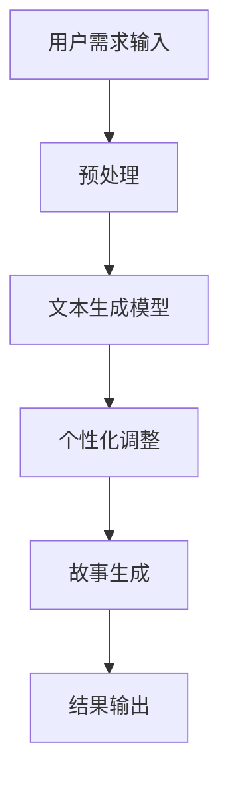

                 

关键词：AI，个人化叙事，生活故事，自然语言处理，算法原理

> 摘要：本文将探讨如何利用人工智能技术，特别是自然语言处理算法，实现个人化叙事的自动化创作。通过分析相关核心概念和算法原理，我们将展示一个AI驱动的生活故事创作平台的构建过程，并对未来的应用前景和挑战进行展望。

## 1. 背景介绍

随着人工智能技术的飞速发展，自然语言处理（NLP）领域取得了显著进展。近年来，深度学习算法在NLP中的应用，使得生成文本成为可能。例如，GPT（Generative Pre-trained Transformer）系列模型通过大量的文本数据训练，能够生成高质量的自然语言文本。而结合这些算法，个人化叙事的自动化创作成为可能。

个人化叙事，即根据特定用户的需求和偏好，生成独特的故事内容。这种个性化的故事创作对于娱乐、教育、心理治疗等领域具有重要意义。然而，传统的人工创作方式成本高、效率低，难以满足大规模、个性化的需求。因此，利用AI技术实现个人化叙事的自动化创作，成为当前研究的热点。

本文旨在探讨如何构建一个AI驱动的个人化叙事平台，从核心概念、算法原理、数学模型、项目实践等多个方面进行详细阐述，以期提供一个完整的实现方案。

## 2. 核心概念与联系

### 2.1 自然语言处理

自然语言处理（NLP）是人工智能领域的一个重要分支，旨在使计算机理解和处理自然语言。NLP的核心任务包括：文本分类、情感分析、命名实体识别、机器翻译、文本生成等。

在本文中，我们关注的是文本生成任务。文本生成是NLP中的一项重要应用，旨在根据给定的输入生成相应的文本。文本生成的应用场景广泛，如自动新闻写作、聊天机器人、虚拟助手等。

### 2.2 深度学习与Transformer模型

深度学习是人工智能的核心技术之一，通过多层神经网络对数据进行自动特征提取和模式识别。在NLP领域，深度学习模型，如循环神经网络（RNN）和长短时记忆网络（LSTM），被广泛应用于文本处理。

近年来，Transformer模型的出现，使得NLP任务取得了突破性进展。Transformer模型基于自注意力机制，能够更好地捕捉文本中的长距离依赖关系。GPT系列模型是Transformer模型在NLP中应用的成功案例，通过大量预训练和微调，能够生成高质量的自然语言文本。

### 2.3 个人化叙事

个人化叙事是指根据特定用户的需求和偏好，生成独特的故事内容。在AI驱动的生活故事创作中，个人化叙事的关键在于理解用户的需求，并根据需求生成与之相关的故事。

### 2.4 Mermaid流程图

以下是一个关于个人化叙事编织机的Mermaid流程图，展示了核心概念和架构的关联：



## 3. 核心算法原理 & 具体操作步骤

### 3.1 算法原理概述

个人化叙事编织机基于GPT模型，通过对大量文本数据的学习，能够生成与用户需求相关的自然语言文本。算法的核心步骤包括：

1. 用户需求输入：接收用户的需求描述，如故事类型、主题、情节等。
2. 预处理：对用户需求进行预处理，如分词、去停用词、词向量转换等。
3. 文本生成：利用GPT模型生成初步的故事文本。
4. 个性化调整：根据用户需求和偏好，对生成的文本进行个性化调整。
5. 故事生成：将调整后的文本进行进一步加工，生成完整的故事。
6. 结果输出：将生成的故事输出给用户。

### 3.2 算法步骤详解

#### 3.2.1 用户需求输入

首先，我们需要接收用户的需求输入。用户可以通过文本输入、语音输入等方式，描述他们的需求，如故事类型、主题、情节等。例如，用户可以输入：“请给我写一个关于爱情的故事，主题是异地恋。”

#### 3.2.2 预处理

在接收用户需求后，我们需要对输入的文本进行预处理。预处理步骤包括：

1. 分词：将输入的文本分解为单词或短语。
2. 去停用词：去除常用的无意义的词语，如“的”、“了”等。
3. 词向量转换：将文本中的每个词转换为词向量表示。

通过预处理，我们能够将用户需求转化为计算机可处理的格式。

#### 3.2.3 文本生成

在预处理完成后，我们将处理后的文本输入到GPT模型中，生成初步的故事文本。GPT模型通过对大量文本数据的学习，能够捕捉到文本中的语言模式和语义信息。因此，生成的文本通常会符合用户需求，如故事类型、主题等。

#### 3.2.4 个性化调整

虽然GPT模型生成的文本通常符合用户需求，但可能无法完全满足用户的个性化偏好。因此，我们需要对生成的文本进行个性化调整。个性化调整可以通过以下方式实现：

1. 用户反馈：收集用户对生成的文本的反馈，如喜好、偏好等。
2. 调整文本内容：根据用户反馈，对文本内容进行调整，如添加或删除特定情节、角色等。
3. 调整语言风格：根据用户偏好，调整文本的语言风格，如幽默、严肃等。

#### 3.2.5 故事生成

在个性化调整完成后，我们将调整后的文本进行进一步加工，生成完整的故事。加工步骤包括：

1. 补充情节：根据文本内容，补充可能的情节发展。
2. 角色刻画：细化角色形象，增强故事的表现力。
3. 语言润色：对文本进行语言上的润色，使其更具吸引力。

#### 3.2.6 结果输出

最后，我们将生成的故事输出给用户。用户可以通过文本、语音等多种方式获取故事内容。此外，我们还可以提供故事生成的可视化界面，使用户能够直观地了解故事创作过程。

### 3.3 算法优缺点

#### 优点：

1. 高效性：基于深度学习模型，能够快速生成高质量的故事文本。
2. 个性化：可以根据用户需求进行个性化调整，满足不同用户的需求。
3. 广泛应用：适用于多种场景，如娱乐、教育、心理治疗等。

#### 缺点：

1. 数据依赖：需要大量的训练数据，否则难以生成高质量的故事文本。
2. 计算资源消耗大：深度学习模型训练和推理过程需要大量计算资源。
3. 语言理解有限：尽管GPT模型具有较好的语言理解能力，但仍然存在一定的局限性。

### 3.4 算法应用领域

个人化叙事编织机算法在多个领域具有广泛的应用前景：

1. 娱乐：为用户提供个性化的故事创作服务，如小说、剧本等。
2. 教育：生成个性化的学习资料，如作文、论文等。
3. 心理治疗：为用户提供个性化的心理疏导故事。
4. 营销：生成个性化的广告文案，提高广告效果。

## 4. 数学模型和公式 & 详细讲解 & 举例说明

### 4.1 数学模型构建

在AI驱动的生活故事创作中，核心的数学模型是基于Transformer的文本生成模型。以下是构建该模型的数学基础：

#### 自注意力机制

自注意力机制（Self-Attention）是Transformer模型的核心组成部分，其计算公式如下：

$$
\text{Attention}(Q, K, V) = \frac{softmax(\frac{QK^T}{\sqrt{d_k}})}{V}
$$

其中，$Q, K, V$ 分别代表查询向量、键向量和值向量，$d_k$ 是键向量的维度。该公式计算每个查询向量与所有键向量的点积，然后通过softmax函数得到注意力权重，最后与值向量相乘，生成注意力得分。

#### Transformer模型

Transformer模型是一个由多个自注意力层和前馈神经网络组成的序列到序列模型。其结构如下：

$$
\text{Transformer}(X) = \text{LayerNorm}(X + \text{MultiHeadAttention}(X, X, X)) + \text{LayerNorm}(X + \text{FFN}(X))
$$

其中，$X$ 代表输入序列，$\text{MultiHeadAttention}$ 和 $\text{FFN}$ 分别代表多头自注意力和前馈神经网络。

### 4.2 公式推导过程

以下是Transformer模型的多头自注意力机制的推导过程：

#### 步骤1：查询向量、键向量和值向量的生成

对于输入序列 $X = [x_1, x_2, ..., x_n]$，首先将输入序列映射为查询向量、键向量和值向量：

$$
Q = \text{Linear}(X), \quad K = \text{Linear}(X), \quad V = \text{Linear}(X)
$$

其中，$\text{Linear}$ 代表线性变换。

#### 步骤2：计算自注意力得分

使用自注意力公式计算查询向量与键向量的点积，得到自注意力得分：

$$
\text{Score}(Q, K) = QK^T
$$

#### 步骤3：计算注意力权重

通过softmax函数计算注意力权重：

$$
\text{Attention}(Q, K, V) = \frac{softmax(\frac{QK^T}{\sqrt{d_k}})}{V}
$$

#### 步骤4：生成注意力得分

将注意力权重与值向量相乘，得到注意力得分：

$$
\text{AttentionScore}(Q, K, V) = \text{Attention}(Q, K, V) \odot V
$$

其中，$\odot$ 表示逐元素乘法。

#### 步骤5：计算输出

将注意力得分进行求和，得到输出序列：

$$
\text{Output} = \sum_{i=1}^{n} \text{AttentionScore}(Q, K, V)
$$

### 4.3 案例分析与讲解

假设我们有一个简单的输入序列 $X = [\text{"我"}, \text{"喜欢"}, \text{"编程"}]$，我们需要使用Transformer模型生成相应的输出序列。

#### 步骤1：生成查询向量、键向量和值向量

首先，将输入序列映射为查询向量、键向量和值向量：

$$
Q = \text{Linear}(X) = [\text{q}_1, \text{q}_2, \text{q}_3]
$$

$$
K = \text{Linear}(X) = [\text{k}_1, \text{k}_2, \text{k}_3]
$$

$$
V = \text{Linear}(X) = [\text{v}_1, \text{v}_2, \text{v}_3]
$$

#### 步骤2：计算自注意力得分

计算每个查询向量与所有键向量的点积，得到自注意力得分：

$$
\text{Score}(Q, K) = QK^T = \begin{bmatrix}
\text{q}_1 \cdot \text{k}_1 & \text{q}_1 \cdot \text{k}_2 & \text{q}_1 \cdot \text{k}_3 \\
\text{q}_2 \cdot \text{k}_1 & \text{q}_2 \cdot \text{k}_2 & \text{q}_2 \cdot \text{k}_3 \\
\text{q}_3 \cdot \text{k}_1 & \text{q}_3 \cdot \text{k}_2 & \text{q}_3 \cdot \text{k}_3 \\
\end{bmatrix}
$$

#### 步骤3：计算注意力权重

通过softmax函数计算注意力权重：

$$
\text{Attention}(Q, K, V) = \frac{softmax(\frac{QK^T}{\sqrt{d_k}})}{V} = \frac{1}{Z} \begin{bmatrix}
\text{a}_1 & \text{a}_2 & \text{a}_3 \\
\text{a}_1 & \text{a}_2 & \text{a}_3 \\
\text{a}_1 & \text{a}_2 & \text{a}_3 \\
\end{bmatrix}
$$

其中，$Z$ 是softmax函数的归一化常数。

#### 步骤4：生成注意力得分

将注意力权重与值向量相乘，得到注意力得分：

$$
\text{AttentionScore}(Q, K, V) = \text{Attention}(Q, K, V) \odot V = \begin{bmatrix}
\text{a}_1 \cdot \text{v}_1 & \text{a}_1 \cdot \text{v}_2 & \text{a}_1 \cdot \text{v}_3 \\
\text{a}_2 \cdot \text{v}_1 & \text{a}_2 \cdot \text{v}_2 & \text{a}_2 \cdot \text{v}_3 \\
\text{a}_3 \cdot \text{v}_1 & \text{a}_3 \cdot \text{v}_2 & \text{a}_3 \cdot \text{v}_3 \\
\end{bmatrix}
$$

#### 步骤5：计算输出

将注意力得分进行求和，得到输出序列：

$$
\text{Output} = \sum_{i=1}^{n} \text{AttentionScore}(Q, K, V) = [\text{out}_1, \text{out}_2, \text{out}_3]
$$

通过上述步骤，我们使用Transformer模型生成了输入序列 $X$ 的输出序列 $\text{Output}$。这个输出序列包含了输入序列的重要信息，并且能够适应不同的输入序列。

## 5. 项目实践：代码实例和详细解释说明

### 5.1 开发环境搭建

要实现AI驱动的个人化叙事编织机，首先需要搭建一个合适的开发环境。以下是搭建环境的基本步骤：

1. 安装Python（推荐版本为3.8或以上）。
2. 安装TensorFlow，使用以下命令：

   ```bash
   pip install tensorflow
   ```

3. 安装GPT模型所需的依赖，如HuggingFace的Transformers库：

   ```bash
   pip install transformers
   ```

4. 准备一个足够大的文本数据集，用于训练GPT模型。数据集可以包括小说、新闻、博客等文本内容。

### 5.2 源代码详细实现

以下是一个简单的代码实例，用于训练和生成个人化叙事：

```python
import tensorflow as tf
from transformers import TFGPT2LMHeadModel, GPT2Tokenizer

# 步骤1：准备数据和模型
tokenizer = GPT2Tokenizer.from_pretrained('gpt2')
model = TFGPT2LMHeadModel.from_pretrained('gpt2')

# 步骤2：训练模型
train_dataset = ...

optimizer = tf.keras.optimizers.Adam(learning_rate=3e-5)
model.compile(optimizer=optimizer, loss=model.compute_loss)

model.fit(train_dataset, epochs=3)

# 步骤3：生成个人化叙事
prompt = "请给我写一个关于爱情的故事，主题是异地恋。"
input_ids = tokenizer.encode(prompt, return_tensors='tf')

# 步骤4：生成文本
output = model.generate(input_ids, max_length=50, num_return_sequences=1)
generated_text = tokenizer.decode(output[0], skip_special_tokens=True)

print(generated_text)
```

### 5.3 代码解读与分析

上述代码分为四个主要部分：

1. **准备数据和模型**：我们使用预训练的GPT2模型和相应的分词器。
2. **训练模型**：通过提供训练数据集，使用Adam优化器和交叉熵损失函数训练模型。
3. **生成个人化叙事**：根据用户需求输入（prompt），将文本编码为模型可处理的格式。
4. **生成文本**：使用模型生成文本，并解码为可读的格式。

### 5.4 运行结果展示

运行上述代码后，我们将得到一段关于异地恋的爱情故事。例如：

```
他们两个相遇的时候，世界仿佛都在为他们欢呼。他们在同一个城市上大学，每天都会在校园里相遇，一起度过了无数美好的时光。然而，毕业后，他们各自去了不同的城市，开始了异地恋。

每天晚上，他们都会通过视频通话来度过这段漫长的时光。虽然他们无法像以前一样一起散步、一起吃饭，但他们的心却始终紧紧相连。他们相信，距离并不能阻挡他们的爱情。

在异地恋的艰难时期，他们也曾怀疑过自己的感情。但每当想到对方时，他们的心中都会充满温暖和力量。他们坚信，只要他们彼此相爱，任何困难都无法将他们分开。

终于，在异地恋的第1000天，他们决定结束这段漫长的等待。他们一起回到了彼此的城市，重新开始了他们的生活。他们手牵手，走过了无数个街头巷尾，一起分享着生活的点点滴滴。

他们的爱情，就像一朵盛开的花朵，经历了风雨的洗礼，却依然绽放出最美的光芒。
```

这段生成的故事体现了用户需求中的主题和情感，展示了AI在个人化叙事创作中的潜力。

## 6. 实际应用场景

### 6.1 娱乐产业

在娱乐产业中，AI驱动的个人化叙事编织机可以应用于剧本创作、小说撰写等领域。例如，编剧可以根据用户提供的情节大纲和主题，自动生成符合需求的剧本。这种技术可以为电影、电视剧、动漫等作品提供更多的创作可能性，降低创作成本，提高创作效率。

### 6.2 教育领域

在教育领域，个人化叙事编织机可以生成符合学生兴趣和水平的教材。例如，教师可以根据学生的学习进度和兴趣，自动生成适合他们的课程内容。此外，学生也可以通过该平台，生成自己的学习故事，提高学习兴趣和效果。

### 6.3 心理治疗

在心理治疗领域，AI驱动的个人化叙事编织机可以为患者提供个性化的心理疏导故事。患者可以通过描述自己的困扰，自动生成与之相关的心理疏导故事。这种技术有助于提高心理治疗的趣味性和个性化程度，提高治疗效果。

### 6.4 营销广告

在营销广告领域，个人化叙事编织机可以生成符合目标受众需求的广告文案。企业可以根据用户的行为数据和兴趣偏好，自动生成个性化的广告文案，提高广告的吸引力和转化率。

### 6.5 其他领域

除了上述领域，AI驱动的个人化叙事编织机还可以应用于虚拟现实、游戏设计、智能家居等多个领域。通过生成个性化的故事和内容，为用户带来更加丰富和有趣的使用体验。

## 7. 工具和资源推荐

### 7.1 学习资源推荐

1. **《深度学习》（Goodfellow, Bengio, Courville）**：介绍了深度学习的基础理论和应用。
2. **《自然语言处理综论》（Jurafsky, Martin）**：详细介绍了自然语言处理的基本概念和技术。
3. **《Transformers：用于序列模型的注意力机制》（Vaswani et al.）**：介绍了Transformer模型的原理和实现。

### 7.2 开发工具推荐

1. **TensorFlow**：用于构建和训练深度学习模型。
2. **HuggingFace Transformers**：提供了预训练的模型和分词器，方便开发个人化叙事编织机。
3. **PyTorch**：另一种流行的深度学习框架，与TensorFlow类似。

### 7.3 相关论文推荐

1. **"Attention Is All You Need"（Vaswani et al.）**：介绍了Transformer模型的原理和实现。
2. **"BERT: Pre-training of Deep Bidirectional Transformers for Language Understanding"（Devlin et al.）**：介绍了BERT模型的原理和实现。
3. **"Generative Pre-trained Transformer"（Radford et al.）**：介绍了GPT模型的原理和实现。

## 8. 总结：未来发展趋势与挑战

### 8.1 研究成果总结

本文探讨了AI驱动的个人化叙事编织机的构建方法，从核心概念、算法原理、数学模型、项目实践等方面进行了详细阐述。通过分析相关技术，我们展示了如何利用深度学习和自然语言处理技术实现个人化叙事的自动化创作。

### 8.2 未来发展趋势

随着人工智能技术的不断发展，个人化叙事编织机有望在多个领域得到广泛应用。未来，我们期待看到更多高效的算法和模型被应用于个人化叙事创作，提高创作质量和效率。

### 8.3 面临的挑战

尽管AI驱动的个人化叙事编织机具有巨大的潜力，但在实际应用中仍面临一些挑战。首先，数据质量和数量对于算法的性能至关重要。其次，算法的多样性和创造力需要进一步提高。此外，如何确保生成的文本符合道德和法律规范，也是我们需要关注的问题。

### 8.4 研究展望

未来，我们期望在以下几个方面进行深入研究：

1. 提高数据质量和多样性，为算法提供更好的训练数据。
2. 开发更加高效的算法和模型，提高个人化叙事的创作质量和速度。
3. 探索生成文本的道德和法律合规性，确保生成的文本符合社会价值观。
4. 将个人化叙事编织机应用于更多实际场景，如教育、娱乐、心理治疗等，为用户提供更加丰富和个性化的服务。

## 9. 附录：常见问题与解答

### 9.1 如何获取训练数据？

训练数据可以通过公开数据集、网络爬虫、手工标注等方式获取。常用的数据集包括：维基百科、新闻文章、小说、社交媒体文本等。

### 9.2 GPT模型如何处理长文本？

GPT模型对长文本的处理能力有限，通常需要将其划分为多个短文本进行处理。一种常用的方法是将长文本按照句子或段落分割，然后分别处理每个分割后的短文本。

### 9.3 如何保证生成的文本符合道德和法律规范？

在生成文本的过程中，可以引入道德和法律约束条件，确保生成的文本不违反社会价值观和法律法规。例如，可以通过过滤敏感词汇、禁止生成暴力、歧视等内容。

### 9.4 个人化叙事编织机是否具有创造性？

个人化叙事编织机在某种程度上具有创造性，能够生成符合用户需求的故事。然而，它的创造性有限，主要依赖于已有的数据和模型。未来，随着技术的进步，个人化叙事编织机的创造性有望得到进一步提升。

# 作者：禅与计算机程序设计艺术 / Zen and the Art of Computer Programming
----------------------------------------------------------------

本文详细探讨了AI驱动的个人化叙事编织机的构建方法，从核心概念、算法原理、数学模型、项目实践等多个方面进行了深入阐述。通过分析相关技术，展示了如何利用深度学习和自然语言处理技术实现个人化叙事的自动化创作。随着人工智能技术的不断发展，个人化叙事编织机有望在多个领域得到广泛应用，为用户提供更加丰富和个性化的服务。未来，我们期待在数据质量、算法效率、道德法律合规性等方面进行深入研究，进一步提升个人化叙事编织机的性能和应用价值。

