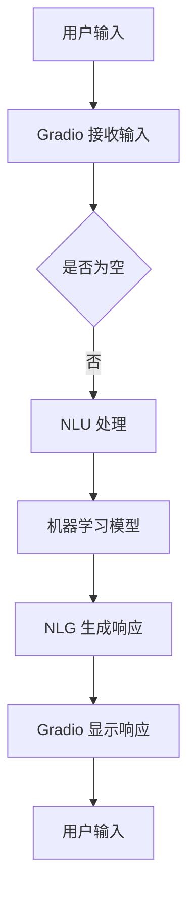

                 

在当今数字化转型的浪潮中，人工智能（AI）技术的应用越来越广泛，其中聊天机器人已经成为企业与用户互动的重要工具。随着技术的进步，开发者们不仅需要关注聊天机器人的核心功能，还需要关注其用户体验。Gradio，作为一种新兴的图形界面库，为开发者提供了构建交互式机器学习应用的新途径。本文将详细介绍如何使用 Gradio 实现聊天机器人的图形化界面。

## 1. 背景介绍

随着互联网的普及和移动设备的广泛使用，用户对交互体验的要求越来越高。传统的命令行界面已经无法满足用户的需求，而图形界面（GUI）则提供了更加直观和易用的交互方式。Gradio 正是这样一种专为机器学习应用设计的图形界面库，它可以让开发者轻松地将机器学习模型转化为在线应用，而无需编写复杂的后端代码。

聊天机器人作为一种特殊的机器学习应用，其核心是自然语言处理（NLP）技术。通过 Gradio，开发者可以快速地为聊天机器人创建一个友好的图形界面，从而提升用户的使用体验。此外，Gradio 还支持自定义组件和布局，使得开发者可以根据具体需求设计个性化的界面。

## 2. 核心概念与联系

### 2.1 Gradio 概述

Gradio 是一个基于 Python 的图形界面库，它提供了一种简单的方法来创建交互式的机器学习应用。Gradio 的主要特点包括：

- **易用性**：Gradio 提供了简单而强大的 API，使得开发者可以快速地将机器学习模型转化为交互式应用。
- **灵活性**：Gradio 允许开发者自定义组件和布局，以适应不同的应用场景。
- **响应式**：Gradio 支持响应式设计，使得应用可以在不同设备上保持良好的用户体验。

### 2.2 聊天机器人生成原理

聊天机器人的生成主要依赖于 NLP 技术，包括自然语言理解（NLU）和自然语言生成（NLG）。NLU 技术负责理解用户的输入，将其转换为机器可以处理的格式；NLG 技术则负责将机器学习模型的输出转化为自然语言响应。

### 2.3 Gradio 与聊天机器人

Gradio 可以与聊天机器人紧密结合，通过以下方式实现图形化界面：

- **前端界面**：Gradio 提供了一个直观的前端界面，用户可以通过输入框与聊天机器人进行交互。
- **后端处理**：Gradio 会将用户的输入传递给聊天机器人，并返回机器学习模型的响应。

### 2.4 Mermaid 流程图

以下是一个简化的 Mermaid 流程图，展示了 Gradio 与聊天机器人的结合方式：



## 3. 核心算法原理 & 具体操作步骤

### 3.1 算法原理概述

聊天机器人的核心算法主要包括 NLU 和 NLG 两部分：

- **NLU**：自然语言理解，负责将用户的自然语言输入转换为机器可以理解的语义。
- **NLG**：自然语言生成，负责将机器学习模型的输出转换为自然语言响应。

### 3.2 算法步骤详解

1. **用户输入**：用户通过输入框输入自然语言文本。
2. **NLU 处理**：Gradio 接收到用户输入后，将其传递给 NLU 模型进行处理。
3. **机器学习模型**：NLU 处理后的语义信息被传递给训练好的机器学习模型，模型根据输入生成相应的输出。
4. **NLG 生成响应**：机器学习模型的输出通过 NLG 技术转换为自然语言响应。
5. **Gradio 显示响应**：Gradio 将生成的响应显示在界面上，用户可以看到机器学习模型的回答。

### 3.3 算法优缺点

**优点**：

- **易用性**：Gradio 提供了简单而强大的 API，使得开发者可以快速搭建图形界面。
- **灵活性**：开发者可以根据需求自定义组件和布局，实现个性化的界面设计。

**缺点**：

- **性能限制**：由于 Gradio 是基于 Python 的，因此在大规模数据集上可能存在性能瓶颈。
- **学习曲线**：对于初学者来说，Gradio 的学习曲线可能相对较陡峭。

### 3.4 算法应用领域

Gradio 在聊天机器人的图形化界面中具有广泛的应用领域，包括但不限于：

- **客户服务**：企业可以通过聊天机器人提供24/7的客户服务。
- **在线教育**：教师可以使用聊天机器人为学生提供个性化的学习建议。
- **智能助手**：用户可以通过聊天机器人获取实时信息和智能建议。

## 4. 数学模型和公式 & 详细讲解 & 举例说明

### 4.1 数学模型构建

聊天机器人的数学模型主要基于深度学习和自然语言处理技术。以下是一个简化的数学模型构建过程：

1. **词向量表示**：将自然语言文本转换为词向量。
2. **序列建模**：使用循环神经网络（RNN）或变换器（Transformer）建模输入和输出序列。
3. **损失函数**：使用交叉熵损失函数优化模型参数。

### 4.2 公式推导过程

假设输入序列为 \(x = [x_1, x_2, ..., x_T]\)，输出序列为 \(y = [y_1, y_2, ..., y_T]\)，则模型的目标是最小化损失函数 \(L\)：

$$
L = -\sum_{t=1}^{T} \sum_{i=1}^{V} y_t[i] \log(p(y_t=i|x_t))
$$

其中，\(V\) 是词汇表的大小，\(p(y_t=i|x_t)\) 是模型对输出词为 \(i\) 的概率估计。

### 4.3 案例分析与讲解

假设我们有一个简单的聊天机器人，用户输入“你好”，模型需要输出“你好，有什么可以帮助你的吗？”。以下是一个简化的模型训练过程：

1. **词向量表示**：将输入和输出词转换为词向量。
2. **序列建模**：使用循环神经网络（RNN）建模输入和输出序列。
3. **损失函数**：使用交叉熵损失函数优化模型参数。
4. **训练模型**：通过训练数据集训练模型，直到损失函数收敛。

训练完成后，当用户输入“你好”时，模型会输出“你好，有什么可以帮助你的吗？”。这个过程反映了自然语言处理和生成的基本原理。

## 5. 项目实践：代码实例和详细解释说明

### 5.1 开发环境搭建

要使用 Gradio 构建聊天机器人，您需要安装以下依赖项：

- Python 3.7 或更高版本
- Gradio 库
- Transformers 库

您可以使用以下命令进行安装：

```shell
pip install gradio transformers
```

### 5.2 源代码详细实现

以下是一个简单的聊天机器人示例，展示了如何使用 Gradio 构建图形化界面：

```python
import gradio as gr
from transformers import pipeline

# 加载预训练的聊天机器人模型
chatbot = pipeline("conversational", model="microsoft/DialoGPT-medium")

# 定义输入和输出组件
iface = gr.Interface(
    fn=chatbot,
    inputs=gr.inputs.Textbox(label="输入"),
    outputs=gr.outputs.Text(label="回复"),
    title="聊天机器人",
    description="与我聊天吧！",
)

# 启动界面
iface.launch()
```

### 5.3 代码解读与分析

上述代码首先导入了 Gradio 和 Transformers 库，然后加载了一个预训练的聊天机器人模型。接下来，定义了输入和输出组件，并设置了界面标题和描述。最后，使用 `launch()` 方法启动了 Gradio 界面。

### 5.4 运行结果展示

当用户在输入框中输入文本并点击提交按钮后，聊天机器人会生成一个响应并显示在界面上。例如，当用户输入“你好”时，聊天机器人可能会输出“你好，有什么可以帮助你的吗？”。

## 6. 实际应用场景

### 6.1 企业客户服务

企业可以利用 Gradio 构建的聊天机器人来提供24/7的客户服务。用户可以通过图形界面与聊天机器人进行交互，获取常见问题的答案。

### 6.2 在线教育

教师可以使用聊天机器人为学生提供个性化的学习建议和辅导。学生可以通过图形界面与聊天机器人进行互动，获取学习资源和指导。

### 6.3 智能助手

用户可以通过聊天机器人获取实时信息和智能建议。例如，用户可以与聊天机器人讨论天气、新闻、股市等信息。

## 7. 工具和资源推荐

### 7.1 学习资源推荐

- [Gradio 文档](https://gradio.io/)
- [Transformers 库文档](https://huggingface.co/transformers/)
- [自然语言处理教程](https://www.tensorflow.org/tutorials/text/nlp_walkthrough)

### 7.2 开发工具推荐

- [Jupyter Notebook](https://jupyter.org/)：用于编写和运行 Python 代码。
- [Google Colab](https://colab.research.google.com/)：免费的在线 Jupyter Notebook 环境。

### 7.3 相关论文推荐

- [DialoGPT: Large-scale Discourse-Driven Dialogue Models with Human-like Responses](https://arxiv.org/abs/2005.04696)

## 8. 总结：未来发展趋势与挑战

### 8.1 研究成果总结

本文介绍了如何使用 Gradio 实现聊天机器人的图形化界面，从背景介绍到具体实现，再到实际应用场景，全面阐述了 Gradio 在聊天机器人开发中的应用价值。

### 8.2 未来发展趋势

随着人工智能技术的不断发展，聊天机器人的图形化界面将会变得更加智能和人性化。未来，我们可以期待更多创新的应用场景和更高效的交互体验。

### 8.3 面临的挑战

尽管 Gradio 提供了便捷的图形界面开发工具，但在实际应用中仍面临一些挑战，如性能优化、模型精调等。

### 8.4 研究展望

未来，我们可以进一步探索如何将 Gradio 与其他先进的人工智能技术相结合，如生成对抗网络（GAN）和强化学习，以提升聊天机器人的交互质量和用户体验。

## 9. 附录：常见问题与解答

### 9.1 如何自定义 Gradio 界面样式？

您可以使用 CSS 样式表来自定义 Gradio 界面的样式。在 Gradio 界面代码中引入 CSS 文件或使用内联样式即可实现样式自定义。

### 9.2 如何将 Gradio 界面部署到生产环境？

您可以将 Gradio 界面部署到服务器或云平台，如 AWS、Google Cloud 等。具体部署方法请参考 Gradio 官方文档和相应平台的文档。

### 9.3 如何集成自定义模型？

您需要将自定义模型代码封装为函数，并确保函数接受适当的输入参数和返回适当的输出。然后，在 Gradio 界面中调用该函数即可实现自定义模型集成。

----------------------------------------------------------------

本文由禅与计算机程序设计艺术 / Zen and the Art of Computer Programming 撰写，旨在为开发者提供关于使用 Gradio 实现聊天机器人图形化界面的全面指南。希望本文能对您在人工智能领域的探索和实践有所帮助。

