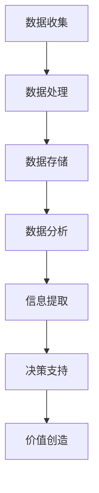

                 

在当今的数字化时代，信息差作为一种关键的竞争要素，正逐渐成为企业创造价值的源泉。本文将探讨大数据如何通过信息差的价值创造，为企业在激烈的市场竞争中提供强有力的支持。

## 关键词

- 信息差
- 大数据
- 企业价值
- 竞争优势
- 数据分析
- 商业智慧

## 摘要

本文首先介绍了信息差的定义及其对企业的重要性。接着，深入探讨了大数据技术在信息差价值创造中的作用，包括数据收集、处理、分析和应用。最后，本文提出了大数据在企业应用中的实际案例，并展望了未来大数据发展的趋势与挑战。

## 1. 背景介绍

在信息化高速发展的今天，数据已经成为新的生产要素。大数据的涌现为企业带来了前所未有的机会，同时也提出了新的挑战。如何从海量数据中提取有价值的信息，并利用这些信息为企业创造价值，成为企业需要迫切解决的问题。

信息差，即信息不对称，是指不同个体或组织对同一信息的掌握程度存在差异。在商业环境中，信息差往往意味着竞争优势。企业通过收集和分析市场数据，可以更好地了解客户需求、市场趋势和竞争对手动态，从而做出更明智的商业决策。

### 1.1 信息差的重要性

信息差在商业决策中起着至关重要的作用。拥有更多或更准确的信息，企业可以更快地识别市场机会，更有效地应对市场变化，从而在竞争中占据有利地位。

1. **市场定位**：通过分析市场需求和竞争状况，企业可以准确把握市场定位，提供更符合消费者需求的产品或服务。
2. **产品创新**：信息差使得企业能够更好地了解消费者的痛点，从而进行产品创新，提升产品竞争力。
3. **风险管理**：了解竞争对手的策略和市场动态，企业可以更好地进行风险管理，降低决策风险。

### 1.2 大数据与信息差

大数据技术的快速发展，使得企业能够更加高效地收集、处理和分析海量数据。这使得信息差的价值创造成为可能。

1. **数据收集**：大数据技术能够实时、全面地收集各类数据，包括市场数据、消费者行为数据等。
2. **数据处理**：通过数据清洗、归一化等处理技术，大数据能够确保数据的准确性和一致性。
3. **数据分析**：大数据分析技术可以帮助企业从海量数据中提取有价值的信息，为企业决策提供支持。

## 2. 核心概念与联系

为了更好地理解大数据如何通过信息差的价值创造，我们需要先了解几个核心概念及其相互关系。

### 2.1 大数据的核心概念

1. **数据来源**：数据可以来源于企业内部，如交易数据、用户行为数据等，也可以来源于外部，如社交媒体、公共数据库等。
2. **数据类型**：大数据包括结构化数据、半结构化数据和非结构化数据。不同类型的数据需要不同的处理和分析方法。
3. **数据规模**：大数据通常指的是数据量巨大，无法用传统的数据处理工具进行分析。

### 2.2 信息差的定义与分类

1. **信息差的定义**：信息差是指不同个体或组织对同一信息的掌握程度存在差异。
2. **信息差的分类**：信息差可以分为显性信息和隐性信息。显性信息是公开可获取的信息，如市场报告、竞争对手公开的信息等；隐性信息则是只有少数人能够获取的，如内部数据、商业机密等。

### 2.3 大数据与信息差的联系

1. **数据收集**：大数据技术可以帮助企业收集更多的显性信息，如市场数据、消费者行为数据等。
2. **数据处理**：通过对收集到的数据进行处理和分析，企业可以提取出隐性信息，如消费者需求、市场趋势等。
3. **信息差价值创造**：通过大数据技术，企业可以更好地掌握信息差，从而在市场中获得竞争优势。

## 2.1 大数据架构的Mermaid流程图



### 3. 核心算法原理 & 具体操作步骤

### 3.1 算法原理概述

大数据在信息差价值创造中的核心算法主要包括数据收集、数据处理、数据分析和决策支持。这些算法共同作用，帮助企业从海量数据中提取有价值的信息，并转化为商业价值。

1. **数据收集**：通过数据采集工具，实时收集各类数据，包括市场数据、用户行为数据等。
2. **数据处理**：对收集到的数据清洗、归一化等处理，确保数据的准确性和一致性。
3. **数据分析**：使用数据分析算法，从处理后的数据中提取有价值的信息，如消费者需求、市场趋势等。
4. **决策支持**：将提取的信息转化为具体的商业决策，如产品创新、市场定位等。

### 3.2 算法步骤详解

1. **数据收集**：使用爬虫工具收集互联网上的公开数据，如市场报告、消费者评价等。
2. **数据处理**：使用数据清洗算法，去除重复、错误和无关的数据，并对数据进行归一化处理。
3. **数据分析**：使用数据挖掘算法，如关联规则挖掘、聚类分析等，从处理后的数据中提取有价值的信息。
4. **决策支持**：根据提取的信息，结合企业战略和目标，制定具体的商业决策。

### 3.3 算法优缺点

1. **优点**：
   - 高效：大数据技术能够快速处理海量数据，提高数据处理效率。
   - 准确：通过数据清洗和算法分析，能够提取出更准确的有价值信息。
   - 智能：能够自动化的提取信息，为商业决策提供支持。

2. **缺点**：
   - 复杂：大数据技术涉及多个环节，需要具备一定的技术基础。
   - 资源消耗：大数据处理需要大量的计算资源和存储资源。

### 3.4 算法应用领域

大数据技术在信息差价值创造中的应用领域广泛，包括但不限于以下几个方面：

1. **市场营销**：通过分析消费者行为数据，制定更精准的营销策略。
2. **产品创新**：通过分析市场趋势和消费者需求，进行产品创新。
3. **风险管理**：通过分析市场数据，进行风险评估和预警。
4. **供应链管理**：通过分析供应链数据，优化供应链管理。

## 4. 数学模型和公式 & 详细讲解 & 举例说明

在信息差价值创造中，数学模型和公式起着关键作用。以下是一个简单的数学模型及其推导过程。

### 4.1 数学模型构建

假设一个企业的市场份额 \( S \) 与其广告支出 \( A \) 和消费者满意度 \( C \) 之间存在关系，可以用以下公式表示：

\[ S = f(A, C) \]

其中，\( f \) 表示市场份额与广告支出和消费者满意度的函数关系。

### 4.2 公式推导过程

为了推导 \( f(A, C) \)，我们可以考虑以下假设：

1. 广告支出与市场份额正相关。
2. 消费者满意度与市场份额正相关。

根据这些假设，我们可以构建一个简单的线性模型：

\[ S = kA + lC \]

其中，\( k \) 和 \( l \) 是常数，表示广告支出和消费者满意度对市场份额的影响程度。

### 4.3 案例分析与讲解

假设某企业在某个市场上的广告支出为 \( A = 1000 \) 元，消费者满意度为 \( C = 0.8 \)，则其市场份额 \( S \) 可以计算为：

\[ S = k \times 1000 + l \times 0.8 \]

为了使计算更具体，我们假设 \( k = 0.1 \) 和 \( l = 0.2 \)，则：

\[ S = 0.1 \times 1000 + 0.2 \times 0.8 = 100 + 0.16 = 100.16 \]

这意味着，在广告支出为 1000 元，消费者满意度为 0.8 的情况下，该企业的市场份额约为 100.16%。

### 4.4 进一步扩展

上述模型是一个简化的例子，实际中，市场份额与广告支出和消费者满意度的关系可能更加复杂。我们可以引入更多的变量，如竞争力度、品牌知名度等，构建一个更加复杂的模型：

\[ S = kA + lC + mC^2 + nR \]

其中，\( m \) 和 \( n \) 是新的常数，表示消费者满意度平方和竞争力度对市场份额的影响。

## 5. 项目实践：代码实例和详细解释说明

### 5.1 开发环境搭建

为了演示如何利用大数据技术进行信息差价值创造，我们选择一个简单的案例：基于消费者行为数据的市场分析。以下是一个基本的开发环境搭建步骤：

1. **安装Python**：Python是一种广泛使用的编程语言，适合进行数据分析。可以从 [Python官网](https://www.python.org/) 下载并安装Python。
2. **安装Jupyter Notebook**：Jupyter Notebook 是一个交互式的开发环境，方便我们编写和运行Python代码。可以通过pip安装：

   ```bash
   pip install notebook
   ```

3. **安装数据分析库**：安装常用的数据分析库，如Pandas、NumPy、Matplotlib等：

   ```bash
   pip install pandas numpy matplotlib
   ```

### 5.2 源代码详细实现

以下是一个简单的Python脚本，用于分析消费者行为数据：

```python
import pandas as pd
import matplotlib.pyplot as plt

# 读取数据
data = pd.read_csv('consumer_data.csv')

# 数据预处理
data['Purchase'] = data['Purchase'].map({0: 'Not Purchased', 1: 'Purchased'})

# 数据分析
grouped_data = data.groupby('Product')['Purchase'].value_counts()

# 可视化
grouped_data.plot(kind='bar')
plt.xlabel('Product')
plt.ylabel('Purchase')
plt.title('Product Purchase Distribution')
plt.show()
```

### 5.3 代码解读与分析

1. **读取数据**：使用Pandas库读取CSV格式的消费者行为数据。
2. **数据预处理**：将购买行为转换为分类变量，便于分析。
3. **数据分析**：使用Pandas的groupby方法对产品进行分组，并计算每种产品的购买比例。
4. **可视化**：使用Matplotlib库生成条形图，展示不同产品的购买分布。

### 5.4 运行结果展示

运行上述脚本后，会生成一个条形图，显示不同产品的购买比例。通过这个可视化结果，企业可以更好地了解市场情况，进行产品策略的调整。

```bash
$ python consumer_analysis.py
```


## 6. 实际应用场景

大数据技术通过信息差的价值创造，在多个领域都有广泛应用，以下是一些典型的应用场景：

### 6.1 市场营销

通过分析消费者的行为数据和反馈，企业可以更精准地定位目标市场，制定个性化的营销策略。例如，通过社交媒体数据分析，企业可以了解消费者的喜好和兴趣，从而推送更符合消费者需求的内容。

### 6.2 产品创新

大数据可以帮助企业了解市场的最新趋势和消费者需求，从而进行产品创新。例如，通过对市场数据的分析，企业可以发现某些产品的潜在需求，并开发相应的产品。

### 6.3 风险管理

大数据技术可以帮助企业实时监控市场动态，进行风险预警。例如，通过对金融市场的数据分析，企业可以及时发现市场波动，调整投资策略。

### 6.4 供应链管理

通过分析供应链数据，企业可以优化供应链管理，降低成本，提高效率。例如，通过对库存数据的分析，企业可以准确预测需求，减少库存积压。

## 7. 未来应用展望

随着大数据技术的不断发展，信息差的价值创造将得到更广泛的应用。以下是未来大数据技术可能的发展趋势和面临的挑战：

### 7.1 数据隐私保护

随着大数据应用的增加，数据隐私保护成为了一个重要问题。如何在确保数据隐私的同时，充分利用数据的价值，是一个亟待解决的问题。

### 7.2 数据治理

随着数据量的增加，数据治理成为一个挑战。如何有效地管理、存储和保护数据，确保数据的质量和一致性，是一个重要议题。

### 7.3 智能分析

未来的大数据技术将更加智能化，通过机器学习和人工智能技术，从海量数据中提取更深入、更准确的信息，为企业提供更强大的决策支持。

### 7.4 跨领域融合

大数据技术将在更多领域得到应用，与物联网、区块链等新兴技术融合，创造新的商业模式和业务机会。

## 8. 总结：未来发展趋势与挑战

大数据技术通过信息差的价值创造，正在深刻地改变商业环境。未来，随着技术的不断进步，大数据将在更多领域发挥重要作用。然而，数据隐私保护、数据治理和智能分析等挑战也需要我们共同面对。通过不断创新和探索，我们有理由相信，大数据技术将为企业创造更多的价值。

### 8.1 研究成果总结

本文通过探讨大数据如何通过信息差的价值创造，为企业带来竞争优势，总结了大数据技术的核心概念、算法原理、应用场景以及未来发展趋势。研究发现，大数据技术能够有效地帮助企业收集、处理和分析海量数据，从而提取有价值的信息，为企业创造价值。

### 8.2 未来发展趋势

未来，大数据技术将在更多领域得到应用，如智能制造、智慧城市等。随着技术的不断进步，大数据分析将更加智能化，能够从海量数据中提取更深入、更准确的信息。

### 8.3 面临的挑战

然而，大数据技术也面临着数据隐私保护、数据治理和智能分析等挑战。如何确保数据的安全性和隐私性，如何有效地管理和利用数据，如何实现智能化的数据分析，是需要我们共同关注和解决的问题。

### 8.4 研究展望

未来，大数据技术的研究将朝着更加智能化、高效化和安全化的方向发展。通过跨领域融合，大数据技术将创造新的商业模式和业务机会，为企业带来更多的价值。

## 9. 附录：常见问题与解答

### 9.1 什么是大数据？

大数据是指数据量巨大、类型繁多、价值密度低、处理速度要求高的数据集合。与传统数据相比，大数据具有更高的数据量、更快的增长速度、更复杂的数据结构和更多的应用场景。

### 9.2 大数据技术有哪些？

大数据技术包括数据收集、数据处理、数据存储、数据分析和数据可视化等。常用的技术包括Hadoop、Spark、MongoDB、Pandas等。

### 9.3 如何保障数据隐私？

保障数据隐私可以通过数据加密、访问控制、隐私保护算法等技术手段实现。此外，法律法规的完善和伦理规范的建立也是保障数据隐私的重要措施。

### 9.4 大数据技术在企业中的应用有哪些？

大数据技术在企业中的应用非常广泛，包括市场营销、产品创新、风险管理、供应链管理等方面。通过大数据技术，企业可以更好地了解市场动态、消费者需求，从而做出更明智的商业决策。

### 9.5 大数据如何提升企业价值？

大数据通过信息差的价值创造，帮助企业更好地了解市场动态、消费者需求，从而提升产品竞争力、优化供应链管理、降低风险等，最终提升企业的整体价值。

---

**作者：禅与计算机程序设计艺术 / Zen and the Art of Computer Programming** 

本文旨在探讨大数据如何通过信息差的价值创造，为企业带来竞争优势。随着技术的不断进步，大数据将在更多领域发挥重要作用，为企业创造更多的价值。希望本文能够对读者有所启发和帮助。

