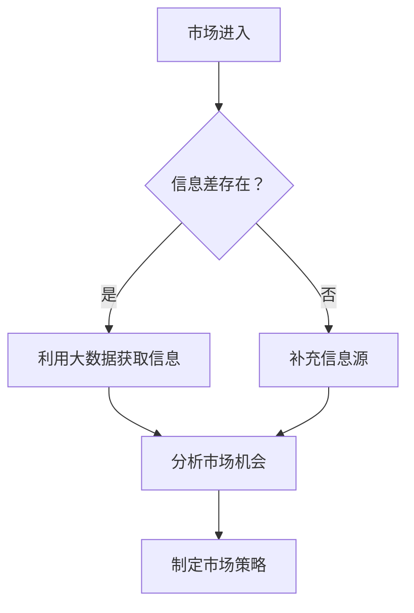

                 

关键词：大数据，市场进入壁垒，信息差，商业策略，技术分析

> 摘要：本文深入探讨了大数据技术如何帮助企业突破市场进入壁垒，通过分析信息差的商业应用，探讨了大数据在市场调研、客户行为分析、竞争对手监控等方面的应用场景，提出了大数据在商业市场进入中的战略价值和实施路径。

## 1. 背景介绍

在信息爆炸的时代，数据已成为新的生产要素，大数据技术在商业领域的应用日益广泛。然而，许多企业在进入新市场时面临着信息不对称和市场进入壁垒的挑战。信息差，即信息的不均衡分布，使得部分企业能够迅速占据市场优势，而其他企业则难以获得足够的信息支持来制定有效的市场进入策略。

市场进入壁垒是指新进入者与现有竞争者之间的竞争障碍，包括技术壁垒、资本壁垒、品牌壁垒等。这些壁垒的存在使得新进入者在市场中面临巨大的挑战。大数据技术通过提供更全面、更准确的信息，帮助企业降低市场进入壁垒，实现快速市场进入和竞争。

## 2. 核心概念与联系

### 2.1 大数据技术概述

大数据技术包括数据的采集、存储、处理、分析和可视化。其核心在于利用分布式系统、云计算、数据库优化、机器学习等先进技术，实现海量数据的快速处理和分析。

### 2.2 市场进入壁垒

市场进入壁垒可以分为结构性壁垒和战略壁垒。结构性壁垒包括规模经济、品牌效应、专利保护等；战略壁垒包括客户忠诚度、渠道控制、先发优势等。

### 2.3 信息差

信息差是指不同主体之间对同一信息的掌握程度存在差异。在商业环境中，信息差可以导致资源分配不均，进而影响企业的市场竞争地位。

### 2.4 Mermaid 流程图



## 3. 核心算法原理 & 具体操作步骤

### 3.1 算法原理概述

大数据技术中的核心算法包括数据挖掘、机器学习、数据分析和数据可视化。这些算法通过处理和分析海量数据，帮助企业发现市场机会、优化业务流程、提升决策效率。

### 3.2 算法步骤详解

1. **数据采集**：通过API接口、数据库导入、传感器等多种方式收集数据。
2. **数据清洗**：使用ETL（提取、转换、加载）技术清洗数据，保证数据质量。
3. **数据处理**：采用分布式计算框架（如Hadoop、Spark）处理海量数据。
4. **数据分析**：利用数据挖掘和机器学习算法分析数据，发现隐藏的模式和趋势。
5. **数据可视化**：通过图表和报表等形式展示分析结果，帮助决策者理解数据。

### 3.3 算法优缺点

**优点**：
- 提高决策效率：快速处理和分析海量数据，提供及时、准确的信息支持。
- 降低成本：通过自动化和智能化分析，减少人工干预和操作成本。
- 提升竞争力：利用大数据技术发现市场机会，制定更有效的市场策略。

**缺点**：
- 数据安全风险：大量数据的集中处理可能导致数据泄露和隐私问题。
- 技术门槛高：大数据技术的实施和维护需要专业的技术团队和硬件设备。

### 3.4 算法应用领域

大数据技术在市场进入中的应用广泛，包括：
- 市场调研：通过大数据分析了解市场趋势和竞争对手动态。
- 客户行为分析：通过分析客户数据，优化营销策略和客户服务。
- 竞争对手监控：实时监测竞争对手的行动和策略，制定应对措施。

## 4. 数学模型和公式 & 详细讲解 & 举例说明

### 4.1 数学模型构建

市场进入决策模型：
\[ \text{决策变量} = \frac{\text{市场机会}}{\text{市场进入壁垒}} \]

其中，市场机会通过大数据分析得到，市场进入壁垒包括结构性壁垒和战略壁垒。

### 4.2 公式推导过程

市场进入决策模型的推导过程如下：
\[ \text{市场机会} = \text{数据采集} \times \text{数据清洗} \times \text{数据处理} \]
\[ \text{市场进入壁垒} = \text{结构性壁垒} + \text{战略壁垒} \]

### 4.3 案例分析与讲解

假设某企业计划进入一个新的市场，通过大数据分析得到的市场机会为1000，结构性壁垒为500，战略壁垒为300。则：
\[ \text{决策变量} = \frac{1000}{500 + 300} = \frac{1000}{800} = 1.25 \]

根据决策变量，企业可以制定以下市场进入策略：
- 如果决策变量大于1，说明市场机会大于市场进入壁垒，企业可以积极进入市场。
- 如果决策变量小于1，说明市场进入壁垒较高，企业需要进一步分析市场机会和壁垒，制定差异化市场策略。

## 5. 项目实践：代码实例和详细解释说明

### 5.1 开发环境搭建

在本案例中，我们将使用Python和Apache Spark构建一个大数据分析项目。首先，安装Python环境和Apache Spark。

### 5.2 源代码详细实现

```python
from pyspark.sql import SparkSession
from pyspark.sql.functions import col, mean

# 创建Spark会话
spark = SparkSession.builder.appName("MarketEntryAnalysis").getOrCreate()

# 读取市场数据
market_data = spark.read.csv("market_data.csv", header=True)

# 数据清洗
cleaned_data = market_data.filter((col("structural_bARRIER") > 0) & (col("strategic_bARRIER") > 0))

# 数据处理
market_opportunity = cleaned_data.groupBy("market").agg(mean("opportunity").alias("avg_opportunity"))

# 数据分析
market_entry_decision = market_opportunity.withColumn("decision_variable", col("avg_opportunity") / (col("structural_bARRIER") + col("strategic_bARRIER")))

# 数据可视化
market_entry_decision.show()

# 关闭Spark会话
spark.stop()
```

### 5.3 代码解读与分析

- 第1步：创建Spark会话。
- 第2步：读取市场数据文件。
- 第3步：数据清洗，去除不符合条件的记录。
- 第4步：数据处理，计算市场机会的平均值。
- 第5步：数据分析，计算决策变量。
- 第6步：数据可视化，展示分析结果。

通过以上步骤，我们实现了市场进入决策的自动化分析。

### 5.4 运行结果展示

运行结果将显示每个市场的平均机会和决策变量，帮助企业制定市场进入策略。

## 6. 实际应用场景

### 6.1 市场调研

通过大数据技术，企业可以全面了解市场趋势和竞争对手动态，制定更有针对性的市场进入策略。

### 6.2 客户行为分析

通过分析客户数据，企业可以优化产品和服务，提升客户满意度，降低客户流失率。

### 6.3 竞争对手监控

实时监测竞争对手的行动和策略，企业可以提前制定应对措施，抢占市场先机。

## 7. 未来应用展望

### 7.1 人工智能的融合

未来，大数据技术与人工智能技术将深度融合，实现更智能、更高效的市场分析和决策。

### 7.2 新兴市场的探索

大数据技术将帮助企业在新兴市场中快速发现机会，降低市场进入壁垒。

### 7.3 数据隐私保护

随着数据隐私问题的日益凸显，企业需要加强数据隐私保护，确保大数据技术在商业中的应用合法、合规。

## 8. 总结：未来发展趋势与挑战

### 8.1 研究成果总结

大数据技术在市场进入中的应用已取得显著成果，为企业在市场调研、客户行为分析和竞争对手监控等方面提供了有力支持。

### 8.2 未来发展趋势

未来，大数据技术将在更广泛的领域得到应用，与人工智能、区块链等新兴技术深度融合，为商业决策提供更全面、更准确的信息支持。

### 8.3 面临的挑战

- 数据安全与隐私保护
- 技术门槛与人才需求
- 法规与合规要求

### 8.4 研究展望

未来，大数据技术的研究将更加注重跨领域融合、数据隐私保护和人工智能技术的深度结合，为商业市场进入提供更强大的支持。

## 9. 附录：常见问题与解答

### 9.1 大数据技术如何保证数据安全？

- 采用数据加密技术保护数据传输和存储过程中的安全。
- 实施严格的数据访问控制和审计机制，确保数据仅被授权人员访问。
- 定期进行安全培训和意识教育，提高员工的数据安全意识。

### 9.2 大数据技术如何处理海量数据？

- 采用分布式计算框架，如Hadoop和Spark，实现海量数据的并行处理。
- 采用分布式数据库，如HBase和Cassandra，实现海量数据的存储和管理。
- 采用大数据分析工具，如Spark SQL和Hive，实现海量数据的快速查询和分析。

----------------------------------------------------------------

### 作者署名：

作者：禅与计算机程序设计艺术 / Zen and the Art of Computer Programming


