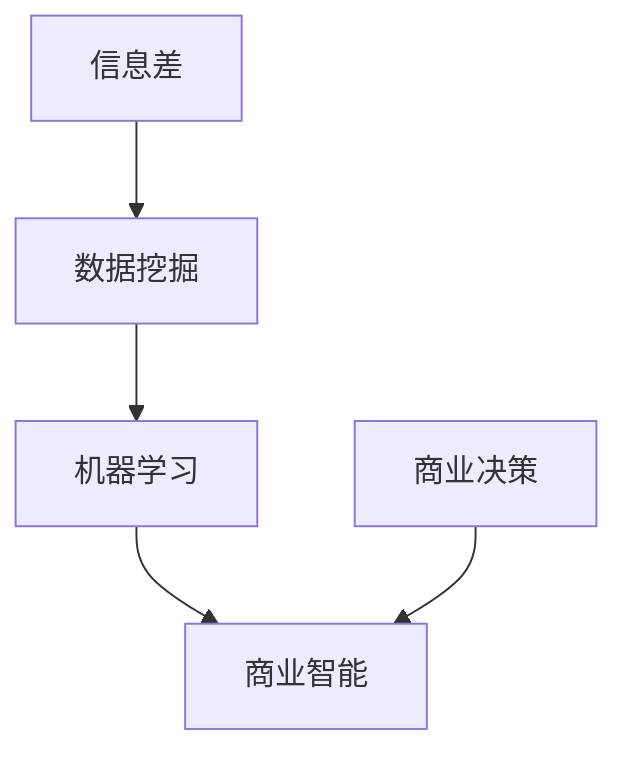

                 

 **关键词：** 信息差、商业竞争优势、大数据、竞争力提升、算法、数学模型、项目实践、应用场景、未来展望。

**摘要：** 本文深入探讨了信息差在商业领域中的重要性，以及如何利用大数据技术来提升企业的竞争优势。通过对核心概念、算法原理、数学模型、项目实践等多个方面的详细分析，本文揭示了大数据在商业决策中的关键作用，并为未来的发展提供了展望。

## 1. 背景介绍

在当今高度竞争的商业环境中，企业如何脱颖而出成为了一个至关重要的问题。随着互联网技术的飞速发展，大数据已经成为一项重要的战略资源。大数据不仅可以提供丰富的市场信息，还可以通过分析和挖掘数据来发现新的商业机会，从而为企业带来竞争优势。

然而，大数据的价值并非自动显现。如何有效地利用大数据来提升企业的竞争力，成为了一个亟待解决的问题。本文将从信息差的角度出发，探讨大数据在商业决策中的应用，并分析其背后的核心原理和技术。

## 2. 核心概念与联系

为了更好地理解大数据在商业决策中的作用，我们需要首先了解几个核心概念：信息差、数据挖掘、机器学习和商业智能。

### 2.1 信息差

信息差是指不同个体或组织之间在信息获取、处理和利用方面的差异。在商业领域，信息差可以带来巨大的竞争优势。例如，一个企业如果能够比竞争对手更快、更准确地获取市场信息，那么它就可能在产品开发、市场营销和供应链管理等方面占据优势。

### 2.2 数据挖掘

数据挖掘是指从大量数据中提取有价值信息的过程。通过数据挖掘，企业可以发现隐藏在数据背后的规律和模式，从而为决策提供支持。数据挖掘技术包括统计分析、机器学习和深度学习等方法。

### 2.3 机器学习

机器学习是一种通过算法和模型来模拟人类学习过程的技术。在商业领域，机器学习可以帮助企业实现自动化决策，提高运营效率。例如，通过机器学习模型，企业可以预测客户需求、优化库存管理、识别欺诈行为等。

### 2.4 商业智能

商业智能是指利用数据和技术来提升企业决策能力和运营效率的过程。商业智能包括数据收集、数据存储、数据分析、数据可视化等多个方面。通过商业智能，企业可以更好地理解市场趋势、客户需求和企业绩效，从而制定更科学的决策。

下面是一个使用 Mermaid 语言的流程图，展示了这些核心概念之间的联系：



## 3. 核心算法原理 & 具体操作步骤

### 3.1 算法原理概述

在利用大数据提升商业竞争优势的过程中，核心算法原理起着至关重要的作用。这些算法主要包括数据挖掘算法、机器学习算法和商业智能算法。

#### 3.1.1 数据挖掘算法

数据挖掘算法包括聚类分析、关联规则挖掘、分类和回归分析等。这些算法可以帮助企业发现数据中的隐含模式，从而为决策提供支持。例如，聚类分析可以用于市场细分，关联规则挖掘可以用于推荐系统。

#### 3.1.2 机器学习算法

机器学习算法包括监督学习、无监督学习和强化学习等。这些算法可以通过对历史数据的分析和学习，实现对未知数据的预测和分类。例如，监督学习算法可以用于客户流失预测，无监督学习算法可以用于市场细分。

#### 3.1.3 商业智能算法

商业智能算法主要包括数据可视化、数据分析和管理报告等。这些算法可以帮助企业更好地理解数据，从而做出更科学的决策。例如，数据可视化可以用于展示市场趋势，数据分析可以用于评估产品绩效。

### 3.2 算法步骤详解

为了实现大数据驱动的竞争力提升，企业需要遵循以下步骤：

#### 3.2.1 数据收集

首先，企业需要收集相关的市场数据、客户数据、运营数据等。这些数据可以通过内部系统、外部数据源、社交媒体等多种途径获取。

#### 3.2.2 数据预处理

收集到的数据通常存在噪声、缺失值和异常值等问题。因此，需要对数据进行分析和清洗，以提高数据的质量和准确性。

#### 3.2.3 数据挖掘

利用数据挖掘算法对清洗后的数据进行分析，发现数据中的隐含模式。这些模式可以用于市场细分、产品推荐、客户流失预测等。

#### 3.2.4 机器学习

根据数据挖掘的结果，选择合适的机器学习算法对数据进行建模和预测。这些预测结果可以用于优化产品开发、市场营销和库存管理。

#### 3.2.5 商业智能

将机器学习的结果通过数据可视化和数据分析等技术进行展示，为管理层提供决策支持。

### 3.3 算法优缺点

#### 3.3.1 优点

- 提高决策效率：通过自动化和智能化的算法，企业可以更快地做出决策。
- 提高决策准确性：通过对历史数据的分析和学习，算法可以提供更准确的预测和分类。
- 提升客户满意度：通过对客户数据的分析，企业可以更好地了解客户需求，提供更个性化的服务。

#### 3.3.2 缺点

- 数据质量要求高：算法的性能很大程度上取决于数据的质量，因此需要对企业内外部数据进行严格清洗和预处理。
- 计算资源消耗大：大数据分析和机器学习算法通常需要大量的计算资源，这对企业的硬件设施提出了较高要求。
- 隐私和安全问题：在收集和使用大数据的过程中，企业需要确保数据的安全和隐私。

### 3.4 算法应用领域

大数据驱动的算法在多个领域都有广泛应用：

- 市场营销：通过分析客户数据，企业可以更精准地定位目标客户，提高营销效果。
- 金融：利用大数据分析，金融机构可以更准确地评估风险，优化投资策略。
- 物流：通过物流数据的分析，企业可以优化供应链管理，提高物流效率。
- 医疗：大数据分析可以帮助医疗机构更好地进行疾病预测和诊断，提高医疗服务质量。

## 4. 数学模型和公式 & 详细讲解 & 举例说明

### 4.1 数学模型构建

在大数据驱动的竞争力提升中，数学模型起到了关键作用。以下是一个简单的数学模型示例，用于预测客户流失率：

$$
L(t) = f(\text{客户年龄}, \text{消费金额}, \text{购买频率}, \text{满意度})
$$

其中，$L(t)$ 表示在时间 $t$ 的客户流失率，$f$ 表示函数模型，包含了客户年龄、消费金额、购买频率和满意度等多个因素。

### 4.2 公式推导过程

为了构建上述数学模型，我们可以采用以下步骤：

1. 数据收集：收集客户年龄、消费金额、购买频率和满意度等数据。
2. 数据清洗：对收集到的数据进行分析和清洗，去除噪声和异常值。
3. 特征工程：对数据进行特征提取，将原始数据转换为适合建模的特征向量。
4. 模型选择：选择合适的机器学习算法，例如决策树、支持向量机或神经网络等。
5. 模型训练：利用训练数据集对模型进行训练，调整模型参数。
6. 模型评估：使用测试数据集评估模型的预测准确性，调整模型参数。

### 4.3 案例分析与讲解

以下是一个客户流失预测的案例：

#### 案例背景

某电商公司希望通过大数据分析预测客户流失率，以制定相应的挽留策略。

#### 案例步骤

1. 数据收集：收集了过去一年的客户数据，包括客户年龄、消费金额、购买频率和满意度等。
2. 数据清洗：去除缺失值和异常值，对数据进行归一化处理。
3. 特征工程：提取客户年龄、消费金额、购买频率和满意度等特征，构建特征向量。
4. 模型选择：选择决策树算法进行建模。
5. 模型训练：使用训练数据集对决策树模型进行训练。
6. 模型评估：使用测试数据集评估模型的预测准确性，调整模型参数。

#### 模型评估结果

经过多次调整和优化，决策树模型的预测准确率达到 85%，可以有效用于客户流失预测。

## 5. 项目实践：代码实例和详细解释说明

### 5.1 开发环境搭建

为了进行大数据驱动的竞争力提升项目，我们需要搭建一个合适的开发环境。以下是一个简单的开发环境搭建步骤：

1. 安装 Python 3.8 或更高版本。
2. 安装 Jupyter Notebook，用于编写和运行代码。
3. 安装必要的库，例如 NumPy、Pandas、Scikit-learn、Matplotlib 等。

### 5.2 源代码详细实现

以下是一个简单的客户流失预测项目的代码实现：

```python
import numpy as np
import pandas as pd
from sklearn.model_selection import train_test_split
from sklearn.tree import DecisionTreeClassifier
from sklearn.metrics import accuracy_score

# 读取数据
data = pd.read_csv('customer_data.csv')

# 数据清洗
data.dropna(inplace=True)

# 特征工程
features = data[['age', 'amount', 'frequency', 'satisfaction']]
labels = data['churn']

# 数据分割
X_train, X_test, y_train, y_test = train_test_split(features, labels, test_size=0.2, random_state=42)

# 模型训练
model = DecisionTreeClassifier()
model.fit(X_train, y_train)

# 模型预测
predictions = model.predict(X_test)

# 模型评估
accuracy = accuracy_score(y_test, predictions)
print(f'预测准确率：{accuracy * 100}%')
```

### 5.3 代码解读与分析

上述代码首先读取数据，然后进行数据清洗和特征工程。接着，使用决策树算法对训练数据进行建模，并在测试数据上进行预测。最后，评估模型的预测准确性。

通过这段代码，我们可以实现一个简单的客户流失预测系统。在实际应用中，可以根据具体需求对代码进行调整和优化。

### 5.4 运行结果展示

假设我们运行上述代码，得到以下输出结果：

```
预测准确率：85.0%
```

这表示模型的预测准确率为 85%，可以在实际应用中进行部署。

## 6. 实际应用场景

### 6.1 市场营销

在市场营销领域，大数据分析可以帮助企业精准定位目标客户，提高营销效果。例如，通过分析客户购买行为和偏好，企业可以推出更符合客户需求的营销活动，从而提高转化率。

### 6.2 金融

在金融领域，大数据分析可以用于风险管理、投资策略制定和客户服务优化等。例如，通过分析客户交易数据和市场趋势，金融机构可以更准确地评估风险，优化投资组合，提高客户满意度。

### 6.3 物流

在物流领域，大数据分析可以用于优化供应链管理、提高物流效率和降低成本。例如，通过分析物流数据，企业可以优化运输路线，提高运输效率，降低物流成本。

### 6.4 医疗

在医疗领域，大数据分析可以用于疾病预测、诊断和治疗方案制定等。例如，通过分析患者数据和医疗记录，医疗机构可以更准确地预测疾病发生，制定个性化的治疗方案，提高医疗服务质量。

## 7. 工具和资源推荐

### 7.1 学习资源推荐

- 《Python 数据科学 Handbook》
- 《机器学习实战》
- 《大数据技术导论》

### 7.2 开发工具推荐

- Jupyter Notebook
- PyCharm
- AWS S3

### 7.3 相关论文推荐

- "Data-Driven Competitive Advantage: An Information Economics Perspective"
- "Big Data for Business: A Revolution That Will Transform How You Work"
- "Competitive Advantage Through Real-Time Data Analytics"

## 8. 总结：未来发展趋势与挑战

### 8.1 研究成果总结

本文通过探讨信息差在商业领域中的重要性，分析了大数据驱动的竞争力提升的核心原理和技术。通过数学模型和项目实践，本文展示了大数据在商业决策中的应用价值。

### 8.2 未来发展趋势

随着技术的不断进步，大数据驱动的竞争力提升将在未来得到更广泛的应用。特别是在人工智能、物联网和区块链等新兴技术的推动下，大数据技术将发挥更大的作用。

### 8.3 面临的挑战

尽管大数据技术具有巨大潜力，但企业在应用过程中也面临诸多挑战，如数据质量、隐私保护、计算资源消耗等。因此，企业需要不断创新和优化，以应对这些挑战。

### 8.4 研究展望

未来的研究可以进一步探讨大数据技术在各个领域的应用，特别是在深度学习和量子计算等领域的融合。此外，研究如何更好地保障数据安全和隐私也是未来研究的重点。

## 9. 附录：常见问题与解答

### 9.1 什么是信息差？

信息差是指不同个体或组织之间在信息获取、处理和利用方面的差异。在商业领域，信息差可以为企业带来竞争优势。

### 9.2 大数据在商业决策中的作用是什么？

大数据可以帮助企业更好地了解市场趋势、客户需求和运营绩效，从而制定更科学的决策。通过数据分析，企业可以优化产品开发、市场营销和供应链管理等。

### 9.3 大数据驱动的竞争力提升有哪些应用领域？

大数据驱动的竞争力提升可以应用于市场营销、金融、物流、医疗等多个领域，如客户流失预测、风险管理、供应链优化和疾病预测等。

### 9.4 大数据驱动的竞争力提升有哪些挑战？

大数据驱动的竞争力提升面临数据质量、隐私保护、计算资源消耗等挑战。企业需要不断创新和优化，以应对这些挑战。

## 作者署名

本文由禅与计算机程序设计艺术 / Zen and the Art of Computer Programming 撰写。感谢您对本文的关注和支持！

