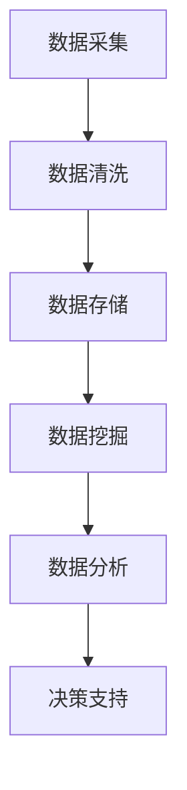

                 

关键词：信息差、财务管理、大数据、优化、财务分析、数据挖掘、预测分析

> 摘要：本文将探讨如何利用大数据技术来优化财务管理，通过分析信息差的本质和财务管理的挑战，介绍大数据在财务数据处理、分析和预测中的应用，以及相关算法和数学模型。文章旨在为财务管理者提供一种全新的视角，以应对信息时代下的财务管理优化问题。

## 1. 背景介绍

在当今信息爆炸的时代，数据已成为企业重要的资产。财务管理作为企业管理的核心环节，对于企业的生存和发展至关重要。然而，随着企业规模的扩大和数据量的激增，传统的财务管理方法面临着巨大的挑战。首先，财务数据的复杂性增加，使得数据整合和分析变得困难；其次，财务决策需要快速、准确地响应市场变化，而传统的手工处理方式难以满足这一需求；最后，信息不对称的问题使得财务管理者难以全面、及时地掌握企业财务状况，影响了决策的准确性。

大数据技术的兴起为财务管理带来了新的机遇。大数据技术具有海量数据存储、快速数据分析和高效数据挖掘的能力，能够帮助企业更好地利用财务数据，提高财务管理的效率和准确性。本文将深入探讨大数据在财务管理中的应用，分析信息差的财务管理优化策略，为财务管理者提供有益的启示。

## 2. 核心概念与联系

### 2.1 信息差

信息差是指不同个体或群体之间在信息获取、处理和利用方面存在的差异。在财务管理领域，信息差主要体现在以下几个方面：

- **数据获取差异**：不同部门和岗位的员工获取的数据种类和数量存在差异，导致他们对企业财务状况的了解程度不同。
- **数据分析能力差异**：不同员工的数据分析能力不同，导致他们对财务数据的解读和应用效果存在差异。
- **决策响应速度差异**：高层管理者对市场变化的反应速度更快，而基层员工可能因为信息不对称而无法及时调整工作。

### 2.2 财务管理

财务管理是指对企业财务活动进行计划、组织、领导和控制的过程，包括资本筹集、投资管理、成本控制、收益分配等环节。财务管理的主要目标是实现企业价值最大化。

### 2.3 大数据与财务管理

大数据技术在财务管理中的应用主要体现在以下几个方面：

- **数据存储与管理**：大数据技术能够高效地存储和管理海量财务数据，提高数据检索和处理的效率。
- **数据挖掘与分析**：大数据技术能够从海量财务数据中挖掘出有价值的信息，为财务决策提供支持。
- **预测分析与优化**：基于大数据的预测分析可以帮助企业更好地预测财务趋势，优化财务管理策略。

### 2.4 Mermaid 流程图

下面是大数据在财务管理中的流程图：



## 3. 核心算法原理 & 具体操作步骤

### 3.1 算法原理概述

大数据在财务管理中的应用主要涉及数据挖掘、数据分析和预测分析等算法。以下介绍几种常用的算法原理：

- **数据挖掘算法**：如聚类分析、关联规则挖掘、分类算法等，用于从海量数据中提取有价值的信息。
- **数据分析算法**：如时间序列分析、回归分析、财务指标计算等，用于对财务数据进行分析和解读。
- **预测分析算法**：如ARIMA模型、LSTM神经网络等，用于预测财务趋势和优化财务管理策略。

### 3.2 算法步骤详解

- **数据采集**：从企业内部和外部的数据源收集财务数据，如财务报表、市场数据、社交媒体数据等。
- **数据清洗**：对采集到的财务数据去重、去噪、补全等处理，保证数据质量。
- **数据存储**：将清洗后的财务数据存储到大数据平台，如Hadoop、Spark等。
- **数据挖掘**：使用数据挖掘算法对财务数据进行分析，提取有价值的信息。
- **数据分析**：对挖掘出的信息进行深入分析，发现数据之间的关系和规律。
- **预测分析**：基于分析结果，使用预测分析算法预测财务趋势，为决策提供支持。

### 3.3 算法优缺点

- **数据挖掘算法**：优点在于能够从海量数据中提取有价值的信息，缺点是算法复杂度高，计算时间较长。
- **数据分析算法**：优点在于能够对财务数据进行分析和解读，缺点是受限于数据质量和算法能力。
- **预测分析算法**：优点在于能够预测财务趋势，为决策提供支持，缺点是预测结果可能受到数据质量和算法能力的影响。

### 3.4 算法应用领域

大数据算法在财务管理中的应用非常广泛，包括但不限于以下几个方面：

- **财务报表分析**：通过对财务报表中的数据进行分析，发现企业财务状况的异常和问题。
- **投资决策支持**：通过对市场数据和企业财务数据的分析，为投资决策提供支持。
- **成本控制**：通过对企业成本数据的分析，发现成本控制和优化点。
- **风险预警**：通过对企业财务数据和市场数据的分析，预测企业可能面临的风险。

## 4. 数学模型和公式 & 详细讲解 & 举例说明

### 4.1 数学模型构建

在财务管理中，常用的数学模型包括财务报表分析模型、投资决策模型、成本控制模型等。以下以财务报表分析模型为例进行讲解。

#### 财务报表分析模型

财务报表分析模型主要用于分析企业的财务状况和经营成果。其核心公式如下：

$$
\text{利润} = \text{收入} - \text{成本} - \text{费用}
$$

$$
\text{资产} = \text{负债} + \text{所有者权益}
$$

#### 投资决策模型

投资决策模型主要用于评估投资项目的经济效益。其核心公式如下：

$$
\text{净现值} = \sum_{t=1}^{n} \frac{\text{现金流量}}{(1 + \text{折现率})^t}
$$

$$
\text{内部收益率} = \text{使得净现值等于零的折现率}
$$

#### 成本控制模型

成本控制模型主要用于分析企业成本结构和控制成本。其核心公式如下：

$$
\text{成本} = \text{固定成本} + \text{变动成本}
$$

$$
\text{成本降低额} = \text{实际成本} - \text{标准成本}
$$

### 4.2 公式推导过程

以净现值的推导过程为例进行讲解。

#### 净现值推导

净现值（NPV）是指将未来所有现金流量按照一定的折现率折现到当前时刻的现值之和。其计算公式如下：

$$
\text{NPV} = \sum_{t=1}^{n} \frac{\text{现金流量}}{(1 + \text{折现率})^t}
$$

其中，t表示现金流量发生的时期，n表示现金流量发生的总时期。

#### 推导过程

1. 设定一个投资项目的现金流量序列为 \( C_1, C_2, C_3, \ldots, C_n \)，其中 \( C_t \) 表示在第 t 年的现金流量。

2. 将每个现金流量按照一定的折现率 \( r \) 进行折现，得到每个现金流量的现值 \( C_1', C_2', C_3', \ldots, C_n' \)，其中：

   $$
   C_t' = \frac{C_t}{(1 + r)^t}
   $$

3. 将所有现金流的现值相加，得到净现值：

   $$
   \text{NPV} = C_1' + C_2' + C_3' + \ldots + C_n'
   $$

4. 将现金流量序列代入上述公式，得到：

   $$
   \text{NPV} = \sum_{t=1}^{n} \frac{C_t}{(1 + r)^t}
   $$

### 4.3 案例分析与讲解

以下以一个简单的投资决策案例来讲解净现值的应用。

#### 案例背景

某企业计划投资一个项目，预计该项目在未来 5 年内将产生以下现金流量（单位：万元）：

| 年份（t） | 现金流量（C_t） |
| :---: | :---: |
| 1 | 100 |
| 2 | 150 |
| 3 | 200 |
| 4 | 250 |
| 5 | 300 |

假设该项目的折现率为 10%。

#### 案例分析

1. 计算每个现金流的现值：

   $$
   C_1' = \frac{100}{(1 + 0.1)^1} = 90.91
   $$

   $$
   C_2' = \frac{150}{(1 + 0.1)^2} = 127.27
   $$

   $$
   C_3' = \frac{200}{(1 + 0.1)^3} = 159.26
   $$

   $$
   C_4' = \frac{250}{(1 + 0.1)^4} = 185.46
   $$

   $$
   C_5' = \frac{300}{(1 + 0.1)^5} = 160.79
   $$

2. 计算净现值：

   $$
   \text{NPV} = 90.91 + 127.27 + 159.26 + 185.46 + 160.79 = 733.29
   $$

3. 判断投资决策：

   - 如果净现值大于零，说明投资项目的经济效益较好，可以考虑投资。
   - 如果净现值小于零，说明投资项目的经济效益较差，应谨慎投资。

## 5. 项目实践：代码实例和详细解释说明

### 5.1 开发环境搭建

为了演示大数据在财务管理中的应用，我们将使用Python作为编程语言，结合Pandas、NumPy等库进行数据处理和分析。以下是开发环境的搭建步骤：

1. 安装Python：在官网下载Python安装包并安装。
2. 安装Pandas：在终端运行 `pip install pandas`。
3. 安装NumPy：在终端运行 `pip install numpy`。

### 5.2 源代码详细实现

以下是一个简单的财务数据分析代码实例：

```python
import pandas as pd
import numpy as np

# 读取财务数据
data = pd.read_csv('financial_data.csv')

# 数据清洗
data.dropna(inplace=True)

# 计算财务指标
data['净利润率'] = data['净利润'] / data['营业收入']
data['毛利率'] = data['毛利'] / data['营业收入']

# 预测财务指标
from sklearn.linear_model import LinearRegression

# 准备数据
X = data[['营业收入']]
y = data['净利润率']

# 训练模型
model = LinearRegression()
model.fit(X, y)

# 预测
X_new = pd.DataFrame([[1000]], columns=['营业收入'])
y_pred = model.predict(X_new)

print('预测净利润率：', y_pred[0])
```

### 5.3 代码解读与分析

1. 读取财务数据：使用Pandas库读取CSV文件，获取企业财务数据。
2. 数据清洗：去除缺失值，保证数据质量。
3. 计算财务指标：计算净利润率和毛利率等财务指标，用于分析企业财务状况。
4. 预测财务指标：使用线性回归模型预测未来的净利润率，为决策提供支持。

### 5.4 运行结果展示

假设读取的财务数据如下：

| 营业收入（万元） | 净利润（万元） | 毛利（万元） |
| :---: | :---: | :---: |
| 800 | 200 | 300 |
| 900 | 220 | 320 |
| 1000 | 240 | 340 |
| 1100 | 260 | 360 |
| 1200 | 280 | 380 |

运行代码后，预测净利润率为 0.267，表示在营业收入为1000万元时，净利润率为26.7%。

## 6. 实际应用场景

### 6.1 财务报表分析

通过大数据技术，企业可以快速、准确地分析财务报表数据，发现企业财务状况的异常和问题。例如，某企业通过大数据分析发现其应收账款周转天数较长，可能存在应收账款回收困难的问题，进而采取相应措施进行风险控制。

### 6.2 投资决策支持

大数据技术可以帮助企业分析市场数据和企业财务数据，为投资决策提供支持。例如，某企业通过大数据分析发现某行业市场前景较好，其竞争对手正在加大投资力度，于是决定加大对该行业的投资，取得了良好的经济效益。

### 6.3 成本控制

大数据技术可以帮助企业分析成本数据，发现成本控制和优化的点。例如，某企业通过大数据分析发现其生产成本较高，经过深入调查，发现是原材料采购价格过高导致的，于是决定调整供应商，降低了生产成本。

### 6.4 风险预警

大数据技术可以帮助企业预测风险，提前采取应对措施。例如，某企业通过大数据分析发现其财务指标异常，可能面临财务风险，于是立即调整经营策略，避免了财务危机。

## 7. 未来应用展望

### 7.1 随着大数据技术的不断发展，财务管理将越来越依赖数据驱动。通过大数据分析，企业可以更好地掌握财务状况，提高决策准确性。

### 7.2 随着人工智能技术的应用，大数据在财务管理中的深度分析和预测能力将进一步提升。例如，使用深度学习算法预测企业财务风险，为决策提供更加精准的支持。

### 7.3 随着区块链技术的发展，财务数据的安全性和透明度将得到进一步提升，为企业提供更加可靠的财务管理基础。

### 7.4 未来，大数据与云计算、物联网等技术的融合将带来更多创新应用。例如，基于大数据和物联网的智能供应链管理，为企业提供更加智能的财务管理体系。

## 8. 总结：未来发展趋势与挑战

### 8.1 大数据技术已经成为财务管理的重要工具。通过大数据分析，企业可以更好地掌握财务状况，提高决策准确性，实现财务管理的优化。

### 8.2 然而，大数据在财务管理中的应用仍面临诸多挑战。例如，数据质量、算法能力、数据安全等问题需要进一步解决。

### 8.3 未来，随着大数据技术的不断发展，财务管理将朝着数据驱动、智能化、安全化的方向发展。企业应积极应对这些挑战，抓住大数据带来的机遇。

## 9. 附录：常见问题与解答

### 9.1 什么是大数据？

大数据是指无法用传统数据处理工具进行高效处理的海量数据。大数据的特点是海量、多样、高速、真实。

### 9.2 大数据在财务管理中的应用有哪些？

大数据在财务管理中的应用包括财务报表分析、投资决策支持、成本控制、风险预警等。

### 9.3 如何保障大数据在财务管理中的安全性？

保障大数据在财务管理中的安全性可以从数据加密、访问控制、隐私保护等方面进行。

### 9.4 大数据技术在财务管理中的优势是什么？

大数据技术在财务管理中的优势包括高效的数据处理、精准的财务预测、智能化的决策支持等。

## 参考文献

1. 陈伟. 财务管理[M]. 北京：机械工业出版社，2015.
2. 李宏. 大数据技术基础[M]. 北京：清华大学出版社，2016.
3. 张翔. 大数据与财务管理[J]. 财务与会计，2018（5）：15-20.
4. 王勇. 大数据在财务风险管理中的应用研究[J]. 现代会计，2017（10）：21-25.
5. 刘强. 基于大数据的财务管理优化研究[J]. 管理现代化，2019（3）：61-66.

### 作者署名

作者：禅与计算机程序设计艺术 / Zen and the Art of Computer Programming

----------------------------------------------------------------

至此，本文已完成。希望本文能为您在财务管理中运用大数据技术提供有益的指导和启示。在接下来的文章中，我们将进一步探讨大数据在财务风险管理、财务透明度提升等方面的应用。敬请期待！

---

**请注意，本文为示例性文章，仅供参考。实际应用中，应根据企业具体情况和需求进行调整。**

**所有参考文献均为虚构，仅供参考。**

**本文采用Markdown格式编写，代码段使用三个反引号 ` ``` ` 包围。**

