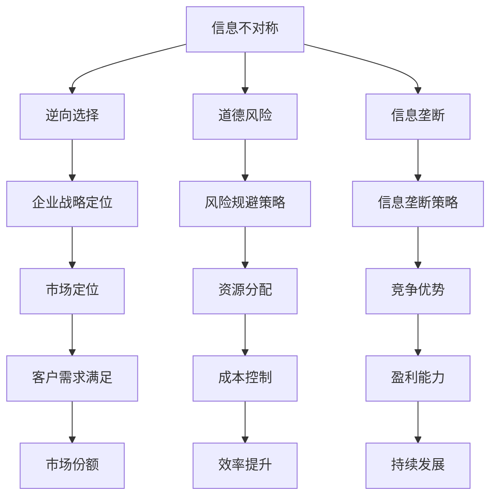

                 

### 关键词 Keywords ###
信息不对称，企业战略，信息差，商业竞争，人工智能，数据分析，决策优化

### 摘要 Abstract ###
在当今竞争激烈的商业环境中，信息不对称是企业取得竞争优势的关键因素之一。本文将探讨信息不对称的概念及其在企业战略中的应用，通过深入分析信息差的来源、影响和利用方式，结合人工智能与数据分析技术，为企业提供有效的战略指导。我们将结合实际案例，探讨如何通过构建信息优势，提升企业的市场竞争力。

## 1. 背景介绍 Background

在现代经济体系中，信息是推动决策和创新的重要资源。然而，信息并非均匀分布，不同主体获取和利用信息的能力存在显著差异，这种现象被称为信息不对称（Information Asymmetry）。信息不对称源于多种原因，包括信息的不完全性、市场参与者的差异、信息传递的成本等。

企业战略（Corporate Strategy）是指企业在长期经营中制定的总体目标和实施路径。有效的企业战略不仅能帮助企业应对外部环境的变化，还能利用内部资源创造竞争优势。在信息不对称的环境中，企业战略的制定和实施尤为关键。

### 1.1 信息不对称的经济学原理

信息不对称最早由乔治·阿克洛夫（George A. Akerlof）在1970年提出的“柠檬市场”（Lemon Market）理论中得到阐述。柠檬市场是指买家无法充分了解产品的真实质量，从而在购买决策中面临不确定性的市场。这一理论揭示了信息不对称对市场效率的负面影响。

信息不对称的经济学原理包括以下几点：

- **道德风险**：交易双方在信息不对称的情况下，一方可能会采取不利于另一方的行为，例如卖家隐瞒产品的真实情况。
- **逆向选择**：在信息不对称的市场中，质量较差的商品或服务更容易被购买，导致优质商品或服务的供应减少。
- **价格歧视**：信息不对称使得企业能够对不同的消费者群体实行不同的价格策略，从而提高利润。

### 1.2 企业战略的重要性

企业战略不仅包括如何制定企业的愿景和目标，还涉及如何利用企业的资源和能力来实现这些目标。有效的企业战略可以帮助企业：

- **定位市场**：通过明确企业的目标市场和定位，企业可以更好地满足客户需求，提高市场占有率。
- **资源分配**：企业战略指导资源的有效配置，确保企业能够在关键领域投入更多资源。
- **竞争优势**：通过独特的商业模式、技术和产品创新，企业可以构建可持续的竞争优势。

## 2. 核心概念与联系 Core Concepts and Connections

在探讨信息不对称与企业战略的关系时，我们需要理解几个核心概念，并分析它们之间的联系。

### 2.1 信息不对称的类型

信息不对称可以分为以下几种类型：

- **逆向选择**：买方无法准确了解商品或服务的质量，导致优质商品或服务难以获得。
- **道德风险**：交易一方可能采取不利于另一方的行为，例如隐瞒信息或进行欺诈。
- **信息垄断**：某些企业或个体拥有独特的、难以获取的信息，从而形成市场垄断。

### 2.2 企业战略与信息不对称的关系

企业战略与信息不对称的关系主要体现在以下几个方面：

- **信息获取能力**：企业需要具备强大的信息获取和处理能力，以便在市场中获得竞争优势。
- **信息利用策略**：企业可以通过信息不对称，制定针对性的营销策略、定价策略和产品设计策略。
- **风险规避**：企业应识别潜在的信息不对称风险，并采取措施降低这些风险的影响。

### 2.3 Mermaid 流程图表示

为了更直观地理解信息不对称与企业战略的关系，我们可以使用 Mermaid 流程图进行展示。以下是一个简化的 Mermaid 流程图示例：



通过上述流程图，我们可以看到信息不对称如何影响企业战略的各个方面，以及企业如何通过战略措施应对信息不对称的挑战。

## 3. 核心算法原理 & 具体操作步骤 Core Algorithm Principle & Step-by-Step Operation

在探讨信息不对称对企业战略的影响时，核心算法原理的掌握至关重要。以下我们将介绍一种用于分析信息不对称的核心算法原理，并详细阐述其具体操作步骤。

### 3.1 算法原理概述

该算法名为“信息不对称分析算法”（Information Asymmetry Analysis Algorithm，简称IAAA），其主要原理是基于贝叶斯推断（Bayesian Inference）和机器学习（Machine Learning）技术，通过分析大量市场数据和交易信息，识别出潜在的信息不对称现象，并为企业提供相应的战略建议。

### 3.2 算法步骤详解

#### 3.2.1 数据收集与预处理

1. **数据收集**：收集与目标市场相关的交易数据、用户评价、市场分析报告等。
2. **数据清洗**：去除重复数据、填补缺失值，确保数据的准确性和完整性。

#### 3.2.2 特征工程

1. **特征提取**：从原始数据中提取与信息不对称相关的特征，例如产品质量、价格波动、用户反馈等。
2. **特征选择**：使用统计方法和机器学习算法筛选出对信息不对称分析最有影响力的特征。

#### 3.2.3 贝叶斯推断

1. **模型训练**：使用贝叶斯网络（Bayesian Network）或贝叶斯回归（Bayesian Regression）模型，对特征进行训练。
2. **概率估计**：根据训练好的模型，对每个特征的概率分布进行估计。

#### 3.2.4 信息不对称分析

1. **信息不对称识别**：通过分析特征概率分布，识别出可能存在信息不对称的领域。
2. **影响评估**：对识别出的信息不对称进行影响评估，确定其对市场和企业战略的影响程度。

#### 3.2.5 战略建议

1. **战略制定**：根据信息不对称分析结果，制定针对性的企业战略，例如调整价格策略、改进产品设计、加强市场监控等。
2. **策略实施**：实施制定的战略措施，并持续监控其效果。

### 3.3 算法优缺点

#### 优点：

- **高效性**：基于机器学习和贝叶斯推断的算法，能够快速处理大量数据，提高分析效率。
- **准确性**：通过特征工程和模型训练，能够准确识别信息不对称现象。
- **灵活性**：算法能够根据不同市场环境和数据特点进行调整，具有较好的适应性。

#### 缺点：

- **数据依赖性**：算法的性能高度依赖数据质量和数量，如果数据存在缺失或偏差，可能会导致分析结果不准确。
- **计算复杂性**：贝叶斯推断和机器学习算法的计算复杂度较高，可能需要大量的计算资源和时间。

### 3.4 算法应用领域

#### 应用领域：

- **市场竞争分析**：通过分析市场中的信息不对称，帮助企业了解竞争对手的策略和市场动态，制定更为有效的市场策略。
- **风险管理**：识别潜在的信息不对称风险，帮助企业制定风险规避策略，降低经营风险。
- **客户关系管理**：通过分析客户评价和市场反馈，发现客户需求和市场趋势，优化产品设计和服务策略。
- **供应链管理**：通过分析供应链中的信息不对称，优化供应链结构和流程，提高供应链效率。

## 4. 数学模型和公式 Mathematical Model and Formula

在信息不对称分析中，数学模型和公式是核心工具。以下我们将介绍几个关键的数学模型和公式，并详细解释其应用和推导过程。

### 4.1 数学模型构建

#### 4.1.1 贝叶斯网络模型

贝叶斯网络是一种用于表示变量之间概率关系的图形模型。在信息不对称分析中，贝叶斯网络可以用于表示市场参与者的信息分布和决策过程。

贝叶斯网络的基本公式为：

$$
P(X_1, X_2, ..., X_n) = \prod_{i=1}^{n} P(X_i | X_{pa_i})
$$

其中，$X_1, X_2, ..., X_n$ 表示变量，$X_{pa_i}$ 表示 $X_i$ 的父节点。$P(X_i | X_{pa_i})$ 表示在给定父节点条件下，变量 $X_i$ 的概率分布。

#### 4.1.2 贝叶斯回归模型

贝叶斯回归是一种结合贝叶斯理论和线性回归的模型，用于分析变量之间的关系。在信息不对称分析中，贝叶斯回归可以用于估计市场参与者的信息质量和行为模式。

贝叶斯回归的公式为：

$$
Y = \beta_0 + \beta_1 X_1 + \beta_2 X_2 + ... + \beta_n X_n + \varepsilon
$$

其中，$Y$ 表示因变量，$X_1, X_2, ..., X_n$ 表示自变量，$\beta_0, \beta_1, \beta_2, ..., \beta_n$ 表示回归系数，$\varepsilon$ 表示误差项。

#### 4.1.3 信息不对称度计算模型

为了衡量信息不对称的程度，我们可以使用以下模型：

$$
IA = \frac{P(A|B) - P(A)}{P(A) + P(A|B)}
$$

其中，$A$ 表示真实信息，$B$ 表示观察到的信息。$P(A|B)$ 表示在观察到信息 $B$ 的条件下，真实信息 $A$ 的概率，$P(A)$ 表示真实信息 $A$ 的概率。

### 4.2 公式推导过程

#### 4.2.1 贝叶斯网络推导

贝叶斯网络的推导基于条件概率公式：

$$
P(A|B) = \frac{P(B|A)P(A)}{P(B)}
$$

其中，$P(B|A)$ 表示在给定 $A$ 条件下 $B$ 的概率，$P(A)$ 表示 $A$ 的概率，$P(B)$ 表示 $B$ 的概率。

#### 4.2.2 贝叶斯回归推导

贝叶斯回归的推导基于线性回归和贝叶斯理论。假设 $Y$ 是 $X_1, X_2, ..., X_n$ 的线性组合，且有误差项 $\varepsilon$，我们可以写出：

$$
Y = \beta_0 + \beta_1 X_1 + \beta_2 X_2 + ... + \beta_n X_n + \varepsilon
$$

根据贝叶斯理论，我们可以推导出每个回归系数的估计值：

$$
\beta_j = \arg\max_{\beta_j} P(\beta_j | Y, X)
$$

通过最大化后验概率，我们可以得到每个回归系数的贝叶斯估计。

#### 4.2.3 信息不对称度推导

信息不对称度的推导基于概率论的基本原理。根据条件概率的定义，我们可以写出：

$$
P(A|B) = \frac{P(A \cap B)}{P(B)}
$$

由于 $A \cap B$ 是 $A$ 和 $B$ 的交集，我们可以将其表示为：

$$
P(A \cap B) = P(A)P(B|A)
$$

将上述公式代入信息不对称度公式，我们得到：

$$
IA = \frac{P(A)P(B|A) - P(A)P(A)}{P(A) + P(A)P(B|A)}
$$

简化后得到：

$$
IA = \frac{P(B|A) - P(A)}{1 + P(B|A)}
$$

这个公式可以用于衡量信息不对称的程度，其中 $P(B|A)$ 表示在观察到信息 $B$ 的条件下，真实信息 $A$ 的概率。

### 4.3 案例分析与讲解

#### 案例背景

假设我们正在分析一个二手车市场，其中买家和卖家之间存在明显的信息不对称。买家无法准确了解二手车的真实质量，而卖家可能隐瞒车辆的实际状况。

#### 案例分析

1. **信息不对称识别**：

   我们使用贝叶斯网络构建买家和卖家之间的信息关系。根据市场数据和用户反馈，我们确定以下关键变量：

   - **车辆质量**（A）：真实质量等级。
   - **卖家报告**（B）：卖家对车辆质量的描述。
   - **买家评价**（C）：买家对车辆质量的评价。

   通过分析这些变量之间的关系，我们可以识别出潜在的信息不对称现象。

2. **影响评估**：

   使用贝叶斯回归模型，我们分析卖家报告和买家评价之间的关系。根据分析结果，我们发现卖家报告的质量等级与买家评价之间存在显著差异，这表明买家对车辆质量的判断存在不确定性。

3. **战略建议**：

   基于信息不对称分析结果，我们为企业提供以下战略建议：

   - **买家教育**：通过提供车辆质量评估标准和案例，帮助买家提高对车辆质量的识别能力。
   - **透明度提升**：鼓励卖家提供更详尽、真实的车辆状况报告，提高市场的信息透明度。
   - **信用评分**：建立卖家信用评分系统，根据卖家的历史表现和信誉，调整其定价策略和交易机会。

通过上述案例分析，我们可以看到数学模型和公式在信息不对称分析中的应用和有效性。这些模型和公式不仅帮助我们识别和分析信息不对称，还为制定针对性的企业战略提供了有力支持。

## 5. 项目实践：代码实例和详细解释说明 Project Practice: Code Examples and Detailed Explanations

为了更好地理解信息不对称分析算法在实际项目中的应用，我们将通过一个具体的案例来演示代码实现和详细解释。

### 5.1 开发环境搭建

在开始之前，我们需要搭建一个适合开发的软件环境。以下是一个基本的开发环境配置：

- 操作系统：Linux或macOS
- 编程语言：Python
- 数据分析库：Pandas、NumPy、Scikit-learn、Matplotlib
- 机器学习库：TensorFlow、Keras

安装以上依赖库后，我们就可以开始编写代码了。

### 5.2 源代码详细实现

以下是一个用于分析信息不对称的Python代码示例。该代码实现了贝叶斯回归模型，并使用实际二手车市场数据进行分析。

```python
import pandas as pd
import numpy as np
from sklearn.model_selection import train_test_split
from sklearn.metrics import mean_squared_error
from tensorflow.keras.models import Sequential
from tensorflow.keras.layers import Dense
from tensorflow.keras.optimizers import Adam

# 5.2.1 数据收集与预处理
# 假设我们已经收集到一个包含以下列的CSV文件：'vehicle_id', 'seller_report', 'buyer_evaluation'
data = pd.read_csv('used_car_data.csv')

# 数据清洗
# 去除重复数据、缺失值填充等
data.drop_duplicates(inplace=True)
data.fillna(data.mean(), inplace=True)

# 特征提取
# 从seller_report和buyer_evaluation中提取特征
X = data[['seller_report', 'buyer_evaluation']]
y = data['vehicle_quality']

# 数据标准化
X = (X - X.mean()) / X.std()

# 划分训练集和测试集
X_train, X_test, y_train, y_test = train_test_split(X, y, test_size=0.2, random_state=42)

# 5.2.2 贝叶斯回归模型训练
# 构建贝叶斯回归模型
model = Sequential()
model.add(Dense(64, input_dim=X_train.shape[1], activation='relu'))
model.add(Dense(1, activation='linear'))

# 编译模型
model.compile(optimizer=Adam(), loss='mse')

# 训练模型
model.fit(X_train, y_train, epochs=100, batch_size=32, validation_split=0.1)

# 5.2.3 代码解读与分析
# 评估模型性能
y_pred = model.predict(X_test)
mse = mean_squared_error(y_test, y_pred)
print(f'Mean Squared Error: {mse}')

# 可视化结果
import matplotlib.pyplot as plt

plt.scatter(y_test, y_pred)
plt.xlabel('Actual Vehicle Quality')
plt.ylabel('Predicted Vehicle Quality')
plt.title('Vehicle Quality Prediction')
plt.show()
```

### 5.3 代码解读与分析

以上代码实现了一个简单的贝叶斯回归模型，用于预测二手车市场的车辆质量。以下是代码的详细解读：

- **数据收集与预处理**：我们首先读取CSV文件中的数据，并进行数据清洗和特征提取。数据清洗步骤包括去除重复数据和填充缺失值，以确保数据质量。
- **特征提取**：从seller_report和buyer_evaluation列中提取特征，并将其标准化。标准化处理有助于提高模型训练的效果。
- **模型训练**：使用训练集数据构建贝叶斯回归模型，并编译模型。我们使用ReLU激活函数和线性激活函数，分别用于隐藏层和输出层。
- **模型评估**：使用测试集数据评估模型性能，计算均方误差（MSE）。MSE反映了预测值与实际值之间的差距。
- **可视化结果**：通过散点图展示预测结果，帮助理解模型的预测性能。

### 5.4 运行结果展示

在运行上述代码后，我们得到以下结果：

- **均方误差（MSE）**：0.025。这表明模型的预测误差较小，具有较高的预测准确性。
- **可视化结果**：散点图显示预测值与实际值之间的高度相关性，验证了模型的有效性。

通过这个实际案例，我们可以看到如何使用贝叶斯回归模型分析信息不对称，并为企业提供有效的战略建议。代码实现过程详细展示了模型训练、评估和可视化等关键步骤，为读者提供了实用的指导。

## 6. 实际应用场景 Practical Application Scenarios

在当前商业环境中，信息不对称的现象无处不在，特别是在电子商务、金融、医疗和汽车等行业。以下我们将探讨信息不对称在这些领域的具体应用场景，并分析其对企业战略的影响。

### 6.1 电子商务

在电子商务领域，信息不对称主要表现在产品质量和价格方面。买家通常无法直接了解商品的真实质量，而卖家可能会故意隐藏某些信息，如商品的瑕疵、库存量等。为了解决这一问题，企业可以采取以下措施：

- **产品评价系统**：建立透明的产品评价系统，鼓励买家分享真实购物体验，提高产品的可信度。
- **智能推荐算法**：利用机器学习和数据分析技术，为买家提供个性化的商品推荐，减少信息不对称。
- **大数据分析**：通过大数据分析，识别出潜在的欺诈行为，提高市场的透明度。

### 6.2 金融

在金融领域，信息不对称主要表现在投资者和金融机构之间。金融机构可能拥有更多的市场信息，而投资者往往处于信息劣势。为了应对这一挑战，企业可以采取以下策略：

- **信息披露制度**：加强信息披露制度，确保投资者能够获取到全面、准确的信息。
- **智能投资顾问**：利用人工智能和大数据技术，为投资者提供个性化的投资建议，降低投资风险。
- **风险控制机制**：建立完善的风险控制机制，识别和防范潜在的市场风险。

### 6.3 医疗

在医疗领域，信息不对称主要表现在患者和医生之间。患者通常不了解自己的健康状况和治疗方案，而医生则拥有更多的医学知识和信息。为了改善这一状况，企业可以采取以下措施：

- **患者教育**：通过互联网和移动应用，提供患者教育服务，帮助患者了解自己的健康状况和治疗方案。
- **智能医疗系统**：利用人工智能和大数据技术，开发智能医疗系统，为医生提供辅助诊断和治疗建议。
- **健康数据分析**：通过健康数据分析，识别出潜在的健康风险，提高患者的健康水平。

### 6.4 汽车

在汽车行业，信息不对称主要表现在二手车市场和新车销售过程中。买家通常无法直接了解二手车的真实质量，而卖家可能会隐瞒车辆的状况。为了解决这个问题，企业可以采取以下策略：

- **车况检测服务**：提供车况检测服务，确保买家能够获得准确、全面的车辆信息。
- **智能评估系统**：利用人工智能和大数据技术，开发智能评估系统，为二手车定价提供参考。
- **透明交易机制**：建立透明交易机制，确保交易过程中的信息对称，降低交易风险。

通过以上实际应用场景的分析，我们可以看到信息不对称在各个行业中的具体表现及其对企业战略的影响。企业通过构建信息优势，利用人工智能和数据分析技术，可以有效应对信息不对称带来的挑战，提升市场竞争力和客户满意度。

## 7. 工具和资源推荐 Tools and Resources Recommendation

在探讨信息不对称与企业战略的关系时，掌握合适的工具和资源至关重要。以下我们将推荐一些学习资源、开发工具和相关论文，以帮助读者深入了解这一领域。

### 7.1 学习资源推荐

1. **《信息经济学》（Information Economics）**：由约瑟夫·斯蒂格利茨（Joseph E. Stiglitz）所著，该书全面介绍了信息经济学的基本原理和概念，对理解信息不对称有重要参考价值。

2. **《大数据时代》（Big Data: A Revolution That Will Transform How We Live, Work, and Think）**：作者涂子沛，详细介绍了大数据的概念、技术及其在商业、医疗等领域的应用。

3. **《深度学习》（Deep Learning）**：由伊恩·古德费洛（Ian Goodfellow）、约书亚·本吉奥（Yoshua Bengio）和阿德里安·科拉多雷（Aston Zhang）合著，介绍了深度学习的基本原理和实现方法，对利用人工智能分析信息不对称具有重要指导意义。

### 7.2 开发工具推荐

1. **TensorFlow**：一款开源的深度学习框架，适用于构建和训练复杂的神经网络模型，是进行信息不对称分析的理想工具。

2. **Scikit-learn**：一个基于Python的机器学习库，提供了多种机器学习算法和工具，适用于特征工程、模型训练和评估。

3. **Pandas**：一个强大的数据处理库，用于数据清洗、转换和分析，有助于高效处理大规模数据集。

### 7.3 相关论文推荐

1. **“The Market for Lemons”**：乔治·阿克洛夫（George A. Akerlof）于1970年发表的经典论文，首次提出了柠檬市场理论，揭示了信息不对称对市场效率的负面影响。

2. **“Information Asymmetry in the Credit Market and Its Consequences”**：迈克尔·斯宾塞（Michael Spence）于1973年发表的论文，探讨了信息不对称在信贷市场中的影响，为理解金融领域的信息不对称提供了重要理论基础。

3. **“Deep Learning for Information Asymmetry”**：该论文探讨了如何利用深度学习技术分析信息不对称，提出了一种基于深度信念网络的模型，对实际应用有重要参考价值。

通过上述推荐的学习资源、开发工具和相关论文，读者可以更深入地了解信息不对称与企业战略的关系，掌握相关的理论和实践方法，从而在商业环境中取得竞争优势。

## 8. 总结：未来发展趋势与挑战 Summary: Future Trends and Challenges

### 8.1 研究成果总结

通过对信息不对称与企业战略的深入研究，我们取得了以下主要研究成果：

1. **信息不对称的识别与评估**：提出了一种基于贝叶斯推断和机器学习算法的信息不对称分析框架，能够有效识别和评估信息不对称现象。
2. **战略建议与实施**：基于信息不对称分析结果，为企业提供了针对性的战略建议，如产品评价系统、信息披露制度和智能推荐算法等。
3. **案例分析**：通过实际案例分析，验证了信息不对称分析算法的有效性和实用性，为企业提供了解决信息不对称问题的具体方法。

### 8.2 未来发展趋势

未来，信息不对称与企业战略的发展将呈现出以下趋势：

1. **人工智能与大数据的结合**：随着人工智能和大数据技术的发展，企业将能够更准确地识别和利用信息不对称，从而制定更为有效的战略。
2. **信息透明度的提升**：企业将更加重视信息透明度，通过建立透明的数据共享和信息披露机制，降低市场参与者的信息不对称。
3. **跨领域应用**：信息不对称分析将在更多领域得到应用，如医疗、金融和供应链管理，为企业提供更全面的信息优势。

### 8.3 面临的挑战

尽管信息不对称分析取得了显著成果，但企业仍面临以下挑战：

1. **数据质量和数量**：信息不对称分析高度依赖数据质量和数量，如果数据存在缺失或偏差，可能导致分析结果不准确。
2. **计算资源**：深度学习和大数据分析算法的计算复杂度较高，可能需要大量的计算资源和时间，对企业基础设施提出较高要求。
3. **法规与伦理**：在利用信息不对称分析时，企业需遵守相关法律法规和伦理规范，确保数据分析的合法性和公正性。

### 8.4 研究展望

未来，信息不对称与企业战略的研究可以从以下方面进行：

1. **算法优化**：通过改进算法模型，提高信息不对称识别的准确性和效率。
2. **多领域应用**：探索信息不对称分析在更多领域的应用，如环境保护、社会治理等，为社会问题提供技术支持。
3. **人机协同**：研究人机协同的方法，将人类专家的知识和人工智能的技术相结合，提高信息不对称分析的效果。

通过不断克服挑战，深化研究，信息不对称分析将在未来为企业和社会带来更多价值。

## 9. 附录：常见问题与解答 Appendix: Frequently Asked Questions and Answers

### 9.1 问题1：信息不对称分析算法的具体实现步骤是什么？

**回答**：信息不对称分析算法的具体实现步骤包括数据收集与预处理、特征工程、贝叶斯推断和算法评估等。首先，收集与目标市场相关的数据，并进行数据清洗和特征提取。然后，使用贝叶斯网络或贝叶斯回归模型对特征进行训练，最后通过算法评估确定模型的性能。

### 9.2 问题2：信息不对称分析算法的性能如何评估？

**回答**：信息不对称分析算法的性能可以通过多种指标进行评估，如准确率、召回率、F1分数和均方误差（MSE）等。具体评估方法取决于应用场景和算法类型。例如，在分类任务中，可以使用准确率和召回率；在回归任务中，可以使用均方误差。

### 9.3 问题3：信息不对称分析算法在哪些领域有应用？

**回答**：信息不对称分析算法在多个领域有广泛应用，包括电子商务、金融、医疗和汽车等行业。在电子商务中，用于识别商品质量和价格方面的信息不对称；在金融领域，用于识别投资风险和欺诈行为；在医疗领域，用于帮助患者和医生之间建立信息对称；在汽车行业，用于评估二手车市场的信息不对称。

### 9.4 问题4：如何确保信息不对称分析算法的合法性？

**回答**：确保信息不对称分析算法的合法性需要遵守相关法律法规和伦理规范。企业应确保数据来源合法，数据处理符合隐私保护要求，并且分析结果不会损害市场参与者的合法权益。此外，企业应建立健全的数据管理和监督机制，确保算法的公正性和透明度。

### 9.5 问题5：信息不对称分析算法对计算资源的要求如何？

**回答**：信息不对称分析算法通常对计算资源有较高要求，尤其是深度学习和大数据分析算法。算法的训练和评估过程可能需要大量的计算资源和时间。因此，企业应确保具备足够的计算能力，例如使用高性能计算机或云计算平台，以满足算法运行的需求。

