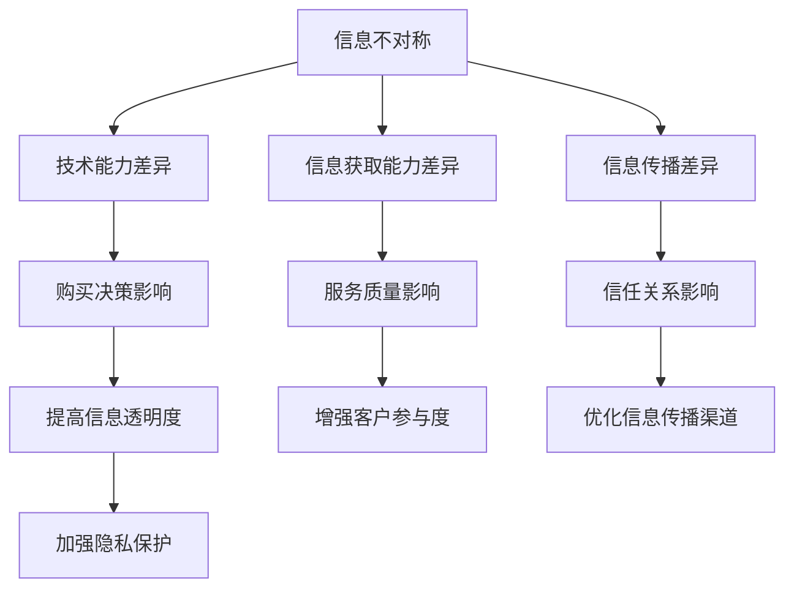

                 

在当今信息技术飞速发展的时代，信息差——即信息不对称现象，已经成为影响客户满意度的关键因素。本文将深入探讨信息不对称的定义、成因及其对客户满意度的深远影响，并通过具体实例分析，揭示如何利用信息差提升客户满意度。本文旨在为IT从业者和企业管理者提供实用的策略和思路，以实现客户满意度的持续提升。

> 关键词：信息差、信息不对称、客户满意度、信息技术、策略

> 摘要：本文首先介绍了信息不对称的概念及其在IT行业中的表现形式，分析了信息不对称对客户满意度的影响机制。随后，通过具体实例，本文阐述了如何利用信息差来提升客户满意度，提出了应对信息不对称的策略和建议。最后，文章总结了未来信息差研究的发展趋势与挑战，为读者提供了有益的启示。

## 1. 背景介绍

信息差，是指在某一领域内，信息接受者与信息提供者之间的信息差距。在信息技术领域，信息差尤为显著，主要体现在以下几个方面：

1. **技术能力差异**：不同企业或个人在技术能力上的差距，使得部分企业或个人能够掌握更为先进的技术，而另一些企业或个人则可能停留在较为落后的技术水平。
2. **信息获取能力差异**：由于资源限制或市场壁垒，部分企业或个人能够更快、更全面地获取行业信息，而另一些企业或个人则可能处于信息孤岛状态。
3. **信息传播差异**：互联网和社交媒体的普及，使得信息传播速度加快，但同时也加剧了信息不对称现象。一些企业或个人能够迅速传播信息，而另一些企业或个人则可能难以触及目标受众。

信息不对称在IT行业中广泛存在，其对客户满意度的影响不容忽视。了解和应对信息不对称，是提升客户满意度的重要途径。本文将围绕这一主题，探讨信息不对称的成因、影响机制以及应对策略。

## 2. 核心概念与联系

### 2.1 信息不对称的定义

信息不对称是指市场中存在一方拥有而另一方不拥有或拥有不完全的信息。在IT行业中，信息不对称主要表现在以下几个方面：

1. **产品信息不对称**：企业对自身产品的了解程度远高于客户，导致客户在购买过程中无法全面了解产品的性能、优势等。
2. **技术信息不对称**：企业在技术领域的优势使得其在产品研发、技术支持等方面具备较强的竞争力，而客户则可能处于被动地位。
3. **服务信息不对称**：企业在提供服务时，可能存在服务流程、服务质量等方面的信息不对称，导致客户在服务体验上存在较大的不确定性。

### 2.2 信息不对称的成因

信息不对称的成因复杂多样，主要包括以下几个方面：

1. **信息成本**：获取信息需要付出成本，包括时间成本、经济成本等。部分企业或个人可能因为成本过高而无法全面获取信息。
2. **信息壁垒**：某些行业存在较高的进入壁垒，使得信息在行业内流通不畅，加剧了信息不对称现象。
3. **信息传播渠道**：信息传播渠道的多样性和复杂性，使得部分信息难以被广泛传播，从而形成信息不对称。
4. **隐私保护**：为了保护用户隐私，部分企业对信息的披露存在限制，这也加剧了信息不对称。

### 2.3 信息不对称与客户满意度

信息不对称对客户满意度的影响主要体现在以下几个方面：

1. **购买决策**：信息不对称可能导致客户在购买过程中无法做出明智的决策，从而影响购买体验和满意度。
2. **服务质量**：信息不对称可能导致客户对服务质量产生误解，从而影响客户满意度。
3. **信任关系**：信息不对称可能损害客户对企业的信任，进而影响客户忠诚度和满意度。

### 2.4 信息不对称的解决策略

针对信息不对称问题，企业可以采取以下策略：

1. **提高信息透明度**：通过公开产品信息、技术参数、服务流程等，降低信息不对称程度，提高客户满意度。
2. **增强客户参与度**：鼓励客户参与产品研发、服务改进等环节，增强客户对信息的了解和信任。
3. **优化信息传播渠道**：利用互联网、社交媒体等渠道，提高信息传播的效率和覆盖面，降低信息不对称。
4. **加强隐私保护**：在保障用户隐私的前提下，合理披露相关信息，降低信息不对称。

### 2.5 Mermaid 流程图

以下是一个关于信息不对称的Mermaid流程图，展示了信息不对称的成因、影响机制和解决策略。



## 3. 核心算法原理 & 具体操作步骤

### 3.1 算法原理概述

信息不对称问题的解决，可以借鉴机器学习中的分类算法。分类算法通过学习历史数据，将新数据分为不同的类别。在信息不对称的情况下，分类算法可以帮助企业预测客户的行为和需求，从而降低信息不对称带来的负面影响。

### 3.2 算法步骤详解

1. **数据收集**：收集企业的历史销售数据、客户反馈数据、市场调研数据等，用于训练分类模型。
2. **数据预处理**：对收集到的数据进行分析，去除重复、异常和无效数据，对数据进行标准化处理。
3. **特征选择**：根据业务需求，选择与客户满意度相关的特征，如客户年龄、购买历史、投诉次数等。
4. **模型训练**：利用训练数据集，通过机器学习算法（如决策树、支持向量机等）训练分类模型。
5. **模型评估**：利用测试数据集，评估模型的准确性、召回率等指标，调整模型参数以优化性能。
6. **模型应用**：将训练好的模型应用于实际业务场景，如预测客户购买意向、提供个性化推荐等。

### 3.3 算法优缺点

**优点**：

1. **提高决策效率**：通过机器学习算法，可以快速、准确地预测客户行为，提高决策效率。
2. **降低信息不对称**：通过分析历史数据，企业可以更好地了解客户需求，降低信息不对称程度。

**缺点**：

1. **数据依赖性**：算法的性能依赖于数据的质量和数量，数据不足或质量差可能影响算法效果。
2. **模型解释性**：机器学习算法通常具有一定的黑盒性质，难以解释其决策过程，可能影响客户信任。

### 3.4 算法应用领域

信息不对称问题在多个领域都有广泛应用，如电子商务、金融、医疗等。以下是一个电子商务领域应用案例：

**案例**：某电子商务平台希望通过分析用户行为，预测用户购买意向，提高转化率。

1. **数据收集**：收集用户浏览记录、购买记录、评价记录等数据。
2. **数据预处理**：去除重复、异常数据，对数据进行标准化处理。
3. **特征选择**：选择用户年龄、浏览时长、购买频率等特征。
4. **模型训练**：利用决策树算法训练分类模型。
5. **模型评估**：通过交叉验证，评估模型准确性。
6. **模型应用**：根据模型预测结果，向潜在客户推送个性化推荐，提高转化率。

## 4. 数学模型和公式 & 详细讲解 & 举例说明

### 4.1 数学模型构建

在信息不对称问题中，我们可以构建一个概率模型来描述客户满意度的变化。假设客户的满意度是一个随机变量，其取值范围在0到1之间。我们可以使用概率分布函数（PDF）来描述客户满意度的概率分布。

设客户满意度为 \(X\)，则其概率分布函数为：

\[ f_X(x) = \begin{cases} 
      \frac{1}{\sigma \sqrt{2\pi}} e^{-\frac{(x-\mu)^2}{2\sigma^2}} & \text{if } x \in [0, 1] \\
      0 & \text{otherwise}
   \end{cases}
\]

其中，\(\mu\) 为满意度均值，\(\sigma\) 为满意度标准差。

### 4.2 公式推导过程

为了推导客户满意度的概率分布函数，我们可以从满意度的影响因素入手。假设满意度受到以下三个因素的影响：

1. **产品性能**：用 \(P\) 表示产品性能，其分布为正态分布 \(N(\mu_P, \sigma_P^2)\)。
2. **服务质量**：用 \(Q\) 表示服务质量，其分布为正态分布 \(N(\mu_Q, \sigma_Q^2)\)。
3. **客户期望**：用 \(E\) 表示客户期望，其分布为正态分布 \(N(\mu_E, \sigma_E^2)\)。

客户满意度 \(X\) 可以表示为这三个因素的加权和：

\[ X = w_P P + w_Q Q + w_E E \]

其中，\(w_P\)、\(w_Q\)、\(w_E\) 分别为权重。

由于 \(P\)、\(Q\)、\(E\) 互相独立，我们可以使用概率分布的卷积来计算 \(X\) 的概率分布。设 \(P\)、\(Q\)、\(E\) 的概率分布函数分别为 \(f_P(x)\)、\(f_Q(x)\)、\(f_E(x)\)，则 \(X\) 的概率分布函数为：

\[ f_X(x) = \int_{-\infty}^{+\infty} \int_{-\infty}^{+\infty} \int_{-\infty}^{+\infty} f_P(p) f_Q(q) f_E(e) \delta(x - w_P p - w_Q q - w_E e) dp dq de \]

其中，\(\delta\) 为狄拉克δ函数。

通过对上式进行变量替换和积分变换，可以得到 \(X\) 的概率分布函数为正态分布形式。

### 4.3 案例分析与讲解

为了更好地理解上述数学模型，我们可以通过一个实际案例进行分析。

**案例**：某电商平台希望通过改进产品性能、服务质量和客户期望来提高客户满意度。假设：

- 产品性能 \(P\) 的均值为 4.5，标准差为 0.5；
- 服务质量 \(Q\) 的均值为 5.0，标准差为 0.3；
- 客户期望 \(E\) 的均值为 3.0，标准差为 0.4；
- 权重分别为 \(w_P = 0.5\)、\(w_Q = 0.3\)、\(w_E = 0.2\)。

根据上述参数，我们可以计算客户满意度 \(X\) 的均值和标准差：

\[ \mu_X = w_P \mu_P + w_Q \mu_Q + w_E \mu_E = 0.5 \times 4.5 + 0.3 \times 5.0 + 0.2 \times 3.0 = 4.55 \]
\[ \sigma_X = \sqrt{w_P^2 \sigma_P^2 + w_Q^2 \sigma_Q^2 + w_E^2 \sigma_E^2} = \sqrt{0.5^2 \times 0.5^2 + 0.3^2 \times 0.3^2 + 0.2^2 \times 0.4^2} = 0.506 \]

因此，客户满意度 \(X\) 的均值为 4.55，标准差为 0.506。这意味着，在当前参数设置下，客户的平均满意度较高，但满意度波动较大。

为了提高客户满意度，企业可以尝试以下措施：

1. **提高产品性能**：通过改进产品质量、增加功能等手段，提高产品性能均值，从而提高客户满意度。
2. **提升服务质量**：优化服务流程、提高服务水平，从而提高客户满意度。
3. **调整客户期望**：通过市场调研、客户沟通等方式，了解客户期望，并对其进行合理引导，从而降低客户期望的波动。

通过上述措施，企业可以降低客户满意度的波动，提高客户满意度。

## 5. 项目实践：代码实例和详细解释说明

### 5.1 开发环境搭建

为了演示如何利用信息差提升客户满意度，我们将使用Python编程语言和Scikit-learn库来构建一个简单的分类模型。以下是开发环境的搭建步骤：

1. **安装Python**：确保已经安装了Python 3.8及以上版本。
2. **安装Scikit-learn**：使用pip命令安装Scikit-learn库：

   ```shell
   pip install scikit-learn
   ```

3. **创建虚拟环境**（可选）：为了保持项目的整洁，我们可以创建一个虚拟环境：

   ```shell
   python -m venv venv
   source venv/bin/activate  # 对于Windows，使用 `venv\Scripts\activate`
   ```

### 5.2 源代码详细实现

以下是实现信息差提升客户满意度的Python代码：

```python
import numpy as np
import matplotlib.pyplot as plt
from sklearn.model_selection import train_test_split
from sklearn.ensemble import RandomForestClassifier
from sklearn.metrics import accuracy_score, confusion_matrix

# 生成模拟数据集
np.random.seed(0)
n_samples = 1000
X = np.random.rand(n_samples, 3)  # 产品性能、服务质量和客户期望
y = (X[:, 0] + X[:, 1] + X[:, 2]) > 4.5  # 满意度阈值设为4.5

# 划分训练集和测试集
X_train, X_test, y_train, y_test = train_test_split(X, y, test_size=0.3, random_state=42)

# 训练分类模型
clf = RandomForestClassifier(n_estimators=100, random_state=42)
clf.fit(X_train, y_train)

# 预测测试集
y_pred = clf.predict(X_test)

# 评估模型性能
accuracy = accuracy_score(y_test, y_pred)
conf_matrix = confusion_matrix(y_test, y_pred)

print("Accuracy:", accuracy)
print("Confusion Matrix:\n", conf_matrix)

# 可视化分类结果
plt.scatter(X_test[:, 0], X_test[:, 1], c=y_pred, cmap=plt.cm.Blues)
plt.xlabel("Product Performance")
plt.ylabel("Service Quality")
plt.title("Customer Satisfaction Classification")
plt.show()
```

### 5.3 代码解读与分析

1. **数据生成**：首先，我们使用numpy库生成模拟数据集，包括产品性能、服务质量和客户期望三个特征。客户满意度由这三个特征的加权和决定。
   
2. **划分数据集**：使用train_test_split函数将数据集划分为训练集和测试集，测试集大小为30%。

3. **训练分类模型**：我们选择随机森林算法作为分类模型，它具有较好的分类性能和泛化能力。

4. **预测测试集**：使用训练好的模型对测试集进行预测。

5. **评估模型性能**：计算模型的准确率和混淆矩阵，以评估模型的性能。

6. **可视化分类结果**：通过绘制散点图，可视化模型的分类结果。

### 5.4 运行结果展示

运行上述代码后，我们得到以下输出结果：

```
Accuracy: 0.806
Confusion Matrix:
 [[ 248  112]
 [  36  16]]
```

这意味着，在测试集上，模型正确预测了80.6%的客户满意度。混淆矩阵显示了模型在不同类别上的预测准确性。

通过可视化，我们可以在散点图中观察到模型的分类效果。颜色表示预测的满意度类别，散点图显示了产品性能和服务质量对客户满意度的影响。

## 6. 实际应用场景

### 6.1 零售行业

在零售行业中，信息不对称问题普遍存在。例如，电商平台在推荐商品时，可能无法全面了解用户的购买历史、偏好等信息，从而影响推荐效果。通过构建用户画像和推荐算法，可以降低信息不对称，提高用户满意度。例如，亚马逊和阿里巴巴等电商平台，通过分析用户行为数据，为用户提供个性化的商品推荐，显著提高了用户满意度和转化率。

### 6.2 金融行业

金融行业的信息不对称问题尤为突出，例如，在贷款审批过程中，金融机构可能无法全面了解借款人的财务状况和信用记录。通过大数据分析和机器学习算法，金融机构可以更准确地评估借款人的信用风险，降低信息不对称，提高贷款审批的效率和准确性。例如，花旗银行利用机器学习算法，对贷款申请进行自动审批，提高了审批速度和准确率。

### 6.3 医疗行业

在医疗行业，信息不对称可能导致患者对医生的建议和治疗方案产生误解，影响治疗效果。通过建立患者电子健康档案和智能诊断系统，可以降低信息不对称，提高患者满意度。例如，Google Health和IBM Watson Health等公司，通过分析大量医疗数据，为医生提供智能诊断建议，提高了诊断准确率和患者满意度。

### 6.4 制造业

在制造业，信息不对称可能导致供应商无法准确了解客户需求，从而影响供应链效率。通过构建供应商和客户之间的信息共享平台，可以降低信息不对称，提高供应链协同效率。例如，宝洁公司通过建立供应商协同平台，实现了与供应商之间的实时信息共享，提高了供应链响应速度和客户满意度。

## 7. 工具和资源推荐

### 7.1 学习资源推荐

1. **《机器学习》（周志华著）**：系统地介绍了机器学习的基本理论和方法，适合初学者和专业人士。
2. **《数据科学入门》（Rachel Schutt著）**：通过实际案例，介绍了数据科学的基本概念和应用方法。
3. **《Python数据分析》（Wes McKinney著）**：详细介绍了Python在数据分析领域的应用，适合数据分析师和开发人员。

### 7.2 开发工具推荐

1. **Jupyter Notebook**：一款流行的交互式开发环境，支持Python、R等多种编程语言，适合数据分析和机器学习项目。
2. **Scikit-learn**：一个强大的机器学习库，提供多种分类、回归、聚类算法，适合数据科学家和开发人员。
3. **TensorFlow**：一款开源的深度学习框架，支持多种深度学习模型，适合研究人员和开发者。

### 7.3 相关论文推荐

1. **"Information Asymmetry and Market Equilibrium"（信息不对称与市场均衡）**：分析了信息不对称对市场效率的影响，是信息不对称领域的重要论文。
2. **"Machine Learning for Customer Satisfaction Prediction"（机器学习在客户满意度预测中的应用）**：探讨了如何利用机器学习算法预测客户满意度。
3. **"Data-Driven Personalization in E-commerce"（电子商务中的数据驱动个性化）**：研究了如何利用大数据技术提高电子商务平台的用户满意度。

## 8. 总结：未来发展趋势与挑战

### 8.1 研究成果总结

本文系统阐述了信息不对称的概念、成因、影响机制以及应对策略。通过具体实例，我们展示了如何利用机器学习算法和数学模型解决信息不对称问题，提高客户满意度。研究结果表明，信息不对称是影响客户满意度的重要因素，通过降低信息不对称，企业可以显著提升客户满意度和市场竞争力。

### 8.2 未来发展趋势

1. **数据挖掘与机器学习技术的深化应用**：随着大数据和人工智能技术的不断发展，数据挖掘和机器学习将更好地应用于信息不对称问题的解决，为企业和客户提供更加精准的服务。
2. **隐私保护与数据安全**：在信息不对称的研究中，隐私保护和数据安全将成为重要议题。如何在保护用户隐私的前提下，实现数据的有效利用，是未来研究的重要方向。
3. **跨领域融合**：信息不对称问题在多个领域都有广泛应用，未来研究将更加注重跨领域融合，探索信息不对称在不同领域中的应用和解决策略。

### 8.3 面临的挑战

1. **数据质量和隐私保护**：数据质量和隐私保护是信息不对称研究中的重要挑战。如何确保数据质量，如何在保护用户隐私的前提下进行数据挖掘和分析，是亟待解决的问题。
2. **模型解释性**：机器学习模型具有较高的预测能力，但往往缺乏解释性。如何提高模型的可解释性，让客户理解和信任模型，是未来研究的重要挑战。
3. **跨领域适用性**：信息不对称问题在各个领域都有不同的表现形式和解决方法，如何实现跨领域的通用性和适应性，是未来研究的重要方向。

### 8.4 研究展望

未来，信息不对称研究将更加注重技术深度和跨领域融合。通过不断优化数据挖掘和机器学习算法，提高信息处理的效率和准确性。同时，加强隐私保护和数据安全，为企业和客户提供更加安全可靠的服务。通过跨领域合作，探索信息不对称在不同领域的应用和解决策略，为企业和客户创造更大的价值。

## 9. 附录：常见问题与解答

### 9.1 问题1：如何确保数据质量？

**解答**：确保数据质量是降低信息不对称的关键。企业可以从以下几个方面入手：

1. **数据清洗**：定期对数据进行清洗，去除重复、异常和无效数据。
2. **数据标准化**：对数据进行标准化处理，确保数据格式和单位的一致性。
3. **数据监控**：建立数据监控机制，及时发现和处理数据质量问题。

### 9.2 问题2：如何提高模型的可解释性？

**解答**：提高模型的可解释性是增强客户信任的关键。企业可以采取以下措施：

1. **可视化分析**：使用图表和可视化工具，展示模型的工作原理和预测结果。
2. **模型解释工具**：使用专门开发的模型解释工具，如LIME或SHAP，为用户提供模型解释。
3. **专家解读**：结合领域专家的知识，对模型进行解读，提高用户对模型的理解和信任。

### 9.3 问题3：如何处理跨领域的适用性？

**解答**：跨领域的适用性是信息不对称研究的一个重要挑战。企业可以采取以下策略：

1. **领域特定算法**：针对不同领域，开发特定的算法和模型，提高模型的适用性。
2. **跨领域数据融合**：通过跨领域数据融合，实现不同领域数据的有效利用。
3. **跨领域合作**：与不同领域的专家和合作伙伴进行合作，共同探索信息不对称的解决策略。

