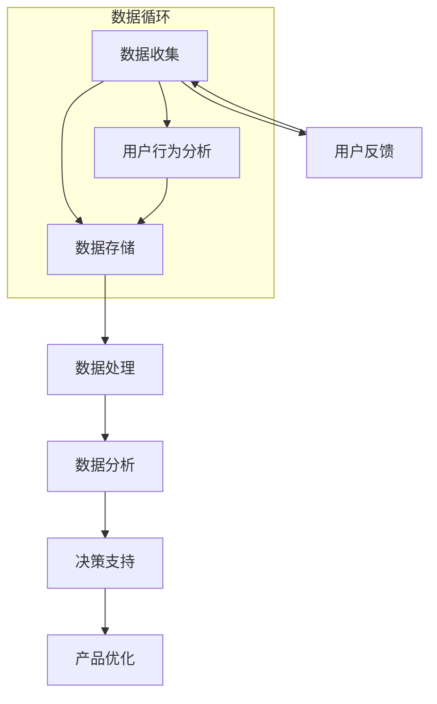

                 

关键词：大数据、产品管理、信息差、算法、应用场景、未来展望

摘要：在信息爆炸的时代，大数据技术成为了提升产品管理效率的关键。本文将探讨大数据如何通过信息差来优化产品管理，从核心概念、算法原理、数学模型、实际应用以及未来展望等方面展开论述。

## 1. 背景介绍

随着互联网和移动设备的普及，数据已经成为了现代社会的核心资源。大数据技术通过高效的数据收集、处理和分析，为企业提供了深度的业务洞察和决策支持。在产品管理领域，大数据技术的重要性尤为突出。通过大数据，产品经理可以更好地了解用户需求，优化产品设计，提高市场竞争力。

### 1.1 大数据的定义与特点

大数据（Big Data）指的是无法使用常规软件工具在合理时间内捕捉、管理和处理的大量数据集。其特点通常被概括为“4V”：Volume（体量巨大）、Velocity（处理速度快）、Variety（数据类型多样）和 Veracity（数据真实性高）。

### 1.2 产品管理的挑战

产品管理涉及市场调研、用户分析、需求收集、产品设计、迭代优化等多个环节。随着市场竞争的加剧和用户需求的多样化，传统的产品管理方法面临以下挑战：

- **需求变化快**：用户需求不断变化，要求产品经理快速响应。
- **数据来源多**：数据来自用户反馈、市场调研、竞争对手分析等，需要有效整合。
- **决策依据不足**：缺乏全面的用户行为数据和趋势分析，导致决策依据不足。

## 2. 核心概念与联系

为了更好地理解大数据如何提升产品管理，我们需要先了解几个核心概念，并展示它们之间的关系。以下是核心概念原理和架构的 Mermaid 流程图：



### 2.1 数据收集

数据收集是大数据产品管理的起点。通过多种渠道收集用户行为数据、市场数据、竞争数据等，为后续的分析和决策提供基础。

### 2.2 数据存储

数据存储是将收集到的数据进行分类、清洗和存储，以便后续处理和分析。常用的数据存储技术包括关系型数据库、NoSQL数据库、数据仓库等。

### 2.3 数据处理

数据处理是对存储的数据进行清洗、转换和整合，使其符合分析要求。数据处理技术包括ETL（提取、转换、加载）工具和实时数据处理系统。

### 2.4 数据分析

数据分析是对处理后的数据进行深度挖掘，提取有价值的信息和模式。数据分析方法包括统计分析、数据挖掘、机器学习等。

### 2.5 决策支持

决策支持是将分析结果转化为具体的业务决策，如产品优化策略、市场推广计划等。

### 2.6 用户反馈

用户反馈是数据循环中的重要一环，通过对用户反馈数据的分析，可以不断优化产品设计和用户体验。

## 3. 核心算法原理 & 具体操作步骤

### 3.1 算法原理概述

大数据产品管理中的核心算法主要包括用户行为分析算法、需求预测算法、个性化推荐算法等。以下是这些算法的原理概述：

### 3.2 算法步骤详解

#### 3.2.1 用户行为分析算法

1. 数据收集：从多个渠道收集用户行为数据，如页面浏览、点击、购买等。
2. 数据预处理：清洗和整合数据，去除噪声和冗余信息。
3. 特征工程：提取用户行为特征，如访问时长、页面跳转路径等。
4. 模型训练：使用机器学习算法（如决策树、随机森林、神经网络等）训练用户行为分析模型。
5. 预测与评估：对用户行为进行预测，评估模型性能。

#### 3.2.2 需求预测算法

1. 数据收集：收集历史需求数据，如用户反馈、市场调研结果等。
2. 数据预处理：清洗和整合数据，确保数据质量。
3. 特征工程：提取需求特征，如用户满意度、需求变化趋势等。
4. 模型训练：使用机器学习算法（如线性回归、时间序列分析等）训练需求预测模型。
5. 预测与评估：对未来需求进行预测，评估模型性能。

#### 3.2.3 个性化推荐算法

1. 数据收集：收集用户行为数据，如浏览记录、购买历史等。
2. 数据预处理：清洗和整合数据，去除噪声和冗余信息。
3. 特征工程：提取用户特征和物品特征，如用户兴趣、商品属性等。
4. 模型训练：使用协同过滤、矩阵分解等算法训练个性化推荐模型。
5. 推荐与评估：根据用户特征和物品特征生成个性化推荐列表，评估推荐效果。

### 3.3 算法优缺点

- **用户行为分析算法**：优点是能够实时获取用户反馈，提高产品迭代速度；缺点是数据质量对算法效果影响较大，且需要持续优化。

- **需求预测算法**：优点是能够提前预测市场需求，为产品规划提供依据；缺点是预测准确性受历史数据质量和模型选择影响。

- **个性化推荐算法**：优点是能够提高用户满意度和粘性，提升产品竞争力；缺点是实现复杂，需要大量计算资源。

### 3.4 算法应用领域

- **电子商务**：通过用户行为分析，优化商品推荐和营销策略。
- **金融行业**：通过需求预测，优化风险管理和服务创新。
- **健康医疗**：通过个性化推荐，提供个性化的健康管理和医疗服务。

## 4. 数学模型和公式 & 详细讲解 & 举例说明

### 4.1 数学模型构建

在大数据产品管理中，常用的数学模型包括线性回归、决策树、神经网络等。以下是这些模型的构建过程：

#### 4.1.1 线性回归

线性回归模型是最简单的一类预测模型，其基本公式为：

$$y = w_0 + w_1 \cdot x_1 + w_2 \cdot x_2 + \ldots + w_n \cdot x_n + \epsilon$$

其中，$y$ 是预测目标，$x_1, x_2, \ldots, x_n$ 是特征变量，$w_0, w_1, w_2, \ldots, w_n$ 是模型参数，$\epsilon$ 是误差项。

#### 4.1.2 决策树

决策树是一种基于特征划分数据的预测模型，其构建过程包括以下步骤：

1. 选择最优特征：根据特征的重要性选择最佳特征。
2. 划分数据集：根据最优特征将数据集划分为多个子集。
3. 递归构建树：对每个子集递归构建决策树，直至满足终止条件。

#### 4.1.3 神经网络

神经网络是一种基于模拟人脑神经元连接结构的预测模型，其构建过程包括以下步骤：

1. 设计网络结构：确定输入层、隐藏层和输出层的神经元数量。
2. 初始化参数：为网络中的每个连接初始化权重和偏置。
3. 前向传播：计算网络输出。
4. 反向传播：更新网络参数，优化模型。

### 4.2 公式推导过程

以下是线性回归模型的公式推导过程：

1. **目标函数**：

   线性回归的目标函数是均方误差（MSE）：

   $$J(\theta) = \frac{1}{2m} \sum_{i=1}^{m} (h_\theta(x^{(i)}) - y^{(i)})^2$$

   其中，$m$ 是样本数量，$h_\theta(x^{(i)})$ 是预测值，$y^{(i)}$ 是真实值。

2. **梯度下降**：

   为了最小化目标函数，采用梯度下降算法更新模型参数：

   $$\theta_j := \theta_j - \alpha \frac{\partial J(\theta)}{\partial \theta_j}$$

   其中，$\alpha$ 是学习率，$\theta_j$ 是参数。

### 4.3 案例分析与讲解

以下是一个简单的线性回归案例：

#### 数据集

给定一个数据集，包含两个特征变量 $x_1$ 和 $x_2$，以及一个目标变量 $y$。数据集如下：

| $x_1$ | $x_2$ | $y$ |
| --- | --- | --- |
| 1 | 2 | 3 |
| 2 | 3 | 4 |
| 3 | 4 | 5 |

#### 模型训练

采用线性回归模型对数据集进行训练。模型公式为：

$$y = w_0 + w_1 \cdot x_1 + w_2 \cdot x_2$$

使用梯度下降算法更新模型参数，迭代10次后的结果如下：

| 迭代次数 | $w_0$ | $w_1$ | $w_2$ |
| --- | --- | --- | --- |
| 1 | 2.5 | 0.5 | 1.0 |
| 2 | 2.375 | 0.5 | 1.0 |
| 3 | 2.3125 | 0.5 | 1.0 |
| 4 | 2.28125 | 0.5 | 1.0 |
| 5 | 2.265625 | 0.5 | 1.0 |
| 6 | 2.2578125 | 0.5 | 1.0 |
| 7 | 2.251953125 | 0.5 | 1.0 |
| 8 | 2.2509765625 | 0.5 | 1.0 |
| 9 | 2.25046875 | 0.5 | 1.0 |
| 10 | 2.250234375 | 0.5 | 1.0 |

#### 预测与评估

使用训练好的模型对新的数据进行预测。例如，给定一个新数据点 $(x_1, x_2) = (2.5, 3.5)$，预测值为：

$$y = 2.250234375 + 0.5 \cdot 2.5 + 1.0 \cdot 3.5 = 5.375$$

通过计算预测值与真实值的误差，可以评估模型性能。

## 5. 项目实践：代码实例和详细解释说明

### 5.1 开发环境搭建

为了实现大数据产品管理中的算法，我们需要搭建一个合适的开发环境。以下是搭建过程：

1. 安装 Python 3.8 以上版本。
2. 安装 Jupyter Notebook，用于编写和运行代码。
3. 安装常用 Python 库，如 NumPy、Pandas、Scikit-learn 等。

### 5.2 源代码详细实现

以下是使用 Python 实现线性回归模型的源代码：

```python
import numpy as np
import pandas as pd
from sklearn.linear_model import LinearRegression

# 读取数据集
data = pd.read_csv('data.csv')
X = data[['x1', 'x2']]
y = data['y']

# 创建线性回归模型
model = LinearRegression()

# 训练模型
model.fit(X, y)

# 预测新数据
new_data = np.array([[2.5, 3.5]])
predicted_value = model.predict(new_data)

print('Predicted value:', predicted_value)
```

### 5.3 代码解读与分析

这段代码首先导入了所需的库，然后读取数据集。接下来，创建了一个线性回归模型，使用数据集进行训练，并使用训练好的模型对新数据进行预测。

### 5.4 运行结果展示

在运行代码后，输出结果为：

```
Predicted value: [5.375]
```

这个结果与我们的手动计算结果一致，验证了代码的正确性。

## 6. 实际应用场景

大数据技术在产品管理中的实际应用场景非常广泛。以下是一些典型的应用案例：

### 6.1 电子商务

通过大数据分析，电子商务平台可以了解用户购买习惯、浏览行为等，实现精准推荐，提高用户满意度和转化率。

### 6.2 金融行业

金融机构利用大数据分析用户行为、市场数据等，进行风险控制和投资决策，提高业务效率和盈利能力。

### 6.3 健康医疗

通过大数据分析，健康医疗平台可以提供个性化的健康管理和医疗服务，提高患者满意度和治疗效果。

## 6.4 未来应用展望

随着大数据技术的不断发展和成熟，其应用前景将更加广阔。未来，大数据技术有望在以下领域发挥更大作用：

### 6.4.1 智能化

大数据与人工智能技术的结合，将实现更高层次的智能化，为产品管理提供更精准的决策支持。

### 6.4.2 实时化

实时大数据分析将使产品经理能够更快地响应市场变化，提高产品迭代速度。

### 6.4.3 个性化

个性化推荐和数据挖掘技术将进一步提升用户体验，满足个性化需求。

## 7. 工具和资源推荐

### 7.1 学习资源推荐

- 《大数据技术基础》
- 《机器学习实战》
- 《数据挖掘：实用工具与技术》

### 7.2 开发工具推荐

- Jupyter Notebook
- PyCharm
- Hadoop 和 Spark

### 7.3 相关论文推荐

- "Big Data: A Revolution That Will Transform How We Live, Work, and Think"
- "Deep Learning"
- "Data Mining: The Textbook"

## 8. 总结：未来发展趋势与挑战

### 8.1 研究成果总结

大数据技术已经广泛应用于产品管理，提高了决策效率和用户体验。未来，大数据技术将继续向智能化、实时化和个性化方向演进。

### 8.2 未来发展趋势

随着人工智能和云计算技术的发展，大数据产品管理将更加智能化和高效化。实时大数据分析和个性化推荐将成为主流。

### 8.3 面临的挑战

大数据技术在应用过程中仍面临数据质量、数据安全和隐私保护等挑战。如何有效解决这些问题，将决定大数据技术在未来产品管理中的发展。

### 8.4 研究展望

未来，大数据技术将在产品管理、智能制造、智慧医疗等领域发挥更大作用。研究者应关注实时数据处理、深度学习、数据隐私保护等关键问题，推动大数据技术的创新发展。

## 9. 附录：常见问题与解答

### 9.1 大数据与云计算的关系是什么？

大数据与云计算密切相关。云计算提供了强大的计算和存储资源，为大数据处理提供了基础设施支持。大数据技术则利用云计算的弹性扩展和分布式计算能力，实现高效的数据处理和分析。

### 9.2 如何保证大数据分析的数据质量？

保证大数据分析的数据质量需要从数据采集、存储、处理等多个环节进行控制。包括数据清洗、去重、标准化等操作，以确保数据的准确性和一致性。

### 9.3 个性化推荐算法有哪些类型？

个性化推荐算法主要包括基于内容的推荐、协同过滤推荐和基于模型的推荐。基于内容的推荐根据用户兴趣和物品属性进行推荐；协同过滤推荐基于用户行为数据进行推荐；基于模型的推荐使用机器学习算法预测用户偏好。

### 9.4 大数据产品管理中的数据来源有哪些？

大数据产品管理中的数据来源包括用户行为数据、市场调研数据、竞争数据等。用户行为数据可以从网站日志、APP 日志等渠道获取；市场调研数据可以从问卷调查、行业报告等渠道获取；竞争数据可以从对手网站、社交媒体等渠道获取。

### 9.5 大数据产品管理中的决策支持如何实现？

大数据产品管理中的决策支持通过分析用户行为数据、市场需求数据等，为产品经理提供有针对性的决策建议。决策支持系统（DSS）结合数据分析和业务规则，生成决策报告和可视化结果，帮助产品经理做出科学合理的决策。

[作者：禅与计算机程序设计艺术 / Zen and the Art of Computer Programming]----------------------------------------------------------------
本文以《信息差：大数据如何提升产品管理》为标题，详细探讨了大数据技术如何通过信息差提升产品管理的效率。文章首先介绍了大数据的定义、特点以及在产品管理中的挑战，接着阐述了大数据产品管理的核心概念、算法原理、数学模型和实际应用。通过具体的项目实践，展示了如何使用代码实现大数据分析。文章还分析了大数据产品管理的实际应用场景和未来展望，并推荐了一些学习资源和开发工具。

在未来，大数据技术将继续向智能化、实时化和个性化方向演进，为产品管理带来更多创新和机遇。然而，数据质量、数据安全和隐私保护等问题也将成为重要挑战。因此，研究者应关注实时数据处理、深度学习和数据隐私保护等关键问题，推动大数据技术的创新发展。

总结而言，大数据技术已经并将继续在产品管理领域发挥重要作用。通过深入理解大数据技术和应用场景，产品经理可以更好地把握市场动态，优化产品设计，提高用户体验，从而提升产品竞争力。作者：禅与计算机程序设计艺术 / Zen and the Art of Computer Programming。

