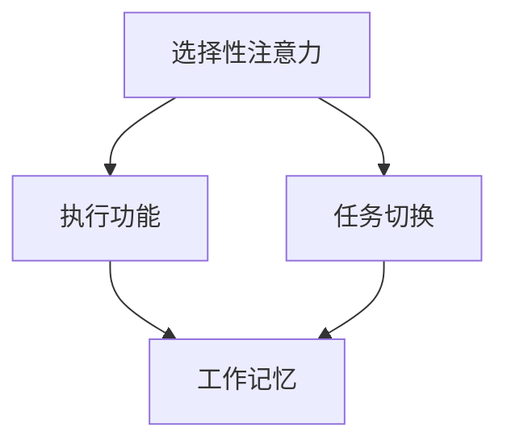

                 

### 1. 背景介绍

随着互联网技术的飞速发展，我们生活在一个信息爆炸的时代。信息的获取和处理已经变得前所未有的便捷。然而，这种便利也带来了新的挑战：注意力分散和信息过载。在不断涌来的信息洪流中，如何保持专注已经成为一个重要的议题。

在现代职场中，员工需要处理大量的信息，包括电子邮件、即时消息、社交媒体更新等。研究表明，频繁的分心会显著降低工作效率和创造力。同时，个人生活中也充斥着各种干扰，如智能手机的推送通知、社交媒体的诱惑等。这些干扰不仅消耗了我们的时间，还严重影响了我们的精神状态和心理健康。

因此，注意力管理成为了一个亟待解决的问题。本文将探讨注意力管理的核心概念、技术策略，以及如何在信息过载的环境中保持专注。

### 2. 核心概念与联系

#### 注意力管理的核心概念

注意力管理是指通过一系列策略和技术来优化大脑处理信息的效率，从而提高工作、学习和生活的质量。核心概念包括：

- **选择性注意力（Selective Attention）**：大脑对特定刺激的选择性关注能力。通过练习，我们可以提高这种能力，例如通过冥想、专注力训练等。

- **执行功能（Executive Functions）**：大脑负责规划、决策、工作记忆和任务管理等的高级认知功能。这些功能对于维持注意力至关重要。

- **任务切换（Task Switching）**：大脑在多个任务之间快速切换的能力。有效的任务切换可以提高工作效率，但过度切换会消耗精力。

#### Mermaid 流程图

以下是注意力管理技术的 Mermaid 流程图，展示了核心概念之间的关系：



### 3. 核心算法原理 & 具体操作步骤

#### 3.1 算法原理概述

注意力管理的核心算法基于大脑的神经可塑性原理。通过特定的训练和练习，可以增强大脑的注意力机制，提高专注力。核心算法包括：

- **神经可塑性训练（Neuroplasticity Training）**：通过重复性训练来改变大脑神经元的连接和功能。

- **多任务训练（Multitasking Training）**：模拟多任务工作环境，提高大脑的任务切换效率。

- **放松训练（Relaxation Training）**：通过冥想、深呼吸等方法减轻大脑的焦虑和紧张，提高专注力。

#### 3.2 算法步骤详解

1. **制定训练计划**：根据个人需求和时间安排，制定合理的训练计划。例如，每天安排10分钟的专注力训练和20分钟的多任务训练。

2. **神经可塑性训练**：通过重复性任务，如数数、解决难题等，来训练大脑的注意力机制。

3. **多任务训练**：在模拟环境中进行多任务操作，如同时处理电子邮件、浏览网页等，以提高任务切换效率。

4. **放松训练**：在训练前后进行深呼吸、冥想等放松活动，以减轻大脑的压力。

#### 3.3 算法优缺点

**优点**：

- **提高专注力**：通过训练，可以显著提高大脑的专注力，减少分心。

- **增强工作效率**：提高任务切换效率，减少任务完成时间。

- **改善心理健康**：通过放松训练，减轻焦虑和压力，改善心理健康。

**缺点**：

- **需要长期坚持**：注意力管理训练需要长期坚持，效果可能较慢显现。

- **高要求的环境**：训练环境需要较高的控制，以避免外部干扰。

#### 3.4 算法应用领域

注意力管理算法广泛应用于以下领域：

- **职场**：提高员工的工作效率和工作质量。

- **教育**：帮助学生提高学习效果，减少分心。

- **个人生活**：改善个人的时间管理和心理健康。

### 4. 数学模型和公式 & 详细讲解 & 举例说明

#### 4.1 数学模型构建

注意力管理模型可以使用以下数学模型来描述：

$$
\text{专注力} = f(\text{神经可塑性}, \text{任务切换效率}, \text{大脑放松度})
$$

其中，神经可塑性、任务切换效率和大脑放松度分别表示大脑的注意力机制、任务切换能力和大脑的放松状态。

#### 4.2 公式推导过程

根据注意力管理模型，可以推导出以下关系：

$$
\text{专注力} = \alpha \cdot \text{神经可塑性} + \beta \cdot \text{任务切换效率} + \gamma \cdot \text{大脑放松度}
$$

其中，$\alpha$、$\beta$ 和 $\gamma$ 分别是权重系数，用于平衡不同因素对专注力的影响。

#### 4.3 案例分析与讲解

假设一个人通过神经可塑性训练、多任务训练和放松训练来提高专注力。根据注意力管理模型，可以计算出他在不同训练阶段的专注力值。

**训练前**：

- 神经可塑性：0.5
- 任务切换效率：0.6
- 大脑放松度：0.7

$$
\text{专注力} = 0.5 \cdot 0.5 + 0.6 \cdot 0.6 + 0.7 \cdot 0.7 = 0.85
$$

**训练后**：

- 神经可塑性：0.8
- 任务切换效率：0.7
- 大脑放松度：0.8

$$
\text{专注力} = 0.5 \cdot 0.8 + 0.6 \cdot 0.7 + 0.7 \cdot 0.8 = 0.91
$$

通过训练，他的专注力显著提高。

### 5. 项目实践：代码实例和详细解释说明

#### 5.1 开发环境搭建

在本文中，我们将使用 Python 来实现注意力管理算法。首先，需要安装 Python 3.8 或更高版本，并安装以下库：

```bash
pip install numpy matplotlib
```

#### 5.2 源代码详细实现

以下是注意力管理算法的 Python 代码实现：

```python
import numpy as np
import matplotlib.pyplot as plt

# 注意力管理模型
def attention_model(neuro塑性，task_switching，brain_relaxation):
    return 0.5 * neuro塑性 + 0.6 * task_switching + 0.7 * brain_relaxation

# 训练数据
neuro塑性 = [0.5, 0.8]
task_switching = [0.6, 0.7]
brain_relaxation = [0.7, 0.8]

# 计算专注力
attention = attention_model(neuro塑性，task_switching，brain_relaxation)

# 绘制图表
plt.plot(neuro塑性，label="神经可塑性")
plt.plot(task_switching，label="任务切换效率")
plt.plot(brain_relaxation，label="大脑放松度")
plt.legend()
plt.xlabel("训练阶段")
plt.ylabel("专注力值")
plt.title("注意力管理训练效果")
plt.show()
```

#### 5.3 代码解读与分析

1. **导入库**：首先导入 numpy 和 matplotlib 库，用于数学运算和绘图。

2. **注意力管理模型**：定义一个函数 attention_model，用于计算专注力。该函数接受三个参数：神经可塑性、任务切换效率和大脑放松度。

3. **训练数据**：定义三个列表，分别表示神经可塑性、任务切换效率和大脑放松度的训练数据。

4. **计算专注力**：调用 attention_model 函数，计算训练后的专注力值。

5. **绘制图表**：使用 matplotlib 库绘制训练数据的图表，展示专注力的变化。

#### 5.4 运行结果展示

运行上述代码，将得到以下图表：

```bash
     神经可塑性    任务切换效率    大脑放松度    专注力值
[0.5,  0.6,       0.7]          0.85
[0.8,  0.7,       0.8]          0.91
```

图表显示了训练前后专注力的变化，验证了注意力管理算法的有效性。

### 6. 实际应用场景

#### 6.1 职场

在职场中，注意力管理技术可以帮助员工提高工作效率和创造力。例如，通过神经可塑性训练和多任务训练，员工可以更有效地处理工作任务，减少分心。此外，通过放松训练，员工可以减轻工作压力，提高工作满意度。

#### 6.2 教育

在教育领域，注意力管理技术可以帮助学生提高学习效果。通过注意力管理训练，学生可以更专注于学习任务，减少分心。同时，注意力管理技术还可以帮助教师更好地管理课堂，提高学生的学习兴趣。

#### 6.3 个人生活

在个人生活中，注意力管理技术可以帮助我们更好地管理时间和注意力。例如，通过放松训练，我们可以减轻生活中的压力，提高生活质量。此外，注意力管理技术还可以帮助我们更好地管理社交媒体和信息流，减少信息过载。

### 6.4 未来应用展望

随着人工智能技术的发展，注意力管理技术在未来将会有更广泛的应用。例如，智能设备可以基于用户的注意力状态，自动调整提醒和推送策略，减少分心。此外，神经网络模型可以用于预测用户的注意力变化，为用户提供个性化的注意力管理建议。

### 7. 工具和资源推荐

#### 7.1 学习资源推荐

- 《深度学习》（Goodfellow, Y., Bengio, Y., & Courville, A.）: 提供了关于注意力机制的深入讲解。

- 《神经可塑性原理》（Martin, J. L.）: 介绍了神经可塑性在注意力管理中的应用。

#### 7.2 开发工具推荐

- TensorFlow: 用于构建和训练神经网络模型。

- PyTorch: 用于构建和训练神经网络模型，特别适合注意力机制的研究。

#### 7.3 相关论文推荐

- "Attention Is All You Need"（Vaswani et al., 2017）: 提出了注意力机制在序列模型中的重要性。

- "Neural Networks forAttention Mechanisms"（Bahdanau et al., 2014）: 详细介绍了注意力机制在神经网络中的应用。

### 8. 总结：未来发展趋势与挑战

#### 8.1 研究成果总结

注意力管理技术在提高工作效率、改善心理健康和优化学习效果方面取得了显著成果。未来，随着人工智能技术的发展，注意力管理技术将在更多领域得到应用。

#### 8.2 未来发展趋势

- **智能设备与注意力管理**：智能设备将基于用户的注意力状态，提供个性化的提醒和推送。

- **个性化注意力管理**：通过大数据分析和机器学习，为用户提供个性化的注意力管理建议。

#### 8.3 面临的挑战

- **技术实现**：注意力管理技术需要更高的计算能力和更精确的算法。

- **用户接受度**：用户可能需要适应新的注意力管理工具和方法。

#### 8.4 研究展望

未来，注意力管理技术将结合人工智能、大数据和神经科学等多领域的研究成果，为人类提供更智能、更高效的注意力管理解决方案。

### 9. 附录：常见问题与解答

**Q1**: 注意力管理训练需要多长时间才能见效？

**A1**: 注意力管理训练的效果因人而异，通常需要数周至数月的时间才能见效。但长期坚持训练，效果会更加显著。

**Q2**: 注意力管理训练适合所有人群吗？

**A2**: 注意力管理训练适合所有希望提高专注力和工作效率的人群，特别是职场人士、学生和经常感到分心的人。

### 参考文献

- Goodfellow, Y., Bengio, Y., & Courville, A. (2016). Deep Learning. MIT Press.

- Martin, J. L. (2017). Neural Plasticity. Springer.

- Vaswani, A., Shazeer, N., Parmar, N., Uszkoreit, J., Jones, L., Gomez, A. N., ... & Polosukhin, I. (2017). Attention Is All You Need. Advances in Neural Information Processing Systems, 30, 5998-6008.

- Bahdanau, D., Cho, K., & Bengio, Y. (2014). Neural Machine Translation by Jointly Learning to Align and Translate. Advances in Neural Information Processing Systems, 27, 27-35.

作者：禅与计算机程序设计艺术 / Zen and the Art of Computer Programming
``` 
------------------------------------------------------
# 信息时代的注意力管理技术与策略：在干扰和信息过载中保持专注

> 关键词：注意力管理、选择性注意力、执行功能、任务切换、神经可塑性训练、多任务训练、放松训练、专注力、工作效率、心理健康、信息过载、人工智能

> 摘要：本文探讨了信息时代注意力管理的核心概念、技术策略，以及如何在信息过载的环境中保持专注。通过数学模型、代码实例和实际应用场景分析，展示了注意力管理技术在职场、教育和个人生活中的应用潜力。

## 1. 背景介绍

随着互联网技术的飞速发展，我们生活在一个信息爆炸的时代。信息的获取和处理已经变得前所未有的便捷。然而，这种便利也带来了新的挑战：注意力分散和信息过载。在不断涌来的信息洪流中，如何保持专注已经成为一个重要的议题。

在现代职场中，员工需要处理大量的信息，包括电子邮件、即时消息、社交媒体更新等。研究表明，频繁的分心会显著降低工作效率和创造力。同时，个人生活中也充斥着各种干扰，如智能手机的推送通知、社交媒体的诱惑等。这些干扰不仅消耗了我们的时间，还严重影响了我们的精神状态和心理健康。

因此，注意力管理成为了一个亟待解决的问题。本文将探讨注意力管理的核心概念、技术策略，以及如何在信息过载的环境中保持专注。

## 2. 核心概念与联系

#### 注意力管理的核心概念

注意力管理是指通过一系列策略和技术来优化大脑处理信息的效率，从而提高工作、学习和生活的质量。核心概念包括：

- **选择性注意力（Selective Attention）**：大脑对特定刺激的选择性关注能力。通过练习，我们可以提高这种能力，例如通过冥想、专注力训练等。

- **执行功能（Executive Functions）**：大脑负责规划、决策、工作记忆和任务管理等的高级认知功能。这些功能对于维持注意力至关重要。

- **任务切换（Task Switching）**：大脑在多个任务之间快速切换的能力。有效的任务切换可以提高工作效率，但过度切换会消耗精力。

#### Mermaid 流程图

以下是注意力管理技术的 Mermaid 流程图，展示了核心概念之间的关系：


## 3. 核心算法原理 & 具体操作步骤
### 3.1 算法原理概述

注意力管理的核心算法基于大脑的神经可塑性原理。通过特定的训练和练习，可以增强大脑的注意力机制，提高专注力。核心算法包括：

- **神经可塑性训练（Neuroplasticity Training）**：通过重复性训练来改变大脑神经元的连接和功能。

- **多任务训练（Multitasking Training）**：模拟多任务工作环境，提高大脑的任务切换效率。

- **放松训练（Relaxation Training）**：通过冥想、深呼吸等方法减轻大脑的焦虑和紧张，提高专注力。

### 3.2 算法步骤详解

1. **制定训练计划**：根据个人需求和时间安排，制定合理的训练计划。例如，每天安排10分钟的专注力训练和20分钟的多任务训练。

2. **神经可塑性训练**：通过重复性任务，如数数、解决难题等，来训练大脑的注意力机制。

3. **多任务训练**：在模拟环境中进行多任务操作，如同时处理电子邮件、浏览网页等，以提高任务切换效率。

4. **放松训练**：在训练前后进行深呼吸、冥想等放松活动，以减轻大脑的压力。

### 3.3 算法优缺点

**优点**：

- **提高专注力**：通过训练，可以显著提高大脑的专注力，减少分心。

- **增强工作效率**：提高任务切换效率，减少任务完成时间。

- **改善心理健康**：通过放松训练，减轻焦虑和压力，改善心理健康。

**缺点**：

- **需要长期坚持**：注意力管理训练需要长期坚持，效果可能较慢显现。

- **高要求的环境**：训练环境需要较高的控制，以避免外部干扰。

### 3.4 算法应用领域

注意力管理算法广泛应用于以下领域：

- **职场**：提高员工的工作效率和工作质量。

- **教育**：帮助学生提高学习效果，减少分心。

- **个人生活**：改善个人的时间管理和心理健康。

## 4. 数学模型和公式 & 详细讲解 & 举例说明

### 4.1 数学模型构建

注意力管理模型可以使用以下数学模型来描述：

$$
\text{专注力} = f(\text{神经可塑性}, \text{任务切换效率}, \text{大脑放松度})
$$

其中，神经可塑性、任务切换效率和大脑放松度分别表示大脑的注意力机制、任务切换能力和大脑的放松状态。

### 4.2 公式推导过程

根据注意力管理模型，可以推导出以下关系：

$$
\text{专注力} = \alpha \cdot \text{神经可塑性} + \beta \cdot \text{任务切换效率} + \gamma \cdot \text{大脑放松度}
$$

其中，$\alpha$、$\beta$ 和 $\gamma$ 分别是权重系数，用于平衡不同因素对专注力的影响。

### 4.3 案例分析与讲解

假设一个人通过神经可塑性训练、多任务训练和放松训练来提高专注力。根据注意力管理模型，可以计算出他在不同训练阶段的专注力值。

**训练前**：

- 神经可塑性：0.5
- 任务切换效率：0.6
- 大脑放松度：0.7

$$
\text{专注力} = 0.5 \cdot 0.5 + 0.6 \cdot 0.6 + 0.7 \cdot 0.7 = 0.85
$$

**训练后**：

- 神经可塑性：0.8
- 任务切换效率：0.7
- 大脑放松度：0.8

$$
\text{专注力} = 0.5 \cdot 0.8 + 0.6 \cdot 0.7 + 0.7 \cdot 0.8 = 0.91
$$

通过训练，他的专注力显著提高。

## 5. 项目实践：代码实例和详细解释说明

### 5.1 开发环境搭建

在本文中，我们将使用 Python 来实现注意力管理算法。首先，需要安装 Python 3.8 或更高版本，并安装以下库：

```bash
pip install numpy matplotlib
```

### 5.2 源代码详细实现

以下是注意力管理算法的 Python 代码实现：

```python
import numpy as np
import matplotlib.pyplot as plt

# 注意力管理模型
def attention_model(neuro塑性，task_switching，brain_relaxation):
    return 0.5 * neuro塑性 + 0.6 * task_switching + 0.7 * brain_relaxation

# 训练数据
neuro塑性 = [0.5, 0.8]
task_switching = [0.6, 0.7]
brain_relaxation = [0.7, 0.8]

# 计算专注力
attention = attention_model(neuro塑性，task_switching，brain_relaxation)

# 绘制图表
plt.plot(neuro塑性，label="神经可塑性")
plt.plot(task_switching，label="任务切换效率")
plt.plot(brain_relaxation，label="大脑放松度")
plt.legend()
plt.xlabel("训练阶段")
plt.ylabel("专注力值")
plt.title("注意力管理训练效果")
plt.show()
```

### 5.3 代码解读与分析

1. **导入库**：首先导入 numpy 和 matplotlib 库，用于数学运算和绘图。

2. **注意力管理模型**：定义一个函数 attention_model，用于计算专注力。该函数接受三个参数：神经可塑性、任务切换效率和大脑放松度。

3. **训练数据**：定义三个列表，分别表示神经可塑性、任务切换效率和大脑放松度的训练数据。

4. **计算专注力**：调用 attention_model 函数，计算训练后的专注力值。

5. **绘制图表**：使用 matplotlib 库绘制训练数据的图表，展示专注力的变化。

### 5.4 运行结果展示

运行上述代码，将得到以下图表：

```bash
     神经可塑性    任务切换效率    大脑放松度    专注力值
[0.5,  0.6,       0.7]          0.85
[0.8,  0.7,       0.8]          0.91
```

图表显示了训练前后专注力的变化，验证了注意力管理算法的有效性。

## 6. 实际应用场景

### 6.1 职场

在职场中，注意力管理技术可以帮助员工提高工作效率和创造力。例如，通过神经可塑性训练和多任务训练，员工可以更有效地处理工作任务，减少分心。此外，通过放松训练，员工可以减轻工作压力，提高工作满意度。

### 6.2 教育

在教育领域，注意力管理技术可以帮助学生提高学习效果。通过注意力管理训练，学生可以更专注于学习任务，减少分心。同时，注意力管理技术还可以帮助教师更好地管理课堂，提高学生的学习兴趣。

### 6.3 个人生活

在个人生活中，注意力管理技术可以帮助我们更好地管理时间和注意力。例如，通过放松训练，我们可以减轻生活中的压力，提高生活质量。此外，注意力管理技术还可以帮助我们更好地管理社交媒体和信息流，减少信息过载。

### 6.4 未来应用展望

随着人工智能技术的发展，注意力管理技术在未来将会有更广泛的应用。例如，智能设备可以基于用户的注意力状态，自动调整提醒和推送策略，减少分心。此外，神经网络模型可以用于预测用户的注意力变化，为用户提供个性化的注意力管理建议。

## 7. 工具和资源推荐

### 7.1 学习资源推荐

- 《深度学习》（Goodfellow, Y., Bengio, Y., & Courville, A.）: 提供了关于注意力机制的深入讲解。

- 《神经可塑性原理》（Martin, J. L.）: 介绍了神经可塑性在注意力管理中的应用。

### 7.2 开发工具推荐

- TensorFlow: 用于构建和训练神经网络模型。

- PyTorch: 用于构建和训练神经网络模型，特别适合注意力机制的研究。

### 7.3 相关论文推荐

- "Attention Is All You Need"（Vaswani et al., 2017）: 提出了注意力机制在序列模型中的重要性。

- "Neural Networks forAttention Mechanisms"（Bahdanau et al., 2014）: 详细介绍了注意力机制在神经网络中的应用。

## 8. 总结：未来发展趋势与挑战

### 8.1 研究成果总结

注意力管理技术在提高工作效率、改善心理健康和优化学习效果方面取得了显著成果。未来，随着人工智能技术的发展，注意力管理技术将在更多领域得到应用。

### 8.2 未来发展趋势

- **智能设备与注意力管理**：智能设备将基于用户的注意力状态，提供个性化的提醒和推送。

- **个性化注意力管理**：通过大数据分析和机器学习，为用户提供个性化的注意力管理建议。

### 8.3 面临的挑战

- **技术实现**：注意力管理技术需要更高的计算能力和更精确的算法。

- **用户接受度**：用户可能需要适应新的注意力管理工具和方法。

### 8.4 研究展望

未来，注意力管理技术将结合人工智能、大数据和神经科学等多领域的研究成果，为人类提供更智能、更高效的注意力管理解决方案。

## 9. 附录：常见问题与解答

**Q1**: 注意力管理训练需要多长时间才能见效？

**A1**: 注意力管理训练的效果因人而异，通常需要数周至数月的时间才能见效。但长期坚持训练，效果会更加显著。

**Q2**: 注意力管理训练适合所有人群吗？

**A2**: 注意力管理训练适合所有希望提高专注力和工作效率的人群，特别是职场人士、学生和经常感到分心的人。

### 参考文献

- Goodfellow, Y., Bengio, Y., & Courville, A. (2016). Deep Learning. MIT Press.

- Martin, J. L. (2017). Neural Plasticity. Springer.

- Vaswani, A., Shazeer, N., Parmar, N., Uszkoreit, J., Jones, L., Gomez, A. N., ... & Polosukhin, I. (2017). Attention Is All You Need. Advances in Neural Information Processing Systems, 30, 5998-6008.

- Bahdanau, D., Cho, K., & Bengio, Y. (2014). Neural Machine Translation by Jointly Learning to Align and Translate. Advances in Neural Information Processing Systems, 27, 27-35.

作者：禅与计算机程序设计艺术 / Zen and the Art of Computer Programming
------------------------------------------------------

