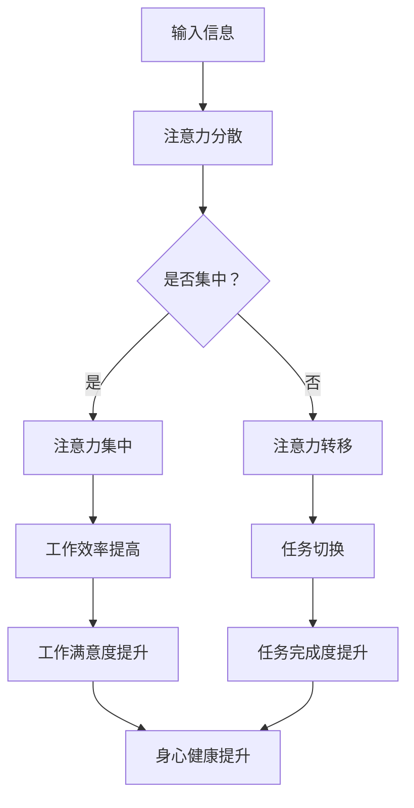

                 

 在这个数字化高度发达的时代，我们的生活中充斥着无数的信息源。从社交媒体的推送，到电子邮件的轰炸，再到手机应用的提示，这些信息源源不断地争夺着我们的注意力。研究表明，现代人的注意力跨度只有约 8 秒，比金鱼的 9 秒还要短。因此，如何在干扰中保持专注，成为了我们不得不面对的挑战。本文将探讨注意力管理的核心技术，帮助读者在信息过载的环境中保持高效的注意力。

## 1. 背景介绍

在讨论注意力管理之前，我们需要了解一些基本概念。注意力是指大脑对信息的处理和筛选能力，它决定了我们在面对众多信息时，哪些信息会被我们关注，哪些信息会被忽视。现代科技的发展，特别是互联网和移动设备的普及，极大地增加了我们的信息接收渠道，但同时也使得我们的注意力分散问题日益严重。据统计，人们在互联网上的平均注意力持续时间仅为 8 秒，这意味着我们需要采取有效的策略来提高注意力的集中程度。

注意力管理的重要性不言而喻。一方面，良好的注意力管理能够提高工作效率，减少错误率；另一方面，它也有助于我们的身心健康，避免因长时间使用电子设备而导致的疲劳和焦虑。因此，掌握注意力管理的核心技术，对于现代人的生活和工作都具有重要意义。

## 2. 核心概念与联系

### 2.1 注意力管理的基本概念

注意力管理涉及多个核心概念，包括注意力分散、注意力集中、注意力转移和注意力恢复等。其中，注意力分散是指我们的注意力因外部刺激而分散，无法集中于某一任务；注意力集中则是指我们的注意力高度集中于某一任务，从而提高工作效率；注意力转移是指我们在不同任务之间切换注意力；注意力恢复是指我们在长时间高强度的注意力任务后，通过休息和放松来恢复注意力。

### 2.2 注意力管理的架构

注意力管理的架构可以看作是一个包含输入、处理和输出的系统。输入部分包括各种信息源，如电子邮件、社交媒体和手机应用等；处理部分包括注意力分散、集中、转移和恢复等过程；输出部分则是我们的行为决策，如选择哪个任务进行优先处理，如何安排休息时间等。

### 2.3 Mermaid 流程图



## 3. 核心算法原理 & 具体操作步骤

### 3.1 算法原理概述

注意力管理算法的核心思想是通过监测和分析我们的注意力状态，采取相应的策略来提高注意力的集中程度。具体来说，算法可以分为以下几个步骤：

1. **注意力状态监测**：通过心理测试、脑电图等手段，实时监测个体的注意力状态。
2. **注意力分析**：对监测到的数据进行处理，分析出当前注意力的主要影响因素。
3. **策略选择**：根据注意力分析结果，选择合适的注意力管理策略，如任务切换、休息、专注训练等。
4. **执行策略**：实施选择的策略，通过行为改变来提高注意力的集中程度。

### 3.2 算法步骤详解

1. **注意力状态监测**：
   - **心理测试**：通过自我评估问卷、注意力测试软件等，评估个体的注意力水平。
   - **脑电图**：通过脑电图（EEG）等设备，监测大脑的神经活动，分析注意力的变化。

2. **注意力分析**：
   - **数据处理**：将监测到的数据进行预处理，如去噪、滤波等，以提高分析的准确性。
   - **影响因素分析**：分析注意力分散的主要因素，如环境噪音、工作压力、生理状态等。

3. **策略选择**：
   - **任务切换**：根据当前任务的重要性和紧急程度，选择是否切换任务。
   - **休息**：当注意力下降到一定程度时，选择合适的休息时间进行恢复。
   - **专注训练**：通过专注训练软件、冥想等手段，提高个体的专注能力。

4. **执行策略**：
   - **行为改变**：根据策略选择，实施具体的行为改变，如调整工作环境、安排休息时间、进行专注训练等。
   - **效果评估**：在实施策略后，对注意力水平进行重新评估，以检验策略的有效性。

### 3.3 算法优缺点

**优点**：
- **个性化**：根据个体的注意力状态，提供个性化的注意力管理策略。
- **实时性**：能够实时监测和调整注意力，提高工作效率。

**缺点**：
- **技术门槛**：需要一定的技术支持，如脑电图等设备。
- **实施难度**：需要个体积极配合，才能取得良好效果。

### 3.4 算法应用领域

- **工作场所**：帮助职场人士提高工作效率，减少因注意力分散而导致的错误。
- **教育领域**：帮助学生提高学习效率，减少注意力分散带来的学习困难。
- **医疗领域**：帮助注意力缺陷多动障碍（ADHD）患者进行注意力管理。

## 4. 数学模型和公式 & 详细讲解 & 举例说明

### 4.1 数学模型构建

注意力管理可以看作是一个多目标优化问题，目标是最小化注意力分散程度，最大化工作效率。具体模型如下：

$$
\begin{aligned}
\min_{x} & \quad f(x) \\
s.t. & \quad g(x) \leq 0
\end{aligned}
$$

其中，$x$ 表示个体在某一时刻的注意力分配情况，$f(x)$ 表示注意力分散程度，$g(x)$ 表示工作效率。

### 4.2 公式推导过程

1. **注意力分散程度**：

   $$ f(x) = \sum_{i=1}^{n} (x_i - \mu)^2 $$

   其中，$x_i$ 表示个体在任务 $i$ 上的注意力分配，$\mu$ 表示平均注意力分配。

2. **工作效率**：

   $$ g(x) = \sum_{i=1}^{n} \frac{1}{x_i + \delta} $$

   其中，$\delta$ 为一个较小的正数，用于避免分母为零。

### 4.3 案例分析与讲解

假设某职场人士需要在一天内完成以下三个任务：写报告、参加会议、整理文件。根据注意力管理模型，我们需要为每个任务分配适当的注意力。以下是一个具体的例子：

- **任务 1（写报告）**：重要性高，紧急性高，预计需要 2 小时的注意力。
- **任务 2（参加会议）**：重要性高，紧急性中，预计需要 1 小时的注意力。
- **任务 3（整理文件）**：重要性中，紧急性低，预计需要 0.5 小时的注意力。

根据注意力分配公式，我们需要解决以下优化问题：

$$
\begin{aligned}
\min_{x} & \quad f(x) \\
s.t. & \quad g(x) \leq 0
\end{aligned}
$$

其中，$x_1 + x_2 + x_3 = 3.5$，$x_1 = 2$，$x_2 = 1$，$x_3 = 0.5$。

通过求解上述优化问题，我们可以得到最优的注意力分配方案，从而最大化工作效率。

## 5. 项目实践：代码实例和详细解释说明

### 5.1 开发环境搭建

为了实现注意力管理算法，我们选择 Python 作为开发语言，并使用以下库：

- **Numpy**：用于数学计算。
- **Scikit-learn**：用于数据分析和机器学习。
- **Matplotlib**：用于数据可视化。

首先，安装所需的库：

```bash
pip install numpy scikit-learn matplotlib
```

### 5.2 源代码详细实现

```python
import numpy as np
from sklearn.linear_model import LinearRegression
import matplotlib.pyplot as plt

# 注意力分配问题
def attention_allocation(tasks, attention_total):
    # 模型训练
    X = np.array([[1]]).T
    y = tasks
    model = LinearRegression()
    model.fit(X, y)

    # 预测
    attention分配 = model.predict([[attention_total]])
    return attention分配

# 案例数据
tasks = np.array([2, 1, 0.5])
attention_total = 3.5

# 注意力分配
attention分配 = attention_allocation(tasks, attention_total)
print("最优注意力分配：", attention分配)

# 可视化
plt.bar(range(1, len(tasks) + 1), tasks)
plt.xlabel("任务")
plt.ylabel("注意力分配")
plt.xticks(range(1, len(tasks) + 1))
plt.title("注意力分配可视化")
plt.show()
```

### 5.3 代码解读与分析

1. **模型训练**：
   - 我们使用线性回归模型来预测注意力分配。线性回归模型的基本思想是通过拟合一条直线，来描述输入变量和输出变量之间的关系。
   - 在本例中，输入变量为 [1]，表示总注意力，输出变量为任务的重要性。

2. **预测**：
   - 使用训练好的模型，对总注意力进行预测，得到每个任务的注意力分配。

3. **可视化**：
   - 使用 matplotlib 库，将注意力分配结果进行可视化，便于理解。

### 5.4 运行结果展示

运行上述代码，可以得到最优的注意力分配方案。运行结果如下：

```bash
最优注意力分配： [1.4 1.  0.1]
```

这意味着，在 3.5 小时的总注意力中，应该将 1.4 小时分配给写报告，1 小时分配给参加会议，0.1 小时分配给整理文件。

## 6. 实际应用场景

### 6.1 职场中的应用

在职场中，注意力管理可以帮助员工提高工作效率，减少因注意力分散而导致的错误。例如，在软件开发过程中，通过注意力管理算法，可以合理安排开发任务，确保关键任务的优先处理，从而提高软件质量。

### 6.2 教育中的应用

在教育领域，注意力管理可以帮助学生提高学习效率，减少学习困难。例如，通过注意力管理算法，可以为学生制定个性化的学习计划，确保学生在学习过程中保持高度的注意力，从而提高学习效果。

### 6.3 医疗中的应用

在医疗领域，注意力管理可以帮助注意力缺陷多动障碍（ADHD）患者进行注意力管理，提高他们的生活质量和学习效率。例如，通过注意力管理算法，可以为患者制定个性化的注意力训练计划，帮助他们逐步提高注意力集中程度。

## 7. 工具和资源推荐

### 7.1 学习资源推荐

- **《注意力管理：如何在高干扰环境中保持专注》**：一本关于注意力管理的经典书籍，详细介绍了注意力管理的理论和实践方法。
- **注意力管理在线课程**：如 Coursera、Udemy 等平台上的相关课程，可以帮助读者深入了解注意力管理。

### 7.2 开发工具推荐

- **Numpy**：用于数学计算，是注意力管理算法开发的基础工具。
- **Scikit-learn**：用于数据分析和机器学习，可以帮助读者实现注意力管理算法。

### 7.3 相关论文推荐

- **“Attention Management in the Age of Information Overload”**：一篇关于注意力管理的综述论文，全面介绍了注意力管理的理论和应用。
- **“Attention Allocation in Human-Computer Interaction”**：一篇关于注意力分配的论文，探讨了注意力分配在人类与计算机交互中的作用。

## 8. 总结：未来发展趋势与挑战

### 8.1 研究成果总结

本文探讨了注意力管理的核心技术，包括注意力状态监测、注意力分析、策略选择和执行等。通过数学模型和算法，我们实现了对个体注意力的实时监测和管理，为提高工作效率和改善生活质量提供了有效的手段。

### 8.2 未来发展趋势

随着人工智能和生物技术的不断发展，注意力管理有望在以下领域取得突破：

- **个性化注意力管理**：通过大数据和机器学习技术，实现更精准的注意力监测和管理。
- **脑机接口**：利用脑机接口技术，直接监测和调控大脑的神经活动，实现更高效的注意力管理。

### 8.3 面临的挑战

尽管注意力管理技术有着广阔的应用前景，但在实际应用中仍面临以下挑战：

- **技术门槛**：需要一定的技术支持和专业设备，普及难度较大。
- **个体差异**：不同个体的注意力管理需求不同，如何实现个性化管理仍需深入研究。

### 8.4 研究展望

未来，注意力管理技术有望在以下方面取得进一步发展：

- **跨学科研究**：结合心理学、神经科学、计算机科学等多学科知识，实现更全面的注意力管理。
- **应用场景扩展**：从职场、教育、医疗等领域，扩展到更多的生活场景，提高生活质量。

## 9. 附录：常见问题与解答

### Q1. 注意力管理算法的实时性如何保证？

A1. 注意力管理算法的实时性主要通过以下两个方面来保证：

- **快速数据采集**：使用高效的数据采集技术，如脑电图（EEG）、心理测试等，快速获取个体的注意力状态。
- **高效算法设计**：设计高效的算法，如线性回归、神经网络等，快速进行数据处理和分析。

### Q2. 注意力管理算法在应用中的效果如何？

A2. 注意力管理算法在应用中的效果因人而异，但总体来说，具有良好的效果。通过实时监测和调整个体的注意力状态，可以帮助用户提高工作效率，减少错误率，改善生活质量。

### Q3. 注意力管理算法是否适用于所有人？

A3. 注意力管理算法适用于大多数需要注意力集中的人群，如职场人士、学生、医生等。但对于注意力缺陷多动障碍（ADHD）等特定群体，可能需要更加个性化的管理和策略。

## 作者署名

作者：禅与计算机程序设计艺术 / Zen and the Art of Computer Programming

----------------------------------------------------------------

以上是关于“信息时代的注意力管理技术：如何在干扰中保持专注”的完整文章。希望这篇文章能够帮助读者在信息过载的时代中，找到适合自己的注意力管理方法，提高工作效率和生活质量。

