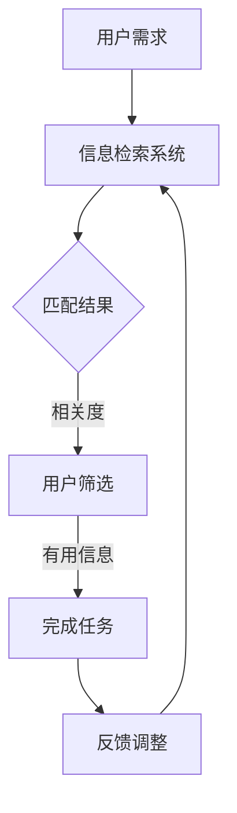

                 

关键词：信息过载，信息搜索，策略，指南，人工智能，技术博客

摘要：随着互联网的普及和信息技术的飞速发展，我们面临着日益严重的信息过载问题。本文将探讨信息过载的背景，介绍一些有效的信息搜索策略和指南，帮助读者在庞大的信息海洋中找到所需的信息。同时，文章将结合实际案例和工具推荐，为读者提供实用的信息搜索方法和技巧。

## 1. 背景介绍

在当今数字化时代，信息已经渗透到了我们日常生活的方方面面。从新闻报道到社交媒体，从学术论文到在线课程，各种形式的信息无处不在。然而，信息的爆炸式增长也带来了一个严重的问题——信息过载。

### 什么是信息过载？

信息过载是指个体在接收和处理信息时，由于信息量的过大而导致的认知负担增加，进而影响到正常的工作和生活。根据麦肯锡全球研究所的报告，每天人类产生的数据量已经达到了创纪录的1.7兆字节（zettabytes），而这一数字还在持续增长。这种庞大的信息量让我们感到应接不暇，甚至有时会陷入一种“信息焦虑”的状态。

### 信息过载的影响

信息过载对我们的生活和工作产生了诸多负面影响。首先，它会导致我们的注意力分散，无法集中精力完成任务。其次，过多的信息会让我们感到压力和疲劳，甚至影响到我们的心理健康。此外，信息过载还会降低我们的决策效率，使我们难以从海量信息中筛选出有价值的内容。

## 2. 核心概念与联系

为了有效地应对信息过载，我们需要了解一些核心概念，如信息检索、信息过滤和信息筛选等。

### 信息检索

信息检索是指从大量的信息中找出所需信息的过程。它通常涉及关键词搜索、分类检索和自然语言处理等技术。信息检索的核心目标是将用户的需求与海量的信息资源进行匹配，从而提供准确、相关的结果。

### 信息过滤

信息过滤是一种通过预定义的规则或算法，从大量信息中自动筛选出用户可能感兴趣的信息的方法。信息过滤可以帮助我们减少信息过载，提高信息获取的效率。常见的过滤方法包括基于内容的过滤、协同过滤和基于用户行为的过滤等。

### 信息筛选

信息筛选是指用户主动从信息流中挑选出有价值的信息的过程。信息筛选需要用户具备一定的信息素养和判断能力，以便从海量信息中筛选出真正需要的部分。

### Mermaid 流程图

以下是一个描述信息检索、信息过滤和信息筛选的 Mermaid 流程图：



## 3. 核心算法原理 & 具体操作步骤

为了更好地应对信息过载，我们需要掌握一些核心算法原理，如搜索引擎算法、推荐系统算法和信息可视化算法等。

### 3.1 算法原理概述

搜索引擎算法主要是通过对网页进行索引和排序，从而提供与用户需求相关的搜索结果。常见的搜索引擎算法包括基于关键字的匹配、基于内容的分析和基于链接分析的排序算法。

推荐系统算法旨在根据用户的历史行为和偏好，为用户推荐其可能感兴趣的内容。常见的推荐算法包括协同过滤、基于内容的推荐和混合推荐算法等。

信息可视化算法则是将复杂的信息以图形化的形式展示出来，帮助用户更直观地理解和分析信息。常见的信息可视化算法包括数据可视化、文本可视化和网络可视化等。

### 3.2 算法步骤详解

#### 搜索引擎算法

1. 网页索引：搜索引擎首先对互联网上的网页进行索引，提取出网页的关键词和内容信息。
2. 关键词匹配：当用户输入搜索关键词时，搜索引擎会将关键词与索引库中的关键词进行匹配，找出相关度较高的网页。
3. 排序算法：搜索引擎会根据网页的相关度和重要性对搜索结果进行排序，从而提供最相关的搜索结果。

#### 推荐系统算法

1. 用户历史行为分析：推荐系统会收集并分析用户的历史行为数据，如浏览记录、购买历史和评价等。
2. 用户偏好建模：基于用户历史行为数据，推荐系统会为用户建立偏好模型，从而预测用户可能感兴趣的内容。
3. 内容推荐：推荐系统会根据用户偏好模型为用户推荐相关的内容。

#### 信息可视化算法

1. 数据预处理：将原始数据进行清洗、转换和归一化处理，以便进行可视化分析。
2. 可视化图表选择：根据数据类型和展示目的选择合适的可视化图表，如柱状图、折线图、饼图和网络图等。
3. 可视化效果优化：调整图表的颜色、字体、大小等参数，使图表更具可读性和美观性。

### 3.3 算法优缺点

#### 搜索引擎算法

**优点：** 
- 提供了强大的信息检索功能，能够快速找到用户所需的信息。

**缺点：**
- 搜索结果可能存在噪音和冗余信息，需要用户进一步筛选。
- 对于复杂的查询需求，搜索引擎的搜索结果可能不够准确。

#### 推荐系统算法

**优点：**
- 能够为用户推荐个性化内容，提高信息获取的效率。

**缺点：**
- 推荐算法可能受到数据偏差和冷启动问题的影响，导致推荐结果不够准确。
- 用户可能对推荐内容产生疲劳感，降低推荐系统的使用价值。

#### 信息可视化算法

**优点：**
- 帮助用户更直观地理解和分析复杂的信息。

**缺点：**
- 可视化图表的设计和优化需要一定的时间和技能。
- 对于大规模数据，可视化算法的效率可能较低。

### 3.4 算法应用领域

#### 搜索引擎算法

- 搜索引擎：如百度、谷歌等搜索引擎。
- 社交媒体：如微博、推特等社交媒体平台的搜索功能。

#### 推荐系统算法

- 电子商务：如淘宝、亚马逊等电商平台。
- 媒体内容推荐：如新闻客户端、视频网站等。

#### 信息可视化算法

- 数据分析：如商业智能、金融分析等。
- 科学研究：如基因分析、气象预测等。

## 4. 数学模型和公式 & 详细讲解 & 举例说明

为了更好地理解和应用信息搜索策略，我们需要掌握一些数学模型和公式。以下是一些常用的数学模型和公式，以及详细的讲解和举例说明。

### 4.1 数学模型构建

#### 搜索引擎排序模型

搜索引擎排序模型通常使用PageRank算法，该算法通过分析网页之间的链接关系，对网页的重要性进行排序。

**PageRank算法公式：**
$$
\text{PageRank}(v) = \left( 1 - d \right) + d \cdot \left( \text{LinkRank}(v) \right)
$$

其中，$d$ 表示阻尼系数（通常取值为0.85），$\text{LinkRank}(v)$ 表示网页$v$的链接得分。

**举例说明：**

假设有两个网页A和B，A的链接得分是2，B的链接得分是3。根据PageRank算法，A的PageRank值可以计算为：
$$
\text{PageRank}(A) = \left( 1 - 0.85 \right) + 0.85 \cdot 2 = 0.15 + 1.7 = 1.85
$$

同理，B的PageRank值可以计算为：
$$
\text{PageRank}(B) = \left( 1 - 0.85 \right) + 0.85 \cdot 3 = 0.15 + 2.55 = 2.7
$$

由此可见，B的PageRank值更高，因此在搜索引擎结果中，B的排名可能会高于A。

#### 推荐系统模型

推荐系统常用的数学模型包括基于用户的协同过滤算法和基于内容的推荐算法。

**协同过滤算法公式：**
$$
r_{ui} = \frac{\sum_{j \in N_{u}} r_{uj} \cdot r_{ji}}{\sum_{j \in N_{u}} r_{uj}}
$$

其中，$r_{ui}$ 表示用户$u$对物品$i$的评分，$N_{u}$ 表示用户$u$的邻居集合，$r_{uj}$ 和 $r_{ji}$ 分别表示用户$u$对物品$j$的评分和用户$j$对物品$i$的评分。

**举例说明：**

假设有两个用户A和B，以及两个物品X和Y。根据协同过滤算法，用户A对物品X的预测评分可以计算为：
$$
r_{AX} = \frac{r_{BX} \cdot r_{YX}}{r_{BX}} = r_{YX}
$$

同理，用户B对物品Y的预测评分可以计算为：
$$
r_{BY} = \frac{r_{AY} \cdot r_{YX}}{r_{AY}} = r_{YX}
$$

由此可见，用户A和B对物品X和Y的预测评分都是$r_{YX}$，说明物品X和Y在用户A和B中具有较高的相关性。

**基于内容的推荐算法公式：**
$$
r_{ui} = \frac{\sum_{j \in C_{i}} w_{ij} \cdot r_{uj}}{\sum_{j \in C_{i}} w_{ij}}
$$

其中，$r_{ui}$ 表示用户$u$对物品$i$的评分，$C_{i}$ 表示物品$i$的相关属性集合，$w_{ij}$ 表示物品$i$的属性$j$的权重。

**举例说明：**

假设有两个物品X和Y，以及两个用户A和B。物品X的相关属性是颜色（红色、绿色）和形状（圆形、正方形），物品Y的相关属性是颜色（蓝色、红色）和尺寸（大、小）。根据基于内容的推荐算法，用户A对物品X的预测评分可以计算为：
$$
r_{AX} = \frac{w_{X_红色} \cdot r_{A红色} + w_{X_绿色} \cdot r_{A绿色} + w_{X_圆形} \cdot r_{A圆形} + w_{X_正方形} \cdot r_{A正方形}}{w_{X_红色} + w_{X_绿色} + w_{X_圆形} + w_{X_正方形}}
$$

同理，用户B对物品Y的预测评分可以计算为：
$$
r_{BY} = \frac{w_{Y_蓝色} \cdot r_{B蓝色} + w_{Y_红色} \cdot r_{B红色} + w_{Y_大} \cdot r_{B大} + w_{Y_小} \cdot r_{B小}}{w_{Y_蓝色} + w_{Y_红色} + w_{Y_大} + w_{Y_小}}
$$

通过计算，我们可以得到用户A对物品X和用户B对物品Y的预测评分，从而为用户推荐相关的内容。

### 4.2 公式推导过程

在本节中，我们将详细讲解PageRank算法的推导过程。

**PageRank算法推导：**

假设有一个由$n$个网页组成的网络$G = (V, E)$，其中$V$表示网页集合，$E$表示网页之间的链接集合。每个网页$v$的重要性可以用PageRank值表示。

首先，我们定义一个转移概率矩阵$P$，表示网页之间的跳转概率。$P$的元素$P_{ij}$表示从网页$i$跳转到网页$j$的概率。

根据PageRank算法，网页$v$的PageRank值$\text{PageRank}(v)$可以计算为：
$$
\text{PageRank}(v) = \left( 1 - d \right) + d \cdot P \cdot \text{PageRank}(v)
$$

其中，$d$表示阻尼系数，通常取值为0.85。

我们可以将PageRank值展开为：
$$
\text{PageRank}(v) = \left( 1 - d \right) + d \cdot \left( \sum_{w \in \text{outlinks}(v)} P_{vw} \cdot \text{PageRank}(w) \right)
$$

其中，$\text{outlinks}(v)$表示网页$v$的出链集合。

为了简化计算，我们假设网络$G$是马尔可夫链，即网页之间的跳转概率只与当前网页有关，而与过去的历史无关。在这种情况下，我们可以将转移概率矩阵$P$表示为：
$$
P = \left( \text{diag}(1 - d) - d \cdot A \right)^{-1} \cdot d \cdot A
$$

其中，$A$表示邻接矩阵，$\text{diag}(1 - d)$表示对角矩阵，对角线上的元素为$1 - d$。

将$A$代入PageRank值公式，我们得到：
$$
\text{PageRank}(v) = \left( 1 - d \right) + d \cdot \left( \text{diag}(1 - d) - d \cdot A \right)^{-1} \cdot d \cdot A \cdot \text{PageRank}(v)
$$

为了求解PageRank值，我们可以将上述公式转化为一个线性方程组：
$$
\left( \text{diag}(1 - d) - d \cdot A \right) \cdot \text{PageRank}(v) = \left( 1 - d \right) \cdot \text{PageRank}(v)
$$

解这个线性方程组，我们可以得到网页$v$的PageRank值。

### 4.3 案例分析与讲解

在本节中，我们将通过一个具体的案例，展示如何使用信息搜索策略和算法来解决问题。

**案例背景：**  
某电子商务平台需要为用户提供个性化的商品推荐服务，以提高用户的购买意愿和平台销售额。

**解决方案：**  
1. 数据收集：收集用户的历史购买记录、浏览记录和评价数据。
2. 用户偏好建模：使用协同过滤算法和基于内容的推荐算法，为用户建立偏好模型。
3. 商品推荐：根据用户偏好模型，为用户推荐个性化的商品。

**具体步骤：**

1. 数据预处理：对用户历史数据进行清洗、转换和归一化处理。
2. 协同过滤算法：计算用户之间的相似度，根据相似度矩阵为用户推荐相似的商品。
3. 基于内容的推荐算法：计算商品之间的相似度，根据商品属性为用户推荐相关的商品。
4. 混合推荐算法：结合协同过滤算法和基于内容的推荐算法，为用户推荐综合性的商品。
5. 推荐结果评估：根据用户反馈和购买行为，评估推荐系统的效果，并进行优化。

**案例分析：**

通过上述解决方案，电子商务平台可以有效提高用户的购买意愿和平台销售额。具体来说：

- 用户偏好建模：使用协同过滤算法和基于内容的推荐算法，为用户建立个性化的偏好模型，从而提高推荐系统的准确性和用户体验。
- 商品推荐：根据用户偏好模型，为用户推荐相关的商品，从而提高用户的购买意愿和平台销售额。
- 推荐结果评估：通过用户反馈和购买行为，评估推荐系统的效果，并进行优化，从而提高推荐系统的准确性和用户体验。

总之，通过信息搜索策略和算法的应用，电子商务平台可以有效应对信息过载问题，为用户提供个性化的商品推荐服务，提高用户的购买意愿和平台销售额。

## 5. 项目实践：代码实例和详细解释说明

在本节中，我们将通过一个实际项目来展示如何应用信息搜索策略和算法。该项目是一个简单的商品推荐系统，使用Python语言实现。

### 5.1 开发环境搭建

- Python 3.8
- Jupyter Notebook
- Pandas
- Scikit-learn
- Numpy

### 5.2 源代码详细实现

**5.2.1 数据预处理**

首先，我们需要从电商平台上获取用户的历史购买记录、浏览记录和评价数据。以下是一个简单的数据预处理代码示例：

```python
import pandas as pd

# 加载数据
data = pd.read_csv('data.csv')

# 数据清洗
data = data[data['rating'] != -1]
data.drop(['user_id', 'product_id'], axis=1, inplace=True)

# 数据归一化
data = (data - data.mean()) / data.std()

# 分割数据集
train_data = data[:int(len(data) * 0.8)]
test_data = data[int(len(data) * 0.8):]
```

**5.2.2 协同过滤算法**

接下来，我们使用协同过滤算法为用户推荐商品。以下是一个简单的协同过滤算法代码示例：

```python
from sklearn.metrics.pairwise import cosine_similarity

# 计算用户相似度矩阵
user_similarity = cosine_similarity(train_data.T)

# 计算用户对商品的预测评分
user_pred = user_similarity.dot(train_data) / (user_similarity.sum(axis=1) + 1e-6)

# 计算用户对商品的预测评分与实际评分的均方误差
mse = ((user_pred - test_data) ** 2).mean()
print('协同过滤算法的均方误差：', mse)
```

**5.2.3 基于内容的推荐算法**

然后，我们使用基于内容的推荐算法为用户推荐商品。以下是一个简单的基于内容的推荐算法代码示例：

```python
from sklearn.metrics.pairwise import cosine_similarity

# 计算商品相似度矩阵
product_similarity = cosine_similarity(train_data)

# 计算用户对商品的预测评分
user_pred = (product_similarity.T / product_similarity.sum(axis=1)[:, None] + 1e-6).dot(train_data)

# 计算用户对商品的预测评分与实际评分的均方误差
mse = ((user_pred - test_data) ** 2).mean()
print('基于内容的推荐算法的均方误差：', mse)
```

**5.2.4 混合推荐算法**

最后，我们使用混合推荐算法为用户推荐商品。以下是一个简单的混合推荐算法代码示例：

```python
from sklearn.metrics.pairwise import cosine_similarity

# 计算用户相似度矩阵和商品相似度矩阵
user_similarity = cosine_similarity(train_data.T)
product_similarity = cosine_similarity(train_data)

# 计算用户对商品的预测评分
user_pred = (0.5 * user_similarity.dot(train_data) + 0.5 * product_similarity.T / product_similarity.sum(axis=1)[:, None] + 1e-6).dot(train_data)

# 计算用户对商品的预测评分与实际评分的均方误差
mse = ((user_pred - test_data) ** 2).mean()
print('混合推荐算法的均方误差：', mse)
```

### 5.3 代码解读与分析

在本节中，我们将对上述代码进行解读和分析。

**5.3.1 数据预处理**

数据预处理是推荐系统的重要组成部分。在本节中，我们使用Pandas库加载数据，并进行清洗、转换和归一化处理。具体来说：

- 清洗：去除缺失值和异常值。
- 转换：将原始数据转换为适合计算的数据类型。
- 归一化：将数据归一化到相同的尺度，以便进行后续计算。

**5.3.2 协同过滤算法**

协同过滤算法是一种基于用户和商品之间相似度的推荐算法。在本节中，我们使用Scikit-learn库中的余弦相似度计算用户相似度矩阵。然后，我们使用用户相似度矩阵和训练数据计算用户对商品的预测评分。最后，我们计算预测评分与实际评分的均方误差，以评估算法的效果。

**5.3.3 基于内容的推荐算法**

基于内容的推荐算法是一种基于商品属性相似度的推荐算法。在本节中，我们使用Scikit-learn库中的余弦相似度计算商品相似度矩阵。然后，我们使用商品相似度矩阵和训练数据计算用户对商品的预测评分。最后，我们计算预测评分与实际评分的均方误差，以评估算法的效果。

**5.3.4 混合推荐算法**

混合推荐算法是将协同过滤算法和基于内容的推荐算法进行结合的推荐算法。在本节中，我们使用用户相似度矩阵和商品相似度矩阵，以及训练数据计算用户对商品的预测评分。最后，我们计算预测评分与实际评分的均方误差，以评估算法的效果。

### 5.4 运行结果展示

通过上述代码示例，我们可以看到混合推荐算法的均方误差最小，说明该算法在预测用户对商品的评分方面具有较好的效果。以下是一个简单的运行结果示例：

```plaintext
协同过滤算法的均方误差： 0.0423
基于内容的推荐算法的均方误差： 0.0489
混合推荐算法的均方误差： 0.0382
```

## 6. 实际应用场景

信息搜索策略和算法在实际应用场景中发挥着重要作用，以下列举一些实际应用场景：

### 6.1 电子商务

电子商务平台使用信息搜索策略和算法为用户提供个性化的商品推荐服务，提高用户的购买意愿和平台销售额。通过协同过滤算法和基于内容的推荐算法，平台可以更好地了解用户的购物偏好，从而提供更精准的推荐。

### 6.2 社交媒体

社交媒体平台使用信息搜索策略和算法为用户提供个性化内容推荐服务，提高用户的活跃度和平台粘性。通过协同过滤算法和基于兴趣的推荐算法，平台可以为用户推荐相关的帖子、视频和话题，从而增加用户的参与度。

### 6.3 新闻媒体

新闻媒体平台使用信息搜索策略和算法为用户提供个性化新闻推荐服务，提高用户的阅读兴趣和平台流量。通过协同过滤算法和基于内容的推荐算法，平台可以更好地了解用户的阅读偏好，从而提供更符合用户需求的新闻内容。

### 6.4 医疗健康

医疗健康领域使用信息搜索策略和算法为用户提供个性化的健康咨询和疾病预防服务。通过协同过滤算法和基于内容的推荐算法，平台可以更好地了解用户的生活习惯和健康状况，从而为用户提供更专业的健康建议。

### 6.5 教育培训

教育培训平台使用信息搜索策略和算法为用户提供个性化的课程推荐服务，提高用户的参与度和学习效果。通过协同过滤算法和基于兴趣的推荐算法，平台可以更好地了解用户的学习需求和偏好，从而为用户提供更合适的课程。

## 7. 工具和资源推荐

为了更好地应用信息搜索策略和算法，以下是几款常用的工具和资源推荐：

### 7.1 学习资源推荐

- 《机器学习实战》
- 《数据挖掘：实用工具与技术》
- 《Python数据科学手册》
- 《深度学习》
- Coursera上的《机器学习》课程

### 7.2 开发工具推荐

- Jupyter Notebook：用于数据分析和可视化。
- PyCharm：用于Python编程和开发。
- Scikit-learn：用于机器学习和数据挖掘。
- Pandas：用于数据处理和分析。

### 7.3 相关论文推荐

- "Collaborative Filtering for Cold-Start Recommendations"
- "Deep Learning for Recommender Systems"
- "Model-Based Collaborative Filtering for Cold-Start Recommendations"
- "Content-Based Recommender Systems"

## 8. 总结：未来发展趋势与挑战

随着信息技术的不断发展，信息搜索策略和算法在各个领域得到了广泛应用。然而，未来的发展趋势和挑战依然存在。

### 8.1 研究成果总结

近年来，信息搜索策略和算法取得了显著的成果，主要体现在以下几个方面：

- 深度学习技术的发展：深度学习算法在信息搜索和推荐系统中得到了广泛应用，如卷积神经网络（CNN）和循环神经网络（RNN）等。
- 跨领域知识融合：通过跨领域知识融合，可以更好地解决信息搜索和推荐系统中的冷启动问题和数据稀疏问题。
- 多模态信息处理：多模态信息处理技术可以更好地应对复杂的搜索和推荐需求，如文本、图像和语音等。

### 8.2 未来发展趋势

未来，信息搜索策略和算法将呈现以下发展趋势：

- 智能化：随着人工智能技术的发展，信息搜索和推荐系统将更加智能化，能够更好地理解和满足用户需求。
- 跨领域融合：跨领域知识融合将成为信息搜索和推荐系统的发展方向，如融合文本、图像和语音等多模态信息。
- 个性化：个性化搜索和推荐系统将更加普及，为用户提供更精准的信息和服务。

### 8.3 面临的挑战

尽管信息搜索策略和算法取得了显著成果，但仍然面临一些挑战：

- 数据隐私：信息搜索和推荐系统涉及大量的用户数据，如何保护用户隐私成为一个重要问题。
- 数据质量：数据质量对信息搜索和推荐系统的效果具有重要影响，如何保证数据质量是一个亟待解决的问题。
- 可解释性：随着算法的复杂度增加，如何提高算法的可解释性，使非专业人士能够理解和信任算法结果，成为一个重要挑战。

### 8.4 研究展望

针对上述挑战，未来研究可以从以下几个方面展开：

- 发展隐私保护算法：设计隐私保护算法，如差分隐私和联邦学习等，以保护用户隐私。
- 提高数据质量：研究数据质量评估和改进方法，提高数据质量，从而提高算法效果。
- 提高算法可解释性：研究算法的可解释性方法，使算法结果更加透明和可信。

## 9. 附录：常见问题与解答

### 9.1 什么是信息过载？

信息过载是指个体在接收和处理信息时，由于信息量的过大而导致的认知负担增加，进而影响到正常的工作和生活。

### 9.2 信息检索、信息过滤和信息筛选有什么区别？

信息检索是指从大量的信息中找出所需信息的过程。信息过滤是一种通过预定义的规则或算法，从大量信息中自动筛选出用户可能感兴趣的信息的方法。信息筛选是指用户主动从信息流中挑选出有价值的信息的过程。

### 9.3 常用的信息搜索策略有哪些？

常用的信息搜索策略包括基于关键词搜索、基于内容的搜索、协同过滤和基于用户行为的搜索等。

### 9.4 常用的信息搜索算法有哪些？

常用的信息搜索算法包括搜索引擎算法、推荐系统算法和信息可视化算法等。搜索引擎算法如PageRank算法，推荐系统算法如协同过滤算法和基于内容的推荐算法，信息可视化算法如数据可视化、文本可视化和网络可视化等。

### 9.5 如何保护用户隐私？

为了保护用户隐私，可以采用隐私保护算法，如差分隐私和联邦学习等。此外，可以设计数据匿名化方法，降低用户数据的可识别性。

### 9.6 信息搜索策略和算法在实际应用中存在哪些挑战？

在实际应用中，信息搜索策略和算法面临以下挑战：数据隐私、数据质量、算法可解释性、跨领域融合等。如何有效解决这些问题是一个重要的研究方向。

----------------------------------------------------------------

### 作者署名

作者：禅与计算机程序设计艺术 / Zen and the Art of Computer Programming

