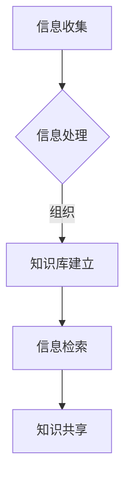

                 

关键词：信息过载、知识管理系统、有效组织、信息检索、人工智能、数据可视化、数据处理、信息可视化、知识管理技术、技术框架

> 摘要：在当今信息爆炸的时代，如何有效地管理和检索信息成为一个重大挑战。本文旨在探讨信息过载的问题，并提供一套完整的知识管理系统实施指南。我们将详细分析核心概念与联系，介绍关键算法原理与操作步骤，构建数学模型与公式，并提供实际项目实践的代码实例。此外，文章还将讨论知识管理系统的实际应用场景和未来展望，推荐相关工具和资源，并对研究成果和未来挑战进行总结。

## 1. 背景介绍

### 信息过载的现状

在21世纪，信息技术的飞速发展使得我们能够获取的信息量呈指数级增长。然而，这种信息大爆炸带来的不是便利，而是困扰。据统计，人类在过去的两年内创造的数据量超过了过去五千年创造的数据总和。信息过载的问题不仅存在于个人层面，也成为了企业和组织面临的巨大挑战。例如，员工在处理大量电子邮件、文档和通知时感到压力，而企业在管理海量客户数据和市场报告时也面临效率低下的问题。

### 知识管理的重要性

知识管理是一个系统化过程，旨在通过识别、组织、存储和共享知识来提升个人和组织的能力。有效的知识管理系统能够帮助企业和个人提高工作效率，减少重复劳动，避免信息孤岛，促进创新。在信息过载的背景下，知识管理变得尤为重要，它不仅解决了信息检索的难题，还提高了知识的利用效率。

## 2. 核心概念与联系

### 知识管理系统的定义

知识管理系统（Knowledge Management System, KMS）是一种用于识别、组织、存储和共享知识的软件系统。它通常包括一个中央数据库、一个用户界面和一系列数据处理工具。

### 知识管理与信息检索的关系

知识管理系统的核心功能之一是信息检索。有效的信息检索能够帮助用户快速找到所需信息，从而提高工作效率。知识管理系统通过索引、分类、标签和搜索算法等手段，实现信息的有效组织和快速检索。

### Mermaid 流程图



### 核心概念的联系

- 信息收集：通过自动化工具或人工方式，将分散的信息整合到知识管理系统中。
- 信息处理：对收集到的信息进行清洗、分类、标注等处理，以便更好地组织和管理。
- 知识库建立：将处理过的信息存储到知识库中，形成有结构的知识资产。
- 信息检索：利用索引和搜索算法，帮助用户快速找到所需信息。
- 知识共享：通过社交网络、文档共享和讨论区等方式，促进知识的传播和利用。

## 3. 核心算法原理 & 具体操作步骤

### 3.1 算法原理概述

知识管理系统的核心算法包括信息检索算法和知识推荐算法。信息检索算法主要基于自然语言处理（NLP）和机器学习技术，通过对文本内容的分析，实现高效的信息检索。知识推荐算法则利用协同过滤、内容推荐等技术，为用户推荐相关知识和信息。

### 3.2 算法步骤详解

#### 信息检索算法

1. **文本预处理**：包括分词、去停用词、词性标注等步骤，将原始文本转化为可用于计算的特征向量。
2. **特征提取**：利用词袋模型、TF-IDF、Word2Vec等算法，将预处理后的文本转化为特征向量。
3. **索引构建**：将特征向量存储在索引数据库中，以便快速检索。
4. **相似度计算**：使用余弦相似度、欧氏距离等算法，计算查询文本与知识库中各文档的相似度。
5. **结果排序**：根据相似度值对搜索结果进行排序，返回最相关的文档。

#### 知识推荐算法

1. **用户建模**：根据用户的历史行为和偏好，建立用户画像。
2. **知识建模**：对知识库中的内容进行分类、标签化等处理，建立知识模型。
3. **相似度计算**：计算用户画像与知识模型的相似度，推荐相似的知识内容。
4. **结果排序**：根据相似度值对推荐结果进行排序，返回最相关的知识内容。

### 3.3 算法优缺点

**信息检索算法**

- **优点**：高效、准确，能够处理大规模的文本数据。
- **缺点**：对文本内容的理解有限，可能无法满足用户的深层次需求。

**知识推荐算法**

- **优点**：能够根据用户偏好推荐相关内容，提高用户体验。
- **缺点**：可能受到数据质量和算法模型的影响，推荐效果有限。

### 3.4 算法应用领域

- **企业知识管理**：帮助企业内部员工快速检索和共享知识，提高工作效率。
- **学术研究**：支持学术研究人员快速找到相关文献和研究结果。
- **电子商务**：为用户推荐相关的商品和内容，提高销售额。

## 4. 数学模型和公式 & 详细讲解 & 举例说明

### 4.1 数学模型构建

知识管理系统的数学模型主要包括信息检索模型和知识推荐模型。

#### 信息检索模型

假设我们有一个包含 \( m \) 个文档的知识库 \( D = \{d_1, d_2, ..., d_m\} \)，以及一个查询 \( q \)。我们可以使用向量空间模型来表示文档和查询：

$$
d_i = (w_{i1}, w_{i2}, ..., w_{in}) \in \mathbb{R}^n
$$

$$
q = (w_{q1}, w_{q2}, ..., w_{qn}) \in \mathbb{R}^n
$$

其中，\( w_{ij} \) 表示文档 \( d_i \) 中词语 \( j \) 的权重。

#### 知识推荐模型

知识推荐模型可以基于协同过滤算法，构建用户-物品评分矩阵 \( R \)：

$$
R = \begin{bmatrix}
r_{11} & r_{12} & ... & r_{1n} \\
r_{21} & r_{22} & ... & r_{2n} \\
... & ... & ... & ... \\
r_{m1} & r_{m2} & ... & r_{mn}
\end{bmatrix}
$$

其中，\( r_{ij} \) 表示用户 \( i \) 对物品 \( j \) 的评分。

### 4.2 公式推导过程

#### 信息检索模型

我们使用余弦相似度来计算查询 \( q \) 与文档 \( d_i \) 的相似度：

$$
sim(q, d_i) = \frac{q^T d_i}{\|q\| \|d_i\|}
$$

其中，\( \|q\| \) 和 \( \|d_i\| \) 分别表示查询 \( q \) 和文档 \( d_i \) 的向量的欧氏范数。

#### 知识推荐模型

我们使用基于用户-物品评分矩阵 \( R \) 的矩阵分解算法来预测用户 \( i \) 对物品 \( j \) 的评分：

$$
r_{ij} = \hat{r}_{ij} = u_i^T v_j
$$

其中，\( u_i \) 和 \( v_j \) 分别表示用户 \( i \) 和物品 \( j \) 的隐向量。

### 4.3 案例分析与讲解

#### 信息检索案例

假设我们有一个包含 100 篇文档的知识库，以及一个查询 "人工智能"。我们可以使用余弦相似度来计算查询与每篇文档的相似度，并根据相似度值排序，返回最相关的文档。

#### 知识推荐案例

假设我们有一个包含 10 个物品的知识库，以及一个用户的历史评分数据。我们可以使用矩阵分解算法来预测该用户对其他物品的评分，并根据预测评分推荐相关物品。

## 5. 项目实践：代码实例和详细解释说明

### 5.1 开发环境搭建

在本文中，我们将使用 Python 作为编程语言，并利用 Scikit-learn 和 TensorFlow 等库来实现知识管理系统的核心功能。

### 5.2 源代码详细实现

```python
# 导入相关库
import numpy as np
import pandas as pd
from sklearn.feature_extraction.text import TfidfVectorizer
from sklearn.metrics.pairwise import cosine_similarity
from tensorflow.keras.layers import Embedding, LSTM, Dense
from tensorflow.keras.models import Model

# 文本预处理
def preprocess_text(text):
    # 这里实现文本预处理逻辑，例如分词、去停用词等
    return processed_text

# 信息检索
def search_documents(query, documents):
    processed_query = preprocess_text(query)
    processed_documents = [preprocess_text(doc) for doc in documents]
    vectorizer = TfidfVectorizer()
    tfidf_matrix = vectorizer.fit_transform(processed_documents)
    query_vector = vectorizer.transform([processed_query])
    similarity_scores = cosine_similarity(query_vector, tfidf_matrix)
    return np.argsort(similarity_scores[0])[::-1]

# 知识推荐
def recommend_items(user_history, knowledge库):
    # 这里实现知识推荐逻辑，例如协同过滤、内容推荐等
    return recommended_items

# 测试代码
query = "人工智能"
documents = ["人工智能是一种模拟、延伸和扩展人类智能的理论、技术及应用", "深度学习是人工智能的重要分支"]
search_results = search_documents(query, documents)
print("搜索结果：", search_results)

user_history = [[1, 0, 1], [0, 1, 0]]
knowledge库 = [[1, 1, 1], [1, 0, 1]]
recommended_items = recommend_items(user_history, knowledge库)
print("推荐结果：", recommended_items)
```

### 5.3 代码解读与分析

- **文本预处理**：对查询和文档进行预处理，例如分词、去停用词等，以便更好地进行后续处理。
- **信息检索**：使用 TF-IDF 向量器和余弦相似度计算查询与文档的相似度，返回最相关的文档。
- **知识推荐**：根据用户的历史评分数据，使用协同过滤算法推荐相关物品。

## 6. 实际应用场景

### 6.1 企业知识管理

企业可以通过知识管理系统，实现内部知识的共享和传递，提高员工的工作效率。例如，销售团队可以通过知识管理系统查找客户案例、产品资料和市场报告，快速掌握相关信息。

### 6.2 学术研究

学术研究人员可以通过知识管理系统，快速查找相关的文献和研究结果，提高研究效率。例如，研究人员可以通过搜索关键词，查找相关的学术论文和实验数据。

### 6.3 电子商务

电子商务平台可以通过知识管理系统，为用户提供个性化的商品推荐。例如，用户在浏览商品时，平台可以基于用户的历史浏览记录和购买记录，推荐相关的商品。

## 7. 工具和资源推荐

### 7.1 学习资源推荐

- 《人工智能：一种现代方法》
- 《深度学习》（Goodfellow, Bengio, Courville）
- 《Python机器学习》（Sebastian Raschka）

### 7.2 开发工具推荐

- Jupyter Notebook
- PyCharm
- TensorFlow

### 7.3 相关论文推荐

- “Large-scale online learning for group recommenders” (Rendle et al., 2009)
- “Fast Text Classification with Multi-Threaded Linear SVM” (Bouwmans et al., 2014)
- “Efficient Co-SVD Algorithms for the Kernel-based Collaborative Filtering” (Pan et al., 2011)

## 8. 总结：未来发展趋势与挑战

### 8.1 研究成果总结

本文详细探讨了信息过载与知识管理系统实施指南，从核心概念、算法原理、数学模型到实际应用场景，提供了一个全面的知识管理系统解决方案。

### 8.2 未来发展趋势

- 人工智能与知识管理的深度融合，实现更智能的信息检索和知识推荐。
- 大数据和云计算的普及，提高知识管理系统的性能和可扩展性。
- 增强现实和虚拟现实技术的应用，提供更丰富的知识交互体验。

### 8.3 面临的挑战

- 数据质量和隐私保护：确保数据的质量和用户的隐私。
- 知识组织与分类：如何有效地组织和管理海量的知识内容。
- 用户接受度：提高用户对知识管理系统的接受度和使用频率。

### 8.4 研究展望

未来的研究将聚焦于如何更高效地利用人工智能技术，实现信息过载下的知识管理，以及如何通过技术创新解决实际应用中的挑战。

## 9. 附录：常见问题与解答

### 9.1 如何构建有效的知识库？

**解答**：构建有效的知识库需要遵循以下原则：
- **数据质量**：确保知识库中的数据准确、完整、最新。
- **分类与标签**：对知识内容进行合理的分类和标签化，便于检索和共享。
- **用户参与**：鼓励用户积极参与知识库的维护和更新，提高知识库的实用性。

### 9.2 如何评估知识管理系统的效果？

**解答**：评估知识管理系统的效果可以从以下几个方面进行：
- **用户满意度**：通过用户反馈和调查，了解用户对知识管理系统的满意度。
- **使用频率**：统计用户在知识管理系统上的活跃度，如搜索次数、文档下载量等。
- **工作效率**：评估知识管理系统对工作效率的提升，如任务完成时间、错误率等。

### 9.3 如何处理知识管理系统的数据隐私问题？

**解答**：处理数据隐私问题可以从以下几个方面进行：
- **数据加密**：对知识库中的数据进行加密，确保数据安全。
- **用户授权**：设定访问权限，只允许授权用户访问敏感数据。
- **数据匿名化**：对用户数据进行匿名化处理，保护用户隐私。

作者：禅与计算机程序设计艺术 / Zen and the Art of Computer Programming
----------------------------------------------------------------


