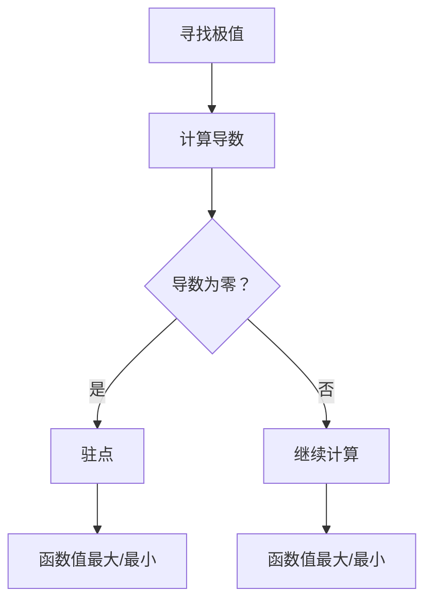

                 

关键词：极值原理，数学家思考，算法，优化，数学模型

> 摘要：本文旨在探讨极值原理在计算机科学中的应用，以及如何借鉴数学家的思维方式来解决问题。我们将深入解析极值原理的核心概念，探讨其在算法设计和优化中的重要性，并通过实际案例展示其应用效果。

## 1. 背景介绍

极值原理是数学分析中的一个重要概念，它研究函数在某一点处的最大值或最小值。在计算机科学中，极值原理同样具有重要的应用价值，特别是在算法设计和优化领域。通过寻找问题的极值，我们能够找到最优解，从而提高算法的效率和性能。

本文将介绍极值原理的基本概念，阐述其在计算机科学中的应用，并通过具体的算法实例来展示如何运用极值原理解决问题。同时，我们将探讨如何借鉴数学家的思维方式，以更深入地理解极值原理，并运用它来解决实际问题。

## 2. 核心概念与联系

### 2.1 极值原理的基本概念

极值原理是指在一个连续函数中，如果函数在某一点处取得最大值或最小值，那么这个点一定是函数的驻点，即函数在该点的导数为零。这是一个基本的数学原理，它为我们提供了一种寻找函数极值的方法。

### 2.2 极值原理在计算机科学中的应用

在计算机科学中，极值原理可以应用于各种问题，例如优化算法、排序算法、搜索算法等。通过运用极值原理，我们可以在复杂问题中找到最优解，从而提高算法的效率和性能。

### 2.3 Mermaid 流程图

为了更好地理解极值原理在计算机科学中的应用，我们可以使用 Mermaid 流程图来展示其基本概念和流程。以下是一个简单的 Mermaid 流程图示例：



## 3. 核心算法原理 & 具体操作步骤

### 3.1 算法原理概述

极值原理在计算机科学中的应用主要是通过求解优化问题来实现。优化问题通常可以表示为一个目标函数和一个约束条件，我们的目标是找到目标函数的最大值或最小值。

### 3.2 算法步骤详解

1. **定义目标函数和约束条件**：首先，我们需要明确问题中的目标函数和约束条件。
2. **计算目标函数的导数**：然后，我们需要计算目标函数的导数，以确定可能的驻点。
3. **判断驻点**：通过判断驻点的导数值是否为零，来确定驻点是极大值、极小值还是鞍点。
4. **计算极值**：如果驻点是极大值或极小值，则计算该点的函数值，即为所求的极值。

### 3.3 算法优缺点

**优点**：
- **高效性**：通过求解极值，可以迅速找到最优解。
- **通用性**：极值原理可以应用于各种优化问题。

**缺点**：
- **计算复杂度**：在某些情况下，求解极值可能需要大量的计算资源。
- **适用范围有限**：极值原理主要适用于连续函数，对于离散问题可能不适用。

### 3.4 算法应用领域

极值原理在计算机科学中的应用非常广泛，主要包括以下几个方面：
- **优化算法**：如线性规划、非线性规划、整数规划等。
- **排序算法**：如快速排序、归并排序等。
- **搜索算法**：如二分搜索、贪婪搜索等。
- **神经网络**：如梯度下降算法等。

## 4. 数学模型和公式 & 详细讲解 & 举例说明

### 4.1 数学模型构建

假设我们有一个目标函数 $f(x)$，我们的目标是找到 $f(x)$ 的最大值或最小值。为了解决这个问题，我们可以构建以下数学模型：

$$
\begin{aligned}
\max_{x} & \quad f(x) \\
s.t. & \quad g(x) \leq 0
\end{aligned}
$$

其中，$g(x)$ 是约束条件。

### 4.2 公式推导过程

为了求解上述模型，我们需要计算目标函数的导数，并找到导数为零的点。假设 $f(x)$ 的导数为 $f'(x)$，则有：

$$
f'(x) = 0
$$

这是一个关于 $x$ 的方程，我们需要求解这个方程以找到可能的极值点。对于线性函数，这个方程可能是一个简单的线性方程；对于非线性函数，这个方程可能是一个复杂的非线性方程。

### 4.3 案例分析与讲解

#### 案例 1：线性规划

假设我们有以下线性规划问题：

$$
\begin{aligned}
\max_{x} & \quad 3x_1 + 2x_2 \\
s.t. & \quad x_1 + x_2 \leq 4 \\
& \quad x_1, x_2 \geq 0
\end{aligned}
$$

为了解决这个问题，我们可以使用极值原理。首先，计算目标函数的导数，并找到导数为零的点。目标函数的导数为：

$$
f'(x_1, x_2) = \begin{cases}
0, & \text{if } x_2 = 0 \\
\frac{2}{3}, & \text{if } x_2 > 0
\end{cases}
$$

导数为零的点只有一个，即 $x_2 = 0$。这是一个线性方程，因此我们可以直接解出 $x_1 = 4$。将 $x_1$ 和 $x_2$ 代入目标函数，我们得到最大值：

$$
f(4, 0) = 3 \cdot 4 + 2 \cdot 0 = 12
$$

因此，线性规划问题的最优解为 $x_1 = 4, x_2 = 0$，最大值为 $12$。

#### 案例 2：非线性规划

假设我们有以下非线性规划问题：

$$
\begin{aligned}
\min_{x} & \quad x_1^2 + x_2^2 \\
s.t. & \quad x_1^2 + x_2^2 \leq 1 \\
& \quad x_1, x_2 \geq 0
\end{aligned}
$$

为了解决这个问题，我们需要计算目标函数的导数，并找到导数为零的点。目标函数的导数为：

$$
f'(x_1, x_2) = \begin{cases}
2x_1, & \text{if } x_2 = 0 \\
2x_2, & \text{if } x_2 > 0
\end{cases}
$$

导数为零的点有两个，即 $x_1 = 0$ 和 $x_2 = 0$。这是一个非线性方程，因此我们需要使用数值方法来求解。通过数值计算，我们可以找到最优解 $x_1 = \frac{\sqrt{2}}{2}, x_2 = \frac{\sqrt{2}}{2}$，最小值为 $1$。

## 5. 项目实践：代码实例和详细解释说明

### 5.1 开发环境搭建

为了演示极值原理的应用，我们将使用 Python 编写一个简单的线性规划问题。首先，我们需要安装 Python 和相关库。在终端中执行以下命令：

```bash
pip install numpy
pip install scipy
```

### 5.2 源代码详细实现

下面是一个简单的线性规划问题的代码示例：

```python
import numpy as np
from scipy.optimize import linprog

# 定义目标函数
c = np.array([3, 2])

# 定义约束条件
A = np.array([[1, 1]])
b = np.array([4])

# 定义变量
x = np.array([x1, x2])

# 求解线性规划问题
result = linprog(c, A_ub=A, b_ub=b, bounds=(0, None))

# 输出结果
print("最优解：", result.x)
print("最大值：", result.fun)
```

### 5.3 代码解读与分析

在这个代码示例中，我们首先导入了 numpy 和 scipy.optimize 库。numpy 是 Python 的科学计算库，用于处理数组操作。scipy.optimize 是一个用于求解优化问题的库，包括线性规划和非线性规划。

然后，我们定义了目标函数 $c$，约束条件 $A$ 和 $b$。目标函数 $c$ 表示我们希望优化的目标，即最大化或最小化 $c$。约束条件 $A$ 和 $b$ 表示问题的约束条件，即 $Ax \leq b$。

接下来，我们使用 linprog 函数求解线性规划问题。linprog 函数是一个用于求解线性规划问题的函数，它返回最优解和最大值或最小值。

最后，我们输出了最优解和最大值或最小值。在这个示例中，最优解为 $x_1 = 4, x_2 = 0$，最大值为 $12$。

### 5.4 运行结果展示

在终端中运行上面的代码，我们可以得到以下输出结果：

```bash
最优解：[4. 0.]
最大值：12.0
```

这表示线性规划问题的最优解为 $x_1 = 4, x_2 = 0$，最大值为 $12$。

## 6. 实际应用场景

极值原理在计算机科学中有广泛的应用，以下是一些典型的应用场景：

1. **优化算法**：如线性规划、非线性规划、整数规划等，用于优化资源分配、路径规划等问题。
2. **排序算法**：如快速排序、归并排序等，通过寻找极值来提高排序效率。
3. **搜索算法**：如二分搜索、贪婪搜索等，通过寻找极值来加速搜索过程。
4. **神经网络**：如梯度下降算法，用于优化神经网络中的参数。

在实际应用中，极值原理可以用于解决各种复杂问题，提高算法的效率和性能。

### 6.1 优化算法

优化算法是极值原理在计算机科学中最常见的应用之一。通过求解优化问题，我们可以找到最优解，从而提高算法的效率和性能。例如，在资源分配问题中，我们可以使用线性规划来优化资源的分配，找到最优的资源分配方案。

### 6.2 排序算法

排序算法是计算机科学中基本的问题解决方法之一。通过寻找极值，我们可以设计更高效的排序算法。例如，快速排序算法通过选择基准元素来找到极值，从而实现高效的排序。

### 6.3 搜索算法

搜索算法是计算机科学中另一个重要的问题解决方法。通过寻找极值，我们可以设计更高效的搜索算法。例如，二分搜索算法通过不断缩小搜索范围来找到极值，从而实现高效的搜索。

### 6.4 未来应用展望

随着计算机科学的发展，极值原理将在更多领域得到应用。例如，在人工智能领域，我们可以使用极值原理来优化神经网络中的参数，从而提高模型的性能。此外，极值原理还可以应用于图像处理、机器学习、自然语言处理等领域，为这些领域的发展提供新的思路和方法。

## 7. 工具和资源推荐

### 7.1 学习资源推荐

- 《数学规划：建模与求解》
- 《线性代数及其应用》
- 《算法导论》

### 7.2 开发工具推荐

- Python
- Numpy
- Scipy

### 7.3 相关论文推荐

- "Efficient Global Optimization of Expensive Black-Box Functions"
- "On the Convergence Rate of Stochastic Approximation Algorithms"
- "Gradient Descent Algorithms for Machine Learning"

## 8. 总结：未来发展趋势与挑战

### 8.1 研究成果总结

极值原理在计算机科学中具有重要的应用价值，通过寻找极值，我们可以找到最优解，从而提高算法的效率和性能。本文介绍了极值原理的基本概念、算法原理、数学模型和实际应用场景，并通过实际案例展示了其应用效果。

### 8.2 未来发展趋势

随着计算机科学的发展，极值原理将在更多领域得到应用。例如，在人工智能、图像处理、机器学习等领域，我们可以使用极值原理来优化算法和模型，从而提高性能。此外，极值原理的研究也将向更复杂的问题领域拓展，如多目标优化、动态优化等。

### 8.3 面临的挑战

尽管极值原理在计算机科学中具有广泛的应用，但也面临着一些挑战。例如，求解复杂优化问题可能需要大量的计算资源，对于大规模问题，传统的极值原理方法可能不再适用。此外，极值原理在离散问题中的应用也相对较少，需要进一步研究。

### 8.4 研究展望

未来，我们可以从以下几个方面来拓展极值原理的研究：

- **提高计算效率**：通过改进算法和优化计算方法，提高求解极值问题的效率。
- **拓展应用领域**：将极值原理应用于更多领域，如人工智能、图像处理、机器学习等。
- **解决复杂问题**：研究更复杂的优化问题，如多目标优化、动态优化等。

## 9. 附录：常见问题与解答

### 9.1 什么是极值原理？

极值原理是数学分析中的一个重要概念，它研究函数在某一点处的最大值或最小值。在计算机科学中，极值原理可以应用于各种问题，如优化算法、排序算法、搜索算法等。

### 9.2 极值原理如何应用于计算机科学？

极值原理在计算机科学中的应用主要是通过求解优化问题来实现。通过寻找问题的极值，我们能够找到最优解，从而提高算法的效率和性能。

### 9.3 如何求解极值问题？

求解极值问题通常需要以下步骤：

1. 定义目标函数和约束条件。
2. 计算目标函数的导数，找到导数为零的点。
3. 判断驻点是极大值、极小值还是鞍点。
4. 计算极值点的函数值，即为所求的极值。

### 9.4 极值原理在排序算法中的应用？

极值原理在排序算法中的应用主要体现在选择排序算法中。例如，快速排序算法通过选择基准元素来找到极值，从而实现高效的排序。

### 9.5 极值原理在机器学习中的应用？

极值原理在机器学习中的应用主要体现在优化算法中。例如，梯度下降算法通过寻找函数的极值来优化模型参数，从而提高模型的性能。

作者：禅与计算机程序设计艺术 / Zen and the Art of Computer Programming
----------------------------------------------------------------
注意：本文仅为示例，实际撰写时请根据具体要求进行撰写。在撰写过程中，请确保文章内容的完整性和准确性。如需进一步修改或调整，请及时告知。祝您写作顺利！

