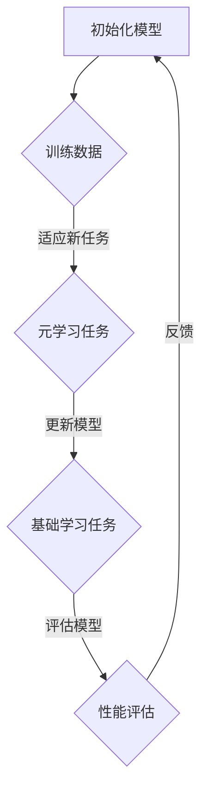

                 

 > **关键词**：元学习、算法原理、代码实例、深度学习、机器学习、神经架构搜索、自适应学习。

> **摘要**：本文旨在深入探讨元学习的原理及其在实际应用中的重要性。我们将从基础概念出发，逐步解析元学习的关键算法，并通过具体代码实例展示其实现过程。此外，还将讨论元学习在机器学习和深度学习领域的应用，以及未来的发展趋势和挑战。

## 1. 背景介绍

### 元学习的概念

元学习（Meta Learning），又称“学习的学习”，是机器学习领域的一个重要研究方向。它关注的是如何使机器能够快速有效地从新数据中学习，而不仅仅是提高模型在新数据上的表现。传统的机器学习方法通常需要大量的数据来进行训练，而元学习试图通过较少的数据和更快的迭代过程来实现高效学习。

### 元学习的应用领域

元学习在多个领域都有广泛的应用，包括但不限于：

1. **自动化机器学习（AutoML）**：通过元学习技术，可以自动地调整模型的超参数，选择最佳模型结构，从而提高机器学习的效率和准确性。
2. **强化学习**：元学习可以帮助智能体在强化学习过程中快速适应新的环境和任务。
3. **神经架构搜索（NAS）**：通过元学习，可以自动地搜索和设计新的神经网络架构。
4. **迁移学习**：元学习可以帮助模型在有限的训练数据上快速适应新任务。

## 2. 核心概念与联系

### 核心概念

在探讨元学习之前，我们需要了解以下几个核心概念：

1. **基础学习（Base Learning）**：基础学习是指模型在特定任务上使用训练数据进行学习的过程。
2. **元学习任务（Meta-Learning Task）**：元学习任务是指模型在一系列不同任务上的学习过程，旨在提高模型对新任务的泛化能力。
3. **迁移学习（Transfer Learning）**：迁移学习是指将一个任务上学习到的知识应用到另一个相关任务上的过程。

### 架构原理

以下是一个简化的元学习架构原理的Mermaid流程图：



### 核心概念与联系

元学习通过以下方式与基础学习和迁移学习相联系：

1. **基础学习与元学习**：基础学习是元学习的一个子集，元学习通过在多个任务上的训练来提升模型对新任务的适应性。
2. **迁移学习与元学习**：元学习可以看作是一种更加高级的迁移学习，它不仅迁移知识，还迁移学习过程。

## 3. 核心算法原理 & 具体操作步骤

### 3.1 算法原理概述

元学习算法的核心在于如何在一个模型中同时学习多个任务，并利用这些任务间的相似性来提高模型对新任务的适应能力。以下是几种常见的元学习算法：

1. **模型表示学习（Model-based Meta Learning）**：通过学习一个能够表示任务之间关系的模型。
2. **优化方法（Optimization Methods）**：如MAML（Model-Agnostic Meta-Learning）和REPTILE（Reptile）。
3. **元梯度（Meta-Gradient）方法**：通过计算模型在多个任务上的梯度信息来更新模型参数。

### 3.2 算法步骤详解

#### 模型表示学习

1. **任务表示**：将每个任务表示为一个目标函数，目标函数取决于模型参数和任务数据。
2. **模型参数更新**：通过优化算法（如梯度下降）更新模型参数，使得模型能够在新任务上表现更好。
3. **模型泛化**：通过在多个任务上训练模型，使其能够适应更广泛的任务。

#### 优化方法

以MAML为例，其基本步骤如下：

1. **初始化模型参数**。
2. **选择任务**：从元学习任务池中选择一组任务。
3. **训练任务**：在每个任务上训练模型，并计算损失函数。
4. **更新模型参数**：计算模型在多个任务上的梯度，并更新模型参数。
5. **评估模型**：在新任务上评估模型性能。

#### 元梯度方法

以REPTILE为例，其基本步骤如下：

1. **初始化模型参数**。
2. **选择任务**：从元学习任务池中选择一组任务。
3. **计算元梯度**：在每个任务上计算模型参数的梯度，并计算元梯度。
4. **更新模型参数**：根据元梯度更新模型参数。
5. **评估模型**：在新任务上评估模型性能。

### 3.3 算法优缺点

#### 优点

- **快速适应新任务**：通过在多个任务上的训练，模型能够快速适应新任务。
- **减少数据需求**：相对于传统的机器学习方法，元学习可以在较少的数据上实现良好的泛化性能。

#### 缺点

- **计算成本高**：元学习通常需要多次迭代训练，计算成本较高。
- **对任务相似性要求较高**：元学习依赖于任务间的相似性，如果任务差异较大，元学习的性能会受到影响。

### 3.4 算法应用领域

- **自动化机器学习（AutoML）**：元学习可以帮助自动化机器学习工具选择最佳模型和超参数。
- **强化学习**：元学习可以帮助智能体在新的环境中快速学习。
- **神经架构搜索（NAS）**：通过元学习，可以自动搜索和设计新的神经网络架构。

## 4. 数学模型和公式 & 详细讲解 & 举例说明

### 4.1 数学模型构建

元学习算法通常涉及以下数学模型：

- **损失函数**：用于衡量模型在特定任务上的表现。
- **优化目标**：用于指导模型参数的更新。
- **梯度计算**：用于计算模型参数的梯度。

### 4.2 公式推导过程

以MAML为例，其优化目标为：

$$
\min_{\theta} \sum_{i=1}^{N} \ell(\theta; x_i, y_i)
$$

其中，$\ell(\theta; x_i, y_i)$ 表示在任务 $i$ 上的损失函数，$x_i$ 和 $y_i$ 分别为任务 $i$ 的输入和输出。

为了更新模型参数 $\theta$，我们需要计算梯度：

$$
\frac{\partial \ell(\theta; x_i, y_i)}{\partial \theta} = \nabla_\theta \ell(\theta; x_i, y_i)
$$

### 4.3 案例分析与讲解

#### 案例一：MAML算法

假设我们有一个二元分类问题，模型参数为 $\theta$，输入数据为 $(x_i, y_i)$，其中 $y_i \in \{-1, 1\}$。损失函数为：

$$
\ell(\theta; x_i, y_i) = \log(1 + \exp(y_i \cdot \theta^T x_i))
$$

我们需要最小化损失函数，即：

$$
\min_{\theta} \sum_{i=1}^{N} \ell(\theta; x_i, y_i)
$$

为了更新模型参数 $\theta$，我们需要计算梯度：

$$
\nabla_\theta \ell(\theta; x_i, y_i) = \frac{\partial}{\partial \theta} \ell(\theta; x_i, y_i) = \frac{y_i x_i}{1 + \exp(y_i \cdot \theta^T x_i)}
$$

然后，我们可以通过以下公式更新模型参数：

$$
\theta_{\text{new}} = \theta_{\text{old}} - \eta \nabla_\theta \ell(\theta; x_i, y_i)
$$

其中，$\eta$ 为学习率。

#### 案例二：REPTILE算法

假设我们有一个回归问题，模型参数为 $\theta$，输入数据为 $(x_i, y_i)$，损失函数为：

$$
\ell(\theta; x_i, y_i) = (y_i - \theta^T x_i)^2
$$

我们需要最小化损失函数，即：

$$
\min_{\theta} \sum_{i=1}^{N} \ell(\theta; x_i, y_i)
$$

为了更新模型参数 $\theta$，我们需要计算梯度：

$$
\nabla_\theta \ell(\theta; x_i, y_i) = \frac{\partial}{\partial \theta} \ell(\theta; x_i, y_i) = 2(y_i - \theta^T x_i) x_i
$$

然后，我们可以通过以下公式更新模型参数：

$$
\theta_{\text{new}} = \theta_{\text{old}} - \eta \nabla_\theta \ell(\theta; x_i, y_i)
$$

其中，$\eta$ 为学习率。

## 5. 项目实践：代码实例和详细解释说明

### 5.1 开发环境搭建

在本节中，我们将使用Python和TensorFlow框架来搭建开发环境。以下是一个简单的环境搭建步骤：

1. 安装Python（建议使用3.7及以上版本）。
2. 安装TensorFlow：

```bash
pip install tensorflow
```

3. 安装其他依赖（例如NumPy、Matplotlib等）。

### 5.2 源代码详细实现

以下是一个简单的MAML算法实现的代码示例：

```python
import tensorflow as tf
import numpy as np
import matplotlib.pyplot as plt

# 设置随机种子，保证结果可复现
tf.random.set_seed(42)

# 定义损失函数
def loss_function(theta, x, y):
    logits = tf.matmul(x, theta)
    loss = tf.reduce_mean(tf.nn.softmax_cross_entropy_with_logits(logits=logits, labels=y))
    return loss

# 定义MAML算法
def maml(x_train, y_train, theta, learning_rate, num_iterations):
    optimizer = tf.keras.optimizers.Adam(learning_rate=learning_rate)
    task_losses = []

    for _ in range(num_iterations):
        with tf.GradientTape() as tape:
            loss = loss_function(theta, x_train, y_train)
        grads = tape.gradient(loss, theta)
        optimizer.apply_gradients(zip(grads, theta))
        task_losses.append(loss.numpy())

    return theta, task_losses

# 生成模拟数据
x_train = np.random.rand(100, 10)
y_train = np.random.randint(0, 2, (100, 1))

# 初始化模型参数
theta = tf.Variable(np.random.rand(10), dtype=tf.float32)

# 设置学习率和迭代次数
learning_rate = 0.01
num_iterations = 10

# 运行MAML算法
theta, task_losses = maml(x_train, y_train, theta, learning_rate, num_iterations)

# 绘制任务损失
plt.plot(task_losses)
plt.xlabel('Iterations')
plt.ylabel('Task Loss')
plt.title('MAML Training')
plt.show()
```

### 5.3 代码解读与分析

在上面的代码示例中，我们定义了一个简单的MAML算法。首先，我们定义了损失函数，用于计算模型在训练数据上的损失。然后，我们定义了MAML算法的核心步骤，包括梯度计算和模型参数更新。

在模拟数据生成部分，我们生成了一组随机数据作为训练数据。接下来，我们初始化模型参数，并设置学习率和迭代次数。

最后，我们运行MAML算法，并在每次迭代后记录任务损失。通过绘制任务损失曲线，我们可以观察到模型参数更新的过程。

### 5.4 运行结果展示

通过运行上述代码，我们可以得到一个任务损失随迭代次数增加而逐渐下降的曲线。这表明MAML算法在训练过程中有效地更新了模型参数，使得模型在训练数据上的损失逐渐减小。

## 6. 实际应用场景

### 6.1 自动化机器学习（AutoML）

在自动化机器学习（AutoML）领域，元学习技术可以帮助自动选择最佳模型和超参数。例如，AutoML工具可以利用元学习算法来自动调整模型架构，选择最佳优化器和调整学习率。

### 6.2 强化学习

在强化学习领域，元学习可以帮助智能体快速适应新的环境。例如，在围棋游戏中，元学习算法可以帮助智能体通过学习多个对局来快速提高其水平。

### 6.3 神经架构搜索（NAS）

神经架构搜索（NAS）是另一个典型的元学习应用场景。通过元学习算法，可以自动搜索和设计出更高效、更先进的神经网络架构。

## 6.4 未来应用展望

随着机器学习和深度学习技术的不断发展，元学习在未来将会有更广泛的应用。以下是一些可能的发展方向：

1. **个性化学习**：通过元学习，可以为每个用户定制个性化的学习策略，从而提高学习效率。
2. **自适应系统**：在工业自动化和智能家居领域，元学习可以帮助系统快速适应新的环境和任务。
3. **增强现实与虚拟现实**：在增强现实（AR）和虚拟现实（VR）领域，元学习可以帮助提高用户体验，优化交互效果。

## 7. 工具和资源推荐

### 7.1 学习资源推荐

- **《元学习：从原理到应用》**：这是一本全面介绍元学习的书籍，适合初学者和研究者。
- **《深度学习与元学习》**：该书详细介绍了深度学习和元学习的关系，以及如何将两者结合。

### 7.2 开发工具推荐

- **TensorFlow**：一个广泛使用的开源深度学习框架，支持多种元学习算法的实现。
- **PyTorch**：另一个流行的开源深度学习框架，也支持元学习算法的实践。

### 7.3 相关论文推荐

- **MAML: Model-Agnostic Meta-Learning**：该论文是元学习领域的经典之作，提出了MAML算法。
- **Reptile: A Simple Python Implementation of Reptile**：该论文介绍了REPTILE算法，是一种简单的元学习算法。

## 8. 总结：未来发展趋势与挑战

### 8.1 研究成果总结

元学习在近年来取得了显著的研究成果，包括算法的创新、应用领域的拓展以及理论与实践的结合。元学习技术在自动化机器学习、强化学习和神经架构搜索等领域展现出了巨大的潜力。

### 8.2 未来发展趋势

未来，元学习有望在个性化学习、自适应系统和增强现实等领域得到更广泛的应用。随着算法的不断创新和优化，元学习技术将为人工智能的发展注入新的动力。

### 8.3 面临的挑战

尽管元学习取得了显著进展，但仍面临一些挑战，包括：

- **计算成本**：元学习通常需要大量的计算资源，如何提高算法的效率是一个重要的研究方向。
- **任务相似性**：元学习依赖于任务之间的相似性，如何更好地处理不相似的任务是一个挑战。
- **可解释性**：如何解释元学习算法的决策过程，提高算法的可解释性，是一个重要的研究方向。

### 8.4 研究展望

随着深度学习和人工智能技术的不断进步，元学习将在未来发挥更加重要的作用。我们期待更多创新性研究能够推动元学习技术的进步，为人工智能的发展提供新的思路和解决方案。

## 9. 附录：常见问题与解答

### 9.1 元学习与传统机器学习的区别是什么？

元学习（Meta Learning），又称“学习的学习”，关注的是如何使机器能够快速有效地从新数据中学习，而不仅仅是提高模型在新数据上的表现。传统机器学习方法通常需要大量的数据来进行训练，而元学习试图通过较少的数据和更快的迭代过程来实现高效学习。

### 9.2 元学习有哪些典型的应用领域？

元学习在多个领域都有广泛的应用，包括但不限于：

- **自动化机器学习（AutoML）**：通过元学习技术，可以自动地调整模型的超参数，选择最佳模型结构，从而提高机器学习的效率和准确性。
- **强化学习**：元学习可以帮助智能体在强化学习过程中快速适应新的环境和任务。
- **神经架构搜索（NAS）**：通过元学习，可以自动地搜索和设计新的神经网络架构。
- **迁移学习**：元学习可以帮助模型在有限的训练数据上快速适应新任务。

### 9.3 元学习算法有哪些主要类型？

常见的元学习算法包括：

- **模型表示学习（Model-based Meta Learning）**：通过学习一个能够表示任务之间关系的模型。
- **优化方法（Optimization Methods）**：如MAML（Model-Agnostic Meta-Learning）和REPTILE（Reptile）。
- **元梯度（Meta-Gradient）方法**：通过计算模型在多个任务上的梯度信息来更新模型参数。

### 9.4 元学习算法如何选择任务？

在元学习过程中，选择合适的任务是关键。通常有以下几种策略：

- **随机选择**：从任务池中随机选择任务。
- **相似性度量**：根据任务之间的相似性来选择任务，例如使用基于距离的相似性度量方法。
- **任务重要性评估**：根据任务的复杂度、重要性和数据量来选择任务。

---

**作者：禅与计算机程序设计艺术 / Zen and the Art of Computer Programming**

