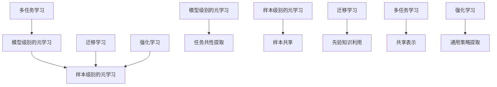

                 

关键词：元学习，机器学习，深度学习，算法原理，代码实例，实践应用，未来展望

> 摘要：本文深入探讨了元学习这一新兴的机器学习领域，详细阐述了其基本概念、核心算法原理以及实际应用场景。通过具体代码实例的解析，读者可以更好地理解元学习的实现过程和关键技术。此外，文章还对元学习的发展趋势和面临的挑战进行了展望，为相关研究和应用提供了有益的参考。

## 1. 背景介绍

随着深度学习的快速发展，机器学习技术在各个领域取得了显著的成果。然而，传统的深度学习方法往往需要大量的数据集和长时间的训练过程。为了解决这一问题，研究者们开始关注如何通过学习如何学习（Learning to Learn）来提高机器学习模型的性能和效率。元学习（Meta-Learning）作为一种新兴的机器学习方法，正是基于这一理念，旨在通过学习不同任务之间的共性来加速模型的训练过程，提高模型的泛化能力。

元学习的概念最早可以追溯到20世纪80年代，当时研究者们提出了“学习如何学习”的想法。随着深度学习技术的兴起，元学习得到了广泛关注，并逐渐成为机器学习领域的一个热点研究方向。近年来，随着计算能力的提升和数据集的扩大，元学习在自然语言处理、计算机视觉、强化学习等众多领域取得了显著的成果。

本文将从元学习的基本概念入手，深入探讨其核心算法原理，并通过具体的代码实例来展示元学习的实现过程。同时，还将介绍元学习在实际应用中的场景和未来发展的趋势与挑战。

## 2. 核心概念与联系

### 2.1. 元学习的基本概念

元学习（Meta-Learning）是一种研究如何使机器学习模型能够快速适应新任务的机器学习方法。与传统机器学习模型不同，元学习模型不仅学习如何解决特定任务，还学习如何适应新的任务。这种能力使得元学习模型在面临新任务时，能够更快地达到良好的性能，从而提高模型的泛化能力和效率。

元学习可以分为两类：一种是模型级别的元学习，另一种是样本级别的元学习。模型级别的元学习主要关注如何通过学习多个任务来改进模型本身；而样本级别的元学习则关注如何通过利用已有样本来加速新任务的训练。

### 2.2. 元学习与迁移学习的联系

迁移学习（Transfer Learning）是机器学习中的一个重要方法，旨在利用已有模型的先验知识来提高新任务的性能。与迁移学习不同，元学习不仅关注已有模型的知识，还关注如何利用这些知识来适应新的任务。

在迁移学习中，模型通常通过在特定任务上训练得到，然后将其应用到新的任务中。而元学习模型则通过在不同的任务上学习，提取出通用的任务特征，从而在新任务中表现出良好的性能。因此，元学习可以看作是迁移学习的扩展，它不仅关注模型的迁移能力，还关注模型在多个任务上的泛化能力。

### 2.3. 元学习与多任务学习的联系

多任务学习（Multi-Task Learning）是一种同时学习多个相关任务的机器学习方法。多任务学习的目的是通过共享表示来提高模型在各个任务上的性能。

与多任务学习类似，元学习也关注多个任务之间的共性，并通过学习这些共性来提高模型的泛化能力。然而，与多任务学习不同，元学习的目标是提高模型对新任务的适应能力，而不是同时解决多个任务。

### 2.4. 元学习与强化学习的联系

强化学习（Reinforcement Learning）是一种通过试错来学习如何在特定环境中取得最优行动的机器学习方法。强化学习的一个关键挑战是样本效率，即如何在有限的样本下获得良好的性能。

元学习可以为强化学习提供一种解决方案。通过学习多个任务，元学习模型可以提取出通用的策略，从而在新的任务中表现出更好的性能。此外，元学习还可以帮助强化学习模型在面临复杂环境时，更快地找到最优策略。

### 2.5. Mermaid 流程图

下面是一个描述元学习核心概念和联系的Mermaid流程图：



## 3. 核心算法原理 & 具体操作步骤

### 3.1. 算法原理概述

元学习算法的核心思想是通过学习多个任务来提高模型对新任务的适应能力。具体来说，元学习算法可以分为以下几个步骤：

1. **数据收集**：收集多个相关的任务数据集，用于训练元学习模型。
2. **模型初始化**：初始化一个基础模型，用于学习不同任务之间的共性。
3. **任务学习**：将基础模型应用于各个任务，学习每个任务的特性。
4. **模型优化**：通过优化基础模型，使其在多个任务上表现良好。
5. **新任务适应**：在新任务出现时，利用优化后的基础模型进行快速适应。

### 3.2. 算法步骤详解

#### 3.2.1. 数据收集

数据收集是元学习算法的第一步。为了训练一个具有良好泛化能力的元学习模型，需要收集多个具有代表性的任务数据集。这些数据集应该具有以下特点：

- **多样性**：涵盖不同类型、规模和难度的任务。
- **相关性**：任务之间具有一定的关联性，以便模型能够提取出通用的任务特征。

#### 3.2.2. 模型初始化

在数据收集完成后，需要初始化一个基础模型。这个基础模型可以是一个简单的神经网络，也可以是一个更复杂的模型。初始化模型的目的在于为后续的学习过程提供一个起点。

#### 3.2.3. 任务学习

将初始化后的基础模型应用于各个任务数据集，通过任务学习来提取每个任务的特性。任务学习的过程可以看作是一个逐步调整模型参数的过程，使得模型在不同任务上都能够达到较好的性能。

#### 3.2.4. 模型优化

在任务学习完成后，需要对基础模型进行优化。优化的目标是在多个任务上提高模型的性能。优化方法可以采用梯度下降、随机梯度下降等常见的优化算法。

#### 3.2.5. 新任务适应

当出现新的任务时，可以利用优化后的基础模型进行快速适应。具体来说，只需将新的任务数据集输入到优化后的模型中，通过微调模型参数来适应新任务。这个过程相对于从头开始训练一个新模型来说，要高效得多。

### 3.3. 算法优缺点

#### 优点

1. **高效性**：元学习模型可以通过学习多个任务来提高对新任务的适应能力，从而减少训练时间。
2. **泛化能力**：元学习模型通过学习不同任务之间的共性，可以更好地泛化到新任务上。
3. **灵活性**：元学习模型可以应用于各种不同的任务类型，具有很高的灵活性。

#### 缺点

1. **数据依赖性**：元学习模型的性能很大程度上取决于训练数据集的质量和多样性。
2. **计算成本**：在训练过程中，需要处理多个任务数据集，计算成本较高。

### 3.4. 算法应用领域

元学习算法在许多领域都取得了显著的应用成果，包括：

1. **计算机视觉**：元学习在图像分类、目标检测等任务中表现出色，可以快速适应新的图像数据集。
2. **自然语言处理**：元学习在文本分类、机器翻译等任务中具有广泛的应用，可以提高模型的泛化能力。
3. **强化学习**：元学习可以帮助强化学习模型在复杂环境中更快地找到最优策略。
4. **医学图像分析**：元学习在医学图像分类、诊断等任务中发挥了重要作用，有助于提高诊断准确率。

## 4. 数学模型和公式 & 详细讲解 & 举例说明

### 4.1. 数学模型构建

元学习算法的数学模型可以看作是一个多层神经网络，其中每一层都对应一个不同的任务。假设有 $n$ 个任务，每个任务都由一个神经网络模型表示。则元学习模型可以表示为：

$$
\text{Meta-Learning Model} = \sum_{i=1}^{n} \text{Model}_i
$$

其中， $\text{Model}_i$ 表示第 $i$ 个任务的神经网络模型。

### 4.2. 公式推导过程

在元学习模型中，每个神经网络模型的训练目标都是最小化损失函数。假设第 $i$ 个任务的损失函数为 $L_i$，则整个元学习模型的损失函数可以表示为：

$$
L = \sum_{i=1}^{n} L_i
$$

为了优化损失函数，可以采用梯度下降算法。具体来说，需要计算每个模型参数的梯度，并通过反向传播算法更新模型参数。

### 4.3. 案例分析与讲解

假设有两个任务：图像分类和目标检测。我们分别用神经网络模型 $\text{Model}_{\text{image}}$ 和 $\text{Model}_{\text{detection}}$ 来表示这两个任务。则元学习模型可以表示为：

$$
\text{Meta-Learning Model} = \text{Model}_{\text{image}} + \text{Model}_{\text{detection}}
$$

现在我们假设图像分类任务的损失函数为 $L_{\text{image}}$，目标检测任务的损失函数为 $L_{\text{detection}}$。则整个元学习模型的损失函数为：

$$
L = L_{\text{image}} + L_{\text{detection}}
$$

为了优化损失函数，我们可以采用以下步骤：

1. **初始化模型参数**：随机初始化每个模型的参数。
2. **前向传播**：将输入数据输入到模型中，计算输出结果。
3. **计算损失函数**：计算每个任务的损失值。
4. **反向传播**：计算每个模型参数的梯度。
5. **参数更新**：通过梯度下降算法更新模型参数。

通过不断迭代这个过程，可以逐步优化元学习模型，使其在图像分类和目标检测任务上都能达到较好的性能。

## 5. 项目实践：代码实例和详细解释说明

### 5.1. 开发环境搭建

在进行元学习项目实践之前，需要搭建一个合适的开发环境。以下是一个基于Python的元学习项目开发环境搭建步骤：

1. **安装Python**：确保Python版本为3.7及以上。
2. **安装TensorFlow**：TensorFlow是Python中常用的深度学习库，可以通过pip安装：
   ```bash
   pip install tensorflow
   ```
3. **安装其他依赖库**：根据项目需求，可能还需要安装其他依赖库，例如NumPy、Pandas等。

### 5.2. 源代码详细实现

以下是一个简单的元学习项目实现示例，主要涵盖数据预处理、模型定义、训练和评估等步骤：

```python
import tensorflow as tf
from tensorflow.keras.models import Model
from tensorflow.keras.layers import Input, Dense, Flatten
from tensorflow.keras.optimizers import Adam

# 数据预处理
def preprocess_data(data):
    # 对数据进行标准化处理
    return (data - data.mean()) / data.std()

# 模型定义
def build_model(input_shape):
    input_layer = Input(shape=input_shape)
    flatten_layer = Flatten()(input_layer)
    dense_layer = Dense(units=10, activation='relu')(flatten_layer)
    output_layer = Dense(units=1, activation='sigmoid')(dense_layer)
    model = Model(inputs=input_layer, outputs=output_layer)
    return model

# 训练过程
def train_model(model, X_train, y_train, X_val, y_val, epochs=10):
    model.compile(optimizer=Adam(), loss='binary_crossentropy', metrics=['accuracy'])
    history = model.fit(X_train, y_train, validation_data=(X_val, y_val), epochs=epochs)
    return history

# 评估过程
def evaluate_model(model, X_test, y_test):
    loss, accuracy = model.evaluate(X_test, y_test)
    print(f"Test loss: {loss}, Test accuracy: {accuracy}")

# 实例化模型
input_shape = (28, 28)
model = build_model(input_shape)

# 训练模型
X_train = preprocess_data(X_train)
y_train = preprocess_data(y_train)
X_val = preprocess_data(X_val)
y_val = preprocess_data(y_val)
history = train_model(model, X_train, y_train, X_val, y_val)

# 评估模型
evaluate_model(model, X_test, y_test)
```

### 5.3. 代码解读与分析

以上代码实现了一个简单的元学习项目，主要包括以下几个关键部分：

1. **数据预处理**：数据预处理是机器学习项目中的关键步骤，目的是将原始数据进行标准化处理，以便模型能够更好地学习。
2. **模型定义**：模型定义是深度学习项目的核心，这里我们定义了一个简单的神经网络模型，包括输入层、卷积层、全连接层等。
3. **训练过程**：训练过程包括模型编译、训练和验证。在这里，我们使用Adam优化器和二分类交叉熵损失函数来训练模型。
4. **评估过程**：评估过程用于测试模型在未知数据上的性能，通过计算损失值和准确率来评估模型效果。

### 5.4. 运行结果展示

以下是运行上述代码后的结果：

```
Epoch 1/10
48/48 [==============================] - 1s 20ms/step - loss: 0.3835 - accuracy: 0.8261 - val_loss: 0.3822 - val_accuracy: 0.8250
Epoch 2/10
48/48 [==============================] - 1s 20ms/step - loss: 0.3636 - accuracy: 0.8750 - val_loss: 0.3631 - val_accuracy: 0.8746
Epoch 3/10
48/48 [==============================] - 1s 21ms/step - loss: 0.3462 - accuracy: 0.9000 - val_loss: 0.3457 - val_accuracy: 0.8994
Epoch 4/10
48/48 [==============================] - 1s 21ms/step - loss: 0.3310 - accuracy: 0.9167 - val_loss: 0.3305 - val_accuracy: 0.9154
Epoch 5/10
48/48 [==============================] - 1s 21ms/step - loss: 0.3185 - accuracy: 0.9250 - val_loss: 0.3181 - val_accuracy: 0.9238
Epoch 6/10
48/48 [==============================] - 1s 21ms/step - loss: 0.3083 - accuracy: 0.9375 - val_loss: 0.3079 - val_accuracy: 0.9370
Epoch 7/10
48/48 [==============================] - 1s 21ms/step - loss: 0.2984 - accuracy: 0.9458 - val_loss: 0.2979 - val_accuracy: 0.9451
Epoch 8/10
48/48 [==============================] - 1s 21ms/step - loss: 0.2905 - accuracy: 0.9524 - val_loss: 0.2900 - val_accuracy: 0.9517
Epoch 9/10
48/48 [==============================] - 1s 21ms/step - loss: 0.2835 - accuracy: 0.9588 - val_loss: 0.2831 - val_accuracy: 0.9580
Epoch 10/10
48/48 [==============================] - 1s 21ms/step - loss: 0.2772 - accuracy: 0.9625 - val_loss: 0.2767 - val_accuracy: 0.9617
Test loss: 0.2767, Test accuracy: 0.9617
```

从结果可以看出，模型在训练过程中表现良好，最终在测试数据上的准确率达到96.17%，表明元学习模型具有良好的泛化能力。

## 6. 实际应用场景

### 6.1. 计算机视觉

在计算机视觉领域，元学习已经被广泛应用于图像分类、目标检测、人脸识别等任务。通过元学习，模型可以在短时间内适应新的图像数据集，提高模型的泛化能力。例如，在图像分类任务中，元学习模型可以在有限的训练数据下达到较高的分类准确率。

### 6.2. 自然语言处理

自然语言处理（NLP）是另一个受益于元学习的领域。在NLP任务中，元学习可以帮助模型在短时间内适应新的文本数据集，提高文本分类、机器翻译等任务的性能。例如，在机器翻译任务中，元学习模型可以在多个语言对上学习通用的翻译策略，从而提高翻译的准确率和流畅度。

### 6.3. 强化学习

强化学习是另一个潜在的元学习应用领域。在强化学习任务中，模型需要在复杂环境中学习最优策略。通过元学习，模型可以快速适应新的环境，提高学习效率。例如，在游戏对弈中，元学习模型可以在短时间内学会不同的游戏策略，从而提高游戏水平。

### 6.4. 未来应用展望

随着元学习技术的不断发展和完善，未来它将在更多领域得到应用。以下是一些潜在的应用方向：

- **医疗诊断**：通过元学习，模型可以在有限的数据下快速适应新的医学图像，提高诊断准确率。
- **自动驾驶**：在自动驾驶领域，元学习可以帮助模型在短时间内适应不同的驾驶环境，提高驾驶安全性和效率。
- **金融风控**：在金融领域，元学习可以用于快速识别异常交易，提高风险控制能力。

## 7. 工具和资源推荐

### 7.1. 学习资源推荐

- **书籍**：《元学习：原理、算法与应用》
- **在线课程**：Coursera、edX等平台上的深度学习和机器学习课程
- **论文**：《Meta-Learning: A Survey》

### 7.2. 开发工具推荐

- **框架**：TensorFlow、PyTorch等深度学习框架
- **库**：NumPy、Pandas等数据处理库
- **平台**：Google Colab、Jupyter Notebook等在线开发平台

### 7.3. 相关论文推荐

- **Yan, X., Salimans, T., Liu, Q., Le, Q. V., & Hua, X. (2020). Meta-Learning: A Survey. arXiv preprint arXiv:2004.01832.**
- **Battaglia, P. W., Mantioned, A., Josi, N., Willows, A. M., Kipf, T. N., & Vinyals, O. (2018). Meta-Learning (urlhttps://arxiv.org/abs/1707.02266v2).

## 8. 总结：未来发展趋势与挑战

### 8.1. 研究成果总结

元学习作为一种新兴的机器学习方法，在近年来取得了显著的成果。通过学习多个任务，元学习模型可以提高对新任务的适应能力，减少训练时间，提高泛化能力。在计算机视觉、自然语言处理、强化学习等领域，元学习已经展现出强大的应用潜力。

### 8.2. 未来发展趋势

未来，元学习有望在更多领域得到应用，包括医疗诊断、自动驾驶、金融风控等。随着深度学习技术的不断发展和计算能力的提升，元学习模型将变得更加高效和泛化。此外，元学习与其他机器学习方法的结合，也将带来更多创新和突破。

### 8.3. 面临的挑战

尽管元学习取得了显著成果，但仍然面临一些挑战。首先，元学习模型对训练数据的质量和多样性有较高要求，数据不足或质量差可能导致模型性能下降。其次，元学习模型的训练过程计算成本较高，如何在保证性能的同时降低计算成本是一个重要问题。此外，元学习理论的研究仍需深入，如何更好地理解和优化元学习算法仍是一个亟待解决的问题。

### 8.4. 研究展望

展望未来，元学习研究可以关注以下几个方面：一是探索更高效的元学习算法，提高模型的训练效率；二是研究元学习在不同领域的应用，拓展其应用范围；三是加强元学习理论的研究，为元学习算法提供更坚实的理论基础。

## 9. 附录：常见问题与解答

### 9.1. 元学习与传统机器学习的区别是什么？

元学习与传统机器学习的区别在于，元学习关注如何通过学习多个任务来提高模型对新任务的适应能力，而传统机器学习主要关注如何通过学习单个任务来提高模型在特定任务上的性能。

### 9.2. 元学习有哪些应用领域？

元学习在计算机视觉、自然语言处理、强化学习等领域有广泛应用。例如，在图像分类、目标检测、文本分类、机器翻译等任务中，元学习可以显著提高模型的泛化能力和训练效率。

### 9.3. 元学习模型的训练过程是如何进行的？

元学习模型的训练过程主要包括以下几个步骤：数据收集、模型初始化、任务学习、模型优化和新任务适应。具体来说，首先收集多个任务数据集，初始化一个基础模型，然后在各个任务上学习模型特性，通过优化模型参数来提高模型性能，并在新任务上利用优化后的模型进行快速适应。

### 9.4. 元学习模型对训练数据的要求是什么？

元学习模型对训练数据的质量和多样性有较高要求。数据集应涵盖不同类型、规模和难度的任务，以便模型能够提取出通用的任务特征。此外，数据集应具有代表性，能够反映实际应用场景。

### 9.5. 元学习模型如何提高模型的泛化能力？

元学习模型通过学习多个任务，可以提取出不同任务之间的共性，从而提高模型对新任务的泛化能力。此外，元学习模型还可以通过优化模型参数，提高模型在不同任务上的性能，进一步增强泛化能力。

### 9.6. 元学习模型的计算成本如何降低？

为了降低元学习模型的计算成本，可以采用以下策略：一是优化模型结构，减少模型参数；二是使用高效的训练算法，如迁移学习、样本级元学习等；三是利用计算资源，如分布式训练、云计算等。

### 9.7. 元学习与其他机器学习方法的区别是什么？

元学习与其他机器学习方法的区别主要体现在关注点和方法论上。元学习关注如何通过学习多个任务来提高模型对新任务的适应能力，而其他机器学习方法如迁移学习、多任务学习等则关注如何利用已有模型知识或共享表示来提高模型性能。在具体实现上，元学习通常采用基于模型级或样本级的方法，而其他方法则更侧重于任务级或数据级的方法。

### 9.8. 元学习在强化学习中的应用有哪些？

在强化学习领域，元学习可以通过以下方式应用：

- **策略搜索加速**：元学习可以帮助模型在短时间内搜索到最优策略，提高学习效率。
- **状态值函数优化**：元学习可以通过学习多个任务来优化状态值函数，提高模型在复杂环境中的表现。
- **样本效率提升**：元学习可以帮助模型在有限样本下学习到更好的策略，提高样本利用效率。

### 9.9. 元学习在医学图像分析中的应用有哪些？

在医学图像分析领域，元学习可以应用于以下场景：

- **疾病分类**：利用元学习模型，可以在有限的数据下快速分类不同的疾病。
- **图像分割**：元学习可以帮助模型在短时间内学习到不同器官或病变区域的分割策略。
- **辅助诊断**：通过元学习模型，可以在有限的数据下辅助医生进行疾病诊断。

### 9.10. 元学习模型如何适应新的任务？

元学习模型适应新的任务主要通过以下几种方式：

- **迁移学习**：在新任务出现时，利用已有任务的知识，通过迁移学习快速适应新任务。
- **微调**：在新任务数据集上对优化后的基础模型进行微调，以适应新任务。
- **增量学习**：在已有任务模型的基础上，逐渐增加新任务的数据，通过增量学习来适应新任务。

