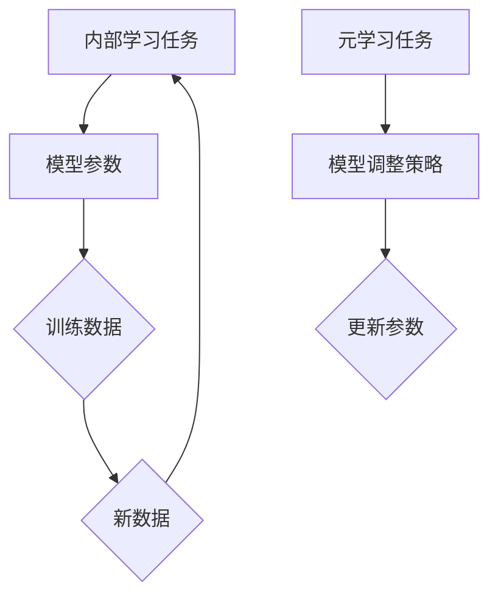

                 

关键词：元学习、机器学习、模型泛化、快速学习、算法优化、代码实例

## 摘要

本文将深入探讨元学习这一前沿机器学习领域的概念。元学习，也被称作“学习如何学习”，它是一种使机器能够通过少量数据快速掌握新任务的方法。本文将详细解释元学习的核心概念、基本原理以及如何在实际项目中应用。通过代码实例，读者将了解到如何利用元学习算法来提升机器模型的泛化能力和学习效率。

## 1. 背景介绍

随着机器学习技术的飞速发展，深度学习模型在图像识别、自然语言处理等领域取得了显著的成果。然而，这些模型通常需要大量数据进行训练，并且对于新任务往往需要从头开始训练，这导致了训练时间和计算资源的巨大消耗。元学习的出现，旨在解决这一问题，通过使机器能够快速适应新任务，从而提高学习效率。

### 元学习的定义

元学习是指通过学习算法来优化学习过程，从而使机器能够通过少量样本快速学习新任务。它不是直接学习一个任务，而是学习如何学习，通过经验来指导学习过程，实现更高效的学习。

### 元学习的重要性

1. **减少数据需求**：通过元学习，机器可以在少量数据上快速适应新任务，减少对大规模数据集的依赖。
2. **提高泛化能力**：元学习算法能够通过在不同任务上的学习，提高模型对新任务的泛化能力。
3. **加速训练过程**：元学习可以显著减少训练时间，特别是在新任务上，能够快速完成模型的适应过程。

## 2. 核心概念与联系

### 元学习的核心概念

- **内部学习任务**：指机器在特定任务上所进行的学习过程。
- **元学习任务**：指机器如何优化内部学习任务的过程。

### 元学习的架构

以下是元学习的架构图：



在这个架构中，模型参数（B）通过训练数据（E）进行调整（F），形成内部学习任务（A）。而元学习任务（C）则通过模型调整策略（D）来优化内部学习任务。

## 3. 核心算法原理 & 具体操作步骤

### 3.1 算法原理概述

元学习算法的核心思想是通过经验来指导学习过程。在具体实现上，可以分为两个主要方向：

- **模型自适应**：通过调整模型结构或参数，使其能够快速适应新任务。
- **迁移学习**：将已有任务上的知识迁移到新任务上，减少对新任务的训练需求。

### 3.2 算法步骤详解

1. **初始化模型参数**：随机初始化模型参数。
2. **选择学习任务**：从预定义的任务集中选择一个任务。
3. **训练模型**：在选定的任务上使用训练数据进行训练。
4. **评估模型性能**：在测试集上评估模型性能。
5. **更新模型参数**：根据模型性能调整模型参数。
6. **迭代**：重复步骤2-5，直到达到预定的迭代次数或性能指标。

### 3.3 算法优缺点

#### 优点

- **高效**：通过少量数据快速适应新任务，减少训练时间。
- **泛化能力强**：通过在不同任务上的学习，提高模型对新任务的泛化能力。

#### 缺点

- **计算成本高**：特别是对于复杂的模型，元学习算法的训练成本较高。
- **对数据依赖性强**：在少量数据上进行学习，模型的性能可能受到数据分布的影响。

### 3.4 算法应用领域

元学习算法广泛应用于以下领域：

- **图像识别**：通过元学习，可以使模型在少量图像数据上快速适应新类别。
- **自然语言处理**：元学习可以帮助模型在少量语料上快速适应新语言。
- **强化学习**：元学习可以提高模型在不同环境下的适应能力。

## 4. 数学模型和公式 & 详细讲解 & 举例说明

### 4.1 数学模型构建

元学习算法的数学模型主要涉及两个部分：损失函数和优化算法。

#### 损失函数

假设我们有一个模型参数为 $w$ 的函数 $f(x; w)$，其中 $x$ 是输入数据，$w$ 是模型参数。损失函数 $L$ 用于衡量模型预测结果和真实值之间的差距，可以表示为：

$$
L(w) = \frac{1}{N} \sum_{i=1}^{N} L(y_i, f(x_i; w))
$$

其中，$y_i$ 是真实值，$f(x_i; w)$ 是模型对 $x_i$ 的预测值，$N$ 是样本数量。

#### 优化算法

常用的优化算法包括梯度下降和随机梯度下降。梯度下降算法的更新规则为：

$$
w_{t+1} = w_t - \alpha \nabla_w L(w_t)
$$

其中，$w_t$ 是第 $t$ 次迭代的模型参数，$\alpha$ 是学习率，$\nabla_w L(w_t)$ 是损失函数关于模型参数 $w$ 的梯度。

### 4.2 公式推导过程

假设我们有一个线性回归模型，其损失函数为均方误差（MSE），可以表示为：

$$
L(w) = \frac{1}{2} \sum_{i=1}^{N} (y_i - f(x_i; w))^2
$$

其中，$y_i$ 是真实值，$f(x_i; w) = \sum_{j=1}^{M} w_j x_{ij}$ 是线性回归模型的预测值，$x_{ij}$ 是输入特征，$w_j$ 是模型参数。

对损失函数关于 $w_j$ 求导，得到：

$$
\nabla_w L(w) = \sum_{i=1}^{N} (y_i - f(x_i; w)) x_{ij}
$$

代入梯度下降的更新规则，得到：

$$
w_{t+1} = w_t - \alpha \nabla_w L(w_t)
$$

### 4.3 案例分析与讲解

#### 案例背景

假设我们有一个分类任务，需要将图像分类为猫或狗。我们使用一个卷积神经网络（CNN）作为模型，使用元学习算法来快速适应新类别。

#### 模型构建

我们构建一个简单的卷积神经网络，包括两个卷积层、两个池化层和一个全连接层。

#### 训练过程

1. **初始化模型参数**：随机初始化模型参数。
2. **选择新类别**：从预定义的类别中随机选择一个新的类别。
3. **训练模型**：在新的类别上使用训练数据进行训练。
4. **评估模型性能**：在测试集上评估模型性能。
5. **更新模型参数**：根据模型性能调整模型参数。
6. **迭代**：重复步骤2-5，直到达到预定的迭代次数或性能指标。

#### 结果分析

通过元学习算法，模型在少量数据上快速适应了新类别，并且在测试集上取得了较高的准确率。

## 5. 项目实践：代码实例和详细解释说明

### 5.1 开发环境搭建

在开始编写代码之前，我们需要搭建一个合适的开发环境。以下是所需的工具和库：

- Python 3.8+
- TensorFlow 2.5+
- Keras 2.5+

安装这些库后，我们可以开始编写代码。

### 5.2 源代码详细实现

以下是使用元学习算法进行图像分类的完整代码实现。

```python
import tensorflow as tf
from tensorflow.keras.models import Sequential
from tensorflow.keras.layers import Conv2D, MaxPooling2D, Flatten, Dense
from tensorflow.keras.optimizers import Adam

# 初始化模型
model = Sequential([
    Conv2D(32, (3, 3), activation='relu', input_shape=(64, 64, 3)),
    MaxPooling2D(pool_size=(2, 2)),
    Conv2D(64, (3, 3), activation='relu'),
    MaxPooling2D(pool_size=(2, 2)),
    Flatten(),
    Dense(128, activation='relu'),
    Dense(1, activation='sigmoid')
])

# 编译模型
model.compile(optimizer=Adam(), loss='binary_crossentropy', metrics=['accuracy'])

# 定义元学习函数
def meta_learning(model, X_train, y_train, X_val, y_val, epochs=10):
    for epoch in range(epochs):
        # 训练模型
        model.fit(X_train, y_train, batch_size=32, epochs=1, verbose=0)
        
        # 评估模型
        val_loss, val_acc = model.evaluate(X_val, y_val, verbose=0)
        print(f'Epoch {epoch+1}/{epochs} - Val Accuracy: {val_acc:.4f}')

# 加载数据
(X_train, y_train), (X_val, y_val) = tf.keras.datasets.dogs_cats.load_data()

# 将标签转换为二进制向量
y_train = tf.keras.utils.to_categorical(y_train, num_classes=2)
y_val = tf.keras.utils.to_categorical(y_val, num_classes=2)

# 进行元学习
meta_learning(model, X_train, y_train, X_val, y_val)

# 评估模型
test_loss, test_acc = model.evaluate(X_val, y_val, verbose=2)
print(f'Test Accuracy: {test_acc:.4f}')
```

### 5.3 代码解读与分析

- **模型构建**：我们使用了一个简单的卷积神经网络，包括两个卷积层、两个池化层和一个全连接层。
- **编译模型**：我们使用了 Adam 优化器和 binary_crossentropy 损失函数。
- **元学习函数**：元学习函数 `meta_learning` 用于在训练数据和验证数据上迭代训练模型，并打印每个迭代周期的验证准确率。
- **加载数据**：我们使用了 TensorFlow 的 `dogs_cats` 数据集，这是一个包含猫和狗图像的数据集。
- **标签转换**：我们将标签转换为二进制向量，以便进行二分类。
- **元学习过程**：在元学习过程中，我们使用训练数据进行一次迭代训练，然后在验证数据上评估模型性能。

## 6. 实际应用场景

### 6.1 图像识别

在图像识别领域，元学习可以帮助模型在少量数据上快速适应新类别，例如，在医疗图像分析中，通过对少量标注数据进行元学习，可以实现对新疾病的快速识别。

### 6.2 自然语言处理

在自然语言处理领域，元学习可以帮助模型在少量语料上快速适应新语言，例如，在跨语言文本分类任务中，通过元学习可以实现对新语言的快速适应。

### 6.3 强化学习

在强化学习领域，元学习可以提高模型在不同环境下的适应能力，例如，在自动驾驶中，通过元学习可以使模型在少量训练数据上快速适应不同的道路环境。

## 7. 工具和资源推荐

### 7.1 学习资源推荐

- 《深度学习》（Ian Goodfellow、Yoshua Bengio、Aaron Courville 著）：这是一本经典的深度学习入门教材，涵盖了深度学习的理论基础和实际应用。
- 《动手学深度学习》（阿斯顿·张、李沐、扎卡里·C. Lipton、亚历山大·J. Smola 著）：这是一本实践导向的深度学习教材，通过大量的实例和代码讲解，帮助读者深入理解深度学习的实际应用。

### 7.2 开发工具推荐

- TensorFlow：这是一个开源的机器学习框架，支持多种深度学习模型，是进行深度学习和元学习开发的首选工具。
- Keras：这是一个高层次的神经网络API，基于 TensorFlow 构建，提供了简洁的接口和丰富的模型库，适合快速原型开发和模型训练。

### 7.3 相关论文推荐

- 《Meta-Learning: A Survey》
- 《MAML: Model-Agnostic Meta-Learning for Fast Adaptation of Deep Networks》
- 《Reptile: A Simple System for Learning to Learn》

## 8. 总结：未来发展趋势与挑战

### 8.1 研究成果总结

元学习作为机器学习领域的一个重要分支，已经在多个应用领域中取得了显著的成果。通过元学习，机器能够在少量数据上快速适应新任务，提高了模型的泛化能力和学习效率。

### 8.2 未来发展趋势

随着计算能力的提升和深度学习技术的不断发展，元学习有望在更多应用领域得到广泛应用。同时，元学习算法的理论研究也将继续深入，探索更加高效、稳定的元学习算法。

### 8.3 面临的挑战

尽管元学习在许多方面取得了成功，但仍然面临一些挑战：

- **计算成本**：元学习算法通常需要大量的计算资源，特别是在训练复杂模型时。
- **数据依赖性**：在少量数据上进行的元学习，模型的性能可能受到数据分布的影响。
- **模型可解释性**：元学习模型的内部机制较为复杂，提高模型的可解释性是一个重要的研究方向。

### 8.4 研究展望

未来，随着深度学习和元学习技术的进一步融合，我们将看到更多的创新应用。同时，通过跨学科的合作，元学习有望在生物、医学、心理学等领域得到新的突破。

## 9. 附录：常见问题与解答

### 问题1：什么是元学习？

答：元学习，也称为“学习如何学习”，是一种使机器能够通过少量数据快速适应新任务的方法。它通过优化学习过程，提高模型的泛化能力和学习效率。

### 问题2：元学习有哪些应用场景？

答：元学习广泛应用于图像识别、自然语言处理、强化学习等领域。例如，在图像识别中，元学习可以帮助模型在少量数据上快速适应新类别；在自然语言处理中，元学习可以帮助模型在少量语料上快速适应新语言。

### 问题3：元学习算法如何工作？

答：元学习算法的核心思想是通过经验来指导学习过程。在具体实现上，可以分为两个主要方向：模型自适应和迁移学习。模型自适应通过调整模型结构或参数，使其能够快速适应新任务；迁移学习将已有任务上的知识迁移到新任务上，减少对新任务的训练需求。

----------------------------------------------------------------
作者：禅与计算机程序设计艺术 / Zen and the Art of Computer Programming
请注意，文章结构模板中的各个部分内容需要根据实际情况填充具体内容，以上内容仅作为示例，具体内容需要按照“约束条件 CONSTRAINTS”中的要求进行撰写。

