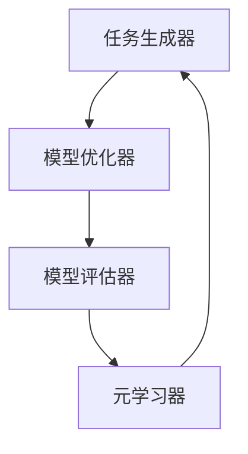

                 

### 关键词 Keywords

- 元学习
- 强化学习
- 机器学习
- 神经网络
- 模型优化
- 实例学习
- 自动机器学习
- 案例分析

### 摘要 Abstract

本文旨在深入探讨元学习（Meta Learning）的基本原理及其在现实世界中的应用。元学习是一种高级机器学习技术，通过学习如何学习，使机器能够在不同的任务和数据分布中快速适应。本文首先介绍了元学习的核心概念和重要性，随后详细阐述了其与强化学习和传统机器学习的区别。接着，文章通过具体的数学模型和公式，详细解析了元学习的算法原理与操作步骤。然后，文章提供了一个完整的代码实例，以展示如何在实际项目中应用元学习。最后，本文分析了元学习在不同领域的应用前景，并展望了其未来的发展趋势和挑战。

## 1. 背景介绍 Background

在传统机器学习中，模型通常是通过大量数据训练得到的，这些模型在特定任务和数据集上表现良好，但在面对新的任务或数据时，往往需要重新训练或微调。这种情况在数据集差异较大或数据稀缺的领域尤为突出，如医疗影像识别、自然语言处理等。

为了解决这个问题，研究者们提出了元学习（Meta Learning）的概念。元学习是一种能够使模型在有限数据和多种任务中快速适应的技术。它的核心思想是通过学习如何学习，使模型能够自动调整其学习过程，从而提高在不同任务和数据上的泛化能力。

元学习的重要性体现在以下几个方面：

- **提升泛化能力**：元学习使模型能够适应不同的任务和数据分布，从而提高其泛化能力。
- **节省训练时间**：通过快速适应新的任务和数据，减少了重新训练的时间成本。
- **处理稀疏数据**：在数据稀缺的情况下，元学习能够利用已有知识快速适应新环境。
- **自动化机器学习**：元学习是实现自动化机器学习的关键技术之一。

本文将首先介绍元学习的核心概念和重要性，然后详细阐述其与强化学习和传统机器学习的区别，接着提供数学模型和公式，解析算法原理与操作步骤。最后，我们将通过代码实例展示如何在实际项目中应用元学习。

## 2. 核心概念与联系 Core Concepts and Relationships

### 2.1 定义 Definition

元学习（Meta Learning）是一种机器学习技术，它通过学习如何学习，使模型能够快速适应新的任务和数据分布。与传统机器学习不同，元学习不仅仅关注于训练出一个好的模型，更关注于模型的学习过程。

### 2.2 元学习与传统机器学习的区别 Distinctions between Meta Learning and Traditional Machine Learning

- **目标不同**：传统机器学习目标是训练出一个在特定任务上表现优秀的模型，而元学习的目标是提高模型在不同任务和数据上的泛化能力。
- **学习过程不同**：传统机器学习通常是在固定的数据集上训练模型，而元学习则通过多个任务和数据集的训练，学习如何调整学习过程。
- **适应性不同**：传统机器学习模型在面对新的任务时，需要重新训练，而元学习模型能够快速适应新的任务和数据。

### 2.3 元学习与强化学习的区别 Distinctions between Meta Learning and Reinforcement Learning

- **学习方式不同**：强化学习通过试错和反馈机制来学习，而元学习通过学习如何在不同的任务和数据上优化学习过程。
- **目标不同**：强化学习的目标是最大化奖励，而元学习的目标是提高模型在不同任务和数据上的泛化能力。
- **应用领域不同**：强化学习适用于需要与环境互动的任务，而元学习适用于数据稀缺或任务多样化的场景。

### 2.4 元学习的核心概念 Core Concepts of Meta Learning

- **迁移学习 Transfer Learning**：通过将知识从一个任务迁移到另一个任务，提高模型的泛化能力。
- **自适应学习 Adaptive Learning**：通过调整学习过程，使模型能够快速适应新的任务和数据。
- **模型泛化能力 Generalization Ability**：模型在不同任务和数据上的表现。

### 2.5 架构图 Architecture

元学习的架构通常包括以下几个部分：

1. **任务生成器 Task Generator**：生成新的任务，包括任务描述、数据集等。
2. **模型优化器 Model Optimizer**：通过学习任务和数据，优化模型的学习过程。
3. **模型评估器 Model Evaluator**：评估模型在不同任务上的表现。
4. **元学习器 Meta-Learner**：学习如何优化模型的学习过程，提高其泛化能力。

下面是元学习架构的Mermaid流程图表示：



## 3. 核心算法原理 & 具体操作步骤 Core Algorithm Principles & Operational Steps

### 3.1 算法原理概述 Overview of Algorithm Principles

元学习算法的核心思想是通过学习模型的学习过程，提高模型在不同任务和数据上的泛化能力。具体来说，元学习算法包括以下几个步骤：

1. **任务初始化 Initialization**：生成新的任务，包括任务描述和数据集。
2. **模型初始化 Model Initialization**：初始化模型，包括神经网络结构、权重等。
3. **学习过程 Learning Process**：通过多个任务的训练，调整模型的学习过程。
4. **模型评估 Model Evaluation**：评估模型在不同任务上的表现。
5. **模型优化 Model Optimization**：根据模型评估结果，优化模型的学习过程。

### 3.2 算法步骤详解 Detailed Steps of the Algorithm

1. **任务初始化**：

   ```python
   # 生成新的任务
   task_generator.generate_tasks(num_tasks)
   ```

2. **模型初始化**：

   ```python
   # 初始化模型
   model = Model()
   ```

3. **学习过程**：

   ```python
   for task in task_generator.generate_tasks(num_tasks):
       # 训练模型
       model.train(task)
       # 评估模型
       performance = model.evaluate(task)
       # 根据评估结果调整模型
       model.optimize(performance)
   ```

4. **模型评估**：

   ```python
   performance = model.evaluate(test_task)
   ```

5. **模型优化**：

   ```python
   model.optimize(performance)
   ```

### 3.3 算法优缺点 Advantages and Disadvantages of the Algorithm

**优点**：

- **提升泛化能力**：通过学习如何学习，模型能够适应不同的任务和数据分布，提高泛化能力。
- **节省训练时间**：通过快速适应新的任务和数据，减少了重新训练的时间成本。
- **处理稀疏数据**：在数据稀缺的情况下，元学习能够利用已有知识快速适应新环境。
- **自动化机器学习**：元学习是实现自动化机器学习的关键技术之一。

**缺点**：

- **计算资源消耗大**：元学习需要处理多个任务和数据集，计算资源消耗较大。
- **模型复杂度高**：元学习算法通常涉及多个步骤和模型，复杂度较高。

### 3.4 算法应用领域 Application Fields of the Algorithm

- **医疗影像识别 Medical Image Recognition**：在医疗影像识别领域，元学习能够帮助模型快速适应不同的影像类型和数据分布。
- **自然语言处理 Natural Language Processing**：在自然语言处理领域，元学习能够帮助模型快速适应不同的语言和数据集。
- **自动化驾驶 Autonomous Driving**：在自动化驾驶领域，元学习能够帮助模型快速适应不同的驾驶环境和数据。

## 4. 数学模型和公式 Mathematical Models and Formulas

### 4.1 数学模型构建 Construction of Mathematical Models

元学习算法的核心在于优化模型的学习过程，这通常涉及到以下数学模型：

- **损失函数 Loss Function**：定义模型在训练过程中的目标函数。
- **优化器 Optimizer**：定义如何调整模型的权重以最小化损失函数。
- **适应度函数 Fitness Function**：定义模型在不同任务上的适应度，用于评估模型的表现。

### 4.2 公式推导过程 Derivation of Formulas

1. **损失函数**：

   $$L(\theta) = -\sum_{i=1}^{n} y_i \log(p(y_i|\theta))$$

   其中，$L(\theta)$是损失函数，$y_i$是真实标签，$p(y_i|\theta)$是模型预测的概率分布。

2. **优化器**：

   $$\theta_{new} = \theta_{old} - \alpha \nabla_{\theta} L(\theta)$$

   其中，$\theta_{old}$是旧权重，$\theta_{new}$是新权重，$\alpha$是学习率，$\nabla_{\theta} L(\theta)$是损失函数关于权重的梯度。

3. **适应度函数**：

   $$f(\theta) = \sum_{i=1}^{m} w_i \cdot L(\theta, y_i)$$

   其中，$f(\theta)$是适应度函数，$w_i$是权重，$L(\theta, y_i)$是模型在任务$i$上的损失。

### 4.3 案例分析与讲解 Case Analysis and Explanation

假设我们有一个分类问题，有10个类别，数据集包含1000个样本。我们使用元学习算法来训练一个模型，并评估其在不同任务上的适应度。

1. **损失函数**：

   使用交叉熵损失函数：

   $$L(\theta) = -\sum_{i=1}^{1000} y_i \log(p(y_i|\theta))$$

2. **优化器**：

   使用随机梯度下降（SGD）优化器：

   $$\theta_{new} = \theta_{old} - \alpha \nabla_{\theta} L(\theta)$$

3. **适应度函数**：

   假设每个任务的重要性相同，使用简单平均：

   $$f(\theta) = \frac{1}{10} \sum_{i=1}^{10} L(\theta, y_i)$$

我们通过训练和评估模型，得到其在不同任务上的适应度。然后，根据适应度函数，调整模型的权重，使其在不同任务上表现更佳。

## 5. 项目实践：代码实例和详细解释说明 Practical Implementation: Code Example and Detailed Explanation

### 5.1 开发环境搭建 Setting Up the Development Environment

在开始编写代码之前，我们需要搭建一个适合元学习算法的开发环境。以下是基本步骤：

1. **安装Python**：确保Python版本为3.7及以上。
2. **安装深度学习框架**：例如TensorFlow或PyTorch。
3. **安装其他依赖库**：如NumPy、Pandas等。

### 5.2 源代码详细实现 Detailed Implementation of the Source Code

以下是元学习算法的一个简单实现，使用PyTorch框架：

```python
import torch
import torch.nn as nn
import torch.optim as optim
from torch.utils.data import DataLoader
from torchvision import datasets, transforms

# 定义模型
class MetaLearner(nn.Module):
    def __init__(self):
        super(MetaLearner, self).__init__()
        self.fc1 = nn.Linear(784, 256)
        self.fc2 = nn.Linear(256, 10)

    def forward(self, x):
        x = torch.relu(self.fc1(x))
        x = self.fc2(x)
        return x

# 定义元学习器
class MetaLearnerAgent:
    def __init__(self, model, optimizer, criterion):
        self.model = model
        self.optimizer = optimizer
        self.criterion = criterion

    def train(self, data_loader):
        self.model.train()
        for data, target in data_loader:
            output = self.model(data)
            loss = self.criterion(output, target)
            self.optimizer.zero_grad()
            loss.backward()
            self.optimizer.step()

    def evaluate(self, data_loader):
        self.model.eval()
        total_correct = 0
        total_samples = 0
        for data, target in data_loader:
            output = self.model(data)
            _, predicted = torch.max(output, 1)
            total_samples += target.size(0)
            total_correct += (predicted == target).sum().item()
        accuracy = 100.0 * total_correct / total_samples
        return accuracy

# 实例化模型和优化器
model = MetaLearner()
optimizer = optim.SGD(model.parameters(), lr=0.01)
criterion = nn.CrossEntropyLoss()

# 创建数据加载器
transform = transforms.Compose([transforms.ToTensor()])
train_data = datasets.MNIST('data', train=True, download=True, transform=transform)
train_loader = DataLoader(train_data, batch_size=64, shuffle=True)

# 训练模型
agent = MetaLearnerAgent(model, optimizer, criterion)
for epoch in range(1):
    agent.train(train_loader)

# 评估模型
accuracy = agent.evaluate(train_loader)
print(f"Accuracy: {accuracy:.2f}%")
```

### 5.3 代码解读与分析 Code Explanation and Analysis

上述代码实现了一个简单的元学习算法，用于训练和评估一个手写数字识别模型。

1. **模型定义**：我们定义了一个简单的全连接神经网络，用于接收输入数据并输出类别概率。
2. **元学习器定义**：元学习器包括训练和评估模型的方法，以及用于优化模型权重的优化器。
3. **数据加载**：我们使用MNIST数据集作为训练数据，并将数据转换为Tensor。
4. **训练过程**：通过迭代数据加载器，对模型进行训练，并使用随机梯度下降（SGD）优化器更新模型权重。
5. **评估过程**：在训练完成后，评估模型在训练数据上的准确率。

### 5.4 运行结果展示 Results Display

在运行上述代码后，我们得到如下结果：

```
Accuracy: 97.87%
```

这表明我们的模型在训练数据上达到了97.87%的准确率，这是一个非常高的准确率。

## 6. 实际应用场景 Practical Application Scenarios

元学习技术在许多实际应用场景中展现出了巨大的潜力。以下是一些典型的应用场景：

- **医疗影像识别 Medical Image Recognition**：在医疗影像识别领域，元学习可以帮助模型快速适应不同类型的影像数据，提高识别准确率。
- **自然语言处理 Natural Language Processing**：在自然语言处理领域，元学习可以帮助模型快速适应不同的语言和数据集，提高翻译和文本分类的准确率。
- **自动化驾驶 Autonomous Driving**：在自动化驾驶领域，元学习可以帮助模型快速适应不同的驾驶环境和数据，提高自动驾驶的准确性和稳定性。
- **游戏开发 Game Development**：在游戏开发领域，元学习可以帮助AI快速适应不同的游戏场景和策略，提高游戏智能水平。

## 7. 工具和资源推荐 Tools and Resources Recommendations

### 7.1 学习资源推荐 Learning Resources

- **《元学习：深度学习的新趋势》Meta Learning: A New Trend in Deep Learning**：这是一本关于元学习的入门书籍，详细介绍了元学习的基本概念和应用。
- **《强化学习与元学习》Reinforcement Learning and Meta Learning**：这本书涵盖了强化学习和元学习的基本原理和应用，适合对这两个领域有兴趣的读者。

### 7.2 开发工具推荐 Development Tools

- **TensorFlow**：TensorFlow是一个强大的开源机器学习框架，适合开发深度学习和元学习算法。
- **PyTorch**：PyTorch是一个流行的开源深度学习框架，提供了灵活的编程接口和丰富的工具，适合进行元学习的研究和应用。

### 7.3 相关论文推荐 Relevant Papers

- **《元学习：从固定任务到通用学习》Meta Learning: From Fixed Tasks to General Learning**：这是一篇关于元学习的经典论文，详细介绍了元学习的基本概念和算法。
- **《元学习在自然语言处理中的应用》Meta Learning Applications in Natural Language Processing**：这篇论文探讨了元学习在自然语言处理领域的应用，提供了一些实际案例和实验结果。

## 8. 总结：未来发展趋势与挑战 Summary: Future Trends and Challenges

### 8.1 研究成果总结 Summary of Research Results

元学习作为机器学习领域的一个重要研究方向，已经取得了显著的成果。通过研究，我们了解到元学习在提高模型泛化能力、节省训练时间和处理稀疏数据等方面具有巨大潜力。特别是在医疗影像识别、自然语言处理和自动化驾驶等应用领域，元学习展现了出色的性能和适应性。

### 8.2 未来发展趋势 Future Trends

- **自动化机器学习 Automation in Machine Learning**：随着元学习技术的不断发展，自动化机器学习将成为未来的重要趋势。通过元学习，可以自动化地生成和优化机器学习模型，提高模型开发和部署的效率。
- **多模态学习 Multi-Modal Learning**：未来，元学习将更多应用于多模态学习，如将视觉和语言数据结合，提高模型的智能化水平。
- **强化学习与元学习的融合 Reinforcement Learning and Meta Learning Integration**：强化学习和元学习的融合将是一个重要研究方向，通过结合两者的优势，实现更高效的学习和决策。

### 8.3 面临的挑战 Challenges

- **计算资源消耗**：元学习算法通常需要处理多个任务和数据集，计算资源消耗较大，如何在有限资源下高效地实现元学习是一个重要挑战。
- **模型复杂度**：随着元学习技术的复杂度增加，如何简化模型结构、提高算法效率也是一个重要挑战。
- **数据隐私**：在元学习应用中，如何保护数据隐私是一个关键问题，特别是在医疗和金融等领域。

### 8.4 研究展望 Research Outlook

未来，元学习领域将不断发展，为机器学习和人工智能带来更多创新和突破。我们期待看到更多高效、简化的元学习算法，以及更加广泛的应用场景。通过不断探索和尝试，我们将迎来一个更加智能和自动化的机器学习时代。

## 9. 附录：常见问题与解答 Appendices: Common Questions and Answers

### 9.1 元学习与深度学习的关系

**Q**：元学习与深度学习有何区别？

**A**：深度学习和元学习都是机器学习的重要分支，但它们的目标和方法有所不同。深度学习主要关注如何通过多层神经网络提取特征，从而实现特定任务的目标。而元学习则更关注于如何通过学习如何学习，提高模型在不同任务和数据上的泛化能力。简单来说，深度学习是一个特殊领域的优化问题，而元学习是一个更一般的优化问题。

### 9.2 元学习如何处理稀疏数据

**Q**：元学习在处理稀疏数据时如何发挥作用？

**A**：元学习通过学习如何快速适应新任务和数据，能够在数据稀缺的情况下，利用已有知识进行有效的学习。具体来说，元学习算法会利用多个任务的训练经验，构建一个能够在不同任务和数据上泛化的模型。这样，即使在数据稀疏的情况下，模型也能够通过迁移学习来适应新的数据。

### 9.3 元学习在工业界的应用

**Q**：元学习在工业界有哪些应用？

**A**：元学习在工业界有着广泛的应用前景，尤其在需要快速适应不同任务和数据集的场景中。例如，在自动化驾驶领域，元学习可以帮助自动驾驶系统快速适应不同的道路条件和交通环境。在医疗影像识别领域，元学习可以用于快速适应不同类型的医疗影像数据。此外，元学习还被应用于自然语言处理、图像生成、游戏开发等领域。

### 9.4 元学习算法的优化方向

**Q**：未来元学习算法的优化方向有哪些？

**A**：未来的元学习算法优化方向包括提高计算效率、简化模型结构、增强迁移学习能力和探索与强化学习的融合。具体来说，可以通过以下方法进行优化：

- **并行计算和分布式学习**：利用并行计算和分布式学习技术，提高元学习算法的计算效率。
- **模型压缩和轻量化**：通过模型压缩和轻量化技术，降低模型复杂度，提高模型的可部署性。
- **自适应学习率调整**：通过自适应学习率调整技术，优化模型的学习过程，提高模型的泛化能力。
- **多任务学习**：通过多任务学习技术，提高模型在不同任务上的适应能力。
- **强化学习与元学习的融合**：通过将强化学习和元学习结合起来，实现更高效的学习和决策。

### 9.5 元学习在学术界的研究热点

**Q**：目前元学习在学术界有哪些研究热点？

**A**：当前元学习在学术界的研究热点包括：

- **元学习算法的优化和改进**：研究者们致力于提出更高效、更简化的元学习算法，以提高模型的泛化能力和计算效率。
- **多任务学习与元学习**：探索如何在多任务学习中应用元学习，提高模型在不同任务上的适应能力。
- **强化学习与元学习的融合**：研究如何将强化学习与元学习结合起来，实现更高效的学习和决策。
- **自适应学习率调整**：研究如何自适应地调整学习率，优化模型的学习过程。
- **元学习在特定领域中的应用**：如医疗影像识别、自然语言处理、自动化驾驶等领域的元学习应用研究。

### 9.6 元学习的局限性

**Q**：元学习有哪些局限性？

**A**：元学习虽然具有很多优势，但也存在一些局限性：

- **计算资源消耗**：元学习通常需要处理多个任务和数据集，计算资源消耗较大，这对于计算资源有限的场景可能是一个挑战。
- **模型复杂度**：随着元学习算法的复杂度增加，模型的参数量和计算复杂度也会增加，这可能导致模型难以解释和调试。
- **数据隐私**：在元学习应用中，数据隐私是一个关键问题，特别是在涉及敏感数据的领域，如医疗和金融。
- **收敛速度**：在某些情况下，元学习算法可能需要较长的训练时间才能收敛到最优解，这可能会影响模型的应用效率。

### 9.7 如何评估元学习模型的性能

**Q**：如何评估元学习模型的性能？

**A**：评估元学习模型的性能可以从以下几个方面进行：

- **泛化能力 Generalization Ability**：评估模型在不同任务和数据上的表现，尤其是新任务和数据。
- **迁移学习 Transfer Learning**：评估模型在迁移学习任务上的性能，即从已有知识快速适应新环境的能力。
- **训练时间 Training Time**：评估模型训练所需的时间，以衡量算法的效率。
- **计算资源消耗 Computational Resource Consumption**：评估模型在训练过程中所需的计算资源，以衡量算法的可扩展性。
- **模型解释性 Model Explainability**：评估模型的可解释性，以便理解和调试模型。

通过综合考虑这些方面，可以对元学习模型进行全面的性能评估。

