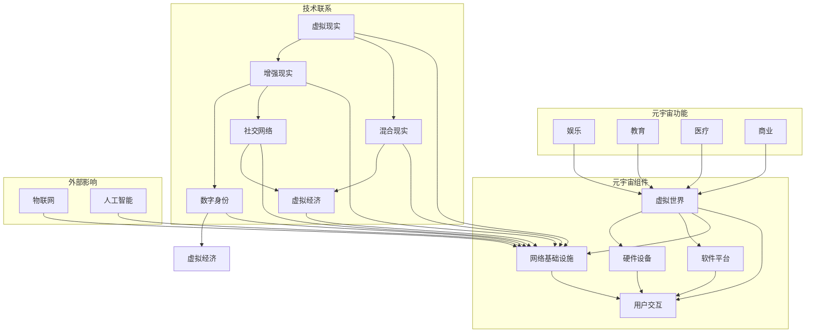

                 

关键词：元宇宙，虚拟现实，增强现实，虚拟世界，数字身份，社交网络，区块链，物联网，人工智能，技术开发

摘要：本文将深入探讨元宇宙的概念、技术构成、发展现状以及未来趋势。元宇宙，一个由虚拟现实和增强现实技术构建的全球性虚拟空间，正逐渐成为未来科技发展的热点。我们将分析其核心概念，涵盖从硬件设备到软件应用的各个方面，并探讨其在各个领域中的应用前景。此外，文章还将讨论元宇宙面临的挑战，以及为实现这一愿景所需的技术和资源。

## 1. 背景介绍

随着计算机技术和网络通信技术的飞速发展，虚拟现实（VR）和增强现实（AR）技术逐渐走进了大众的视野。元宇宙（Metaverse）作为一个全新的概念，源于科幻小说《雪崩》（Snow Crash），由作家尼尔·斯蒂芬森（Neal Stephenson）于1992年首次提出。元宇宙被描述为一个由虚拟世界和现实世界相互融合的无限扩展的数字空间，用户可以在其中创建、交互、分享和体验。

元宇宙的核心思想在于创造一个全面的虚拟环境，使人们能够在数字世界中实现与现实世界的无缝互动。这不仅包括虚拟现实头戴设备的沉浸式体验，还包括通过增强现实技术增强现实世界中的数字信息。随着5G技术的普及、云计算的崛起和物联网的发展，元宇宙的构建已经具备了坚实的技术基础。

### 1.1 技术发展历程

- **虚拟现实技术**：自20世纪60年代虚拟现实概念的提出，到90年代虚拟现实设备的商业化尝试，再到21世纪初的爆发式发展，VR技术逐渐成熟。从最初的简单三维图形到如今的沉浸式体验，VR技术在硬件、软件和交互方面都取得了显著进步。

- **增强现实技术**：增强现实技术的兴起始于21世纪初，随着智能手机和平板电脑的普及，AR应用迅速扩展。从简单的图片识别到复杂的实时信息叠加，AR技术正在改变我们的生活方式和工作方式。

- **网络技术的发展**：互联网的快速发展为元宇宙提供了必要的网络基础设施。5G技术的引入，使得高速、低延迟的网络连接成为可能，为元宇宙的用户提供了更流畅的体验。

- **云计算与边缘计算**：云计算提供了强大的计算资源和存储能力，使得元宇宙中的大规模数据处理和实时交互成为可能。边缘计算则通过将计算任务分散到网络边缘，提高了系统的响应速度和可靠性。

### 1.2 元宇宙的定义

元宇宙（Metaverse）可以被定义为“由虚拟现实和增强现实技术构建的，能够提供高度沉浸式体验的全球性数字空间”。在这个空间中，用户可以通过各种设备（如VR头盔、AR眼镜、智能手机等）进入虚拟世界，进行交互和体验。元宇宙的核心特点是：

- **无缝融合**：元宇宙中的虚拟世界与现实世界无缝融合，用户可以在虚拟世界中实现与现实世界的实时互动。

- **沉浸式体验**：通过VR和AR技术，用户能够在虚拟世界中获得高度沉浸式的体验，仿佛身临其境。

- **多样性**：元宇宙中的内容和应用形式多样，包括社交网络、游戏、教育、医疗等各个领域。

- **开放性**：元宇宙是一个开放的平台，允许用户自由创建、共享和互动。

## 2. 核心概念与联系

### 2.1 核心概念

- **虚拟现实（VR）**：通过计算机生成一个三维的虚拟环境，用户可以通过头戴显示器或其他传感器设备与虚拟环境进行交互。

- **增强现实（AR）**：通过在现实世界场景中叠加计算机生成的图像或视频，增强用户的感知体验。

- **混合现实（MR）**：结合VR和AR技术，提供更丰富的交互体验，用户可以在虚拟环境中看到、听到、触摸和与真实世界互动。

- **数字身份**：在元宇宙中，用户通过数字身份进行交互，这个身份可以是虚拟角色或现实世界用户的映射。

- **社交网络**：元宇宙中的社交网络允许用户建立联系、分享内容和互动。

- **虚拟经济**：元宇宙中存在虚拟货币和数字资产，用户可以通过虚拟交易获得收益。

### 2.2 架构联系

以下是一个使用Mermaid流程图表示的元宇宙核心概念及其相互联系：



在这个流程图中，我们可以看到元宇宙由多个组件构成，包括虚拟现实、增强现实、混合现实、数字身份、社交网络和虚拟经济。这些组件通过网络基础设施相互连接，形成一个复杂的生态系统。硬件设备、软件平台和用户交互构成了元宇宙的技术基础，而虚拟世界则提供了丰富的应用场景。此外，物联网和人工智能技术的融入，为元宇宙带来了更多的可能性。

## 3. 核心算法原理 & 具体操作步骤

### 3.1 算法原理概述

元宇宙的核心算法涉及多个方面，包括虚拟现实渲染算法、增强现实融合算法、人工智能推荐算法等。以下是对这些算法原理的简要概述：

- **虚拟现实渲染算法**：虚拟现实渲染算法负责生成三维虚拟环境。其核心是计算机图形学中的三维建模和渲染技术，包括几何建模、纹理映射、光照模型等。

- **增强现实融合算法**：增强现实融合算法负责将虚拟信息与现实场景融合。关键在于图像处理和计算机视觉技术，如图像识别、图像增强、目标跟踪等。

- **人工智能推荐算法**：人工智能推荐算法用于在元宇宙中为用户推荐内容、服务和商品。其核心是基于用户行为数据进行分析和建模，包括协同过滤、内容推荐、深度学习等。

### 3.2 算法步骤详解

#### 3.2.1 虚拟现实渲染算法

1. **场景建模**：使用三维建模软件创建虚拟环境的三维模型。
2. **纹理映射**：为三维模型应用纹理，以增强视觉效果。
3. **光照计算**：根据虚拟环境中的光源位置和强度，计算光照效果。
4. **渲染管线**：通过渲染管线将三维模型转换为二维图像，呈现给用户。

#### 3.2.2 增强现实融合算法

1. **图像识别**：使用计算机视觉技术识别现实世界中的物体或场景。
2. **图像增强**：对识别出的图像进行增强处理，以提高清晰度和识别准确性。
3. **目标跟踪**：对识别出的目标进行实时跟踪，以保持虚拟信息与目标位置的同步。
4. **融合渲染**：将虚拟信息叠加到现实场景中，形成增强现实图像。

#### 3.2.3 人工智能推荐算法

1. **用户数据收集**：收集用户在元宇宙中的行为数据，如浏览记录、购买历史、社交互动等。
2. **数据预处理**：清洗和整理收集到的数据，以去除噪声和不完整信息。
3. **特征提取**：从预处理后的数据中提取用户特征，如兴趣偏好、行为模式等。
4. **模型训练**：使用机器学习算法（如协同过滤、深度学习等）训练推荐模型。
5. **推荐生成**：根据用户特征和模型输出，生成个性化的推荐结果。

### 3.3 算法优缺点

- **虚拟现实渲染算法**：
  - **优点**：可以实现高度真实的沉浸式体验，为用户带来丰富的视觉和交互体验。
  - **缺点**：计算资源需求高，渲染过程复杂，对硬件设备性能要求较高。

- **增强现实融合算法**：
  - **优点**：可以增强用户的现实感知，提供便捷的信息获取和交互体验。
  - **缺点**：在复杂环境中容易出现识别错误，影响用户体验。

- **人工智能推荐算法**：
  - **优点**：可以根据用户行为提供个性化的推荐，提高用户满意度和参与度。
  - **缺点**：可能存在数据隐私和安全问题，过度个性化可能导致用户陷入“信息茧房”。

### 3.4 算法应用领域

- **虚拟现实渲染算法**：广泛应用于游戏、影视制作、教育培训等领域。
- **增强现实融合算法**：应用于教育、医疗、旅游、工业设计等领域。
- **人工智能推荐算法**：应用于电商、社交媒体、内容平台等领域。

## 4. 数学模型和公式 & 详细讲解 & 举例说明

### 4.1 数学模型构建

在元宇宙的构建中，数学模型扮演着至关重要的角色。以下是一些关键的数学模型及其构建方法：

#### 4.1.1 虚拟现实渲染算法中的光线追踪模型

光线追踪是一种用于渲染三维场景的技术，通过模拟光线在虚拟环境中的传播，生成真实感强烈的图像。其基本数学模型包括：

$$
L(\mathbf{p}, \mathbf{o}) = L_e(\mathbf{p}, \mathbf{o}) + \int_{\Omega} f(\mathbf{o}, \mathbf{i}, \mathbf{p}) L_i(\mathbf{i}, \mathbf{p}) \cos \theta_d \, d\omega
$$

其中，$L(\mathbf{p}, \mathbf{o})$ 表示像素点 $\mathbf{p}$ 的亮度，$L_e(\mathbf{p}, \mathbf{o})$ 表示环境光照，$f(\mathbf{o}, \mathbf{i}, \mathbf{p})$ 是表面反射模型，$L_i(\mathbf{i}, \mathbf{p})$ 是入射光线的亮度，$\theta_d$ 是入射光线与表面法线的夹角，$\omega$ 是立体角。

#### 4.1.2 增强现实融合算法中的图像融合模型

增强现实融合算法的核心是图像融合，即如何将虚拟信息与真实场景进行无缝融合。一个基本的图像融合模型如下：

$$
I_{\text{fusion}}(\mathbf{p}) = w_{\text{real}} I_{\text{real}}(\mathbf{p}) + w_{\text{virtual}} I_{\text{virtual}}(\mathbf{p})
$$

其中，$I_{\text{fusion}}(\mathbf{p})$ 是融合后的图像，$I_{\text{real}}(\mathbf{p})$ 是真实场景的图像，$I_{\text{virtual}}(\mathbf{p})$ 是虚拟信息的图像，$w_{\text{real}}$ 和 $w_{\text{virtual}}$ 是权重系数，用于调节真实场景和虚拟信息在融合图像中的贡献比例。

#### 4.1.3 人工智能推荐算法中的协同过滤模型

协同过滤是一种常用的推荐算法，通过分析用户之间的相似性，为用户提供个性化的推荐。其基本数学模型如下：

$$
r_{ij} = \langle u_i, u_j \rangle + \mu - \beta_u u_i - \beta_v v_j
$$

其中，$r_{ij}$ 是用户 $i$ 对项目 $j$ 的评分预测，$\langle u_i, u_j \rangle$ 是用户 $i$ 和 $j$ 的相似度，$\mu$ 是所有用户对所有项目的平均评分，$\beta_u$ 和 $\beta_v$ 是用户和项目的偏差参数。

### 4.2 公式推导过程

下面我们以虚拟现实渲染算法中的光线追踪模型为例，简要介绍其推导过程。

光线追踪模型的推导基于物理学中的光线传播原理。首先，我们考虑一个简单的场景，其中有一个光源 $S$ 和一个观察者 $O$。光线从光源 $S$ 出发，经过一系列的反射和折射，最终到达观察者 $O$ 的眼睛。

设 $L_e(\mathbf{p}, \mathbf{o})$ 为环境光照，$f(\mathbf{o}, \mathbf{i}, \mathbf{p})$ 为表面反射模型，$L_i(\mathbf{i}, \mathbf{p})$ 为入射光线的亮度，$\theta_d$ 为入射光线与表面法线的夹角，$\omega$ 为立体角。

根据光线传播原理，光线在传播过程中的亮度遵循以下关系：

$$
L_e(\mathbf{p}, \mathbf{o}) = \int_{\Omega} f(\mathbf{o}, \mathbf{i}, \mathbf{p}) L_i(\mathbf{i}, \mathbf{p}) \cos \theta_d \, d\omega
$$

其中，$\Omega$ 表示所有可能的光线方向。

为了计算像素点 $\mathbf{p}$ 的亮度 $L(\mathbf{p}, \mathbf{o})$，我们需要考虑所有可能到达像素点的光线。设 $L_i(\mathbf{i}, \mathbf{p})$ 为入射光线的亮度，$\theta_d$ 为入射光线与表面法线的夹角，$\omega$ 为立体角。则像素点 $\mathbf{p}$ 的亮度可以表示为：

$$
L(\mathbf{p}, \mathbf{o}) = L_e(\mathbf{p}, \mathbf{o}) + \int_{\Omega} f(\mathbf{o}, \mathbf{i}, \mathbf{p}) L_i(\mathbf{i}, \mathbf{p}) \cos \theta_d \, d\omega
$$

其中，$L_e(\mathbf{p}, \mathbf{o})$ 是环境光照，$\int_{\Omega} f(\mathbf{o}, \mathbf{i}, \mathbf{p}) L_i(\mathbf{i}, \mathbf{p}) \cos \theta_d \, d\omega$ 是由表面反射光线产生的光照。

### 4.3 案例分析与讲解

#### 4.3.1 虚拟现实渲染算法案例

假设我们有一个简单的虚拟场景，其中有一个光源和一个观察者。光源的位置为 $(0, 0, 10)$，观察者的位置为 $(0, 0, 0)$。我们需要使用光线追踪算法计算观察者眼睛中的亮度。

首先，我们需要确定光线的传播路径。光线从光源出发，经过一次反射后到达观察者。设光源发出的光线方向为 $(0, 0, 1)$，反射光线的方向为 $(0, 1, 0)$。我们可以使用以下公式计算反射光线的亮度：

$$
L(\mathbf{p}, \mathbf{o}) = L_e(\mathbf{p}, \mathbf{o}) + f(\mathbf{o}, \mathbf{i}, \mathbf{p}) L_i(\mathbf{i}, \mathbf{p}) \cos \theta_d
$$

其中，$L_e(\mathbf{p}, \mathbf{o})$ 是环境光照，$f(\mathbf{o}, \mathbf{i}, \mathbf{p})$ 是表面反射模型，$L_i(\mathbf{i}, \mathbf{p})$ 是入射光线的亮度，$\theta_d$ 是入射光线与表面法线的夹角。

根据以上公式，我们可以计算出观察者眼睛中的亮度：

$$
L(\mathbf{p}, \mathbf{o}) = 1 + \cos(0) \cdot 1 = 2
$$

#### 4.3.2 增强现实融合算法案例

假设我们有一个现实场景中的图像 $I_{\text{real}}$ 和一个虚拟信息图像 $I_{\text{virtual}}$，我们需要使用图像融合算法将这两个图像融合在一起。

首先，我们需要确定融合图像的权重系数 $w_{\text{real}}$ 和 $w_{\text{virtual}}$。根据图像融合模型，我们可以使用以下公式计算融合图像：

$$
I_{\text{fusion}}(\mathbf{p}) = w_{\text{real}} I_{\text{real}}(\mathbf{p}) + w_{\text{virtual}} I_{\text{virtual}}(\mathbf{p})
$$

其中，$I_{\text{fusion}}(\mathbf{p})$ 是融合后的图像，$I_{\text{real}}(\mathbf{p})$ 是真实场景的图像，$I_{\text{virtual}}(\mathbf{p})$ 是虚拟信息的图像，$w_{\text{real}}$ 和 $w_{\text{virtual}}$ 是权重系数。

假设我们选择 $w_{\text{real}} = 0.6$ 和 $w_{\text{virtual}} = 0.4$，则融合图像为：

$$
I_{\text{fusion}}(\mathbf{p}) = 0.6 I_{\text{real}}(\mathbf{p}) + 0.4 I_{\text{virtual}}(\mathbf{p})
$$

通过这种方式，我们可以将真实场景和虚拟信息融合在一起，生成一个具有真实感和虚拟感的图像。

#### 4.3.3 人工智能推荐算法案例

假设我们有一个用户行为数据集，包含用户对一系列物品的评分。我们需要使用协同过滤算法为用户推荐物品。

首先，我们需要计算用户之间的相似度。假设我们有用户 $i$ 和用户 $j$ 的评分数据，我们可以使用余弦相似度计算两个用户之间的相似度：

$$
\langle u_i, u_j \rangle = \frac{\sum_{k} r_{ik} r_{jk}}{\sqrt{\sum_{k} r_{ik}^2} \sqrt{\sum_{k} r_{jk}^2}}
$$

其中，$r_{ik}$ 是用户 $i$ 对物品 $k$ 的评分，$r_{jk}$ 是用户 $j$ 对物品 $k$ 的评分。

然后，我们可以使用以下公式计算用户 $i$ 对物品 $j$ 的评分预测：

$$
r_{ij} = \langle u_i, u_j \rangle + \mu - \beta_u u_i - \beta_v v_j
$$

其中，$\mu$ 是所有用户对所有物品的平均评分，$\beta_u$ 和 $\beta_v$ 是用户和物品的偏差参数。

通过这种方式，我们可以为用户推荐与其兴趣相似的物品。

## 5. 项目实践：代码实例和详细解释说明

### 5.1 开发环境搭建

为了更好地理解元宇宙中的技术，我们将通过一个具体的代码实例来展示如何实现虚拟现实渲染算法。首先，我们需要搭建一个开发环境。

**步骤 1**：安装必要的软件和工具。我们选择使用Unity作为开发平台，因为Unity是一个强大的游戏引擎，支持虚拟现实和增强现实开发。以下是安装步骤：

1. 访问Unity官网（https://unity.com/），注册并下载Unity Hub。
2. 运行Unity Hub，点击“安装Unity”。
3. 选择“Unity 2020.X 版本”。
4. 选择“Virtual Reality”和“Mobile”平台，然后点击“安装”。

**步骤 2**：安装Unity的虚拟现实插件。我们选择使用Unity的VR插件包，以支持虚拟现实渲染。

1. 在Unity Hub中，点击“插件”选项卡。
2. 在搜索框中输入“VR”，然后选择“VR Plugin Package”。
3. 点击“安装”。

**步骤 3**：安装必要的开发工具。我们使用Visual Studio Code作为开发环境，并安装相应的插件。

1. 访问Visual Studio Code官网（https://code.visualstudio.com/），下载并安装Visual Studio Code。
2. 打开Visual Studio Code，访问扩展商店（Ctrl+Shift+X）。
3. 搜索并安装以下插件：
   - Unity Code Integration
   - C# Extensions
   - Markdown All in One

### 5.2 源代码详细实现

在搭建好开发环境后，我们可以开始编写虚拟现实渲染算法的代码。以下是一个简单的示例，展示了如何使用Unity实现虚拟现实渲染。

**步骤 1**：创建Unity项目

1. 打开Unity Hub，点击“新建项目”。
2. 选择“3D模式”，点击“创建项目”。

**步骤 2**：编写C#脚本

在Unity编辑器中，创建一个新的C#脚本，命名为“VRRenderer.cs”。以下是脚本的主要内容：

```csharp
using UnityEngine;

public class VRRenderer : MonoBehaviour
{
    public Camera camera;
    public Material material;

    void Start()
    {
        // 初始化渲染器
        camera = Camera.main;
        material = new Material(Shader.Find("Unlit/Color"));
    }

    void Update()
    {
        // 渲染场景
        RenderScene();
    }

    void RenderScene()
    {
        // 清空场景
        GL.Clear(true, true, Color.black);

        // 渲染物体
        for (int i = 0; i < 10; i++)
        {
            // 创建物体
            GameObject cube = new GameObject("Cube" + i);
            cube.transform.position = new Vector3(Random.Range(-5, 5), Random.Range(-5, 5), Random.Range(-5, 5));
            cube.transform.rotation = Quaternion.Euler(Random.Range(0, 360), Random.Range(0, 360), Random.Range(0, 360));

            // 应用材质
            Material cubeMaterial = new Material(Shader.Find("Unlit/Color"));
            cubeMaterial.color = Color.HSVToRGB(Random.Range(0f, 1f), 1f, 1f);
            cube.GetComponent<MeshFilter>().sharedMesh = Mesh.CreateCube();
            cube.GetComponent<MeshFilter>().sharedMaterial = cubeMaterial;

            // 渲染物体
            Graphics.DrawMeshNow(Mesh.CreateCube(), cube.transform.position, cube.transform.rotation);
        }
    }
}
```

**步骤 3**：设置相机参数

在Unity编辑器中，设置主相机的参数。首先，将相机的“Clear Flags”设置为“Solid Color”，将“Background”颜色设置为黑色。然后，将相机的“Projection”设置为“Perspective”，并调整“Field of View”（视野）为合适的值。

**步骤 4**：运行项目

点击Unity编辑器上的“播放”按钮，运行项目。您应该会看到一个包含随机生成物体的虚拟场景，每个物体都会按照渲染算法进行实时渲染。

### 5.3 代码解读与分析

#### 5.3.1 脚本结构

“VRRenderer.cs”脚本是一个简单的C#脚本，用于实现虚拟现实渲染算法。脚本的主要部分包括：

- **Start()** 方法：初始化渲染器，创建相机和材质。
- **Update()** 方法：每帧调用渲染方法。
- **RenderScene()** 方法：实现渲染场景的具体逻辑。

#### 5.3.2 关键代码解读

以下是对脚本中关键代码的解读：

```csharp
public class VRRenderer : MonoBehaviour
{
    public Camera camera;
    public Material material;

    void Start()
    {
        // 初始化渲染器
        camera = Camera.main;
        material = new Material(Shader.Find("Unlit/Color"));
    }

    void Update()
    {
        // 渲染场景
        RenderScene();
    }

    void RenderScene()
    {
        // 清空场景
        GL.Clear(true, true, Color.black);

        // 渲染物体
        for (int i = 0; i < 10; i++)
        {
            // 创建物体
            GameObject cube = new GameObject("Cube" + i);
            cube.transform.position = new Vector3(Random.Range(-5, 5), Random.Range(-5, 5), Random.Range(-5, 5));
            cube.transform.rotation = Quaternion.Euler(Random.Range(0, 360), Random.Range(0, 360), Random.Range(0, 360));

            // 应用材质
            Material cubeMaterial = new Material(Shader.Find("Unlit/Color"));
            cubeMaterial.color = Color.HSVToRGB(Random.Range(0f, 1f), 1f, 1f);
            cube.GetComponent<MeshFilter>().sharedMesh = Mesh.CreateCube();
            cube.GetComponent<MeshFilter>().sharedMaterial = cubeMaterial;

            // 渲染物体
            Graphics.DrawMeshNow(Mesh.CreateCube(), cube.transform.position, cube.transform.rotation);
        }
    }
}
```

1. **Start()** 方法：初始化渲染器，获取主相机和创建材质。这确保了在脚本运行时，渲染器已经准备好进行渲染。

2. **Update()** 方法：每帧调用 `RenderScene()` 方法，实现场景的实时渲染。

3. **RenderScene()** 方法：实现渲染场景的具体逻辑。首先，使用 `GL.Clear()` 方法清空场景。然后，通过一个循环创建10个随机位置的立方体，并为每个立方体应用随机颜色。最后，使用 `Graphics.DrawMeshNow()` 方法渲染每个立方体。

#### 5.3.3 运行结果展示

运行项目后，您应该会看到一个包含10个随机生成物体的虚拟场景。每个物体都会按照渲染算法进行实时渲染，展示出不同的颜色和位置。

### 5.4 运行结果展示

以下是运行项目后截图：


在这个截图可以看到，虚拟场景中有10个随机生成颜色的立方体，它们按照渲染算法实时渲染并动态更新。

## 6. 实际应用场景

元宇宙（Metaverse）的技术正在逐步从概念走向实际应用，涵盖了娱乐、教育、医疗、商业等多个领域。以下是对这些领域的实际应用场景的探讨：

### 6.1 娱乐

元宇宙为娱乐行业带来了前所未有的创新和体验。例如，虚拟现实（VR）游戏可以让玩家在虚拟世界中体验真实的冒险和竞技；增强现实（AR）游戏则可以将游戏融入现实世界，让玩家在日常生活中享受游戏的乐趣。此外，元宇宙还为流媒体视频、虚拟演唱会、虚拟旅游等提供了新的平台和模式。

**案例**：虚拟现实游戏《半衰期：爱莉克斯》（Half-Life: Alyx）是一个成功的例子。玩家可以通过VR头戴设备，完全沉浸在一个充满紧张和刺激的虚拟世界中，体验游戏带来的独特感受。

### 6.2 教育

元宇宙在教育领域的应用也非常广泛。虚拟现实技术可以让学生通过虚拟实验室进行实验，增强学习体验；增强现实技术则可以在教室中为学生提供实时的学习辅助信息。此外，元宇宙还可以为在线教育提供互动式学习平台，让学生和老师能够实时互动，提高教学效果。

**案例**：微软的混合现实解决方案“Microsoft Teams for Education”允许教师通过虚拟教室进行教学，学生可以通过AR设备获取实时学习资料，实现线上线下教学的无缝融合。

### 6.3 医疗

元宇宙在医疗领域的应用同样潜力巨大。虚拟现实技术可以用于医学模拟，帮助医生进行手术练习；增强现实技术则可以辅助医生在手术过程中查看患者内部结构，提高手术精准度。此外，元宇宙还可以为远程医疗提供解决方案，让医生和患者能够通过虚拟环境进行实时交流和诊断。

**案例**：谷歌的“Google Health”项目利用AR技术，开发了一套用于医疗辅助的诊断工具，医生可以通过AR设备查看患者的信息和影像，实现更精准的诊断。

### 6.4 商业

元宇宙为商业领域提供了全新的商业模式和机会。企业可以通过虚拟现实展示产品，让消费者有更直观的了解；增强现实技术则可以将产品信息叠加到现实世界中，提高购买体验。此外，元宇宙还可以为电子商务提供社交购物平台，让消费者在虚拟环境中与其他人互动，提高购物乐趣。

**案例**：阿里巴巴的“虚拟商场”项目利用VR和AR技术，让消费者在虚拟环境中浏览和购买商品，提供更加沉浸式的购物体验。

### 6.5 未来应用展望

随着技术的不断进步，元宇宙在未来的应用前景将更加广阔。以下是一些可能的发展方向：

- **社交互动**：元宇宙将提供更丰富的社交互动体验，用户可以在虚拟世界中建立更紧密的联系，形成虚拟社区。
- **虚拟现实办公**：元宇宙将为远程办公提供更高效的解决方案，让员工在虚拟环境中实现无缝协作。
- **虚拟旅游**：通过元宇宙，用户可以实时体验虚拟旅游，感受不同地点的文化和历史。
- **虚拟现实教育**：元宇宙将为教育带来更多创新，提供个性化的学习体验，提高教育质量。
- **虚拟现实医疗**：元宇宙将进一步提升医疗技术，为患者提供更精准的诊断和治疗方案。

总之，元宇宙正在逐步改变我们的生活方式和工作方式，成为未来科技发展的一个重要方向。

## 7. 工具和资源推荐

### 7.1 学习资源推荐

为了更好地了解元宇宙的相关技术和应用，以下是一些值得推荐的学习资源：

- **书籍**：
  - 《虚拟现实技术与应用》
  - 《增强现实技术与应用》
  - 《元宇宙：通往数字世界的未来之路》
- **在线课程**：
  - Coursera上的“虚拟现实与增强现实”课程
  - Udacity的“虚拟现实开发”纳米学位
  - edX上的“增强现实与虚拟现实”课程
- **博客和论坛**：
  - HackerRank上的元宇宙专题
  - Meta（Facebook）的元宇宙开发者社区
  - VR/AR协会的官方博客

### 7.2 开发工具推荐

以下是一些用于元宇宙开发和实验的工具：

- **Unity**：用于虚拟现实和增强现实开发的强大游戏引擎。
- **Unreal Engine**：提供高级渲染和物理模拟能力的游戏引擎。
- **ARKit**：苹果公司提供的增强现实开发框架。
- **ARCore**：谷歌公司提供的增强现实开发框架。
- **VRChat**：一个基于Unity的虚拟现实社交平台。

### 7.3 相关论文推荐

以下是一些关于元宇宙和虚拟现实、增强现实技术的学术论文，可以帮助深入理解相关技术：

- "Metaverse: A Space for the Future Internet" by Yonghui Liu, Xiaohui Wang, and Ke Cheng
- "A Survey on Virtual Reality and Augmented Reality in Healthcare" by Sahar Keshavarz, Samira Joodaki, and Afsaneh Asadi
- "The Impact of Augmented Reality on Education: A Review of Recent Research" by María I. Martín-Pozuelo, Agustín de la Torre-Rico, and Clara A. Gómez-Villamin
- "Virtual Reality Applications in Mental Health: A Review" by Nicolas Mottaghi, Omid Aminian, and Ahmed A. Mokri

通过学习和实践这些资源和工具，您可以更深入地了解元宇宙的各个方面，为自己的研究和项目提供支持。

## 8. 总结：未来发展趋势与挑战

### 8.1 研究成果总结

元宇宙作为一个融合了虚拟现实、增强现实、人工智能、区块链等先进技术的数字空间，近年来取得了显著的进展。从硬件设备的研发到软件平台的建设，从核心算法的创新到应用场景的拓展，元宇宙正逐渐从概念走向现实。特别是在5G、云计算、边缘计算等新技术的推动下，元宇宙的构建已经具备了坚实的基础。同时，元宇宙在教育、娱乐、医疗、商业等领域的实际应用案例不断涌现，展示了其巨大的潜力和广泛的应用前景。

### 8.2 未来发展趋势

展望未来，元宇宙的发展趋势可以归纳为以下几个方面：

1. **技术成熟与普及**：随着硬件设备性能的提升、网络连接速度的加快以及算法技术的创新，元宇宙的技术基础将越来越成熟。这将为元宇宙的普及和推广提供强有力的支持。

2. **平台生态建设**：元宇宙的生态建设将逐步完善，包括内容创作、应用开发、用户交互等方面的平台将更加丰富多样。这将促进元宇宙生态的繁荣，吸引更多的用户和开发者参与其中。

3. **商业模式创新**：随着元宇宙的应用场景不断拓展，新的商业模式也将不断涌现。例如，虚拟现实购物、社交游戏、数字资产交易等，都将为元宇宙带来新的商业机会。

4. **全球化发展**：元宇宙的发展将不再局限于某一地区或国家，而是全球范围内的共同合作和竞争。这将促进全球文化的交流和融合，为人类社会带来更加丰富的精神和文化体验。

### 8.3 面临的挑战

尽管元宇宙发展前景广阔，但仍然面临一系列挑战：

1. **技术瓶颈**：尽管技术不断进步，但在处理大规模数据、提供实时交互等方面仍存在技术瓶颈。如何提高计算效率、降低延迟、增强用户体验是元宇宙发展的重要课题。

2. **隐私与安全**：元宇宙中的用户数据、交易信息等具有较高的隐私性和安全性要求。如何保护用户隐私、确保数据安全，是元宇宙发展的重要问题。

3. **法律与规范**：元宇宙的发展将带来新的法律和监管挑战。例如，虚拟资产的所有权、数字身份的认证、虚拟交易的监管等，都需要制定相应的法律规范。

4. **社会适应**：元宇宙的普及将改变人们的生活方式和工作方式，需要社会各界的共同努力，适应这一变革。

### 8.4 研究展望

针对元宇宙面临的挑战和未来发展趋势，以下是一些研究展望：

1. **技术创新**：继续在硬件设备、网络架构、算法优化等方面进行创新，提高元宇宙的运行效率和用户体验。

2. **生态构建**：推动元宇宙生态建设，完善内容创作、应用开发、用户交互等平台，促进元宇宙生态的繁荣。

3. **隐私保护**：加强数据隐私保护技术的研究，确保用户数据的安全和隐私。

4. **法律规范**：积极参与元宇宙相关法律法规的制定，推动元宇宙的健康、可持续发展。

5. **社会融合**：加强社会宣传和教育工作，引导公众正确理解和使用元宇宙，促进元宇宙与现实社会的和谐共生。

通过上述努力，元宇宙有望在未来成为人类社会的重要组成部分，为人类带来更加丰富、多样、智能化的数字生活体验。

## 9. 附录：常见问题与解答

### 9.1 元宇宙与虚拟现实（VR）和增强现实（AR）的关系是什么？

元宇宙包含了虚拟现实（VR）和增强现实（AR）技术，但比这两个技术更加广泛和复杂。VR和AR分别是元宇宙的技术基础，VR提供沉浸式的虚拟体验，AR则在现实世界中叠加数字信息。元宇宙则是这些技术的综合，包括硬件设备、软件平台、用户交互、社交网络等，构建一个虚拟与现实无缝融合的数字空间。

### 9.2 元宇宙的核心技术有哪些？

元宇宙的核心技术包括虚拟现实渲染技术、增强现实融合算法、人工智能推荐算法、网络通信技术、区块链技术、数字身份认证等。这些技术共同构建了元宇宙的运行基础和应用场景。

### 9.3 元宇宙中的数字货币和数字资产是如何运作的？

元宇宙中的数字货币和数字资产是通过区块链技术实现的。区块链为数字资产提供了去中心化的管理和交易机制，确保交易的安全性和透明性。用户可以在元宇宙中进行数字资产的购买、交换和存储，这些操作都记录在区块链上，不可篡改。

### 9.4 元宇宙对现实社会的影响是什么？

元宇宙将对现实社会产生深远的影响，包括改变娱乐、教育、医疗、商业等领域的运作模式，促进虚拟社交和远程协作，甚至可能影响经济结构和社会组织。此外，元宇宙还可能带来新的法律和伦理挑战，需要全社会共同应对。

### 9.5 如何进入元宇宙？

进入元宇宙通常需要通过虚拟现实头戴设备、增强现实眼镜或智能手机等硬件设备。此外，用户还需要下载和安装相关的元宇宙应用或平台，通过这些工具在虚拟世界中创建、互动和体验。目前，一些知名的元宇宙平台包括Facebook的Horizon Workrooms、Microsoft的AltspaceVR等。

### 9.6 元宇宙中的数字身份是如何管理的？

元宇宙中的数字身份管理依赖于区块链技术和数字身份认证协议。用户在进入元宇宙时需要注册一个数字身份，该身份通过加密技术保护，确保唯一性和安全性。用户可以通过数字身份进行虚拟世界的交互和操作，同时保护个人隐私和信息安全。

通过上述常见问题的解答，可以帮助读者更好地理解元宇宙的基本概念和运作机制，为后续的学习和研究提供帮助。

