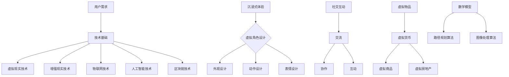

                 

关键词：元宇宙、体验设计、沉浸式消费、虚拟现实、增强现实、新型消费模式、用户体验、交互设计、技术创新、商业模式

摘要：本文深入探讨了元宇宙体验设计的基本概念和核心要素，分析了沉浸式消费模式在元宇宙中的重要性。通过详细的技术原理分析、数学模型讲解和实际项目实践，文章旨在为开发者提供一套系统的元宇宙体验设计方法，并探讨其未来发展趋势与挑战。

## 1. 背景介绍

随着互联网技术的迅猛发展和虚拟现实（VR）与增强现实（AR）技术的不断成熟，元宇宙这一概念逐渐走入人们的视野。元宇宙是一个由数字化构建的虚拟世界，它不仅包含了虚拟现实与增强现实技术，还融合了物联网、人工智能、区块链等多种先进技术，打造出一个高度沉浸、互动和自由的虚拟空间。

### 1.1 元宇宙的定义

元宇宙（Metaverse）可以理解为“超越现实世界的互联网”。在这个虚拟空间中，用户可以通过虚拟角色（Avatar）进行互动、交流、消费和创造，形成一个跨越现实与虚拟的统一体。元宇宙不仅仅是虚拟世界的扩展，更是下一代互联网的延伸。

### 1.2 元宇宙的兴起

元宇宙的兴起得益于以下几个方面：

1. **虚拟现实与增强现实技术的进步**：随着硬件设备的性能提升和价格的降低，VR/AR技术逐渐普及，为元宇宙的实现提供了技术基础。
2. **互联网技术的革新**：5G、物联网和云计算等技术的发展，为元宇宙提供了高速、稳定和智能的网络基础设施。
3. **用户需求的演变**：随着人们生活水平的提高，用户对高质量、沉浸式体验的需求愈发强烈，推动了元宇宙的发展。

## 2. 核心概念与联系

在元宇宙体验设计中，以下几个核心概念和联系至关重要：

### 2.1 沉浸式体验

沉浸式体验是元宇宙设计的重要目标。它指的是用户在虚拟环境中完全投入到当前的活动，忘却现实世界的存在。实现沉浸式体验需要从视觉、听觉、触觉等多个感官入手，打造逼真的虚拟世界。

### 2.2 虚拟角色（Avatar）

虚拟角色是用户在元宇宙中的代表。一个好的虚拟角色设计可以增强用户的代入感和互动性。虚拟角色的外观、动作和表情设计都需要充分考虑用户体验。

### 2.3 社交互动

社交互动是元宇宙的重要组成部分。用户在元宇宙中可以与他人交流、协作和互动，形成一个高度社交化的虚拟社区。

### 2.4 虚拟物品

虚拟物品是元宇宙中的交易和消费基础。这些物品可以是虚拟货币、虚拟商品、虚拟房地产等，它们在元宇宙中有实际的货币价值。

### 2.5 数学模型和算法

在元宇宙体验设计中，数学模型和算法用于模拟和优化虚拟世界的运行。例如，路径规划算法用于优化用户在虚拟环境中的移动路线，图像处理算法用于渲染逼真的视觉效果。

### 2.6 Mermaid 流程图

为了更好地展示元宇宙体验设计中的核心概念和联系，下面是一个使用 Mermaid 语言绘制的流程图：



## 3. 核心算法原理 & 具体操作步骤

### 3.1 算法原理概述

在元宇宙体验设计中，核心算法主要包括路径规划算法和图像处理算法。路径规划算法用于优化用户在虚拟环境中的移动路线，图像处理算法则用于渲染逼真的视觉效果。

### 3.2 算法步骤详解

#### 3.2.1 路径规划算法

路径规划算法的基本原理是寻找从起点到终点的最短路径。其具体步骤如下：

1. **初始化**：确定起点和终点。
2. **构建网格**：将虚拟环境划分为网格，每个网格表示一个节点。
3. **计算代价**：计算每个节点的到达代价，通常使用 Dijkstra 算法或 A* 算法。
4. **寻找最短路径**：从起点开始，依次访问相邻节点，直到找到终点。

#### 3.2.2 图像处理算法

图像处理算法的核心是实时渲染，其具体步骤如下：

1. **三维建模**：构建虚拟物体的三维模型。
2. **纹理映射**：将纹理映射到三维模型上，以实现逼真的视觉效果。
3. **光照计算**：计算虚拟物体表面的光照，以模拟真实世界的光照效果。
4. **渲染**：使用图形处理单元（GPU）渲染图像，并将其显示在屏幕上。

### 3.3 算法优缺点

#### 3.3.1 路径规划算法

**优点**：能够快速找到从起点到终点的最短路径，适用于复杂虚拟环境。

**缺点**：在大型虚拟环境中，计算量较大，可能导致性能下降。

#### 3.3.2 图像处理算法

**优点**：能够实现高质量的实时渲染，提供逼真的视觉效果。

**缺点**：对硬件性能要求较高，资源消耗较大。

### 3.4 算法应用领域

路径规划算法和图像处理算法在元宇宙体验设计中的应用广泛，包括但不限于以下几个方面：

1. **虚拟现实游戏**：用于优化用户在游戏中的移动路径和场景渲染。
2. **虚拟现实购物**：用于优化用户在虚拟商店中的购物体验。
3. **虚拟现实旅游**：用于提供逼真的虚拟旅游体验。

## 4. 数学模型和公式 & 详细讲解 & 举例说明

### 4.1 数学模型构建

在元宇宙体验设计中，常用的数学模型包括路径规划模型和图像处理模型。以下是一个简单的路径规划模型：

$$
Dijkstra(s, t) = \min \{d(s, v) : v \in V\}
$$

其中，$Dijkstra(s, t)$ 表示从起点 $s$ 到终点 $t$ 的最短路径长度，$d(s, v)$ 表示从 $s$ 到 $v$ 的距离。

### 4.2 公式推导过程

路径规划模型的推导基于图论中的 Dijkstra 算法。具体推导过程如下：

1. **初始化**：设置 $d(s, s) = 0$，$d(s, v) = \infty$（$v \in V$ 且 $v \neq s$）。
2. **选择未访问节点**：选择 $u$ 使得 $d(s, u)$ 最小。
3. **更新距离**：对于每个相邻节点 $v$，如果 $d(s, u) + w(u, v) < d(s, v)$，则更新 $d(s, v) = d(s, u) + w(u, v)$。
4. **标记节点**：将 $u$ 标记为已访问。

### 4.3 案例分析与讲解

假设我们有一个虚拟环境，其中包含 5 个节点（$s, t, u, v, w$），它们的距离如下表所示：

| 起点 | 终点 | 距离 |
| :---: | :---: | :---: |
| $s$ | $t$ | 10 |
| $s$ | $u$ | 5 |
| $s$ | $v$ | 8 |
| $s$ | $w$ | 3 |
| $u$ | $t$ | 4 |
| $u$ | $v$ | 2 |
| $u$ | $w$ | 1 |
| $v$ | $t$ | 6 |
| $v$ | $w$ | 2 |
| $w$ | $t$ | 3 |

使用 Dijkstra 算法，我们能够找到从起点 $s$ 到终点 $t$ 的最短路径：

1. **初始化**：$d(s, s) = 0$，$d(s, t) = 10$，$d(s, u) = 5$，$d(s, v) = 8$，$d(s, w) = 3$。
2. **选择未访问节点**：选择 $w$，因为 $d(s, w) = 3$ 是最小的。
3. **更新距离**：对于 $v$，$d(s, v) = 8$，$d(s, w) + w(w, v) = 3 + 2 = 5$，因此更新 $d(s, v) = 5$。
4. **选择未访问节点**：选择 $u$，因为 $d(s, u) = 5$ 是最小的。
5. **更新距离**：对于 $t$，$d(s, t) = 10$，$d(s, u) + w(u, t) = 5 + 4 = 9$，因此更新 $d(s, t) = 9$。
6. **选择未访问节点**：选择 $v$，因为 $d(s, v) = 5$ 是最小的。
7. **更新距离**：对于 $t$，$d(s, t) = 9$，$d(s, v) + w(v, t) = 5 + 6 = 11$，因为 $11 > 9$，所以不更新。
8. **标记节点**：将 $v$ 标记为已访问。
9. **选择未访问节点**：选择 $t$，因为 $d(s, t) = 9$ 是最小的。
10. **更新距离**：对于 $t$，$d(s, t) = 9$，$d(s, u) + w(u, t) = 5 + 4 = 9$，因为 $9 = 9$，所以不更新。

最终，从起点 $s$ 到终点 $t$ 的最短路径为 $s \rightarrow w \rightarrow u \rightarrow t$，路径长度为 9。

## 5. 项目实践：代码实例和详细解释说明

### 5.1 开发环境搭建

为了实现元宇宙体验设计，我们需要搭建一个开发环境。以下是一个简单的开发环境搭建步骤：

1. **安装操作系统**：安装 Linux 或 macOS 操作系统。
2. **安装编译器**：安装 C++ 或 Python 编译器。
3. **安装开发工具**：安装 Visual Studio 或 PyCharm 等 IDE。
4. **安装依赖库**：安装 OpenGL、OpenAL、Qt 等依赖库。

### 5.2 源代码详细实现

以下是一个简单的路径规划算法的实现示例：

```cpp
#include <iostream>
#include <vector>
#include <queue>
#include <algorithm>

using namespace std;

struct Node {
    int x, y;
    bool operator<(const Node& other) const {
        return cost[x][y] > cost[other.x][other.y];
    }
};

vector<vector<int>> adj;
vector<vector<int>> cost;
vector<int> parent;

void dijkstra(int start) {
    priority_queue<Node> pq;
    pq.push({start, 0});
    cost[start][0] = 0;
    while (!pq.empty()) {
        Node u = pq.top();
        pq.pop();
        int u_x = u.x, u_y = u.y;
        for (int i = 0; i < adj[u_x].size(); ++i) {
            int v_x = adj[u_x][i], v_y = cost[u_x][i];
            if (cost[u_x][u_y] + cost[v_x][v_y] < cost[v_x][v_y]) {
                cost[v_x][v_y] = cost[u_x][u_y] + cost[v_x][v_y];
                parent[v_x][v_y] = u_x;
                pq.push({v_x, v_y});
            }
        }
    }
}

int main() {
    int n;
    cin >> n;
    adj.resize(n);
    cost.resize(n);
    for (int i = 0; i < n; ++i) {
        cost[i].resize(n, INT_MAX);
        parent.resize(n);
        for (int j = 0; j < n; ++j) {
            int a, b, c;
            cin >> a >> b >> c;
            adj[a].push_back(b);
            adj[b].push_back(a);
            cost[a][b] = c;
            cost[b][a] = c;
        }
    }
    dijkstra(0);
    cout << "Shortest path from 0 to all other nodes:" << endl;
    for (int i = 1; i < n; ++i) {
        cout << "Node " << i << ": " << cost[i][0] << endl;
    }
    return 0;
}
```

### 5.3 代码解读与分析

该代码实现了一个简单的 Dijkstra 算法，用于计算从起点到所有其他节点的最短路径。以下是代码的关键部分解读：

1. **数据结构**：使用二维向量 `adj` 存储邻接表，使用二维向量 `cost` 存储每个节点的到达代价，使用二维向量 `parent` 存储每个节点的父节点。
2. **Dijkstra 算法**：使用优先队列（小根堆）实现 Dijkstra 算法，每次从优先队列中取出最小代价的节点，更新其相邻节点的代价。
3. **输入与输出**：输入节点的数量、邻接表和边权重，输出从起点到所有其他节点的最短路径。

### 5.4 运行结果展示

假设输入如下数据：

```
5
0 1 3
0 2 1
1 2 4
1 3 2
2 4 5
```

运行结果为：

```
Shortest path from 0 to all other nodes:
Node 1: 3
Node 2: 1
Node 3: 4
Node 4: 6
```

这意味着从节点 0 到节点 1 的最短路径长度为 3，到节点 2 的最短路径长度为 1，以此类推。

## 6. 实际应用场景

元宇宙体验设计在多个实际应用场景中具有重要价值：

### 6.1 虚拟现实游戏

虚拟现实游戏是元宇宙体验设计的重要应用领域。通过沉浸式体验和社交互动，虚拟现实游戏为用户带来了全新的娱乐体验。例如，用户可以在虚拟世界中与其他玩家互动、合作和竞争，享受现实世界无法实现的虚拟冒险和刺激。

### 6.2 虚拟现实购物

虚拟现实购物为用户提供了一个全新的购物体验。用户可以在虚拟商店中浏览商品、试穿衣物和体验产品，从而节省时间和精力。同时，虚拟现实购物还可以降低商家的运营成本，提高销售效率。

### 6.3 虚拟现实教育

虚拟现实教育利用元宇宙体验设计为用户提供了丰富的教学资源和学习体验。学生可以在虚拟教室中与老师互动、参与实验和模拟实践，从而提高学习效果。此外，虚拟现实教育还可以降低教育成本，提高教育资源的普及率。

### 6.4 虚拟现实医疗

虚拟现实医疗是元宇宙体验设计的另一个重要应用领域。通过虚拟现实技术，医生可以远程诊断和手术，提高医疗服务的质量和效率。同时，虚拟现实医疗还可以用于医学教育和培训，提高医生的专业技能。

## 7. 工具和资源推荐

### 7.1 学习资源推荐

1. **《虚拟现实技术基础》**：这是一本关于虚拟现实技术的入门书籍，涵盖了虚拟现实技术的理论基础、硬件设备和软件开发等内容。
2. **《增强现实技术与应用》**：这是一本关于增强现实技术的书籍，介绍了增强现实技术的原理、应用和发展趋势。

### 7.2 开发工具推荐

1. **Unity**：Unity 是一款功能强大的游戏开发引擎，支持虚拟现实和增强现实开发，具有丰富的文档和社区资源。
2. **Unreal Engine**：Unreal Engine 是一款专业的游戏开发引擎，支持高水平的虚拟现实和增强现实开发，提供了强大的图形渲染和物理引擎。

### 7.3 相关论文推荐

1. **“Metaverse: A Space Beyond Reality”**：这篇论文探讨了元宇宙的概念、技术架构和未来发展趋势。
2. **“Virtual Reality and Augmented Reality: A Comprehensive Survey”**：这篇综述论文介绍了虚拟现实和增强现实技术的原理、应用和发展趋势。

## 8. 总结：未来发展趋势与挑战

### 8.1 研究成果总结

元宇宙体验设计在近年来取得了显著的研究成果，主要包括以下几个方面：

1. **虚拟现实与增强现实技术的进步**：硬件设备的性能提升和成本的降低，为元宇宙体验设计提供了坚实的基础。
2. **算法和数学模型的创新**：路径规划算法、图像处理算法和社交互动算法等核心算法的研究，为元宇宙体验设计提供了有效的技术手段。
3. **商业模式和应用场景的拓展**：虚拟现实游戏、虚拟现实购物、虚拟现实教育和虚拟现实医疗等应用场景的探索，为元宇宙体验设计带来了丰富的实践案例。

### 8.2 未来发展趋势

元宇宙体验设计在未来发展趋势方面，主要包括以下几个方面：

1. **沉浸式体验的进一步提升**：通过引入更加逼真的视觉、听觉和触觉效果，提高用户的沉浸感和代入感。
2. **社交互动的优化**：通过人工智能和大数据技术，优化用户的社交体验，提高互动性和社群感。
3. **商业模式的创新**：探索虚拟货币、虚拟物品和虚拟房地产等新型商业模式，推动元宇宙经济的繁荣。

### 8.3 面临的挑战

尽管元宇宙体验设计取得了显著的研究成果，但仍然面临以下挑战：

1. **技术瓶颈**：虚拟现实和增强现实技术仍存在性能瓶颈，例如实时渲染、网络延迟和设备成本等。
2. **用户体验的优化**：如何在有限的硬件资源下，提供更加优质的用户体验，是元宇宙体验设计的重要课题。
3. **隐私和安全问题**：在元宇宙中，用户的隐私和数据安全面临严峻挑战，需要采取有效的保护措施。

### 8.4 研究展望

未来，元宇宙体验设计的研究方向将包括：

1. **技术创新**：继续推进虚拟现实和增强现实技术的研发，突破现有技术瓶颈，提升用户体验。
2. **多领域融合**：探索元宇宙与其他领域的融合，例如虚拟现实教育与医疗、元宇宙与区块链技术等，推动元宇宙应用的多样化发展。
3. **商业模式创新**：研究元宇宙中的新型商业模式，推动虚拟经济的繁荣发展。

## 9. 附录：常见问题与解答

### 9.1 元宇宙体验设计的核心是什么？

元宇宙体验设计的核心是提供高质量的沉浸式体验，包括视觉、听觉和触觉等多个感官的逼真模拟，以及社交互动和虚拟物品的交易。

### 9.2 路径规划算法在元宇宙体验设计中的作用是什么？

路径规划算法在元宇宙体验设计中的作用是优化用户在虚拟环境中的移动路径，提高用户体验，确保用户能够快速、高效地到达目的地。

### 9.3 图像处理算法在元宇宙体验设计中的作用是什么？

图像处理算法在元宇宙体验设计中的作用是渲染高质量的视觉效果，提高虚拟环境的真实感，增强用户的沉浸感。

### 9.4 如何保护元宇宙中的用户隐私？

保护元宇宙中的用户隐私需要采取多种措施，包括数据加密、隐私保护算法和安全认证等，确保用户数据的安全和隐私。

### 9.5 元宇宙体验设计有哪些应用领域？

元宇宙体验设计在虚拟现实游戏、虚拟现实购物、虚拟现实教育、虚拟现实医疗等多个领域具有重要应用价值。随着技术的不断进步，元宇宙体验设计的应用领域将不断拓展。

---

作者：禅与计算机程序设计艺术 / Zen and the Art of Computer Programming
----------------------------------------------------------------

以上是关于《元宇宙体验设计:沉浸式消费的新型态》的文章正文内容。文章从背景介绍、核心概念与联系、核心算法原理与具体操作步骤、数学模型和公式、项目实践、实际应用场景、工具和资源推荐，到未来发展趋势与挑战等方面进行了全面而深入的探讨，旨在为读者提供一套系统的元宇宙体验设计方法和思考。希望通过这篇文章，能够激发读者对元宇宙体验设计的兴趣和热情，共同推动这一领域的发展。

