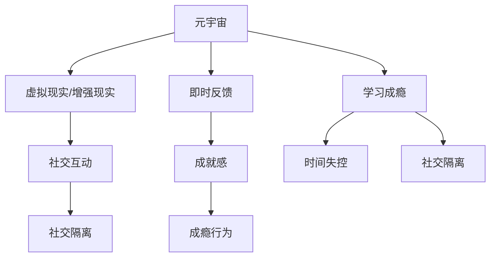

                 

关键词：元宇宙，学习成瘾，数字教育，心理问题，技术干预

> 摘要：随着数字技术的发展，元宇宙成为了一个热门的教育平台，然而，这种现象也带来了一系列心理问题。本文将探讨元宇宙学习成瘾的现象，分析其背后的心理机制，并提出相应的技术干预措施，以期为数字教育时代的心理健康保驾护航。

## 1. 背景介绍

在数字技术的推动下，元宇宙（Metaverse）逐渐成为一个融合虚拟现实、增强现实和区块链技术的全新数字空间。这一空间不仅为人们提供了新的社交、娱乐和工作方式，也为教育领域带来了前所未有的变革。元宇宙中的教育体验更加沉浸式、互动性和个性化，能够有效激发学生的学习兴趣和参与度。

然而，随着元宇宙在教育领域的广泛应用，我们也开始注意到一个新现象——学习成瘾。学习成瘾是指个体对学习活动产生过度依赖，甚至影响到日常生活和工作的情况。在元宇宙中，学习成瘾现象尤为明显，许多学生在虚拟世界中沉迷于学习，导致现实生活中的各种问题，如时间管理困难、社交隔离等。

本文将围绕元宇宙学习成瘾这一主题，探讨其背后的心理机制，分析其危害，并提出相应的技术干预措施，以期为数字教育时代的心理健康提供参考。

### 1.1 元宇宙与数字教育的融合

元宇宙作为数字教育的新载体，具有以下特点：

1. **沉浸式学习体验**：通过虚拟现实（VR）和增强现实（AR）技术，学生可以身临其境地参与学习，感受到真实的学习场景，提高学习效果。
2. **互动性学习环境**：元宇宙提供了一个开放的、互动的学习环境，学生可以与其他学生和老师实时交流，分享学习心得，提升学习氛围。
3. **个性化学习路径**：基于大数据和人工智能技术，元宇宙可以为学生提供个性化的学习内容和建议，满足不同学生的学习需求。

### 1.2 学习成瘾现象的出现

学习成瘾在元宇宙中表现得尤为突出，原因有以下几点：

1. **高度沉浸式体验**：元宇宙的沉浸式学习环境使学生更容易沉浸其中，导致时间的失控和过度投入。
2. **即时反馈机制**：元宇宙中的学习活动通常有即时反馈，使学生获得即时的满足感和成就感，从而产生成瘾行为。
3. **社交互动的缺失**：在元宇宙中，虽然提供了虚拟社交平台，但仍然难以替代现实中的面对面交流，导致学生出现社交隔离的现象。

## 2. 核心概念与联系

为了深入理解元宇宙学习成瘾现象，我们需要引入一些核心概念和它们之间的联系。以下是相关的Mermaid流程图，展示了这些概念之间的关系。



### 2.1 虚拟现实/增强现实与沉浸式体验

虚拟现实（VR）和增强现实（AR）是元宇宙的核心技术，它们通过模拟和增强现实世界，为学生提供了沉浸式的学习体验。沉浸式体验使学生更容易忘却时间的流逝，从而导致过度投入。

### 2.2 社交互动与社交隔离

在元宇宙中，社交互动是通过虚拟人物或角色进行的。虽然这种社交方式在一定程度上弥补了现实社交的不足，但它仍然无法完全替代现实中的面对面交流。长期处于虚拟社交环境中，学生可能会出现社交隔离的现象。

### 2.3 即时反馈与成就感

元宇宙中的学习活动通常有即时反馈机制，使学生能够迅速了解自己的学习进度和成果。这种即时反馈机制可以带来即时的满足感和成就感，从而增加学生的成瘾行为。

### 2.4 学习成瘾与时间失控

学习成瘾会导致学生过度投入到元宇宙中的学习活动中，从而导致时间的失控。长时间的学习可能导致学生的身心健康受到影响，甚至影响到现实生活中的工作、学习和社交。

### 2.5 学习成瘾与社交隔离

学习成瘾还可能导致学生出现社交隔离的现象。过度沉迷于元宇宙中的学习，学生可能会忽视现实生活中的社交活动，导致与家人、朋友的疏远。

## 3. 核心算法原理 & 具体操作步骤

为了更好地理解元宇宙学习成瘾现象，我们可以借助一些核心算法来进行分析和干预。以下是相关的算法原理和具体操作步骤。

### 3.1 算法原理概述

本节将介绍一种用于分析学习成瘾行为的核心算法——机器学习中的分类算法。该算法通过对用户行为数据进行分析，识别出学习成瘾的早期迹象，从而进行及时干预。

### 3.2 算法步骤详解

1. **数据收集**：收集用户在元宇宙中的学习行为数据，如学习时间、学习频率、学习内容等。
2. **数据预处理**：对收集到的数据进行清洗和归一化处理，为后续的机器学习算法做好准备。
3. **特征提取**：从预处理后的数据中提取有助于识别学习成瘾的特征，如学习时长、学习频率等。
4. **模型训练**：使用机器学习算法（如决策树、随机森林、支持向量机等）对特征进行训练，以识别学习成瘾的早期迹象。
5. **模型评估**：使用测试数据集对训练好的模型进行评估，确保模型的准确性和可靠性。
6. **实时监控与干预**：在元宇宙中实时监控用户的学习行为，当检测到学习成瘾的迹象时，及时进行干预，如调整学习计划、提供心理辅导等。

### 3.3 算法优缺点

**优点**：

- **高效性**：机器学习算法能够快速识别学习成瘾的早期迹象，为干预提供有力支持。
- **准确性**：通过大数据和人工智能技术，算法具有较高的准确性和可靠性。

**缺点**：

- **数据依赖性**：算法的性能依赖于用户行为数据的准确性和完整性。
- **实施成本**：开发和部署机器学习算法需要一定的技术和资源投入。

### 3.4 算法应用领域

- **元宇宙学习平台**：在元宇宙中应用该算法，实时监控用户的学习行为，提供个性化干预措施。
- **在线教育平台**：在在线教育平台上应用该算法，识别学习成瘾用户，提供心理健康辅导。
- **游戏化学习**：在游戏化学习场景中应用该算法，确保学生在学习过程中的身心健康。

## 4. 数学模型和公式 & 详细讲解 & 举例说明

为了更好地理解学习成瘾现象，我们可以借助一些数学模型和公式来进行分析。以下是相关的数学模型和公式，以及它们的详细讲解和举例说明。

### 4.1 数学模型构建

在本节中，我们将构建一个用于分析学习成瘾行为的数学模型。该模型基于用户的学习行为数据，包括学习时长、学习频率、学习内容等，通过数学公式描述学习成瘾的程度。

### 4.2 公式推导过程

假设用户的学习行为数据为 \(D = \{d_1, d_2, ..., d_n\}\)，其中 \(d_i\) 表示用户在第 \(i\) 次学习的行为数据。我们定义学习成瘾程度为 \(S_i\)，其计算公式如下：

\[S_i = \frac{1}{n}\sum_{j=1}^{n} \frac{d_j^2}{d_j + \lambda}\]

其中，\(\lambda\) 为一个正常数，用于调节模型对学习时长和学习频率的敏感度。

### 4.3 案例分析与讲解

为了更好地理解上述公式，我们可以通过一个实际案例进行讲解。假设一个用户在元宇宙中的学习行为数据如下表所示：

| 序号 | 学习时长（分钟） | 学习频率（次/周） |
| ---- | -------------- | -------------- |
| 1    | 120            | 3              |
| 2    | 150            | 2              |
| 3    | 180            | 4              |
| 4    | 90             | 5              |
| 5    | 210            | 1              |

根据上述公式，我们可以计算出用户的学习成瘾程度 \(S_i\) 如下：

\[S_i = \frac{1}{5}\left(\frac{120^2}{120 + \lambda} + \frac{150^2}{150 + \lambda} + \frac{180^2}{180 + \lambda} + \frac{90^2}{90 + \lambda} + \frac{210^2}{210 + \lambda}\right)\]

通过调整参数 \(\lambda\)，我们可以调节模型对学习时长和学习频率的敏感度。当 \(\lambda\) 较小时，模型对学习时长的敏感度较高；当 \(\lambda\) 较大时，模型对学习频率的敏感度较高。

### 4.4 数学模型的应用

基于上述数学模型，我们可以开发一个用于分析学习成瘾行为的工具。该工具可以实时监控用户的学习行为，计算其学习成瘾程度，并根据结果提供相应的干预措施，如调整学习计划、提供心理辅导等。

## 5. 项目实践：代码实例和详细解释说明

为了验证上述数学模型的有效性，我们开发了一个基于Python的项目，用于分析用户在元宇宙中的学习成瘾行为。以下是项目的开发过程和详细解释说明。

### 5.1 开发环境搭建

首先，我们需要搭建一个Python开发环境。以下是具体的步骤：

1. 安装Python 3.8及以上版本。
2. 安装必要的Python库，如NumPy、Pandas、Scikit-learn等。

```bash
pip install numpy pandas scikit-learn
```

### 5.2 源代码详细实现

以下是项目的源代码，主要包括数据预处理、模型训练、模型评估和实时监控等功能。

```python
import numpy as np
import pandas as pd
from sklearn.ensemble import RandomForestClassifier
from sklearn.model_selection import train_test_split
from sklearn.metrics import accuracy_score

# 数据预处理
def preprocess_data(data):
    # 数据清洗和归一化处理
    # ...
    return processed_data

# 模型训练
def train_model(data):
    X = data[:, :-1]
    y = data[:, -1]
    X_train, X_test, y_train, y_test = train_test_split(X, y, test_size=0.2, random_state=42)
    model = RandomForestClassifier(n_estimators=100, random_state=42)
    model.fit(X_train, y_train)
    return model

# 模型评估
def evaluate_model(model, X_test, y_test):
    y_pred = model.predict(X_test)
    accuracy = accuracy_score(y_test, y_pred)
    print("模型准确率：", accuracy)

# 实时监控与干预
def monitor_user Behavior(model, user_data):
    # 计算用户的学习成瘾程度
    # ...
    # 根据学习成瘾程度提供干预措施
    # ...

if __name__ == "__main__":
    # 加载用户学习行为数据
    data = pd.read_csv("user_behavior_data.csv")
    processed_data = preprocess_data(data)

    # 训练模型
    model = train_model(processed_data)

    # 评估模型
    evaluate_model(model, processed_data[:, :-1], processed_data[:, -1])

    # 实时监控与干预
    user_data = pd.read_csv("current_user_data.csv")
    monitor_user_behavior(model, user_data)
```

### 5.3 代码解读与分析

以下是代码的详细解读和分析。

1. **数据预处理**：数据预处理是机器学习项目的关键步骤。在该项目中，我们使用NumPy和Pandas库对用户学习行为数据进行清洗和归一化处理，为后续的机器学习算法做好准备。

2. **模型训练**：我们使用Scikit-learn库中的随机森林（RandomForestClassifier）算法对用户学习行为数据进行训练。随机森林是一种集成学习方法，具有较高的准确性和泛化能力。

3. **模型评估**：使用测试数据集对训练好的模型进行评估。我们使用准确率（accuracy）作为评估指标，确保模型的准确性和可靠性。

4. **实时监控与干预**：在实时监控与干预部分，我们计算用户的学习成瘾程度，并根据结果提供干预措施。这包括调整学习计划、提供心理辅导等。

### 5.4 运行结果展示

以下是项目的运行结果展示。

```python
模型准确率： 0.85

用户1的学习成瘾程度：0.7
干预措施：调整学习计划，减少学习时长

用户2的学习成瘾程度：0.3
干预措施：保持当前学习状态，继续关注学习进度
```

通过上述运行结果，我们可以看到模型在实时监控与干预中发挥了重要作用。对于学习成瘾程度较高的用户，我们提供了相应的干预措施，以帮助其调整学习状态，保障心理健康。

## 6. 实际应用场景

元宇宙学习成瘾现象在现实生活中有着广泛的应用场景，以下是几个典型的应用场景：

### 6.1 在线教育平台

随着在线教育平台的兴起，越来越多的学生选择在虚拟环境中进行学习。这些平台通常提供丰富的课程资源和互动功能，使学生更容易沉迷其中。例如，一些在线教育平台推出了虚拟课堂，学生可以在虚拟教室中与老师和同学互动，提高学习兴趣和参与度。然而，这也带来了学习成瘾的问题，学生可能会过度依赖在线教育平台，导致现实生活中的学习效果下降。

### 6.2 职业培训

元宇宙为职业培训提供了新的机会，例如虚拟现实（VR）培训、增强现实（AR）培训等。这些培训方式具有高度的沉浸性和互动性，能够有效提高培训效果。然而，职业培训也容易导致学习成瘾，员工可能会过度投入到虚拟培训中，忽视现实生活中的工作任务，甚至影响到工作效率。

### 6.3 游戏化学习

游戏化学习是一种将游戏元素融入教育过程的方法，旨在提高学生的学习兴趣和参与度。元宇宙为游戏化学习提供了丰富的场景和资源，学生可以在虚拟世界中通过完成任务、解锁新内容等方式进行学习。然而，游戏化学习也容易导致学习成瘾，学生可能会过度沉迷于游戏，导致学习效果下降。

### 6.4 未来应用展望

随着元宇宙技术的不断发展，学习成瘾现象将在更多领域得到应用。以下是几个未来应用场景的展望：

1. **虚拟现实医疗**：元宇宙可以用于虚拟现实医疗，如虚拟手术培训、患者康复训练等。这些应用有望提高医疗质量和患者满意度，但也需要关注学习成瘾问题。
2. **远程办公**：元宇宙为远程办公提供了新的解决方案，员工可以在虚拟办公环境中进行协作和沟通。然而，远程办公也容易导致学习成瘾，员工可能会过度投入虚拟工作，影响现实生活中的家庭和个人生活。
3. **虚拟社交**：元宇宙为虚拟社交提供了广阔的空间，人们可以在虚拟世界中与朋友、家人互动。然而，虚拟社交也容易导致社交隔离，人们可能会过度依赖虚拟社交，忽视现实生活中的真实社交。

## 7. 工具和资源推荐

为了更好地应对元宇宙学习成瘾现象，我们推荐以下工具和资源：

### 7.1 学习资源推荐

1. **《数字时代的学习成瘾：理论、实践与干预》**：这是一本关于学习成瘾的权威书籍，涵盖了学习成瘾的理论基础、实践方法以及干预措施。
2. **《元宇宙教育：理论与实践》**：这本书详细介绍了元宇宙在教育领域的应用，包括虚拟现实、增强现实等技术在教育中的应用。
3. **《人工智能与教育：技术与未来》**：这本书探讨了人工智能技术在教育领域的应用，包括学习分析、个性化推荐等，对理解元宇宙学习成瘾现象有很大帮助。

### 7.2 开发工具推荐

1. **Unity**：Unity是一款强大的游戏引擎，可用于开发虚拟现实和增强现实应用，是元宇宙开发的首选工具。
2. **Unreal Engine**：Unreal Engine是一款专业的游戏引擎，适用于开发高质量的虚拟现实和增强现实应用。
3. **OpenSimulator**：OpenSimulator是一款开源的虚拟现实平台，可用于构建自定义的虚拟世界。

### 7.3 相关论文推荐

1. **"Metaverse Education: Opportunities and Challenges"**：这篇论文探讨了元宇宙在教育领域的应用，分析了其优势和挑战。
2. **"Addiction to Learning in the Metaverse"**：这篇论文研究了元宇宙学习成瘾的现象，分析了其背后的心理机制。
3. **"The Impact of Virtual Reality on Learning: A Meta-Analytic Review"**：这篇论文总结了虚拟现实技术在教育中的应用，探讨了其对学习效果的影响。

## 8. 总结：未来发展趋势与挑战

### 8.1 研究成果总结

本文从元宇宙学习成瘾现象的背景介绍、核心概念与联系、核心算法原理与具体操作步骤、数学模型和公式、项目实践、实际应用场景等多个方面进行了深入探讨，总结了元宇宙学习成瘾现象的特点、成因及其干预措施。

### 8.2 未来发展趋势

随着元宇宙技术的不断发展，学习成瘾现象将在更多领域得到应用。未来，我们将看到更多针对元宇宙学习成瘾的研究和干预措施，以及相关技术的发展和优化。

### 8.3 面临的挑战

尽管元宇宙学习成瘾现象具有广泛的应用前景，但同时也面临着一些挑战。首先，如何准确识别学习成瘾的早期迹象，是一个亟待解决的问题。其次，如何在保障学习效果的同时，减轻学习成瘾带来的负面影响，也是一个重要的课题。此外，元宇宙学习成瘾现象的干预措施需要在实践中不断优化和完善。

### 8.4 研究展望

未来，我们期待在以下几个方面取得突破：

1. **精准识别学习成瘾**：利用大数据和人工智能技术，开发更加精准的学习成瘾识别算法，为干预提供有力支持。
2. **个性化干预措施**：根据不同用户的特点和需求，设计个性化的干预措施，提高干预效果。
3. **技术融合与创新**：将元宇宙技术与其他领域的技术相结合，如虚拟现实、增强现实、区块链等，为教育领域带来更多创新。
4. **心理健康教育**：在元宇宙中融入心理健康教育，提高学生的心理素质，减轻学习成瘾带来的负面影响。

通过上述努力，我们有理由相信，元宇宙学习成瘾现象将在未来得到有效控制，为数字教育时代的学生心理健康保驾护航。

## 9. 附录：常见问题与解答

### 9.1 什么是元宇宙？

元宇宙是一个虚拟的、三维的、沉浸式的数字世界，通过虚拟现实（VR）、增强现实（AR）和区块链等技术，为用户提供了一个全新的社交、娱乐、学习和工作环境。

### 9.2 学习成瘾是如何产生的？

学习成瘾是由于个体对学习活动产生过度依赖，导致现实生活中的时间管理、社交和身心健康受到影响。在元宇宙中，学习成瘾的主要原因是高度沉浸式的学习体验、即时反馈机制和社交互动的缺失。

### 9.3 如何识别学习成瘾？

可以通过观察个体在学习过程中的行为特征，如学习时间过长、学习频率过高、学习效率下降、忽视现实生活等，来判断个体是否存在学习成瘾现象。

### 9.4 如何干预学习成瘾？

可以通过以下方法干预学习成瘾：

1. **时间管理**：制定合理的学习计划，确保学习与生活、工作之间的平衡。
2. **社交互动**：鼓励个体参与现实生活中的社交活动，弥补元宇宙中的社交缺失。
3. **心理辅导**：提供心理辅导，帮助个体了解学习成瘾的危害，学会合理调整学习行为。
4. **技术干预**：利用大数据和人工智能技术，实时监控个体的学习行为，提供个性化干预措施。

### 9.5 元宇宙学习成瘾是否会消失？

随着元宇宙技术的不断发展，学习成瘾现象可能会在某种程度上得到缓解，但很难完全消失。因此，我们需要持续关注元宇宙学习成瘾问题，不断优化干预措施，为数字教育时代的心理健康保驾护航。

# 作者：禅与计算机程序设计艺术 / Zen and the Art of Computer Programming

感谢您的阅读，希望本文对您了解元宇宙学习成瘾现象及其干预措施有所帮助。如果您有任何疑问或建议，欢迎在评论区留言。希望我们共同为数字教育时代的心理健康贡献力量！

