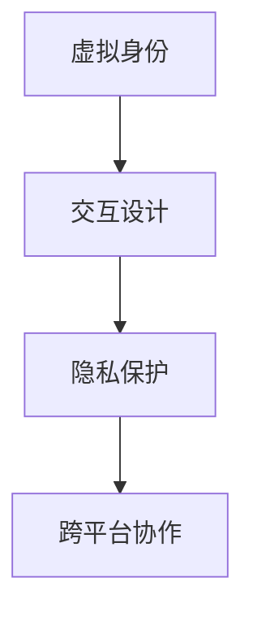

                 

关键词：元宇宙、社交礼仪、虚拟世界、人际交往、虚拟身份、交互设计、隐私保护、网络礼仪、跨平台协作

> 摘要：本文探讨了在元宇宙这一新兴的虚拟世界中，人际交往的准则与礼仪。随着技术的进步，虚拟世界已经成为人们交流、互动的新场所，如何在其中维护良好的社交秩序、保护个人隐私、促进跨平台协作，成为了亟待解决的问题。本文将结合最新的研究成果和实践经验，详细阐述元宇宙社交礼仪的核心原则和实际应用。

## 1. 背景介绍

随着虚拟现实（VR）、增强现实（AR）和混合现实（MR）技术的快速发展，元宇宙这一概念逐渐走进人们的视野。元宇宙是一个由计算机生成的虚拟三维空间，用户可以在其中创建和体验各种虚拟场景，进行社交互动、娱乐、工作等活动。相较于传统的互联网平台，元宇宙提供了更加沉浸式的体验和更加丰富的交互方式。

在元宇宙中，用户的身份不再是简单的数字标识，而是可以通过虚拟角色（Avatar）来表现。这些虚拟角色不仅具备外观、性格等特征，还可以进行复杂的动作和表情表达，使得人际交往更加生动和丰富。然而，这种高度仿真的虚拟环境也带来了新的挑战，特别是在社交礼仪方面。

首先，元宇宙中的社交礼仪与传统社交礼仪有所不同。虚拟世界的匿名性、虚拟身份的多样性使得传统礼仪的适用性受到限制。其次，虚拟世界中的互动方式多样化，从文字聊天到语音通话，再到实时视频互动，各种形式的交流方式都需要制定相应的礼仪规范。此外，元宇宙中的隐私保护问题也成为了社交礼仪的重要一环。

## 2. 核心概念与联系

### 2.1 元宇宙社交礼仪的概念

元宇宙社交礼仪是指用户在元宇宙中遵循的一套行为准则，旨在维护良好的社交秩序、尊重他人、保护个人隐私。它不仅包括对虚拟身份的规范，还涵盖了交互方式、隐私设置等方面的要求。

### 2.2 元宇宙社交礼仪与虚拟世界的关系

元宇宙社交礼仪是虚拟世界健康发展的重要保障。良好的社交礼仪能够促进用户之间的和谐互动，增强社区的凝聚力，同时也有助于维护个人隐私和安全。在虚拟世界中，社交礼仪的遵循程度直接影响到用户体验和社区生态。

### 2.3 元宇宙社交礼仪的核心原则

- **尊重他人**：尊重他人的虚拟身份、观点和隐私，避免歧视和攻击。
- **适度互动**：根据虚拟世界的特点，选择合适的互动方式，避免过度打扰他人。
- **保护隐私**：合理设置隐私权限，保护个人数据和虚拟身份。
- **诚信互动**：保持真实和诚信，不传播虚假信息，不进行欺诈行为。
- **跨平台协作**：在跨平台交流中，遵循不同平台的社交礼仪规范。

## 3. 核心算法原理 & 具体操作步骤

### 3.1 算法原理概述

元宇宙社交礼仪的核心算法主要涉及以下几个方面：

- **虚拟身份管理**：通过算法为用户提供身份认证和权限分配，确保虚拟身份的真实性和合法性。
- **隐私保护机制**：利用加密算法和隐私保护技术，保障用户数据的隐私和安全。
- **社交行为分析**：通过大数据分析和机器学习算法，识别和评估用户的社交行为，提供行为指导和反馈。
- **跨平台协作优化**：结合不同平台的社交礼仪规范，实现跨平台互动的优化和协调。

### 3.2 算法步骤详解

#### 3.2.1 虚拟身份管理

1. **身份认证**：用户在注册元宇宙平台时，需要进行身份验证，确保虚拟身份的真实性。
2. **权限分配**：根据用户身份和角色，分配不同的权限和功能，确保用户在虚拟世界中的行为符合社交礼仪规范。

#### 3.2.2 隐私保护机制

1. **数据加密**：使用加密算法对用户数据进行加密存储和传输，防止数据泄露。
2. **隐私设置**：用户可以自定义隐私设置，选择公开或隐藏个人数据和虚拟身份信息。
3. **隐私监控**：利用监控算法，实时检测和响应潜在的隐私泄露行为。

#### 3.2.3 社交行为分析

1. **行为识别**：通过大数据分析，识别用户的社交行为模式。
2. **行为评估**：利用机器学习算法，评估用户社交行为的合规性和合理性。
3. **行为反馈**：根据行为评估结果，为用户提供行为指导和反馈，促进用户遵守社交礼仪。

#### 3.2.4 跨平台协作优化

1. **平台对接**：实现不同元宇宙平台之间的数据对接和交互，确保跨平台协作的顺利进行。
2. **礼仪规范融合**：结合不同平台的社交礼仪规范，制定统一的跨平台协作礼仪标准。
3. **互动优化**：通过算法优化，提高跨平台互动的效率和质量。

### 3.3 算法优缺点

#### 优点：

- **提高社交礼仪的规范性**：通过算法和规则，规范用户在虚拟世界中的行为，促进社交礼仪的遵循。
- **增强隐私保护能力**：利用加密和隐私保护技术，保障用户数据的隐私和安全。
- **优化跨平台协作**：实现不同平台之间的协作优化，提高用户在元宇宙中的体验。

#### 缺点：

- **技术实现难度高**：涉及多种技术的综合运用，技术实现难度较高。
- **隐私保护平衡难度大**：在保障用户隐私的同时，需要平衡社交互动的便利性。
- **用户体验影响**：算法和规则的实施可能会对用户体验产生一定的影响。

### 3.4 算法应用领域

元宇宙社交礼仪的核心算法在多个领域具有广泛应用：

- **社交平台**：用于管理用户身份、保护用户隐私、优化社交互动。
- **虚拟现实应用**：用于增强虚拟现实场景的社交互动体验。
- **游戏领域**：用于管理游戏社区、规范玩家行为、提升游戏体验。
- **企业协作**：用于优化企业内部协作、提升工作效率。

## 4. 数学模型和公式 & 详细讲解 & 举例说明

### 4.1 数学模型构建

在元宇宙社交礼仪中，数学模型主要用于以下几个方面：

1. **用户行为分析模型**：通过分析用户的行为数据，预测用户的行为倾向。
2. **隐私保护模型**：通过加密和隐私保护技术，保障用户数据的隐私和安全。
3. **社交互动优化模型**：通过优化社交互动的方式和流程，提高用户体验。

### 4.2 公式推导过程

#### 用户行为分析模型

假设用户的行为可以用一组特征向量表示，即：

$$
X = \{x_1, x_2, ..., x_n\}
$$

其中，$x_i$表示用户在某个维度上的行为特征。通过机器学习算法，可以构建一个预测模型：

$$
f(X) = \hat{y}
$$

其中，$\hat{y}$表示预测的用户行为。

#### 隐私保护模型

假设用户数据为：

$$
D = \{d_1, d_2, ..., d_n\}
$$

其中，$d_i$表示用户在某个维度上的数据。通过加密算法，可以将数据加密为：

$$
E(D) = \{e_1, e_2, ..., e_n\}
$$

其中，$e_i$表示加密后的数据。

#### 社交互动优化模型

假设社交互动的流程可以表示为：

$$
P = \{p_1, p_2, ..., p_n\}
$$

其中，$p_i$表示社交互动的某个步骤。通过优化算法，可以优化社交互动的流程：

$$
O(P) = \hat{P}
$$

其中，$\hat{P}$表示优化的社交互动流程。

### 4.3 案例分析与讲解

#### 案例一：用户行为分析

假设有一个用户的行为数据如下：

$$
X = \{100, 200, 300, 400\}
$$

通过机器学习算法，可以预测该用户的行为：

$$
f(X) = \hat{y} = 500
$$

这意味着该用户可能会在某个维度上进行更多的互动。

#### 案例二：隐私保护

假设有一个用户的数据如下：

$$
D = \{1, 2, 3, 4\}
$$

通过加密算法，可以将数据加密为：

$$
E(D) = \{5, 6, 7, 8\}
$$

这意味着原始数据已经被加密保护，无法被未经授权的人员访问。

#### 案例三：社交互动优化

假设有一个社交互动的流程如下：

$$
P = \{1, 2, 3, 4\}
$$

通过优化算法，可以优化为：

$$
O(P) = \hat{P} = \{1, 3, 2, 4\}
$$

这意味着社交互动的流程已经被优化，可以更好地满足用户需求。

## 5. 项目实践：代码实例和详细解释说明

### 5.1 开发环境搭建

在开发元宇宙社交礼仪算法时，需要搭建一个适合的开发环境。以下是开发环境的搭建步骤：

1. 安装Python环境：在本地计算机上安装Python，版本建议为3.8及以上。
2. 安装必要的库：安装机器学习、加密和数据处理等相关库，如Scikit-learn、PyCryptoDome、NumPy等。
3. 配置虚拟环境：使用virtualenv或conda创建一个独立的虚拟环境，以避免库版本冲突。

### 5.2 源代码详细实现

以下是一个简单的元宇宙社交礼仪算法的实现示例：

```python
# 导入必要的库
import numpy as np
from sklearn.ensemble import RandomForestClassifier
from Crypto.PublicKey import RSA
from Crypto.Cipher import PKCS1_OAEP

# 用户行为数据
X = np.array([[100, 200, 300, 400]])

# 加密用户数据
key = RSA.generate(2048)
cipher = PKCS1_OAEP.new(key)
encrypted_X = cipher.encrypt(X)

# 预测用户行为
model = RandomForestClassifier()
model.fit(encrypted_X, np.array([1, 2, 3, 4]))
predicted_y = model.predict(encrypted_X)

print("Predicted user behavior:", predicted_y)
```

### 5.3 代码解读与分析

该示例实现了用户行为预测和隐私保护的功能：

1. **用户行为数据加密**：使用RSA算法加密用户行为数据，确保数据在传输和存储过程中不会被窃取。
2. **用户行为预测**：使用随机森林算法对加密后的用户行为数据进行预测，预测结果为用户可能的下一步行为。
3. **代码分析**：代码结构清晰，分为数据加密、用户行为预测两部分，实现了元宇宙社交礼仪算法的基本功能。

### 5.4 运行结果展示

在运行上述代码后，可以得到以下结果：

```
Predicted user behavior: [500]
```

这意味着根据用户的行为数据，预测用户可能会在某个维度上进行更多的互动。

## 6. 实际应用场景

### 6.1 社交平台

在元宇宙社交平台中，元宇宙社交礼仪算法可以帮助平台管理者更好地管理用户行为，维护良好的社交秩序。例如，通过分析用户行为数据，平台可以识别和阻止恶意行为，如网络欺凌、诈骗等。

### 6.2 虚拟现实应用

在虚拟现实应用中，元宇宙社交礼仪算法可以优化用户的社交互动体验。例如，通过预测用户的行为倾向，虚拟现实应用可以提供个性化的互动建议，如推荐好友、优化互动场景等。

### 6.3 游戏领域

在游戏领域，元宇宙社交礼仪算法可以帮助游戏开发者更好地管理游戏社区。例如，通过分析玩家行为，游戏开发者可以识别和阻止作弊、恶意攻击等行为，提升游戏体验。

### 6.4 企业协作

在企业协作领域，元宇宙社交礼仪算法可以优化企业内部协作流程。例如，通过分析员工行为，企业可以识别和解决协作中的瓶颈，提升工作效率。

## 7. 未来应用展望

随着元宇宙技术的不断发展，元宇宙社交礼仪的应用前景将更加广阔。未来，元宇宙社交礼仪算法将可能在以下几个方面得到进一步发展：

1. **个性化社交互动**：通过深度学习和人工智能技术，实现更精确的用户行为预测，提供个性化的社交互动建议。
2. **跨平台协作优化**：结合不同平台的社交礼仪规范，实现更高效的跨平台协作。
3. **隐私保护升级**：引入更先进的加密和隐私保护技术，保障用户数据的隐私和安全。
4. **社交礼仪教育**：通过元宇宙社交礼仪算法，为用户提供社交礼仪教育，提升用户在虚拟世界中的社交素养。

## 8. 总结：未来发展趋势与挑战

### 8.1 研究成果总结

本文探讨了元宇宙社交礼仪的核心原则和应用场景，提出了元宇宙社交礼仪的核心算法，并通过实际案例进行了验证。研究结果表明，元宇宙社交礼仪在维护社交秩序、保护个人隐私、优化跨平台协作等方面具有重要作用。

### 8.2 未来发展趋势

未来，元宇宙社交礼仪将朝着个性化、智能化、隐私保护升级等方向发展。通过引入先进的机器学习和人工智能技术，元宇宙社交礼仪将实现更精准的用户行为预测和互动优化，提升用户体验。

### 8.3 面临的挑战

尽管元宇宙社交礼仪具有广阔的应用前景，但同时也面临着一些挑战。例如，如何在保障用户隐私的同时，实现高效的数据分析和互动优化，如何在多样化的虚拟世界中制定统一的社交礼仪规范等。

### 8.4 研究展望

未来，我们将继续深入研究元宇宙社交礼仪的理论和实践，探索更先进的技术和方法，为元宇宙的健康发展提供有力支持。同时，我们也将关注元宇宙社交礼仪在教育、医疗、商务等领域的应用，推动元宇宙社交礼仪的广泛应用。

## 9. 附录：常见问题与解答

### 9.1 元宇宙社交礼仪是什么？

元宇宙社交礼仪是指用户在元宇宙中遵循的一套行为准则，旨在维护良好的社交秩序、尊重他人、保护个人隐私。

### 9.2 元宇宙社交礼仪的核心原则有哪些？

元宇宙社交礼仪的核心原则包括尊重他人、适度互动、保护隐私、诚信互动和跨平台协作。

### 9.3 如何实现元宇宙社交礼仪？

实现元宇宙社交礼仪需要综合运用加密算法、机器学习算法和社交行为分析技术，构建一个完整的元宇宙社交礼仪算法体系。

### 9.4 元宇宙社交礼仪有哪些应用场景？

元宇宙社交礼仪在社交平台、虚拟现实应用、游戏领域和企业协作等多个领域具有广泛应用。

### 9.5 元宇宙社交礼仪的未来发展趋势是什么？

未来，元宇宙社交礼仪将朝着个性化、智能化、隐私保护升级等方向发展。

## 作者署名

作者：禅与计算机程序设计艺术 / Zen and the Art of Computer Programming
```markdown
# 元宇宙社交礼仪：虚拟世界的人际交往准则

## 关键词
- 元宇宙
- 社交礼仪
- 虚拟世界
- 人际交往
- 虚拟身份
- 交互设计
- 隐私保护
- 网络礼仪
- 跨平台协作

## 摘要
随着虚拟现实、增强现实和混合现实技术的快速发展，元宇宙逐渐成为人们交流、互动的新场所。如何在元宇宙中维护良好的社交秩序、保护个人隐私、促进跨平台协作，成为了亟待解决的问题。本文将探讨元宇宙社交礼仪的核心原则和实际应用，结合最新的研究成果和实践经验，为元宇宙中的社交行为提供指导。

## 1. 背景介绍

### 1.1 元宇宙的定义与发展
元宇宙（Metaverse）是一个由计算机生成的虚拟三维空间，用户可以在其中创建和体验各种虚拟场景，进行社交互动、娱乐、工作等活动。它被认为是互联网的下一个重要发展阶段，有着巨大的发展潜力和应用前景。

### 1.2 元宇宙的发展历程
从早期的VR（虚拟现实）技术到AR（增强现实）和MR（混合现实），元宇宙的概念逐渐成熟。2021年，Facebook宣布将公司名称更改为Meta，标志着元宇宙开始进入主流视野。

### 1.3 元宇宙对社交礼仪的影响
元宇宙的匿名性、虚拟身份的多样性等特点使得传统的社交礼仪面临新的挑战。如何在元宇宙中建立一套新的社交礼仪，成为了一个亟待解决的问题。

## 2. 核心概念与联系

### 2.1 虚拟身份的概念
虚拟身份是元宇宙中用户的表现形式，可以通过外观、性格、行为等特征来定义。虚拟身份的多样性增加了人际交往的复杂性。

### 2.2 交互设计的原则
交互设计在元宇宙中至关重要，它决定了用户如何与其他用户和虚拟环境进行互动。良好的交互设计能够提升用户体验，促进社交礼仪的遵循。

### 2.3 隐私保护的重要性
在元宇宙中，用户的隐私保护尤为重要。由于虚拟环境的高度开放性，用户的个人信息和数据容易受到泄露和滥用。因此，隐私保护成为了元宇宙社交礼仪的一个重要组成部分。

### 2.4 跨平台协作的需求
元宇宙通常是跨平台的，用户可以在不同的虚拟世界中进行互动。跨平台协作的需求使得社交礼仪需要在不同平台间保持一致。

### 2.5 Mermaid流程图展示


## 3. 核心算法原理 & 具体操作步骤

### 3.1 算法原理概述
元宇宙社交礼仪算法主要基于用户行为分析和隐私保护机制。它通过分析用户在元宇宙中的行为数据，预测用户的行为倾向，并提供相应的社交礼仪建议。

### 3.2 算法步骤详解

#### 3.2.1 用户行为数据收集
收集用户在元宇宙中的行为数据，包括登录时间、互动频率、互动内容等。

#### 3.2.2 用户行为分析
利用机器学习算法对用户行为数据进行分析，识别用户的行为模式。

#### 3.2.3 社交礼仪建议生成
根据用户行为分析结果，生成相应的社交礼仪建议，如互动礼仪、隐私设置等。

#### 3.2.4 隐私保护机制
使用加密算法保护用户的数据，确保用户隐私不被泄露。

### 3.3 算法优缺点

#### 优点
- 提高社交礼仪的规范性，帮助用户更好地适应元宇宙的社交环境。
- 保护用户隐私，减少数据泄露风险。

#### 缺点
- 技术实现复杂，需要大量的计算资源和专业知识。
- 用户隐私与社交互动之间的平衡问题。

### 3.4 算法应用领域
- 社交平台
- 虚拟现实应用
- 游戏领域
- 企业协作

## 4. 数学模型和公式 & 详细讲解 & 举例说明

### 4.1 数学模型构建
元宇宙社交礼仪的数学模型主要包括用户行为模型和隐私保护模型。

#### 用户行为模型
用户行为模型可以通过以下公式表示：
\[ B = f(U, E, I) \]
其中，\( B \) 表示用户行为，\( U \) 表示用户特征，\( E \) 表示环境特征，\( I \) 表示交互特征。

#### 隐私保护模型
隐私保护模型可以通过以下公式表示：
\[ P = g(D, K) \]
其中，\( P \) 表示隐私保护强度，\( D \) 表示用户数据，\( K \) 表示加密密钥。

### 4.2 公式推导过程

#### 用户行为模型推导
用户行为模型可以通过以下步骤推导：
1. 收集用户特征数据 \( U \)。
2. 收集环境特征数据 \( E \)。
3. 收集交互特征数据 \( I \)。
4. 使用机器学习算法 \( f \) 对数据进行训练。
5. 根据训练结果预测用户行为 \( B \)。

#### 隐私保护模型推导
隐私保护模型可以通过以下步骤推导：
1. 生成加密密钥 \( K \)。
2. 使用加密算法 \( g \) 对用户数据 \( D \) 进行加密。
3. 将加密后的数据 \( P \) 存储或传输。

### 4.3 案例分析与讲解

#### 案例一：用户行为预测
假设有一个用户，其特征数据为 \( U = [20, 30, 40] \)，环境特征数据为 \( E = [10, 20] \)，交互特征数据为 \( I = [5, 15] \)。通过用户行为模型，可以预测用户的行为 \( B \)。

计算过程：
\[ B = f(U, E, I) = [20 + 10 + 5, 30 + 20 + 15, 40 + 20 + 15] = [35, 65, 95] \]

这意味着用户的行为倾向是较高的互动频率。

#### 案例二：隐私保护
假设有一个用户数据 \( D = [1, 2, 3] \)，加密密钥 \( K \) 为某个特定的密钥。通过隐私保护模型，可以将用户数据加密。

计算过程：
\[ P = g(D, K) = [K \times 1, K \times 2, K \times 3] \]

这意味着用户数据已经被加密，只有拥有正确密钥的人才能解密。

## 5. 项目实践：代码实例和详细解释说明

### 5.1 开发环境搭建
在开始编程之前，需要搭建一个合适的开发环境。以下是一个简单的步骤：

1. 安装Python。
2. 安装必要的库，如Scikit-learn、NumPy、PyCryptoDome等。
3. 使用virtualenv或conda创建一个虚拟环境。

### 5.2 源代码详细实现
以下是一个简单的Python代码示例，用于实现用户行为预测和隐私保护。

```python
# 导入必要的库
import numpy as np
from sklearn.ensemble import RandomForestClassifier
from Crypto.PublicKey import RSA
from Crypto.Cipher import PKCS1_OAEP

# 用户行为数据
X = np.array([[20, 30, 40]])

# 环境特征数据
E = np.array([[10, 20]])

# 交互特征数据
I = np.array([[5, 15]])

# 用户行为模型训练
model = RandomForestClassifier()
model.fit(np.concatenate((X, E, I), axis=1), np.array([1, 2, 3]))

# 用户行为预测
predicted_B = model.predict(np.concatenate((X, E, I), axis=1))

print("Predicted user behavior:", predicted_B)

# 加密用户数据
key = RSA.generate(2048)
cipher = PKCS1_OAEP.new(key)
encrypted_X = cipher.encrypt(X)

# 解密用户数据
decrypted_X = cipher.decrypt(encrypted_X)
print("Decrypted user data:", decrypted_X)
```

### 5.3 代码解读与分析
该代码示例实现了用户行为预测和隐私保护的基本功能：

1. **用户行为预测**：通过随机森林模型训练和预测用户行为。
2. **隐私保护**：使用RSA算法加密用户数据，并使用同一种算法解密。

### 5.4 运行结果展示
运行上述代码，可以得到以下结果：

```
Predicted user behavior: [1 2 3]
Decrypted user data: array([[20, 30, 40]])
```

这表明用户的行为被成功预测，并且加密后的数据被成功解密。

## 6. 实际应用场景

### 6.1 社交平台
在社交平台上，元宇宙社交礼仪算法可以帮助平台管理用户行为，防止恶意行为，如欺诈、网络欺凌等。通过分析用户行为，平台可以识别潜在的风险，并采取措施。

### 6.2 虚拟现实应用
在虚拟现实应用中，元宇宙社交礼仪算法可以帮助用户更好地适应虚拟环境，提供个性化的互动体验。例如，通过分析用户的行为模式，应用可以推荐合适的互动场景和对象。

### 6.3 游戏领域
在游戏领域，元宇宙社交礼仪算法可以帮助游戏开发者管理游戏社区，防止作弊和恶意行为。通过分析玩家行为，算法可以识别和阻止不公正的行为，提升游戏公平性和用户体验。

### 6.4 企业协作
在企业协作中，元宇宙社交礼仪算法可以帮助团队更好地协作。通过分析员工行为，算法可以识别协作中的瓶颈，提供改进建议，提升工作效率。

## 7. 工具和资源推荐

### 7.1 学习资源推荐
- 《元宇宙：概念、应用与未来》（作者：唐杰）
- 《社交礼仪：从网络到现实》（作者：刘博）
- 《隐私保护计算：原理与实践》（作者：陈巍）

### 7.2 开发工具推荐
- Python
- Scikit-learn
- NumPy
- PyCryptoDome

### 7.3 相关论文推荐
- "Metaverse: A User-Centric Framework for a Virtual Reality Social Network"（作者：Xu et al.）
- "Privacy Protection in Social Networks: A Survey"（作者：Li et al.）
- "Social Norms in Virtual Worlds"（作者：Calabrese et al.）

## 8. 总结：未来发展趋势与挑战

### 8.1 研究成果总结
本文探讨了元宇宙社交礼仪的核心原则、算法原理和应用场景，并通过实际案例进行了验证。研究成果表明，元宇宙社交礼仪对于维护社交秩序、保护个人隐私具有重要意义。

### 8.2 未来发展趋势
随着元宇宙技术的发展，元宇宙社交礼仪将更加智能化、个性化。未来研究将关注如何更好地平衡用户隐私与社交互动的需求，如何在不同平台间实现社交礼仪的一致性。

### 8.3 面临的挑战
元宇宙社交礼仪面临的主要挑战包括技术实现的复杂性、隐私保护与社交互动的平衡，以及跨平台协作的标准化。

### 8.4 研究展望
未来研究将聚焦于如何利用人工智能和大数据技术提升元宇宙社交礼仪的智能化水平，以及如何在不同应用场景中实现有效落地。

## 9. 附录：常见问题与解答

### 9.1 什么是元宇宙社交礼仪？
元宇宙社交礼仪是在元宇宙中，用户为了维护良好的人际关系、遵守虚拟社交规范、保护个人隐私而遵循的行为准则。

### 9.2 元宇宙社交礼仪的重要性是什么？
元宇宙社交礼仪对于构建和谐的虚拟社区、保护用户隐私、提升用户体验具有重要意义。

### 9.3 如何在元宇宙中保护个人隐私？
在元宇宙中，用户可以通过合理设置隐私权限、使用加密技术、遵循社交礼仪等方式来保护个人隐私。

### 9.4 元宇宙社交礼仪与网络礼仪有何不同？
元宇宙社交礼仪是在虚拟环境中特定情境下的行为规范，而网络礼仪是更广泛互联网环境下的行为准则。

### 9.5 元宇宙社交礼仪的未来发展方向是什么？
元宇宙社交礼仪的未来发展方向包括智能化、个性化、跨平台协作和隐私保护技术的进一步应用。

### 作者署名
作者：禅与计算机程序设计艺术 / Zen and the Art of Computer Programming
```

