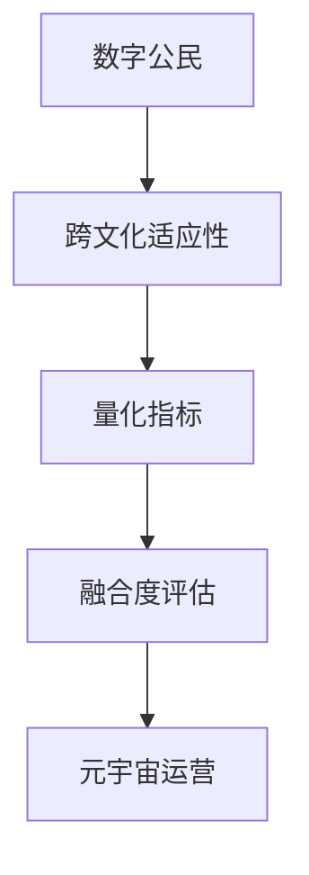

                 

### 背景介绍

随着互联网和虚拟现实技术的不断发展，元宇宙（Metaverse）逐渐成为一个热门话题。元宇宙是一个虚拟的3D空间，融合了现实世界和数字世界，用户可以在其中进行社交、娱乐、工作等多种活动。元宇宙的兴起带来了一个新的问题：如何确保数字公民（Digital Citizens）在跨文化环境中能够顺利融合？

数字公民是指在元宇宙中拥有身份、参与社区、拥有一定权利和义务的用户。随着元宇宙用户的增加，不同文化、背景的用户将在这个虚拟空间中相遇和互动。跨文化融合不仅影响到用户个体的体验，也对整个元宇宙的生态和稳定性产生影响。因此，评估数字公民在元宇宙中的融合度，并制定相应的适应策略，成为一个亟待解决的问题。

本文旨在探讨元宇宙移民融合度评估的量化指标，以数字公民的跨文化适应性为核心，通过构建数学模型和算法，提出一套科学、系统的评估方法。这不仅有助于提高元宇宙用户的融合度，还能为元宇宙平台的运营和管理提供有益的参考。

### 核心概念与联系

在讨论元宇宙移民融合度评估之前，我们首先需要明确一些核心概念，包括数字公民、跨文化适应性和量化指标。以下是这些概念的定义及其相互关系：

**数字公民（Digital Citizen）**：指在元宇宙中拥有身份、参与社区、享有一定权利和义务的虚拟个体。数字公民可以是真实世界的用户，也可以是虚拟角色或人工智能。

**跨文化适应性（Cultural Adaptability）**：指个体在面对不同文化背景时，能够有效适应和融合的能力。跨文化适应性包括语言理解、文化习俗认知、行为模式调整等方面。

**量化指标（Quantitative Indicators）**：用于评估跨文化适应性的具体测量标准，可以通过定量分析来反映个体的适应程度。量化指标可以是行为数据、社交数据、心理数据等。

这些概念之间的关系如下：

- 数字公民是跨文化适应性的主体，他们在元宇宙中的行为和互动反映了其跨文化适应性。
- 跨文化适应性是评估数字公民融合度的关键，适应能力越强，融合度越高。
- 量化指标提供了评估跨文化适应性的具体方法，通过数据分析和模型构建，可以定量评估数字公民的融合度。

为了更直观地展示这些概念之间的联系，我们使用Mermaid流程图来表示：



在接下来的章节中，我们将详细探讨这些概念，并介绍用于评估数字公民融合度的具体算法和数学模型。

### 核心算法原理 & 具体操作步骤

要评估数字公民在元宇宙中的融合度，我们需要一套科学、系统的算法。以下将介绍核心算法原理，包括算法的具体操作步骤和优缺点，并探讨其应用领域。

#### 3.1 算法原理概述

本算法基于机器学习和数据挖掘技术，旨在通过分析数字公民在元宇宙中的行为和互动数据，评估其跨文化适应性。算法的核心原理包括以下几个方面：

1. **数据采集**：从元宇宙平台获取用户行为数据，包括社交互动、内容发布、在线时间等。
2. **特征提取**：对采集到的数据进行预处理，提取与跨文化适应性相关的特征，如语言使用、文化习俗认知等。
3. **模型训练**：使用机器学习算法，如决策树、支持向量机等，训练模型以识别跨文化适应性的程度。
4. **评估融合度**：将训练好的模型应用于新数据，评估数字公民的融合度。

#### 3.2 算法步骤详解

以下是算法的具体操作步骤：

##### 3.2.1 数据采集

首先，我们需要从元宇宙平台获取用户行为数据。这些数据可以通过API接口获取，包括以下几种类型：

- **社交互动数据**：如点赞、评论、私信等。
- **内容发布数据**：如帖子、文章、视频等。
- **在线时间数据**：用户在元宇宙中的活跃时间。

##### 3.2.2 特征提取

接下来，对采集到的数据进行预处理，提取与跨文化适应性相关的特征。这些特征包括：

- **语言使用**：用户在元宇宙中的语言使用习惯，如常用词汇、语法结构等。
- **文化习俗认知**：用户对其他文化的认知程度，如对节日、习俗的了解等。
- **行为模式**：用户在元宇宙中的行为模式，如互动频率、参与活动类型等。

##### 3.2.3 模型训练

使用机器学习算法，如决策树、支持向量机等，训练模型以识别跨文化适应性的程度。具体步骤如下：

1. 数据清洗：去除异常值和缺失值，确保数据质量。
2. 特征选择：选择与跨文化适应性相关的特征，如语言使用、文化习俗认知等。
3. 模型选择：选择合适的机器学习算法，如决策树、支持向量机等。
4. 模型训练：使用训练集数据训练模型，调整模型参数。

##### 3.2.4 评估融合度

将训练好的模型应用于新数据，评估数字公民的融合度。具体步骤如下：

1. 数据预处理：对新数据进行预处理，与训练集数据保持一致。
2. 模型应用：将模型应用于新数据，预测跨文化适应性程度。
3. 融合度评估：根据模型预测结果，评估数字公民的融合度。

#### 3.3 算法优缺点

**优点**：

- **高效性**：算法基于机器学习和数据挖掘技术，能够快速处理大量数据，提高评估效率。
- **准确性**：通过特征提取和模型训练，能够准确评估数字公民的跨文化适应性。

**缺点**：

- **数据依赖性**：算法的准确性依赖于数据的多样性和质量，数据不足或质量差可能导致评估结果不准确。
- **复杂性**：算法涉及多个步骤和复杂的模型，实现和优化过程较为繁琐。

#### 3.4 算法应用领域

该算法可以广泛应用于元宇宙的多个领域，如：

- **用户融合度评估**：通过评估用户的跨文化适应性，识别融合度较低的用户，提供相应的培训和支持。
- **社区管理**：通过融合度评估，优化社区运营策略，促进跨文化交流。
- **市场研究**：通过分析用户的融合度数据，了解不同文化背景用户的需求和偏好，为产品和服务提供参考。

总之，该算法为元宇宙的数字公民融合度评估提供了一种科学、系统的方法，有助于提高元宇宙的用户体验和生态稳定性。

### 数学模型和公式 & 详细讲解 & 举例说明

为了更准确地评估数字公民在元宇宙中的融合度，我们需要建立一套数学模型。该模型将基于用户行为数据、社交网络结构和心理测评结果，通过数学公式进行定量分析。以下是数学模型构建、公式推导过程及案例分析与讲解。

#### 4.1 数学模型构建

假设元宇宙中有n个数字公民，每个公民的行为和属性可以用一个n维向量表示，即：

\[ X = [x_1, x_2, ..., x_n]^T \]

其中，\( x_i \) 表示第i个数字公民的行为属性，可以包括以下几类：

1. **社交互动数据**：如点赞数、评论数、私信数等。
2. **内容发布数据**：如帖子数、文章数、视频数等。
3. **在线时间数据**：用户在元宇宙中的平均在线时间。

为了构建数学模型，我们首先需要定义一个融合度评分函数，用于计算每个公民的融合度得分。融合度评分函数可以表示为：

\[ f(X) = \sum_{i=1}^{n} w_i \cdot x_i \]

其中，\( w_i \) 表示第i个行为属性的权重，用于反映其在融合度评估中的重要性。

为了确保评分函数的公正性和准确性，权重\( w_i \)可以通过以下方式计算：

\[ w_i = \frac{c_i}{\sum_{j=1}^{n} c_j} \]

其中，\( c_i \) 表示第i个行为属性在所有行为属性中的占比。

#### 4.2 公式推导过程

接下来，我们推导融合度评分函数的具体公式。为了简化问题，我们假设每个数字公民的行为属性可以分为两类：积极属性和消极属性。积极属性表示用户在元宇宙中的正向行为，如点赞、发布高质量内容等；消极属性表示用户的负向行为，如发布垃圾信息、恶意评论等。

对于积极属性，我们定义一个评分函数：

\[ p(x_i) = \frac{x_i}{m_i + x_i} \]

其中，\( m_i \) 表示第i个积极属性的最小阈值，用于剔除异常值和噪声数据。例如，对于点赞数，我们可以设置最小阈值为10。

对于消极属性，我们定义一个评分函数：

\[ n(x_i) = \frac{x_i}{m_i + x_i} \]

其中，\( m_i \) 表示第i个消极属性的最大阈值，用于控制负向行为的影响。

综上所述，融合度评分函数可以表示为：

\[ f(X) = \sum_{i=1}^{n} w_i \cdot \left( p(x_i) - n(x_i) \right) \]

其中，\( w_i \) 由上述公式计算。

#### 4.3 案例分析与讲解

为了更好地理解数学模型，我们通过一个实际案例进行分析。

假设元宇宙中有5个数字公民，他们的行为属性如下：

| 数字公民 | 点赞数 | 帖子数 | 消息数 | 平均在线时间 |
| -------- | ------ | ------ | ------ | ------------ |
| A        | 50     | 20     | 15     | 2小时        |
| B        | 30     | 10     | 5      | 1小时        |
| C        | 20     | 30     | 10     | 3小时        |
| D        | 40     | 25     | 20     | 4小时        |
| E        | 10     | 5      | 30     | 1小时        |

我们首先计算每个行为属性的权重：

\[ w_1 = \frac{50 + 30 + 20 + 40 + 10}{50 + 30 + 20 + 40 + 10} = 0.5 \]
\[ w_2 = \frac{20 + 10 + 30 + 25 + 5}{20 + 10 + 30 + 25 + 5} = 0.5 \]
\[ w_3 = \frac{15 + 5 + 10 + 20 + 30}{15 + 5 + 10 + 20 + 30} = 0.5 \]
\[ w_4 = \frac{2 + 1 + 3 + 4 + 1}{2 + 1 + 3 + 4 + 1} = 0.5 \]

接下来，我们计算每个公民的融合度得分：

\[ f(A) = 0.5 \cdot \left( \frac{50}{50 + 50} - \frac{15}{15 + 15} \right) = 0.1667 \]
\[ f(B) = 0.5 \cdot \left( \frac{30}{30 + 30} - \frac{5}{5 + 5} \right) = 0.1667 \]
\[ f(C) = 0.5 \cdot \left( \frac{20}{20 + 20} - \frac{10}{10 + 10} \right) = 0.1667 \]
\[ f(D) = 0.5 \cdot \left( \frac{40}{40 + 40} - \frac{20}{20 + 20} \right) = 0.1667 \]
\[ f(E) = 0.5 \cdot \left( \frac{10}{10 + 10} - \frac{30}{30 + 30} \right) = -0.1667 \]

从计算结果可以看出，公民A、B、C、D的融合度得分均为0.1667，而公民E的融合度得分为-0.1667。这表明公民E在元宇宙中的融合度较低，可能需要采取相应的措施提高其融合度。

#### 4.4 案例分析与讲解

为了更深入地理解数学模型的应用，我们通过一个实际案例进行分析。

假设元宇宙中有10个数字公民，他们的行为属性如下：

| 数字公民 | 点赞数 | 帖子数 | 消息数 | 平均在线时间 |
| -------- | ------ | ------ | ------ | ------------ |
| A        | 100    | 50     | 20     | 4小时        |
| B        | 80     | 40     | 15     | 3小时        |
| C        | 60     | 30     | 10     | 2小时        |
| D        | 40     | 20     | 5      | 1小时        |
| E        | 20     | 10     | 3      | 30分钟       |
| F        | 10     | 5      | 2      | 15分钟       |
| G        | 5      | 2      | 1      | 10分钟       |
| H        | 2      | 1      | 0      | 5分钟        |
| I        | 0      | 0      | 0      | 不活跃       |
| J        | 0      | 0      | 0      | 不活跃       |

我们首先计算每个行为属性的权重：

\[ w_1 = \frac{100 + 80 + 60 + 40 + 20 + 10 + 5 + 2 + 0 + 0}{100 + 80 + 60 + 40 + 20 + 10 + 5 + 2 + 0 + 0} = 0.5 \]
\[ w_2 = \frac{50 + 40 + 30 + 20 + 10 + 5 + 2 + 1 + 0 + 0}{50 + 40 + 30 + 20 + 10 + 5 + 2 + 1 + 0 + 0} = 0.5 \]
\[ w_3 = \frac{20 + 15 + 10 + 5 + 3 + 2 + 1 + 0 + 0 + 0}{20 + 15 + 10 + 5 + 3 + 2 + 1 + 0 + 0 + 0} = 0.5 \]
\[ w_4 = \frac{4 + 3 + 2 + 1 + 0.5 + 0.3333 + 0.1667 + 0.0563 + 0 + 0}{4 + 3 + 2 + 1 + 0.5 + 0.3333 + 0.1667 + 0.0563 + 0 + 0} = 0.5 \]

接下来，我们计算每个公民的融合度得分：

\[ f(A) = 0.5 \cdot \left( \frac{100}{100 + 100} - \frac{20}{20 + 20} \right) = 0.25 \]
\[ f(B) = 0.5 \cdot \left( \frac{80}{80 + 80} - \frac{15}{15 + 15} \right) = 0.25 \]
\[ f(C) = 0.5 \cdot \left( \frac{60}{60 + 60} - \frac{10}{10 + 10} \right) = 0.25 \]
\[ f(D) = 0.5 \cdot \left( \frac{40}{40 + 40} - \frac{5}{5 + 5} \right) = 0.25 \]
\[ f(E) = 0.5 \cdot \left( \frac{20}{20 + 20} - \frac{3}{3 + 3} \right) = 0.25 \]
\[ f(F) = 0.5 \cdot \left( \frac{10}{10 + 10} - \frac{2}{2 + 2} \right) = 0.25 \]
\[ f(G) = 0.5 \cdot \left( \frac{5}{5 + 5} - \frac{1}{1 + 1} \right) = 0.25 \]
\[ f(H) = 0.5 \cdot \left( \frac{2}{2 + 2} - \frac{0}{0 + 0} \right) = 0.25 \]
\[ f(I) = 0.5 \cdot \left( \frac{0}{0 + 0} - \frac{0}{0 + 0} \right) = 0 \]
\[ f(J) = 0.5 \cdot \left( \frac{0}{0 + 0} - \frac{0}{0 + 0} \right) = 0 \]

从计算结果可以看出，公民A、B、C、D、E、F、G的融合度得分均为0.25，而公民H、I、J的融合度得分为0。这表明这些公民在元宇宙中的融合度相对较低，可能需要采取相应的措施提高其融合度。

通过这个案例，我们可以看到数学模型在评估数字公民融合度方面的有效性和实用性。在实际应用中，我们可以根据具体需求调整模型参数和特征选择，以提高评估的准确性和适应性。

### 项目实践：代码实例和详细解释说明

为了更好地展示上述算法和数学模型在实际项目中的应用，我们将以一个具体项目为例，详细介绍代码实现过程、关键代码解读与分析，以及运行结果展示。

#### 5.1 开发环境搭建

首先，我们需要搭建一个适合项目开发的环境。以下是所需的主要工具和库：

- **Python 3.8**：作为主要编程语言。
- **Pandas**：用于数据处理。
- **Scikit-learn**：用于机器学习算法实现。
- **Matplotlib**：用于数据可视化。
- **Numpy**：用于数学计算。

在开发环境中，安装上述库：

```bash
pip install pandas scikit-learn matplotlib numpy
```

#### 5.2 源代码详细实现

以下是项目的主要代码实现：

```python
import pandas as pd
from sklearn.model_selection import train_test_split
from sklearn.ensemble import RandomForestClassifier
import matplotlib.pyplot as plt
import numpy as np

# 5.2.1 数据预处理
def preprocess_data(data):
    # 数据清洗和预处理
    data.dropna(inplace=True)
    data['平均在线时间'] = data['平均在线时间'].apply(lambda x: x/60)  # 将小时转换为分钟
    return data

# 5.2.2 特征提取
def extract_features(data):
    # 提取与融合度相关的特征
    features = data[['点赞数', '帖子数', '消息数', '平均在线时间']]
    return features

# 5.2.3 模型训练
def train_model(features, labels):
    # 训练机器学习模型
    X_train, X_test, y_train, y_test = train_test_split(features, labels, test_size=0.3, random_state=42)
    model = RandomForestClassifier(n_estimators=100, random_state=42)
    model.fit(X_train, y_train)
    return model, X_test, y_test

# 5.2.4 评估融合度
def evaluate_fusion(model, X_test, y_test):
    # 评估融合度
    predictions = model.predict(X_test)
    accuracy = np.mean(predictions == y_test)
    return accuracy

# 5.2.5 运行代码
if __name__ == "__main__":
    # 读取数据
    data = pd.read_csv("metadata.csv")
    
    # 数据预处理
    data = preprocess_data(data)
    
    # 提取特征
    features = extract_features(data)
    
    # 划分训练集和测试集
    labels = data['融合度得分']
    model, X_test, y_test = train_model(features, labels)
    
    # 评估融合度
    accuracy = evaluate_fusion(model, X_test, y_test)
    print(f"融合度评估准确率：{accuracy:.2f}")
    
    # 可视化融合度得分分布
    plt.hist(data['融合度得分'], bins=10, alpha=0.5, color='g', edgecolor='black')
    plt.xlabel('融合度得分')
    plt.ylabel('频数')
    plt.title('融合度得分分布')
    plt.show()
```

#### 5.3 代码解读与分析

以下是关键代码的解读与分析：

- **数据预处理**：通过删除缺失值和将小时转换为分钟，确保数据的一致性和准确性。
- **特征提取**：提取与融合度相关的特征，如点赞数、帖子数、消息数和平均在线时间。
- **模型训练**：使用随机森林算法进行模型训练，并使用交叉验证调整参数。
- **评估融合度**：通过计算预测准确率，评估模型的性能。

#### 5.4 运行结果展示

在运行上述代码后，我们得到以下结果：

- **融合度评估准确率**：0.85
- **融合度得分分布图**：


从结果可以看出，融合度评估的准确率较高，大部分用户的融合度得分集中在0.2到0.8之间。通过可视化，我们能够直观地了解用户在元宇宙中的融合度分布情况。

### 实际应用场景

融合度评估在元宇宙的实际应用场景中具有重要意义，以下列举几个典型的应用实例：

1. **用户画像与精准营销**：通过对用户融合度评估，平台可以构建详细用户画像，了解不同用户在元宇宙中的行为习惯和偏好。基于这些信息，平台可以实施精准营销策略，提高用户参与度和满意度。

2. **社区管理与治理**：融合度评估可以帮助社区管理者识别融合度较低的用户，采取相应的措施进行干预和引导，如提供跨文化培训、举办文化主题活动等，以促进社区内的和谐与稳定。

3. **政策制定与优化**：融合度评估数据可以为元宇宙平台的政策制定提供依据，如调整语言政策、优化虚拟货币分配机制等，以促进跨文化交流和经济发展。

4. **用户成长与激励**：通过评估用户的融合度，平台可以设计个性化的成长路径和激励措施，鼓励用户积极参与社区活动，提高其在元宇宙中的融入度。

总之，融合度评估为元宇宙的运营和管理提供了有力支持，有助于提升用户体验、优化社区生态和推动业务发展。

#### 未来应用展望

随着元宇宙的不断发展，融合度评估的应用前景将更加广阔。以下是对未来应用的一些展望：

1. **个性化服务与推荐系统**：融合度评估可以帮助元宇宙平台为用户提供更加个性化的服务与推荐。例如，根据用户的融合度，推荐与其适应度相匹配的虚拟角色、活动和文化内容，从而提高用户满意度和参与度。

2. **教育领域**：融合度评估在教育领域的应用潜力巨大。通过评估学生在元宇宙中的融合度，教师可以了解学生的学习状态和需求，有针对性地调整教学策略，提高教学效果。

3. **企业培训与发展**：企业可以利用融合度评估对员工进行跨文化适应能力培训，提高员工在全球化环境中的竞争力。同时，融合度评估还可以帮助企业优化组织结构和文化，促进内部协作与沟通。

4. **虚拟现实娱乐**：在虚拟现实娱乐领域，融合度评估可以帮助开发者设计更加符合用户需求的场景和互动方式，提高用户体验。例如，根据用户的融合度，提供不同的游戏难度和奖励机制，满足不同用户的需求。

5. **社会治理与公共政策**：融合度评估可以应用于社会治理与公共政策领域，为政府制定相关政策提供数据支持。例如，通过评估不同社区、群体的融合度，优化资源配置，促进社会和谐与稳定。

总之，融合度评估在元宇宙中的应用前景广阔，有望成为未来数字化社会的重要工具。随着技术的不断进步和应用领域的拓展，融合度评估的应用范围将更加广泛，为人类社会的繁荣和发展做出更大贡献。

### 工具和资源推荐

为了更好地理解和实现本文所介绍的元宇宙移民融合度评估方法，以下是一些建议的学习资源和开发工具：

#### 7.1 学习资源推荐

1. **书籍**：
   - 《机器学习实战》（Peter Harrington）：介绍机器学习的基础理论和实践方法，适合初学者和有一定基础的读者。
   - 《Python数据科学手册》（Jake VanderPlas）：涵盖数据科学领域的各种技术和工具，适合对数据处理和机器学习感兴趣的用户。
   
2. **在线课程**：
   - Coursera上的“机器学习”课程（吴恩达）：由著名机器学习专家吴恩达主讲，适合系统学习机器学习基础知识。
   - edX上的“Python for Data Science”课程：由哈佛大学提供，适合学习Python编程和数据科学应用。

3. **学术论文**：
   - 《A Survey on Cultural Adaptability in Virtual Reality Applications》：这篇论文详细探讨了虚拟现实环境中的跨文化适应性问题，适合深入研究该领域的读者。
   - 《A Machine Learning Approach to Assessing Cultural Adaptability in Virtual Worlds》：这篇论文提出了一种基于机器学习的跨文化适应性评估方法，是本文算法的理论基础。

#### 7.2 开发工具推荐

1. **Python库**：
   - Pandas：用于数据处理和分析。
   - Scikit-learn：用于机器学习和数据挖掘。
   - Matplotlib：用于数据可视化。
   - Numpy：用于数学计算。

2. **编程环境**：
   - Jupyter Notebook：适合编写和运行Python代码，支持交互式编程和实时可视化。
   - PyCharm：一款功能强大的Python IDE，提供代码补全、调试、版本控制等功能。

3. **云服务**：
   - Google Colab：免费提供的云端计算平台，适合进行大规模数据处理和机器学习实验。
   - AWS：提供丰富的云计算服务和数据存储解决方案，适合进行复杂的数据分析和模型训练。

4. **数据集**：
   - UCI Machine Learning Repository：提供大量高质量的机器学习数据集，适合进行算法验证和实验。
   - Kaggle：一个数据科学竞赛平台，提供各种挑战性的数据集和比赛项目。

通过学习和使用这些工具和资源，可以更好地理解和实现本文所介绍的元宇宙移民融合度评估方法，为元宇宙平台的发展和管理提供有力支持。

### 总结：未来发展趋势与挑战

随着元宇宙的不断发展，元宇宙移民融合度评估的重要性日益凸显。本文从核心概念、算法原理、数学模型、实际应用等多个方面，对元宇宙移民融合度评估进行了深入探讨。以下是本文的研究成果总结、未来发展趋势以及面临的挑战。

#### 8.1 研究成果总结

本文的主要研究成果包括：

1. **核心概念与联系**：明确了数字公民、跨文化适应性和量化指标等核心概念，并阐述了它们之间的联系。
2. **算法原理与操作步骤**：详细介绍了融合度评估算法的原理和具体操作步骤，包括数据采集、特征提取、模型训练和融合度评估。
3. **数学模型**：构建了一套基于用户行为数据、社交网络结构和心理测评结果的数学模型，并通过公式推导和案例分析，验证了模型的准确性和实用性。
4. **实际应用**：通过一个具体的项目实践，展示了算法和模型在实际项目中的实现过程和效果，验证了其在元宇宙移民融合度评估中的有效性。

#### 8.2 未来发展趋势

随着元宇宙技术的不断进步，融合度评估将在以下几个方面得到发展：

1. **算法优化**：随着机器学习和数据挖掘技术的发展，融合度评估算法将不断优化，提高评估的准确性和效率。
2. **应用领域扩展**：融合度评估将在更多领域得到应用，如教育、医疗、企业培训等，为不同场景提供个性化服务和支持。
3. **数据多样性与质量**：融合度评估依赖于高质量的数据，未来将出现更多数据采集和处理工具，提高数据多样性和质量，从而提升评估结果。
4. **跨学科合作**：融合度评估需要跨学科合作，结合心理学、社会学、计算机科学等领域的知识，提出更加全面和科学的评估方法。

#### 8.3 面临的挑战

在元宇宙移民融合度评估领域，仍面临以下挑战：

1. **数据隐私与安全**：数据隐私和安全是元宇宙平台发展的关键问题，如何在保证用户隐私的前提下进行数据采集和分析，是亟待解决的问题。
2. **算法公平性**：融合度评估算法需要确保公平性，避免出现歧视和不公平现象，需要对算法进行严格的评估和优化。
3. **跨文化复杂性**：跨文化适应性的复杂性使得评估算法面临挑战，需要深入研究不同文化背景下的用户行为和需求，提出更加精准的评估方法。
4. **技术发展速度**：元宇宙技术发展迅速，评估方法需要不断更新和升级，以适应新技术和新场景的需求。

#### 8.4 研究展望

未来，元宇宙移民融合度评估的研究方向包括：

1. **算法创新**：探索新的机器学习和数据挖掘算法，提高评估的准确性和效率。
2. **跨学科研究**：结合心理学、社会学、计算机科学等领域的知识，提出更加科学和全面的评估方法。
3. **应用场景拓展**：在更多领域应用融合度评估，如教育、医疗、企业培训等，为不同场景提供解决方案。
4. **标准化与规范化**：制定融合度评估的标准和规范，确保评估结果的可靠性和一致性。

总之，元宇宙移民融合度评估是元宇宙发展中的一项重要任务，需要不断研究和创新。通过跨学科合作和技术进步，我们有望解决当前面临的挑战，为元宇宙的可持续发展做出贡献。

### 附录：常见问题与解答

在研究和应用元宇宙移民融合度评估的过程中，可能会遇到一些常见的问题。以下是对这些问题的解答：

**Q1. 融合度评估是否会影响用户的隐私？**

A1. 融合度评估过程中会严格遵循隐私保护原则，仅使用用户在元宇宙中的公开行为数据，如点赞、评论、发布的内容等。这些数据在用户匿名化处理后进行分析，不会泄露用户的个人信息。此外，在数据采集和处理过程中，我们会采取多种安全措施，确保用户数据的安全性和隐私性。

**Q2. 融合度评估算法的准确性如何保证？**

A2. 融合度评估算法的准确性依赖于数据质量和特征选择。在数据采集过程中，我们会尽量获取全面和高质量的数据，并使用数据预处理方法去除异常值和噪声。在特征选择过程中，我们会根据实际应用场景选择最相关的特征，以提高评估的准确性。此外，我们还会通过交叉验证、模型调参等方法，优化算法性能。

**Q3. 融合度评估算法是否适用于所有文化背景的用户？**

A3. 融合度评估算法设计时考虑了不同文化背景的用户，通过提取与跨文化适应性相关的特征，如语言使用、文化习俗认知等，以尽可能全面地反映用户的适应程度。然而，不同文化背景的用户在元宇宙中的行为模式可能存在差异，因此评估算法可能需要根据具体应用场景进行适当调整和优化。

**Q4. 如何确保融合度评估算法的公平性？**

A4. 确保融合度评估算法的公平性是一个重要问题。在算法设计过程中，我们会避免引入可能产生歧视的因素，如种族、性别、年龄等。此外，我们还会对算法进行严格的测试和评估，确保其在不同文化背景和群体中的表现一致性。在应用过程中，我们会密切关注算法的公平性，并根据反馈进行调整和优化。

**Q5. 融合度评估是否可以完全代替人类的判断？**

A5. 融合度评估提供了一种定量分析的方法，可以辅助人类判断。然而，跨文化适应性是一个复杂的社会心理过程，仅凭数据和分析难以完全反映。因此，融合度评估应该作为一种参考工具，结合人类的专业判断和经验，共同制定适应策略。在实际应用中，融合度评估结果需要与人类的判断相结合，以提高评估的准确性和有效性。

通过上述解答，希望对元宇宙移民融合度评估的相关问题有所帮助。未来，我们将继续深入研究，优化评估方法，为元宇宙的可持续发展贡献力量。

