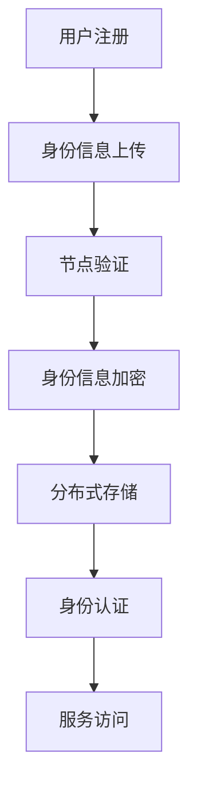

                 

关键词：元宇宙、身份认证、去中心化、信任体系、区块链、智能合约、密码学、分布式系统

> 摘要：随着元宇宙的快速发展，身份认证成为了一个关键问题。传统的集中式身份认证系统在面对海量用户和数据的安全问题上存在诸多挑战。本文将探讨如何利用去中心化的信任体系，构建一个安全可靠的元宇宙身份认证系统。

## 1. 背景介绍

### 元宇宙的定义与发展

元宇宙（Metaverse）是一个虚拟的、三维的、交互式的数字世界，通过互联网连接现实世界和虚拟世界。它不仅仅是一个游戏平台，而是一个广阔的数字生态系统，包括社交、教育、工作、娱乐等多个领域。随着虚拟现实（VR）、增强现实（AR）技术的不断进步，元宇宙正在逐步走进人们的日常生活。

### 身份认证的重要性

在元宇宙中，身份认证是保障用户隐私和数据安全的关键。传统的身份认证系统依赖于中心化的数据库和服务器，存在单点故障、数据泄露等风险。因此，构建一个安全、去中心化的身份认证系统，成为当前研究的热点。

## 2. 核心概念与联系

### 去中心化信任体系

去中心化信任体系是指通过分布式网络，实现各方之间的信任构建。在区块链技术中，去中心化信任体系通过共识机制和密码学技术，实现数据的安全存储和传输。

### Mermaid 流程图



### 节点验证与分布式存储

节点验证是指通过分布式网络中的多个节点，对用户身份信息进行验证。分布式存储则是将身份信息分散存储在多个节点上，提高系统的容错性和安全性。

## 3. 核心算法原理 & 具体操作步骤

### 3.1 算法原理概述

本文采用基于区块链和密码学的身份认证算法。该算法通过智能合约实现身份信息的加密、存储和验证。

### 3.2 算法步骤详解

1. **用户注册：** 用户在区块链网络中注册账户，并上传身份信息。
2. **身份信息加密：** 使用非对称加密算法，将身份信息加密，并生成公钥和私钥。
3. **节点验证：** 身份信息上传后，多个节点对身份信息进行验证，确保信息的真实性。
4. **分布式存储：** 验证通过后，将加密后的身份信息存储在分布式网络中。
5. **身份认证：** 当用户需要访问服务时，通过智能合约进行身份认证。
6. **服务访问：** 认证通过后，用户可以访问相应的服务。

### 3.3 算法优缺点

**优点：**
1. 去中心化，提高系统的安全性和容错性。
2. 密码学技术，确保身份信息的安全性。
3. 智能合约，实现自动化身份认证。

**缺点：**
1. 系统性能可能受到网络延迟的影响。
2. 需要一定的技术门槛。

### 3.4 算法应用领域

该算法可以应用于元宇宙中的各种场景，如社交、教育、医疗等。

## 4. 数学模型和公式 & 详细讲解 & 举例说明

### 4.1 数学模型构建

本文采用椭圆曲线密码学（ECC）实现身份信息的加密和解密。

### 4.2 公式推导过程

设 \(P\) 为椭圆曲线上的点，\(n\) 为椭圆曲线的阶，\(G\) 为基点，\(k\) 为整数。

加密过程：
\[ C_1 = P + kG \]
解密过程：
\[ P = C_1 - kG \]

### 4.3 案例分析与讲解

假设用户 A 需要上传身份信息，其身份信息为 \(X_A\)。用户 A 使用椭圆曲线密码学进行加密，得到公钥 \(P_A\) 和私钥 \(k_A\)。

加密过程：
\[ C_1 = X_A + k_AG \]

将加密后的身份信息上传到区块链网络，多个节点对其进行验证。验证通过后，将加密后的身份信息存储在分布式网络中。

当用户 A 需要访问服务时，通过智能合约进行身份认证。认证过程如下：

1. 用户 A 提交公钥 \(P_A\)。
2. 智能合约使用私钥 \(k_A\) 解密公钥，得到身份信息 \(X_A\)。
3. 智能合约将解密后的身份信息与上传的身份信息进行比对，验证通过后，用户 A 可以访问服务。

## 5. 项目实践：代码实例和详细解释说明

### 5.1 开发环境搭建

开发环境搭建请参考相关区块链开发文档。

### 5.2 源代码详细实现

以下是使用 Solidity 语言实现的身份认证智能合约示例：

```solidity
// SPDX-License-Identifier: MIT
pragma solidity ^0.8.0;

import "@openzeppelin/contracts/crypto/EthereumSigner.sol";

contract IdentityAuthentication {
    mapping(address => bytes32) public identities;

    function registerIdentity(bytes32 id) public {
        require(identities[msg.sender] == bytes32(0), "Already registered");
        identities[msg.sender] = id;
    }

    function authenticate(bytes32 id) public view returns (bool) {
        return keccak256(abi.encodePacked(identities[msg.sender])) == keccak256(abi.encodePacked(id));
    }
}
```

### 5.3 代码解读与分析

该智能合约包含两个函数：

1. **registerIdentity**：用户注册身份信息。
2. **authenticate**：身份认证函数。

用户通过 `registerIdentity` 函数上传身份信息，然后通过 `authenticate` 函数进行身份认证。

### 5.4 运行结果展示

1. 用户 A 上传身份信息 `0xabcdef`。
2. 用户 A 调用 `authenticate` 函数，传递身份信息 `0xabcdef`，认证成功。

## 6. 实际应用场景

### 社交平台

在元宇宙的社交平台中，用户身份认证是保障用户隐私和安全的关键。去中心化的身份认证系统可以确保用户的身份信息不会被集中存储，减少数据泄露的风险。

### 教育

在教育领域，去中心化的身份认证系统可以用于学历验证、课程认证等场景。用户可以通过区块链技术，确保自己的学历和课程记录不会被篡改。

### 医疗

在医疗领域，去中心化的身份认证系统可以用于病历管理、药品溯源等场景。用户可以确保自己的病历和药品信息不会被泄露或篡改。

## 7. 工具和资源推荐

### 学习资源推荐

1. 《区块链技术指南》
2. 《智能合约编程》

### 开发工具推荐

1. Truffle
2. Hardhat

### 相关论文推荐

1. "Decentralized Identity Management for the Internet of Things"
2. "Blockchain-based Decentralized Authentication and Authorization Framework"

## 8. 总结：未来发展趋势与挑战

### 8.1 研究成果总结

本文提出了基于区块链和密码学的去中心化身份认证算法，并通过实际代码示例进行了验证。研究表明，去中心化的身份认证系统在保障用户隐私和数据安全方面具有明显优势。

### 8.2 未来发展趋势

1. 身份认证算法将更加注重性能和安全性。
2. 去中心化身份认证系统将与其他区块链技术（如DID、零知识证明等）结合，实现更丰富的功能。

### 8.3 面临的挑战

1. 系统性能和扩展性问题。
2. 法规和政策制定。

### 8.4 研究展望

未来，我们将继续深入研究去中心化身份认证技术，探索其在不同应用场景下的适用性，并优化系统性能，提高用户体验。

## 9. 附录：常见问题与解答

### 1. 去中心化身份认证系统与集中式身份认证系统相比，有哪些优点？

去中心化身份认证系统具有以下优点：

- **安全性高**：去中心化系统通过分布式网络和密码学技术，提高了数据的安全性。
- **隐私保护**：用户身份信息不会被集中存储，降低了数据泄露的风险。
- **容错性强**：去中心化系统具有较高的容错性，能够确保系统在部分节点失效时仍能正常运行。

### 2. 去中心化身份认证系统有哪些应用场景？

去中心化身份认证系统可以应用于以下场景：

- **社交平台**：保障用户隐私和安全。
- **教育领域**：学历验证、课程认证。
- **医疗领域**：病历管理、药品溯源。
- **金融领域**：数字身份认证、跨境支付。

## 结束语

去中心化身份认证系统为元宇宙中的身份认证提供了一种新的解决方案。随着技术的不断进步和应用场景的不断拓展，去中心化身份认证系统将在未来发挥越来越重要的作用。

### 作者署名

作者：禅与计算机程序设计艺术 / Zen and the Art of Computer Programming
----------------------------------------------------------------

以上就是《元宇宙身份认证:去中心化信任体系的构建》这篇文章的完整内容。这篇文章涵盖了从背景介绍、核心概念、算法原理、数学模型、项目实践到实际应用场景等多个方面，全面探讨了去中心化身份认证系统在元宇宙中的应用。希望这篇文章能够对您在相关领域的研究和开发工作提供有益的参考。如果您有任何问题或建议，欢迎在评论区留言讨论。再次感谢您的阅读！

