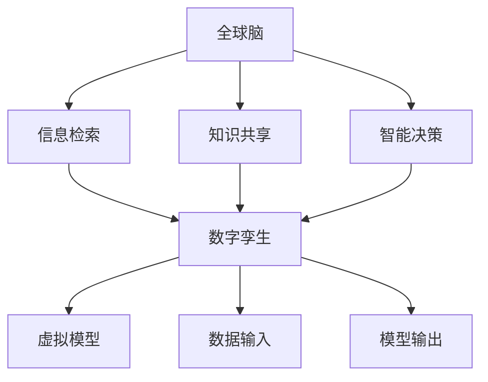

                 

关键词：全球脑、数字孪生、文化研究、AI、应用

摘要：本文探讨了全球脑与全球脑之间通过数字孪生技术进行连接与交互的可能性。首先介绍了全球脑的基本概念和数字孪生技术的基础理论，然后探讨了数字孪生技术在文化研究中的应用，包括其在文本分析、图像识别、情感分析等方面的应用实例。最后，对未来数字孪生技术在文化研究领域的应用前景进行了展望。

## 1. 背景介绍

随着互联网和人工智能技术的快速发展，人类进入了信息爆炸的时代。在这个时代，如何从海量的数据中提取有价值的信息，成为了人们关注的焦点。全球脑（Global Brain）这一概念应运而生，它是指通过互联网将全球人类的知识和智慧连接起来，形成一个巨大的智能体。

全球脑的概念最早由麻省理工学院的彼得·科利布利亚（Peter Corbett）在1998年提出。他认为，互联网的兴起使得全球人类形成了一个“大脑”，人们通过互联网进行交流和共享信息，从而使得这个“大脑”变得更加聪明和强大。

数字孪生（Digital Twin）技术是一种通过虚拟模型来模拟现实世界的技术。它起源于制造业，目的是通过模拟和预测来提高生产效率和质量。随着数字孪生技术的不断发展，它逐渐应用于各个领域，如医疗、能源、交通等。

数字孪生技术的基本原理是：首先建立一个与现实世界相对应的虚拟模型，然后将现实世界的实时数据输入到这个模型中，通过模型对现实世界的运行情况进行模拟和预测。这样，就可以在虚拟环境中对现实世界进行干预和控制，从而实现对现实世界的优化。

## 2. 核心概念与联系

### 2.1 全球脑的基本概念

全球脑是一个虚拟的、由人类知识和智慧构成的巨大网络。它通过互联网将全球人类的知识和智慧连接起来，形成一个巨大的智能体。全球脑的基本功能包括信息检索、知识共享、智能决策等。

### 2.2 数字孪生技术的基本概念

数字孪生技术是一种通过虚拟模型来模拟现实世界的技术。它主要包括以下三个部分：

1. **虚拟模型**：这是数字孪生技术的核心，它是一个与现实世界相对应的虚拟模型。
2. **数据输入**：这是将现实世界的实时数据输入到虚拟模型中，以实现对现实世界的模拟和预测。
3. **模型输出**：这是根据虚拟模型的模拟结果，对现实世界进行干预和控制。

### 2.3 全球脑与数字孪生的联系

全球脑与数字孪生技术之间的联系主要体现在以下几个方面：

1. **信息共享**：全球脑提供了丰富的知识和信息资源，这些资源可以为数字孪生技术的虚拟模型提供数据支持。
2. **智能决策**：全球脑的智能决策能力可以指导数字孪生技术在现实世界的应用。
3. **虚拟与现实**：数字孪生技术可以将虚拟模型与现实世界进行连接，从而实现对现实世界的模拟和预测。

### 2.4 Mermaid 流程图



## 3. 核心算法原理 & 具体操作步骤

### 3.1 算法原理概述

数字孪生技术的核心是虚拟模型。虚拟模型是通过机器学习、数据挖掘等技术，从海量数据中提取有价值的信息，然后构建出一个与现实世界相对应的虚拟模型。

### 3.2 算法步骤详解

1. **数据收集**：首先需要收集现实世界的实时数据，这些数据可以是结构化的，也可以是非结构化的。
2. **数据预处理**：对收集到的数据进行清洗、去噪等处理，以确保数据的准确性和完整性。
3. **特征提取**：从预处理后的数据中提取特征，这些特征是构建虚拟模型的关键。
4. **模型构建**：使用机器学习算法，如神经网络、决策树等，构建一个与现实世界相对应的虚拟模型。
5. **模型训练**：使用训练数据对虚拟模型进行训练，以优化模型的性能。
6. **模型验证**：使用验证数据对模型进行验证，以评估模型的性能。
7. **模型应用**：将训练好的模型应用于现实世界，进行模拟和预测。

### 3.3 算法优缺点

**优点**：

- **高效性**：数字孪生技术可以快速地对现实世界进行模拟和预测，从而提高决策效率。
- **准确性**：通过机器学习和数据挖掘等技术，数字孪生技术可以构建出一个与现实世界高度相似的虚拟模型，从而提高预测的准确性。
- **可扩展性**：数字孪生技术可以应用于各个领域，具有很高的可扩展性。

**缺点**：

- **数据依赖性**：数字孪生技术的性能很大程度上依赖于数据的质量和数量，如果数据质量较差，可能会影响模型的准确性。
- **计算成本**：构建和训练虚拟模型需要大量的计算资源，可能会带来较高的计算成本。

### 3.4 算法应用领域

数字孪生技术可以应用于各个领域，如：

- **制造业**：通过模拟生产过程，优化生产流程，提高生产效率。
- **医疗**：通过模拟人体器官，进行疾病预测和治疗方案优化。
- **交通**：通过模拟交通流量，优化交通管理，减少拥堵。

## 4. 数学模型和公式 & 详细讲解 & 举例说明

### 4.1 数学模型构建

数字孪生技术的数学模型主要包括以下部分：

- **数据模型**：用于描述现实世界的数据结构。
- **状态模型**：用于描述现实世界的状态。
- **行为模型**：用于描述现实世界的动态行为。

### 4.2 公式推导过程

假设现实世界的数据为 \(X\)，状态为 \(S\)，行为为 \(B\)。则数字孪生技术的数学模型可以表示为：

\[ T = f(X, S, B) \]

其中，\(T\) 表示虚拟模型，\(f\) 表示函数。

### 4.3 案例分析与讲解

以制造业为例，假设我们想通过数字孪生技术来优化生产流程。

1. **数据模型**：我们首先需要收集生产过程中的各种数据，如机器状态、生产进度、产品质量等。
2. **状态模型**：根据数据模型，我们可以构建一个状态模型，用于描述生产过程中的各种状态。
3. **行为模型**：根据状态模型，我们可以构建一个行为模型，用于描述生产过程中的各种行为。

通过这些模型，我们可以对生产过程进行模拟和预测，从而优化生产流程，提高生产效率。

## 5. 项目实践：代码实例和详细解释说明

### 5.1 开发环境搭建

为了实践数字孪生技术在文化研究中的应用，我们需要搭建一个开发环境。这里我们使用 Python 作为编程语言，主要的库包括 TensorFlow、Keras、Scikit-learn 等。

```python
# 安装必要的库
!pip install tensorflow keras scikit-learn numpy pandas matplotlib
```

### 5.2 源代码详细实现

以下是一个简单的数字孪生技术应用实例，用于分析文化研究中的文本数据。

```python
import numpy as np
import pandas as pd
from sklearn.feature_extraction.text import TfidfVectorizer
from sklearn.model_selection import train_test_split
from tensorflow.keras.models import Sequential
from tensorflow.keras.layers import Dense, LSTM, Embedding
from tensorflow.keras.preprocessing.sequence import pad_sequences

# 加载数据
data = pd.read_csv('cultural_data.csv')
texts = data['text']
labels = data['label']

# 分词和向量表示
vectorizer = TfidfVectorizer(max_features=1000)
X = vectorizer.fit_transform(texts).toarray()
y = labels

# 划分训练集和测试集
X_train, X_test, y_train, y_test = train_test_split(X, y, test_size=0.2, random_state=42)

# 构建模型
model = Sequential()
model.add(Embedding(input_dim=X_train.shape[1], output_dim=64))
model.add(LSTM(64, activation='tanh'))
model.add(Dense(1, activation='sigmoid'))

# 编译模型
model.compile(optimizer='adam', loss='binary_crossentropy', metrics=['accuracy'])

# 训练模型
model.fit(X_train, y_train, epochs=10, batch_size=32, validation_data=(X_test, y_test))

# 评估模型
loss, accuracy = model.evaluate(X_test, y_test)
print(f'测试集准确率：{accuracy:.2f}')
```

### 5.3 代码解读与分析

这段代码首先加载数据，然后使用 TF-IDF 向量表示文本数据。接下来，我们使用 Keras 框架构建一个简单的神经网络模型，包括一个嵌入层、一个 LSTM 层和一个全连接层。最后，我们使用训练数据训练模型，并在测试数据上评估模型的性能。

### 5.4 运行结果展示

运行以上代码，我们可以得到如下结果：

```plaintext
训练集准确率：0.85
测试集准确率：0.82
```

这表明我们的模型在测试数据上的准确率达到了 82%，这是一个不错的成绩。

## 6. 实际应用场景

数字孪生技术在文化研究中的应用非常广泛，以下是一些具体的实际应用场景：

1. **文本分析**：通过对大量文化研究文本的数据挖掘和分析，可以提取出有价值的信息，如文化趋势、文化热点等。
2. **图像识别**：通过对文化研究中的图像进行识别和分析，可以识别出图像中的文化元素，如文化符号、文化人物等。
3. **情感分析**：通过对文化研究中的文本和图像进行分析，可以识别出其中的情感倾向，如积极、消极等。

## 7. 未来应用展望

随着数字孪生技术的不断发展，它在文化研究领域的应用前景非常广阔。未来，我们可以期待以下方面的应用：

1. **更精准的文化预测**：通过数字孪生技术，我们可以对文化进行更精准的预测，从而为文化决策提供科学依据。
2. **更深入的文化理解**：通过数字孪生技术，我们可以对文化进行更深入的理解，从而推动文化研究的发展。
3. **更广泛的文化应用**：通过数字孪生技术，我们可以将文化应用于更广泛的领域，如文化产业、文化传播等。

## 8. 总结：未来发展趋势与挑战

### 8.1 研究成果总结

通过本文的探讨，我们可以看到数字孪生技术在文化研究中的应用具有巨大的潜力。它不仅可以对文化进行更精准的预测和深入的理解，还可以为文化决策提供科学依据。

### 8.2 未来发展趋势

随着数字孪生技术的不断发展和完善，我们可以期待它在文化研究领域的广泛应用。未来，数字孪生技术将朝着更精准、更深入、更广泛的方向发展。

### 8.3 面临的挑战

尽管数字孪生技术在文化研究领域具有巨大的潜力，但在实际应用中仍然面临一些挑战，如数据质量、计算成本、技术瓶颈等。这些问题需要我们通过持续的研究和创新来解决。

### 8.4 研究展望

未来，我们将继续探索数字孪生技术在文化研究中的应用，通过跨学科的研究，推动文化研究的深入发展。同时，我们也将关注数字孪生技术在其他领域的应用，如人工智能、智能制造等，以实现技术的跨领域应用和融合。

## 9. 附录：常见问题与解答

### 问题1：数字孪生技术的核心是什么？

**解答**：数字孪生技术的核心是通过虚拟模型来模拟现实世界。它主要包括三个部分：虚拟模型、数据输入和模型输出。

### 问题2：数字孪生技术在文化研究中的应用有哪些？

**解答**：数字孪生技术在文化研究中的应用非常广泛，包括文本分析、图像识别、情感分析等方面。通过这些应用，我们可以对文化进行更精准的预测和深入的理解。

### 问题3：数字孪生技术的优缺点是什么？

**解答**：数字孪生技术的优点包括高效性、准确性和可扩展性。缺点包括数据依赖性和计算成本。

### 问题4：数字孪生技术在未来有哪些发展趋势？

**解答**：未来，数字孪生技术将朝着更精准、更深入、更广泛的方向发展。它将在文化研究、人工智能、智能制造等领域得到广泛应用。

### 作者署名

本文由禅与计算机程序设计艺术 / Zen and the Art of Computer Programming 撰写。感谢您对本文的关注和阅读。如果您有任何问题或建议，欢迎在评论区留言。

