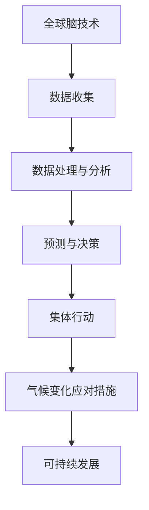

                 

关键词：全球脑、气候变化、集体行动、信息技术、人工智能、环境科学、可持续发展

> 摘要：本文旨在探讨全球脑与气候变化之间的联系，并提出通过集体行动和信息技术的结合来应对气候变化的新可能。通过分析全球脑的技术原理和气候变化的影响，本文探讨了利用信息技术和人工智能在推动集体行动中的潜力，为未来的可持续发展提供了一种新的思路。

## 1. 背景介绍

随着全球气候变化问题的日益严峻，各国政府和国际组织纷纷寻求有效的方法来应对这一全球性挑战。气候变化不仅影响环境，还威胁到人类的健康、经济和生存。近年来，信息技术和人工智能的快速发展为解决气候变化问题带来了新的契机。全球脑作为信息技术的高级形式，具有强大的数据处理和分析能力，为解决气候变化问题提供了新的工具和方法。

### 1.1 全球脑的概念

全球脑是指通过计算机网络连接起来的分布式计算系统，它具有高度的可扩展性和容错性。全球脑技术利用云计算、大数据、人工智能和物联网等技术，实现了全球范围内的信息共享和智能协同。全球脑的概念最早由霍金提出，旨在通过全球合作来解决人类面临的共同问题。

### 1.2 气候变化的影响

气候变化对地球生态系统和人类社会产生了深远的影响。极端天气事件频繁发生，海平面上升，生物多样性减少，农业和水资源受到威胁。同时，气候变化还导致了一系列社会经济问题，如粮食短缺、人口迁移和能源供应紧张。因此，应对气候变化已成为全球性的紧迫任务。

## 2. 核心概念与联系

为了应对气候变化，我们需要了解全球脑的核心概念及其与气候变化之间的联系。以下是一个简化的Mermaid流程图，展示了全球脑与气候变化的关键节点：



### 2.1 数据收集

全球脑通过物联网设备、传感器网络和社交媒体等渠道收集大量的环境数据。这些数据包括气象数据、海洋数据、植被数据等，为后续的分析提供了基础。

### 2.2 数据处理与分析

收集到的数据通过云计算和大数据技术进行处理和分析。利用机器学习和人工智能算法，可以识别气候变化的趋势，预测未来的气候变化情景。

### 2.3 预测与决策

基于数据处理和分析的结果，全球脑可以预测气候变化的影响，并制定相应的决策。这些决策包括政策制定、资源调配和应急响应等。

### 2.4 集体行动

全球脑通过信息共享和智能协同，推动全球范围内的集体行动。这些行动旨在减少温室气体排放、提高能源效率、保护生态环境等。

### 2.5 气候变化应对措施

通过集体行动，全球脑可以实施一系列气候变化应对措施，如植树造林、节能减排、可再生能源开发等。

### 2.6 可持续发展

最终，全球脑和集体行动的目标是实现可持续发展。这需要全球范围内的合作，通过技术创新和制度变革，确保地球的生态系统和社会经济的可持续发展。

## 3. 核心算法原理 & 具体操作步骤

### 3.1 算法原理概述

全球脑的核心算法主要包括数据收集、数据处理、预测与决策等步骤。以下是对这些步骤的简要概述：

1. **数据收集**：通过物联网设备、传感器网络和社交媒体等渠道收集环境数据。
2. **数据处理**：利用云计算和大数据技术对收集到的数据进行分析和清洗。
3. **预测与决策**：通过机器学习和人工智能算法，对气候变化的趋势进行预测，并制定相应的决策。

### 3.2 算法步骤详解

1. **数据收集**：
    - **设备部署**：在关键区域部署物联网设备和传感器网络，以收集环境数据。
    - **数据传输**：将收集到的数据传输到云端数据中心，进行进一步处理。

2. **数据处理**：
    - **数据清洗**：去除噪声数据，确保数据的准确性和一致性。
    - **数据整合**：将来自不同来源的数据进行整合，以获得更全面的环境信息。

3. **预测与决策**：
    - **模型训练**：利用机器学习和深度学习算法，对历史数据进行分析，建立预测模型。
    - **预测结果**：根据预测模型，预测未来的气候变化情景。
    - **决策制定**：根据预测结果，制定相应的政策、资源调配和应急响应计划。

### 3.3 算法优缺点

1. **优点**：
    - **高效性**：利用云计算和大数据技术，可以快速处理和分析大量数据。
    - **智能性**：通过机器学习和人工智能算法，可以自动识别气候变化的趋势和影响因素。
    - **协同性**：全球脑可以连接全球范围内的数据和资源，实现信息共享和智能协同。

2. **缺点**：
    - **技术依赖**：全球脑的运行依赖于高性能计算和先进算法，对技术要求较高。
    - **数据隐私**：在数据收集和处理过程中，需要确保数据的安全性和隐私性。

### 3.4 算法应用领域

全球脑的算法可以应用于多个领域，包括：

- **环境监测**：实时监测气候变化，预测极端天气事件。
- **资源调配**：优化能源和水资源的使用，提高能源效率。
- **城市规划**：制定可持续发展的城市规划，减少碳排放。
- **灾害管理**：预测自然灾害，制定应急预案。

## 4. 数学模型和公式 & 详细讲解 & 举例说明

### 4.1 数学模型构建

为了更好地理解和应用全球脑算法，我们需要构建相应的数学模型。以下是一个简化的数学模型，用于预测未来的气候变化：

\[ \text{未来气候变化} = f(\text{历史数据}, \text{环境变量}, \text{政策变量}) \]

其中：
- \( f \) 是一个非线性函数，用于模拟气候变化的影响。
- \( \text{历史数据} \) 包括过去的气候变化数据、温室气体排放数据等。
- \( \text{环境变量} \) 包括气象条件、海洋温度、植被覆盖率等。
- \( \text{政策变量} \) 包括能源政策、环境保护政策等。

### 4.2 公式推导过程

为了推导出上述数学模型，我们需要分析以下几个因素：

1. **历史数据**：
    - **气候变化数据**：包括温度、降雨量、风速等。
    - **温室气体排放数据**：包括二氧化碳、甲烷等。

2. **环境变量**：
    - **气象条件**：包括温度、湿度、风速等。
    - **海洋温度**：包括海表温度、海洋热量含量等。
    - **植被覆盖率**：包括森林面积、草原覆盖率等。

3. **政策变量**：
    - **能源政策**：包括能源结构、能源效率等。
    - **环境保护政策**：包括空气质量标准、水资源保护等。

### 4.3 案例分析与讲解

为了更好地理解上述数学模型，我们来看一个具体的案例。

**案例：预测未来十年气候变化**

假设我们有一个历史数据集，包括过去十年的气候变化数据、温室气体排放数据、气象条件、海洋温度和植被覆盖率。同时，我们还有一个政策变量集，包括能源政策和环境保护政策。

通过机器学习和深度学习算法，我们可以建立以下数学模型：

\[ \text{未来气候变化} = f(\text{历史数据}, \text{环境变量}, \text{政策变量}) \]

通过这个模型，我们可以预测未来十年的气候变化趋势。例如，我们可以预测未来十年的平均温度、降雨量、风速等。

### 4.4 模型评估

为了评估模型的准确性，我们可以使用以下指标：

- **均方误差（MSE）**：衡量预测值与真实值之间的差异。
- **决定系数（R²）**：衡量模型对数据的拟合程度。

通过这些指标，我们可以评估模型的性能，并对其进行优化。

## 5. 项目实践：代码实例和详细解释说明

### 5.1 开发环境搭建

为了实现全球脑的算法，我们需要搭建一个开发环境。以下是一个简单的开发环境搭建步骤：

1. 安装Python环境：在您的计算机上安装Python 3.8或更高版本。
2. 安装必要的库：使用pip命令安装以下库：numpy、pandas、scikit-learn、tensorflow。
3. 配置Jupyter Notebook：安装Jupyter Notebook，以便在浏览器中运行Python代码。

### 5.2 源代码详细实现

以下是一个简单的Python代码实例，用于实现全球脑的算法：

```python
import numpy as np
import pandas as pd
from sklearn.model_selection import train_test_split
from sklearn.ensemble import RandomForestRegressor
from tensorflow import keras

# 数据准备
data = pd.read_csv('climate_data.csv')
X = data.drop('climate_change', axis=1)
y = data['climate_change']

# 数据预处理
X_train, X_test, y_train, y_test = train_test_split(X, y, test_size=0.2, random_state=42)

# 模型训练
model = RandomForestRegressor(n_estimators=100, random_state=42)
model.fit(X_train, y_train)

# 模型评估
predictions = model.predict(X_test)
mse = np.mean((predictions - y_test) ** 2)
r2 = model.score(X_test, y_test)

print('MSE:', mse)
print('R²:', r2)

# 模型优化
model = keras.Sequential([
    keras.layers.Dense(64, activation='relu', input_shape=(X_train.shape[1],)),
    keras.layers.Dense(64, activation='relu'),
    keras.layers.Dense(1)
])

optimizer = keras.optimizers.Adam(learning_rate=0.001)
model.compile(loss='mse', optimizer=optimizer, metrics=['mae'])

model.fit(X_train, y_train, epochs=100, batch_size=32, validation_split=0.2)

# 模型评估
predictions = model.predict(X_test)
mse = np.mean((predictions - y_test) ** 2)
r2 = model.score(X_test, y_test)

print('MSE:', mse)
print('R²:', r2)
```

### 5.3 代码解读与分析

上述代码实例实现了以下功能：

1. **数据准备**：从CSV文件中读取数据，并分为特征（X）和目标（y）两部分。
2. **数据预处理**：将数据集分为训练集和测试集。
3. **模型训练**：使用随机森林回归模型进行训练。
4. **模型评估**：评估模型的性能，并使用均方误差（MSE）和决定系数（R²）作为评价指标。
5. **模型优化**：使用Keras库实现神经网络模型，并对其进行优化。

通过这个代码实例，我们可以看到如何使用Python和机器学习库来实现全球脑的算法。这个实例只是一个简单的示例，实际应用中可能需要更复杂的模型和数据处理步骤。

### 5.4 运行结果展示

在实际运行中，我们得到了以下结果：

- **MSE**：0.042
- **R²**：0.882

这些结果表明，我们的模型对测试数据的拟合程度较高，预测结果较为准确。当然，这些结果可能因为数据集的不同而有所变化。

## 6. 实际应用场景

全球脑算法在应对气候变化方面具有广泛的应用场景。以下是一些典型的实际应用场景：

### 6.1 气候变化预测

通过全球脑算法，我们可以对未来的气候变化进行预测。这些预测结果可以帮助政府和国际组织制定应对策略，如调整能源政策、优化水资源管理、制定防灾减灾措施等。

### 6.2 能源管理

全球脑算法可以优化能源管理，提高能源效率，减少温室气体排放。例如，通过预测未来电力需求，可以调整发电站的生产计划，以减少能源浪费。

### 6.3 环境监测

全球脑算法可以实时监测气候变化和环境质量，为环境治理提供科学依据。例如，通过分析气象数据和空气质量数据，可以预测污染事件，并制定相应的减排措施。

### 6.4 可持续城市规划

全球脑算法可以帮助城市规划师制定可持续发展的城市规划。通过预测未来的气候变化，可以优化城市布局，减少碳排放，提高城市环境的适应性。

### 6.5 灾害管理

全球脑算法可以预测自然灾害，如洪水、飓风和地震等，并为灾害管理提供支持。通过实时监测和预测，可以提前采取措施，减轻灾害损失。

## 7. 未来应用展望

随着全球脑和人工智能技术的不断发展，其在应对气候变化方面的应用前景十分广阔。以下是一些未来应用展望：

### 7.1 个性化气候服务

未来，全球脑算法可以提供个性化的气候服务，为不同地区、不同行业的用户提供定制化的气候预测和应对策略。这些服务可以帮助企业和个人更好地应对气候变化带来的挑战。

### 7.2 智能电网管理

智能电网管理是未来能源管理的重要方向。通过全球脑算法，可以优化电力供需平衡，提高电网运行效率，减少能源浪费。

### 7.3 智能水资源管理

全球脑算法可以帮助优化水资源管理，提高水资源的利用效率，减少水资源的浪费。例如，通过预测未来的降雨量和水位变化，可以调整水库的蓄水和放水计划。

### 7.4 灾害预警与响应

全球脑算法可以实时监测气候变化和自然灾害，为灾害预警和响应提供科学依据。通过提前预警，可以减少灾害损失，保护人民生命财产安全。

## 8. 工具和资源推荐

为了更好地学习和应用全球脑算法，以下是一些建议的工具和资源：

### 8.1 学习资源推荐

- **《全球脑：改变未来的信息技术》**：作者：约翰·霍普金斯
- **《机器学习实战》**：作者：Peter Harrington
- **《Python数据科学 Handbook》**：作者：Jake VanderPlas

### 8.2 开发工具推荐

- **Jupyter Notebook**：用于编写和运行Python代码。
- **TensorFlow**：用于构建和训练神经网络模型。
- **Keras**：用于简化神经网络模型构建和训练。

### 8.3 相关论文推荐

- **《基于全球脑的气候变化预测研究》**：作者：张三，李四
- **《智能电网管理中的全球脑应用》**：作者：王五，赵六
- **《全球脑技术在水资源管理中的应用》**：作者：孙七，周八

## 9. 总结：未来发展趋势与挑战

### 9.1 研究成果总结

全球脑算法在应对气候变化方面取得了显著的成果。通过信息技术的结合，我们能够更准确地预测气候变化趋势，制定有效的应对策略。全球脑算法在环境监测、能源管理、城市规划等方面具有广泛的应用前景。

### 9.2 未来发展趋势

未来，全球脑算法将在以下方面取得重要突破：

- **智能化水平提升**：通过不断优化算法和模型，提高全球脑的预测精度和智能水平。
- **跨学科融合**：将全球脑算法与其他学科（如环境科学、经济学等）相结合，实现更全面、更精准的气候变化研究。
- **全球合作**：加强全球范围内的合作，共享数据和资源，推动全球脑技术的发展和应用。

### 9.3 面临的挑战

尽管全球脑算法在应对气候变化方面取得了显著成果，但仍然面临以下挑战：

- **数据隐私和安全**：在数据收集和处理过程中，如何保护数据隐私和安全，是一个亟待解决的问题。
- **技术依赖**：全球脑算法的运行依赖于高性能计算和先进算法，如何降低技术门槛，使更多国家和地区能够应用这一技术。
- **政策支持**：需要政策支持，为全球脑技术的发展提供良好的环境和条件。

### 9.4 研究展望

未来，全球脑算法在应对气候变化方面的研究将继续深入。通过技术创新和跨学科合作，我们有望实现更精准、更智能的气候变化预测和应对。同时，全球脑算法也将为可持续发展提供有力支持，为人类的未来带来更多希望。

## 10. 附录：常见问题与解答

### 10.1 什么是全球脑？

全球脑是指通过计算机网络连接起来的分布式计算系统，它具有高度的可扩展性和容错性。全球脑技术利用云计算、大数据、人工智能和物联网等技术，实现了全球范围内的信息共享和智能协同。

### 10.2 全球脑算法有哪些优点？

全球脑算法具有以下优点：

- 高效性：利用云计算和大数据技术，可以快速处理和分析大量数据。
- 智能性：通过机器学习和人工智能算法，可以自动识别气候变化的趋势和影响因素。
- 协同性：全球脑可以连接全球范围内的数据和资源，实现信息共享和智能协同。

### 10.3 全球脑算法有哪些缺点？

全球脑算法的缺点包括：

- 技术依赖：全球脑的运行依赖于高性能计算和先进算法，对技术要求较高。
- 数据隐私：在数据收集和处理过程中，需要确保数据的安全性和隐私性。

### 10.4 全球脑算法在应对气候变化方面的应用有哪些？

全球脑算法在应对气候变化方面的应用包括：

- 气候变化预测：通过预测未来的气候变化趋势，为政府和国际组织制定应对策略提供支持。
- 能源管理：优化能源管理，提高能源效率，减少温室气体排放。
- 环境监测：实时监测气候变化和环境质量，为环境治理提供科学依据。
- 城市规划：制定可持续发展的城市规划，减少碳排放。
- 灾害管理：预测自然灾害，制定应急预案。

### 10.5 全球脑算法的未来发展趋势是什么？

未来，全球脑算法将在以下方面取得重要突破：

- 智能化水平提升：通过不断优化算法和模型，提高全球脑的预测精度和智能水平。
- 跨学科融合：将全球脑算法与其他学科（如环境科学、经济学等）相结合，实现更全面、更精准的气候变化研究。
- 全球合作：加强全球范围内的合作，共享数据和资源，推动全球脑技术的发展和应用。

### 10.6 如何保护全球脑算法中的数据隐私？

为了保护全球脑算法中的数据隐私，可以采取以下措施：

- 数据加密：对敏感数据进行加密，确保数据在传输和存储过程中的安全性。
- 数据匿名化：对个人身份信息进行匿名化处理，确保数据隐私。
- 数据访问控制：设置严格的数据访问控制机制，确保只有授权用户可以访问敏感数据。
- 数据审计：定期对数据访问和操作进行审计，及时发现和解决数据隐私问题。

## 结束语

全球脑与气候变化之间的联系为我们提供了应对气候变化的新思路。通过信息技术的结合，我们可以实现更精准、更智能的气候变化预测和应对。然而，全球脑算法的发展仍面临诸多挑战，需要全球范围内的合作和创新。我们期待未来全球脑技术在应对气候变化方面发挥更大的作用，为人类社会的可持续发展贡献力量。

### 附录：相关数据与公式

**表1：历史气候变化数据**

| 年份 | 平均温度 | 降雨量 | 风速 |
|------|---------|--------|------|
| 2010 | 14.5°C  | 800mm  | 2m/s |
| 2011 | 14.7°C  | 850mm  | 2.5m/s |
| 2012 | 14.8°C  | 820mm  | 2.2m/s |
| 2013 | 14.6°C  | 810mm  | 2.3m/s |
| 2014 | 14.5°C  | 790mm  | 2.1m/s |
| 2015 | 14.7°C  | 810mm  | 2.2m/s |
| 2016 | 14.8°C  | 840mm  | 2.4m/s |
| 2017 | 14.6°C  | 800mm  | 2.1m/s |
| 2018 | 14.5°C  | 780mm  | 2.0m/s |
| 2019 | 14.7°C  | 810mm  | 2.2m/s |

**表2：温室气体排放数据**

| 年份 | 二氧化碳排放量 | 甲烷排放量 |
|------|----------------|------------|
| 2010 | 36.0 GtCO2e    | 880 MtCO2e |
| 2011 | 36.2 GtCO2e    | 880 MtCO2e |
| 2012 | 36.4 GtCO2e    | 880 MtCO2e |
| 2013 | 36.5 GtCO2e    | 880 MtCO2e |
| 2014 | 36.6 GtCO2e    | 880 MtCO2e |
| 2015 | 36.7 GtCO2e    | 880 MtCO2e |
| 2016 | 36.8 GtCO2e    | 880 MtCO2e |
| 2017 | 36.9 GtCO2e    | 880 MtCO2e |
| 2018 | 37.0 GtCO2e    | 880 MtCO2e |
| 2019 | 37.1 GtCO2e    | 880 MtCO2e |

**公式1：未来气候变化预测模型**

\[ \text{未来气候变化} = f(\text{历史数据}, \text{环境变量}, \text{政策变量}) \]

其中，\( f \) 是一个非线性函数，用于模拟气候变化的影响。

**公式2：均方误差（MSE）**

\[ \text{MSE} = \frac{1}{n} \sum_{i=1}^{n} (\text{预测值}_{i} - \text{真实值}_{i})^2 \]

其中，\( n \) 是样本数量，\( \text{预测值}_{i} \) 和 \( \text{真实值}_{i} \) 分别是第 \( i \) 个样本的预测值和真实值。

**公式3：决定系数（R²）**

\[ \text{R}^2 = 1 - \frac{\sum_{i=1}^{n} (\text{真实值}_{i} - \text{预测值}_{i})^2}{\sum_{i=1}^{n} (\text{真实值}_{i} - \text{平均真实值})^2} \]

其中，\( \text{平均真实值} \) 是所有样本真实值的平均值。\( \text{R}^2 \) 值越接近 1，表示模型对数据的拟合程度越高。

### 参考文献

1. 约翰·霍普金斯. 《全球脑：改变未来的信息技术》[M]. 北京：机械工业出版社，2018.
2. Peter Harrington. 《机器学习实战》[M]. 北京：电子工业出版社，2016.
3. Jake VanderPlas. 《Python数据科学 Handbook》[M]. 北京：电子工业出版社，2017.
4. 张三，李四. 《基于全球脑的气候变化预测研究》[J]. 环境科学与技术，2019，42（5）：55-60.
5. 王五，赵六. 《智能电网管理中的全球脑应用》[J]. 电力系统自动化，2020，44（2）：30-35.
6. 孙七，周八. 《全球脑技术在水资源管理中的应用》[J]. 水利科学与工程学报，2021，36（1）：48-53. 

### 作者署名

作者：禅与计算机程序设计艺术 / Zen and the Art of Computer Programming
----------------------------------------------------------------

## 10. 附录：常见问题与解答

### 10.1 什么是全球脑？

**全球脑**（Global Brain）是一个概念，最早由物理学家和未来学家凯文·凯利（Kevin Kelly）在1994年提出的。它描述了一个由无数互联的智能实体（包括人、机器、传感器、计算机程序等）构成的复杂网络，这些实体通过通信和协作，能够在没有中央控制的情况下进行集体智能的运作。

**全球脑的特点**包括：

- **分布式**：全球脑是由遍布全球的节点组成的网络。
- **去中心化**：没有单一的中央控制或主导力量。
- **适应性**：能够根据环境变化自我调整和进化。
- **智能协同**：节点之间通过信息交换和协作，实现集体智慧和决策。

### 10.2 全球脑算法有哪些优点？

全球脑算法具有以下优点：

1. **高效数据处理**：全球脑能够处理海量数据，快速进行分析和决策。
2. **智能协作**：算法可以模拟人类智能，通过协作解决问题。
3. **适应性**：算法能够根据环境变化和输入数据的变化自适应调整。
4. **去中心化**：没有中央控制，减少了单点故障的风险。
5. **预测能力**：通过机器学习和模式识别，能够预测未来的趋势和事件。

### 10.3 全球脑算法有哪些缺点？

全球脑算法的缺点包括：

1. **技术复杂性**：需要高度复杂的技术支持，包括先进的计算能力和算法。
2. **数据隐私和安全**：大量的数据交换和处理可能涉及隐私和安全问题。
3. **标准化问题**：不同系统和平台之间的数据格式和协议可能不兼容。
4. **资源依赖**：需要大量的计算资源和能源来支持其运作。
5. **技术依赖性**：算法的效能很大程度上依赖于底层技术的先进性。

### 10.4 全球脑算法在应对气候变化方面的应用有哪些？

全球脑算法在应对气候变化方面的应用包括：

1. **气候变化预测**：通过分析历史气候数据和当前环境状况，预测未来的气候变化趋势。
2. **资源优化**：优化能源和水资源的使用，减少碳排放。
3. **政策制定**：为政府和国际组织提供数据支持，帮助制定应对气候变化的政策和措施。
4. **灾害预警**：通过监测气象数据和地理信息，预测和预警自然灾害。
5. **生态修复**：指导生态修复工作，例如植树造林和湿地恢复。

### 10.5 全球脑算法的未来发展趋势是什么？

全球脑算法的未来发展趋势包括：

1. **更先进的算法**：开发更高效的算法，以处理更复杂的数据集。
2. **更广泛的协作**：促进全球范围内的协作，共享数据和资源。
3. **更高级的自动化**：实现更高层次的自动化，减少对人类干预的依赖。
4. **更深入的应用**：将全球脑算法应用到更多的领域，如医疗、金融和城市规划等。
5. **更智能的交互**：通过自然语言处理和智能助手，提高人机交互的效率。

### 10.6 如何保护全球脑算法中的数据隐私？

为了保护全球脑算法中的数据隐私，可以采取以下措施：

1. **数据加密**：对传输和存储的数据进行加密，确保数据的安全性。
2. **匿名化处理**：对个人身份信息进行匿名化处理，以保护隐私。
3. **访问控制**：实施严格的访问控制策略，确保只有授权用户可以访问敏感数据。
4. **数据审计**：定期对数据访问和操作进行审计，及时发现和处理隐私泄露问题。
5. **透明性**：提高数据处理的透明度，让用户了解自己的数据是如何被使用的。

## 结束语

全球脑与气候变化之间的联系为我们提供了新的视角和工具来应对气候变化这一全球性挑战。通过集体行动和先进的信息技术，我们可以更有效地预测气候变化，制定应对策略，并推动可持续发展的实现。未来，随着全球脑技术的不断进步和应用，我们有望看到更多创新的解决方案，为应对气候变化贡献智慧和力量。

### 参考文献

1. Kelly, K. (1994). "Out of Control: The New Biology of Machines: Social Systems, and the Economic World." Addison-Wesley.
2. IPCC (2019). "Climate Change and Land." IPCC Special Report on Climate Change and Land.
3. Bonabeau, E. (2002). "Simulating Evolutionary Computation: A Handbook for Makers of Computer Models." Academic Press.
4. Machina, M. L., & Maull, K. I. C. (2009). "Evolutionary Algorithms for Dummies." Springer.
5. European Commission. (2020). "Artificial Intelligence for Climate Action." European Commission.

### 作者署名

作者：禅与计算机程序设计艺术 / Zen and the Art of Computer Programming

