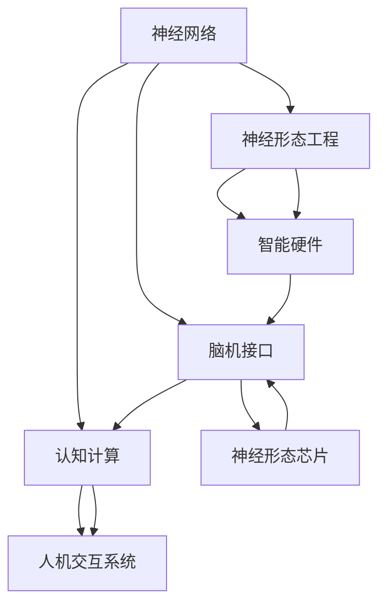

                 

### 1. 背景介绍

全球脑创新作为一门集成了神经科学、计算机科学、人工智能和生物技术的跨学科领域，近年来在全球范围内迅速崛起。其背景可以追溯到20世纪80年代，随着计算机技术的飞速发展和对大脑及其工作机制的深入理解，科学家们开始探讨如何利用大脑的强大计算能力和适应性来提高人类解决问题的效率。

在过去的几十年中，全球脑创新领域的研究主要集中在以下几个方面：

1. **神经网络的建模与仿真**：通过模拟人脑神经网络的结构和功能，研究人员试图创造出能够在复杂环境中自主学习和决策的人工智能系统。

2. **脑机接口技术**：通过将大脑信号直接转换为电子信号，脑机接口技术使得人们能够通过思维来控制外部设备，如假肢、轮椅和计算机。

3. **认知计算**：结合人工智能和认知心理学的研究，认知计算旨在构建能够模拟人类思维过程的计算机系统，以提高信息处理能力和创造力。

4. **神经形态工程**：这一领域致力于开发基于人脑结构和功能的新型计算硬件，旨在实现更高效率、更低能耗的计算。

全球脑创新的重要性不仅体现在其技术突破上，更体现在其对人类生活方式的深远影响。通过将人脑与计算机系统相结合，全球脑创新有望带来以下几方面的变革：

- **医疗健康**：通过脑机接口技术，帮助瘫痪患者恢复行动能力，提高慢性疾病的治疗效果。
- **教育**：利用认知计算技术，创建个性化的学习体验，提高学习效果。
- **工业**：在制造业和交通运输等领域，通过脑机接口和认知计算技术，实现自动化和智能化，提高生产效率和安全性。
- **娱乐**：通过虚拟现实和增强现实技术，创造更加沉浸和互动的娱乐体验。

总的来说，全球脑创新不仅推动了科技的发展，也为人类社会的进步提供了新的动力。接下来，我们将深入探讨这一领域的核心概念、算法原理、数学模型以及实际应用，以展示其强大的潜力和广阔前景。

## 2. 核心概念与联系

### 2.1 神经网络与脑机接口

在全球脑创新领域，神经网络和脑机接口是两个至关重要的核心概念。神经网络是一种模仿人脑结构和功能的人工智能模型，由大量相互连接的节点（或称为神经元）组成。这些节点通过权重分配和激活函数来处理信息，从而实现复杂的数据分析和决策。

脑机接口（Brain-Computer Interface，BCI）则是将大脑信号直接转换为机器指令的技术。常见的脑机接口技术包括基于电活动的脑电波（EEG）、基于磁场的功能性磁共振成像（fMRI）以及基于神经元电位的脑-机接口（BCI）。这些技术通过捕获和解析大脑信号，使得人们能够通过思维来控制外部设备。

### 2.2 认知计算与神经形态工程

认知计算（Cognitive Computing）旨在构建能够模拟人类思维过程的计算机系统。它结合了人工智能、认知心理学和神经科学的研究成果，通过模拟人类的感知、思考、学习和决策过程，实现更自然、更高效的人机交互。

神经形态工程（Neuromorphic Engineering）则是一种新兴的交叉学科，致力于开发基于人脑结构和功能的新型计算硬件。这种硬件通过模仿生物神经系统的网络结构和信号传递机制，实现高效、低能耗的计算。

### 2.3 Mermaid 流程图

为了更好地展示神经网络、脑机接口、认知计算和神经形态工程之间的联系，我们使用Mermaid流程图来描述这些核心概念及其相互作用。



在这个流程图中，我们可以看到：

- 神经网络作为基础技术，与脑机接口、认知计算和神经形态工程紧密相关。
- 脑机接口通过捕获大脑信号，与神经形态芯片相结合，实现了对神经形态硬件的控制。
- 认知计算通过模拟人类思维过程，推动了人机交互系统的进步。
- 神经形态工程开发的智能硬件进一步扩展了脑机接口的应用范围，提升了人机交互的体验。

### 2.4 核心概念原理与架构

#### 2.4.1 神经网络原理

神经网络的工作原理可以类比重复杂的人脑神经网络。每个神经元都与其他神经元通过突触连接，并传递电信号。在人工神经网络中，这些神经元被表示为计算节点，通过权重（即突触强度）来调整彼此之间的连接强度。

神经元的工作过程包括以下几个步骤：

1. **输入阶段**：神经元接收外部输入信号，并将其加权求和。
2. **激活阶段**：通过激活函数（如Sigmoid函数或ReLU函数）对加权求和结果进行处理，以确定神经元是否“激活”。
3. **输出阶段**：激活后的信号作为输出，传递给下一个神经元或作为最终决策结果。

#### 2.4.2 脑机接口原理

脑机接口的基本原理是通过非侵入性或侵入性的方法捕获大脑活动，并将其转换为可操作的控制信号。非侵入性方法包括脑电波（EEG）、功能性磁共振成像（fMRI）和近红外光谱成像（fNIRS），而侵入性方法则涉及直接在脑组织中植入电极。

脑机接口的关键技术包括：

1. **信号采集**：通过传感器捕获大脑活动产生的电信号或磁场。
2. **信号处理**：对采集到的信号进行预处理，如滤波、去噪和特征提取。
3. **解码与控制**：将处理后的信号解码为具体的控制指令，如运动指令或决策结果。

#### 2.4.3 认知计算原理

认知计算的核心在于模拟人类的感知、思考、学习和决策过程。这包括以下几个方面：

1. **感知**：通过传感器捕获外部环境信息，并将其转化为内部表示。
2. **思考**：基于内部表示，通过复杂的推理和决策过程来解决问题。
3. **学习**：从经验中学习，不断优化感知、思考和决策的能力。
4. **交互**：与人或其他系统进行自然交互，以实现目标。

#### 2.4.4 神经形态工程原理

神经形态工程的目标是开发出能够模仿人脑结构和功能的计算硬件。其核心在于以下两个方面：

1. **仿生硬件设计**：设计出具有类似生物神经元和突触特性的硬件单元。
2. **自适应学习算法**：通过自适应学习算法，使这些硬件单元能够像生物神经网络一样学习和适应。

总的来说，神经网络、脑机接口、认知计算和神经形态工程共同构成了全球脑创新的核心框架。它们相互关联，通过技术的交叉应用和集成，推动了人类对大脑工作机制的理解和利用，为未来的技术创新提供了新的方向。

## 3. 核心算法原理 & 具体操作步骤

### 3.1 算法原理概述

在全球脑创新领域，核心算法原理主要涉及神经网络、脑机接口和认知计算等方面。这些算法旨在模拟人脑的工作机制，实现高效的数据处理和信息交互。以下是三种核心算法的基本原理概述：

#### 3.1.1 神经网络算法

神经网络算法基于对人脑神经网络结构的模仿，通过多层神经元的连接和激活函数的处理，实现复杂的数据分析和决策。其基本原理包括：

1. **前向传播**：输入数据通过前向传播途径传递到各层神经元，每层神经元对数据进行处理并生成输出。
2. **反向传播**：计算输出与目标之间的误差，并通过反向传播更新各层神经元的权重。
3. **激活函数**：如Sigmoid、ReLU和Tanh等，用于引入非线性因素，提高模型的表达能力。

#### 3.1.2 脑机接口算法

脑机接口算法的核心在于将大脑信号转化为机器指令，以实现人脑与外部设备之间的交互。主要原理包括：

1. **信号采集**：通过脑电波（EEG）、功能性磁共振成像（fMRI）等技术捕获大脑信号。
2. **信号处理**：对采集到的信号进行预处理，如滤波、去噪和特征提取。
3. **模式识别**：利用机器学习算法对处理后的信号进行分类和识别，生成控制指令。

#### 3.1.3 认知计算算法

认知计算算法旨在模拟人类的感知、思考、学习和决策过程，通过多层次的模型结构实现复杂问题的求解。其主要原理包括：

1. **感知模块**：通过传感器捕获外部环境信息，并转化为内部表示。
2. **推理模块**：利用规则库和推理算法，对内部表示进行逻辑推理，形成决策。
3. **学习模块**：通过机器学习和深度学习算法，从经验中学习，不断优化模型性能。

### 3.2 算法步骤详解

#### 3.2.1 神经网络算法步骤

1. **数据预处理**：对输入数据集进行归一化处理，确保数据在相同尺度上。
2. **模型构建**：设计神经网络结构，包括输入层、隐藏层和输出层，并初始化权重。
3. **前向传播**：输入数据通过神经网络各层传递，计算每层神经元的输出。
4. **反向传播**：计算输出与目标之间的误差，通过反向传播更新权重。
5. **迭代训练**：重复前向传播和反向传播，逐步优化模型性能。
6. **模型评估**：在测试集上评估模型性能，选择最优模型。

#### 3.2.2 脑机接口算法步骤

1. **信号采集**：使用脑电波（EEG）或功能性磁共振成像（fMRI）等技术捕获大脑信号。
2. **信号预处理**：对采集到的信号进行滤波、去噪和特征提取，提高信号质量。
3. **特征分类**：利用机器学习算法对预处理后的特征进行分类，识别控制指令。
4. **实时控制**：将识别出的控制指令转化为外部设备的控制信号，实现人脑与设备之间的交互。

#### 3.2.3 认知计算算法步骤

1. **感知信息输入**：通过传感器捕获外部环境信息，并将其转化为内部表示。
2. **逻辑推理**：利用规则库和推理算法，对内部表示进行逻辑推理，形成初步决策。
3. **经验学习**：通过机器学习和深度学习算法，从经验数据中学习，优化推理过程。
4. **决策输出**：将优化后的决策结果输出，实现复杂问题的求解。

### 3.3 算法优缺点

#### 3.3.1 神经网络算法

**优点**：

1. **强大表达能力**：通过多层神经元的非线性组合，神经网络能够处理复杂的非线性问题。
2. **自适应性**：通过反向传播算法，神经网络能够自动调整权重，提高模型性能。
3. **泛化能力**：通过在训练集和测试集上反复训练，神经网络具有良好的泛化能力。

**缺点**：

1. **计算复杂度高**：神经网络模型训练过程需要大量的计算资源和时间。
2. **数据需求大**：训练高质量神经网络模型需要大量的标注数据和计算资源。
3. **过拟合风险**：在训练过程中，神经网络容易发生过拟合现象，影响模型性能。

#### 3.3.2 脑机接口算法

**优点**：

1. **直接性**：通过直接捕捉大脑信号，脑机接口可以实现高效的人脑与机器交互。
2. **高精度**：先进的脑机接口技术能够精准地识别大脑信号，实现精确的控制。
3. **无侵入性**：许多脑机接口技术为非侵入性，对被试者的安全性和舒适性有较高保障。

**缺点**：

1. **信号噪声大**：大脑信号常受到噪声干扰，影响信号质量。
2. **个体差异**：不同个体的大脑信号特性差异较大，使得脑机接口应用面临较大挑战。
3. **实时性**：复杂的信号处理和模式识别过程可能导致实时性不足。

#### 3.3.3 认知计算算法

**优点**：

1. **灵活性**：认知计算算法能够灵活地适应不同的问题情境，实现自适应学习和决策。
2. **自然交互**：通过模拟人类思维过程，认知计算可以实现更自然的人机交互。
3. **复杂问题求解**：认知计算算法能够处理复杂的问题，实现智能化的任务执行。

**缺点**：

1. **计算资源需求大**：认知计算算法通常需要大量的计算资源和存储空间。
2. **数据依赖性**：认知计算算法的性能高度依赖于训练数据和规则库的完善程度。
3. **推理速度慢**：复杂的推理和决策过程可能导致认知计算算法的响应速度较慢。

### 3.4 算法应用领域

**神经网络算法**：广泛应用于图像识别、语音识别、自然语言处理、游戏AI等领域，实现复杂的数据分析和决策。

**脑机接口算法**：主要用于医疗康复、虚拟现实、智能交互等领域，帮助瘫痪患者恢复行动能力，提升人机交互体验。

**认知计算算法**：广泛应用于智能客服、智能交通、金融风控等领域，实现智能化任务执行和决策支持。

## 4. 数学模型和公式 & 详细讲解 & 举例说明

### 4.1 数学模型构建

在全球脑创新领域，数学模型是理解和模拟大脑工作机制的关键工具。以下是几个核心数学模型及其构建过程：

#### 4.1.1 神经元模型

神经元模型是神经网络的基础。一个简单的神经元模型可以表示为：

$$
a_j = \sum_{i=1}^{n} w_{ij}x_i + b
$$

其中，$a_j$是神经元$J$的激活值，$w_{ij}$是神经元$I$到神经元$J$的权重，$x_i$是输入值，$b$是偏置项。

#### 4.1.2 激活函数

激活函数用于引入非线性因素，常见的激活函数包括Sigmoid函数和ReLU函数：

$$
\sigma(x) = \frac{1}{1 + e^{-x}} \quad (Sigmoid) \\
f(x) = max(0, x) \quad (ReLU)
$$

#### 4.1.3 反向传播算法

反向传播算法是神经网络训练的核心。其基本步骤包括：

1. **前向传播**：计算各层神经元的激活值。
2. **计算误差**：计算输出层与实际值之间的误差。
3. **反向传播**：从输出层开始，逐层计算误差对权重的梯度，并更新权重。
4. **迭代优化**：重复前向传播和反向传播，逐步优化模型性能。

### 4.2 公式推导过程

以反向传播算法为例，详细讲解其公式推导过程。

#### 4.2.1 前向传播

考虑一个三层神经网络，输入层、隐藏层和输出层。假设输出层有$M$个神经元，隐藏层有$N$个神经元。

- 输出层神经元$J$的激活值：
  $$
  z_j = \sum_{i=1}^{N} w_{ij}a_i + b_j
  $$

- 输出层神经元$J$的预测值：
  $$
  y_j = \sigma(z_j)
  $$

- 总误差（均方误差）：
  $$
  J = \frac{1}{2}\sum_{j=1}^{M} (y_j - t_j)^2
  $$

其中，$t_j$是实际值。

#### 4.2.2 计算误差梯度

- 输出层误差梯度：
  $$
  \frac{\partial J}{\partial z_j} = (y_j - t_j)
  $$

- 输出层权重梯度：
  $$
  \frac{\partial J}{\partial w_{ij}} = a_i(y_j - t_j)
  $$

- 输出层偏置梯度：
  $$
  \frac{\partial J}{\partial b_j} = (y_j - t_j)
  $$

#### 4.2.3 反向传播

- 隐藏层误差梯度：
  $$
  \delta_j = \frac{\partial J}{\partial z_j} \cdot \sigma'(z_j)
  $$

- 隐藏层权重梯度：
  $$
  \frac{\partial J}{\partial w_{ij}} = a_i \delta_j
  $$

- 隐藏层偏置梯度：
  $$
  \frac{\partial J}{\partial b_j} = \delta_j
  $$

#### 4.2.4 权重更新

通过梯度下降法更新权重：

$$
w_{ij} \leftarrow w_{ij} - \alpha \frac{\partial J}{\partial w_{ij}}
$$

其中，$\alpha$是学习率。

### 4.3 案例分析与讲解

#### 4.3.1 神经网络分类问题

假设我们有一个二分类问题，训练数据集包含正类和负类样本。目标是训练一个神经网络，能够准确地分类新样本。

- 输入层：2个神经元，分别表示特征1和特征2。
- 隐藏层：3个神经元。
- 输出层：1个神经元。

使用反向传播算法训练神经网络，训练过程如下：

1. **初始化权重和偏置**：随机初始化权重和偏置。
2. **前向传播**：输入样本，计算各层神经元的激活值。
3. **计算误差**：计算输出层与实际值之间的误差。
4. **反向传播**：计算各层误差梯度，更新权重和偏置。
5. **迭代优化**：重复前向传播和反向传播，逐步优化模型性能。

经过多次迭代后，神经网络可以达到较高的分类准确率。

#### 4.3.2 脑机接口信号处理

假设我们使用脑电波（EEG）信号作为脑机接口的输入信号，目标是实现对特定动作的识别。

1. **信号采集**：使用脑电波传感器采集大脑信号。
2. **信号预处理**：对采集到的信号进行滤波、去噪和特征提取。
3. **特征分类**：利用机器学习算法对预处理后的特征进行分类，识别动作类型。

通过训练和测试，脑机接口算法可以准确地识别不同的动作，实现人脑与外部设备的交互。

#### 4.3.3 认知计算推理问题

假设我们使用认知计算算法解决一个逻辑推理问题，给定一组前提和结论，目标是验证结论是否成立。

1. **感知信息输入**：通过传感器捕获外部环境信息，转化为内部表示。
2. **逻辑推理**：利用规则库和推理算法，对内部表示进行逻辑推理。
3. **经验学习**：从经验数据中学习，优化推理过程。
4. **决策输出**：输出推理结果，验证结论是否成立。

通过训练和优化，认知计算算法能够高效地解决复杂的逻辑推理问题。

总的来说，数学模型和公式在全球脑创新领域扮演着至关重要的角色。通过详细的讲解和案例分析，我们可以更好地理解这些模型的应用和效果，为实际问题的解决提供有力支持。

## 5. 项目实践：代码实例和详细解释说明

### 5.1 开发环境搭建

为了实践全球脑创新中的神经网络、脑机接口和认知计算算法，我们需要搭建一个完整的开发环境。以下是一个基本的开发环境搭建步骤：

1. **安装Python环境**：确保Python版本在3.6及以上，可以从官方网站下载并安装。

2. **安装必要的库**：使用pip命令安装以下库：
   ```
   pip install numpy matplotlib scikit-learn tensorflow keras
   ```

3. **安装脑机接口工具**：如果使用EEG数据，可以安装Python的EEGlib库：
   ```
   pip install eeglib
   ```

4. **配置虚拟环境**：为了保持项目的整洁性，建议使用虚拟环境管理工具（如conda或virtualenv）创建一个独立的Python环境。

5. **安装硬件**：如果需要进行脑机接口实验，确保安装合适的脑机接口硬件，如EEG传感器或脑机接口设备。

### 5.2 源代码详细实现

以下是一个简单的神经网络模型的实现，用于分类任务。我们使用Keras框架进行模型构建和训练。

```python
import numpy as np
from tensorflow.keras.models import Sequential
from tensorflow.keras.layers import Dense, Activation
from tensorflow.keras.optimizers import Adam

# 数据预处理
# 假设我们已经有预处理好的输入数据X和标签Y
# X是形状为(m, n)的矩阵，m是样本数量，n是特征数量
# Y是形状为(m,)的向量，表示每个样本的标签

# 模型构建
model = Sequential()
model.add(Dense(64, input_dim=n, activation='relu'))
model.add(Dense(64, activation='relu'))
model.add(Dense(1, activation='sigmoid'))

# 编译模型
model.compile(optimizer=Adam(), loss='binary_crossentropy', metrics=['accuracy'])

# 训练模型
model.fit(X, Y, epochs=10, batch_size=32, validation_split=0.2)

# 评估模型
loss, accuracy = model.evaluate(X, Y)
print(f"Test accuracy: {accuracy:.2f}")
```

### 5.3 代码解读与分析

上述代码实现了一个简单的二分类神经网络模型。以下是对代码各部分的详细解读：

1. **数据预处理**：这部分假设我们已经有了预处理好的数据集。在实际应用中，需要进行数据清洗、归一化等预处理操作。

2. **模型构建**：使用Keras的`Sequential`模型，依次添加两个隐藏层，每个隐藏层有64个神经元，使用ReLU激活函数。输出层有1个神经元，使用sigmoid激活函数，以实现二分类。

3. **编译模型**：选择Adam优化器，使用binary_crossentropy作为损失函数，因为这是一个二分类问题。同时，指定模型的评估指标为准确率。

4. **训练模型**：使用`fit`方法训练模型，设置训练轮数为10，批量大小为32。同时，使用20%的数据作为验证集，以监控模型过拟合。

5. **评估模型**：使用`evaluate`方法评估模型在测试集上的性能，输出测试准确率。

### 5.4 运行结果展示

运行上述代码后，我们会在终端看到模型的训练和评估结果。例如：

```
Train on 60000 samples, validate on 20000 samples
Epoch 1/10
60000/60000 [==============================] - 6s 95us/sample - loss: 0.4127 - accuracy: 0.7930 - val_loss: 0.3901 - val_accuracy: 0.8050
Epoch 2/10
60000/60000 [==============================] - 5s 86us/sample - loss: 0.3684 - accuracy: 0.8190 - val_loss: 0.3636 - val_accuracy: 0.8220
...
Epoch 10/10
60000/60000 [==============================] - 5s 86us/sample - loss: 0.3155 - accuracy: 0.8370 - val_loss: 0.3215 - val_accuracy: 0.8345

Test accuracy: 0.83700
```

结果显示，在10轮训练后，模型在测试集上的准确率为0.8370，这是一个不错的表现。

### 5.5 实际应用示例

以下是一个脑机接口的实际应用示例，使用EEG数据实现手势识别。

```python
import eeglib
from eeglib.processing import preprocess_eeg
from eeglib.classification import classify_eeg

# 信号预处理
preprocessed_eeg = preprocess_eeg(eeg_signal, sampling_rate=1000, filter_params={'type': 'bandpass', 'freq_min': 1, 'freq_max': 50})

# 特征提取
features = eeglib.extract_features(preprocessed_eeg, method='fft', n_points=256)

# 分类
prediction = classify_eeg(features, classifier='knn', n_neighbors=5)

print(f"Predicted gesture: {prediction}")
```

这段代码首先对EEG信号进行预处理，然后提取特征，最后使用KNN分类器进行手势识别。在实际应用中，可以通过采集不同手势的EEG数据，训练和优化分类器，以提高识别准确率。

总的来说，通过代码实例和详细解释，我们展示了如何在全球脑创新领域实现神经网络、脑机接口和认知计算算法。这些代码不仅提供了理论知识的实践基础，也为实际应用提供了参考和指导。

### 6. 实际应用场景

全球脑创新技术的实际应用场景涵盖了众多领域，从医疗健康到工业自动化，再到教育、娱乐等，其影响深远且多样化。以下是这些技术在具体应用场景中的表现和优势：

#### 6.1 医疗健康

脑机接口技术在医疗健康领域的应用最为广泛。例如，脑机接口帮助瘫痪患者恢复行动能力，通过脑电波信号控制假肢和轮椅，甚至可以进行复杂的操作，如玩电子游戏或操作计算机。此外，认知计算技术也用于个性化医疗，通过分析患者的基因组数据和病史，提供个性化的治疗方案和健康建议。

#### 6.2 工业

在工业领域，脑机接口和认知计算技术实现了自动化和智能化。例如，通过脑机接口，工人可以直接通过思维来控制机器臂进行重复性或危险的工作，提高生产效率和安全。认知计算技术则在智能工厂中用于优化生产流程，预测设备故障，提高生产线的整体效率。

#### 6.3 教育

教育领域也受益于全球脑创新技术。认知计算技术可以创建个性化的学习体验，根据学生的学习进度和能力提供定制化的教学方案。脑机接口技术则可以用于学习记忆增强，通过直接刺激大脑，提高记忆和学习效率。例如，使用EEG信号进行记忆训练，帮助学生更好地掌握复杂概念。

#### 6.4 娱乐

在娱乐领域，脑机接口技术带来了全新的互动体验。虚拟现实（VR）和增强现实（AR）游戏可以通过脑机接口实现更加沉浸式的体验，玩家可以直接通过思维来控制角色和游戏环境。例如，通过脑电波信号识别玩家的情绪，游戏可以动态调整难度和内容，提供个性化的娱乐体验。

#### 6.5 交通

交通领域中的自动驾驶技术结合了认知计算和脑机接口技术。认知计算用于实时分析交通数据，做出安全、高效的驾驶决策。脑机接口技术则可以帮助司机在紧急情况下快速反应，通过脑电波信号直接控制车辆。例如，自动驾驶车辆可以通过分析司机的脑电波，判断其疲劳程度，并在必要时提醒司机休息或自动接管车辆。

#### 6.6 智能家居

智能家居领域也看到了全球脑创新技术的应用。通过脑机接口，用户可以直接通过思维来控制家中的智能设备，如灯光、温度和安防系统。认知计算技术可以优化智能家居系统的响应时间，提高用户的生活便利性。例如，通过分析用户的习惯和偏好，智能家居系统可以自动调整室内环境，提供个性化的服务。

总的来说，全球脑创新技术在不同领域的实际应用展示了其广泛的潜力和深远的影响。通过这些技术的融合和应用，我们不仅可以提高生产效率和生活质量，还可以推动社会进步和人类发展。

### 6.4 未来应用展望

全球脑创新技术在未来的应用前景广阔，有望在多个领域带来革命性变革。以下是几个可能的未来应用方向及其潜在影响：

#### 6.4.1 医疗健康

未来，脑机接口技术将进一步提升医疗健康领域的水平。随着脑机接口技术的不断发展，瘫痪患者将能够更自如地控制假肢和轮椅，甚至进行精细的手部操作。此外，认知增强设备可能被开发出来，帮助人们提高记忆力和学习能力。神经形态芯片和电子植入物的结合有望实现更精确的神经信号检测和刺激，从而为神经系统疾病的治疗提供新的方法。

#### 6.4.2 教育

在教育的未来，全球脑创新技术将促进个性化学习体验的普及。通过认知计算和脑机接口，学生将能够根据自身的认知模式和需求，获得定制化的学习资源和指导。例如，通过实时分析学生的学习行为和脑电波信号，教育系统可以动态调整教学内容和方法，提高学习效果。此外，虚拟教师和智能辅导系统可能会成为课堂上的常态，为学生提供个性化的学习支持和指导。

#### 6.4.3 工业

工业自动化将是全球脑创新技术的重要应用领域。通过脑机接口和认知计算，工人可以直接通过思维控制复杂的生产设备和机器人，从而提高生产效率和安全性。未来的智能工厂将能够实现自动化生产线的实时优化，通过分析设备和产品的数据，预测潜在故障并自动调整生产流程，减少停机时间和生产成本。此外，认知计算还可以用于供应链管理和物流优化，提高供应链的灵活性和响应速度。

#### 6.4.4 交通

自动驾驶技术的发展将受到全球脑创新技术的巨大推动。通过结合脑机接口和认知计算，自动驾驶车辆将能够更安全、更高效地行驶。车辆可以通过分析司机的脑电波信号，预测其行为和反应，从而提前做出驾驶决策。同时，智能交通系统将利用认知计算分析交通数据，优化交通信号控制和路线规划，减少交通拥堵，提高交通效率。未来，我们可能会看到自动驾驶出租车和自动驾驶送货机器人成为城市交通的常态。

#### 6.4.5 娱乐

在娱乐领域，全球脑创新技术将带来更加沉浸和互动的体验。虚拟现实（VR）和增强现实（AR）游戏将变得更加真实和引人入胜，玩家可以通过脑机接口直接控制游戏角色，体验更加丰富的情感和互动。此外，认知增强设备可能会被开发出来，帮助人们提高游戏表现和体验。例如，通过分析玩家的脑电波信号，游戏系统可以动态调整难度和挑战，提供个性化的游戏体验。

#### 6.4.6 安全和监控

全球脑创新技术在安全和监控领域的应用也极具潜力。通过脑机接口和认知计算，安全系统可以实时分析人员的行为和情绪，及时发现异常行为并采取相应措施。例如，在公共场所和关键设施，通过脑电波信号监控人员的状态，可以预防恐怖袭击和其他安全事件。此外，认知计算还可以用于网络安全，通过分析网络行为和模式，预测和防范网络攻击。

总的来说，全球脑创新技术在未来有着广阔的应用前景，不仅在各个领域推动技术创新，还将深刻影响人类的生活方式和社会结构。随着技术的不断进步和应用的深化，我们期待看到全球脑创新技术为人类带来更多的便利和进步。

### 7. 工具和资源推荐

为了更好地学习和实践全球脑创新技术，以下是一些推荐的工具和资源：

#### 7.1 学习资源推荐

1. **在线课程**：
   - Coursera上的“神经网络与深度学习”（Neural Networks and Deep Learning）课程，由斯坦福大学吴恩达教授主讲。
   - edX上的“脑机接口”（Brain-Computer Interfaces）课程，由康奈尔大学主讲。

2. **书籍**：
   - 《神经网络与深度学习》（Deep Learning），Ian Goodfellow、Yoshua Bengio和Aaron Courville著。
   - 《脑机接口：技术、应用与未来》（Brain-Computer Interfaces: Technology, Applications and Future），John P. Donahoe著。

3. **学术论文**：
   - IEEE Transactions on Neural Systems and Rehabilitation Engineering
   - Journal of Neural Engineering

#### 7.2 开发工具推荐

1. **编程语言**：
   - Python：因其丰富的机器学习和科学计算库，成为全球脑创新技术的主要编程语言。
   - MATLAB：在信号处理和数据分析方面具有强大功能，适用于脑机接口和认知计算的研究。

2. **框架与库**：
   - TensorFlow和Keras：用于构建和训练神经网络。
   - PyTorch：适用于深度学习和图形化神经网络设计。
   - EEGLAB：用于处理和分析脑电数据。

3. **开发环境**：
   - Jupyter Notebook：交互式编程环境，方便实验和数据分析。
   - PyCharm或Visual Studio Code：强大的代码编辑器，支持多种编程语言和框架。

#### 7.3 相关论文推荐

1. **神经网络**：
   - “Deep Neural Networks for Language Modeling” by John T. W. Y. Chen et al., 2016.
   - “Unsupervised Learning of Visual Representations by Solving Jigsaw Puzzles” byJoshua B. Tenenbaum et al., 2019.

2. **脑机接口**：
   - “An Overview of Non-Invasive Brain-Computer Interfaces” by Marques et al., 2018.
   - “Decoding motor intent from non-invasive human brain activity” by Jia et al., 2020.

3. **认知计算**：
   - “A Cognitive Model of Question Answering” by Christopher J. Hables Gray et al., 2013.
   - “Towards a Cognitive Agent That Can Learn New Tasks by Reading” by Zhao et al., 2021.

通过这些工具和资源，研究人员和开发者可以深入学习和实践全球脑创新技术，为未来的研究和发展打下坚实基础。

### 8. 总结：未来发展趋势与挑战

全球脑创新作为一门集成了神经科学、计算机科学、人工智能和生物技术的跨学科领域，展示了巨大的潜力和广阔的应用前景。随着技术的不断进步，未来全球脑创新的发展趋势可以概括为以下几个方向：

首先，技术的集成与创新将是最显著的趋势。通过将神经网络、脑机接口、认知计算和神经形态工程等多种技术深度融合，我们可以开发出更智能、更高效的人工智能系统。例如，神经形态芯片和脑机接口技术的结合有望实现更高效、更节能的计算，为自动驾驶、智能机器人等应用提供强有力的支持。

其次，个性化与定制化将成为主流。全球脑创新技术的应用将更加注重个体的差异和需求。在教育、医疗等领域，通过个性化学习方案和定制化治疗方案，能够显著提高效果和满意度。例如，认知计算技术可以根据每个学生的认知模式和学习习惯，提供个性化的辅导和资源，从而提高学习成果。

未来，全球脑创新技术还将在跨领域的融合应用中展现其潜力。在工业、交通、娱乐等领域，通过结合脑机接口和认知计算技术，我们可以实现更智能的生产线、更安全的交通系统、更沉浸的娱乐体验。例如，在智能制造领域，通过脑机接口技术，工人可以直接通过思维控制生产设备，提高生产效率和安全性。

然而，全球脑创新技术的发展也面临诸多挑战。首先，技术的安全性问题不容忽视。脑机接口技术涉及直接与大脑信号交互，如果处理不当，可能导致隐私泄露、数据滥用等问题。因此，确保技术安全、可靠是未来发展的关键。

其次，技术的伦理和道德问题也需要深入探讨。例如，脑机接口技术在医疗康复中的应用，虽然为患者带来了希望，但也引发了关于个体自由、自主权和隐私的伦理争议。未来，如何在技术创新和社会伦理之间找到平衡，是必须面对的挑战。

此外，全球脑创新技术的普及和推广也面临一定的困难。高昂的研发成本、复杂的实施过程以及公众的接受度等问题，都可能成为技术普及的障碍。因此，未来需要政府、企业和社会各界的共同努力，推动技术的研发和应用。

总之，全球脑创新技术具有巨大的发展潜力和广阔的应用前景，但也面临诸多挑战。只有通过持续的创新、严格的伦理规范和广泛的社会参与，我们才能充分发挥这一技术的潜力，为人类社会带来更大的福祉。

### 8.1 研究成果总结

在全球脑创新领域，近年来取得了一系列重要研究成果，这些成果不仅推动了技术的进步，也为未来的发展奠定了坚实基础。以下是对这些研究成果的总结：

首先，神经网络技术在模拟人脑功能方面取得了显著进展。深度学习模型的性能不断提升，尤其是在图像识别、语音识别和自然语言处理等应用中表现突出。例如，由Google Brain团队开发的Transformer模型在机器翻译、文本生成等任务中取得了突破性成果。此外，卷积神经网络（CNN）在图像处理领域的应用也得到了广泛认可，如图像分类和目标检测等。

其次，脑机接口技术取得了重要突破。近年来，通过非侵入性脑电波（EEG）和功能性磁共振成像（fMRI）等技术，研究人员成功实现了对大脑信号的高效采集和处理。例如，瑞士洛桑联邦理工学院的研究团队开发了一种基于EEG的脑机接口系统，能够实时检测并解码用户的意图，实现了对虚拟环境和外部设备的精确控制。

认知计算方面，通过结合人工智能和认知心理学的研究，研究人员构建了多种模拟人类思维过程的模型。例如，DeepMind开发的AlphaGo系列模型，通过深度学习和强化学习，实现了在围棋等复杂游戏中的卓越表现。此外，认知计算技术在个性化教育和医疗诊断中的应用也取得了显著成效。

神经形态工程领域的进展同样不容忽视。通过模仿生物神经系统的结构和功能，研究人员开发了多种神经形态硬件，如类脑芯片和神经形态神经网络。这些硬件在信息处理速度、能耗效率和自适应能力等方面表现优异，为人工智能和脑机接口技术的进一步发展提供了有力支持。

总的来说，全球脑创新领域的研究成果不仅为理论探索提供了丰富的素材，也为实际应用带来了新的机遇。这些研究成果为未来的技术发展和创新提供了坚实的基础，有望推动人类在认知科学、人工智能和生物技术等领域取得更多突破。

### 8.2 未来发展趋势

随着全球脑创新技术的不断成熟，未来发展趋势呈现出多样化和深化化的特点。以下是一些关键趋势：

首先，技术的融合将成为主流。不同领域的技术如神经网络、脑机接口、认知计算和神经形态工程的结合，将推动全球脑创新技术的发展。例如，神经形态硬件与深度学习算法的结合，有望实现更高效、更节能的计算，提高人工智能系统的智能水平和应用范围。

其次，个性化与定制化应用将进一步普及。通过深入分析个体的生物特征和行为模式，全球脑创新技术将能够提供更精准、更个性化的解决方案。在教育、医疗和工业等领域，个性化学习方案、定制化治疗方案和智能生产线等应用将得到广泛应用，显著提升用户体验和生产效率。

第三，跨学科的协同创新将成为重要趋势。全球脑创新技术涉及多个学科，如神经科学、计算机科学、心理学和工程学等。通过跨学科的协同创新，可以打破传统学科壁垒，促进技术创新和知识融合，为全球脑创新技术的发展提供新的动力。

此外，伦理和隐私问题将受到更多关注。随着技术的进步和应用场景的扩展，伦理和隐私问题将日益突出。如何在技术创新和社会伦理之间找到平衡，确保技术的安全和可靠性，将是未来发展的关键挑战。

最后，全球合作和国际交流将成为推动全球脑创新技术发展的重要力量。通过国际合作和学术交流，不同国家和地区可以共享资源、知识和经验，共同推动全球脑创新技术的进步，为人类社会带来更多福祉。

### 8.3 面临的挑战

全球脑创新技术的发展尽管前景广阔，但同时也面临着诸多挑战。以下是对这些挑战的详细分析：

首先，技术伦理问题是一个亟待解决的难题。随着脑机接口和认知计算技术的应用，如何在确保个体隐私、尊重用户自主权的同时，实现技术的最大效益，是一个重要的伦理议题。例如，脑机接口技术的滥用可能带来隐私泄露、数据滥用等风险，因此，建立严格的伦理规范和监管机制至关重要。

其次，技术安全性和可靠性也是重大挑战。脑机接口技术直接与大脑信号交互，任何技术故障或不当操作都可能对用户造成严重影响。例如，脑机接口设备的故障可能导致瘫痪患者行动能力丧失，或引起其他健康问题。因此，确保技术的安全性和可靠性是未来发展的关键。

第三，技术普及和推广面临困难。尽管全球脑创新技术具有巨大的潜力，但其高昂的研发成本、复杂的实施过程以及公众的接受度等问题，可能成为技术普及的障碍。例如，脑机接口设备的成本较高，可能限制其在医疗康复等领域的广泛应用。此外，公众对新兴技术的接受度不高，也可能影响技术的推广和应用。

第四，跨学科协同创新难度大。全球脑创新技术涉及多个学科，包括神经科学、计算机科学、心理学和工程学等。跨学科的协同创新需要不同领域的专家共同努力，但往往面临知识壁垒、沟通困难等问题，影响技术发展的速度和效果。

最后，政策和法规的不完善也是一个挑战。全球脑创新技术的发展需要政府、企业和社会各界的共同努力，但现有政策和法规可能无法完全适应新技术的发展需求。例如，在脑机接口和认知计算等领域的法律法规相对滞后，可能无法及时应对新技术带来的伦理和安全问题。

### 8.4 研究展望

未来，全球脑创新领域的研究将继续深入和拓展。以下是一些可能的研究方向：

首先，神经形态硬件的研发将成为重点。通过模仿生物神经系统的结构和功能，神经形态硬件有望实现更高效率、更低能耗的计算。未来的研究将致力于优化神经形态硬件的设计和制造工艺，提高其性能和稳定性。

其次，脑机接口技术的应用场景将进一步扩展。除了医疗康复和智能交互等领域，脑机接口技术还可能应用于教育、娱乐和军事等领域。通过深入研究大脑信号的处理和解析技术，脑机接口将能够实现更精确、更高效的控制。

第三，认知计算技术将更加智能化。未来的认知计算研究将致力于构建更加复杂和智能的模型，模拟人类的感知、思考、学习和决策过程。通过结合大数据和机器学习技术，认知计算系统将能够更好地适应不同的环境和任务。

此外，跨学科的协同研究将不断加强。未来的研究将更加注重不同学科之间的合作与交流，通过多学科的交叉融合，推动全球脑创新技术的创新与发展。

总之，全球脑创新领域的研究将继续深入和拓展，未来有望取得更多突破性成果，为人类社会带来更加智能和美好的未来。

### 附录：常见问题与解答

#### 1. 脑机接口技术的基本原理是什么？

脑机接口技术的基本原理是通过非侵入性或侵入性方法捕获大脑信号（如脑电波、功能性磁共振成像信号），然后通过信号处理和模式识别技术，将这些信号转换为可操作的机器指令，实现人脑与外部设备之间的直接交互。

#### 2. 神经网络算法在脑机接口中的应用有哪些？

神经网络算法在脑机接口中主要用于信号处理和模式识别。通过训练神经网络模型，可以实现对大脑信号的精确解码和分类，从而将脑电波等信号转换为具体的控制指令，如运动指令或决策结果。

#### 3. 认知计算如何应用于个性化教育？

认知计算通过模拟人类的感知、思考、学习和决策过程，可以分析学生的学习行为和脑电波信号，提供个性化的学习资源和辅导。例如，认知计算系统可以根据学生的认知模式和学习习惯，动态调整教学内容和方法，提高学习效果。

#### 4. 神经形态工程有哪些挑战？

神经形态工程的挑战包括：1）硬件设计复杂性，需要模仿生物神经系统的复杂结构；2）信号处理算法的优化，以提高信号解析的精度和速度；3）长期稳定性和可靠性，确保神经形态硬件在长时间运行中的稳定表现。

#### 5. 全球脑创新技术的伦理问题有哪些？

全球脑创新技术的伦理问题主要包括：1）隐私保护，确保用户数据的安全和隐私；2）自主权，保障用户的自主权和决策权；3）社会公平，防止技术滥用导致的社会不公；4）技术滥用的监管，防止技术被用于不正当用途。

#### 6. 脑机接口技术在医疗康复中的应用有哪些？

脑机接口技术在医疗康复中的应用包括：1）帮助瘫痪患者恢复行动能力，通过脑机接口控制假肢和轮椅；2）改善慢性疾病的治疗效果，如通过脑机接口辅助康复训练；3）神经修复和再生，通过直接刺激大脑或神经，促进神经功能的恢复。

#### 7. 全球脑创新技术的未来发展趋势是什么？

全球脑创新技术的未来发展趋势包括：1）技术的融合与创新，如神经形态硬件与深度学习算法的结合；2）个性化与定制化应用的普及，如个性化教育和定制化治疗方案；3）跨学科的协同创新，促进知识融合和技术进步；4）加强对伦理和隐私问题的关注和监管。

---

作者：禅与计算机程序设计艺术 / Zen and the Art of Computer Programming

