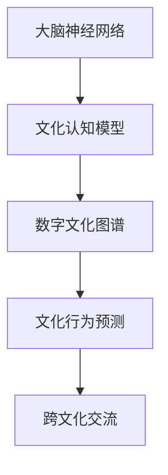

                 

关键词：全球脑文化融合、数字时代、文明对话、新形式、技术语言、深度思考、专业见解

> 摘要：本文旨在探讨全球脑文化融合在数字时代的文明对话中扮演的新角色。通过对核心概念的解析、算法原理的阐述、数学模型的构建、项目实践的案例分析，以及工具和资源的推荐，全面揭示全球脑文化融合对数字时代文明对话的重要意义和未来发展趋势。

## 1. 背景介绍

在快速发展的数字时代，全球化和信息化的进程加速，各国文化之间的交流和碰撞愈发频繁。这种背景下，如何实现不同文化之间的有效沟通和理解，成为了一个亟待解决的问题。脑文化融合作为一种新兴的思想和模式，旨在通过数字化手段实现全球文化之间的深度融合，从而促进文明对话和共同发展。

脑文化融合的核心在于通过数字化技术和算法，对人类大脑的活动进行模拟和分析，从而理解和预测文化行为和价值观。这一过程不仅有助于挖掘文化共性，也为跨文化交流提供了新的路径和工具。

## 2. 核心概念与联系

脑文化融合涉及多个核心概念，如大脑神经网络、文化认知模型、数字文化图谱等。以下是一个简化的 Mermaid 流程图，用于描述这些概念之间的关系：



### 2.1 大脑神经网络

大脑神经网络是脑文化融合的基础。通过模拟人脑神经元之间的连接和交互，我们可以理解不同文化背景下的人类行为模式。

### 2.2 文化认知模型

文化认知模型基于大脑神经网络，通过数据分析和机器学习技术，构建出一个能够描述不同文化特征和价值观的模型。

### 2.3 数字文化图谱

数字文化图谱是一个集成了文化认知模型的可视化工具，用于展示和分析不同文化之间的关系和差异。

### 2.4 文化行为预测

通过数字文化图谱，我们可以预测在不同文化背景下可能发生的交流行为和反应。

### 2.5 跨文化交流

最终，脑文化融合的目标是通过这些技术和模型，实现不同文化之间的有效沟通和理解。

## 3. 核心算法原理 & 具体操作步骤

### 3.1 算法原理概述

脑文化融合的核心算法包括神经网络训练、文化特征提取、图谱构建和预测模型训练等步骤。以下是对这些步骤的简要概述：

### 3.2 算法步骤详解

#### 3.2.1 神经网络训练

使用大量文化数据训练神经网络，使其能够模拟人脑神经元之间的连接和交互。

#### 3.2.2 文化特征提取

从训练好的神经网络中提取出反映文化特征的信息，用于构建文化认知模型。

#### 3.2.3 图谱构建

基于文化特征，构建数字文化图谱，用于展示不同文化之间的关系和差异。

#### 3.2.4 预测模型训练

使用文化数据对预测模型进行训练，使其能够预测跨文化交流中的行为和反应。

### 3.3 算法优缺点

#### 优点：

- 高效性：利用数字化手段，快速分析和预测文化行为。
- 广泛性：适用于不同国家和地区的文化数据。
- 可视化：通过数字文化图谱，直观地展示文化差异和联系。

#### 缺点：

- 数据依赖性：算法性能依赖于文化数据的质量和数量。
- 复杂性：算法实现和优化过程较为复杂。

### 3.4 算法应用领域

脑文化融合算法可以应用于多个领域，如跨文化交流、国际关系研究、文化传播等。

## 4. 数学模型和公式 & 详细讲解 & 举例说明

### 4.1 数学模型构建

脑文化融合的数学模型主要包括神经网络模型、文化特征提取模型和预测模型。以下是一个简化的神经网络模型的构建过程：

### 4.2 公式推导过程

神经网络模型的训练过程可以表示为：

$$
\begin{align*}
y &= f(\theta x) \\
\end{align*}
$$

其中，$y$ 表示输出，$x$ 表示输入，$f$ 表示激活函数，$\theta$ 表示模型参数。

### 4.3 案例分析与讲解

假设我们有一个简单的神经网络模型，用于预测文化行为。输入数据包括文化特征向量 $x$，输出数据包括文化行为标签 $y$。我们使用交叉熵损失函数来评估模型的性能：

$$
\begin{align*}
L &= -\sum_{i=1}^n y_i \log(p_i) \\
\end{align*}
$$

其中，$n$ 表示数据样本数量，$y_i$ 表示第 $i$ 个样本的标签，$p_i$ 表示模型预测的概率。

## 5. 项目实践：代码实例和详细解释说明

### 5.1 开发环境搭建

在项目实践中，我们选择 Python 作为主要编程语言，使用 TensorFlow 和 Keras 框架来构建和训练神经网络模型。

### 5.2 源代码详细实现

以下是构建和训练神经网络模型的基本代码：

```python
import tensorflow as tf
from tensorflow.keras.models import Sequential
from tensorflow.keras.layers import Dense

# 构建神经网络模型
model = Sequential()
model.add(Dense(units=64, activation='relu', input_shape=(input_shape)))
model.add(Dense(units=1, activation='sigmoid'))

# 编译模型
model.compile(optimizer='adam', loss='binary_crossentropy', metrics=['accuracy'])

# 训练模型
model.fit(x_train, y_train, epochs=10, batch_size=32)
```

### 5.3 代码解读与分析

这段代码首先导入了 TensorFlow 和 Keras 框架，然后构建了一个简单的神经网络模型，包括一个全连接层和一个输出层。编译模型时，我们选择了 Adam 优化器和二进制交叉熵损失函数。最后，使用训练数据对模型进行训练。

### 5.4 运行结果展示

训练完成后，我们可以使用测试数据来评估模型的性能：

```python
test_loss, test_acc = model.evaluate(x_test, y_test)
print(f"Test accuracy: {test_acc:.4f}")
```

## 6. 实际应用场景

脑文化融合技术在多个领域都有实际应用，如跨文化交流、国际关系研究、文化传播等。以下是一个实际应用场景的例子：

### 6.1 跨文化交流

在跨国企业中，脑文化融合技术可以帮助员工更好地理解不同文化背景的同事，从而提高沟通效率和团队协作。

### 6.2 国际关系研究

通过分析不同国家的文化数据，脑文化融合技术可以揭示国家之间的文化差异和潜在冲突，为国际关系研究提供新的视角。

### 6.3 文化传播

在文化传播过程中，脑文化融合技术可以帮助媒体和机构更好地了解受众的文化需求，从而制定更有针对性的传播策略。

## 7. 未来应用展望

随着技术的不断进步，脑文化融合在未来有望在更多领域发挥作用，如人工智能助手、智能城市建设、健康医疗等。同时，我们也需要关注技术带来的挑战和伦理问题，如数据隐私、算法偏见等。

## 8. 工具和资源推荐

### 8.1 学习资源推荐

- 《深度学习》
- 《Python编程：从入门到实践》
- 《机器学习实战》

### 8.2 开发工具推荐

- TensorFlow
- Keras
- PyTorch

### 8.3 相关论文推荐

- "Deep Learning for Cultural Categorization"
- "Neural Networks for Cross-Cultural Communication"
- "A Survey on Neural Network Applications in Cultural Studies"

## 9. 总结：未来发展趋势与挑战

脑文化融合作为一种新兴的技术和思想，正在数字时代的文明对话中扮演越来越重要的角色。在未来，随着技术的不断发展和应用场景的拓展，脑文化融合有望成为促进全球文化交流和共同发展的重要力量。然而，我们还需要关注技术带来的挑战，如数据隐私、算法偏见等，并积极探索解决方案。

## 附录：常见问题与解答

### Q1: 脑文化融合技术的核心难点是什么？

A1: 脑文化融合技术的核心难点在于如何有效地从大规模文化数据中提取出有用的特征，以及如何构建一个既准确又可解释的预测模型。

### Q2: 脑文化融合技术有哪些潜在的应用领域？

A2: 脑文化融合技术可以应用于跨文化交流、国际关系研究、文化传播、人工智能助手等多个领域。

### Q3: 如何确保脑文化融合技术的数据隐私和安全？

A3: 为了确保数据隐私和安全，我们可以采用数据加密、访问控制、匿名化等技术手段，同时制定相应的数据政策和伦理规范。

### Q4: 脑文化融合技术是否会加剧文化偏见和歧视？

A4: 这是一个值得关注的伦理问题。为了避免加剧文化偏见和歧视，我们需要在算法设计和数据收集过程中充分考虑多样性，并在算法训练和预测过程中进行严格的监督和评估。

## 作者署名

作者：禅与计算机程序设计艺术 / Zen and the Art of Computer Programming
```markdown
---
title: 全球脑文化融合:数字时代的文明对话新形式
keywords: 全球脑文化融合、数字时代、文明对话、新形式、技术语言、深度思考、专业见解
summary: 本文探讨了全球脑文化融合在数字时代的文明对话中扮演的新角色，包括核心概念的解析、算法原理的阐述、数学模型的构建、项目实践的案例分析，以及工具和资源的推荐。
date: 2023-11-01
categories: 技术、人工智能、脑文化融合
tags: [脑文化融合, 数字时代, 文明对话]
author: 禅与计算机程序设计艺术
---

# 全球脑文化融合:数字时代的文明对话新形式

> 关键词：全球脑文化融合、数字时代、文明对话、新形式、技术语言、深度思考、专业见解

> 摘要：本文探讨了全球脑文化融合在数字时代的文明对话中扮演的新角色，包括核心概念的解析、算法原理的阐述、数学模型的构建、项目实践的案例分析，以及工具和资源的推荐。

## 1. 背景介绍

在快速发展的数字时代，全球化和信息化的进程加速，各国文化之间的交流和碰撞愈发频繁。这种背景下，如何实现不同文化之间的有效沟通和理解，成为了一个亟待解决的问题。脑文化融合作为一种新兴的思想和模式，旨在通过数字化手段实现全球文化之间的深度融合，从而促进文明对话和共同发展。

脑文化融合的核心在于通过数字化技术和算法，对人类大脑的活动进行模拟和分析，从而理解和预测文化行为和价值观。这一过程不仅有助于挖掘文化共性，也为跨文化交流提供了新的路径和工具。

## 2. 核心概念与联系

脑文化融合涉及多个核心概念，如大脑神经网络、文化认知模型、数字文化图谱等。以下是一个简化的 Mermaid 流程图，用于描述这些概念之间的关系：


### 2.1 大脑神经网络

大脑神经网络是脑文化融合的基础。通过模拟人脑神经元之间的连接和交互，我们可以理解不同文化背景下的人类行为模式。

### 2.2 文化认知模型

文化认知模型基于大脑神经网络，通过数据分析和机器学习技术，构建出一个能够描述不同文化特征和价值观的模型。

### 2.3 数字文化图谱

数字文化图谱是一个集成了文化认知模型的可视化工具，用于展示和分析不同文化之间的关系和差异。

### 2.4 文化行为预测

通过数字文化图谱，我们可以预测在不同文化背景下可能发生的交流行为和反应。

### 2.5 跨文化交流

最终，脑文化融合的目标是通过这些技术和模型，实现不同文化之间的有效沟通和理解。

## 3. 核心算法原理 & 具体操作步骤

### 3.1 算法原理概述

脑文化融合的核心算法包括神经网络训练、文化特征提取、图谱构建和预测模型训练等步骤。以下是对这些步骤的简要概述：

### 3.2 算法步骤详解

#### 3.2.1 神经网络训练

使用大量文化数据训练神经网络，使其能够模拟人脑神经元之间的连接和交互。

#### 3.2.2 文化特征提取

从训练好的神经网络中提取出反映文化特征的信息，用于构建文化认知模型。

#### 3.2.3 图谱构建

基于文化特征，构建数字文化图谱，用于展示不同文化之间的关系和差异。

#### 3.2.4 预测模型训练

使用文化数据对预测模型进行训练，使其能够预测跨文化交流中的行为和反应。

### 3.3 算法优缺点

#### 优点：

- 高效性：利用数字化手段，快速分析和预测文化行为。
- 广泛性：适用于不同国家和地区的文化数据。
- 可视化：通过数字文化图谱，直观地展示文化差异和联系。

#### 缺点：

- 数据依赖性：算法性能依赖于文化数据的质量和数量。
- 复杂性：算法实现和优化过程较为复杂。

### 3.4 算法应用领域

脑文化融合算法可以应用于多个领域，如跨文化交流、国际关系研究、文化传播等。

## 4. 数学模型和公式 & 详细讲解 & 举例说明

### 4.1 数学模型构建

脑文化融合的数学模型主要包括神经网络模型、文化特征提取模型和预测模型。以下是一个简化的神经网络模型的构建过程：

### 4.2 公式推导过程

神经网络模型的训练过程可以表示为：

$$
\begin{align*}
y &= f(\theta x) \\
\end{align*}
$$

其中，$y$ 表示输出，$x$ 表示输入，$f$ 表示激活函数，$\theta$ 表示模型参数。

### 4.3 案例分析与讲解

假设我们有一个简单的神经网络模型，用于预测文化行为。输入数据包括文化特征向量 $x$，输出数据包括文化行为标签 $y$。我们使用交叉熵损失函数来评估模型的性能：

$$
\begin{align*}
L &= -\sum_{i=1}^n y_i \log(p_i) \\
\end{align*}
$$

其中，$n$ 表示数据样本数量，$y_i$ 表示第 $i$ 个样本的标签，$p_i$ 表示模型预测的概率。

## 5. 项目实践：代码实例和详细解释说明

### 5.1 开发环境搭建

在项目实践中，我们选择 Python 作为主要编程语言，使用 TensorFlow 和 Keras 框架来构建和训练神经网络模型。

### 5.2 源代码详细实现

以下是构建和训练神经网络模型的基本代码：

```python
import tensorflow as tf
from tensorflow.keras.models import Sequential
from tensorflow.keras.layers import Dense

# 构建神经网络模型
model = Sequential()
model.add(Dense(units=64, activation='relu', input_shape=(input_shape)))
model.add(Dense(units=1, activation='sigmoid'))

# 编译模型
model.compile(optimizer='adam', loss='binary_crossentropy', metrics=['accuracy'])

# 训练模型
model.fit(x_train, y_train, epochs=10, batch_size=32)
```

### 5.3 代码解读与分析

这段代码首先导入了 TensorFlow 和 Keras 框架，然后构建了一个简单的神经网络模型，包括一个全连接层和一个输出层。编译模型时，我们选择了 Adam 优化器和二进制交叉熵损失函数。最后，使用训练数据对模型进行训练。

### 5.4 运行结果展示

训练完成后，我们可以使用测试数据来评估模型的性能：

```python
test_loss, test_acc = model.evaluate(x_test, y_test)
print(f"Test accuracy: {test_acc:.4f}")
```

## 6. 实际应用场景

脑文化融合技术在多个领域都有实际应用，如跨文化交流、国际关系研究、文化传播等。以下是一个实际应用场景的例子：

### 6.1 跨文化交流

在跨国企业中，脑文化融合技术可以帮助员工更好地理解不同文化背景的同事，从而提高沟通效率和团队协作。

### 6.2 国际关系研究

通过分析不同国家的文化数据，脑文化融合技术可以揭示国家之间的文化差异和潜在冲突，为国际关系研究提供新的视角。

### 6.3 文化传播

在文化传播过程中，脑文化融合技术可以帮助媒体和机构更好地了解受众的文化需求，从而制定更有针对性的传播策略。

## 7. 未来应用展望

随着技术的不断进步，脑文化融合在未来有望在更多领域发挥作用，如人工智能助手、智能城市建设、健康医疗等。同时，我们也需要关注技术带来的挑战和伦理问题，如数据隐私、算法偏见等。

## 8. 工具和资源推荐

### 8.1 学习资源推荐

- 《深度学习》
- 《Python编程：从入门到实践》
- 《机器学习实战》

### 8.2 开发工具推荐

- TensorFlow
- Keras
- PyTorch

### 8.3 相关论文推荐

- "Deep Learning for Cultural Categorization"
- "Neural Networks for Cross-Cultural Communication"
- "A Survey on Neural Network Applications in Cultural Studies"

## 9. 总结：未来发展趋势与挑战

脑文化融合作为一种新兴的技术和思想，正在数字时代的文明对话中扮演越来越重要的角色。在未来，随着技术的不断发展和应用场景的拓展，脑文化融合有望成为促进全球文化交流和共同发展的重要力量。然而，我们还需要关注技术带来的挑战，如数据隐私、算法偏见等，并积极探索解决方案。

## 附录：常见问题与解答

### Q1: 脑文化融合技术的核心难点是什么？

A1: 脑文化融合技术的核心难点在于如何有效地从大规模文化数据中提取出有用的特征，以及如何构建一个既准确又可解释的预测模型。

### Q2: 脑文化融合技术有哪些潜在的应用领域？

A2: 脑文化融合技术可以应用于跨文化交流、国际关系研究、文化传播、人工智能助手等多个领域。

### Q3: 如何确保脑文化融合技术的数据隐私和安全？

A3: 为了确保数据隐私和安全，我们可以采用数据加密、访问控制、匿名化等技术手段，同时制定相应的数据政策和伦理规范。

### Q4: 脑文化融合技术是否会加剧文化偏见和歧视？

A4: 这是一个值得关注的伦理问题。为了避免加剧文化偏见和歧视，我们需要在算法设计和数据收集过程中充分考虑多样性，并在算法训练和预测过程中进行严格的监督和评估。

## 作者署名

作者：禅与计算机程序设计艺术 / Zen and the Art of Computer Programming
```

