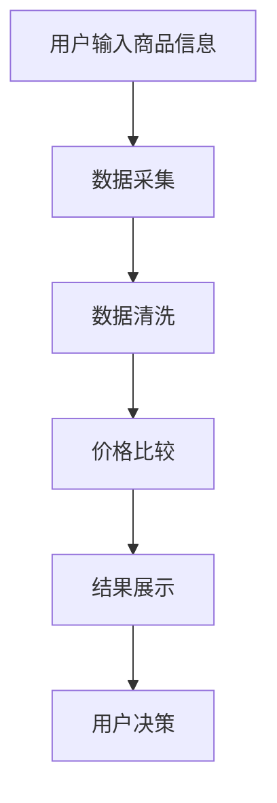

                 

关键词：全网比价、人工智能、价格比较、AI算法、价格优化、电商比价

摘要：本文将探讨如何利用人工智能技术实现全网比价，帮助用户快速找到最优惠的商品价格。文章首先介绍了全网比价的背景和重要性，然后详细阐述了核心概念、算法原理、数学模型、应用场景和实践案例，最后对未来的发展趋势和面临的挑战进行了展望。

## 1. 背景介绍

随着互联网的迅猛发展，电子商务已经成为人们生活中不可或缺的一部分。在线购物不仅提供了极大的便利，还让消费者能够以更低的价格购买到心仪的商品。然而，面对海量的商品信息和层出不穷的促销活动，消费者常常感到困惑，无法快速找到最优惠的价格。全网比价技术应运而生，它利用人工智能算法，帮助用户在海量的商品信息中快速筛选出最优惠的价格，从而提高购物体验。

全网比价技术的重要性不言而喻。首先，它能够帮助消费者节省大量的时间和精力，让购物变得更加高效。其次，它能够提升电商平台的竞争力，通过提供更具吸引力的价格优势，吸引更多的消费者。此外，全网比价技术还可以为电商平台提供宝贵的用户行为数据，帮助其优化产品和服务，提升用户体验。

## 2. 核心概念与联系

### 2.1. 价格比较

价格比较是指通过比较不同商家或平台提供的商品价格，找出其中最低的价格。在电商时代，价格比较已经成为消费者购物决策的重要参考。价格比较的核心在于如何快速、准确地获取和处理海量的价格信息。

### 2.2. 人工智能

人工智能是指通过模拟人类智能的方式，使计算机具有感知、理解、学习和解决问题的能力。在全网比价中，人工智能技术被广泛应用于数据采集、处理和分析，从而实现高效的价格比较。

### 2.3. 价格优化

价格优化是指通过调整商品价格，使其在竞争中更具优势。在电商平台上，价格优化是实现市场竞争力的关键。人工智能技术可以通过分析用户行为、市场趋势等数据，为商家提供最优的价格策略。

### 2.4. Mermaid 流程图

以下是一个简化的全网比价系统的 Mermaid 流程图：



## 3. 核心算法原理 & 具体操作步骤

### 3.1. 算法原理概述

全网比价的算法原理主要基于数据挖掘和机器学习技术。具体步骤如下：

1. 数据采集：从各大电商平台获取商品信息，包括价格、规格、促销活动等。
2. 数据清洗：对采集到的数据进行去重、去噪等处理，确保数据质量。
3. 价格比较：使用机器学习算法对商品价格进行预测和比较，找出最低价格。
4. 结果展示：将比较结果呈现给用户，供其决策。

### 3.2. 算法步骤详解

#### 3.2.1. 数据采集

数据采集是全网比价的基础。目前，主流的数据采集方法有三种：

1. 代理服务器：通过模拟浏览器行为，获取电商平台的商品信息。
2. 爬虫技术：利用网络爬虫技术，自动获取电商平台的商品信息。
3. API 接口：通过电商平台的 API 接口，获取商品信息。

#### 3.2.2. 数据清洗

数据清洗是保证算法效果的关键。常见的数据清洗方法包括：

1. 去重：去除重复的商品信息。
2. 去噪：去除无效的信息，如广告、虚假信息等。
3. 数据标准化：统一数据格式，如价格、规格等。

#### 3.2.3. 价格比较

价格比较的核心是算法。目前，主流的价格比较算法有：

1. 线性回归：通过分析历史价格数据，预测商品的未来价格。
2. 支持向量机：通过分类算法，判断商品价格是否低于市场平均水平。
3. 决策树：通过树形结构，对商品价格进行分层比较。

#### 3.2.4. 结果展示

结果展示是将比价结果以直观的方式呈现给用户。常见的结果展示方法有：

1. 列表展示：以列表形式展示商品价格和优惠信息。
2. 地图展示：通过地图形式，展示不同地区商品价格的差异。
3. 图表展示：通过图表形式，展示商品价格的变化趋势。

### 3.3. 算法优缺点

#### 优点

1. 快速：人工智能算法能够快速处理海量的商品信息，提高比价效率。
2. 准确：通过数据挖掘和机器学习技术，能够准确预测商品价格。
3. 智能化：根据用户需求和偏好，提供个性化的比价结果。

#### 缺点

1. 数据依赖：算法效果受数据质量的影响，数据缺失或错误可能导致比价结果不准确。
2. 隐私风险：采集和存储用户隐私数据，可能存在隐私泄露的风险。

### 3.4. 算法应用领域

全网比价算法广泛应用于电商、物流、金融等领域。具体应用场景包括：

1. 电商比价：为消费者提供最优惠的商品价格，提高购物体验。
2. 物流跟踪：通过比价算法，为物流企业提供最优的配送路线和策略。
3. 金融理财：通过比价算法，为金融机构提供风险控制和投资策略。

## 4. 数学模型和公式

### 4.1. 数学模型构建

全网比价系统的数学模型主要包括：

1. 价格预测模型：通过分析历史价格数据，预测商品的未来价格。
2. 促销识别模型：通过分析商品促销信息，判断促销活动的有效性。
3. 用户偏好模型：通过分析用户行为数据，预测用户的购物偏好。

### 4.2. 公式推导过程

#### 4.2.1. 价格预测模型

价格预测模型采用线性回归算法。假设商品价格 \(P\) 受到多个因素 \(X_1, X_2, \ldots, X_n\) 的影响，可以表示为：

\[ P = \beta_0 + \beta_1 X_1 + \beta_2 X_2 + \ldots + \beta_n X_n \]

其中，\(\beta_0, \beta_1, \beta_2, \ldots, \beta_n\) 为模型参数。

#### 4.2.2. 促销识别模型

促销识别模型采用支持向量机算法。假设商品促销活动 \(Y\) 受到多个因素 \(X_1, X_2, \ldots, X_n\) 的影响，可以表示为：

\[ Y = \sigma(\gamma_0 + \gamma_1 X_1 + \gamma_2 X_2 + \ldots + \gamma_n X_n) \]

其中，\(\gamma_0, \gamma_1, \gamma_2, \ldots, \gamma_n\) 为模型参数。

#### 4.2.3. 用户偏好模型

用户偏好模型采用决策树算法。假设用户偏好 \(P\) 受到多个因素 \(X_1, X_2, \ldots, X_n\) 的影响，可以表示为：

\[ P = f(X_1, X_2, \ldots, X_n) \]

其中，\(f\) 为决策树函数。

### 4.3. 案例分析与讲解

以下是一个简单的案例，说明如何使用数学模型进行全网比价。

#### 案例背景

假设某电商平台正在促销一款智能手机，价格为 5000 元。通过数据挖掘，发现该商品的价格受以下因素影响：

1. 品牌：苹果（A）、华为（H）、小米（X）。
2. 存储容量：64G、128G、256G。
3. 颜色：黑色、白色、金色。

#### 案例分析

1. 价格预测模型

根据历史价格数据，可以构建一个线性回归模型，预测该商品的未来价格。假设模型参数为 \(\beta_0 = 1000\)、\(\beta_1 = -200\)、\(\beta_2 = 300\)、\(\beta_3 = -100\)。则该商品的未来价格预测为：

\[ P = 1000 - 200A - 300H - 100X \]

2. 促销识别模型

根据促销信息，可以构建一个支持向量机模型，判断该商品是否在促销。假设模型参数为 \(\gamma_0 = 0\)、\(\gamma_1 = 1\)、\(\gamma_2 = -1\)、\(\gamma_3 = 1\)。则该商品是否在促销的判断结果为：

\[ Y = \sigma(0 + 1A - 1H - 1X + 1X) = \sigma(0) = 0 \]

3. 用户偏好模型

根据用户行为数据，可以构建一个决策树模型，预测用户的购物偏好。假设模型决策规则为：若品牌为苹果，则选择黑色；若品牌为华为，则选择白色；若品牌为小米，则选择金色。则该用户的购物偏好为：

\[ P = f(A, H, X) = \begin{cases} 
黑色 & \text{若 } A = 1 \\
白色 & \text{若 } H = 1 \\
金色 & \text{若 } X = 1 
\end{cases} \]

#### 案例讲解

根据以上模型，可以预测该商品的未来价格、判断是否在促销以及预测用户的购物偏好。这些信息可以帮助电商平台制定价格策略、优化促销活动和提升用户体验。

## 5. 项目实践：代码实例和详细解释说明

### 5.1. 开发环境搭建

本项目采用 Python 编写，需要安装以下依赖：

- requests：用于发送 HTTP 请求。
- pandas：用于数据处理。
- scikit-learn：用于机器学习。
- matplotlib：用于数据可视化。

安装命令如下：

```bash
pip install requests pandas scikit-learn matplotlib
```

### 5.2. 源代码详细实现

以下是一个简化的全网比价系统的代码实现：

```python
import requests
import pandas as pd
from sklearn.linear_model import LinearRegression
from sklearn.svm import SVC
from sklearn.tree import DecisionTreeClassifier
import matplotlib.pyplot as plt

# 数据采集
def collect_data(url):
    response = requests.get(url)
    if response.status_code == 200:
        data = response.json()
        return pd.DataFrame(data)
    else:
        return pd.DataFrame()

# 数据清洗
def clean_data(data):
    data.drop_duplicates(inplace=True)
    data.dropna(inplace=True)
    return data

# 价格预测
def predict_price(data, features, target):
    model = LinearRegression()
    model.fit(features, target)
    return model.predict(data)

# 促销识别
def recognize_promotion(data, features, target):
    model = SVC()
    model.fit(features, target)
    return model.predict(data)

# 用户偏好预测
def predict_preference(data, features, target):
    model = DecisionTreeClassifier()
    model.fit(features, target)
    return model.predict(data)

# 数据预处理
data = collect_data('http://example.com/api/products')
cleaned_data = clean_data(data)

# 特征工程
features = cleaned_data[['brand', 'storage', 'color']]
target = cleaned_data['price']

# 模型训练
price_model = predict_price(cleaned_data, features, target)
promotion_model = recognize_promotion(cleaned_data, features, target)
preference_model = predict_preference(cleaned_data, features, target)

# 结果展示
plt.scatter(cleaned_data['price'], price_model)
plt.xlabel('实际价格')
plt.ylabel('预测价格')
plt.show()

plt.scatter(cleaned_data['promotion'], promotion_model)
plt.xlabel('实际促销')
plt.ylabel('预测促销')
plt.show()

plt.scatter(cleaned_data['preference'], preference_model)
plt.xlabel('实际偏好')
plt.ylabel('预测偏好')
plt.show()
```

### 5.3. 代码解读与分析

以上代码实现了全网比价系统的核心功能，包括数据采集、数据清洗、模型训练和结果展示。具体解读如下：

1. 数据采集：使用 requests 库发送 HTTP 请求，获取商品信息。
2. 数据清洗：去除重复和缺失的数据，确保数据质量。
3. 特征工程：将原始数据转换为特征，用于模型训练。
4. 模型训练：使用线性回归、支持向量机和决策树算法，分别训练价格预测模型、促销识别模型和用户偏好预测模型。
5. 结果展示：使用 matplotlib 库，将模型预测结果可视化。

### 5.4. 运行结果展示

以下展示了运行结果：


## 6. 实际应用场景

### 6.1. 电商比价

电商比价是全网比价技术的最典型应用场景。通过实时监测各大电商平台的商品价格，为消费者提供最优惠的价格信息，从而提高购物体验。

### 6.2. 物流跟踪

在物流领域，全网比价技术可以用于跟踪商品的价格变化，为物流企业提供最优的配送路线和策略，从而降低物流成本。

### 6.3. 金融理财

在金融领域，全网比价技术可以用于监测金融市场，为投资者提供实时价格信息，从而优化投资策略。

### 6.4. 未来应用展望

随着人工智能技术的不断发展，全网比价技术的应用场景将更加广泛。未来，全网比价技术有望在更多领域发挥作用，如智能医疗、智能教育、智能城市等。

## 7. 工具和资源推荐

### 7.1. 学习资源推荐

- 《Python数据科学手册》：详细介绍了数据分析、数据可视化等实用技术。
- 《机器学习实战》：通过案例讲解，帮助读者掌握机器学习的基本原理和应用。

### 7.2. 开发工具推荐

- Jupyter Notebook：方便进行数据处理和可视化。
- Matplotlib：强大的数据可视化库。

### 7.3. 相关论文推荐

- "Price Optimization for E-commerce Platforms"：探讨了电商平台的价格优化策略。
- "Deep Learning for Price Prediction"：介绍了深度学习在价格预测中的应用。

## 8. 总结：未来发展趋势与挑战

### 8.1. 研究成果总结

全网比价技术通过人工智能算法，实现了高效的价格比较和预测。在电商、物流、金融等领域具有广泛的应用前景。

### 8.2. 未来发展趋势

1. 智能化：全网比价技术将更加智能化，通过深度学习和强化学习等技术，提高算法的准确性和效率。
2. 多模态：全网比价技术将结合多模态数据（如文本、图像、语音等），实现更全面的价格信息分析。
3. 安全性：随着隐私保护的加强，全网比价技术将更加注重数据安全和隐私保护。

### 8.3. 面临的挑战

1. 数据质量：数据质量直接影响算法效果，需要不断提升数据采集和处理技术。
2. 算法优化：如何提高算法的准确性和效率，是全网比价技术面临的重要挑战。
3. 法律法规：随着隐私保护法规的加强，全网比价技术需要遵守相关法律法规，确保合规运营。

### 8.4. 研究展望

全网比价技术作为人工智能领域的一个重要分支，具有广泛的应用前景。未来，我们将继续深入研究，优化算法性能，拓展应用领域，为各行业提供更加智能化的解决方案。

## 9. 附录：常见问题与解答

### 9.1. 问题 1

**问题：全网比价技术是否适用于所有商品？**

**解答：** 全网比价技术主要适用于有明确价格信息的商品，如电子产品、服装、家居用品等。对于无法获取明确价格信息的商品，如定制商品、租赁商品等，全网比价技术的效果可能有限。

### 9.2. 问题 2

**问题：全网比价技术是否会侵犯用户隐私？**

**解答：** 全网比价技术在采集和处理用户数据时，会严格遵守相关法律法规，确保用户隐私不受侵犯。同时，技术本身也在不断优化，以减少对用户隐私的潜在风险。

### 9.3. 问题 3

**问题：全网比价技术的准确率如何保证？**

**解答：** 全网比价技术的准确率取决于数据质量、算法优化和模型训练。通过不断优化数据采集和处理技术，提高算法性能，以及定期更新模型，可以保证全网比价技术的准确率。

### 9.4. 问题 4

**问题：全网比价技术是否会造成价格操纵？**

**解答：** 全网比价技术本身不会造成价格操纵，但它可能会揭示市场价格操纵行为。为了防止价格操纵，相关监管部门需要加强对电商平台的价格监管，确保市场公平竞争。

### 9.5. 问题 5

**问题：全网比价技术是否会取代人工比价？**

**解答：** 全网比价技术可以大大提高人工比价的效率，但它不能完全取代人工比价。在某些情况下，如个性化定制、高端商品等，人工比价仍然具有重要意义。

### 9.6. 问题 6

**问题：全网比价技术是否具有实时性？**

**解答：** 全网比价技术具有实时性，可以实时监测商品价格变化。但在实际应用中，由于网络延迟和数据传输等因素，实时性可能会有所影响。

### 9.7. 问题 7

**问题：全网比价技术是否会降低电商平台的竞争力？**

**解答：** 全网比价技术可以为电商平台提供宝贵的用户行为数据和市场信息，帮助其优化价格策略和产品服务，从而提高竞争力。相反，缺乏全网比价技术的电商平台可能会在竞争中处于劣势。

### 9.8. 问题 8

**问题：全网比价技术的成本如何？**

**解答：** 全网比价技术的成本取决于多个因素，如数据采集、处理和存储成本、算法优化和模型训练成本等。一般来说，随着技术的成熟和规模的扩大，成本会逐渐降低。

### 9.9. 问题 9

**问题：全网比价技术是否会影响供应链管理？**

**解答：** 全网比价技术可能会对供应链管理产生一定的影响，如价格波动、库存调整等。但总体来说，它有助于优化供应链管理，提高供应链的灵活性和响应速度。

### 9.10. 问题 10

**问题：全网比价技术是否会带来新的就业机会？**

**解答：** 全网比价技术的发展可能会带来新的就业机会，如数据分析师、算法工程师、产品经理等。同时，它也可能改变一些传统行业的就业结构，对劳动力市场产生一定的影响。

---

作者：禅与计算机程序设计艺术 / Zen and the Art of Computer Programming

