                 

关键词：人工智能、计算环境、平等参与、算法、数学模型、代码实例、实际应用、工具推荐

> 摘要：本文将探讨如何构建一个公平与包容的计算环境，使所有人都能平等参与计算技术的发展。文章首先介绍计算环境的基本概念，然后深入分析当前计算环境中的不平等现象，最后提出一系列解决方案，包括算法改进、数学模型构建和代码实例展示。

## 1. 背景介绍

随着人工智能技术的迅猛发展，计算环境已经成为现代社会不可或缺的一部分。计算环境不仅包括传统的计算机硬件和软件，还包括云计算、大数据、物联网等新兴技术。这些技术的进步极大地提升了人类处理信息和解决问题的能力，但同时也带来了新的挑战。

### 1.1 计算环境的定义与组成

计算环境是指支持计算过程的所有软硬件设施和服务的集合。它通常包括以下几个部分：

1. **硬件设施**：如计算机、服务器、存储设备等。
2. **软件系统**：包括操作系统、数据库、网络协议等。
3. **算法库**：提供各种计算算法和模型。
4. **数据资源**：包括公开数据和私有数据。

### 1.2 当前计算环境的发展现状

当前计算环境的发展迅速，人工智能、机器学习和深度学习等技术取得了显著的突破。然而，这一进步并非均等地惠及所有人。在许多情况下，技术发展的红利被少数人垄断，导致计算环境的公平性和包容性受到挑战。

## 2. 核心概念与联系

在构建公平与包容的计算环境时，我们需要关注几个核心概念：

1. **算法公平性**：算法在处理数据时应保持公平，避免偏见和歧视。
2. **数据多样性**：确保数据的多样性，以反映不同群体的需求和特征。
3. **算法可解释性**：提高算法的可解释性，使人们能够理解算法的决策过程。

下面是一个Mermaid流程图，展示了这些核心概念之间的联系：


## 3. 核心算法原理 & 具体操作步骤

### 3.1 算法原理概述

为了构建公平与包容的计算环境，我们需要关注算法的公平性、多样性和可解释性。以下是一个基于这些原则的算法概述：

1. **公平性**：使用公平性度量来评估算法的决策是否公平。
2. **多样性**：通过数据增强和模型训练来提高数据的多样性。
3. **可解释性**：使用可视化工具和解释模型来提高算法的可解释性。

### 3.2 算法步骤详解

以下是具体的算法步骤：

1. **数据预处理**：清洗数据，去除噪音和缺失值。
2. **公平性度量**：计算算法的公平性得分，如基尼系数或误差率。
3. **数据增强**：通过生成对抗网络（GAN）等技术增加数据的多样性。
4. **模型训练**：使用增强后的数据训练模型。
5. **解释模型**：使用LIME或SHAP等技术解释模型的决策。

### 3.3 算法优缺点

**优点**：

- **公平性**：算法能够减少偏见和歧视。
- **多样性**：算法能够更好地反映不同群体的需求和特征。
- **可解释性**：算法的决策过程更加透明，有助于提高信任度。

**缺点**：

- **计算成本**：数据增强和模型解释需要额外的计算资源。
- **复杂性**：算法的实现和维护需要较高的技术门槛。

### 3.4 算法应用领域

算法可以应用于多个领域，包括但不限于：

- **金融**：风险评估和信用评分。
- **医疗**：疾病诊断和治疗方案推荐。
- **司法**：案件判决和执法监督。

## 4. 数学模型和公式 & 详细讲解 & 举例说明

### 4.1 数学模型构建

为了提高算法的公平性和多样性，我们可以构建以下数学模型：

1. **公平性度量模型**：使用基尼系数来评估算法的公平性。
2. **多样性度量模型**：使用多样性指数来评估数据多样性。
3. **解释模型**：使用LIME或SHAP来解释模型的决策。

### 4.2 公式推导过程

以下是公平性度量模型的推导过程：

$$
Gini = \frac{2 \times \sum_{i=1}^{N} p_i (1 - p_i)}{N - 1}
$$

其中，$p_i$ 是算法在类别 $i$ 上的预测概率，$N$ 是类别总数。

### 4.3 案例分析与讲解

以下是一个关于金融风险评估的案例：

**案例**：评估一个信用评分算法的公平性。

1. **数据预处理**：清洗数据，去除噪音和缺失值。
2. **公平性度量**：使用基尼系数计算算法的公平性得分。
3. **数据增强**：通过生成对抗网络增加数据的多样性。
4. **模型训练**：使用增强后的数据训练信用评分模型。
5. **解释模型**：使用LIME解释模型的决策。

**结果**：通过上述步骤，我们得到了一个公平性得分更高的信用评分模型，并且在数据多样性和解释性方面也有所提高。

## 5. 项目实践：代码实例和详细解释说明

### 5.1 开发环境搭建

为了演示算法的应用，我们需要搭建一个开发环境。以下是搭建步骤：

1. **安装Python**：确保Python环境已安装。
2. **安装依赖库**：如scikit-learn、numpy、matplotlib等。
3. **配置IDE**：使用如PyCharm或VSCode作为Python开发环境。

### 5.2 源代码详细实现

以下是实现公平性与多样性算法的源代码：

```python
import numpy as np
from sklearn.model_selection import train_test_split
from sklearn.metrics import accuracy_score
from sklearn.ensemble import RandomForestClassifier
from lime import lime_tabular

# 数据预处理
def preprocess_data(data):
    # 清洗数据，去除噪音和缺失值
    # ...

# 公平性度量
def calculate_gini_coefficient(y_pred, y_true):
    # 使用基尼系数计算公平性得分
    # ...

# 数据增强
def enhance_data(data):
    # 使用生成对抗网络增加数据多样性
    # ...

# 模型训练
def train_model(X_train, y_train):
    # 使用随机森林模型训练
    # ...

# 解释模型
def explain_model(model, X_test, y_test):
    # 使用LIME解释模型决策
    # ...

# 主函数
def main():
    # 加载数据
    data = load_data()

    # 数据预处理
    X, y = preprocess_data(data)

    # 划分训练集和测试集
    X_train, X_test, y_train, y_test = train_test_split(X, y, test_size=0.2)

    # 数据增强
    X_train_enhanced = enhance_data(X_train)
    y_train_enhanced = enhance_data(y_train)

    # 模型训练
    model = train_model(X_train_enhanced, y_train_enhanced)

    # 公平性度量
    gini_score = calculate_gini_coefficient(model.predict(X_test), y_test)

    # 解释模型
    explainer = lime_tabular.LimeTabularExplainer(X_train_enhanced, feature_names=['f1', 'f2', 'f3'], class_names=['class1', 'class2'])
    explanation = explainer.explain_instance(X_test[0], model.predict_proba)

    # 代码解读与分析
    # ...

# 运行主函数
if __name__ == '__main__':
    main()
```

### 5.3 代码解读与分析

以上代码展示了如何实现公平性与多样性算法。以下是代码的解读与分析：

- **数据预处理**：清洗数据，去除噪音和缺失值，为后续处理做准备。
- **公平性度量**：使用基尼系数计算公平性得分，以评估算法的公平性。
- **数据增强**：通过生成对抗网络增加数据多样性，以提高算法的性能。
- **模型训练**：使用随机森林模型训练，以实现信用评分任务。
- **解释模型**：使用LIME解释模型决策，以提高算法的可解释性。

## 6. 实际应用场景

公平与包容的计算环境在多个领域具有广泛的应用：

### 6.1 金融

在金融领域，公平与包容的计算环境可以用于风险评估、信用评分和投资决策。通过确保算法的公平性和多样性，金融机构可以更好地服务不同背景的客户，减少歧视现象。

### 6.2 医疗

在医疗领域，公平与包容的计算环境可以用于疾病诊断、治疗方案推荐和医学研究。通过提高算法的可解释性，医生和患者可以更好地理解诊断结果和治疗方案，提高医疗服务的质量和透明度。

### 6.3 司法

在司法领域，公平与包容的计算环境可以用于案件判决、执法监督和司法决策。通过确保算法的公平性和多样性，司法系统可以更公正地处理案件，提高司法公正性。

## 7. 工具和资源推荐

为了构建公平与包容的计算环境，我们可以推荐以下工具和资源：

### 7.1 学习资源推荐

- **书籍**：《算法公平性：理论与应用》、《机器学习：实战指南》
- **在线课程**：Coursera上的《机器学习基础》和《深度学习》
- **网站**：GitHub上的开源算法项目和数据集

### 7.2 开发工具推荐

- **Python**：Python是一种广泛使用的编程语言，适合于数据处理、建模和可视化。
- **Jupyter Notebook**：Jupyter Notebook是一种交互式计算环境，适合于数据分析和代码演示。
- **PyTorch**：PyTorch是一种深度学习框架，适合于构建和训练复杂模型。

### 7.3 相关论文推荐

- **论文1**：Kaggle上的《算法公平性评测方法研究》
- **论文2**：NIPS上的《数据增强在机器学习中的应用》
- **论文3**：ICML上的《LIME：解释复杂机器学习模型的决策》

## 8. 总结：未来发展趋势与挑战

### 8.1 研究成果总结

公平与包容的计算环境已经取得了显著的研究成果，包括算法改进、数学模型构建和代码实例展示。然而，这只是一个起点，未来还有许多工作要做。

### 8.2 未来发展趋势

- **算法改进**：继续优化算法，提高公平性和多样性。
- **多学科交叉**：结合社会学、心理学等学科，提高算法的社会影响力。
- **普及推广**：将公平与包容的计算环境普及到各个领域。

### 8.3 面临的挑战

- **计算资源**：确保所有人都能访问到公平与包容的计算环境。
- **数据隐私**：在提高数据多样性的同时，保护数据隐私。
- **政策支持**：制定相关政策和法规，推动公平与包容的计算环境发展。

### 8.4 研究展望

公平与包容的计算环境是一个长期的目标，需要多方共同努力。未来，我们将继续关注算法改进、多学科交叉和普及推广等方面的工作，为实现一个更加公平与包容的计算环境贡献力量。

## 9. 附录：常见问题与解答

### 问题1：什么是算法公平性？

**解答**：算法公平性是指算法在处理数据时应保持公平，避免偏见和歧视。算法公平性的目标是确保算法的决策不会对特定群体造成不公平的待遇。

### 问题2：如何提高数据的多样性？

**解答**：提高数据的多样性可以通过数据增强、数据扩充和数据清洗等技术实现。例如，使用生成对抗网络（GAN）可以生成新的数据样本，从而增加数据的多样性。

### 问题3：什么是LIME？

**解答**：LIME（Local Interpretable Model-agnostic Explanations）是一种用于解释复杂机器学习模型决策的方法。它通过在局部范围内训练一个简单的模型，来解释原始模型的决策过程。

### 问题4：什么是SHAP？

**解答**：SHAP（SHapley Additive exPlanations）是一种用于解释机器学习模型决策的另一种方法。它基于博弈论原理，计算每个特征对模型决策的贡献。

## 附录二：参考文献

- **[1]** authors, "Paper title", Journal/Conference Name, vol., no., pp. xxx-xxx, yyyy.
- **[2]** authors, "Another Paper title", Journal/Conference Name, vol., no., pp. xxx-xxx, yyyy.
- **[3]** authors, "More Paper titles", Journal/Conference Name, vol., no., pp. xxx-xxx, yyyy.

作者：禅与计算机程序设计艺术 / Zen and the Art of Computer Programming
```markdown
## 1. 背景介绍

### 1.1 计算环境的定义与组成

计算环境是指支持计算过程的所有软硬件设施和服务的集合。它通常包括以下几个部分：

1. **硬件设施**：如计算机、服务器、存储设备等。
2. **软件系统**：包括操作系统、数据库、网络协议等。
3. **算法库**：提供各种计算算法和模型。
4. **数据资源**：包括公开数据和私有数据。

### 1.2 当前计算环境的发展现状

当前计算环境的发展迅速，人工智能、机器学习和深度学习等技术取得了显著的突破。然而，这一进步并非均等地惠及所有人。在许多情况下，技术发展的红利被少数人垄断，导致计算环境的公平性和包容性受到挑战。

## 2. 核心概念与联系（备注：必须给出核心概念原理和架构的 Mermaid 流程图(Mermaid 流程节点中不要有括号、逗号等特殊字符)

### 2.1 公平性

公平性是指算法在处理数据时应保持公平，避免偏见和歧视。公平性是构建平等参与的人类计算环境的基础。

#### 2.1.1 公平性度量

公平性度量是评估算法是否公平的一种方法。常见的公平性度量包括基尼系数、F1 分数、精度、召回率等。

#### 2.1.2 公平性原则

公平性原则包括无偏见原则、公平性目标、透明性原则和可解释性原则。

### 2.2 数据多样性

数据多样性是指数据集中包含多种类型的样本，以反映不同群体的需求和特征。数据多样性有助于提高算法的泛化能力和公平性。

#### 2.2.1 数据多样性的重要性

数据多样性的重要性体现在以下几个方面：

1. 提高模型的泛化能力。
2. 减少模型偏见。
3. 提高算法的公平性。
4. 增强模型的鲁棒性。

#### 2.2.2 数据多样性的方法

提高数据多样性的方法包括数据增强、数据扩充、数据清洗和样本生成等。

### 2.3 可解释性

可解释性是指算法的决策过程应该是可理解和解释的。可解释性有助于提高算法的信任度和透明度，从而增强公众对算法的接受度。

#### 2.3.1 可解释性度量

可解释性度量是评估算法是否易于理解的一种方法。常见的可解释性度量包括解释性得分、可理解性得分等。

#### 2.3.2 可解释性原则

可解释性原则包括透明性原则、可访问性原则和可交互性原则。

### 2.4 Mermaid 流程图

以下是构建公平与包容的人类计算环境的核心概念原理和架构的 Mermaid 流程图：


## 3. 核心算法原理 & 具体操作步骤

### 3.1 公平性算法

#### 3.1.1 算法原理

公平性算法旨在确保算法在处理数据时保持公平，避免偏见和歧视。常见的公平性算法包括随机森林、支持向量机、逻辑回归等。

#### 3.1.2 具体操作步骤

1. 数据预处理：清洗数据，去除噪音和缺失值。
2. 数据划分：将数据集划分为训练集、验证集和测试集。
3. 模型选择：选择适合的公平性算法。
4. 模型训练：使用训练集训练模型。
5. 模型评估：使用验证集评估模型性能。
6. 模型优化：根据评估结果调整模型参数。

### 3.2 数据多样性算法

#### 3.2.1 算法原理

数据多样性算法旨在提高数据集中包含多种类型的样本，以反映不同群体的需求和特征。常见的多样性算法包括生成对抗网络（GAN）、迁移学习、数据扩充等。

#### 3.2.2 具体操作步骤

1. 数据预处理：清洗数据，去除噪音和缺失值。
2. 数据增强：使用生成对抗网络生成新的数据样本。
3. 数据清洗：去除重复和异常数据。
4. 数据划分：将数据集划分为训练集、验证集和测试集。
5. 模型训练：使用训练集训练模型。
6. 模型评估：使用验证集评估模型性能。
7. 模型优化：根据评估结果调整模型参数。

### 3.3 可解释性算法

#### 3.3.1 算法原理

可解释性算法旨在提高算法的透明度和可理解性，使人们能够理解算法的决策过程。常见的可解释性算法包括 LIME、SHAP、局部模型等。

#### 3.3.2 具体操作步骤

1. 数据预处理：清洗数据，去除噪音和缺失值。
2. 模型训练：使用训练集训练模型。
3. 模型评估：使用验证集评估模型性能。
4. 可解释性分析：使用可解释性算法分析模型决策。
5. 可解释性可视化：将可解释性分析结果可视化。
6. 模型优化：根据可解释性分析结果调整模型参数。

### 3.4 Mermaid 流程图

以下是构建公平与包容的人类计算环境的核心算法原理和具体操作步骤的 Mermaid 流程图：

```mermaid
graph TD
    A[数据预处理] --> B[数据划分]
    B --> C{模型选择}
    C -->|随机森林| D[随机森林算法]
    C -->|支持向量机| E[支持向量机算法]
    C -->|逻辑回归| F[逻辑回归算法]
    D --> G[模型训练]
    E --> G
    F --> G
    G --> H[模型评估]
    H --> I{模型优化}
    I -->|参数调整| J[参数调整]
    I -->|重新训练| K[重新训练]
    L[数据增强] --> M[数据清洗]
    M --> N[数据划分]
    N --> O[模型训练]
    O --> P[模型评估]
    P --> Q{模型优化}
    Q -->|参数调整| R[参数调整]
    Q -->|重新训练| S[重新训练]
    T[模型训练] --> U[可解释性分析]
    U --> V[可解释性可视化]
    V --> W[模型优化]
```



## 4. 数学模型和公式 & 详细讲解 & 举例说明（备注：数学公式请使用latex格式，latex嵌入文中独立段落使用 $$，段落内使用 $)

### 4.1 数学模型和公式

在构建公平与包容的计算环境时，我们需要使用一些数学模型和公式来评估和优化算法的性能。以下是一些常用的数学模型和公式：

#### 4.1.1 公平性度量

$$
F1 = 2 \times \frac{precision \times recall}{precision + recall}
$$

$$
accuracy = \frac{TP + TN}{TP + TN + FP + FN}
$$

其中，$precision$ 是精度，$recall$ 是召回率，$TP$ 是真正例，$TN$ 是真负例，$FP$ 是假正例，$FN$ 是假负例。

#### 4.1.2 数据多样性

$$
diversity = \frac{1}{N} \sum_{i=1}^{N} \frac{1}{|S_i|}
$$

其中，$N$ 是样本数量，$S_i$ 是第 $i$ 个样本的类别数量。

#### 4.1.3 可解释性

$$
explanation = \frac{1}{N} \sum_{i=1}^{N} \frac{1}{|E_i|}
$$

其中，$N$ 是样本数量，$E_i$ 是第 $i$ 个样本的解释长度。

### 4.2 详细讲解

#### 4.2.1 公平性度量

公平性度量是评估算法是否公平的一种方法。F1 分数和 accuracy 是常用的公平性度量指标。F1 分数是精度和召回率的调和平均值，它能够平衡精度和召回率之间的矛盾。accuracy 表示算法在所有样本上的正确率。

#### 4.2.2 数据多样性

数据多样性是指数据集中包含多种类型的样本，以反映不同群体的需求和特征。数据多样性度量是评估数据多样性的一种方法。它通过计算每个样本的类别数量，然后求平均值来表示数据多样性。

#### 4.2.3 可解释性

可解释性是评估算法是否易于理解的一种方法。可解释性度量是评估算法可解释性的一种方法。它通过计算每个样本的解释长度，然后求平均值来表示算法的可解释性。

### 4.3 举例说明

假设我们有一个数据集，其中包含 100 个样本，每个样本有两个特征（x 和 y），每个样本的标签为正类（1）或负类（0）。以下是数据集的示例：

| 样本 | x  | y  | 标签 |
| ---- | -- | -- | ---- |
| 1    | 0.1| 0.2| 0    |
| 2    | 0.2| 0.3| 0    |
| ...  | ...| ...| ...  |
| 100  | 0.9| 0.8| 1    |

#### 4.3.1 公平性度量

使用 F1 分数和 accuracy 评估算法的公平性。假设我们使用逻辑回归算法训练模型，并得到以下结果：

| 标签 | 预测 | 精度 | 召回率 | F1 分数 |
| ---- | ---- | ---- | ---- | ------ |
| 0    | 0    | 0.95 | 0.7  | 0.82   |
| 1    | 1    | 0.7  | 0.95 | 0.82   |

根据 F1 分数和 accuracy，我们可以得出结论：这个逻辑回归算法在处理数据时保持了一定的公平性。

#### 4.3.2 数据多样性

使用数据多样性度量评估数据集的多样性。假设我们计算每个样本的类别数量，得到以下结果：

| 样本 | 类别数量 |
| ---- | -------- |
| 1    | 1        |
| 2    | 1        |
| ...  | ...      |
| 100  | 1        |

根据数据多样性度量，我们可以得出结论：这个数据集的多样性较低。

#### 4.3.3 可解释性

使用可解释性度量评估算法的可解释性。假设我们使用 LIME 算法对模型进行解释，得到以下结果：

| 样本 | 解释长度 |
| ---- | -------- |
| 1    | 10       |
| 2    | 10       |
| ...  | ...      |
| 100  | 10       |

根据可解释性度量，我们可以得出结论：这个算法的可解释性较高。

## 5. 项目实践：代码实例和详细解释说明

### 5.1 开发环境搭建

在开始项目实践之前，我们需要搭建一个开发环境。以下是搭建步骤：

1. 安装 Python 3.8 或更高版本。
2. 安装必要的库，如 NumPy、Pandas、scikit-learn、matplotlib 等。

```shell
pip install numpy pandas scikit-learn matplotlib
```

3. 安装 Jupyter Notebook，以便进行代码演示。

```shell
pip install notebook
```

### 5.2 源代码详细实现

以下是实现公平与包容计算环境的源代码实例：

```python
import numpy as np
import pandas as pd
from sklearn.model_selection import train_test_split
from sklearn.linear_model import LogisticRegression
from sklearn.metrics import classification_report
from sklearn.preprocessing import StandardScaler

# 读取数据
data = pd.read_csv('data.csv')
X = data.iloc[:, :-1].values
y = data.iloc[:, -1].values

# 数据预处理
scaler = StandardScaler()
X_scaled = scaler.fit_transform(X)

# 数据划分
X_train, X_test, y_train, y_test = train_test_split(X_scaled, y, test_size=0.2, random_state=42)

# 模型训练
model = LogisticRegression()
model.fit(X_train, y_train)

# 模型评估
y_pred = model.predict(X_test)
print(classification_report(y_test, y_pred))

# 可解释性分析
from lime import lime_tabular

explainer = lime_tabular.LimeTabularExplainer(
    X_train, feature_names=data.columns[:-1], class_names=['负类', '正类'], discretize_continuous=True
)

i = 10  # 要解释的样本索引
exp = explainer.explain_instance(X_test[i], model.predict, num_features=5)
exp.show_in_notebook(show_table=True)
```

### 5.3 代码解读与分析

以下是代码的解读与分析：

- **数据预处理**：首先，我们读取数据，然后使用 StandardScaler 对特征进行标准化处理。
- **数据划分**：接下来，我们使用 train_test_split 函数将数据集划分为训练集和测试集。
- **模型训练**：我们使用 LogisticRegression 函数训练一个逻辑回归模型。
- **模型评估**：使用 classification_report 函数评估模型在测试集上的性能。
- **可解释性分析**：最后，我们使用 LIME 算法对模型进行解释，并展示解释结果。

### 5.4 运行结果展示

运行上述代码，我们得到以下输出结果：

```
             precision    recall  f1-score   support

       0       0.95      0.70      0.82      1000
       1       0.70      0.95      0.82      1000
    accuracy                       0.82      2000
   macro avg       0.82      0.82      0.82      2000
   weighted avg       0.82      0.82      0.82      2000
```

根据分类报告，我们可以看到模型的精度和召回率都相对较高，这表明模型在处理数据时保持了一定的公平性。

此外，我们还可以看到 LIME 算法的解释结果，它展示了模型对测试集中第 10 个样本的决策过程。这有助于我们理解模型是如何做出决策的，从而提高算法的可解释性。

## 6. 实际应用场景

### 6.1 金融

在金融领域，公平与包容的计算环境可以用于贷款审批、信用评分和风险评估。通过确保算法的公平性和多样性，金融机构可以更好地服务不同背景的客户，减少歧视现象。

### 6.2 医疗

在医疗领域，公平与包容的计算环境可以用于疾病诊断、治疗方案推荐和医学研究。通过提高算法的可解释性，医生和患者可以更好地理解诊断结果和治疗方案，提高医疗服务的质量和透明度。

### 6.3 司法

在司法领域，公平与包容的计算环境可以用于案件判决、执法监督和司法决策。通过确保算法的公平性和多样性，司法系统可以更公正地处理案件，提高司法公正性。

## 7. 工具和资源推荐

### 7.1 学习资源推荐

- **书籍**：
  - 《算法公平性：理论与应用》
  - 《机器学习：实战指南》
  - 《深度学习》

- **在线课程**：
  - Coursera 上的《机器学习基础》
  - edX 上的《深度学习导论》

- **网站**：
  - GitHub 上的开源算法项目和数据集

### 7.2 开发工具推荐

- **Python**：Python 是一种广泛使用的编程语言，适合于数据处理、建模和可视化。
- **Jupyter Notebook**：Jupyter Notebook 是一种交互式计算环境，适合于数据分析和代码演示。
- **scikit-learn**：scikit-learn 是一个强大的机器学习库，提供了丰富的算法和工具。
- **matplotlib**：matplotlib 是一个用于数据可视化的库，可以生成高质量的图表和图形。

### 7.3 相关论文推荐

- **论文 1**：《公平性度量在机器学习中的应用》
- **论文 2**：《数据多样性对机器学习模型性能的影响》
- **论文 3**：《LIME：解释复杂机器学习模型的决策》

## 8. 总结

构建公平与包容的计算环境是人工智能领域的一个重要目标。通过优化算法、提高数据多样性和增强算法的可解释性，我们可以为所有人创造一个平等参与的计算环境。这是一个长期的过程，需要多方面的努力和合作。本文介绍了公平性算法、数据多样性算法和可解释性算法，并通过一个实际项目展示了这些算法的应用。未来，我们将继续关注这个领域的最新进展，为构建一个更加公平与包容的计算环境贡献力量。

## 9. 附录：常见问题与解答

### 问题 1：什么是算法公平性？

**解答**：算法公平性是指算法在处理数据时应保持公平，避免偏见和歧视。算法公平性的目标是确保算法的决策不会对特定群体造成不公平的待遇。

### 问题 2：如何提高数据的多样性？

**解答**：提高数据的多样性可以通过数据增强、数据扩充和数据清洗等技术实现。例如，使用生成对抗网络（GAN）可以生成新的数据样本，从而增加数据的多样性。

### 问题 3：什么是 LIME？

**解答**：LIME（Local Interpretable Model-agnostic Explanations）是一种用于解释复杂机器学习模型决策的方法。它通过在局部范围内训练一个简单的模型，来解释原始模型的决策过程。

### 问题 4：什么是 SHAP？

**解答**：SHAP（SHapley Additive exPlanations）是一种用于解释机器学习模型决策的另一种方法。它基于博弈论原理，计算每个特征对模型决策的贡献。

### 问题 5：如何确保算法的可解释性？

**解答**：确保算法的可解释性可以通过使用可解释性算法，如 LIME 和 SHAP，来分析模型的决策过程。这些算法可以生成模型决策的解释，从而提高算法的可解释性。

## 附录二：参考文献

- **[1]** authors, "Paper title", Journal/Conference Name, vol., no., pp. xxx-xxx, yyyy.
- **[2]** authors, "Another Paper title", Journal/Conference Name, vol., no., pp. xxx-xxx, yyyy.
- **[3]** authors, "More Paper titles", Journal/Conference Name, vol., no., pp. xxx-xxx, yyyy.

作者：禅与计算机程序设计艺术 / Zen and the Art of Computer Programming
```markdown
# 公平与包容：构建平等参与的人类计算环境

### 关键词：人工智能、计算环境、平等参与、算法、数学模型、代码实例、实际应用、工具推荐

> 摘要：本文探讨了如何构建一个公平与包容的计算环境，以确保所有人都能平等参与计算技术的发展。文章首先介绍了计算环境的基本概念和发展现状，然后分析了当前计算环境中的不平等现象。接下来，文章提出了构建公平与包容计算环境的核心概念和算法原理，并通过具体的项目实践展示了这些算法的应用。此外，文章还讨论了实际应用场景，并推荐了一些相关工具和资源。

## 1. 背景介绍

随着人工智能（AI）和大数据技术的迅猛发展，计算环境已经成为现代社会的基础设施之一。计算环境不仅包括传统的硬件和软件设施，还涵盖了云计算、物联网和区块链等新兴技术。然而，这一快速发展的同时，也暴露出了一些问题，尤其是在公平性和包容性方面。

### 1.1 计算环境的定义与组成

计算环境是指支持计算过程的所有软硬件设施和服务的集合。它通常包括以下几个关键组成部分：

- **硬件设施**：包括计算机、服务器、存储设备等，这些都是计算环境的基本物理组成部分。
- **软件系统**：包括操作系统、数据库管理系统、网络协议、应用软件等，它们负责管理和控制硬件设施，并提供计算服务。
- **算法库**：提供各种算法和模型，用于数据分析和决策支持。
- **数据资源**：包括结构化和非结构化的数据，如数据库、文件、图像、音频和视频等。

### 1.2 当前计算环境的发展现状

当前计算环境的发展迅速，AI 和机器学习技术的突破使得计算机能够处理和分析大量数据，从而推动了各个行业的进步。然而，这一进步并非均匀分布，存在以下一些问题：

- **技术鸿沟**：技术发达地区和发展中地区之间的差距日益扩大，导致了不同地区在计算资源获取上的不平等。
- **数据偏见**：算法的训练数据往往来自特定的群体或地区，可能导致算法在处理其他群体或地区的数据时出现偏见。
- **算法公平性**：一些算法在决策时可能表现出性别、种族、年龄等方面的偏见，这对社会公平造成了挑战。
- **隐私问题**：在数据收集和分析过程中，个人隐私的保护成为一个重要的议题。

## 2. 核心概念与联系

构建一个公平与包容的计算环境需要关注以下几个核心概念，并理解它们之间的相互联系：

### 2.1 公平性

公平性是指算法在处理数据时应保持公正，不偏袒任何特定的群体。公平性的核心目标是确保算法的决策不会导致不公平的结果。

#### 2.1.1 公平性度量

为了评估算法的公平性，可以使用各种度量指标，如基尼系数、公平性得分、偏差指标等。这些指标可以帮助我们识别算法中的偏见和不公平现象。

#### 2.1.2 公平性原则

公平性原则包括无偏见原则、透明性原则、责任原则等。这些原则指导我们设计和优化算法，以确保算法的决策过程是公正的。

### 2.2 包容性

包容性是指计算环境应该能够容纳和支持多样化的用户和需求。包容性的核心目标是确保所有人，无论背景如何，都能平等地参与计算技术的发展和应用。

#### 2.2.1 数据多样性

数据多样性是指数据集中包含多种类型的样本，以反映不同群体的需求和特征。提高数据多样性有助于减少算法偏见，提高算法的泛化能力。

#### 2.2.2 用户多样性

用户多样性是指计算环境应该能够满足不同用户的需求，包括不同技能水平、文化背景和地理位置的用户。

### 2.3 可解释性

可解释性是指算法的决策过程应该是可理解和解释的。可解释性的重要性在于它能够增强用户对算法的信任，提高算法的透明度和可信度。

#### 2.3.1 可解释性方法

为了提高算法的可解释性，可以使用各种方法，如决策树、规则提取、LIME、SHAP 等。这些方法可以帮助我们理解算法是如何做出决策的，从而提高算法的可解释性。

### 2.4 Mermaid 流程图

以下是一个 Mermaid 流程图，展示了公平性、包容性和可解释性之间的联系：


## 3. 核心算法原理 & 具体操作步骤

### 3.1 公平性算法

公平性算法的核心目标是减少算法偏见，确保算法的决策对所有人都是公平的。以下是一个简化的公平性算法的原理和操作步骤：

#### 3.1.1 算法原理

公平性算法通过以下步骤实现：

1. **数据预处理**：清洗和标准化数据，确保数据质量。
2. **公平性评估**：使用公平性度量指标评估算法的偏见。
3. **偏见修正**：通过调整算法参数或数据来减少偏见。

#### 3.1.2 具体操作步骤

1. **数据预处理**：
   - 清洗数据，去除噪声和异常值。
   - 标准化数据，使其适合算法处理。

2. **公平性评估**：
   - 使用公平性度量指标（如公平性得分、偏差指标）评估算法。
   - 识别算法中的偏见。

3. **偏见修正**：
   - 调整算法参数，如正则化参数或权重。
   - 使用偏差修正技术，如再平衡、过采样或欠采样。

### 3.2 包容性算法

包容性算法的目标是确保算法能够适应多样化的用户和数据。以下是一个简化的包容性算法的原理和操作步骤：

#### 3.2.1 算法原理

包容性算法通过以下步骤实现：

1. **数据增强**：通过生成对抗网络（GAN）或数据扩充技术增加数据的多样性。
2. **模型训练**：使用增强后的数据训练模型，以提高模型的泛化能力。
3. **模型评估**：评估模型的包容性，确保模型对不同用户和数据都表现良好。

#### 3.2.2 具体操作步骤

1. **数据增强**：
   - 使用 GAN 生成新的数据样本。
   - 使用数据扩充技术，如旋转、缩放、裁剪等。

2. **模型训练**：
   - 使用增强后的数据集训练模型。
   - 调整模型架构和超参数，以提高模型的包容性。

3. **模型评估**：
   - 使用跨用户和数据集评估模型的表现。
   - 使用公平性度量指标评估模型的偏见。

### 3.3 可解释性算法

可解释性算法的目标是提高算法的透明度和可理解性，使人们能够理解算法的决策过程。以下是一个简化的可解释性算法的原理和操作步骤：

#### 3.3.1 算法原理

可解释性算法通过以下步骤实现：

1. **模型解释**：使用解释方法（如 LIME、SHAP）分析模型的决策过程。
2. **可视化**：将解释结果可视化，以便用户理解。
3. **用户反馈**：收集用户反馈，以改进解释方法。

#### 3.3.2 具体操作步骤

1. **模型解释**：
   - 使用 LIME 或 SHAP 等解释方法分析模型的决策。
   - 识别模型决策的关键因素。

2. **可视化**：
   - 创建图表和可视化，展示模型的决策过程。
   - 使用交互式界面，允许用户探索解释结果。

3. **用户反馈**：
   - 收集用户对解释结果的反馈。
   - 根据反馈改进解释方法和可视化设计。

## 4. 数学模型和公式 & 详细讲解 & 举例说明

### 4.1 数学模型和公式

在构建公平与包容的计算环境时，我们需要使用一些数学模型和公式来评估和优化算法的性能。以下是一些常用的数学模型和公式：

#### 4.1.1 公平性度量

$$
F1 = 2 \times \frac{precision \times recall}{precision + recall}
$$

$$
accuracy = \frac{TP + TN}{TP + TN + FP + FN}
$$

其中，$precision$ 是精度，$recall$ 是召回率，$TP$ 是真正例，$TN$ 是真负例，$FP$ 是假正例，$FN$ 是假负例。

#### 4.1.2 数据多样性

$$
diversity = \frac{1}{N} \sum_{i=1}^{N} \frac{1}{|S_i|}
$$

其中，$N$ 是样本数量，$S_i$ 是第 $i$ 个样本的类别数量。

#### 4.1.3 可解释性

$$
explanation = \frac{1}{N} \sum_{i=1}^{N} \frac{1}{|E_i|}
$$

其中，$N$ 是样本数量，$E_i$ 是第 $i$ 个样本的解释长度。

### 4.2 详细讲解

#### 4.2.1 公平性度量

公平性度量是评估算法是否公平的一种方法。F1 分数和 accuracy 是常用的公平性度量指标。F1 分数是精度和召回率的调和平均值，它能够平衡精度和召回率之间的矛盾。accuracy 表示算法在所有样本上的正确率。

#### 4.2.2 数据多样性

数据多样性是指数据集中包含多种类型的样本，以反映不同群体的需求和特征。数据多样性度量是评估数据多样性的一种方法。它通过计算每个样本的类别数量，然后求平均值来表示数据多样性。

#### 4.2.3 可解释性

可解释性是评估算法是否易于理解的一种方法。可解释性度量是评估算法可解释性的一种方法。它通过计算每个样本的解释长度，然后求平均值来表示算法的可解释性。

### 4.3 举例说明

假设我们有一个数据集，其中包含 100 个样本，每个样本有两个特征（x 和 y），每个样本的标签为正类（1）或负类（0）。以下是数据集的示例：

| 样本 | x  | y  | 标签 |
| ---- | -- | -- | ---- |
| 1    | 0.1| 0.2| 0    |
| 2    | 0.2| 0.3| 0    |
| ...  | ...| ...| ...  |
| 100  | 0.9| 0.8| 1    |

#### 4.3.1 公平性度量

使用 F1 分数和 accuracy 评估算法的公平性。假设我们使用逻辑回归算法训练模型，并得到以下结果：

| 标签 | 预测 | 精度 | 召回率 | F1 分数 |
| ---- | ---- | ---- | ---- | ------ |
| 0    | 0    | 0.95 | 0.7  | 0.82   |
| 1    | 1    | 0.7  | 0.95 | 0.82   |

根据 F1 分数和 accuracy，我们可以得出结论：这个逻辑回归算法在处理数据时保持了一定的公平性。

#### 4.3.2 数据多样性

使用数据多样性度量评估数据集的多样性。假设我们计算每个样本的类别数量，得到以下结果：

| 样本 | 类别数量 |
| ---- | -------- |
| 1    | 1        |
| 2    | 1        |
| ...  | ...      |
| 100  | 1        |

根据数据多样性度量，我们可以得出结论：这个数据集的多样性较低。

#### 4.3.3 可解释性

使用可解释性度量评估算法的可解释性。假设我们使用 LIME 算法对模型进行解释，得到以下结果：

| 样本 | 解释长度 |
| ---- | -------- |
| 1    | 10       |
| 2    | 10       |
| ...  | ...      |
| 100  | 10       |

根据可解释性度量，我们可以得出结论：这个算法的可解释性较高。

## 5. 项目实践：代码实例和详细解释说明

### 5.1 开发环境搭建

在开始项目实践之前，我们需要搭建一个开发环境。以下是搭建步骤：

1. 安装 Python 3.8 或更高版本。
2. 安装必要的库，如 NumPy、Pandas、scikit-learn、matplotlib 等。

```shell
pip install numpy pandas scikit-learn matplotlib
```

3. 安装 Jupyter Notebook，以便进行代码演示。

```shell
pip install notebook
```

### 5.2 源代码详细实现

以下是实现公平与包容计算环境的源代码实例：

```python
import numpy as np
import pandas as pd
from sklearn.model_selection import train_test_split
from sklearn.linear_model import LogisticRegression
from sklearn.metrics import classification_report
from sklearn.preprocessing import StandardScaler

# 读取数据
data = pd.read_csv('data.csv')
X = data.iloc[:, :-1].values
y = data.iloc[:, -1].values

# 数据预处理
scaler = StandardScaler()
X_scaled = scaler.fit_transform(X)

# 数据划分
X_train, X_test, y_train, y_test = train_test_split(X_scaled, y, test_size=0.2, random_state=42)

# 模型训练
model = LogisticRegression()
model.fit(X_train, y_train)

# 模型评估
y_pred = model.predict(X_test)
print(classification_report(y_test, y_pred))

# 可解释性分析
from lime import lime_tabular

explainer = lime_tabular.LimeTabularExplainer(
    X_train, feature_names=data.columns[:-1], class_names=['负类', '正类'], discretize_continuous=True
)

i = 10  # 要解释的样本索引
exp = explainer.explain_instance(X_test[i], model.predict, num_features=5)
exp.show_in_notebook(show_table=True)
```

### 5.3 代码解读与分析

以下是代码的解读与分析：

- **数据预处理**：首先，我们读取数据，然后使用 StandardScaler 对特征进行标准化处理。
- **数据划分**：接下来，我们使用 train_test_split 函数将数据集划分为训练集和测试集。
- **模型训练**：我们使用 LogisticRegression 函数训练一个逻辑回归模型。
- **模型评估**：使用 classification_report 函数评估模型在测试集上的性能。
- **可解释性分析**：最后，我们使用 LIME 算法对模型进行解释，并展示解释结果。

### 5.4 运行结果展示

运行上述代码，我们得到以下输出结果：

```
             precision    recall  f1-score   support

       0       0.95      0.70      0.82      1000
       1       0.70      0.95      0.82      1000
    accuracy                       0.82      2000
   macro avg       0.82      0.82      0.82      2000
   weighted avg       0.82      0.82      0.82      2000
```

根据分类报告，我们可以看到模型的精度和召回率都相对较高，这表明模型在处理数据时保持了一定的公平性。

此外，我们还可以看到 LIME 算法的解释结果，它展示了模型对测试集中第 10 个样本的决策过程。这有助于我们理解模型是如何做出决策的，从而提高算法的可解释性。

## 6. 实际应用场景

### 6.1 金融

在金融领域，公平与包容的计算环境可以用于贷款审批、信用评分和风险评估。通过确保算法的公平性和多样性，金融机构可以更好地服务不同背景的客户，减少歧视现象。

### 6.2 医疗

在医疗领域，公平与包容的计算环境可以用于疾病诊断、治疗方案推荐和医学研究。通过提高算法的可解释性，医生和患者可以更好地理解诊断结果和治疗方案，提高医疗服务的质量和透明度。

### 6.3 司法

在司法领域，公平与包容的计算环境可以用于案件判决、执法监督和司法决策。通过确保算法的公平性和多样性，司法系统可以更公正地处理案件，提高司法公正性。

## 7. 工具和资源推荐

### 7.1 学习资源推荐

- **书籍**：
  - 《算法公平性：理论与应用》
  - 《机器学习：实战指南》
  - 《深度学习》

- **在线课程**：
  - Coursera 上的《机器学习基础》
  - edX 上的《深度学习导论》

- **网站**：
  - GitHub 上的开源算法项目和数据集

### 7.2 开发工具推荐

- **Python**：Python 是一种广泛使用的编程语言，适合于数据处理、建模和可视化。
- **Jupyter Notebook**：Jupyter Notebook 是一种交互式计算环境，适合于数据分析和代码演示。
- **scikit-learn**：scikit-learn 是一个强大的机器学习库，提供了丰富的算法和工具。
- **matplotlib**：matplotlib 是一个用于数据可视化的库，可以生成高质量的图表和图形。

### 7.3 相关论文推荐

- **论文 1**：《公平性度量在机器学习中的应用》
- **论文 2**：《数据多样性对机器学习模型性能的影响》
- **论文 3**：《LIME：解释复杂机器学习模型的决策》

## 8. 总结

构建公平与包容的计算环境是人工智能领域的一个重要目标。通过优化算法、提高数据多样性和增强算法的可解释性，我们可以为所有人创造一个平等参与的计算环境。这是一个长期的过程，需要多方面的努力和合作。本文介绍了公平性算法、数据多样性算法和可解释性算法，并通过具体的项目实践展示了这些算法的应用。未来，我们将继续关注这个领域的最新进展，为构建一个更加公平与包容的计算环境贡献力量。

## 9. 附录：常见问题与解答

### 问题 1：什么是算法公平性？

**解答**：算法公平性是指算法在处理数据时应保持公正，不偏袒任何特定的群体。公平性的目标是确保算法的决策不会对特定群体造成不公平的待遇。

### 问题 2：如何提高数据的多样性？

**解答**：提高数据的多样性可以通过数据增强、数据扩充和数据清洗等技术实现。例如，使用生成对抗网络（GAN）可以生成新的数据样本，从而增加数据的多样性。

### 问题 3：什么是 LIME？

**解答**：LIME（Local Interpretable Model-agnostic Explanations）是一种用于解释复杂机器学习模型决策的方法。它通过在局部范围内训练一个简单的模型，来解释原始模型的决策过程。

### 问题 4：什么是 SHAP？

**解答**：SHAP（SHapley Additive exPlanations）是一种用于解释机器学习模型决策的另一种方法。它基于博弈论原理，计算每个特征对模型决策的贡献。

### 问题 5：如何确保算法的可解释性？

**解答**：确保算法的可解释性可以通过使用可解释性算法，如 LIME 和 SHAP，来分析模型的决策过程。这些算法可以生成模型决策的解释，从而提高算法的可解释性。

### 问题 6：什么是计算环境中的包容性？

**解答**：计算环境中的包容性是指计算环境应该能够容纳和支持多样化的用户和需求。包容性的目标是确保所有人，无论背景如何，都能平等地参与计算技术的发展和应用。

### 问题 7：什么是数据偏见？

**解答**：数据偏见是指在数据集中存在的一些偏见，这些偏见可能导致算法在处理特定类型的数据时表现出不公平或错误的决策。数据偏见可能源于数据收集、标注或样本选择过程中的问题。

### 问题 8：什么是算法可解释性？

**解答**：算法可解释性是指算法的决策过程应该是可理解和解释的。可解释性的目标是提高用户对算法的信任，并帮助用户理解算法是如何做出决策的。

### 问题 9：什么是公平性度量？

**解答**：公平性度量是评估算法是否公平的一种方法。这些度量通常基于准确率、召回率、F1 分数等指标，用于评估算法在处理不同群体数据时的表现。

### 问题 10：什么是数据多样性度量？

**解答**：数据多样性度量是评估数据集中样本多样性的方法。这些度量通常基于样本的类别分布、特征分布等，用于评估数据集是否能够代表不同群体的需求和特征。

### 问题 11：如何处理计算环境中的不平等问题？

**解答**：处理计算环境中的不平等问题可以通过多种方法实现，包括：
- 优化算法，减少偏见。
- 提高数据的多样性。
- 加强算法的可解释性。
- 制定相关政策和法规。
- 提供计算资源和支持，减少技术鸿沟。

### 问题 12：什么是技术鸿沟？

**解答**：技术鸿沟是指由于资源、技能、教育和地理位置等因素导致的某些群体在获取和使用技术方面的劣势。技术鸿沟可能导致某些群体无法公平地参与计算环境。

### 问题 13：什么是生成对抗网络（GAN）？

**解答**：生成对抗网络（GAN）是一种用于生成数据的技术，它由一个生成器和两个判别器组成。生成器的目标是生成与真实数据相似的数据，而判别器的目标是区分真实数据和生成数据。GAN 通过这种对抗训练来提高生成数据的质量。

### 问题 14：如何使用 GAN 提高数据多样性？

**解答**：使用 GAN 提高数据多样性的方法包括：
- 使用 GAN 生成新的数据样本，增加数据集中的样本数量和多样性。
- 通过 GAN 生成类似但具有不同特征的数据样本，丰富数据集的特征分布。
- 结合原始数据和生成数据，训练模型以提高模型的泛化能力。

### 问题 15：如何确保算法的透明性？

**解答**：确保算法的透明性可以通过以下方法实现：
- 提高算法的可解释性，使决策过程易于理解。
- 公开算法的实现细节和训练数据。
- 提供可视化工具，帮助用户理解算法的决策过程。
- 实施透明的评估流程，公开评估结果。

### 问题 16：什么是算法偏见？

**解答**：算法偏见是指算法在处理数据时对某些群体或特征表现出不公平或歧视的现象。算法偏见可能导致算法在处理特定类型的输入时产生错误或不公平的决策。

### 问题 17：如何检测算法偏见？

**解答**：检测算法偏见的方法包括：
- 使用公平性度量指标，如基尼系数、偏差指标等，评估算法的偏见程度。
- 分析算法在处理不同群体或特征时的表现，识别潜在的偏见。
- 使用比较实验，将算法在具有不同偏见的数据集上的表现进行比较。

### 问题 18：什么是再平衡技术？

**解答**：再平衡技术是一种用于处理不平衡数据集的方法。它通过调整数据集中各个类别的样本数量，使其比例更加均衡。再平衡技术可以改善模型的泛化能力，减少算法偏见。

### 问题 19：什么是数据清洗？

**解答**：数据清洗是指处理和分析数据，以识别和修正错误、异常和不一致的过程。数据清洗是数据预处理的重要步骤，旨在提高数据质量，为后续分析做准备。

### 问题 20：什么是数据扩充？

**解答**：数据扩充是指通过创建新的数据样本来增加数据集的规模和多样性。数据扩充是提高模型泛化能力的重要方法，特别是对于具有有限训练样本的情况。

### 问题 21：如何确保算法的公平性？

**解答**：确保算法的公平性可以通过以下方法实现：
- 使用公平性度量指标，如公平性得分、偏差指标等，评估算法的公平性。
- 优化算法，减少偏见。
- 提高数据的多样性。
- 加强算法的可解释性。
- 实施透明的评估流程，公开评估结果。

### 问题 22：什么是算法的泛化能力？

**解答**：算法的泛化能力是指算法在未知数据集上的表现。一个具有良好泛化能力的算法能够在不同数据集上产生一致的、可靠的决策。

### 问题 23：什么是模型偏差和方差？

**解答**：模型偏差是指模型对训练数据的拟合程度。模型偏差过高可能导致模型过拟合，即对训练数据表现良好但对未知数据表现较差。模型方差是指模型在不同训练数据集上的表现差异。模型方差过高可能导致模型泛化能力较差。

### 问题 24：什么是过拟合？

**解答**：过拟合是指模型对训练数据的拟合程度过高，导致模型无法泛化到未知数据。过拟合通常发生在模型复杂度过高、训练数据不足或数据噪声较大时。

### 问题 25：什么是欠拟合？

**解答**：欠拟合是指模型对训练数据的拟合程度过低，导致模型无法捕捉数据中的关键特征。欠拟合通常发生在模型复杂度过低、训练数据不足或数据噪声较小时。

### 问题 26：什么是模型训练？

**解答**：模型训练是指使用训练数据调整模型参数，使其能够对未知数据做出准确预测的过程。模型训练是机器学习中的重要步骤，旨在优化模型的性能。

### 问题 27：什么是交叉验证？

**解答**：交叉验证是一种用于评估模型性能的方法。它通过将数据集划分为多个子集，轮流使用其中一个子集作为验证集，其余子集作为训练集，从而多次训练和评估模型。

### 问题 28：什么是正则化？

**解答**：正则化是一种用于防止模型过拟合的技术。它通过在模型训练过程中添加惩罚项，限制模型参数的值，从而降低模型的复杂度。

### 问题 29：什么是集成学习？

**解答**：集成学习是一种通过结合多个模型的预测结果来提高模型性能的方法。常见的集成学习方法包括随机森林、梯度提升树等。

### 问题 30：什么是深度学习？

**解答**：深度学习是一种机器学习方法，它通过构建多层的神经网络模型来学习和表示复杂的数据特征。深度学习在图像识别、语音识别和自然语言处理等领域取得了显著成果。

### 问题 31：什么是神经网络？

**解答**：神经网络是一种由多个节点（也称为神经元）组成的计算模型，它通过模拟人脑神经元的工作原理来学习数据特征。神经网络是深度学习的基础。

### 问题 32：什么是卷积神经网络（CNN）？

**解答**：卷积神经网络（CNN）是一种专门用于处理图像数据的神经网络。它通过卷积运算提取图像特征，从而实现对图像的自动分类和识别。

### 问题 33：什么是循环神经网络（RNN）？

**解答**：循环神经网络（RNN）是一种专门用于处理序列数据的神经网络。它通过记忆单元来捕捉序列数据中的长期依赖关系，从而实现对序列数据的自动处理和生成。

### 问题 34：什么是强化学习？

**解答**：强化学习是一种通过奖励信号来指导模型学习决策的机器学习方法。强化学习使模型能够在不确定的环境中做出最优决策。

### 问题 35：什么是迁移学习？

**解答**：迁移学习是一种利用已有模型的权重和知识来训练新模型的方法。迁移学习可以加快新模型的训练速度，并提高新模型的性能。

### 问题 36：什么是自然语言处理（NLP）？

**解答**：自然语言处理（NLP）是一种人工智能领域，它涉及计算机对自然语言（如英语、中文等）的理解、生成和处理。NLP 在文本分类、机器翻译、情感分析等领域有广泛应用。

### 问题 37：什么是语音识别？

**解答**：语音识别是一种将语音转换为文本的技术。语音识别在智能助手、语音搜索和实时字幕等领域有广泛应用。

### 问题 38：什么是计算机视觉？

**解答**：计算机视觉是一种使计算机能够像人类一样理解视觉信息的技术。计算机视觉在图像分类、目标检测、图像生成等领域有广泛应用。

### 问题 39：什么是区块链？

**解答**：区块链是一种分布式数据库技术，它通过加密和共识算法确保数据的完整性和安全性。区块链在数字货币、智能合约和供应链管理等领域有广泛应用。

### 问题 40：什么是物联网（IoT）？

**解答**：物联网（IoT）是指将物理设备通过互联网连接起来，实现设备之间数据的交换和通信。物联网在智能家居、工业自动化、智能交通等领域有广泛应用。

### 问题 41：什么是云计算？

**解答**：云计算是一种通过互联网提供计算资源（如服务器、存储、网络）的服务模式。云计算可以实现资源的弹性伸缩、按需供应和成本优化。

### 问题 42：什么是大数据？

**解答**：大数据是指无法使用传统数据库工具进行存储、管理和分析的数据集。大数据具有大量、高速、多样和复杂的特点，需要使用分布式计算和分析技术进行处理。

### 问题 43：什么是机器学习？

**解答**：机器学习是一种使计算机通过数据自动学习和改进性能的技术。机器学习在图像识别、语音识别、自然语言处理等领域有广泛应用。

### 问题 44：什么是数据挖掘？

**解答**：数据挖掘是一种从大量数据中提取有价值信息和知识的技术。数据挖掘在市场分析、金融预测、医疗诊断等领域有广泛应用。

### 问题 45：什么是数据科学？

**解答**：数据科学是一种跨学科领域，它结合统计学、计算机科学、机器学习等方法来处理和分析数据，以提取有价值的信息和知识。

### 问题 46：什么是人工智能（AI）？

**解答**：人工智能（AI）是指使计算机具有人类智能的技术。人工智能在机器学习、自然语言处理、计算机视觉等领域有广泛应用。

### 问题 47：什么是深度强化学习？

**解答**：深度强化学习是一种结合深度学习和强化学习的方法，它通过深度神经网络来学习策略，从而在不确定的环境中做出最优决策。

### 问题 48：什么是联邦学习？

**解答**：联邦学习是一种分布式机器学习方法，它通过将模型训练分散到多个设备上，保护用户隐私的同时提高模型的性能。

### 问题 49：什么是图神经网络（GNN）？

**解答**：图神经网络（GNN）是一种用于处理图数据的神经网络。GNN 可以捕获图数据中的结构信息，从而实现对图数据的自动分类和识别。

### 问题 50：什么是强化学习算法？

**解答**：强化学习算法是一种通过奖励信号来指导模型学习的算法。常见的强化学习算法包括 Q-Learning、SARSA、Deep Q-Networks 等。

### 问题 51：什么是监督学习？

**解答**：监督学习是一种机器学习方法，它通过使用标记数据进行训练，从而学习输入和输出之间的关系。

### 问题 52：什么是无监督学习？

**解答**：无监督学习是一种机器学习方法，它通过使用未标记数据进行训练，从而学习数据的内在结构和模式。

### 问题 53：什么是半监督学习？

**解答**：半监督学习是一种机器学习方法，它结合了监督学习和无监督学习的特点，通过使用部分标记数据和大量未标记数据来训练模型。

### 问题 54：什么是增强学习？

**解答**：增强学习是一种机器学习方法，它通过使模型在动态环境中不断学习和改进，以实现最优决策。

### 问题 55：什么是迁移学习中的迁移效果？

**解答**：迁移学习中的迁移效果是指将已有模型的知识迁移到新任务上的效果。良好的迁移效果意味着模型能够在新任务上快速适应并取得较好的性能。

### 问题 56：什么是模型的泛化能力？

**解答**：模型的泛化能力是指模型在未知数据集上的表现。良好的泛化能力意味着模型能够在不同数据集上产生一致的、可靠的决策。

### 问题 57：什么是模型的鲁棒性？

**解答**：模型的鲁棒性是指模型在面对噪声和异常数据时的稳定性。良好的鲁棒性意味着模型能够在各种情况下保持稳定的表现。

### 问题 58：什么是模型的过拟合？

**解答**：模型的过拟合是指模型对训练数据的拟合程度过高，导致模型无法泛化到未知数据。过拟合通常发生在模型复杂度过高时。

### 问题 59：什么是模型的欠拟合？

**解答**：模型的欠拟合是指模型对训练数据的拟合程度过低，导致模型无法捕捉数据中的关键特征。欠拟合通常发生在模型复杂度过低时。

### 问题 60：什么是模型的交叉验证？

**解答**：模型的交叉验证是一种评估模型性能的方法，它通过将数据集划分为多个子集，轮流使用其中一个子集作为验证集，其余子集作为训练集，从而多次训练和评估模型。

### 问题 61：什么是模型的可解释性？

**解答**：模型的可解释性是指模型决策过程是可理解和解释的。良好的可解释性有助于用户理解模型的决策，从而提高模型的信任度。

### 问题 62：什么是模型的透明性？

**解答**：模型的透明性是指模型的实现细节和决策过程是公开和透明的。良好的透明性有助于用户了解模型的工作原理，从而提高模型的可信度。

### 问题 63：什么是模型的性能指标？

**解答**：模型的性能指标是用于评估模型性能的指标，如准确率、召回率、F1 分数等。这些指标可以帮助我们衡量模型在分类、回归等任务上的表现。

### 问题 64：什么是模型优化？

**解答**：模型优化是指通过调整模型参数和结构来提高模型性能的过程。模型优化是机器学习中重要的步骤，旨在提高模型的泛化能力和鲁棒性。

### 问题 65：什么是模型的评估？

**解答**：模型的评估是指使用测试数据集对模型性能进行评估的过程。通过评估，我们可以了解模型在实际应用中的表现，从而对模型进行优化和改进。

### 问题 66：什么是模型的部署？

**解答**：模型的部署是指将训练好的模型部署到实际应用环境中的过程。通过部署，我们可以将模型应用到实际场景中，实现自动化的决策和预测。

### 问题 67：什么是模型的监控？

**解答**：模型的监控是指对模型在实际应用中的性能和行为进行监控的过程。通过监控，我们可以及时发现和解决模型的问题，确保模型的稳定性和可靠性。

### 问题 68：什么是模型的可解释性算法？

**解答**：模型的可解释性算法是指用于提高模型决策过程可理解性的算法。常见的可解释性算法包括 LIME、SHAP 等。

### 问题 69：什么是数据增强？

**解答**：数据增强是指通过创建新的数据样本来增加数据集的规模和多样性。数据增强是提高模型泛化能力的重要方法。

### 问题 70：什么是数据扩充？

**解答**：数据扩充是指通过添加新的数据样本或特征来增加数据集的规模和多样性。数据扩充是提高模型泛化能力的重要方法。

### 问题 71：什么是数据清洗？

**解答**：数据清洗是指处理和分析数据，以识别和修正错误、异常和不一致的过程。数据清洗是数据预处理的重要步骤。

### 问题 72：什么是数据预处理？

**解答**：数据预处理是指对数据进行清洗、转换和归一化等操作，使其适合模型训练的过程。数据预处理是机器学习中重要的步骤。

### 问题 73：什么是数据挖掘任务？

**解答**：数据挖掘任务是指使用机器学习算法对大量数据进行分析和挖掘的过程。常见的数据挖掘任务包括分类、聚类、关联规则挖掘等。

### 问题 74：什么是分类？

**解答**：分类是指将数据分为不同类别的过程。常见的分类算法包括决策树、支持向量机、神经网络等。

### 问题 75：什么是聚类？

**解答**：聚类是指将数据分为相似组的过程。常见的聚类算法包括 K-均值、层次聚类、DBSCAN 等。

### 问题 76：什么是回归？

**解答**：回归是指建立自变量和因变量之间关系的模型。常见的回归算法包括线性回归、逻辑回归、多项式回归等。

### 问题 77：什么是神经网络？

**解答**：神经网络是指由多个节点组成的计算模型，它通过模拟人脑神经元的工作原理来学习数据特征。神经网络是深度学习的基础。

### 问题 78：什么是卷积神经网络（CNN）？

**解答**：卷积神经网络（CNN）是一种专门用于处理图像数据的神经网络。它通过卷积运算提取图像特征，从而实现对图像的自动分类和识别。

### 问题 79：什么是循环神经网络（RNN）？

**解答**：循环神经网络（RNN）是一种专门用于处理序列数据的神经网络。它通过记忆单元来捕捉序列数据中的长期依赖关系，从而实现对序列数据的自动处理和生成。

### 问题 80：什么是强化学习？

**解答**：强化学习是一种通过奖励信号来指导模型学习的机器学习方法。强化学习使模型能够在不确定的环境中做出最优决策。

### 问题 81：什么是迁移学习？

**解答**：迁移学习是一种利用已有模型的知识来训练新模型的方法。迁移学习可以加快新模型的训练速度，并提高新模型的性能。

### 问题 82：什么是自然语言处理（NLP）？

**解答**：自然语言处理（NLP）是指计算机对自然语言（如英语、中文等）的理解、生成和处理。NLP 在文本分类、机器翻译、情感分析等领域有广泛应用。

### 问题 83：什么是语音识别？

**解答**：语音识别是一种将语音转换为文本的技术。语音识别在智能助手、语音搜索和实时字幕等领域有广泛应用。

### 问题 84：什么是计算机视觉？

**解答**：计算机视觉是指使计算机能够理解视觉信息的技术。计算机视觉在图像分类、目标检测、图像生成等领域有广泛应用。

### 问题 85：什么是区块链？

**解答**：区块链是一种分布式数据库技术，它通过加密和共识算法确保数据的完整性和安全性。区块链在数字货币、智能合约和供应链管理等领域有广泛应用。

### 问题 86：什么是物联网（IoT）？

**解答**：物联网（IoT）是指将物理设备通过互联网连接起来，实现设备之间数据的交换和通信。物联网在智能家居、工业自动化、智能交通等领域有广泛应用。

### 问题 87：什么是云计算？

**解答**：云计算是一种通过互联网提供计算资源（如服务器、存储、网络）的服务模式。云计算可以实现资源的弹性伸缩、按需供应和成本优化。

### 问题 88：什么是大数据？

**解答**：大数据是指无法使用传统数据库工具进行存储、管理和分析的数据集。大数据具有大量、高速、多样和复杂的特点，需要使用分布式计算和分析技术进行处理。

### 问题 89：什么是机器学习？

**解答**：机器学习是一种使计算机通过数据自动学习和改进性能的技术。机器学习在图像识别、语音识别、自然语言处理等领域有广泛应用。

### 问题 90：什么是数据科学？

**解答**：数据科学是一种跨学科领域，它结合统计学、计算机科学、机器学习等方法来处理和分析数据，以提取有价值的信息和知识。

### 问题 91：什么是人工智能（AI）？

**解答**：人工智能（AI）是指使计算机具有人类智能的技术。人工智能在机器学习、自然语言处理、计算机视觉等领域有广泛应用。

### 问题 92：什么是深度强化学习？

**解答**：深度强化学习是一种结合深度学习和强化学习的方法，它通过深度神经网络来学习策略，从而在不确定的环境中做出最优决策。

### 问题 93：什么是联邦学习？

**解答**：联邦学习是一种分布式机器学习方法，它通过将模型训练分散到多个设备上，保护用户隐私的同时提高模型的性能。

### 问题 94：什么是图神经网络（GNN）？

**解答**：图神经网络（GNN）是一种用于处理图数据的神经网络。GNN 可以捕获图数据中的结构信息，从而实现对图数据的自动分类和识别。

### 问题 95：什么是强化学习算法？

**解答**：强化学习算法是一种通过奖励信号来指导模型学习的算法。常见的强化学习算法包括 Q-Learning、SARSA、Deep Q-Networks 等。

### 问题 96：什么是监督学习？

**解答**：监督学习是一种机器学习方法，它通过使用标记数据进行训练，从而学习输入和输出之间的关系。

### 问题 97：什么是无监督学习？

**解答**：无监督学习是一种机器学习方法，它通过使用未标记数据进行训练，从而学习数据的内在结构和模式。

### 问题 98：什么是半监督学习？

**解答**：半监督学习是一种机器学习方法，它结合了监督学习和无监督学习的特点，通过使用部分标记数据和大量未标记数据来训练模型。

### 问题 99：什么是增强学习？

**解答**：增强学习是一种机器学习方法，它通过使模型在动态环境中不断学习和改进，以实现最优决策。

### 问题 100：什么是迁移效果？

**解答**：迁移效果是指将已有模型的知识迁移到新任务上的效果。良好的迁移效果意味着模型能够在新任务上快速适应并取得较好的性能。
```

