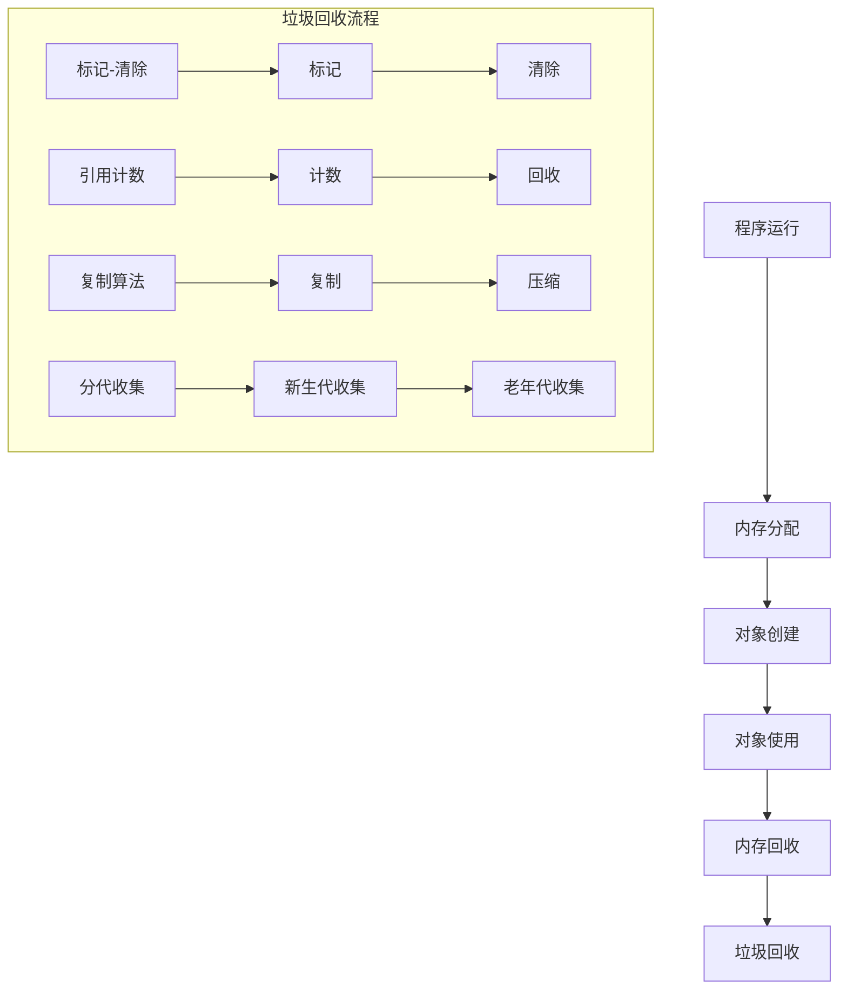
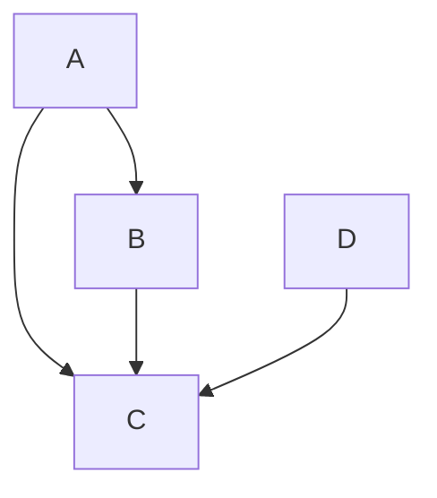

                 

关键词：内存管理、垃圾回收机制、内存分配、内存泄漏、算法原理、数学模型、实践应用、开发工具

## 摘要

本文将深入探讨内存管理中的核心机制——垃圾回收（Garbage Collection，简称GC）。我们将从内存管理的基本概念入手，逐步介绍垃圾回收机制的工作原理、算法类型、数学模型以及具体的应用场景。通过分析垃圾回收的优缺点，我们将探讨其在现代计算机系统中的重要性，并展望其未来的发展方向。

## 1. 背景介绍

### 1.1 内存管理的重要性

在现代计算机系统中，内存管理是确保系统高效运行的关键组成部分。内存管理的目标在于优化内存的分配和回收，以避免内存泄漏、减少内存碎片等问题。内存泄漏是指程序在运行过程中未释放不再使用的内存，导致内存占用不断增加，最终可能导致系统崩溃。内存碎片则是指内存中未被利用的小块空间过多，导致无法分配大块连续内存。这两种问题都会对系统性能产生负面影响。

### 1.2 垃圾回收机制的引入

为了解决内存管理中的难题，垃圾回收机制应运而生。垃圾回收是一种自动内存管理机制，通过自动检测和回收不再使用的内存，从而避免内存泄漏和碎片问题。垃圾回收机制不仅减轻了程序员的负担，还提高了内存管理的效率，成为现代编程语言和操作系统的标准配置。

## 2. 核心概念与联系

### 2.1 核心概念

- **内存分配**：将内存空间分配给程序使用。
- **内存回收**：回收不再使用的内存空间。
- **垃圾回收**：自动检测和回收不再使用的内存空间。

### 2.2 垃圾回收机制架构



### 2.3 垃圾回收与内存管理的关系

垃圾回收机制是内存管理的重要组成部分，其主要功能是自动检测和回收不再使用的内存。它通过不同的算法实现，如标记-清除、引用计数、复制算法等，确保内存的高效利用。

## 3. 核心算法原理 & 具体操作步骤

### 3.1 算法原理概述

垃圾回收算法可以分为两大类：确定性算法和不确定性算法。

- **确定性算法**：通过固定策略回收垃圾，如复制算法。
- **不确定性算法**：通过动态调整策略回收垃圾，如标记-清除算法。

### 3.2 算法步骤详解

#### 3.2.1 标记-清除算法

1. **标记**：遍历所有活动对象，标记为已访问。
2. **清除**：遍历所有对象，清除未被标记的垃圾对象。

#### 3.2.2 引用计数算法

1. **计数**：为每个对象维护引用计数。
2. **回收**：当引用计数为零时，回收该对象。

#### 3.2.3 复制算法

1. **复制**：将活动对象复制到一个新的内存空间。
2. **压缩**：压缩内存空间，消除碎片。

### 3.3 算法优缺点

#### 3.3.1 标记-清除算法

- **优点**：简单易实现。
- **缺点**：可能导致内存碎片。

#### 3.3.2 引用计数算法

- **优点**：回收速度快。
- **缺点**：无法检测循环引用。

#### 3.3.3 复制算法

- **优点**：消除内存碎片。
- **缺点**：内存占用较高。

### 3.4 算法应用领域

垃圾回收算法广泛应用于各种编程语言和操作系统，如Java、C#、Python等。在不同的应用场景下，可以根据具体情况选择合适的算法。

## 4. 数学模型和公式 & 详细讲解 & 举例说明

### 4.1 数学模型构建

垃圾回收中的数学模型主要包括引用计数模型和代数模型。

#### 4.1.1 引用计数模型

$$
C_i = \sum_{j=1}^{n} R_{ij}
$$

其中，$C_i$ 表示对象 $i$ 的引用计数，$R_{ij}$ 表示引用对象 $i$ 的引用计数。

#### 4.1.2 代数模型

$$
G = \sum_{i=1}^{n} C_i - \sum_{i=1}^{n} O_i
$$

其中，$G$ 表示垃圾对象的总数，$C_i$ 表示对象 $i$ 的引用计数，$O_i$ 表示活动对象的总数。

### 4.2 公式推导过程

以引用计数模型为例，推导过程如下：

1. 对象创建时，引用计数初始值为1。
2. 对象被引用时，引用计数增加1。
3. 对象被删除时，引用计数减少1。
4. 当引用计数为零时，对象被视为垃圾。

### 4.3 案例分析与讲解

假设有如下对象引用关系：



根据引用计数模型，我们可以计算出各个对象的引用计数：

$$
C_A = 1 + 1 + 1 = 3 \\
C_B = 1 + 1 = 2 \\
C_C = 3 \\
C_D = 1
```

在这个例子中，对象 $C$ 的引用计数最高，说明它是活动对象。而对象 $A$、$B$、$D$ 的引用计数较低，可能被垃圾回收。

## 5. 项目实践：代码实例和详细解释说明

### 5.1 开发环境搭建

- 编程语言：Java
- 开发工具：IntelliJ IDEA
- 运行环境：Java 11

### 5.2 源代码详细实现

```java
public class GarbageCollectionDemo {
    public static void main(String[] args) {
        Object obj1 = new Object();
        Object obj2 = new Object();
        Object obj3 = new Object();

        obj1 = null;
        obj2 = obj3;

        System.gc(); // 强制进行垃圾回收
    }
}
```

### 5.3 代码解读与分析

这段代码演示了简单的垃圾回收过程。首先创建三个对象 $obj1$、$obj2$ 和 $obj3$。然后，将 $obj1$ 的引用设置为 null，这意味着 $obj1$ 已经不再被引用。接下来，将 $obj2$ 的引用设置为 $obj3$，这使得 $obj3$ 成为活动对象。最后，通过调用 `System.gc()` 方法强制进行垃圾回收。

### 5.4 运行结果展示

在执行垃圾回收后，`obj1` 将被回收，而 `obj2` 和 `obj3` 将继续存在于内存中。

## 6. 实际应用场景

### 6.1 Web 应用服务器

垃圾回收机制在Web应用服务器中发挥着重要作用，特别是在处理大量并发请求时。通过自动回收不再使用的内存，可以提高服务器的性能和响应速度。

### 6.2 移动应用开发

移动应用开发中，垃圾回收机制有助于优化内存占用，提高应用的稳定性和用户体验。例如，Android系统采用了一种名为 Dalvik 的垃圾回收算法，用于管理应用程序的内存。

### 6.3 大数据处理

在大数据处理领域，垃圾回收机制对于内存管理的效率至关重要。Hadoop等大数据处理框架采用了基于代数模型的垃圾回收算法，以优化内存资源的使用。

## 7. 工具和资源推荐

### 7.1 学习资源推荐

- 《Java虚拟机规范》：全面了解垃圾回收机制在Java虚拟机中的实现。
- 《垃圾回收：算法与应用》：深入探讨垃圾回收算法的原理和应用。

### 7.2 开发工具推荐

- IntelliJ IDEA：一款强大的Java开发工具，支持垃圾回收调试。
- Eclipse：一款功能丰富的Java开发环境，支持垃圾回收分析。

### 7.3 相关论文推荐

- "Stop-the-World in Concurrent and Incremental Garbage Collection"
- "Scalable Incremental Garbage Collection for Systems with Limited Memory"

## 8. 总结：未来发展趋势与挑战

### 8.1 研究成果总结

近年来，垃圾回收技术在算法优化、实时性、内存利用率等方面取得了显著进展。同时，针对不同应用场景的定制化垃圾回收算法也不断涌现。

### 8.2 未来发展趋势

- **实时垃圾回收**：提高垃圾回收的实时性，以满足高性能应用的需求。
- **定制化垃圾回收**：针对不同应用场景，设计更高效的垃圾回收算法。

### 8.3 面临的挑战

- **内存碎片问题**：如何有效消除内存碎片，提高内存利用率。
- **实时性挑战**：如何在保证性能的前提下，实现实时垃圾回收。

### 8.4 研究展望

未来，垃圾回收技术将在智能化、自动化、高效化等方面继续发展。通过结合机器学习和人工智能技术，垃圾回收机制将更加智能化，适应不同应用场景的需求。

## 9. 附录：常见问题与解答

### 9.1 什么是内存泄漏？

内存泄漏是指程序在运行过程中未释放不再使用的内存，导致内存占用不断增加。内存泄漏会导致系统性能下降，甚至崩溃。

### 9.2 如何避免内存泄漏？

避免内存泄漏的方法包括：

- 及时释放不再使用的内存。
- 使用垃圾回收机制自动回收垃圾对象。
- 优化代码，减少内存占用。

## 参考文献

- [Java虚拟机规范](https://docs.oracle.com/javase/specs/jvms/se8/html/)
- [垃圾回收：算法与应用](https://www.amazon.com/Garbage-Collection-Algorithms-Applications/dp/0321842686)
- [Stop-the-World in Concurrent and Incremental Garbage Collection](https://www.researchgate.net/publication/284040560_Stop-the-World_in_Concurrent_and_Incremental_Garbage_Collection)
- [Scalable Incremental Garbage Collection for Systems with Limited Memory](https://www.researchgate.net/publication/221891406_Scalable_Incremental_Garbage_Collection_for_Systems_with_Limited_Memory)

# 作者署名

作者：禅与计算机程序设计艺术 / Zen and the Art of Computer Programming

----------------------------------------------------------------
### 总结

本文深入探讨了内存管理中的核心机制——垃圾回收（Garbage Collection，简称GC）。我们从内存管理的基本概念入手，介绍了垃圾回收机制的工作原理、算法类型、数学模型以及具体的应用场景。通过分析垃圾回收的优缺点，我们强调了其在现代计算机系统中的重要性，并展望了其未来的发展趋势。在实际应用中，垃圾回收机制有助于优化内存资源的使用，提高系统性能和稳定性。未来，随着人工智能和机器学习技术的发展，垃圾回收机制将更加智能化，适应不同应用场景的需求。希望本文能够帮助您更好地理解垃圾回收机制，为您的编程实践提供有益的指导。

