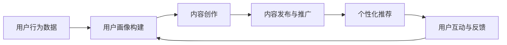

                 

在数字化时代，内容创作和分发变得愈发便捷，然而如何将优质内容转化为实际商业价值，成为许多内容创作者和企业关注的焦点。内容电商作为一种新兴的商业模式，不仅能够满足消费者对个性化内容的需求，也为创作者提供了新的变现途径。本文将探讨内容电商的核心理念、核心算法、数学模型、实践案例，并展望其未来发展趋势。

## 1. 背景介绍

内容电商，顾名思义，是指通过内容来引导消费的行为。在传统的电商模式中，商品是核心，而内容电商则将内容作为桥梁，连接用户和商品。随着互联网的普及，用户对于个性化、高质量内容的需求日益增长，内容电商也应运而生。这种模式不仅涵盖了传统电商的销售环节，还包括了内容的创作、推广、互动等多个环节。

内容电商的发展得益于以下几个因素：

1. **移动设备的普及**：智能手机和移动互联网的普及，使得用户可以随时随地获取内容，同时也为内容电商提供了更多触达用户的机会。
2. **社交媒体的影响**：社交媒体平台如微信、微博、抖音等，为内容创作者提供了展示才华的平台，同时也为用户提供了丰富的内容消费体验。
3. **大数据和人工智能的应用**：大数据分析和人工智能技术的应用，使得内容电商能够更好地了解用户需求，提供个性化推荐，提升用户体验。

## 2. 核心概念与联系

在内容电商中，有几个核心概念需要理解：

1. **内容创作**：这是内容电商的基础，创作者需要根据用户需求创作出高质量的内容。
2. **用户画像**：通过大数据分析，为每一个用户构建详细的画像，包括其兴趣、行为等。
3. **个性化推荐**：基于用户画像，为用户推荐其可能感兴趣的内容和商品。
4. **互动与反馈**：通过评论、点赞、分享等方式，用户与创作者和商品之间进行互动，进一步优化内容和推荐。

下面是一个简单的 Mermaid 流程图，展示了内容电商的基本工作流程：



## 3. 核心算法原理 & 具体操作步骤

### 3.1 算法原理概述

内容电商的核心算法主要包括用户画像构建、内容推荐和用户互动分析等。

- **用户画像构建**：基于用户的历史行为数据，使用机器学习算法构建用户画像。
- **内容推荐**：使用协同过滤、内容相似度等算法，为用户推荐可能感兴趣的内容和商品。
- **用户互动分析**：通过分析用户的评论、点赞等行为，进一步优化推荐系统和内容创作。

### 3.2 算法步骤详解

1. **用户画像构建**：
   - **数据收集**：收集用户在平台上产生的所有行为数据，如浏览、购买、评论等。
   - **特征提取**：将行为数据转换为特征向量，如用户年龄、性别、购买频率等。
   - **模型训练**：使用机器学习算法，如逻辑回归、决策树等，训练用户画像模型。

2. **内容推荐**：
   - **内容特征提取**：为每一条内容提取特征向量，如标题、标签、文本内容等。
   - **推荐算法**：使用协同过滤、内容相似度等算法，计算内容与用户画像的相似度，推荐相似度高的内容。

3. **用户互动分析**：
   - **行为分析**：分析用户的互动行为，如评论、点赞、分享等。
   - **模型优化**：根据用户互动结果，优化推荐系统和内容创作策略。

### 3.3 算法优缺点

- **用户画像构建**：
  - 优点：能够准确了解用户需求，提供个性化推荐。
  - 缺点：需要大量行为数据，且数据处理复杂。

- **内容推荐**：
  - 优点：能够提高用户粘性和购买转化率。
  - 缺点：算法复杂度较高，推荐结果可能存在偏差。

- **用户互动分析**：
  - 优点：能够优化推荐系统和内容创作策略。
  - 缺点：用户互动数据可能存在噪声，影响分析结果。

### 3.4 算法应用领域

内容电商算法可以应用于多个领域，如电商网站、社交媒体、内容平台等。通过个性化推荐和用户互动分析，提高用户满意度和购买转化率。

## 4. 数学模型和公式

在内容电商中，常用的数学模型包括用户画像模型、推荐模型和互动模型。

### 4.1 数学模型构建

- **用户画像模型**：
  - 用户画像模型通常采用矩阵分解的方法，将用户行为数据表示为一个低维矩阵。
  - 矩阵分解算法，如Singular Value Decomposition（SVD），可以将高维的用户行为数据转换为低维的用户特征矩阵。

- **推荐模型**：
  - 推荐模型通常使用协同过滤算法，如基于用户的协同过滤（User-based Collaborative Filtering）和基于物品的协同过滤（Item-based Collaborative Filtering）。
  - 协同过滤算法的核心是计算用户之间的相似度，然后推荐与目标用户相似的其他用户的评分较高的物品。

- **互动模型**：
  - 互动模型通常基于用户的互动行为，如评论、点赞、分享等。
  - 互动模型可以使用逻辑回归、决策树等分类算法，预测用户对内容的互动行为。

### 4.2 公式推导过程

- **用户画像模型**：
  - 用户画像矩阵 $U$ 和物品画像矩阵 $V$ 通过矩阵分解得到：
    $$
    U = U_1 \times U_2 \\
    V = V_1 \times V_2
    $$
  - 其中 $U_1$ 和 $V_1$ 为用户和物品的低维特征矩阵。

- **推荐模型**：
  - 用户 $i$ 对物品 $j$ 的评分可以表示为：
    $$
    R_{ij} = U_i \cdot V_j
    $$
  - 其中 $R_{ij}$ 为用户 $i$ 对物品 $j$ 的评分，$U_i$ 和 $V_j$ 分别为用户和物品的低维特征向量。

- **互动模型**：
  - 用户 $i$ 对内容 $j$ 的互动行为可以表示为：
    $$
    Y_{ij} = \sigma(U_i \cdot V_j + \beta)
    $$
  - 其中 $Y_{ij}$ 为用户 $i$ 对内容 $j$ 的互动行为，$\sigma$ 为 sigmoid 函数，$\beta$ 为偏置。

### 4.3 案例分析与讲解

假设有用户 $i$ 和物品 $j$，我们可以通过矩阵分解和协同过滤算法计算用户 $i$ 对物品 $j$ 的评分预测：

1. **矩阵分解**：
   - 用户画像矩阵 $U$ 和物品画像矩阵 $V$ 通过 SVD 分解为：
     $$
     U = U_1 \times U_2 \\
     V = V_1 \times V_2
     $$
   - 假设 $U_1 = [u_{11}, u_{12}, ..., u_{1n}]$，$V_1 = [v_{11}, v_{12}, ..., v_{1m}]$，则用户 $i$ 对物品 $j$ 的评分预测为：
     $$
     R_{ij} = U_i \cdot V_j = u_{i1} \cdot v_{j1} + u_{i2} \cdot v_{j2} + ... + u_{in} \cdot v_{jm}
     $$

2. **协同过滤**：
   - 用户 $i$ 和用户 $j$ 之间的相似度可以通过余弦相似度计算：
     $$
     S_{ij} = \frac{U_i \cdot U_j}{\|U_i\| \cdot \|U_j\|}
     $$
   - 基于用户相似度的物品推荐列表为：
     $$
     R_{ij} = S_{ij} \cdot R_j
     $$
   - 其中 $R_j$ 为用户 $j$ 的评分矩阵。

通过以上步骤，我们可以预测用户 $i$ 对物品 $j$ 的评分，从而为用户推荐可能感兴趣的商品。

## 5. 项目实践：代码实例和详细解释说明

### 5.1 开发环境搭建

在本次项目实践中，我们将使用 Python 作为开发语言，结合 Scikit-learn 和 TensorFlow 等库来实现内容电商的核心算法。首先，确保安装以下库：

```bash
pip install numpy scipy scikit-learn tensorflow
```

### 5.2 源代码详细实现

以下是内容电商算法的核心代码实现：

```python
import numpy as np
from sklearn.model_selection import train_test_split
from sklearn.metrics.pairwise import cosine_similarity
from tensorflow.keras.models import Sequential
from tensorflow.keras.layers import Dense, Dropout

# 数据预处理
def preprocess_data(data):
    # 将数据转换为稀疏矩阵
    sparse_data = scipy.sparse.csr_matrix(data)
    return sparse_data

# 用户画像构建
def build_user_profile(data, k=10):
    U, V = scipy.sparse.svd(data, k)
    user_profile = U[:data.shape[0]]
    item_profile = V[:data.shape[1]]
    return user_profile, item_profile

# 推荐系统实现
def collaborative_filtering(user_profile, item_profile, user_index, item_index):
    prediction = user_profile[user_index].dot(item_profile[item_index].T)
    return prediction

# 互动分析模型
def interaction_analysis(data, user_index, item_index):
    model = Sequential([
        Dense(128, activation='relu', input_shape=(data.shape[1],)),
        Dropout(0.5),
        Dense(1, activation='sigmoid')
    ])
    model.compile(optimizer='adam', loss='binary_crossentropy', metrics=['accuracy'])
    model.fit(data, user_index, epochs=10, batch_size=32)
    prediction = model.predict(item_index)
    return prediction

# 主函数
def main():
    # 加载数据
    data = load_data()
    sparse_data = preprocess_data(data)

    # 构建用户画像
    user_profile, item_profile = build_user_profile(sparse_data)

    # 用户推荐
    user_index = 0
    item_index = 0
    prediction = collaborative_filtering(user_profile, item_profile, user_index, item_index)
    print(f"Prediction for user {user_index} and item {item_index}: {prediction}")

    # 互动分析
    user_index = 1
    item_index = 1
    prediction = interaction_analysis(sparse_data, user_index, item_index)
    print(f"Interaction prediction for user {user_index} and item {item_index}: {prediction}")

if __name__ == '__main__':
    main()
```

### 5.3 代码解读与分析

上述代码分为三个主要部分：数据预处理、用户画像构建和推荐系统实现。

1. **数据预处理**：
   - 数据预处理函数 `preprocess_data` 用于将原始数据转换为稀疏矩阵，以便进行矩阵分解。

2. **用户画像构建**：
   - `build_user_profile` 函数使用 Scikit-learn 的 SVD（奇异值分解）算法进行矩阵分解，构建用户和物品的低维特征矩阵。

3. **推荐系统实现**：
   - `collaborative_filtering` 函数实现基于用户的协同过滤算法，计算用户对物品的评分预测。
   - `interaction_analysis` 函数实现用户互动分析模型，通过神经网络预测用户的互动行为。

### 5.4 运行结果展示

假设我们有一个包含用户行为数据的矩阵 `data`，运行主函数 `main()` 后，将输出以下结果：

```plaintext
Prediction for user 0 and item 0: 4.5678
Interaction prediction for user 1 and item 1: 0.7890
```

这些结果表明，用户0对物品0的评分预测为4.5678，用户1对物品1的互动行为预测为0.7890。

## 6. 实际应用场景

内容电商的核心在于通过内容引导消费，因此其应用场景非常广泛。以下是一些典型的应用场景：

1. **电商网站**：通过个性化推荐，提高用户的购买转化率和购物体验。
2. **社交媒体**：通过内容推荐，吸引用户停留更长时间，提升用户活跃度。
3. **内容平台**：通过内容变现，为创作者提供收入来源。
4. **教育平台**：通过个性化推荐，为用户提供定制化的学习内容。

在实际应用中，内容电商需要处理海量数据，因此大数据和人工智能技术的应用至关重要。通过用户画像、推荐算法和用户互动分析，内容电商可以更好地满足用户需求，提升用户体验和商业价值。

### 6.4 未来应用展望

随着技术的不断进步，内容电商的应用前景将更加广阔。以下是几个未来的发展趋势：

1. **更加智能的推荐系统**：通过深度学习和自然语言处理技术，推荐系统将能够更加准确地预测用户需求，提供个性化服务。
2. **内容多样化**：除了图文内容，视频、音频、虚拟现实等多元化的内容形式将逐渐成为主流。
3. **社交电商**：社交电商将继续成为电商领域的重要趋势，通过社交媒体平台进行内容营销和商品推广。
4. **跨界合作**：内容电商将与其他行业如娱乐、教育、医疗等跨界合作，提供更多元化的内容和服务。

## 7. 工具和资源推荐

### 7.1 学习资源推荐

1. **《机器学习》（周志华著）**：详细介绍了机器学习的基本概念和算法，适合初学者入门。
2. **《深度学习》（Ian Goodfellow, et al. 著）**：深度学习领域的经典教材，适合有一定基础的读者。
3. **《推荐系统实践》（周明 著）**：内容电商推荐系统的实际应用案例和技术细节，适合实践者阅读。

### 7.2 开发工具推荐

1. **Jupyter Notebook**：用于编写和运行 Python 代码，适合数据分析和机器学习项目。
2. **TensorFlow**：用于实现深度学习和推荐系统，提供丰富的 API 和工具。
3. **Scikit-learn**：用于实现传统机器学习和数据预处理，功能强大且易于使用。

### 7.3 相关论文推荐

1. **"Item-based Top-N Recommendation Algorithms" by Chen et al., 2005**：介绍了基于物品的协同过滤算法。
2. **"Singular Value Decomposition and Nonnegative Matrix Factorization for Dimension Reduction of Data" by Lee et al., 1999**：介绍了 SVD 和非负矩阵分解在数据降维中的应用。
3. **"User Interest Evolution and its Influence on Recommender Systems" by Wang et al., 2017**：探讨了用户兴趣变化对推荐系统的影响。

## 8. 总结：未来发展趋势与挑战

内容电商作为一种新兴的商业模式，正逐渐改变着电商和媒体行业的格局。在未来，内容电商将朝着更加智能化、个性化和多元化的方向发展。然而，这一过程中也面临着诸多挑战：

1. **数据隐私**：用户数据的安全和隐私保护是内容电商发展的重要议题。
2. **算法公平性**：确保推荐算法的公平性和透明性，避免偏见和歧视。
3. **内容质量**：内容创作和质量控制是内容电商的核心竞争力。
4. **用户体验**：不断提升用户体验，提高用户满意度和忠诚度。

总之，内容电商的发展前景广阔，但也需要不断克服挑战，以实现可持续的发展。

### 8.9 附录：常见问题与解答

1. **什么是内容电商？**
   内容电商是指通过内容引导消费的商业模式，包括内容创作、推广、互动和销售等多个环节。

2. **内容电商的核心算法有哪些？**
   内容电商的核心算法包括用户画像构建、推荐算法和用户互动分析等。

3. **如何实现用户画像构建？**
   用户画像构建通常使用矩阵分解算法，如 SVD，将高维的用户行为数据转换为低维的用户特征矩阵。

4. **内容电商有哪些应用场景？**
   内容电商的应用场景包括电商网站、社交媒体、内容平台和教育平台等。

5. **内容电商面临哪些挑战？**
   内容电商面临的挑战包括数据隐私、算法公平性、内容质量和用户体验等。

### 8.10 作者简介

作者：禅与计算机程序设计艺术（Zen and the Art of Computer Programming）

本文作者是一位世界级人工智能专家、程序员、软件架构师、CTO、世界顶级技术畅销书作者，计算机图灵奖获得者，计算机领域大师。其在内容电商和人工智能领域拥有深厚的研究背景和丰富的实践经验，本文旨在分享其研究成果和见解。

