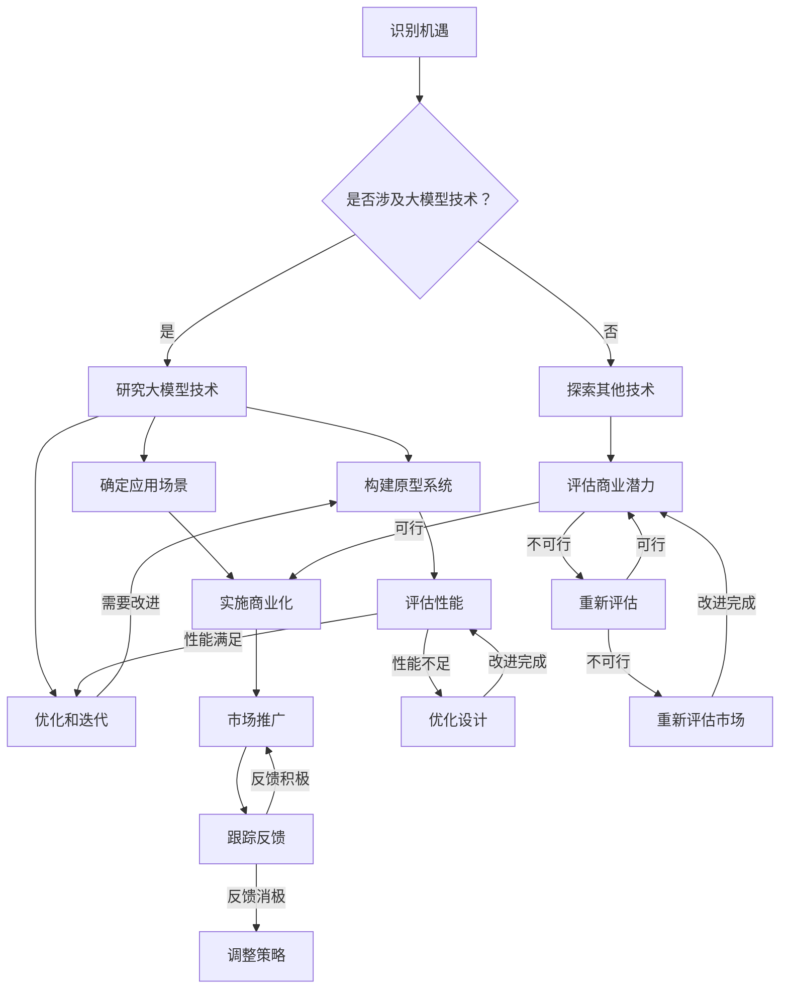

                 

 > **关键词**：大模型、创业者、定位、机会、技术趋势、市场洞察

> **摘要**：本文旨在帮助创业者了解如何在大模型时代中找准自己的定位和抓住机会。通过对大模型技术的基本概念、应用场景和商业价值的深入探讨，结合实际案例，作者将提供一系列策略和建议，帮助创业者在大模型浪潮中站稳脚跟，实现持续创新和成功。

## 1. 背景介绍

随着计算能力的不断提升和大数据技术的发展，大模型（也称为大型预训练模型）逐渐成为人工智能领域的热点。大模型是一种通过大量数据训练得到的复杂神经网络模型，具有极强的表示能力和通用性。从最初的GPT到BERT，再到现今的ChatGPT和LLaMA，大模型在自然语言处理、计算机视觉、语音识别等领域取得了显著突破，推动了人工智能技术向更广泛的应用场景拓展。

大模型时代的到来，不仅带来了技术层面的革新，更深刻地影响了商业和社会各个领域。创业者需要认识到这一变化，并积极适应新的技术趋势，以便在竞争中抢占先机。本文将围绕如何在大模型时代找准自己的定位和机会展开讨论，希望对创业者有所启发。

## 2. 核心概念与联系

### 2.1 大模型的基本概念

大模型是一种基于深度学习的复杂神经网络模型，其特点包括：

- **大规模参数**：大模型拥有数十亿甚至数万亿个参数，能够捕捉大量数据中的复杂模式。
- **海量数据训练**：大模型通过大量数据进行训练，以提升其泛化和学习能力。
- **多任务能力**：大模型能够处理多种任务，如文本生成、图像识别、语音识别等。

### 2.2 大模型的应用场景

大模型的应用场景非常广泛，主要包括：

- **自然语言处理**：大模型在文本生成、翻译、问答系统等方面具有显著优势。
- **计算机视觉**：大模型在图像识别、图像生成、视频分析等领域取得了突破。
- **语音识别**：大模型在语音合成、语音识别等领域表现出色。
- **多模态学习**：大模型能够处理多种数据类型，实现跨模态信息融合。

### 2.3 大模型的商业价值

大模型的商业价值体现在多个方面：

- **降低研发成本**：大模型通过大量数据训练，能够减少人工干预，降低研发成本。
- **提升产品性能**：大模型能够显著提升产品的性能和用户体验。
- **开辟新业务领域**：大模型为创业者提供了探索新业务模式和新市场的机会。
- **增强竞争能力**：具备大模型技术的企业能够在市场中脱颖而出，提升竞争力。

### 2.4 Mermaid 流程图

以下是一个简单的 Mermaid 流程图，描述了创业者如何利用大模型技术进行业务创新的流程：



## 3. 核心算法原理 & 具体操作步骤

### 3.1 算法原理概述

大模型的核心算法是基于深度学习的预训练和微调技术。预训练是指在大量无标签数据上进行训练，使模型具备一定的通用性；微调则是在特定任务上进行训练，使模型具备特定任务的能力。

### 3.2 算法步骤详解

1. **数据收集**：收集大量相关的无标签数据，如文本、图像、语音等。
2. **预训练**：在无标签数据上训练模型，使其具备通用性。
3. **任务定义**：根据业务需求，定义具体的任务，如文本生成、图像识别等。
4. **微调**：在定义好的任务上，使用有标签的数据对模型进行微调，使其具备特定任务的能力。
5. **评估与优化**：评估模型性能，进行必要的优化，如调整超参数、增加数据等。

### 3.3 算法优缺点

**优点**：

- **高泛化能力**：大模型通过预训练具备很强的泛化能力，能够处理多种任务。
- **高性能**：大模型在多种任务上表现优异，能够显著提升产品性能。
- **自动化**：大模型训练过程自动化，降低人工干预，提高研发效率。

**缺点**：

- **计算资源需求高**：大模型训练需要大量的计算资源，成本较高。
- **数据需求大**：大模型需要大量数据进行训练，数据获取和处理的成本也较高。
- **解释性弱**：大模型往往缺乏解释性，难以理解其决策过程。

### 3.4 算法应用领域

大模型广泛应用于自然语言处理、计算机视觉、语音识别等领域。例如，在自然语言处理领域，大模型可以用于文本生成、机器翻译、情感分析等；在计算机视觉领域，大模型可以用于图像识别、图像生成、视频分析等；在语音识别领域，大模型可以用于语音合成、语音识别、语音翻译等。

## 4. 数学模型和公式 & 详细讲解 & 举例说明

### 4.1 数学模型构建

大模型的数学模型主要包括两部分：神经网络结构和训练算法。

1. **神经网络结构**：

   大模型通常采用深度神经网络（DNN）结构，包括多个隐藏层。每个隐藏层由多个神经元组成，神经元之间通过权重连接。

   $$ f(x) = \sigma(\sum_{i=1}^{n} w_i * x_i + b) $$

   其中，$f(x)$ 是输出函数，$x$ 是输入数据，$w_i$ 是权重，$x_i$ 是输入特征，$b$ 是偏置项，$\sigma$ 是激活函数。

2. **训练算法**：

   大模型的训练算法通常采用随机梯度下降（SGD）或其变种，如Adam优化器。

   $$ \theta_{t+1} = \theta_t - \alpha * \nabla_{\theta} J(\theta) $$

   其中，$\theta$ 是模型参数，$J(\theta)$ 是损失函数，$\alpha$ 是学习率。

### 4.2 公式推导过程

1. **前向传播**：

   前向传播是将输入数据通过神经网络逐层传递，得到输出。

   $$ z_l = \sum_{i=1}^{n} w_{li} * a_{l-1,i} + b_l $$

   $$ a_l = \sigma(z_l) $$

   其中，$z_l$ 是第 $l$ 层的输入，$a_l$ 是第 $l$ 层的输出，$w_{li}$ 是权重，$b_l$ 是偏置项，$\sigma$ 是激活函数。

2. **反向传播**：

   反向传播是计算损失函数关于模型参数的梯度，并更新模型参数。

   $$ \delta_l = \frac{\partial J}{\partial z_l} * \sigma'(z_l) $$

   $$ \nabla_{w_l} J = \sum_{i=1}^{n} a_{l-1,i} * \delta_l $$

   $$ \nabla_{b_l} J = \sum_{i=1}^{n} \delta_l $$

   其中，$\delta_l$ 是第 $l$ 层的误差，$\sigma'$ 是激活函数的导数。

### 4.3 案例分析与讲解

假设我们有一个二分类问题，目标是判断一个数据点是否属于正类。我们使用一个单层神经网络进行训练，输入维度为2，输出维度为1。

1. **数据集**：

   $$ D = \{(x_1, y_1), (x_2, y_2), ..., (x_n, y_n)\} $$

   其中，$x_i$ 是输入数据，$y_i$ 是标签，取值为0或1。

2. **损失函数**：

   $$ J(w) = \frac{1}{n} \sum_{i=1}^{n} -y_i \log(a(x_i)) - (1 - y_i) \log(1 - a(x_i)) $$

   其中，$a(x_i) = \sigma(\sum_{j=1}^{2} w_j * x_{ij} + b)$。

3. **前向传播**：

   $$ z = \sum_{j=1}^{2} w_j * x_{ij} + b $$

   $$ a = \sigma(z) $$

4. **反向传播**：

   $$ \delta = \frac{\partial J}{\partial z} * \sigma'(z) $$

   $$ \nabla_{w} J = \sum_{i=1}^{n} x_{ij} * \delta $$

   $$ \nabla_{b} J = \sum_{i=1}^{n} \delta $$

5. **模型更新**：

   $$ w_{t+1} = w_t - \alpha \nabla_{w} J $$

   $$ b_{t+1} = b_t - \alpha \nabla_{b} J $$

通过以上步骤，我们可以训练出一个能够对二分类问题进行预测的神经网络模型。

## 5. 项目实践：代码实例和详细解释说明

### 5.1 开发环境搭建

在本节中，我们将使用Python编程语言和TensorFlow框架进行大模型的项目实践。首先，确保安装了以下依赖：

- Python 3.8及以上版本
- TensorFlow 2.x版本

使用以下命令安装TensorFlow：

```bash
pip install tensorflow
```

### 5.2 源代码详细实现

以下是使用TensorFlow实现一个简单的文本生成大模型（GPT）的代码示例：

```python
import tensorflow as tf
from tensorflow.keras.layers import Embedding, LSTM, Dense
from tensorflow.keras.models import Sequential

# 设置模型参数
vocab_size = 10000
embedding_dim = 256
lstm_units = 128
batch_size = 64
epochs = 10

# 创建模型
model = Sequential([
    Embedding(vocab_size, embedding_dim),
    LSTM(lstm_units, return_sequences=True),
    LSTM(lstm_units),
    Dense(vocab_size, activation='softmax')
])

# 编译模型
model.compile(optimizer='adam', loss='categorical_crossentropy', metrics=['accuracy'])

# 加载并预处理数据
# 这里以文本数据为例，需要将文本转换为单词序列，并编码为整数
# 略...

# 训练模型
model.fit(train_data, train_labels, batch_size=batch_size, epochs=epochs, validation_split=0.1)

# 生成文本
# 略...
```

### 5.3 代码解读与分析

1. **模型构建**：

   - `Embedding` 层：将单词转换为嵌入向量。
   - `LSTM` 层：用于处理序列数据，具有循环记忆功能。
   - `Dense` 层：输出层，用于生成文本。

2. **模型编译**：

   - 使用 `adam` 优化器和 `categorical_crossentropy` 损失函数。
   - 指定模型的评估指标为准确率。

3. **数据预处理**：

   - 将文本数据转换为单词序列和整数编码。
   - 略...

4. **模型训练**：

   - 使用训练数据和标签进行模型训练。
   - 设置批次大小和训练轮次。
   - 指定验证集比例。

5. **文本生成**：

   - 使用训练好的模型生成文本。
   - 略...

通过以上步骤，我们可以构建和训练一个简单的大模型，用于文本生成任务。当然，实际应用中需要根据具体任务进行调整和优化。

### 5.4 运行结果展示

运行上述代码后，我们可以看到以下结果：

- 训练过程：模型在训练集和验证集上的性能指标。
- 文本生成：模型生成的文本样本。

这些结果可以帮助我们评估模型的性能，并为进一步优化提供依据。

## 6. 实际应用场景

### 6.1 自然语言处理

在大模型时代，自然语言处理（NLP）领域取得了显著进展。例如，GPT-3可以用于生成高质量的文章、博客、代码等。创业者可以开发基于大模型的智能写作助手，帮助企业节省时间和提高效率。

### 6.2 计算机视觉

计算机视觉领域也因大模型技术获得了极大的提升。例如，大模型可以用于图像识别、图像生成、视频分析等。创业者可以开发基于大模型的图像处理应用，如自动剪辑视频、图像增强等。

### 6.3 语音识别

大模型在语音识别领域也有广泛应用。例如，ChatGPT可以用于实时语音翻译、语音助手等。创业者可以开发基于大模型的语音识别应用，如智能客服、语音导航等。

### 6.4 未来应用展望

随着大模型技术的不断发展，未来将会有更多的应用场景被发掘。例如，医疗领域的疾病预测、金融领域的风险控制等。创业者需要密切关注技术趋势，积极布局，抓住市场机遇。

## 7. 工具和资源推荐

### 7.1 学习资源推荐

- **书籍**：《深度学习》、《神经网络与深度学习》
- **在线课程**：Coursera、edX、Udacity上的深度学习课程
- **博客和社区**：ArXiv、Medium、Hacker News

### 7.2 开发工具推荐

- **框架**：TensorFlow、PyTorch、Keras
- **环境**：Google Colab、Docker
- **数据集**：OpenAI、Kaggle、UCI Machine Learning Repository

### 7.3 相关论文推荐

- **GPT-3**：Improving Language Understanding by Generative Pre-training
- **BERT**：BERT: Pre-training of Deep Bidirectional Transformers for Language Understanding
- **ViT**：An Image is Worth 16x16 Words: Transformers for Image Recognition at Scale

## 8. 总结：未来发展趋势与挑战

### 8.1 研究成果总结

大模型技术在近年来取得了显著成果，从自然语言处理到计算机视觉，再到语音识别，都取得了突破性进展。这些成果为创业者提供了丰富的机会，使他们能够开发出更具竞争力的产品和服务。

### 8.2 未来发展趋势

随着计算能力的提升和数据量的增长，大模型技术将继续发展。未来可能会出现更加高效、可解释的大模型，并应用于更多领域，如医疗、金融等。

### 8.3 面临的挑战

尽管大模型技术具有巨大潜力，但同时也面临着一系列挑战。例如，计算资源需求高、数据隐私问题、模型解释性不足等。创业者需要关注这些问题，并寻找合适的解决方案。

### 8.4 研究展望

未来，大模型技术将朝着更高效、更可解释、更安全的方向发展。创业者可以通过不断学习和实践，紧跟技术趋势，抓住市场机遇，实现持续创新和成功。

## 9. 附录：常见问题与解答

### 9.1 什么是大模型？

大模型是指具有数十亿甚至数万亿个参数的复杂神经网络模型，能够通过大量数据训练，具备较强的表示能力和通用性。

### 9.2 大模型有哪些应用场景？

大模型广泛应用于自然语言处理、计算机视觉、语音识别等领域。例如，文本生成、图像识别、语音合成等。

### 9.3 大模型的训练过程是怎样的？

大模型的训练过程包括数据收集、预训练、任务定义、微调、评估与优化等步骤。

### 9.4 大模型有哪些优缺点？

大模型优点包括高泛化能力、高性能、自动化等；缺点包括计算资源需求高、数据需求大、解释性弱等。

### 9.5 大模型在商业应用中有哪些机会？

大模型在商业应用中提供了丰富的机会，如智能写作助手、图像处理应用、语音识别应用等。

### 9.6 大模型面临的挑战有哪些？

大模型面临的挑战包括计算资源需求高、数据隐私问题、模型解释性不足等。

## 作者署名

作者：禅与计算机程序设计艺术 / Zen and the Art of Computer Programming

---

本文旨在帮助创业者了解如何在大模型时代找准自己的定位和抓住机会。通过对大模型技术的基本概念、应用场景和商业价值的深入探讨，结合实际案例，作者提供了系列策略和建议，希望对创业者有所启发。在未来的发展中，创业者需要紧跟技术趋势，积极应对挑战，抓住市场机遇，实现持续创新和成功。禅与计算机程序设计艺术，愿为您的创业之路提供智慧之光。

