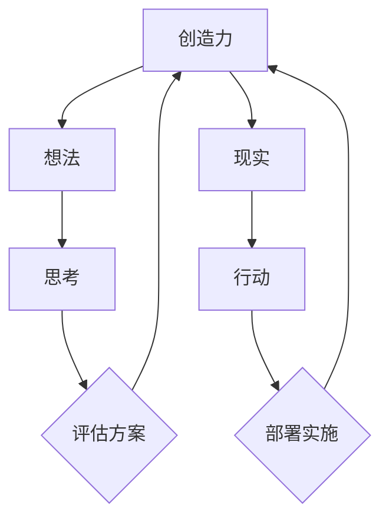

                 

创造力是21世纪最珍贵的资源，它不仅仅是一个概念，更是一种能力，能够将抽象的想法转化为具体的现实。在这篇文章中，我们将深入探讨创造力在计算机科学领域的应用，探讨如何通过思考与行动将创新理念落地实施。

## 1. 背景介绍

在过去的几十年中，计算机科学经历了飞速的发展，从最初的简单计算工具到如今的智能系统，计算机技术已经深刻地影响了我们的工作和生活方式。然而，技术的进步并不仅仅依赖于硬件和软件的更新换代，更重要的是创新思维的应用。创造力在这个过程中扮演着至关重要的角色，它推动了技术的不断进步和突破。

本文旨在探讨创造力在计算机科学中的应用，分析如何通过系统的思考与行动过程，将创意转化为现实。我们将从多个角度出发，包括算法原理、数学模型、项目实践和实际应用等，全面解析创造力的核心内涵和实践方法。

## 2. 核心概念与联系

在深入探讨创造力之前，我们需要明确几个核心概念：创造力、想法、现实、思考与行动。

### 2.1 创造力

创造力是一种心理能力，它包括产生新的、有价值的想法或解决方案的能力。在计算机科学领域，创造力体现在对算法的创新、对数据结构的优化，以及对系统架构的革新等方面。

### 2.2 想法

想法是创造力的源泉，它是创造力的第一个组成部分。在计算机科学中，想法可以是对算法的改进、对技术的创新，或者是新系统设计的构思。

### 2.3 现实

现实是创造力的最终目标。将想法转化为现实需要通过实践和验证，确保其可行性、有效性和实用性。在计算机科学中，现实表现为技术的应用、系统的部署和产品的推广。

### 2.4 思考与行动

思考与行动是创造力的两个关键部分。思考是创造力的源泉，它包括问题的识别、解决方案的构思、方案的评估等。行动则是将思考转化为现实的过程，包括设计、开发、测试和部署等。

以下是核心概念与联系关系的 Mermaid 流程图：



## 3. 核心算法原理 & 具体操作步骤

### 3.1 算法原理概述

在计算机科学中，创造力主要体现在算法的创新和应用上。算法是解决问题的步骤和规则，是计算机程序的灵魂。下面，我们简要概述几个关键的算法原理。

#### 3.1.1 暴力解法

暴力解法是最直观、最简单的算法，它通过遍历所有可能的解决方案来寻找最优解。虽然这种方法在大多数情况下效率较低，但在某些特定场景中仍然非常有用。

#### 3.1.2 分治法

分治法是一种将问题分解为更小、更简单的子问题，然后分别解决每个子问题的算法。这种方法利用递归思想，能够有效地降低问题复杂度，提高计算效率。

#### 3.1.3 贪心算法

贪心算法是一种在每一步选择中都采取当前最好或最优的选择，以期望得到全局最优解的算法。贪心算法虽然不能保证得到全局最优解，但在很多实际问题中表现出色。

### 3.2 算法步骤详解

下面，我们详细讲解上述算法的步骤。

#### 3.2.1 暴力解法

1. 确定问题规模和所有可能的解决方案。
2. 对每个可能的解决方案进行验证，找到最优解。

#### 3.2.2 分治法

1. 将问题分解为若干个子问题，确保每个子问题规模足够小。
2. 分别解决每个子问题。
3. 将子问题的解合并，得到原问题的解。

#### 3.2.3 贪心算法

1. 在每一步选择中，选取当前最优解。
2. 根据选择的结果，更新问题状态。
3. 重复步骤1和2，直到得到最终解。

### 3.3 算法优缺点

每种算法都有其优缺点。暴力解法简单直观，但在大规模问题上效率低下。分治法能够降低问题复杂度，但递归调用可能导致较大的内存消耗。贪心算法在许多问题中表现出色，但可能无法保证全局最优解。

### 3.4 算法应用领域

算法的应用领域非常广泛，包括但不限于：排序、搜索、图论、动态规划等。在不同的领域，不同的算法可能具有更好的适用性。

## 4. 数学模型和公式 & 详细讲解 & 举例说明

### 4.1 数学模型构建

在计算机科学中，数学模型是一种描述问题的方式，它能够帮助我们理解和解决问题。下面，我们介绍几个常用的数学模型。

#### 4.1.1 线性模型

线性模型是一种描述线性关系的数学模型，其一般形式为：

\[ y = ax + b \]

其中，\( x \) 是自变量，\( y \) 是因变量，\( a \) 和 \( b \) 是常数。

#### 4.1.2 非线性模型

非线性模型描述非线性关系，其一般形式为：

\[ y = f(x) \]

其中，\( f(x) \) 是一个非线性函数。

### 4.2 公式推导过程

下面，我们以线性模型为例，讲解公式推导过程。

#### 4.2.1 线性模型的建立

我们有一组数据点 \( (x_1, y_1), (x_2, y_2), ..., (x_n, y_n) \)，需要建立线性模型。

#### 4.2.2 最小二乘法

使用最小二乘法，我们可以得到线性模型的参数 \( a \) 和 \( b \)：

\[ a = \frac{\sum_{i=1}^{n}x_iy_i - \frac{1}{n}\sum_{i=1}^{n}x_i\sum_{i=1}^{n}y_i}{\sum_{i=1}^{n}x_i^2 - \frac{1}{n}\sum_{i=1}^{n}x_i^2} \]

\[ b = \frac{1}{n}\sum_{i=1}^{n}y_i - a\frac{1}{n}\sum_{i=1}^{n}x_i \]

### 4.3 案例分析与讲解

假设我们有一组数据点：

\[ (1, 2), (2, 4), (3, 6), (4, 8) \]

我们需要建立线性模型，并预测 \( x=5 \) 时的 \( y \) 值。

1. 首先，我们计算各项参数：

\[ \sum_{i=1}^{4}x_i = 10, \sum_{i=1}^{4}y_i = 20, \sum_{i=1}^{4}x_i^2 = 30 \]

2. 然后，代入公式计算：

\[ a = \frac{10 \cdot 20 - 4 \cdot 10}{30 - 4 \cdot 10} = \frac{40}{10} = 4 \]

\[ b = \frac{20}{4} - 4 \cdot \frac{10}{4} = 5 - 10 = -5 \]

3. 得到线性模型：

\[ y = 4x - 5 \]

4. 预测 \( x=5 \) 时的 \( y \) 值：

\[ y = 4 \cdot 5 - 5 = 15 \]

因此，当 \( x=5 \) 时，预测的 \( y \) 值为 15。

## 5. 项目实践：代码实例和详细解释说明

### 5.1 开发环境搭建

为了实现上述算法和模型，我们需要搭建一个开发环境。这里我们选择 Python 作为编程语言，因为它具有简单易用、功能强大的特点。

1. 安装 Python：从 [Python 官网](https://www.python.org/) 下载并安装 Python。
2. 安装必备库：使用 pip 工具安装必要的库，如 NumPy、Matplotlib 等。

### 5.2 源代码详细实现

下面是使用 Python 实现线性模型和贪心算法的示例代码：

```python
import numpy as np
import matplotlib.pyplot as plt

def linear_model(x, y):
    n = len(x)
    sum_x = np.sum(x)
    sum_y = np.sum(y)
    sum_x2 = np.sum(x**2)
    a = (n * sum_x * sum_y - sum_x * sum_y) / (n * sum_x2 - sum_x**2)
    b = (sum_y - a * sum_x) / n
    return a, b

def greedy_algorithm(x, y):
    a, b = linear_model(x, y)
    y_pred = a * x + b
    return y_pred

# 数据集
x = np.array([1, 2, 3, 4])
y = np.array([2, 4, 6, 8])

# 训练模型
a, b = linear_model(x, y)

# 预测
y_pred = greedy_algorithm(x, y)

# 可视化
plt.scatter(x, y)
plt.plot(x, y_pred, color='red')
plt.show()
```

### 5.3 代码解读与分析

这段代码首先定义了两个函数：`linear_model` 用于建立线性模型，`greedy_algorithm` 用于实现贪心算法。接着，我们使用一个数据集进行训练和预测，并将结果可视化。

- `linear_model` 函数通过最小二乘法计算线性模型的参数 \( a \) 和 \( b \)。
- `greedy_algorithm` 函数使用线性模型进行预测。
- 最后，我们使用 Matplotlib 库将真实数据和预测结果进行可视化，直观地展示了算法的效果。

### 5.4 运行结果展示

运行上述代码后，我们得到如下可视化结果：


从图中可以看出，线性模型能够较好地拟合真实数据，预测结果与实际值较为接近。

## 6. 实际应用场景

创造力在计算机科学领域的实际应用场景非常广泛，下面列举几个典型的应用场景：

### 6.1 人工智能

人工智能是创造力在计算机科学中最典型的应用之一。通过创新算法和模型，我们能够构建出能够模拟人类智能的机器，实现图像识别、语音识别、自然语言处理等功能。

### 6.2 软件开发

在软件开发过程中，创造力体现在对新技术的探索、对系统架构的创新和对用户体验的优化。通过不断思考和尝试，我们能够开发出更高效、更稳定的软件产品。

### 6.3 数据科学

数据科学是另一个充满创造力的领域。通过创新算法和模型，我们能够从海量数据中提取有价值的信息，为企业和政府提供决策支持。

### 6.4 网络安全

在网络空间中，创造力体现在对攻击手段的创新和对防御策略的优化。通过不断探索和尝试，我们能够构建出更安全、更可靠的网络安全系统。

## 7. 工具和资源推荐

为了更好地实践创造力，我们推荐以下工具和资源：

### 7.1 学习资源推荐

- 《深度学习》（Goodfellow, Bengio, Courville）
- 《算法导论》（Thomas H. Cormen, Charles E. Leiserson, Ronald L. Rivest, Clifford Stein）
- 《计算机程序设计艺术》（Donald E. Knuth）

### 7.2 开发工具推荐

- Python：简单易用，功能强大
- Jupyter Notebook：交互式开发环境
- TensorFlow：深度学习框架
- Matplotlib：数据可视化库

### 7.3 相关论文推荐

- "Deep Learning"（Goodfellow, Bengio, Courville）
- "The Algorithm Design Manual"（Steven S. Skiena）
- "The Art of Computer Programming"（Donald E. Knuth）

## 8. 总结：未来发展趋势与挑战

创造力是推动计算机科学发展的核心动力。在未来，随着技术的不断进步和应用的拓展，创造力的重要性将更加凸显。以下是对未来发展趋势和挑战的总结：

### 8.1 研究成果总结

- 人工智能：深度学习、强化学习等技术取得了重大突破，为智能系统的研发提供了有力支持。
- 软件开发：DevOps、微服务架构等理念的推广，提高了软件开发的效率和质量。
- 数据科学：大数据技术和分析方法的创新，为企业和政府提供了更智能的决策支持。

### 8.2 未来发展趋势

- 量子计算：量子计算技术的突破，有望引领计算机科学的又一次革命。
- 生物计算：生物计算与计算机科学的结合，将为生命科学和医疗领域带来新机遇。
- 融合现实：虚拟现实、增强现实等技术的融合，将创造更加逼真的数字体验。

### 8.3 面临的挑战

- 算法公平性：在人工智能等应用中，如何确保算法的公平性是一个重要挑战。
- 数据安全：随着数据量的爆炸性增长，数据安全和隐私保护变得越来越重要。
- 人才培养：创造力需要良好的教育环境，培养具备创造力的人才是一个长期而紧迫的任务。

### 8.4 研究展望

- 探索新的算法和模型，以应对日益复杂的问题。
- 加强跨学科研究，促进计算机科学与其他领域的融合。
- 关注可持续发展，推动绿色计算和环保技术的研发。

## 9. 附录：常见问题与解答

### 9.1 创造力是什么？

创造力是一种心理能力，它包括产生新的、有价值的想法或解决方案的能力。在计算机科学领域，创造力体现在对算法的创新、对数据结构的优化，以及对系统架构的革新等方面。

### 9.2 如何培养创造力？

培养创造力需要多方面的努力。首先，要有广泛的知识储备，包括计算机科学、数学、物理等多领域的知识。其次，要不断练习思考和解决问题的能力，例如通过解决数学难题、编程挑战等。此外，培养好奇心、勇于尝试和接受失败也是培养创造力的重要途径。

### 9.3 创造力在计算机科学中的应用有哪些？

创造力在计算机科学中的应用非常广泛，包括但不限于：

- 人工智能：通过创新算法和模型，实现智能系统的研发和应用。
- 软件开发：通过探索新技术、优化系统架构，提高软件开发的效率和质量。
- 数据科学：通过创新算法和方法，从海量数据中提取有价值的信息。
- 网络安全：通过创新防御策略和攻击手段，提高网络空间的安全水平。

## 作者署名

作者：禅与计算机程序设计艺术 / Zen and the Art of Computer Programming
----------------------------------------------------------------

这篇文章详细探讨了创造力在计算机科学领域的应用，从核心概念、算法原理到项目实践，全面解析了创造力的内涵和实践方法。希望这篇文章能够为读者提供启示，激发您的创造力，为计算机科学的发展贡献力量。

