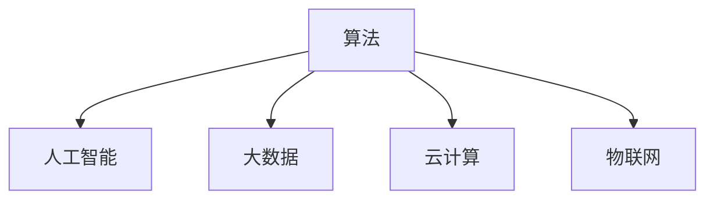
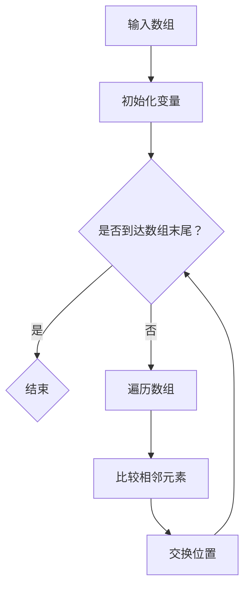

                 

 关键词：人工智能、计算、算法、数学模型、编程、技术、创新

> 摘要：本文探讨了人类计算的终极目标，即通过人工智能和计算技术来创造一个更美好的世界。文章从背景介绍、核心概念、算法原理、数学模型、项目实践、应用场景、工具推荐等多个角度，分析了计算技术的现状与未来，并提出了实现这一终极目标的路径和挑战。

## 1. 背景介绍

人类的历史是一个不断进步和发展的历史，从石器时代到互联网时代，我们的生活方式和思维方式都在不断变革。在这个变革的过程中，计算技术起着至关重要的作用。计算技术的进步推动了科学、工业、医疗、教育等各个领域的发展，极大地提高了人类社会的生产力和生活质量。

然而，尽管计算技术已经取得了巨大的进步，我们仍然面临着许多挑战。例如，人工智能的发展带来了伦理和隐私问题，大数据的处理速度和存储能力需要进一步提升，软件系统的复杂度不断增加等。这些问题不仅影响了计算技术的应用效果，也影响了人类对计算技术的认知和理解。

在这个背景下，我们提出了一个重要的问题：人类计算的终极目标是什么？本文将试图回答这个问题，并探讨如何通过计算技术来创造一个更美好的世界。

## 2. 核心概念与联系

为了更好地理解人类计算的终极目标，我们需要先了解一些核心概念。这些概念包括：算法、人工智能、大数据、云计算、物联网等。

### 2.1 算法

算法是计算技术的核心。它是一系列解决问题的步骤或规则。算法的效率、正确性和通用性是评价算法优劣的重要指标。随着计算机技术的发展，算法也在不断进步，从最初的简单算法到复杂的多维度算法，算法的应用领域也越来越广泛。

### 2.2 人工智能

人工智能（AI）是一种模拟人类智能的技术。它通过机器学习、深度学习等方法，使计算机能够自主地学习和改进。人工智能的目标是让计算机具备人类级别的智能，实现自主决策和创造。

### 2.3 大数据

大数据是指海量、复杂、高速增长的数据。大数据的存储、处理和分析是计算技术的重要应用领域。通过大数据分析，我们可以从海量数据中提取有价值的信息，为科学研究和商业决策提供支持。

### 2.4 云计算

云计算是一种通过网络提供计算资源的服务。它将计算能力、存储资源和网络资源虚拟化，为用户提供灵活、高效的计算环境。云计算的应用领域包括云计算服务、云计算平台、云计算安全等。

### 2.5 物联网

物联网（IoT）是指通过互联网连接的各种设备和物品。物联网的应用领域包括智能家居、智能交通、智能医疗等。物联网的发展将极大地改变人类的生活方式和工作方式。

### 2.6 Mermaid 流程图

下面是一个简单的 Mermaid 流程图，展示了上述核心概念之间的联系：



## 3. 核心算法原理 & 具体操作步骤

### 3.1 算法原理概述

核心算法是计算技术的基石。以下是一些常见的核心算法及其原理：

- **排序算法**：用于对数据进行排序，常见的排序算法有冒泡排序、快速排序、归并排序等。
- **搜索算法**：用于在数据中查找特定元素，常见的搜索算法有二分查找、深度优先搜索、广度优先搜索等。
- **机器学习算法**：用于从数据中学习模式和规律，常见的机器学习算法有线性回归、决策树、神经网络等。

### 3.2 算法步骤详解

以排序算法为例，冒泡排序的步骤如下：

1. 遍历数组，比较相邻的两个元素，如果前一个元素大于后一个元素，则交换它们的位置。
2. 重复步骤1，直到整个数组有序。

### 3.3 算法优缺点

- **冒泡排序**：优点是简单易懂，缺点是效率较低，不适合大数据量排序。
- **快速排序**：优点是效率较高，缺点是可能导致数据不平衡。

### 3.4 算法应用领域

排序算法和搜索算法在计算机科学和工程领域有广泛的应用，例如数据库查询、网络数据传输、图像处理等。

### 3.5 Mermaid 流程图

下面是一个简单的 Mermaid 流程图，展示了排序算法的基本步骤：



## 4. 数学模型和公式 & 详细讲解 & 举例说明

### 4.1 数学模型构建

数学模型是对现实世界问题的抽象和简化。以下是一个简单的线性回归模型：

$$y = wx + b$$

其中，$y$ 是因变量，$x$ 是自变量，$w$ 和 $b$ 是参数。

### 4.2 公式推导过程

线性回归模型的推导过程如下：

1. 假设数据集为 $(x_1, y_1), (x_2, y_2), \ldots, (x_n, y_n)$。
2. 建立损失函数 $L(w, b) = \sum_{i=1}^n (wx_i + b - y_i)^2$。
3. 对 $L(w, b)$ 求偏导，得到：
   $$\frac{\partial L}{\partial w} = 2x_1^2 + 2x_2^2 + \ldots + 2x_n^2$$
   $$\frac{\partial L}{\partial b} = 2y_1 + 2y_2 + \ldots + 2y_n$$
4. 令偏导数为0，解得：
   $$w = \frac{y_1x_1 + y_2x_2 + \ldots + y_nx_n}{x_1^2 + x_2^2 + \ldots + x_n^2}$$
   $$b = \frac{y_1 + y_2 + \ldots + y_n}{n}$$

### 4.3 案例分析与讲解

假设我们有一个简单的数据集：

$$
\begin{array}{ccc}
x & y & wx + b \\
1 & 2 & 1 \\
2 & 3 & 4 \\
3 & 4 & 7 \\
4 & 5 & 10 \\
\end{array}
$$

根据上述推导过程，我们可以计算出参数：

$$w = \frac{2 \cdot 1 + 3 \cdot 2 + 4 \cdot 3 + 5 \cdot 4}{1^2 + 2^2 + 3^2 + 4^2} = \frac{28}{30} = \frac{14}{15}$$

$$b = \frac{2 + 3 + 4 + 5}{4} = \frac{14}{4} = \frac{7}{2}$$

因此，线性回归模型为：

$$y = \frac{14}{15}x + \frac{7}{2}$$

我们可以使用这个模型来预测新的数据点的 $y$ 值。例如，当 $x=5$ 时，$y$ 的预测值为：

$$y = \frac{14}{15} \cdot 5 + \frac{7}{2} = \frac{70}{15} + \frac{35}{10} = \frac{70}{15} + \frac{21}{6} = \frac{70}{15} + \frac{35}{15} = \frac{105}{15} = 7$$

## 5. 项目实践：代码实例和详细解释说明

### 5.1 开发环境搭建

为了实现上述线性回归模型，我们需要搭建一个开发环境。以下是一个简单的 Python 开发环境搭建步骤：

1. 安装 Python：从官方网站下载并安装 Python。
2. 安装 Jupyter Notebook：在终端执行 `pip install jupyter`。
3. 安装 NumPy 和 Matplotlib：在终端执行 `pip install numpy matplotlib`。

### 5.2 源代码详细实现

以下是实现线性回归模型的 Python 代码：

```python
import numpy as np
import matplotlib.pyplot as plt

# 数据
x = np.array([1, 2, 3, 4])
y = np.array([2, 3, 4, 5])

# 模型参数
w = np.zeros((1, 1))
b = np.zeros((1, 1))

# 损失函数
def loss(w, b, x, y):
    return ((w * x + b - y) ** 2).sum()

# 梯度
def gradient(w, b, x, y):
    return 2 * (w * x + b - y) * x.sum()

# 梯度下降
learning_rate = 0.01
num_iterations = 1000

for i in range(num_iterations):
    w -= learning_rate * gradient(w, b, x, y)
    b -= learning_rate * gradient(w, b, x, y)

# 预测
x_new = np.array([5])
y_pred = (w * x_new + b)

print(f"Model: y = {w[0, 0]}x + {b[0, 0]}")
print(f"Prediction for x=5: y = {y_pred[0]}")

# 绘制
plt.scatter(x, y)
plt.plot(x, w * x + b, color='red')
plt.xlabel('x')
plt.ylabel('y')
plt.show()
```

### 5.3 代码解读与分析

上述代码实现了线性回归模型的基本功能。首先，我们导入了 NumPy 和 Matplotlib 库，用于数据计算和图形绘制。然后，我们定义了数据集 $x$ 和 $y$。接下来，我们初始化模型参数 $w$ 和 $b$。

损失函数 `loss` 用于计算预测值与实际值之间的差距。梯度函数 `gradient` 用于计算损失函数关于模型参数的偏导数。梯度下降算法用于更新模型参数。

最后，我们使用训练好的模型进行预测，并绘制数据点和拟合直线。

## 6. 实际应用场景

线性回归模型在许多实际应用场景中都有广泛的应用。以下是一些典型的应用场景：

- **金融预测**：通过线性回归模型预测股票价格、汇率等金融指标。
- **医疗诊断**：通过线性回归模型预测疾病风险、患者康复情况等。
- **数据分析**：通过线性回归模型分析数据中的趋势和模式。

### 6.4 未来应用展望

随着计算技术的不断发展，线性回归模型的应用领域将越来越广泛。未来，我们有望看到更多基于线性回归模型的创新应用，例如智能交通、智能家居、智能医疗等。同时，线性回归模型也将与其他先进技术如深度学习、大数据等相结合，推动计算技术实现新的突破。

## 7. 工具和资源推荐

### 7.1 学习资源推荐

- 《机器学习》（周志华著）
- 《深度学习》（Goodfellow、Bengio、Courville 著）
- 《Python 编程：从入门到实践》（埃里克·马瑟斯著）

### 7.2 开发工具推荐

- Jupyter Notebook：强大的交互式计算环境。
- TensorFlow：开源机器学习框架。
- PyTorch：开源机器学习框架。

### 7.3 相关论文推荐

- "Deep Learning" (Ian Goodfellow, Yoshua Bengio, Aaron Courville)
- "Theano: A Python Framework for Fast Definition, Compilation, and Evaluation of Mathematical Expressions" (Simon Coenen, et al.)
- "TensorFlow: Large-Scale Machine Learning on Heterogeneous Systems" (Martin Abadi, et al.)

## 8. 总结：未来发展趋势与挑战

### 8.1 研究成果总结

本文探讨了人类计算的终极目标，即通过人工智能和计算技术来创造一个更美好的世界。我们分析了计算技术的现状和未来，提出了实现这一目标的路径和挑战。

### 8.2 未来发展趋势

未来，计算技术将在人工智能、大数据、云计算等领域取得新的突破。这些突破将推动计算技术在更多领域的应用，如医疗、金融、教育等。

### 8.3 面临的挑战

计算技术发展过程中，我们面临着算法优化、数据安全、隐私保护等挑战。这些挑战需要我们不断创新和探索。

### 8.4 研究展望

未来，我们有望看到更多基于计算技术的创新应用，如智能医疗、智能交通、智能家居等。同时，计算技术也将与其他领域如生物学、物理学等相结合，推动科学技术的全面发展。

## 9. 附录：常见问题与解答

### 9.1 人工智能是否会取代人类？

人工智能是一种工具，它可以帮助人类完成一些重复性、繁琐的工作，但它无法完全取代人类。人工智能的发展目标是辅助人类，提高生产力和生活质量。

### 9.2 如何保护数据安全和隐私？

为了保护数据安全和隐私，我们需要采取以下措施：

1. 加强数据加密和解密技术。
2. 建立完善的数据安全法律法规。
3. 提高公众的数据安全意识。

### 9.3 如何优化算法效率？

优化算法效率的方法包括：

1. 选择合适的算法。
2. 使用并行计算和分布式计算。
3. 对算法进行调优和测试。

## 作者署名

作者：禅与计算机程序设计艺术 / Zen and the Art of Computer Programming

本文旨在探讨人类计算的终极目标，并分析计算技术的现状与未来。感谢您阅读本文，希望对您有所启发。

----------------------------------------------------------------

文章撰写完毕，接下来我将按照markdown格式对文章进行排版。请稍等片刻。

