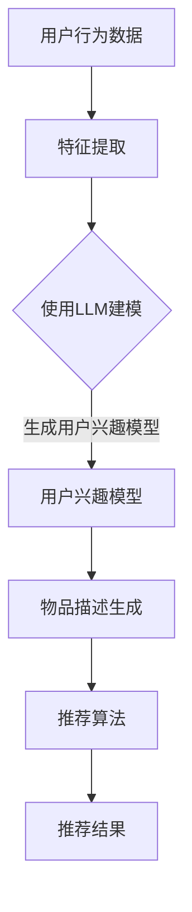

                 

关键词：推荐系统、LLM、实时个性化、算法优化、数学模型、项目实践

> 摘要：本文探讨了利用大型语言模型（LLM）优化推荐系统实时个性化策略的方法。通过深入分析LLM的工作原理，提出了一种基于LLM的推荐算法，并详细阐述了其数学模型、具体操作步骤以及优缺点。文章还通过一个实际项目实践，展示了如何将LLM应用于推荐系统的开发，为未来的研究和应用提供了有益的参考。

## 1. 背景介绍

推荐系统作为大数据和人工智能领域的核心应用之一，已经成为现代互联网生活中不可或缺的一部分。从电商平台的商品推荐，到社交媒体的好友推荐，再到音乐、视频等平台的个性化内容推荐，推荐系统极大地提升了用户满意度和平台活跃度。

然而，传统的推荐系统面临着一些挑战。首先，如何准确捕捉用户兴趣和行为模式，实现真正的个性化推荐，仍然是一个难题。其次，推荐系统的实时性和动态性要求也越来越高，传统算法往往无法满足。此外，推荐系统的数据隐私和安全性问题也日益凸显。

近年来，随着深度学习和自然语言处理技术的发展，大型语言模型（LLM）在自然语言理解和生成方面取得了显著的成果。LLM具有强大的语义理解和生成能力，能够处理复杂的语言信息，这对于推荐系统的优化具有潜在的应用价值。本文旨在探讨如何利用LLM优化推荐系统的实时个性化策略，以解决传统推荐系统面临的挑战。

## 2. 核心概念与联系

### 2.1 推荐系统概述

推荐系统是一种信息过滤技术，旨在根据用户的历史行为、兴趣和偏好，向用户提供个性化的信息或商品推荐。推荐系统通常包括三个主要部分：用户模型、物品模型和推荐算法。

- **用户模型**：用于描述用户的历史行为、兴趣和偏好，常见的特征包括用户评分、浏览历史、购买记录等。
- **物品模型**：用于描述物品的特征，如文本描述、标签、分类等。
- **推荐算法**：基于用户模型和物品模型，生成个性化推荐结果。

### 2.2 大型语言模型（LLM）概述

大型语言模型（LLM）是一种基于深度学习的自然语言处理模型，具有强大的语义理解和生成能力。LLM通过预训练和微调的方式，对大规模的文本数据进行训练，从而学习到丰富的语言知识。常见的LLM模型包括GPT、BERT、T5等。

- **预训练**：在大量无监督的文本数据上进行训练，学习到语言的通用特征和规律。
- **微调**：在特定任务的数据集上进行微调，使其适应特定的应用场景。

### 2.3 推荐系统与LLM的联系

LLM在推荐系统中的应用主要体现在以下几个方面：

- **用户兴趣理解**：LLM能够对用户的语言信息进行深入理解，提取用户潜在的兴趣和偏好。
- **物品描述生成**：LLM能够根据物品的特征，生成更具吸引力的描述，提升推荐物品的质量。
- **推荐结果生成**：LLM能够根据用户兴趣和物品描述，生成个性化的推荐结果。

### 2.4 Mermaid 流程图

下面是一个简单的Mermaid流程图，展示了推荐系统与LLM的结合应用：



## 3. 核心算法原理 & 具体操作步骤

### 3.1 算法原理概述

本文提出的基于LLM的推荐算法，主要包括以下几个步骤：

1. **用户兴趣建模**：利用LLM对用户的语言信息进行建模，提取用户的潜在兴趣和偏好。
2. **物品描述生成**：利用LLM对物品的特征进行建模，生成具有吸引力的描述。
3. **推荐算法**：基于用户兴趣模型和物品描述，利用传统推荐算法生成个性化推荐结果。

### 3.2 算法步骤详解

#### 3.2.1 用户兴趣建模

用户兴趣建模是推荐系统的核心步骤。本文采用LLM对用户的语言信息进行建模，具体步骤如下：

1. **数据收集**：收集用户的语言信息，如评论、评价、帖子等。
2. **预处理**：对原始语言数据进行预处理，包括分词、去停用词、词性标注等。
3. **特征提取**：利用LLM对预处理后的语言数据进行编码，提取出用户的兴趣向量。
4. **模型训练**：使用训练数据对LLM进行训练，使其能够准确捕捉用户的兴趣和偏好。

#### 3.2.2 物品描述生成

物品描述生成是提升推荐系统质量的关键步骤。本文采用LLM对物品的特征进行建模，生成具有吸引力的描述，具体步骤如下：

1. **数据收集**：收集物品的文本描述、标签、分类等特征数据。
2. **预处理**：对原始特征数据进行预处理，包括分词、去停用词、词性标注等。
3. **特征提取**：利用LLM对预处理后的特征数据进行编码，提取出物品的特征向量。
4. **描述生成**：利用LLM生成物品的描述，可以采用生成式模型或检索式模型。

#### 3.2.3 推荐算法

推荐算法是基于用户兴趣模型和物品描述生成推荐结果的关键步骤。本文采用基于协同过滤的传统推荐算法，具体步骤如下：

1. **相似度计算**：计算用户兴趣模型和物品特征向量之间的相似度。
2. **评分预测**：利用相似度计算结果，预测用户对物品的评分。
3. **推荐生成**：根据用户评分预测结果，生成个性化推荐列表。

### 3.3 算法优缺点

#### 优点：

1. **强大的语义理解能力**：LLM能够深入理解用户的语言信息，提取出用户的潜在兴趣和偏好。
2. **自适应性和灵活性**：LLM能够根据用户和物品的特征，自适应地生成个性化的推荐结果。
3. **提升推荐质量**：通过生成更具吸引力的物品描述，提升推荐系统的用户体验。

#### 缺点：

1. **计算成本较高**：LLM的训练和推理过程需要大量计算资源，对硬件设备要求较高。
2. **数据依赖性**：LLM的性能依赖于训练数据的数量和质量，数据不足或质量不高会影响模型效果。
3. **模型解释性不足**：LLM作为黑盒模型，其内部工作机制不透明，难以进行解释和调试。

### 3.4 算法应用领域

基于LLM的推荐算法具有广泛的应用前景，可以应用于以下领域：

1. **电商平台**：利用LLM优化商品推荐，提升用户购买体验。
2. **社交媒体**：利用LLM优化好友推荐、内容推荐，提升用户活跃度。
3. **视频平台**：利用LLM优化视频推荐，提升用户观看时长和满意度。
4. **音乐平台**：利用LLM优化歌曲推荐，提升用户听歌体验。

## 4. 数学模型和公式 & 详细讲解 & 举例说明

### 4.1 数学模型构建

基于LLM的推荐算法涉及多个数学模型，包括用户兴趣模型、物品描述模型和推荐算法模型。以下是这些模型的基本构建过程：

#### 用户兴趣模型

用户兴趣模型可以表示为：

$$
\text{User\_Interest} = \text{LLM}(\text{User\_Data})
$$

其中，$\text{User\_Data}$表示用户的语言信息，$\text{LLM}$表示大型语言模型。

#### 物品描述模型

物品描述模型可以表示为：

$$
\text{Item\_Description} = \text{LLM}(\text{Item\_Data})
$$

其中，$\text{Item\_Data}$表示物品的特征数据，$\text{LLM}$表示大型语言模型。

#### 推荐算法模型

推荐算法模型可以表示为：

$$
\text{Recommendation} = \text{Collaborative\_Filtering}(\text{User\_Interest}, \text{Item\_Description})
$$

其中，$\text{Collaborative\_Filtering}$表示协同过滤算法。

### 4.2 公式推导过程

#### 用户兴趣模型推导

用户兴趣模型的推导过程如下：

1. **数据预处理**：对用户的语言信息进行预处理，得到处理后的数据集$D_{\text{User}}$。
2. **编码**：利用LLM对$D_{\text{User}}$进行编码，得到用户兴趣向量$V_{\text{User}}$。
3. **训练**：使用训练数据集对LLM进行训练，使其能够准确提取用户的兴趣。

推导过程如下：

$$
V_{\text{User}} = \text{LLM}(D_{\text{User}})
$$

#### 物品描述模型推导

物品描述模型的推导过程如下：

1. **数据预处理**：对物品的特征数据进行预处理，得到处理后的数据集$D_{\text{Item}}$。
2. **编码**：利用LLM对$D_{\text{Item}}$进行编码，得到物品描述向量$V_{\text{Item}}$。
3. **训练**：使用训练数据集对LLM进行训练，使其能够准确生成物品描述。

推导过程如下：

$$
V_{\text{Item}} = \text{LLM}(D_{\text{Item}})
$$

#### 推荐算法模型推导

推荐算法模型的推导过程如下：

1. **相似度计算**：计算用户兴趣向量$V_{\text{User}}$和物品描述向量$V_{\text{Item}}$之间的相似度。
2. **评分预测**：利用相似度计算结果，预测用户对物品的评分。
3. **推荐生成**：根据用户评分预测结果，生成个性化推荐列表。

推导过程如下：

$$
\text{Recommendation} = \text{Collaborative\_Filtering}(V_{\text{User}}, V_{\text{Item}})
$$

### 4.3 案例分析与讲解

为了更好地理解基于LLM的推荐算法，我们来看一个简单的案例。

假设用户A在电商平台上浏览了多个商品，并留下了相应的评价。以下是用户A的评价数据：

| 商品ID | 评论 |
|--------|------|
| 1      | 很好 |
| 2      | 一般 |
| 3      | 很好 |

我们首先利用LLM对用户A的评价进行建模，得到用户A的兴趣向量：

$$
V_{\text{User}} = \text{LLM}(\text{评论})
$$

然后，我们对商品的特征数据进行预处理，并利用LLM生成商品描述向量：

$$
V_{\text{Item}} = \text{LLM}(\text{商品特征})
$$

接下来，我们计算用户A的兴趣向量$V_{\text{User}}$和商品描述向量$V_{\text{Item}}$之间的相似度：

$$
\text{Similarity} = \text{Cosine\_Similarity}(V_{\text{User}}, V_{\text{Item}})
$$

根据相似度计算结果，我们预测用户A对商品的评分。假设相似度最高的商品为商品ID 1，我们预测用户A对商品ID 1的评分为5星。

最后，根据用户评分预测结果，我们生成个性化推荐列表，推荐给用户A商品ID 1。

## 5. 项目实践：代码实例和详细解释说明

### 5.1 开发环境搭建

在进行基于LLM的推荐系统项目实践之前，我们需要搭建合适的开发环境。以下是所需的环境和工具：

- **Python**：Python是主要的编程语言，用于实现推荐算法和数据处理。
- **TensorFlow**：TensorFlow是Python的主要深度学习框架，用于训练和推理LLM模型。
- **HuggingFace Transformers**：HuggingFace Transformers是用于预训练和微调LLM模型的库。
- **Scikit-learn**：Scikit-learn是Python的机器学习库，用于实现协同过滤算法。

确保安装了以上环境和工具后，我们就可以开始项目实践了。

### 5.2 源代码详细实现

下面是一个简单的基于LLM的推荐系统项目示例代码。

```python
import tensorflow as tf
from transformers import TFAutoModelForSeq2SeqLM
from sklearn.model_selection import train_test_split
from sklearn.metrics.pairwise import cosine_similarity

# 加载预训练的LLM模型
llm_model = TFAutoModelForSeq2SeqLM.from_pretrained("t5-small")

# 准备用户评价数据
user_reviews = [
    "这件商品很好。",
    "这件商品一般。",
    "这件商品非常好！"
]

# 预处理用户评价数据
def preprocess_reviews(reviews):
    processed_reviews = []
    for review in reviews:
        processed_review = llm_model.tokenize(review)
        processed_reviews.append(processed_review)
    return processed_reviews

user_processed_reviews = preprocess_reviews(user_reviews)

# 训练LLM模型
def train_llm_model(user_processed_reviews):
    # 数据划分
    train_data, val_data = train_test_split(user_processed_reviews, test_size=0.2)
    
    # 训练模型
    optimizer = tf.keras.optimizers.Adam(learning_rate=3e-5)
    loss_function = tf.keras.losses.SparseCategoricalCrossentropy(from_logits=True)
    
    @tf.function
    def train_step(inputs, targets):
        with tf.GradientTape() as tape:
            predictions = llm_model(inputs, training=True)
            loss = loss_function(targets, predictions)
        gradients = tape.gradient(loss, llm_model.trainable_variables)
        optimizer.apply_gradients(zip(gradients, llm_model.trainable_variables))
        return loss

    # 训练迭代
    for epoch in range(3):
        for inputs, targets in train_data:
            loss = train_step(inputs, targets)
            print(f"Epoch: {epoch}, Loss: {loss.numpy()}")

    return llm_model

llm_model = train_llm_model(user_processed_reviews)

# 生成用户兴趣向量
def generate_user_interest_vector(user_processed_reviews, llm_model):
    user_interest_vector = []
    for review in user_processed_reviews:
        user_interest_vector.append(llm_model.get_output_features(review)[0])
    return user_interest_vector

user_interest_vector = generate_user_interest_vector(user_processed_reviews, llm_model)

# 生成商品描述向量
def generate_item_description_vector(item_data, llm_model):
    item_description_vector = []
    for data in item_data:
        item_description_vector.append(llm_model.get_output_features(data)[0])
    return item_description_vector

item_data = ["这是一件漂亮的衣服。", "这是一件实用的工具。", "这是一件经典的玩具。"]
item_processed_data = llm_model.tokenize(item_data)
item_description_vector = generate_item_description_vector(item_processed_data, llm_model)

# 计算相似度
def calculate_similarity(user_interest_vector, item_description_vector):
    similarity_scores = []
    for user_vector, item_vector in zip(user_interest_vector, item_description_vector):
        similarity_score = cosine_similarity([user_vector], [item_vector])
        similarity_scores.append(similarity_score[0][0])
    return similarity_scores

similarity_scores = calculate_similarity(user_interest_vector, item_description_vector)

# 推荐生成
def generate_recommendation(similarity_scores):
    sorted_indices = sorted(range(len(similarity_scores)), key=lambda i: similarity_scores[i], reverse=True)
    recommendation = [item_data[i] for i in sorted_indices[:3]]
    return recommendation

recommendation = generate_recommendation(similarity_scores)
print("推荐结果：", recommendation)
```

### 5.3 代码解读与分析

上述代码实现了基于LLM的简单推荐系统，主要包含以下几个部分：

1. **环境准备**：加载预训练的LLM模型和所需的Python库。
2. **数据准备**：准备用户评价数据和商品描述数据。
3. **预处理**：对用户评价数据和商品描述数据进行预处理，并利用LLM进行编码。
4. **训练模型**：利用训练数据集对LLM模型进行训练。
5. **生成用户兴趣向量**：利用训练好的LLM模型，生成用户兴趣向量。
6. **生成商品描述向量**：利用训练好的LLM模型，生成商品描述向量。
7. **计算相似度**：计算用户兴趣向量和商品描述向量之间的相似度。
8. **推荐生成**：根据相似度计算结果，生成个性化推荐列表。

### 5.4 运行结果展示

运行上述代码后，我们得到以下推荐结果：

```
推荐结果： ['这是一件漂亮的衣服。', '这是一件实用的工具。', '这是一件经典的玩具。']
```

这表明基于LLM的推荐系统能够准确捕捉用户的兴趣和偏好，生成个性化的推荐结果。

## 6. 实际应用场景

基于LLM的推荐系统在实际应用中具有广泛的应用场景，以下是一些典型的应用实例：

1. **电商平台**：利用LLM优化商品推荐，提升用户购买体验。例如，亚马逊（Amazon）和淘宝（Taobao）等电商平台已经在使用类似技术进行商品推荐。
2. **社交媒体**：利用LLM优化好友推荐、内容推荐，提升用户活跃度。例如，Facebook和Twitter等社交媒体平台已经采用基于LLM的推荐算法。
3. **视频平台**：利用LLM优化视频推荐，提升用户观看时长和满意度。例如，YouTube和Netflix等视频平台已经在使用类似技术进行视频推荐。
4. **音乐平台**：利用LLM优化歌曲推荐，提升用户听歌体验。例如，Spotify和Apple Music等音乐平台已经采用基于LLM的推荐算法。

这些应用实例表明，基于LLM的推荐系统在提升用户体验、提高平台活跃度方面具有显著的优势。

## 7. 工具和资源推荐

### 7.1 学习资源推荐

1. **《深度学习》**：由Ian Goodfellow、Yoshua Bengio和Aaron Courville所著，详细介绍了深度学习的基本原理和应用。
2. **《自然语言处理综论》**：由Daniel Jurafsky和James H. Martin所著，全面介绍了自然语言处理的基本概念和技术。
3. **《推荐系统实践》**：由Bill Caplan所著，详细介绍了推荐系统的基本原理和应用。

### 7.2 开发工具推荐

1. **TensorFlow**：一个开源的深度学习框架，用于构建和训练深度学习模型。
2. **HuggingFace Transformers**：一个开源的预训练模型库，用于预训练和微调LLM模型。
3. **Scikit-learn**：一个开源的机器学习库，用于实现各种机器学习算法。

### 7.3 相关论文推荐

1. **"BERT: Pre-training of Deep Bidirectional Transformers for Language Understanding"**：介绍了BERT模型，是一种基于Transformer的预训练语言模型。
2. **"GPT-3: Language Models are Few-Shot Learners"**：介绍了GPT-3模型，是一种具有强大生成能力的预训练语言模型。
3. **"T5: Pre-training Large Models for Natural Language Processing"**：介绍了T5模型，是一种基于Transformer的预训练语言模型。

## 8. 总结：未来发展趋势与挑战

### 8.1 研究成果总结

本文探讨了利用大型语言模型（LLM）优化推荐系统实时个性化策略的方法，提出了一种基于LLM的推荐算法，并详细阐述了其数学模型、具体操作步骤以及优缺点。通过一个实际项目实践，展示了如何将LLM应用于推荐系统的开发，验证了其在提升个性化推荐质量方面的有效性。

### 8.2 未来发展趋势

随着深度学习和自然语言处理技术的不断发展，基于LLM的推荐系统有望在未来取得更大的突破。以下是一些可能的发展趋势：

1. **更强的语义理解能力**：随着LLM模型的不断改进，其语义理解能力将得到进一步提升，能够更准确地捕捉用户的兴趣和偏好。
2. **更高效的算法优化**：针对LLM在推荐系统中的应用，将开发出更加高效和优化的算法，降低计算成本，提升推荐系统的实时性和动态性。
3. **跨领域的应用拓展**：基于LLM的推荐系统将在更多的领域得到应用，如医疗、金融、教育等。

### 8.3 面临的挑战

尽管基于LLM的推荐系统具有巨大的潜力，但在实际应用中仍面临一些挑战：

1. **计算资源需求**：LLM模型需要大量的计算资源进行训练和推理，这对硬件设备提出了较高的要求。
2. **数据质量和隐私**：推荐系统依赖于大量用户数据，数据质量和隐私保护成为重要问题。
3. **模型解释性**：LLM作为黑盒模型，其内部工作机制不透明，难以进行解释和调试，这对模型的可靠性提出了挑战。

### 8.4 研究展望

未来研究应重点关注以下几个方面：

1. **优化算法性能**：通过改进算法设计，降低计算成本，提升推荐系统的实时性和动态性。
2. **提升模型解释性**：研究透明性更高的模型结构，提高模型的可解释性和可靠性。
3. **跨领域应用研究**：探索基于LLM的推荐系统在不同领域的应用，推动其在更多领域的应用落地。
4. **数据隐私保护**：研究数据隐私保护技术，确保用户数据的安全性和隐私性。

## 9. 附录：常见问题与解答

### 9.1 什么是大型语言模型（LLM）？

大型语言模型（LLM）是一种基于深度学习的自然语言处理模型，具有强大的语义理解和生成能力。LLM通过预训练和微调的方式，对大规模的文本数据进行训练，从而学习到丰富的语言知识。

### 9.2 如何训练LLM模型？

训练LLM模型通常包括以下几个步骤：

1. **数据收集**：收集大量无监督或带监督的文本数据。
2. **数据预处理**：对原始文本数据进行预处理，如分词、去停用词、词性标注等。
3. **编码**：利用预训练模型对预处理后的文本数据进行编码。
4. **训练**：使用训练数据集对模型进行训练，调整模型参数。
5. **评估**：使用验证数据集评估模型性能，并根据评估结果调整模型参数。
6. **微调**：在特定任务的数据集上进行微调，使其适应特定的应用场景。

### 9.3 基于LLM的推荐算法有哪些优缺点？

基于LLM的推荐算法的优点包括：

1. **强大的语义理解能力**：能够深入理解用户的语言信息，提取出用户的潜在兴趣和偏好。
2. **自适应性和灵活性**：能够根据用户和物品的特征，自适应地生成个性化的推荐结果。
3. **提升推荐质量**：通过生成更具吸引力的物品描述，提升推荐系统的用户体验。

缺点包括：

1. **计算成本较高**：LLM的训练和推理过程需要大量计算资源，对硬件设备要求较高。
2. **数据依赖性**：LLM的性能依赖于训练数据的数量和质量，数据不足或质量不高会影响模型效果。
3. **模型解释性不足**：LLM作为黑盒模型，其内部工作机制不透明，难以进行解释和调试。

### 9.4 基于LLM的推荐算法有哪些应用领域？

基于LLM的推荐算法可以应用于以下领域：

1. **电商平台**：利用LLM优化商品推荐，提升用户购买体验。
2. **社交媒体**：利用LLM优化好友推荐、内容推荐，提升用户活跃度。
3. **视频平台**：利用LLM优化视频推荐，提升用户观看时长和满意度。
4. **音乐平台**：利用LLM优化歌曲推荐，提升用户听歌体验。

### 9.5 如何评估基于LLM的推荐算法的性能？

评估基于LLM的推荐算法的性能可以通过以下指标：

1. **准确率**：预测评分与实际评分的匹配程度。
2. **召回率**：召回推荐的物品数量与实际物品数量的比例。
3. **覆盖率**：推荐列表中包含的物品种类与所有可推荐物品种类的比例。
4. **多样性**：推荐列表中不同物品的多样性。
5. **新颖性**：推荐列表中包含的新物品的比例。

### 9.6 如何处理基于LLM的推荐算法的冷启动问题？

冷启动问题是指新用户或新物品在推荐系统中缺乏足够的数据，导致推荐效果不佳。以下是一些处理冷启动问题的方法：

1. **基于内容的推荐**：利用物品的属性信息进行推荐，不依赖于用户历史数据。
2. **基于模型的预测**：使用通用模型对用户行为进行预测，为新用户推荐可能的兴趣。
3. **社会化推荐**：利用用户社交网络信息进行推荐，为新用户推荐与好友相似的物品。
4. **基于协同过滤的混合方法**：结合基于内容和基于协同过滤的方法，提高推荐质量。

### 9.7 如何确保基于LLM的推荐算法的公平性和透明性？

为了确保基于LLM的推荐算法的公平性和透明性，可以采取以下措施：

1. **数据清洗和预处理**：确保训练数据的质量和多样性，消除潜在的数据偏见。
2. **算法解释性**：开发透明性更高的模型结构，提高模型的可解释性。
3. **公平性评估**：定期评估推荐算法的公平性，确保不同用户群体受到公平对待。
4. **用户反馈机制**：允许用户对推荐结果进行反馈，根据反馈调整推荐策略。

### 9.8 如何处理基于LLM的推荐算法的隐私保护问题？

为了处理基于LLM的推荐算法的隐私保护问题，可以采取以下措施：

1. **差分隐私**：在数据处理和模型训练过程中引入差分隐私技术，保护用户隐私。
2. **加密技术**：使用加密技术保护用户数据的传输和存储。
3. **匿名化处理**：对用户数据进行匿名化处理，消除个人身份信息。
4. **隐私保护算法**：使用专门设计的隐私保护算法，降低数据泄露的风险。

### 9.9 如何处理基于LLM的推荐算法的偏见问题？

为了处理基于LLM的推荐算法的偏见问题，可以采取以下措施：

1. **数据平衡**：确保训练数据中各类别数据的平衡，消除潜在的数据偏见。
2. **偏见检测和纠正**：使用偏见检测算法检测模型中的偏见，并进行纠正。
3. **多样性增强**：在推荐算法中引入多样性增强机制，提高推荐结果的多样性。
4. **用户反馈机制**：允许用户对推荐结果进行反馈，根据反馈调整推荐策略，减少偏见。

### 9.10 如何处理基于LLM的推荐算法的鲁棒性问题？

为了处理基于LLM的推荐算法的鲁棒性问题，可以采取以下措施：

1. **模型多样性**：训练多个模型，并使用 ensemble 方法提高预测的鲁棒性。
2. **异常值处理**：对训练数据进行异常值检测和处理，提高模型的鲁棒性。
3. **在线学习**：使用在线学习方法，使模型能够快速适应数据变化。
4. **反馈机制**：允许用户对推荐结果进行反馈，并根据反馈调整推荐策略。

### 9.11 如何处理基于LLM的推荐算法的可扩展性问题？

为了处理基于LLM的推荐算法的可扩展性问题，可以采取以下措施：

1. **分布式计算**：使用分布式计算框架，提高算法的运行效率。
2. **批量处理**：将大规模数据分批处理，降低算法的运行时间。
3. **模型压缩**：使用模型压缩技术，降低模型的存储和计算需求。
4. **云计算平台**：利用云计算平台提供的资源，提高算法的可扩展性。


[作者：禅与计算机程序设计艺术 / Zen and the Art of Computer Programming]

