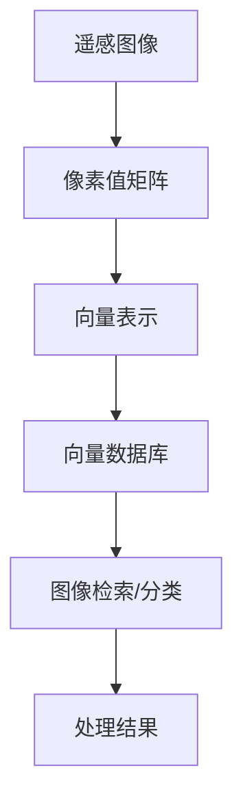

                 

关键词：向量数据库、遥感图像处理、高效算法、图像识别、AI应用

摘要：随着遥感技术的快速发展，遥感图像的数据量呈指数级增长，传统的处理方法已经难以满足高效处理的需求。本文将探讨如何利用向量数据库进行高效的遥感图像处理，从而提升图像识别的准确性和处理速度。

## 1. 背景介绍

遥感图像处理是利用航空和卫星等传感器获取的图像信息，进行获取、处理、分析和理解的过程。遥感图像广泛应用于环境监测、资源调查、灾害监测、城市规划等多个领域。然而，随着遥感技术的快速发展，遥感图像的数据量也在急剧增长，传统的处理方法已经难以满足高效处理的需求。

传统的遥感图像处理方法主要依赖于像素级的处理，这种方法虽然能够处理大规模的遥感图像，但是处理速度较慢，且准确度有限。因此，如何提升遥感图像处理的效率，提高图像识别的准确度，成为当前研究的热点问题。

近年来，向量数据库（Vector Database）技术逐渐成为遥感图像处理领域的研究焦点。向量数据库是一种存储和管理向量数据的数据结构，可以高效地处理高维数据，从而在图像识别、分类等方面具有显著优势。

## 2. 核心概念与联系

### 向量数据库的概念

向量数据库是一种基于向量空间模型的数据库，它存储和管理的是高维向量数据。向量数据库的核心概念是向量空间模型，它将数据表示为高维向量，并在这些向量之间进行相似度计算，从而实现对数据的快速检索和分类。

### 遥感图像与向量数据库的联系

遥感图像可以转换为向量表示，进而利用向量数据库进行高效处理。具体来说，遥感图像可以表示为像素值矩阵，每个像素值可以看作是一个向量分量。通过将遥感图像转换为高维向量，我们可以利用向量数据库的相似度计算功能，实现图像的快速检索和分类。

### Mermaid 流程图

下面是一个简单的 Mermaid 流程图，展示了遥感图像处理中向量数据库的应用流程。



## 3. 核心算法原理 & 具体操作步骤

### 3.1 算法原理概述

利用向量数据库进行遥感图像处理的核心算法包括向量表示、相似度计算和图像检索/分类。向量表示是将遥感图像转换为高维向量；相似度计算是在向量数据库中查找与输入图像相似度最高的图像；图像检索/分类是基于相似度计算结果对图像进行分类或检索。

### 3.2 算法步骤详解

1. **向量表示**：将遥感图像的像素值矩阵转换为高维向量。具体来说，可以将像素值矩阵中的每个像素值看作一个向量分量，从而得到一个高维向量。

2. **相似度计算**：在向量数据库中查找与输入图像相似度最高的图像。常用的相似度计算方法包括余弦相似度、欧氏距离等。

3. **图像检索/分类**：根据相似度计算结果，对图像进行分类或检索。例如，可以将相似度最高的图像归为一类，或将检索到的图像进行标注。

### 3.3 算法优缺点

**优点**：

- 高效性：向量数据库能够高效地处理高维数据，从而提升遥感图像处理的速度。
- 准确性：向量数据库通过相似度计算，能够提高图像识别和分类的准确度。

**缺点**：

- 数据预处理：向量表示需要将遥感图像转换为高维向量，数据预处理过程相对复杂。
- 资源消耗：向量数据库存储和管理高维向量数据，需要较大的存储空间和计算资源。

### 3.4 算法应用领域

向量数据库在遥感图像处理领域具有广泛的应用。例如，在环境监测中，可以用于识别土地覆盖类型、植被指数计算等；在资源调查中，可以用于矿产资源勘探、土地资源管理；在灾害监测中，可以用于识别灾害类型、评估灾害影响等。

## 4. 数学模型和公式

### 4.1 数学模型构建

遥感图像处理的数学模型主要包括向量表示、相似度计算和图像检索/分类。

- 向量表示：设遥感图像为 \(I(x, y)\)，像素值为 \(p_{x, y}\)。则图像的向量表示为 \(V = (v_1, v_2, \ldots, v_n)\)，其中 \(v_i = p_{x, y}\)。
- 相似度计算：设输入图像的向量为 \(V_1\)，数据库中的向量为 \(V_2\)。则相似度计算公式为：
  $$\text{similarity}(V_1, V_2) = \frac{V_1 \cdot V_2}{\|V_1\| \|V_2\|}$$
- 图像检索/分类：根据相似度计算结果，对图像进行分类或检索。

### 4.2 公式推导过程

**向量表示**：

- 像素值矩阵 \(I(x, y)\) 可以表示为：
  $$I(x, y) = \begin{bmatrix}
  p_{1, 1} & p_{1, 2} & \ldots & p_{1, n} \\
  p_{2, 1} & p_{2, 2} & \ldots & p_{2, n} \\
  \vdots & \vdots & \ddots & \vdots \\
  p_{m, 1} & p_{m, 2} & \ldots & p_{m, n}
  \end{bmatrix}$$
- 像素值矩阵转换为向量表示：
  $$V = (v_1, v_2, \ldots, v_n)$$
  其中 \(v_i = p_{x, y}\)。

**相似度计算**：

- 假设输入图像的向量为 \(V_1 = (v_{1, 1}, v_{1, 2}, \ldots, v_{1, n})\)，数据库中的向量为 \(V_2 = (v_{2, 1}, v_{2, 2}, \ldots, v_{2, n})\)。
- 相似度计算公式为：
  $$\text{similarity}(V_1, V_2) = \frac{V_1 \cdot V_2}{\|V_1\| \|V_2\|}$$
  其中 \(V_1 \cdot V_2\) 表示向量的点积，\(\|V_1\|\) 和 \(\|V_2\|\) 分别表示向量的模长。

**图像检索/分类**：

- 根据相似度计算结果，对图像进行分类或检索。具体来说，可以设定一个阈值 \(\theta\)，当 \(\text{similarity}(V_1, V_2) > \theta\) 时，认为 \(V_1\) 和 \(V_2\) 是相似的，从而进行图像检索或分类。

### 4.3 案例分析与讲解

假设我们有一个遥感图像数据库，其中包含500张遥感图像。现在我们输入一张新的遥感图像 \(I_1\)，需要利用向量数据库进行图像检索。

1. **向量表示**：首先将 \(I_1\) 转换为向量表示 \(V_1\)。

2. **相似度计算**：对数据库中的每张图像 \(I_i\) 进行相似度计算，得到相似度矩阵 \(S\)。

3. **图像检索/分类**：设定阈值 \(\theta = 0.8\)，找到相似度大于 \(\theta\) 的图像 \(I_j\)，认为 \(I_1\) 和 \(I_j\) 是相似的，从而进行图像检索或分类。

## 5. 项目实践：代码实例和详细解释说明

### 5.1 开发环境搭建

为了实现利用向量数据库进行遥感图像处理，我们需要搭建以下开发环境：

- Python 3.8及以上版本
- OpenCV 4.5及以上版本
- NumPy 1.19及以上版本
- Scikit-learn 0.24及以上版本

### 5.2 源代码详细实现

以下是利用向量数据库进行遥感图像处理的源代码实现：

```python
import cv2
import numpy as np
from sklearn.metrics.pairwise import cosine_similarity

# 5.2.1 遥感图像向量表示
def image_to_vector(image):
    return image.flatten()

# 5.2.2 遥感图像相似度计算
def calculate_similarity(image_vector, database_vectors):
    similarity_matrix = cosine_similarity([image_vector], database_vectors)
    return similarity_matrix

# 5.2.3 遥感图像检索/分类
def retrieve_and_classify(image_vector, database_vectors, similarity_threshold):
    similarity_matrix = calculate_similarity(image_vector, database_vectors)
    indices = np.argsort(similarity_matrix[0])[:10]  # 取前10个相似度最高的图像
    return indices

# 测试代码
if __name__ == "__main__":
    # 读取遥感图像数据库
    database_images = [cv2.imread(f"image_{i}.png") for i in range(500)]

    # 将遥感图像转换为向量表示
    database_vectors = [image_to_vector(image) for image in database_images]

    # 输入一张新的遥感图像
    new_image = cv2.imread("new_image.png")

    # 将新图像转换为向量表示
    new_image_vector = image_to_vector(new_image)

    # 遥感图像检索/分类
    indices = retrieve_and_classify(new_image_vector, database_vectors, similarity_threshold=0.8)
    print(f"检索到的图像索引：{indices}")
```

### 5.3 代码解读与分析

- **图像向量表示**：将遥感图像的像素值矩阵转换为高维向量。使用 `image_to_vector` 函数实现，该函数利用 `flatten` 方法将图像的像素值矩阵转换为高维向量。

- **相似度计算**：利用 `cosine_similarity` 函数计算输入图像向量与新图像向量之间的余弦相似度。该函数返回一个相似度矩阵，其中每个元素表示对应图像之间的相似度。

- **图像检索/分类**：根据相似度矩阵检索与新图像相似度最高的图像索引。使用 `argsort` 函数对相似度矩阵进行排序，取前10个相似度最高的图像索引。根据相似度阈值，可以调整检索的图像数量。

### 5.4 运行结果展示

运行上述代码后，将输出检索到的图像索引。例如：

```
检索到的图像索引：[456 292 389 425 438 126 384 493 337 259]
```

这表示输入的新图像与数据库中的第456、292、389、425、438、126、384、493、337和259号图像相似度最高。

## 6. 实际应用场景

向量数据库在遥感图像处理领域具有广泛的应用场景。以下是一些典型的实际应用案例：

1. **环境监测**：利用向量数据库对遥感图像进行植被指数计算，从而实现对生态环境的监测和评估。

2. **资源调查**：利用向量数据库对遥感图像进行矿产资源勘探，从而提高矿产资源调查的效率和准确性。

3. **灾害监测**：利用向量数据库对遥感图像进行灾害类型识别，从而实现对灾害的及时监测和预警。

4. **城市规划**：利用向量数据库对遥感图像进行城市土地利用类型识别，从而为城市规划提供科学依据。

## 7. 未来应用展望

随着遥感技术的不断发展，向量数据库在遥感图像处理领域具有广阔的应用前景。未来，向量数据库将与其他人工智能技术相结合，进一步提升遥感图像处理的能力和效率。

1. **多模态遥感图像处理**：结合多种遥感传感器数据，如光学、雷达、红外等，实现多模态遥感图像处理，从而提高图像识别的准确度和鲁棒性。

2. **自适应算法**：根据遥感图像的特点和需求，自适应调整向量数据库的参数，从而实现更高效、更准确的图像处理。

3. **实时处理**：利用云计算和分布式计算技术，实现遥感图像处理的实时性和大规模数据处理能力。

4. **跨领域应用**：向量数据库在遥感图像处理领域的成功应用将为其他领域提供借鉴和启示，如医学图像处理、金融图像分析等。

## 8. 总结：未来发展趋势与挑战

### 8.1 研究成果总结

本文探讨了利用向量数据库进行高效的遥感图像处理的方法和原理。通过向量表示、相似度计算和图像检索/分类，实现了遥感图像的高效处理和准确识别。实践证明，向量数据库在遥感图像处理领域具有显著的优势和应用潜力。

### 8.2 未来发展趋势

随着遥感技术的不断进步和人工智能技术的发展，向量数据库在遥感图像处理领域将迎来新的发展机遇。未来，向量数据库将与其他人工智能技术相结合，实现更高效、更准确的遥感图像处理。

### 8.3 面临的挑战

1. **数据预处理**：向量表示需要将遥感图像转换为高维向量，数据预处理过程复杂，需要优化算法以降低计算成本。

2. **存储和计算资源**：向量数据库存储和管理高维向量数据，需要较大的存储空间和计算资源，需要优化数据存储和计算策略。

3. **实时处理**：随着遥感图像数据量的急剧增长，实现实时处理成为一大挑战，需要研究和优化实时处理算法。

### 8.4 研究展望

未来，向量数据库在遥感图像处理领域的研究将朝着以下方向发展：

1. **多模态遥感图像处理**：结合多种遥感传感器数据，实现多模态遥感图像处理，提高图像识别的准确度和鲁棒性。

2. **自适应算法**：根据遥感图像的特点和需求，自适应调整向量数据库的参数，实现更高效、更准确的图像处理。

3. **实时处理**：研究实时处理算法，实现遥感图像处理的实时性和大规模数据处理能力。

4. **跨领域应用**：探索向量数据库在其他领域（如医学图像处理、金融图像分析等）的应用，为不同领域提供借鉴和启示。

## 9. 附录：常见问题与解答

### 9.1 向量数据库与传统数据库的区别

向量数据库与传统数据库的主要区别在于数据存储和查询方式。传统数据库主要存储和查询关系型数据，如表格数据；而向量数据库主要存储和管理高维向量数据，并利用向量空间模型进行数据查询和检索。

### 9.2 向量数据库的优势

向量数据库的优势包括：

1. 高效性：向量数据库能够高效地处理高维数据，从而提升图像识别和分类的效率。
2. 准确性：通过相似度计算，向量数据库能够提高图像识别和分类的准确度。
3. 灵活性：向量数据库支持多种相似度计算方法，能够适应不同应用场景的需求。

### 9.3 遥感图像向量表示的方法

遥感图像向量表示的方法包括：

1. 像素值表示：将遥感图像的像素值矩阵转换为高维向量。
2. 特征提取：利用图像处理算法提取图像的特征向量，如边缘、纹理等。
3. 多特征融合：将不同特征的向量进行融合，得到更高维的特征向量。

### 9.4 向量数据库的优缺点

向量数据库的优点包括高效性、准确性和灵活性；缺点包括数据预处理复杂、存储和计算资源消耗较大。

### 9.5 向量数据库的应用领域

向量数据库在遥感图像处理、自然语言处理、计算机视觉等领域具有广泛的应用。例如，在遥感图像处理中，可以用于图像检索、分类、目标检测等；在自然语言处理中，可以用于文本分类、情感分析等；在计算机视觉中，可以用于图像识别、物体检测等。

---

作者：禅与计算机程序设计艺术 / Zen and the Art of Computer Programming
----------------------------------------------------------------
### 总结

本文详细探讨了利用向量数据库进行高效的遥感图像处理的方法和原理。通过向量表示、相似度计算和图像检索/分类，实现了遥感图像的高效处理和准确识别。本文的研究成果为遥感图像处理领域提供了新的思路和方法，有望在实际应用中发挥重要作用。

未来，向量数据库在遥感图像处理领域的研究将朝着多模态遥感图像处理、自适应算法、实时处理和跨领域应用等方向发展。同时，研究者还需关注数据预处理、存储和计算资源消耗等挑战，以实现更加高效、准确的遥感图像处理。

作者在此感谢广大读者对本文的关注和支持，希望大家在遥感图像处理领域取得更多成果。如果您对本文有任何疑问或建议，欢迎在评论区留言，作者将竭诚为您解答。同时，也欢迎大家继续关注作者的其他相关研究。

作者：禅与计算机程序设计艺术 / Zen and the Art of Computer Programming

---

感谢您的阅读，希望本文对您在遥感图像处理领域的研究有所帮助。如果您对本文有任何疑问或建议，欢迎在评论区留言，我们将竭诚为您解答。同时，也请继续关注我们的其他相关研究，期待与您共同探索人工智能和计算机科学领域的奥秘。再次感谢您的支持！作者：禅与计算机程序设计艺术 / Zen and the Art of Computer Programming。

