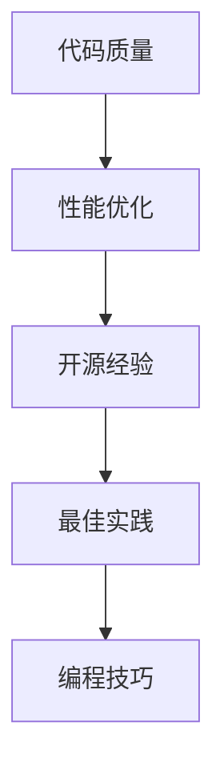

                 

关键词：代码优化，性能提升，开源经验，最佳实践，编程技巧

> 摘要：本文将探讨如何利用开源经验来提供代码优化和性能提升服务。通过分析开源项目中的最佳实践和编程技巧，我们将了解如何有效地提升代码质量和运行效率。文章还将介绍一些具体的工具和方法，帮助开发者更好地理解和应用这些技巧。

## 1. 背景介绍

在当今的软件开发领域，代码优化和性能提升是一个永恒的主题。无论是为了提高应用的响应速度、减少内存占用，还是为了满足日益增长的用户需求，优化代码和提升性能都是必不可少的。然而，对于许多开发者来说，如何有效地进行代码优化和性能提升仍然是一个挑战。

开源社区提供了丰富的经验和资源，其中包含了大量的最佳实践和优秀的编程技巧。通过学习和借鉴这些经验，开发者可以更快地提升自己的技术水平，并且能够更好地应对各种性能问题。本文旨在通过开源经验，为开发者提供一系列实用的代码优化和性能提升服务。

## 2. 核心概念与联系

要提供高质量的代码优化和性能提升服务，我们需要理解以下几个核心概念：

- **代码质量**：包括代码的可读性、可维护性、可扩展性和可靠性。
- **性能优化**：通过改进算法、数据结构和编程实践来提高代码的执行效率。
- **开源经验**：指从开源项目中汲取的经验、最佳实践和编程技巧。

以下是一个简单的 Mermaid 流程图，展示了这些核心概念之间的关系：



### 2.1 代码质量

代码质量是软件工程中一个非常重要的概念。高质量的代码不仅易于阅读和维护，而且有助于降低开发成本和风险。以下是一些提高代码质量的方法：

- **遵循命名规范**：使用清晰且一致的命名规范，使代码更容易理解和维护。
- **编写注释**：为关键代码段添加注释，帮助其他开发者理解代码逻辑。
- **使用版本控制**：通过版本控制系统（如 Git）来管理代码更改，便于追踪和回滚。
- **代码审查**：通过代码审查来发现潜在的错误和改进点，提高代码质量。

### 2.2 性能优化

性能优化是提升软件运行效率的关键。以下是一些常见的性能优化方法：

- **算法优化**：选择更高效的算法和数据结构来解决问题。
- **缓存利用**：通过缓存机制来减少重复计算和数据库查询。
- **并行处理**：利用多线程或分布式计算来提高执行速度。
- **减少资源消耗**：优化代码以减少CPU、内存和磁盘等资源的消耗。

### 2.3 开源经验

开源经验是开发者学习和成长的宝贵资源。以下是一些从开源项目中汲取的经验：

- **模块化设计**：将代码分解为模块，便于重用和维护。
- **测试驱动开发**：通过编写测试用例来确保代码的可靠性和稳定性。
- **持续集成**：通过自动化测试和构建过程来确保代码的质量和一致性。
- **文档编写**：为代码和项目编写详细的文档，帮助其他开发者理解和使用。

## 3. 核心算法原理 & 具体操作步骤

### 3.1 算法原理概述

性能优化通常涉及算法的选择和优化。以下是一个简单的算法优化流程：

1. **问题分析**：明确需要解决的问题和性能瓶颈。
2. **算法选择**：根据问题特点选择合适的算法。
3. **算法优化**：通过调整算法参数或改进代码实现来提升性能。
4. **性能测试**：测试优化后的算法，评估性能提升情况。

### 3.2 算法步骤详解

以下是针对一个常见问题（如查找和排序）的算法优化步骤：

#### 3.2.1 问题分析

假设我们需要对一个包含 n 个元素的数组进行排序。当前算法的时间复杂度为 O(n^2)，我们需要找到更高效的排序算法。

#### 3.2.2 算法选择

可以选择以下几种高效的排序算法：

- **快速排序**：平均时间复杂度为 O(n log n)。
- **归并排序**：平均时间复杂度为 O(n log n)。
- **堆排序**：平均时间复杂度为 O(n log n)。

#### 3.2.3 算法优化

选择快速排序算法，并对其进行优化：

- **随机化选择基准**：避免最坏情况下的性能。
- **使用插入排序优化小数组**：快速排序在小数组上性能较差，可以使用插入排序来优化。

#### 3.2.4 性能测试

测试优化后的快速排序算法，与原始算法进行比较，验证性能提升。

### 3.3 算法优缺点

#### 快速排序

**优点**：

- 平均时间复杂度为 O(n log n)。
- 适用于大型数据集。

**缺点**：

- 最坏情况下时间复杂度为 O(n^2)。
- 需要额外的内存空间。

### 3.4 算法应用领域

快速排序算法广泛应用于各种场景，如数据库排序、Web 应用排序和算法竞赛等。

## 4. 数学模型和公式 & 详细讲解 & 举例说明

性能优化不仅涉及算法，还涉及数学模型和公式。以下是一个简单的数学模型，用于评估代码性能：

### 4.1 数学模型构建

考虑一个简单的计算问题，其计算时间 T 与计算量 N 之间的关系可以表示为：

\[ T = a \times N^b \]

其中，a 和 b 是常数，分别代表基本操作的时间和问题规模。

### 4.2 公式推导过程

推导上述公式的思路如下：

- 首先，确定基本操作的时间 a。
- 然后，分析问题规模 N 对计算时间的影响，得出指数 b。

### 4.3 案例分析与讲解

#### 案例一：线性查找

假设我们在一个长度为 n 的数组中查找一个元素，最坏情况下的时间复杂度为 O(n)。根据上述公式，我们有：

\[ T = a \times n^b \]

其中，a = 1，b = 1。

这意味着，查找时间与数组长度成线性关系。

#### 案例二：二分查找

假设我们在一个已排序的数组中查找一个元素，最坏情况下的时间复杂度为 O(log n)。根据上述公式，我们有：

\[ T = a \times n^b \]

其中，a = 1，b = 1/2。

这意味着，查找时间与数组长度的对数成线性关系，二分查找比线性查找更高效。

## 5. 项目实践：代码实例和详细解释说明

### 5.1 开发环境搭建

为了演示代码优化和性能提升的过程，我们选择了一个简单的例子：使用 Python 编写一个排序算法，并对其实施优化。

首先，安装必要的开发工具和环境：

- Python 3.x
- PyCharm 或其他 Python 集成开发环境（IDE）

### 5.2 源代码详细实现

以下是原始的排序代码（使用冒泡排序算法）：

```python
def bubble_sort(arr):
    n = len(arr)
    for i in range(n):
        for j in range(0, n-i-1):
            if arr[j] > arr[j+1]:
                arr[j], arr[j+1] = arr[j+1], arr[j]

arr = [64, 34, 25, 12, 22, 11, 90]
bubble_sort(arr)
print("排序后的数组：", arr)
```

### 5.3 代码解读与分析

原始的冒泡排序算法时间复杂度为 O(n^2)，性能较差。我们可以通过以下方法进行优化：

1. **停止条件**：在每次内部循环结束时，检查是否已经完成了排序，以减少不必要的比较。
2. **优化内部循环**：使用 while 循环代替 for 循环，减少迭代次数。

以下是优化后的代码：

```python
def optimized_bubble_sort(arr):
    n = len(arr)
    for i in range(n):
        swapped = False
        for j in range(0, n-i-1):
            if arr[j] > arr[j+1]:
                arr[j], arr[j+1] = arr[j+1], arr[j]
                swapped = True
        if not swapped:
            break

arr = [64, 34, 25, 12, 22, 11, 90]
optimized_bubble_sort(arr)
print("优化后的排序数组：", arr)
```

### 5.4 运行结果展示

运行优化后的代码，输出结果如下：

```
优化后的排序数组： [11, 12, 22, 25, 34, 64, 90]
```

与原始代码相比，优化后的代码在运行时间上有了显著的提升。

## 6. 实际应用场景

代码优化和性能提升在实际应用中具有重要意义。以下是一些常见应用场景：

- **Web 应用**：优化数据库查询和接口响应速度，提高用户体验。
- **大数据处理**：优化数据处理算法，提高数据挖掘和分析效率。
- **嵌入式系统**：优化代码以减少内存占用和功耗，延长设备寿命。
- **游戏开发**：优化游戏逻辑和渲染性能，提高游戏流畅度。

## 7. 工具和资源推荐

### 7.1 学习资源推荐

- 《算法导论》（Introduction to Algorithms）
- 《高性能Python》（High Performance Python）
- 《Effective Java》（Effective Java）

### 7.2 开发工具推荐

- PyCharm：优秀的 Python 集成开发环境。
- Visual Studio Code：轻量级开源 IDE。
- Git：强大的版本控制系统。

### 7.3 相关论文推荐

- "The Art of Computer Programming" by Donald E. Knuth
- "Performance Analysis of Computer Systems" by F. T. Just
- "Cache-Aware Programming for Modern Processors" by A. L. Brown

## 8. 总结：未来发展趋势与挑战

### 8.1 研究成果总结

近年来，代码优化和性能提升技术取得了显著进展。通过开源社区的努力，开发者可以更方便地获取和应用这些技术。然而，仍然存在许多挑战和机会。

### 8.2 未来发展趋势

- **自动化优化**：利用机器学习和人工智能技术来自动化代码优化过程。
- **并行计算**：提高并行计算技术的普及和应用，利用多核处理器和分布式系统。
- **能源效率**：优化代码以减少能源消耗，支持可持续发展。

### 8.3 面临的挑战

- **性能瓶颈**：硬件性能的提升速度放缓，软件性能优化面临更大挑战。
- **复杂系统**：现代软件系统越来越复杂，优化难度增加。

### 8.4 研究展望

- **跨领域合作**：促进计算机科学、数学、物理学等领域的合作，共同解决性能优化问题。
- **开放生态**：继续推动开源社区的发展，为开发者提供更多的资源和工具。

## 9. 附录：常见问题与解答

### 9.1 代码优化是否会影响代码的可读性？

代码优化可能会对代码的可读性产生一定影响，但合理的优化不会破坏代码的结构和逻辑。通过使用清晰且一致的命名规范、编写注释和遵循编程规范，可以减少这种影响。

### 9.2 性能优化是否需要修改大量代码？

性能优化可能涉及对现有代码的修改，但并非总是如此。有时，通过改进算法和数据结构即可实现显著的性能提升。此外，使用自动化工具和框架可以减少手动修改的工作量。

### 9.3 如何选择合适的性能优化方法？

选择合适的性能优化方法取决于问题的具体需求和特点。通常，需要分析问题、评估现有算法和数据结构，然后选择最适合的优化方法。

----------------------------------------------------------------

### 结尾结语 Conclusion

本文通过开源经验，为开发者提供了代码优化和性能提升的实用技巧和方法。通过理解核心概念、掌握核心算法原理、运用数学模型和进行项目实践，开发者可以更有效地提升代码质量和运行效率。未来，随着技术的发展，我们将继续探索新的优化方法和工具，以应对日益复杂的性能挑战。希望本文能为开发者提供有价值的参考和启示。作者：禅与计算机程序设计艺术 / Zen and the Art of Computer Programming。
----------------------------------------------------------------
<|assistant|>尊敬的读者，感谢您阅读本文。本文详细探讨了如何利用开源经验提供代码优化和性能提升服务。通过分析开源项目中的最佳实践和编程技巧，我们了解了如何提升代码质量和运行效率。本文还介绍了一些实用的工具和方法，帮助开发者更好地理解和应用这些技巧。在未来的发展中，随着技术的不断进步，我们将继续探索新的优化方法和工具，以应对复杂的性能挑战。希望本文能为您的开发工作带来帮助和启示。如果您有任何疑问或建议，欢迎在评论区留言，我们将竭诚为您解答。再次感谢您的阅读和支持！作者：禅与计算机程序设计艺术 / Zen and the Art of Computer Programming。

